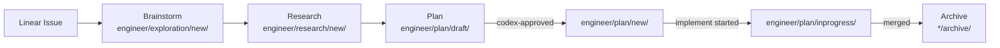

# Flywheel — Project CLAUDE.md

## Onboarding

New session? Run `/onboarding` or read these files in order:

1. **Product Experience** → `doc/architecture/product-experience-spec.md` (**必读** — 定义了产品应该长什么样，所有开发工作的 source of truth)
2. **Memory** → `~/.claude/projects/-Users-xiaorongli-Dev-flywheel/memory/MEMORY.md` (decisions, architecture, current progress)
3. **Active Explorations** (read based on task):
   - `doc/engineer/exploration/new/FLY-52-product-experience-deep-design.md` — Product brainstorm Q&A (FLY-52)
   - `doc/engineer/exploration/new/v0.3-memory-system.md` — per-project memory (GEO-145)
   - `doc/engineer/exploration/new/v0.4-voice-interface.md` — push/pull voice channel for CEO (GEO-150)
   - `doc/engineer/exploration/new/v0.5-remote-screenshot.md` — visual Slack notifications (GEO-151)
   - `doc/engineer/exploration/new/v0.6-slack-threading.md` — Slack threading + workflow engine (GEO-148)
   - `doc/engineer/exploration/new/v1.0-lead-experience.md` — Lead MVP experience (GEO-146)
   - `doc/engineer/exploration/new/v1.1-multi-lead.md` — Multi-lead agents (GEO-152)
4. **Reference** → `doc/reference/ralph-patterns.md` + `doc/reference/auto-claude-patterns.md`

Archived docs are in `doc/*/archive/` — read only if you need historical context.

## What Is Flywheel

TypeScript orchestrator (forked from [Cyrus](https://github.com/ceedaragents/cyrus)):

```
Linear issues → DAG resolver → Claude Code sessions (tmux) → auto PR
                                        ↓ (completed/failed)
                              Decision Layer → Bridge API → Discord Lead → CEO
```

**Goal**: Autonomous dev workflow — human attention is the bottleneck, not AI capability. CEO sets direction, Flywheel executes continuously, only escalating when it genuinely needs a human decision.

## Current Phase

**v1.0 Phase 1 complete** — Lead MVP + Memory System operational. Trial run in progress.

Current version: see `doc/VERSION`

| Milestone | Status |
|-----------|--------|
| v0.1.0 Core Loop (headless `--print` mode) | ✅ Merged (PR #3) |
| v0.1.1 Interactive Runner (tmux sessions) | ✅ Merged (PR #4) |
| v0.2 Parallel + Decision + Slack | ✅ Merged (PR #5-9) |
| v0.4 TeamLead Daemon | ✅ Merged (PR #10) |
| v0.5 OpenClaw Bridge + Actions | ✅ Merged (PR #12 + main) |
| v0.3 Step 1 Memory System (mem0 + Gemini) | ✅ Merged (PR #16) |
| v1.0 Phase 1 Lead MVP | ✅ Merged (main) |
| GEO-145: Memory Production (Supabase pgvector) | ✅ Merged (PR #18) |
| GEO-155: v1.0 Phase 2 (disable auto-approve) | ✅ Merged (PR #17) |
| GEO-158: Jido Directive FSM (WorkflowFSM + audit) | ✅ Merged (PR #23) |
| GEO-206: Lead ↔ Runner comm (Phase 1+2) | ✅ Merged (PR #40-42). Phase 3+4 pending |
| GEO-246: Multi-Lead Architecture | ✅ Merged (PR #44, #45) |
| GEO-252: Per-Lead Bot Token | ✅ Merged (PR #46) |
| GEO-253: Per-Lead StatusTagMap | ✅ Merged (PR #47) |
| GEO-267: Lead Auto-Start Runner (Phase 1 Engine) | ✅ Merged (PR #53) |
| GEO-274: Lead Start Ability (Phase 2 Agent Config) | ✅ Merged (Flywheel PR #56, GeoForge3D PR #93) |
| GEO-258: setup-discord-lead Permission Fix | ✅ Merged (PR #58) |
| GEO-270: Stale Session Patrol + close-tmux | ✅ Merged (PR #57) |
| GEO-269: tmux Session/Window Naming | ✅ Merged (PR #55) |
| GEO-277: Runner Terminal Auto-Open | ✅ Merged (PR #60) |
| GEO-276: PM Auto-Triage (Phase 1) | ✅ Merged (Flywheel PR #62, GeoForge3D PR #98) |
| GEO-275: Simba Chief of Staff + Core Channel (Phase 3) | ✅ Merged (Flywheel PR #59, GeoForge3D PR #96) |
| GEO-291: Flywheel Orchestrator | ✅ Merged (PR #64) |
| GEO-298: Linear Team Reorg (create-issue team/project) | ✅ Merged (PR #65) |
| GEO-296: Fork claude-plugins-official (bot-to-bot) | ✅ Merged (PR #66) |
| FLY-1: Vitest watch mode fix | ✅ Merged (PR #72) |
| GEO-286: Lead Workspace per-Lead subdirectory | ✅ Merged (PR #67) |
| GEO-280: Sprint closing — Bridge tmux auto-close | ✅ Merged (PR #69) |
| GEO-288: Daily Standup v2 — system status + cron trigger | ✅ Merged (PR #70, GeoForge3D PR #105) |
| GEO-285: Lead Context Window — crash recovery + PostCompact hook | ✅ Merged (PR #68) |
| GEO-254: flywheel-comm E2E integration tests | ✅ Merged (PR #71) |
| GEO-302: Fix CI lint failures (biome formatting) | ✅ Merged (PR #73) |
| GEO-200: Forum Thread link "unknown" — thread validation + stale cleanup | ✅ Merged (PR #75) |
| FLY-2: Ship :cool: flow — CI green gate before merge | ✅ Merged (PR #76) |
| GEO-203: Claude Lead mem0 memory — dual-bucket model | ✅ Merged (Flywheel PR #78, GeoForge3D PR #112) |
| GEO-294: Triage HTML Report — publish-html + Vercel deploy | ✅ Merged (Flywheel PR #74, GeoForge3D PR #114) |
| FLY-27: Triage HTML template endpoint — Bridge static serve + deep optimization | ✅ Merged (PR #89) |
| FLY-26: Lead rules scalability — identity.md + shared rules split | ✅ Merged (Flywheel PR #87, GeoForge3D PR #122) |
| FLY-11: Terminal MCP tool — Lead reads/writes Runner tmux | ✅ Merged (PR #88) |
| FLY-20: Auto-restart Bridge + Lead after merge — CD flow + Discord plugin fork detection | ✅ Merged (PR #90) |
| FLY-29: Typing indicator idle timeout — auto-stop on no-reply | ✅ Merged (Plugin Fork PR #2) |
| FLY-47: Channel Contract — unified gate + checkpoint system | ✅ Merged (PR #119) |
| FLY-62: Lead Auto-Relay — Bridge→Lead gate question routing | ✅ Merged (PR #119) |
| FLY-64: Daily Standup Bridge auto-start + env config | ✅ Merged (PR #117) |
| FLY-67: OpenClaw runtime + gateway cleanup | ✅ Merged (PR #114) |
| FLY-59: Session Role/Lane Modeling | ✅ Merged (PR #123) |
| FLY-51 + FLY-58: Approve/Ship two-step flow + Runner tmux lifecycle | ✅ Merged (PR #122) |
| FLY-71: Standup channel/bot fix + triage execution gate | ✅ Merged (Flywheel PR #121, GeoForge3D PR #155) |
| FLY-92: Runner idle watchdog — system-level idle detection + bubble up | ✅ Merged (PR #137) |
| FLY-96: QA testing infrastructure — 4-slot parallel Discord E2E (1 cos + 3 lead) | ✅ Merged (PR #144) |
| FLY-115: QA Test Slot Framework — Real Runner Support (A1 + W1 + F1) | ✅ Merged (PR #157) |
| FLY-108: Runner-driven session_completed + Bridge route guard | ✅ Merged (PR #1) |
| FLY-99: QA pipeline execution — milestone record | ✅ Merged |

## Doc Structure & Lifecycle

```
doc/
├── architecture/{archive}/             — Unified architecture docs
├── engineer/                           — Engineer work area
│   ├── exploration/{new,backlog,archive}/  — Product exploration / design docs
│   ├── research/{new,archive}/             — Technical research / evaluations
│   ├── plan/{draft,new,inprogress,archive,backlog}/ — Implementation plans
│   ├── deep-research/                      — External LLM research results
│   └── implementation/                     — Implementation notes
├── reference/                          — Reference docs (Cyrus, Ralph, patterns)
├── retro/                              — Retrospectives
└── VERSION                             — Current version number
```

### Development Pipeline

Every feature follows this pipeline. **Linear issue is the single source of truth.**



**Slash commands per stage:**

| Stage | Command |
|-------|---------|
| Brainstorm | `/brainstorm` |
| Research | `/research` |
| Plan | `/write-plan` → `/codex-design-review` |
| Implement | `/implement {plan-file}` |
| Code Review | `/codex-code-review` or `/gemini-code-review` |

### File Naming Conventions

**MANDATORY**: Always include version + GEO issue ID in filenames.

| Type | Pattern | Example |
|------|---------|---------|
| Exploration | `GEO-{XX}-{slug}.md` | `GEO-145-memory-production.md` |
| Research | `GEO-{XX}-{topic}.md` | `GEO-145-supabase-pgvector.md` |
| Plan | `v{version}-GEO-{XX}-{slug}.md` | `v1.2.0-GEO-145-memory-production.md` |

Research files may also use a sequential number prefix: `{NNN}-GEO-{XX}-{slug}.md`

### Document Frontmatter

Every document MUST start with a structured metadata block:

**Exploration:**
```markdown
# Exploration: {Title} — GEO-{XX}

**Issue**: GEO-{XX} ({title})
**Date**: {YYYY-MM-DD}
**Status**: Draft | Complete
```

**Research:**
```markdown
# Research: {Title} — GEO-{XX}

**Issue**: GEO-{XX}
**Date**: {YYYY-MM-DD}
**Source**: `doc/engineer/exploration/new/GEO-{XX}-{slug}.md`
```

**Plan:**
```markdown
# Plan: {Title}

**Version**: v{X.Y.Z}
**Issue**: GEO-{XX}
**Date**: {YYYY-MM-DD}
**Source**: `doc/engineer/exploration/new/GEO-{XX}-{slug}.md`, `doc/engineer/research/new/GEO-{XX}-{slug}.md`
**Status**: draft | codex-approved
```

### Plan Status Flow

```
plan/draft/      → Codex design review not yet passed
plan/new/        → Codex approved, ready for /implement
plan/inprogress/ → Implementation started (branch exists)
plan/archive/    → Implementation merged (or abandoned with reason)
plan/backlog/    → Written but implementation deferred
```

When a plan passes Codex design review: `git mv doc/engineer/plan/draft/{file} doc/engineer/plan/new/{file}`
When implementation starts: `git mv doc/engineer/plan/new/{file} doc/engineer/plan/inprogress/{file}`
When PR merges: `git mv doc/engineer/plan/inprogress/{file} doc/engineer/plan/archive/{file}`

### Document Lifecycle Rules

**A document can only be archived when its downstream artifact exists.**

**Archive rules:**
- **Exploration** → archive when Research is complete (or when it's a reference-only doc with no further action)
- **Research** → archive when Plan is complete
- **Plan** → archive when Implementation is merged (or abandoned with documented reason)
- **Never archive** a document whose downstream stage hasn't been done yet

**Backlog rules:**
- `doc/engineer/exploration/backlog/` — explorations deferred intentionally (not abandoned, will return to later)
- `doc/engineer/plan/backlog/` — plans written but implementation deferred

**When moving to archive, do NOT delete.** Just `git mv` to the `archive/` subdirectory. The file keeps its name.

**After archiving, update:**
1. This CLAUDE.md (remove from "Active Explorations" list)
2. MEMORY.md doc index (update path and status)
3. Linear issue (mark as Done)

## Key Architecture Decisions

| Decision | Choice |
|----------|--------|
| Base | Fork Cyrus (~80% reuse) |
| Notification | **Discord** via Claude Code Lead agents |
| Memory | Per-project (`.flywheel/` in each project repo) — deferred |
| Decision Layer | Hard Rules + Haiku Triage + Verify + Route |
| Runner | Claude Code CLI via tmux |
| Cost tracking | N/A (Claude subscription, no per-token billing) |

## Tech Stack

- **Runtime**: Node.js / TypeScript
- **Base**: Cyrus fork (pnpm monorepo)
- **AI**: Spawn Claude Code CLI via `IAgentRunner`; Haiku for Decision Layer
- **Storage**: SQLite (`sql.js`) for StateStore
- **Issue tracking**: Linear (`@linear/sdk`)
- **VCS**: GitHub
- **Agent**: Claude Code CLI Lead agents → Discord

## Linear Project

- **GeoForge3D Team** (prefix: GEO) — 产品 issue + 历史 Flywheel issue
- **Flywheel Team** (prefix: FLY) — 新 Flywheel 基础设施 issue
- **Project**: Flywheel (ID: `764d7ab4-9a3b-43ea-99d9-7e881bb3b376`)

> **过渡期规则**:
> - 历史 Flywheel issue 仍在 GEO- team 下，不迁移
> - 查询 Flywheel issue: 按 project name 过滤（自动覆盖两个 team）
> - 新建 Flywheel issue: **必须**指定 `team: "FLY"` 和 `project: "Flywheel"`
> - 当 GEO- 下 active Flywheel issue 归零后，移除此过渡期说明

## Core Behaviors

- **Surface assumptions**: Before implementing anything non-trivial, list your assumptions explicitly. Never silently fill in ambiguous requirements.
- **Push back**: You are not a yes-machine. Point out problems directly, explain downsides, propose alternatives.
- **Enforce simplicity**: Actively resist overcomplication. Prefer the boring, obvious solution.
- **Scope discipline**: Touch only what you're asked to touch. No unsolicited cleanup.
- **Dead code hygiene**: After refactoring, list newly unreachable code and ask before removing.
- **Confusion = stop**: On inconsistencies or unclear specs, stop and ask.

## Non-Negotiables

- External input must be validated at system boundaries.
- Handle failure paths explicitly — no silent swallowing of errors.
- No hardcoded secrets; use environment variables or config.
- Auth/authz boundaries must be verified, not assumed.

## Agent Strategy

- Independent checks/tasks should run in parallel (use multiple Task calls in one message).
- Complex changes: call planner agent first, code-reviewer agent after implementation.

## Output

After modifications, summarize: what changed and why, what you intentionally left alone, potential concerns.

## Mermaid Diagrams

Prefer Mermaid diagrams for plans, architecture docs, and any document describing flows or relationships.
