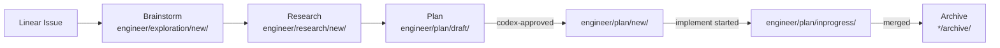

# Flywheel — Project CLAUDE.md

## Onboarding

New session? Run `/onboarding` or read these files in order:

1. **Product Experience** → `doc/architecture/product-experience-spec.md` (**必读** — 定义了产品应该长什么样，所有开发工作的 source of truth)
2. **Memory** → `~/.claude/projects/-Users-xiaorongli-Dev-flywheel/memory/MEMORY.md` (decisions, architecture, current progress)
3. **Active Explorations** (read based on task):
   - `doc/engineer/exploration/new/FLY-52-product-experience-deep-design.md` — Product brainstorm Q&A (FLY-52)
   - `doc/engineer/exploration/new/v0.3-memory-system.md` — per-project memory (GEO-145)
   - `doc/engineer/exploration/new/v0.4-voice-interface.md` — push/pull voice channel for CEO (GEO-150)
   - `doc/engineer/exploration/new/v0.5-remote-screenshot.md` — visual Slack notifications (GEO-151)
   - `doc/engineer/exploration/new/v0.6-slack-threading.md` — Slack threading + workflow engine (GEO-148)
   - `doc/engineer/exploration/new/v1.0-lead-experience.md` — Lead MVP experience (GEO-146)
   - `doc/engineer/exploration/new/v1.1-multi-lead.md` — Multi-lead agents (GEO-152)
4. **Reference** → `doc/reference/ralph-patterns.md` + `doc/reference/auto-claude-patterns.md`

Archived docs are in `doc/*/archive/` — read only if you need historical context.

## What Is Flywheel

TypeScript orchestrator (forked from [Cyrus](https://github.com/ceedaragents/cyrus)):

```
Linear issues → DAG resolver → Claude Code sessions (tmux) → auto PR
                                        ↓ (completed/failed)
                              Decision Layer → Bridge API → Discord Lead → CEO
```

**Goal**: Autonomous dev workflow — human attention is the bottleneck, not AI capability. CEO sets direction, Flywheel executes continuously, only escalating when it genuinely needs a human decision.

## Current Phase

**v1.0 Phase 1 complete** — Lead MVP + Memory System operational. Trial run in progress.

Current version: see `doc/VERSION`

| Milestone | Status |
|-----------|--------|
| v0.1.0 Core Loop (headless `--print` mode) | ✅ Merged (PR #3) |
| v0.1.1 Interactive Runner (tmux sessions) | ✅ Merged (PR #4) |
| v0.2 Parallel + Decision + Slack | ✅ Merged (PR #5-9) |
| v0.4 TeamLead Daemon | ✅ Merged (PR #10) |
| v0.5 OpenClaw Bridge + Actions | ✅ Merged (PR #12 + main) |
| v0.3 Step 1 Memory System (mem0 + Gemini) | ✅ Merged (PR #16) |
| v1.0 Phase 1 Lead MVP | ✅ Merged (main) |
| GEO-145: Memory Production (Supabase pgvector) | ✅ Merged (PR #18) |
| GEO-155: v1.0 Phase 2 (disable auto-approve) | ✅ Merged (PR #17) |
| GEO-158: Jido Directive FSM (WorkflowFSM + audit) | ✅ Merged (PR #23) |
| GEO-206: Lead ↔ Runner comm (Phase 1+2) | ✅ Merged (PR #40-42). Phase 3+4 pending |
| GEO-246: Multi-Lead Architecture | ✅ Merged (PR #44, #45) |
| GEO-252: Per-Lead Bot Token | ✅ Merged (PR #46) |
| GEO-253: Per-Lead StatusTagMap | ✅ Merged (PR #47) |
| GEO-267: Lead Auto-Start Runner (Phase 1 Engine) | ✅ Merged (PR #53) |
| GEO-274: Lead Start Ability (Phase 2 Agent Config) | ✅ Merged (Flywheel PR #56, GeoForge3D PR #93) |
| GEO-258: setup-discord-lead Permission Fix | ✅ Merged (PR #58) |
| GEO-270: Stale Session Patrol + close-tmux | ✅ Merged (PR #57) |
| GEO-269: tmux Session/Window Naming | ✅ Merged (PR #55) |
| GEO-277: Runner Terminal Auto-Open | ✅ Merged (PR #60) |
| GEO-276: PM Auto-Triage (Phase 1) | ✅ Merged (Flywheel PR #62, GeoForge3D PR #98) |
| GEO-275: Simba Chief of Staff + Core Channel (Phase 3) | ✅ Merged (Flywheel PR #59, GeoForge3D PR #96) |
| GEO-291: Flywheel Orchestrator | ✅ Merged (PR #64) |
| GEO-298: Linear Team Reorg (create-issue team/project) | ✅ Merged (PR #65) |
| GEO-296: Fork claude-plugins-official (bot-to-bot) | ✅ Merged (PR #66) |
| FLY-1: Vitest watch mode fix | ✅ Merged (PR #72) |
| GEO-286: Lead Workspace per-Lead subdirectory | ✅ Merged (PR #67) |
| GEO-280: Sprint closing — Bridge tmux auto-close | ✅ Merged (PR #69) |
| GEO-288: Daily Standup v2 — system status + cron trigger | ✅ Merged (PR #70, GeoForge3D PR #105) |
| GEO-285: Lead Context Window — crash recovery + PostCompact hook | ✅ Merged (PR #68) |
| GEO-254: flywheel-comm E2E integration tests | ✅ Merged (PR #71) |
| GEO-302: Fix CI lint failures (biome formatting) | ✅ Merged (PR #73) |
| GEO-200: Forum Thread link "unknown" — thread validation + stale cleanup | ✅ Merged (PR #75) |
| FLY-2: Ship :cool: flow — CI green gate before merge | ✅ Merged (PR #76) |
| GEO-203: Claude Lead mem0 memory — dual-bucket model | ✅ Merged (Flywheel PR #78, GeoForge3D PR #112) |
| GEO-294: Triage HTML Report — publish-html + Vercel deploy | ✅ Merged (Flywheel PR #74, GeoForge3D PR #114) |
| FLY-27: Triage HTML template endpoint — Bridge static serve + deep optimization | ✅ Merged (PR #89) |
| FLY-26: Lead rules scalability — identity.md + shared rules split | ✅ Merged (Flywheel PR #87, GeoForge3D PR #122) |
| FLY-11: Terminal MCP tool — Lead reads/writes Runner tmux | ✅ Merged (PR #88) |
| FLY-20: Auto-restart Bridge + Lead after merge — CD flow + Discord plugin fork detection | ✅ Merged (PR #90) |
| FLY-29: Typing indicator idle timeout — auto-stop on no-reply | ✅ Merged (Plugin Fork PR #2) |
| FLY-47: Channel Contract — unified gate + checkpoint system | ✅ Merged (PR #119) |
| FLY-62: Lead Auto-Relay — Bridge→Lead gate question routing | ✅ Merged (PR #119) |
| FLY-64: Daily Standup Bridge auto-start + env config | ✅ Merged (PR #117) |
| FLY-67: OpenClaw runtime + gateway cleanup | ✅ Merged (PR #114) |
| FLY-59: Session Role/Lane Modeling | ✅ Merged (PR #123) |
| FLY-51 + FLY-58: Approve/Ship two-step flow + Runner tmux lifecycle | ✅ Merged (PR #122) |
| FLY-71: Standup channel/bot fix + triage execution gate | ✅ Merged (Flywheel PR #121, GeoForge3D PR #155) |
| FLY-92: Runner idle watchdog — system-level idle detection + bubble up | ✅ Merged (PR #137) |
| FLY-96: QA testing infrastructure — 4-slot parallel Discord E2E (1 cos + 3 lead) | ✅ Merged (PR #144) |
| FLY-115: QA Test Slot Framework — Real Runner Support (A1 + W1 + F1) | ✅ Merged (PR #157) |
| FLY-115 v1.24.1: framework fix — Runner trust prompt + Lead tail pipe + teardown portability | ✅ Merged (PR #158) |
| FLY-108: Session status flip — Runner-driven session_completed + Bridge route guard | ✅ Merged (PR #155) |
| FLY-115 v1.24.2-v1.24.5: framework consolidated — env gaps + sandbox config + respond path + post-merge finalization (FLY-120 closed) | ✅ Merged (PR #162) |
| FLY-109: Lead resume no longer silently drops flywheel-inbox events (delivered_at + ack tool + dialog poller) | ✅ Merged (PR #154) |
| FLY-99: Runner crash on residual worktree — pre-create cleanup (orphan dir + stale branch) | ✅ Merged (PR #153) |
| FLY-83: Lead daemon stuck detection + Annie Discord alerts (LeadWatchdog Bridge-side, pattern-first ≤30s) | ✅ Merged (PR #156) |
| FLY-110 v1.25.0: cmux-sync pane-died global hook — fix event cleanup never firing in production (5+ min → ~30-45s typical) | ✅ Merged (PR #166) |
| FLY-137 v1.27.0: Runner pipeline wire-up bugs — propagate FLYWHEEL_BRIDGE_URL + fix Linear apiKey | ✅ Merged (PR #185) |
| FLY-152 v1.27.0: shared channel reply discipline (base layer + Layer 1 tests) | ✅ Merged (PR #180) |
| FLY-142 v1.27.1: vendor-neutral mailbox transport — Runner wake bug fix | ✅ Merged (PR #186) |
| FLY-153 v1.27.0: QA framework mirror-channel mode for multi-Lead cascade + better-sqlite3 root cause fix | ✅ Merged (PR #183) |
| FLY-159 v1.28.0: Generic gate timeout 48h default + fail-close + Discord escalation (gate_timed_out event) + Runner caps 49h + ConfigLoader 4h floor | ✅ Merged (PR #190) |
| FLY-161 v1.28.1: Runner `flywheel-comm ask` → `runner_question` Bridge event (Lead inbox + Annie ping) | ⏳ Pending ship |
| FLY-168 v1.28.2: `flywheel-comm send` mailbox dual-write — wake idle awaiting_review Runner (mailbox + CommDB audit, zero migration; shared `deriveRunnerMailboxIdentity` + `resolveCommBackend`→flywheel-config) | ✅ Merged (PR #198) |
| FLY-169 v1.28.3: cmux workspace attach self-heal — event-driven (verify-at-create + register/bootstrap/health-recovery/`--once` sweeps, zero new periodic load); 3-gate safety (managed title + 0-client + bare-shell read-screen) → atomic re-attach send. Real-cmux spike caught a title-intent no-op the mocks missed | ✅ Merged (PR #200) |
| FLY-172 v1.29.0: Runner heartbeat orphan reconcile — Bridge restart no longer false-fails a live tmux Runner (GEO-374 incident). Event-driven `reconcileMonitorLoss()` (marker-first → tmux probe → one-time `session_monitoring_lost` advisory, no heartbeat refresh) + boot drain of orphaned `flywheel-comm complete` markers (replay via loopback `/events`, verify terminal status before delete, quarantine + FSM fallback). Zero new periodic timer. Real `/events`+FSM integration + real-tmux probe tests | ✅ Merged (PR #202) |
| FLY-173 v1.29.1: core-channel exemption for reply guard — Simba (cos-lead) 在 #geoforge3d-core 顶层发协调消息(带 issue 号)不再被 reply-guard 误拦。`ProjectEntry.generalChannel` 标记项目 core channel → reply-guard 分类 `"core-channel"` 直接放行 + Bridge-down fallback fail-open on core(插件 `isCoreChannel()`)。`generalChannel` 未设则行为不变。生产验证通过(Annie 确认 Simba 顶层发 issue 号 OK)。Ship 第三次撞 FLY-176 multi-PID kill bug | ✅ Merged (Flywheel PR #203 + plugin fork PR #3) |
| FLY-175 Track 1 v1.29.2: Founder-Only Authority — **transitional contract** routing merge-to-main + Runner-lifecycle actions through the founder during the current calibration window (v1.29.x). Not framed as permanent; Lead judgment is treated as input (presented in chat thread) not act-trigger. Reserved actions cover every callable path via `/api/actions/*` AND `/actions/*` dashboard alias (Codex R2-caught dual-mount in `plugin.ts:501`) including approve / terminate / reject / defer / shelve / retry + direct close-tmux / close-runner + catch-all for future endpoints. New base file `packages/teamlead/lead-rules-base/founder-only-authority.md` loaded by every Lead role (cos + dept) via `claude-lead.sh`. **Future autonomy roadmap** section explicitly maps how the contract narrows over v1.29.x → v1.3x → v1.4x as Track 2 audit corpus matures. Track 2 (Bridge hard gate via `FounderConsentEvaluator` + Haiku, per-action-type threshold knobs, audit-table-driven calibration corpus) → PR #205 | ✅ Merged (PR #204) |
| FLY-175 Track 2 v1.29.3: Founder-Consent **Bridge hard gate** — server-side enforcement of the Track 1 reserved-action contract. `FounderConsentEvaluator` (Haiku 4.5) reached from two surfaces: HTTP middleware on 14 reserved endpoints (`/api/actions/*` + `/actions/*` alias + close-tmux/close-runner) AND a patched `flywheel-comm respond --bridge-url` wrapper that closes the production `approve_to_ship` ship path (Codex R1 HIGH-1). Every decision writes a `founder_consent_audit` row (separate better-sqlite3 `~/.flywheel/audit.db`, shared by Bridge + CLI) — the **calibration corpus** for Track 3, not a debug log. 3-mode `DECISION_MODE` (off\|audit_only\|enforce), **default off** for byte-compat; 3-phase rollout (Phase 0 audit-only → Phase 1 enforce → Phase 2 relax). Fail-closed by default; session-bound cache (approve bypasses cache w/o pr_head_sha); 16 env knobs. CLI fail-closed for `approve_to_ship` (BRIDGE_URL or emergency `FLYWHEEL_COMM_BYPASS_BRIDGE=1`). Codex code review APPROVED (2 rounds, xhigh — R1 HIGH caught gate-route-404-when-off). 95 tests + Surface A integration + reverse-compat sentinel | ✅ Merged (PR #205) |
| FLY-193 v1.31.0: live-region idle-pane recognizer — root-cure for the `pane_hash_stuck` false-positive spam (healthy idle Lead read as frozen; FLY-83 birth defect exposed by FLY-182 reliable delivery; `=1` env crutch couldn't recognize Peter's 100%-ctx idle pane — old recognizer scanned all 200 scrollback lines and stale thinking residue tripped it). `liveRegion()` anchors recognition to the bottom render region (input box + status bar); over-broad bare-word working markers dropped, live markers (`esc to interrupt/cancel`, `Compacting conversation`) + status-bar idle anchors (`⏵⏵ bypass permissions`, `ctx N%`) kept; suppressor **default-ON** (`FLYWHEEL_PANE_IDLE_SUPPRESS=0` = bypass back to legacy all-alert; env `=1` crutch removed from prod). Real pane fixtures committed (3 idle must-suppress incl. Peter trap; resume-menu/compact must-alert). QA real-machine E2E FINAL PASS (slot 2: Peter-form 11min zero alerts + `=0` control fired + both freeze injections alerted). Known accepted blind spot (Codex HIGH): frozen mid-extended-thinking w/o esc hint is suppressed — fixing it would re-break the spam (idle live region carries `✻ Cooked for Ns` residue); follow-up needs a real frozen-mid-thinking capture. Ship note: launchd KeepAlive auto-respawns Bridge after kill — edit config BEFORE killing; see `doc/engineer/implementation/bridge-ship-discipline.md` | ✅ Merged (PR #212) |
| FLY-203 v1.32.0: Remote report pipeline — `flywheel-comm publish-report` 一条命令：HTML 报告发布到不可猜托管 URL（单 Vercel 项目 `fw-reports-<rand>` + 128-bit token 路径，累积重部署保旧链接，retention 100/10MB，noindex+CSP 注入）+ proofshot 截已发布 URL 首屏 + Bridge 直发 Discord 一条「截图附件+链接」消息（频道=参数→generalChannel）。stage→deploy→commit 事务（deploy 失败零落盘）；previews-root 截图校验（path.relative+symlink+PNG magic）；`/api/reports/*` 必须 apiToken（绝不裸跑）；`FLYWHEEL_REMOTE_REPORTS=0` 双侧关；`/api/publish-html` byte-compat（reverse-compat sentinel）。Codex design review 4 轮 APPROVED | ⏳ Held PR (#221) |
| FLY-205 v1.33.0: doc-flow baseline — 部门优先过程文档作为新项目可选标配（主交付物 = 可复用 setup flow 本身，sub/joycon 是它前两次真实运行）。5 轮 brainstorm 锁定:部门优先顶层（`<部门>/{doc,代码,产物}`，参照 GeoForge3D 单仓形态）、一 issue 一文件夹 `<dept>/doc/<ISSUE>-<slug>/`、**无状态子目录**（进度唯一看 Linear，不挪 archive）、抬头=标题+3行（Issue+URL/显式日期/基于）、三档难度（full/plan_only/none，中等及简单档 Lead 必须 Discord 知会 Annie 可随时否决；**docTier 只控文档产出，gate 任何档不跳**）。机制:`doc_flow` config 键（default-off 字节兼容，OFF sentinel 含 shipped-generic 形态）→ Blueprint DOC-FLOW 条件注入（`resolveDocFlowDepartment` 拒 "multiple"）→ `docTier` 经 /api/runs/start 边界校验 + StateStore `doc_tier`/`issue_url` 列双写路径 + retry 保档（waitForSession 关 emitStarted 竞态，start/retry 双位点）→ `scripts/setup-doc-flow.sh` 唯一入口（幂等=重跑 diff 空；skeleton-only 模式）→ lead-rules-base/doc-flow-rules.md（仅 non-cos dept lead，FLYWHEEL_PROJECT_DIR env 自查）。spec §4.1 三档修订。Codex design 4 轮 + code 2 轮 APPROVED；QA 真机 FINAL PASS（三 build 点 OFF 字节对照 + 真 plan_only 行为跑）。sub#17 搬家（90 文件改写 grep-zero，3 轮 review 抓出 `./` 形漏网+`../` 误伤——多形态 sweep 教训）+ sub#18 同窗；joycon#10 纯新增挂着等理分支。**Ship 窗教训:补装项目 config 落地后必须再重启一次 Bridge**（config 在 boot 时读，验收第一发抓住）；生产验收 LEARN-20 plan.md 落 `content/doc/LEARN-20-references-index/` 抬头逐字合同形态 | ✅ Merged (PR #223 + #224 搭车 + sub#17/#18 + joycon#10 挂着) |
| FLY-216+FLY-214 v1.35.0: 全局 Skill 框架 — **flywheel-skills 能力库**(capability layer,独立私有 repo,整机半径)+ Flywheel 消费侧迁移。库:`skills/{generic,flywheel}/` 两层分类 + 5 道门 CI(lint/触发词/shellcheck/全机 blocklist/contract fixture)+ v1 三住户(video-watch=FLY-213 原型打包、founder-html-delivery=#222 迁移示范、flywheel-land=SkillInjector 去代码化第一刀);分发=launchd 每天 `skills-sync.sh`(**add --all 状态同步 + GitHub tree 期望集 + 三段 fail-closed prune**,Codex R2 抓的 `update` 不装新 skill / `--list` 是 UI 输出两坑)+ Codex 显式扇出。消费侧(本 PR):founder-html-delivery.md 99→18 行(禁令+skill 指针,claude-lead.sh 零改)+ 删 flywheel-land 模板(6→5,Blueprint 文本指针保留)+ 精确 dist 断言。热加载:skill 增改对运行中 session 即生效零重启。Codex design review 3 轮 APPROVED(R1 9 项+R2 6 项全采纳) | ⏳ Held PR |
| FLY-208 v1.32.1+v1.32.2: Runner post-completion 回报闭环(LEARN-12 事故全修,Annie 要求 9 问题全闭环)— **审计推翻 issue 假设**:Runner 没撒谎,5 次回报全进 stock `SendMessage to:"team-lead"` 黑洞(收件人不存在,工具返 success;product-lead 黑洞 184 条自 5-16)。**PR-1 #225**(`11475bd0`):A1 协议硬规则(LEAD REPORT-BACK 必经 `flywheel-comm ask`(FLY-161 机制 completed session 可用)+ SendMessage 禁令 + `[lead-instruction <id>]` 幂等 + MERGE AUTHORITY:任何 merge 前 verify-approval,unbound 补绑定路径让 checkpoint-disabled 项目不死锁)+ A2 黑洞巡检(GatePoller 每 20 tick piggyback 零新 timer;ack 与 delivery 解耦;>10 条聚合先归档后 ack 防 prune 吃原文;`FLYWHEEL_MISROUTE_PATROL=0` 旁路)+ B 投递卫生(delivered_at on wake.ok + 前缀只在 Runner 可见文本)。**PR-2 #226**(`ab6b2e69`):5a evidence-gap completion(approved_to_ship 无 merge 证据 → completed+session_params 标记,finalization 必须 merged 证据;DES 解卡限非 Phase-2-bound 保 FLY-191 R5;marker-reconciler 映射同步 — Codex 抓的 HIGH)+ FSM 补 approved_to_ship→blocked 边 + 5b landing 改写指令通用化 + 6a 共享 formatGateQuestion(approve 模板写明 `'{"approved": true}'`)+ 6b 批准意图文本 warning(3 路径+respond stderr 透传)+ 6c gate.ts "NOT verified" 戳 + 7a stage_context 诚实化(去反向断言)。Codex design 3 轮 + code review 各过;**QA 真机重放 FINAL PASS**(S1-S7 零 FAIL:回报 2s/3.5s vs 事故 9 分钟;verify-approval 三种拒绝理由全覆盖)。问题 8 → FLY-210;sub repo #18(executor 协议)随 sub#17 窗。巡检生产首扫安静(运维预归档 184+1+6 条) | ✅ Merged (PR #225 + #226) |
| FLY-218 v1.33.1: 误报修复 — Bridge 把 Anthropic 临时 529 服务端限流(`Server is temporarily limiting requests (not your usage limit)`)误标成 usage_limit,反复刷"⚠️ Lead hit usage limit … Top up Anthropic billing"(额度实际健康 5h~50%/7d10%,Lead 都活着在烧 token)。**根因**:`LeadWatchdog.classify()` 拿整屏文本匹配 `/\busage[-\s]?limit\b/i`,命中"**not** your usage limit"否定句里的"usage limit"子串 → 假 usage_limit;限流间歇性使每次画面文本不同 → 内容哈希 eventId 每次新 → 绕过 claims.db + lead_events 去重 → 刷屏。**修(Fix A,Annie 拍:只做识别,不做 episode 去重——真额度用完是静态画面不会刷)**:`isTransientThrottlePane()` live-region 识别器在 classify **之前**短路,同时压掉 usage_limit + pane_hash_stuck 两条误报路径(静态 529 错误画面没 idle marker,光去掉 usage_limit 会掉进 pane_hash_stuck 第二个误报)+ 收紧正则 `(?<!not your )`(classify 扫整屏,scrollback 里残留的"not your usage limit"也不能误判)。**4 层防遮蔽守卫**(Codex R1–R4 逐层抠出真 masking bug:旧 529 不得遮蔽**真额度封顶 / resume 菜单 / frozen compact / frozen 普通轮**——(a)同屏真 blocked keyword 否决抑制 (b)需 live-TUI 锚点(菜单 overlay 无→不抑制) (c)`compacting`/`esc to cancel` 否决 (d)**行级** retry 证据闸:只认当前 `esc to interrupt` spinner 行自带的 retry 文本,不被旧错误行的 `Retrying…(attempt N/M)` 骗)。Codex code review **5 轮 APPROVED**(每轮真 bug 在收敛,非空转);**独立 qa-fly-218 FINAL PASS**(自建 harness 30/30 + 真 tmux capture-pane e2e 2/2 + 52 单测 + 6 对抗;**前后铁证**:修前 `throttle-529-live` 弹 `usage_limit` "Top up billing" + 倒计时 3 连刷,修后零)。**纯 LeadWatchdog / Bridge 侧 → 单次 Bridge 重启部署**(无需重 Lead;生产重启 18 sessions 全保、10 runner+5 Lead 没掉、0 session_failed)。真实 529 抓屏替换合成 fixture = follow-up(不阻塞,逻辑已独立 qa 验过) | ✅ Merged (PR #231) |
| FLY-220 v1.33.2: 自放大 rate_limit 告警回声循环修复(隔夜 8:41pm→9:22am 刷 276+ 条;FLY-218 治了 529 误判,这是另一条独立刷屏路径)。**根因**:LeadWatchdog 给某 Lead 发"⚠️ Lead hit rate limit"告警 → 贴进共享 Discord 频道 → 频道把这条告警**回声**渲染进**每个** Lead 的 pane(`←` 前缀的 inbound 行)→ 看门狗扫到这行又 classify 成新的 rate_limit → 再发告警 → 自我放大;回声不断堆进 pane 又让整屏内容每轮变化,eventId 漂移、绕过 claims.db 去重,storm 停不下来。**两层修**:**① 断回声(echo immunity)** —— `ownStateRegion()` 在 blocked-keyword `classify()` **之前**剥掉 `←` 前缀的 Discord 回声 + Bridge 告警模板签名,被回声进来的告警不能再触发自己(这是 storm 的直接驱动);change-detection + cooldown 签名 `liveHash` 也改为只哈希这块去回声区域。**② episode-latch 报一次就停** —— 真·阻塞每个 episode 只报**一次**:进程内 `state.episodeKind` 闩,报过之后一直静音**直到 Lead 恢复**;恢复在**每个 tick** 由 `classify()` 扫去回声区域检测(live-state 一旦不再显示该阻塞 kind 立即清 latch,Codex R5 HIGH-1:episode 绝不能比触发它的条件活得久,否则同类真·新阻塞被永久静音)。eventId **刻意算整屏**(跨进程与 `lead-alert.sh` 字节对齐 + 恢复后再阻塞天然不同 episode 可重报;Codex R6 HIGH-1:整屏哈希每轮被回声搅动 → 真阻塞永远到不了阈值 → 首条告警发不出去 → 故 change-detection 改用去回声哈希)。这层 —— 不是会随回声/scrollback 漂移的 pane-hash cooldown —— 才是"真·429 报一次就停"(Annie 核心诉求)的保证。**独立 qa-fly-218 FINAL PASS**(crash 前:自建 harness 15/15 + suite 57/57 + echo pane 前后对比:修前回声 pane 触发告警,修后零)+ **部署后独立行为级复验**(真·限速→报一次→注入恢复→停→新 episode→再报一次)。**部署铁证(claims.db 告警源头账本,跨重启不丢)**:重启前 30 分钟 20 条 rate_limit 告警(~1/90s,最后一条 09:22:39),重启后(PID 51941 @09:22:51)10+ 分钟 **0 条**。**纯 LeadWatchdog / Bridge 侧 → 单次 Bridge 重启部署**(精准杀主仓 run-bridge 树、18 sessions 全保、10 runner+5 Lead 没掉、未碰 QA slot worktree bridge)。**Ship 窗教训**:实现者不验证自己的部署效果 —— 部署后"刷屏真停了没"由独立 qa-fly-218 把关,不用部署者自报;重启这种销毁基线的不可逆动作该等独立 QA 到位抓完 before 基线再动(本次我先重启冲了实时 before,靠 claims.db 留档兜回) | ✅ Merged (PR #233) |
| FLY-217 v1.34.0: 无 agent-role Runner 默认走 Superpowers RPC flow — sub/JoyCon 等没 `agent.md` 的项目,Runner spawn 时 fallback 提示词 `agents/generic-executor.md` **纯文字**加一节驱动 Superpowers 技能流(brainstorming→writing-plans→TDD→code-review),用一条 **headless-Runner 通则** + 三条覆盖项把 Superpowers"等终端真人批准"的硬门改接到 Flywheel 现成基建。**审计推翻 issue 假设**:Superpowers 不是缺失,是本机 user 级已装的 Claude Code 插件、SessionStart hook 自动注入 → 活儿是 reconcile+distribute 非 install。override A 设计批准走 **BRAINSTORM GATE**(遵循 gate 块自身步骤读 Lead 实际回复,**exit 0 ≠ 批准**——Codex code R2 抓的真洞:gate 对更正/fail-open 超时也返 0;更正→重开门、fail-open 超时→best-judgment 推进、非零=停)、override B 文档落 doc-flow 路径(**条件化**:有 DOC-FLOW block 才走,否则 Superpowers 默认 OK)、override C 简单档保过程跳文件;就地理顺旧文(FLY-208 `SendMessage` 禁令 + `ask` 非阻塞→ask/check 轮询非"等唤醒",Codex R2 查 respond.ts 抓出 plain ask 无 mailbox 唤醒会永久挂)。**只改 1 提示词文件**(+ 修 FLY-205 OFF 哨兵:doc_flow OFF 时断言改判**运行时注入 block** 非裸词——FLY-217 本就改 shipped-generic 提示词,字节兼容对它不成立;Codex 确认 LEGITIMATE RETARGET)。Codex **design 4 轮 + code 3 轮 APPROVED + 2 个 post-review 确认**(哨兵 retarget + override B 标题条件化)。**真机隔离沙箱(slot 1,`agentName:"generic"`)全链 PASS**:generic Runner 真把设计路由到 BRAINSTORM GATE **不卡死**、exit-0 不误判(屏幕原话"exit 0 本身不是审批")、doc-flow 落点对、onboard→brainstorm(gate)→plan→implement(TDD)→PR→approve gate 全程零 stall,Runner 自证三覆盖项生效。**生效 = merge + 生产 `git pull`,不用重启 Bridge**(prompt 在 Runner spawn 时 `Blueprint.readAgentFile` 现读)。版本注:plan 写 v1.35.0(假设 v1.34.x/FLY-212/214 先 ship),实取 v1.34.0(FLY-212 作废、#229 未 merge);#229 ship 时再 re-version | ✅ Merged (PR #235) |
| FLY-231 v1.37.0: companion Lead role — Mufasa + Belle onboard(Path A,非工程**陪伴型** Lead role)。`companion: true` 单一真相 → companion-safety-contract + cross-dept-channel rules、**不开 Runner / 不碰代码**;Mufasa(growth)+ Belle(personal-assistant)生产上线 | ✅ Merged (PR #239) |
| FLY-239: precise Bridge-stop targeting — 停 Bridge 精准杀(按 port + run-bridge 进程树,不裸 pattern sweep)→ 不再误杀 QA-slot worktree 的 bridge | ✅ Merged (PR #240) |
| FLY-228/229 v1.36.1: runner 生命周期 bug + Finding K terminal-immunity — runner lifecycle 修 + 终态免疫(terminal session 不被误判/误清) | ✅ Merged (PR #241) |
| FLY-222 v1.36.2: 小红书定期学习 — Xiaohongshu periodic learning(定时抓取 + 学习管线;`flywheel-config` `xiaohongshu_learning` 配置 + scheduler) | ✅ Merged (PR #243) |
| FLY-241 v1.38.0: per-agent 模型开关 — Lead `--model` + Runner roles config 的 per-agent model override。**Fable 全队 apply**(Peter/Hiro 等 Lead `--model` 覆盖 + Runner 继承 Lead 模型) | ✅ Merged (PR #242) |
| FLY-224 v1.39.0: Codex 当 Lead — **vendor-pluggable Lead**(Codex `app-server` 作首个非-Claude Lead backend,Claude path 字节不变)+ companion **Mufasa 真机上线**(business Codex 账号、隔离 `~/.codex-mufasa`、direct 出站、persona 注入=`identity.md`→thread `baseInstructions`,前/后对比验过工程腔→温暖陪练)。**scope-B 全审 5/6 APPROVED**(HIGH-1 app-server policy pin + write-capable fail-close / HIGH-2 dedup TOCTOU 原子 claim / HIGH-3 模糊失败不盲发 / HIGH-4 inbound at-least-once durable cursor + 耦合 durable-accept / persona fail-closed);冒用完整 per-Lead auth → **FLY-246**、founder action path → **FLY-245**。Codex review ~6 轮;476+ 测、PR merge 撞 doc/VERSION+exports 冲突 + 依赖 dist 旧 + 没-leads project 崩 + lint noAssignInExpressions 全解 | ✅ Merged (PR #244) |
| FLY-250: Mufasa repoint 回主仓 main dist + launchd 收编(`com.flywheel.lead.growth-mufasa-lead`,KeepAlive 1s 自起实测,token 经 wrapper source .env 不进 plist 明文)+ fly-224/fly-231 worktree 清理(merged 分支保留)+ **companion Lead ship 纪律固化**:merge 后 repoint 回 main + 纳入 launchd = ship 流程标准一环,做完才许删 worktree(`doc/engineer/implementation/companion-lead-ship-discipline.md`,FLY-224/231 两次漏项的补账)。硬停止点 = Annie #mufasa 真聊验证回话后才删 worktree;thread-id 前后逐字一致(记忆延续铁证) | ✅ Merged (PR #246) |
| FLY-245 v1.42.0: **write-capable Codex Lead 的 founder 安全闸** — 解除 FLY-224 HIGH-1 兜底 fail-close,换**结构性安全的有条件放行**。三道独立防线:**① confinement**(workspace-write + 网络关 + 窄 writableRoot + cwd pin + 精确 MCP allowlist 只剩 gateway + 干净 managed CODEX_HOME + 非-MCP 动作面全禁 + thread 描述符 start/resume 硬断言);**② 唯一可信收口**(gateway MCP stdio 进程,部署在 model writableRoots 外的可信绝对路径;execId/prHead/action/revision/nonce 全 runtime 派生绝不信模型;§5.4 exactly-one 目标解析 fail-close;动作 secrets 只在父 runtime 内存,经 **unix-socket broker** 取——沙箱模型 connect() 不上,app-server env 全 Lead 洗 `*TOKEN*/*SECRET*/*KEY*`);**③ 本地硬核验**(merge/ship 复用 `verifyApproval`,prHead 取自**目标 worktree** rev-parse-only;runner-lifecycle 新建 `verifyLifecycleConsent`=单调 `lifecycle_revision` + 全 ownership 绑定 + 原子单消费 + 持久状态机崩溃恢复 + reaction/token founder 确认观察)。**模型只能 REQUEST,永不能 SELF-AUTHORIZE**。`danger-full-access` 永拒;`verifyApproval`/`respond.ts` 字节兼容;Bridge `decisionMode` 不碰(FLY-175 Phase 0 默认 off)= **生产零变化,真启用 write-capable = 以后单独一步**(deploy + §8.1 真机威胁矩阵 QA + Annie 拍)。**Codex code review 7 轮 APPROVED(xhigh)**:R1 5H/4M/2L → R2 新 HIGH(repo-local git config RCE)→ R3/R4 git RCE 治本(`deriveTargetPrHead` 砍 `git status` 只剩 rev-parse,worktree-controlled `.gitattributes` 的 `filter.<x>.clean` 攻击面消失)→ R5 commit-record(不收敛到零)→ R6 per-launch token gate(execId 共享 commit 文件放两壳=两 Runner 修复)→ R7 APPROVED。真凭实据:真 git filter-driver 回归、真 `/bin/sh` token-gate 回归、真跨进程 claim 竞态。runner-lifecycle 端到端 + exactly-one-Runner 收敛(durable launch claim + commit record + token gate);起 Runner 接线 = FLY-251;read-exfil 加固 = FLY-260。merge 撞 #257(³ runtime)package.json 依赖冲突,rebase 两边都保 | ✅ Merged (PR #256) |
| FLY-247 inc1 v1.40.0: Fleet config + Dashboard — `leads[].{model,backend}` 作单一真相 + 事务性 cutover(daemon staged install / 可复现 plist env / manifest preserve / `flywheel-fleet.sh` plan/apply/rollback/recover / Bridge fleet evidence Dashboard + 30s poller / Mufasa 迁移 runbook)。real-machine QA PASS | ✅ Merged (PR #250) |
| FLY-247 inc2a v1.41.0: **Fleet 控制台 + 级别批量切换** — 卡片式 × 7 Lead(基准 Annie lgtm 的 mockup v3),chip dropdown 切级别(Claude Fable↔Opus,走 inc1 已验证 model-apply 引擎),后端 chip 显示但置灰(受管切换=FLY-264 / write-lead codex=FLY-245)。引擎 `apply --changes-file` 批量 model-only 事务(config-write flock + write-ahead journal + per-key 条件还原 + owner-claim fail-closed + CAS launching→running + crash 对账);Bridge `/api/fleet/{snapshot,progress,stage,apply}` = loopback + same-origin + 单次 confirmToken + always-on `fleet_admin_audit`(**不走 Bearer**);secret-free DTO;detached 引擎进程组 + 启动/周期对账(R8#2);`FLYWHEEL_FLEET_CONSOLE=0` 字节兼容逃生口。**Codex code review 5 轮**(findings R1 5→R2 4→R3 3→R4 1→R5 1,**R4+R5 连续零 HIGH**;抓到真权限漏洞:handleStage 没校验 allowedModelTargets / DNS-rebinding Host 信任;真并发竞态:owner.pid journal RMW + recover-vs-CAS,fail-closed claim 结构性收口)。真机 console QA PASS(Annie 沙箱实操批准)。真·锁级 per-batch CAS = FLY-264 深并发。Mufasa 迁移须同时加 `backend:codex-app-server` + `canSpawnRunners:false`(生产 canSpawnRunners 未设,光加 backend 撞 FLY-245 cross-field)。merge 撞 #250 squash → rebase --onto main(plugin.ts BridgeAppOptions 冲突两边加性都保)+ pnpm install 拉 FLY-245 gateway 依赖 | ✅ Merged (PR #259) |
| FLY-267 v1.45.0: **Codex Lead 跨部门频道参与(#leads-roundtable)** — 补 FLY-224 后端的架构性单频道缺口(Mufasa 被 @ 从不回的根因,FLY-265 只读审计:入站 channelIds 漏 roundtable + 无 mention-gating + 出站写死 chat)。三段:**收**(新 env `FLYWHEEL_LEAD_CROSS_DEPT_CHANNEL_IDS` 并入 channelIds;RestPoll **per-channel baseline 门**——新频道 baseline 失败不再无-`after` 拉历史重放旧 @)、**判**(新 `mention-gate.ts`→网关 `shouldHandle`:共享频道仅被 `<@botId>`/mentions/名字正则点名才回,**名字正则仅非 bot 作者**防 bot 回环;chat/core 零变;headless+TUI 两 runtime 都接)、**回**(`replyChannelId` **仅 crossDept 设**→journal `reply_channel_id` 列 + 幂等 ADD COLUMN 迁移→两 sender 按来源频道路由,含 model_completed/reconcile 崩溃恢复路径)。**byte-compat**:两 env 不设零行为变化(core 消息仍答 chat)。**bridge 模式+crossDept fail-loud 守卫**(R1 HIGH;Bridge 只授权 chat+general 会 403 静默 ambiguous;server 端共享频道授权留 follow-up)。Codex **design 2 轮 + code 2 轮 APPROVED**(design R1 7 项全 fold;code R1 HIGH=守卫已按已批 plan §3.5 修，R2 因 personal 账号 xhigh 烧穿额度 waive，fix 极轻确定)。独立 **qa-fly-267 真机 PASS**。**部署铁证**:Mufasa(direct 模式)重启上线、**thread `019eaf5d` 前后逐字一致=记忆延续**、活进程 env 实测带 roundtable id、**Annie 真 #leads-roundtable @ 验过**。cross-dept 暂在共享 `~/.flywheel/.env`(durability 挪 Mufasa launcher = follow-up) | ✅ Merged (PR #260) |
| FLY-259 v1.44.0: **Mufasa 真 TUI cutover 工具链** — PR-A′(TUI cutover launcher `run-codex-lead-mufasa-tui.sh`)+ PR-F(S5 watchdog config)。**工具/代码 merged**;Mufasa headless→真 TUI 终端的切换本身 **deferred 到 FLY-278**(需 qa-fly-259 §9 真机威胁矩阵 QA + Annie 在场;cutover 会 resume thread `019eaf5d` 保记忆延续,出站留 direct 保 #leads-roundtable 零回归)。 | ✅ Merged (PR #265) |
| FLY-272: **cmux Runner 窗名用 Linear identifier** — Runner cmux window name 用 Linear identifier(如 `FLY-279`)而非 raw issueId(UUID),修窗名可读性。 | ✅ Merged (PR #266) |
| FLY-270 v1.47.0: **用 Flywheel 开发 Flywheel — 自托管两层 onboard(Aunt Cass CoS + Tadashi Eng Lead)** — self-hosting ship control plane + Eng Lead onboard 物料。两层链路**真上线 Discord 跑通**:founder→Aunt Cass(triage+建单自动打 `Flywheel` label+派发)→Tadashi(#flywheel-core 接+起 Runner+relay 进 `[FLY-XX]` thread)→Runner(干活);每 issue 一个干净 thread、Runner↔Tadashi↔Annie 三方协作、Runner 物理发不了 Discord 由 Tadashi 双向 relay。**dogfooding 抓出并修 Bridge dual-thread bug**(canonical-key:run-start 存 identifier、`/send` resolve 成 Linear UUID → 去重键 `UNIQUE(issue_id,channel_id)` 不等 → 一 issue 建俩 thread;`StateStore` + `tools.ts` `/send`+`/create` 全修,Codex R1 抓出漏改两处)+ 3 个 onboard setup gap(gap-1 CoS 建单即自动打部门 label / gap-3 无 agent.md 用 generic-executor)+ CoS **never-roundtable 硬铁律**(Fix B 派 `#flywheel-core @Tadashi`,fresh-restart 压过持久 memory 旧习惯)。**FINAL PASS 三方独立确认**(team-lead Bridge log + worker DB + qa pane:FLY-279 冒烟**恰 1 thread、0 UUID split**,对照 FLY-277 pre-fix 2 thread;零 roundtable;恰 1 Runner;no-merge)。剩 Annie 视觉补读 `[FLY-279]` thread = 字面 ground-truth。 | ✅ Merged (PR #267) |
| FLY-350 v1.51.0: **通用 full-access Codex Lead backend(= Claude-equal)+ Mufasa live cutover DONE** — `codexProfile: full-access` opt-in:Codex Lead 像 Claude Lead 跑(workspace-write + network ON + 本地 gh/git,**无** gateway/broker/release-gate/read-deny),唯一保留控制 = 全队 `founder-only-authority` 合同 + main branch protection。backend = PR #308(`buildFullAccessArgv` net-on+writable=projectRoot + 共享 role-aware rule-bundle 注入 founder-only-authority + `ProjectConfig`/fleet 接受 full-access + `verify-merge-actor-denied.sh` + 全层测试;Codex code review 4 轮 APPROVED)+ 独立 security QA #305。(Z) write-capable(#302)+ companion/read-only 路径 byte-compat 保留 dormant。**Mufasa live cutover**(Annie 授权 + 委托、founder-gated):TUI→headless full-access flip —— committed 只 launcher,**wrapper+plist 由 runner 创建**(`~/.flywheel/bin/flywheel-codex-lead-wrapper-mufasa-fullaccess.sh` source `.env` 拿 token 绝不 echo + plist `.bak-pre-fly350-flip` 备份),flip 序列镜像 reviewed `rollback-codex-lead-mufasa-tui.sh`(bootout→拆 orphan `codex resume` 防 double-listen→swap→bootstrap);memory **019eaf5d 逐字续**、单监听无 double-post、`outbound=direct` + `CROSS_DEPT_CHANNEL_IDS=#leads-roundtable`。**M-2 merge 红线**实跑暴露 `actor=xrliAnnie=ADMIN` 能绕 branch protection(比预期『free-tier 无保护』更宽)→ runner **不自决**、按「出问题先 rollback」回 TUI(read-deny=无 merge 能力)+ 升级 → **Annie 确认 A 接受 admin/contract-only(= 每个 Claude Lead 同款信任 = Codex=Claude-equal 选择,合同仍注入)** → re-flip。**独立 QA FLY-392(Claude-in-Chrome)5/5 PASS**(回话 / full-access 自觉 / roundtable **reply-on-mention** / persona+memory / 无 double-post)。原始困扰(roundtable 主动出站被 Bridge 403)的结构性修复 = `outbound=direct` 绕过 Bridge 出站授权;**proactive-outbound(非-@ 主动发话)= FLY-304 follow-up**(QA 验的是 reactive reply-on-mention)。`.bak`/资产留作 rollback;非-admin actor 结构保护 = follow-up。| ✅ Done (PR #308 + #305 + live cutover, 独立 QA FLY-392 5/5 PASS) |
| FLY-493 v1.54.0: **Antigravity(`agy`)作第三个 first-class Runner executor backend**(agent-agnostic:Claude / Codex / Antigravity 并列)。`agy` = Claude-Code 同级 agentic CLI(`-p`/`-i`/`--continue`/`--conversation`/`--model`/`--dangerously-skip-permissions`/MCP via settings.json),最像 `claude-tmux`(非 codex resume)。**v1 transport=none**(agy 没 claude-code Agent Team 邮箱,brainstorm-gate 批准的 scope):**显式 first-class 契约**——resolver `transport: "claude-code"|"codex"|"none"`(antigravity→`"none"`,非 overloaded `undefined`)、`BlueprintContext.runnerTransportMode`、dispatcher 对 no-transport 不接 Agent Team identity。**no-transport runner 永不进 wake-依赖的 approve→ship 环**(否则 strand 在 approved_to_ship 无人 ship)——改走**新 terminal route `pr_handoff`**:agy runner onboard→brainstorm(blocking gate,agy 像 claude 原地阻塞轮询 comm.db)→TDD→PR→报 Lead→`complete --route pr_handoff`→terminal `completed`(NOT awaiting_review),founder 手动 ship 这个 PR。`pr_handoff` mirror 进**所有** completion sink(`complete.ts` fail-closed PR 证据 + `event-route` + `DirectEventSink` + `complete-marker-reconciler` + `DecisionLayer` HR-PR-HANDOFF),双发射 race test。adapter = standalone `AntigravityTmuxAdapter` 经 **test-protected 抽 seam**(`TmuxAdapter` 暴露 `binaryName`/`runPreflight`/`buildCliArgs` 可覆盖点,claude 路径**字节兼容**=全 79 测绿;agy flag 无 claude-only `--session-id`/`--permission-mode`/...;FAIL-CLOSED auth 预检)。防御纵深:`adapter_type` 持久化 + `sendRunnerWake` no-transport 跳过(不误报 wake 成功)。**字节兼容默认**(不配置=`claude-tmux`)。Codex **design review 4 轮 APPROVED**(pr_handoff lifecycle 跨所有 sink agree)。**follow-up**:antigravity mailbox push-wake + auto-ship(FLY-494?);MCP parity;EdgeWorker 旧 agentSession label parity。| ⏳ Pending ship |
| FLY-494 v1.55.0: **Kimi Code(`kimi`)作第四个 first-class Runner executor backend `kimi-tmux`**(agent-agnostic:Claude / Codex / Antigravity / **Kimi** 并列)。精确镜像 FLY-493 的 no-transport tmux-adapter 模式 —— FLY-493 已把整套 `pr_handoff` no-transport 生命周期写成以 `transport === "none"` 为键的**通用**机制(DecisionLayer HR-PR-HANDOFF / dispatcher / Blueprint finish / wake-guard / complete.ts / event-route / marker-reconciler / DirectEventSink),所以 Kimi **执行逻辑零改动**自动继承,只需:① 新 `KimiTmuxAdapter`(TmuxAdapter 瘦子类,覆盖 `type`=kimi-tmux / `binaryName`=kimi / `runPreflight` fail-closed auth 探针 / `buildCliArgs`)② 6 处后端注册(`ExecutorBackend` + `EXECUTOR_BACKENDS` + runner-label vendor `kimi`/`kimi-code` + `EXECUTOR_TO_TRANSPORT`/`VENDOR_TO_EXECUTOR`/env 别名 + index 导出 + run-infra factory)③ **一处通用 runtime 文本去 vendor 化**(DecisionLayer `pr_handoff` reasoning 原硬编码 "antigravity" → "No-transport runner build complete...",Codex R1 #1 运营真实性;相邻注释泛化为 "no-transport (e.g. antigravity / kimi)")。**CLI flags live-verified against kimi 0.18.0 with REAL auth**(brew `kimi-code` 0.18.0 + 真 key 实测):无人值守调用 = **`kimi -p "<bootstrap 指针>" --model X`**(`-p`=非交互跑一个 prompt 并打印响应,且 **`-p` 模式默认自动批准工具调用**=无人值守姿态,无需额外 approve flag)。**两次纠错**:① 草稿 doc 的 `--print`/`--afk` 在 0.18.0 不存在;② **`--yolo`/`--auto` 不能与 `-p` 同用** —— CLI 硬拒 `kimi -p … --yolo`(`Cannot combine --prompt with --yolo`,`--auto` 同)。第一次 spike 没抓到②是因未登录 `kimi -p` 在 flag 校验前就挂起;**带 Annie 真 key 的已登录测试才暴露**(merged #323 的 adapter 用了 `--yolo` 是真 bug → fix PR 修)。preflight `kimi -p` 单独跑 + bounded 20s timeout(未登录会挂 device-code → 超时 fail-closed,Codex code R1)。Kimi 无 claude-code Agent Team 邮箱 → transport=none → 同 pr_handoff 终态。**字节兼容默认**(不配置=`claude-tmux`,79-test TmuxAdapter claude 路径未动;`ExecFileFn` 加可选 `{timeoutMs}` 向后兼容)。**auth**:Moonshot/Kimi 平台 API key 写 `~/.kimi-code/config.toml`(`KIMI_API_KEY`,**不吃 shell env**)按 token 付费,或 device-code 会员 $19/月。**关键交付边界**:#323 ship 的是 **wiring 脚手架**;flag-conflict fix(`--yolo`→无)+ 已登录 e2e(Annie 配 key 后 Tadashi fresh-dispatch 真 kimi runner 验 onboard→brainstorm→PR)是 e2e 收尾。Codex **design 4 轮 + code 3 轮 APPROVED**(去 vendor + bounded preflight 防挂起 wedge + flag-conflict fix)。CI 绿。**follow-up**:kimi mailbox push-wake + auto-ship;ACP + video-in-context;MCP parity。| ✅ Merged (#323;flag-conflict fix PR pending) |
| FLY-510 v1.56.0: **全局 Notion 集成(Annie 第二大脑)— 一次配置、所有 agent 零配置读写** — tidal-echo 给 Annie 搭 Notion 第二大脑(idea库/日记/素材),做成 global setup、每个 agent 开箱即用不用自己配。设计同 agy/kimi「全局 setup + 一条命令像 kimi」+ 全局 skill 分发模式。**brainstorm 锁定方案 A**(Tadashi 批):**全局 skill + curl**(非 MCP;MCP 留 phase-2),token 从**文件**读(`$NOTION_TOKEN` env → `~/.flywheel/.env` → legacy `~/.config/notion/api_key`)—— 文件读绕开 Claude Lead pane allowlist + Codex secret-wash(`/TOKEN|KEY/i`),真正全 agent 零 wiring。**覆盖矩阵诚实定边界**:v1 覆盖全部现役 agent(Claude Lead/Runner、Belle=Claude、Mufasa=full-access `READ_DENY=0`);read-deny/content-coordination Codex Lead(生产无)deny `~/**/.env**` → 明确移出 v1、折进 phase-2 MCP/broker follow-up(不用文件读假装覆盖)。**安全红线**:实现 runner 绝不碰 Annie 真密钥 —— token 经她手、`notion.sh setup` 从**隐藏 TTY** 读(绝不进 argv/history)、校验 candidate(GET /v1/users/me)后**原子** upsert `~/.flywheel/.env`(0600、拒 symlink、拒 group/world-writable parent),全程不回显。**交付物两仓**:① **flyview/flywheel-skills repo**(canonical = `xrliAnnie/flywheel-skills`,生产 skills-sync REPO 已核)= `skills/generic/notion/`(SKILL.md + `notion.sh` + 34 pure-bash tests)—— **PR #10**;② **本仓** = plan-first 文档(exploration/research/plan)+ 里程碑。`notion.sh` 薄封装(check/search/databases/database-info/query/new-note/append/raw/setup),JSON 全 `jq -n --arg` 构造(引号/换行/中文/emoji 安全)、user JSON `jq -e` 校验、非2xx fail-closed、auth header 经 `curl -K -` stdin config(token 不进 curl argv)。DB IDs/schema 从 `~/.claude/commands/notion.md` 移植 + discover 兜底(日记/素材库映射待 Annie 确认)+ destructive-op 确认铁律 + Notion-Version pin `2022-06-28`(故意 legacy compat,multi-data-source caveat)。Codex **design review R1 6 blockers → R2 APPROVED**;Codex **code review R1 3 findings(token argv 泄露 / `exportNOTION_TOKEN=` 误匹配 / TOCTOU 权限位)→ R3 APPROVED**;`skill-guard.sh` ALL GATES GREEN;34/34 tests。**ship**:flywheel-skills PR #10 = Annie 批 → Tadashi merge(founder-gated,同 FLY-443),skills-sync launchd 分发无需 Bridge restart;本仓 docs PR 照常 :cool:。token 写全局 env 那步等 Annie 拍「复用现有 integration」、Tadashi 给她命令。**follow-up**:phase-2 Notion MCP(`@notionhq/notion-mcp-server`,覆盖 read-deny Codex Lead + 结构化工具);日记/素材库 DB 映射定稿;`data_source` 迁移。| ⏳ flyview-skills PR #10 + 本仓 docs PR(待 ship) |
| FLY-529 v1.57.0(暂定,ship 取空号): **QA Testing Room 隔离镜像 — roundtable + alerts,让"重启/上线才显现"的功能 pre-ship E2E** — 现有 4-slot QA Room(`test-deploy.sh`+`test-slots.json`+`qa-framework`)缺两块,堵住 FLY-314(roundtable reply-in-thread)/FLY-368(alert auto-repair)的 ship 前测试。补:**① Round Table 镜像** —— `--mode roundtable`:隔离 `#test-leads-roundtable` + per-slot runs table(`roundtable_topic_threads`)+ **唯一 hostSlot** 跑 auto-thread manager(多 Bridge 各自 StateStore → 多 manager 会重复建 thread,故单 host)+ 房间能 host ≥2 test lead(memberSlots 非-host 被 manager 加进 thread);**② Alerts 镜像** —— `--alerts`:隔离 `#test-flywheel-alerts` + **两条** alert 写路径全隔离(Bridge `LeadAlertNotifier` env-override `FLYWHEEL_ALERT_QUEUE_DIR/DEADLETTER_DIR` + shell `lead-alert.sh` 同款 env + 已有 `FLYWHEEL_CLAIMS_DB`),生产 queue/deadletter/claims 零污染。**两处字节兼容生产代码**(`plugin.ts` `resolveAlertDirsFromEnv` spread + `lead-alert.sh` queue/deadletter env default —— 不设 env = 逐字现状,reverse-compat 单测两侧)→ **生产零变化、不重启生产 Bridge**。setup helper(`setup-roundtable-channel.sh` 真探 host bot 的 Create Public Threads + Send in Threads 权限 round-trip;`setup-alert-channel.sh`)+ 两 smoke(roundtable auto-thread/membership/cursor 隔离;alert 两写路径独立证 + 生产目录零新增 portable file-set snapshot)+ suite docs。`inject-linear-issue.sh`/`qa-fly-60-driver.sh` 显式拒 roundtable mode(同 mirror,shared-channel runner E2E out-of-scope)。Codex **design review 4 轮 APPROVED**(R1 6→R2 4→R3 2→R4 0;揪出 thread 权限 + shell-side 第二写路径泄漏 + 多 manager 重复 thread)+ **code review 3 轮 APPROVED**(R1 4→R2 2→R3 0;揪出 macOS `find -newermt` 假绿 + smoke 没真触 Bridge 写路径 → 加 `qa-fly-529-fire-bridge-alert.mjs` 真跑 plugin.ts 组合 + 每写路径独立证)。Tadashi 过目批 scope 扩到 lead-alert.sh。FLY-314/368 的真 E2E 留各自下游(529 = 前置房间能力)。**对 QA 环境自身做 QA = 两 smoke 真机 PASS**(需 Annie 先手建两 channel,bot 无 MANAGE_CHANNELS)。| ⏳ Pending ship |
| FLY-880(暂定,ship 取空号): **对内 PM agent build(FLY-679 互动模型)** — 扩 FLY-604 `.flywheel/agents/engineering/product-designer-executor.md`(41→~250 行)新增 **Mode A 产品共创**:五条铁律逐条落成行为规范(先摸真实意图不确认不拆 / 一路来回绝不憋 PRD / topic 树逐块钻 / 每块先探「这块你有定见,还是我来发挥?」/ PRD 逐版收敛→`create-issue`拆 build issue);互动物理层 = 现有 `flywheel-comm gate question`(**阻塞**,与非阻塞 `ask` 明确区分)+ Tadashi relay + FLY-605 founder-thread ~10min 兜底,**零新 infra**。保留 **Mode B 文档/设计产出**(doc/docs/design/ux 现状行为不变,标签零改动)。守卫测试 `scripts/__tests__/test-pm-executor-contract.sh`(16 断言:40k 注入截断红线 + Mode A/B 双锚点)接入 CI。**QA 双重验证**:① 独立 codebase 事实核查子 agent 逐条核对 role .md 里的 5 条 runtime 声称(`readAgentFile` 40k-**char**截断`Blueprint.ts:1483`、label 路由`.flywheel/config.yaml:150-156`+`AgentDispatcher.ts`、`no-three-stage` opt-out`three-stage-policy.ts:43-66`、`skills:`/`model:`/`permissionMode:` frontmatter 均 inert、gate(阻塞)vs ask(非阻塞)真区分)——**全 5 条 CONFIRMED**,零事实错误;附带发现 `flywheel` 项目 `pipeline.three_stage:true` **当前真开着**,故 role .md 的 `no-three-stage` 纪律不是防御性文字而是即刻生效的行为约束。② 独立行为模拟子 agent 扮演刚 dispatch 的 PM、喂一句仿真 Annie 粗方向("产品化,一条 command 装"),验证 Round-1 输出精确复现五条契约(复述理解+topic树+「有定见还是我来发挥」原句+不写 PRD 正文+单轮一问)——**逐项 CONFIRMED**。**两仓时序(计划 §5 风险 4 已知,非本 PR 缺陷)**:配套 `flywheel-skills` repo 的 13 个 vendored PM skill **尚未同步落地**(`~/.claude/skills` 实测 0/13),role .md 已含「skill 缺失不停摆、手动照做 + 报 Tadashi」兜底条款;真 dispatch + skill-invoke 的完整 Step-5 E2E 待 flyview-skills 侧 PR 落地后补测,不阻塞本仓合入。本仓零 packages 代码改动;`pnpm lint` 全仓干净。| ⏳ Pending ship (PR #450) |

## Doc Structure & Lifecycle

```
doc/
├── architecture/{archive}/             — Unified architecture docs
├── engineer/                           — Engineer work area
│   ├── exploration/{new,backlog,archive}/  — Product exploration / design docs
│   ├── research/{new,archive}/             — Technical research / evaluations
│   ├── plan/{draft,new,inprogress,archive,backlog}/ — Implementation plans
│   ├── deep-research/                      — External LLM research results
│   └── implementation/                     — Implementation notes
├── reference/                          — Reference docs (Cyrus, Ralph, patterns)
├── retro/                              — Retrospectives
└── VERSION                             — Current version number
```

### Development Pipeline

Every feature follows this pipeline. **Linear issue is the single source of truth.**


```mermaid
graph LR
    LI[Linear Issue] --> B[Brainstorm<br/>engineer/exploration/new/]
    B --> R[Research<br/>engineer/research/new/]
    R --> P[Plan<br/>engineer/plan/draft/]
    P -->|codex-approved| N[engineer/plan/new/]
    N -->|implement started| IP[engineer/plan/inprogress/]
    IP -->|merged| A[Archive<br/>*/archive/]
```

**Slash commands per stage:**

| Stage | Command |
|-------|---------|
| Brainstorm | `/brainstorm` |
| Research | `/research` |
| Plan | `/write-plan` → `/codex-design-review` |
| Implement | `/implement {plan-file}` |
| Code Review | `/codex-code-review` or `/gemini-code-review` |

### File Naming Conventions

**MANDATORY**: Always include version + GEO issue ID in filenames.

| Type | Pattern | Example |
|------|---------|---------|
| Exploration | `GEO-{XX}-{slug}.md` | `GEO-145-memory-production.md` |
| Research | `GEO-{XX}-{topic}.md` | `GEO-145-supabase-pgvector.md` |
| Plan | `v{version}-GEO-{XX}-{slug}.md` | `v1.2.0-GEO-145-memory-production.md` |

Research files may also use a sequential number prefix: `{NNN}-GEO-{XX}-{slug}.md`

### Document Frontmatter

Every document MUST start with a structured metadata block:

**Exploration:**
```markdown
# Exploration: {Title} — GEO-{XX}

**Issue**: GEO-{XX} ({title})
**Date**: {YYYY-MM-DD}
**Status**: Draft | Complete
```

**Research:**
```markdown
# Research: {Title} — GEO-{XX}

**Issue**: GEO-{XX}
**Date**: {YYYY-MM-DD}
**Source**: `doc/engineer/exploration/new/GEO-{XX}-{slug}.md`
```

**Plan:**
```markdown
# Plan: {Title}

**Version**: v{X.Y.Z}
**Issue**: GEO-{XX}
**Date**: {YYYY-MM-DD}
**Source**: `doc/engineer/exploration/new/GEO-{XX}-{slug}.md`, `doc/engineer/research/new/GEO-{XX}-{slug}.md`
**Status**: draft | codex-approved
```

### Plan Status Flow

```
plan/draft/      → Codex design review not yet passed
plan/new/        → Codex approved, ready for /implement
plan/inprogress/ → Implementation started (branch exists)
plan/archive/    → Implementation merged (or abandoned with reason)
plan/backlog/    → Written but implementation deferred
```

When a plan passes Codex design review: `git mv doc/engineer/plan/draft/{file} doc/engineer/plan/new/{file}`
When implementation starts: `git mv doc/engineer/plan/new/{file} doc/engineer/plan/inprogress/{file}`
When PR merges: `git mv doc/engineer/plan/inprogress/{file} doc/engineer/plan/archive/{file}`

### Document Lifecycle Rules

**A document can only be archived when its downstream artifact exists.**

**Archive rules:**
- **Exploration** → archive when Research is complete (or when it's a reference-only doc with no further action)
- **Research** → archive when Plan is complete
- **Plan** → archive when Implementation is merged (or abandoned with documented reason)
- **Never archive** a document whose downstream stage hasn't been done yet

**Backlog rules:**
- `doc/engineer/exploration/backlog/` — explorations deferred intentionally (not abandoned, will return to later)
- `doc/engineer/plan/backlog/` — plans written but implementation deferred

**When moving to archive, do NOT delete.** Just `git mv` to the `archive/` subdirectory. The file keeps its name.

**After archiving, update:**
1. This CLAUDE.md (remove from "Active Explorations" list)
2. MEMORY.md doc index (update path and status)
3. Linear issue (mark as Done)

## Key Architecture Decisions

| Decision | Choice |
|----------|--------|
| Base | Fork Cyrus (~80% reuse) |
| Notification | **Discord** via Claude Code Lead agents |
| Memory | Per-project (`.flywheel/` in each project repo) — deferred |
| Decision Layer | Hard Rules + Haiku Triage + Verify + Route |
| Runner | Claude Code CLI via tmux |
| Cost tracking | N/A (Claude subscription, no per-token billing) |
| Codex Lead deployment | **Windowed (TUI) only** — see below (FLY-398) |

## Codex Lead Deployment — Windowed (TUI), Never Headless (FLY-398)

**HARD RULE (Annie):** every **production** Codex lead/runner MUST be deployed in a
**windowed** form (a real `codex resume --remote` TUI pane in cmux that the founder can
see and drive) — **never** the headless `codex app-server` form. Annie must be able to
watch them in cmux.

- **Production Lead launcher = the TUI form.** Mufasa's production launcher is
  `run-codex-lead-mufasa-tui-fullaccess.sh` (windowed full-access TUI), NOT
  `run-codex-lead-mufasa-fullaccess.sh` (headless app-server).
- The headless `codex app-server` full-access **backend** (FLY-350,
  `codex-lead-runtime.ts` full-access path + `run-codex-lead-mufasa-fullaccess.sh`) is
  **kept as a low-level capability** for tests / QA / rollback — it is **not deleted**,
  but it is **not** the production Lead deployment form. The headless launcher carries a
  loud banner pointing operators to the TUI launcher.
- Windowed full-access is NOT a Codex-binary limitation — `codex resume --remote`
  accepts `-s workspace-write`; the TUI runtime supports the `full-access` profile
  (FLY-398). The MCP-tool-call approval gap is fixed in BOTH forms via
  `default_tools_approval_mode = "approve"` (an unattended daemon has no one to answer
  an elicitation, so both still need it).

## Tech Stack

- **Runtime**: Node.js / TypeScript
- **Base**: Cyrus fork (pnpm monorepo)
- **AI**: Spawn Claude Code CLI via `IAgentRunner`; Haiku for Decision Layer
- **Storage**: SQLite (`sql.js`) for StateStore
- **Issue tracking**: Linear (`@linear/sdk`)
- **VCS**: GitHub
- **Agent**: Claude Code CLI Lead agents → Discord

## Linear Project

- **GeoForge3D Team** (prefix: GEO) — 产品 issue + 历史 Flywheel issue
- **Flywheel Team** (prefix: FLY) — 新 Flywheel 基础设施 issue
- **Project**: Flywheel (ID: `764d7ab4-9a3b-43ea-99d9-7e881bb3b376`)

> **过渡期规则**:
> - 历史 Flywheel issue 仍在 GEO- team 下，不迁移
> - 查询 Flywheel issue: 按 project name 过滤（自动覆盖两个 team）
> - 新建 Flywheel issue: **必须**指定 `team: "FLY"` 和 `project: "Flywheel"`
> - 当 GEO- 下 active Flywheel issue 归零后，移除此过渡期说明

## Core Behaviors

- **Surface assumptions**: Before implementing anything non-trivial, list your assumptions explicitly. Never silently fill in ambiguous requirements.
- **Push back**: You are not a yes-machine. Point out problems directly, explain downsides, propose alternatives.
- **Enforce simplicity**: Actively resist overcomplication. Prefer the boring, obvious solution.
- **Scope discipline**: Touch only what you're asked to touch. No unsolicited cleanup.
- **Dead code hygiene**: After refactoring, list newly unreachable code and ask before removing.
- **Confusion = stop**: On inconsistencies or unclear specs, stop and ask.

## Non-Negotiables

- External input must be validated at system boundaries.
- Handle failure paths explicitly — no silent swallowing of errors.
- No hardcoded secrets; use environment variables or config.
- Auth/authz boundaries must be verified, not assumed.

## Agent Strategy

- Independent checks/tasks should run in parallel (use multiple Task calls in one message).
- Complex changes: call planner agent first, code-reviewer agent after implementation.

## Output

After modifications, summarize: what changed and why, what you intentionally left alone, potential concerns.

## Mermaid Diagrams

Prefer Mermaid diagrams for plans, architecture docs, and any document describing flows or relationships.
