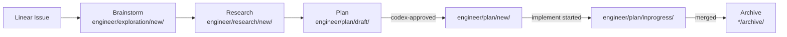

# Flywheel — Project CLAUDE.md

## Onboarding

New session? Run `/onboarding` or read these files in order:

1. **Product Experience** → `doc/architecture/product-experience-spec.md` (**必读** — 定义了产品应该长什么样，所有开发工作的 source of truth)
2. **Memory** → `~/.claude/projects/-Users-xiaorongli-Dev-flywheel/memory/MEMORY.md` (decisions, architecture, current progress)
3. **Active Explorations** (read based on task):
   - `doc/engineer/exploration/new/FLY-52-product-experience-deep-design.md` — Product brainstorm Q&A (FLY-52)
   - `doc/engineer/exploration/new/v0.3-memory-system.md` — per-project memory (GEO-145)
   - `doc/engineer/exploration/new/v0.4-voice-interface.md` — push/pull voice channel for CEO (GEO-150)
   - `doc/engineer/exploration/new/v0.5-remote-screenshot.md` — visual Slack notifications (GEO-151)
   - `doc/engineer/exploration/new/v0.6-slack-threading.md` — Slack threading + workflow engine (GEO-148)
   - `doc/engineer/exploration/new/v1.0-lead-experience.md` — Lead MVP experience (GEO-146)
   - `doc/engineer/exploration/new/v1.1-multi-lead.md` — Multi-lead agents (GEO-152)
4. **Reference** → `doc/reference/ralph-patterns.md` + `doc/reference/auto-claude-patterns.md`

Archived docs are in `doc/*/archive/` — read only if you need historical context.

## What Is Flywheel

TypeScript orchestrator (forked from [Cyrus](https://github.com/ceedaragents/cyrus)):

```
Linear issues → DAG resolver → Claude Code sessions (tmux) → auto PR
                                        ↓ (completed/failed)
                              Decision Layer → Bridge API → Discord Lead → CEO
```

**Goal**: Autonomous dev workflow — human attention is the bottleneck, not AI capability. CEO sets direction, Flywheel executes continuously, only escalating when it genuinely needs a human decision.

## Current Phase

**v1.0 Phase 1 complete** — Lead MVP + Memory System operational. Trial run in progress.

Current version: see `doc/VERSION`

里程碑账本在 `engineering/doc/milestones/` —— 一 issue 一文件,ship 时新建 `<ID>.md`。

⚠️ **不要把里程碑写回本文件的表格。** 那张表是一个共享写点:两个并行 PR 必然在同一个 hunk 冲突,
合一个就让其余在飞分支全部 DIRTY 并**失去 CI 能力**(FLY-2045,实测 100%,不是偶尔)。
追加到表底部也一样 —— 实测同样 100% 冲突。

FLY-2045 之前的 179 条冻结在 `engineering/doc/milestones/ARCHIVE-pre-FLY-2045.md`;
格式与单写者合同见 `engineering/doc/milestones/README.md`。

## Doc Structure & Lifecycle

```
doc/
├── architecture/{archive}/             — Unified architecture docs
├── engineer/                           — Engineer work area
│   ├── exploration/{new,backlog,archive}/  — Product exploration / design docs
│   ├── research/{new,archive}/             — Technical research / evaluations
│   ├── plan/{draft,new,inprogress,archive,backlog}/ — Implementation plans
│   ├── deep-research/                      — External LLM research results
│   └── implementation/                     — Implementation notes
├── reference/                          — Reference docs (Cyrus, Ralph, patterns)
├── retro/                              — Retrospectives
└── VERSION                             — Current version number
```

### Development Pipeline

Every feature follows this pipeline. **Linear issue is the single source of truth.**


```mermaid
graph LR
    LI[Linear Issue] --> B[Brainstorm<br/>engineer/exploration/new/]
    B --> R[Research<br/>engineer/research/new/]
    R --> P[Plan<br/>engineer/plan/draft/]
    P -->|codex-approved| N[engineer/plan/new/]
    N -->|implement started| IP[engineer/plan/inprogress/]
    IP -->|merged| A[Archive<br/>*/archive/]
```

**Slash commands per stage:**

| Stage | Command |
|-------|---------|
| Brainstorm | `/brainstorm` |
| Research | `/research` |
| Plan | `/write-plan` → `/codex-design-review` |
| Implement | `/implement {plan-file}` |
| Code Review | `/codex-code-review` or `/gemini-code-review` |

### File Naming Conventions

**MANDATORY**: Always include version + GEO issue ID in filenames.

| Type | Pattern | Example |
|------|---------|---------|
| Exploration | `GEO-{XX}-{slug}.md` | `GEO-145-memory-production.md` |
| Research | `GEO-{XX}-{topic}.md` | `GEO-145-supabase-pgvector.md` |
| Plan | `v{version}-GEO-{XX}-{slug}.md` | `v1.2.0-GEO-145-memory-production.md` |

Research files may also use a sequential number prefix: `{NNN}-GEO-{XX}-{slug}.md`

### Document Frontmatter

Every document MUST start with a structured metadata block:

**Exploration:**
```markdown
# Exploration: {Title} — GEO-{XX}

**Issue**: GEO-{XX} ({title})
**Date**: {YYYY-MM-DD}
**Status**: Draft | Complete
```

**Research:**
```markdown
# Research: {Title} — GEO-{XX}

**Issue**: GEO-{XX}
**Date**: {YYYY-MM-DD}
**Source**: `doc/engineer/exploration/new/GEO-{XX}-{slug}.md`
```

**Plan:**
```markdown
# Plan: {Title}

**Version**: v{X.Y.Z}
**Issue**: GEO-{XX}
**Date**: {YYYY-MM-DD}
**Source**: `doc/engineer/exploration/new/GEO-{XX}-{slug}.md`, `doc/engineer/research/new/GEO-{XX}-{slug}.md`
**Status**: draft | codex-approved
```

### Plan Status Flow

```
plan/draft/      → Codex design review not yet passed
plan/new/        → Codex approved, ready for /implement
plan/inprogress/ → Implementation started (branch exists)
plan/archive/    → Implementation merged (or abandoned with reason)
plan/backlog/    → Written but implementation deferred
```

When a plan passes Codex design review: `git mv doc/engineer/plan/draft/{file} doc/engineer/plan/new/{file}`
When implementation starts: `git mv doc/engineer/plan/new/{file} doc/engineer/plan/inprogress/{file}`
When PR merges: `git mv doc/engineer/plan/inprogress/{file} doc/engineer/plan/archive/{file}`

### Document Lifecycle Rules

**A document can only be archived when its downstream artifact exists.**

**Archive rules:**
- **Exploration** → archive when Research is complete (or when it's a reference-only doc with no further action)
- **Research** → archive when Plan is complete
- **Plan** → archive when Implementation is merged (or abandoned with documented reason)
- **Never archive** a document whose downstream stage hasn't been done yet

**Backlog rules:**
- `doc/engineer/exploration/backlog/` — explorations deferred intentionally (not abandoned, will return to later)
- `doc/engineer/plan/backlog/` — plans written but implementation deferred

**When moving to archive, do NOT delete.** Just `git mv` to the `archive/` subdirectory. The file keeps its name.

**After archiving, update:**
1. This CLAUDE.md (remove from "Active Explorations" list)
2. MEMORY.md doc index (update path and status)
3. Linear issue (mark as Done)

## Key Architecture Decisions

| Decision | Choice |
|----------|--------|
| Base | Fork Cyrus (~80% reuse) |
| Notification | **Discord** via Claude Code Lead agents |
| Memory | Per-project (`.flywheel/` in each project repo) — deferred |
| Decision Layer | Hard Rules + Haiku Triage + Verify + Route |
| Runner | Claude Code CLI via tmux |
| Cost tracking | N/A (Claude subscription, no per-token billing) |
| Codex Lead deployment | **Windowed (TUI) only** — see below (FLY-398) |

## Codex Lead Deployment — Windowed (TUI), Never Headless (FLY-398)

**HARD RULE (Annie):** every **production** Codex lead/runner MUST be deployed in a
**windowed** form (a real `codex resume --remote` TUI pane in cmux that the founder can
see and drive) — **never** the headless `codex app-server` form. Annie must be able to
watch them in cmux.

- **Production Lead launcher = the TUI form.** Mufasa's production launcher is
  `run-codex-lead-mufasa-tui-fullaccess.sh` (windowed full-access TUI), NOT
  `run-codex-lead-mufasa-fullaccess.sh` (headless app-server).
- The headless `codex app-server` full-access **backend** (FLY-350,
  `codex-lead-runtime.ts` full-access path + `run-codex-lead-mufasa-fullaccess.sh`) is
  **kept as a low-level capability** for tests / QA / rollback — it is **not deleted**,
  but it is **not** the production Lead deployment form. The headless launcher carries a
  loud banner pointing operators to the TUI launcher.
- Windowed full-access is NOT a Codex-binary limitation — `codex resume --remote`
  accepts `-s workspace-write`; the TUI runtime supports the `full-access` profile
  (FLY-398). The MCP-tool-call approval gap is fixed in BOTH forms via
  `default_tools_approval_mode = "approve"` (an unattended daemon has no one to answer
  an elicitation, so both still need it).

## Tech Stack

- **Runtime**: Node.js / TypeScript
- **Base**: Cyrus fork (pnpm monorepo)
- **AI**: Spawn Claude Code CLI via `IAgentRunner`; Haiku for Decision Layer
- **Storage**: SQLite (`sql.js`) for StateStore
- **Issue tracking**: Linear (`@linear/sdk`)
- **VCS**: GitHub
- **Agent**: Claude Code CLI Lead agents → Discord

## Linear Project

- **GeoForge3D Team** (prefix: GEO) — 产品 issue + 历史 Flywheel issue
- **Flywheel Team** (prefix: FLY) — 新 Flywheel 基础设施 issue
- **Project**: Flywheel (ID: `764d7ab4-9a3b-43ea-99d9-7e881bb3b376`)

> **过渡期规则**:
> - 历史 Flywheel issue 仍在 GEO- team 下，不迁移
> - 查询 Flywheel issue: 按 project name 过滤（自动覆盖两个 team）
> - 新建 Flywheel issue: **必须**指定 `team: "FLY"` 和 `project: "Flywheel"`
> - 当 GEO- 下 active Flywheel issue 归零后，移除此过渡期说明

## Core Behaviors

- **Surface assumptions**: Before implementing anything non-trivial, list your assumptions explicitly. Never silently fill in ambiguous requirements.
- **Push back**: You are not a yes-machine. Point out problems directly, explain downsides, propose alternatives.
- **Enforce simplicity**: Actively resist overcomplication. Prefer the boring, obvious solution.
- **Scope discipline**: Touch only what you're asked to touch. No unsolicited cleanup.
- **Dead code hygiene**: After refactoring, list newly unreachable code and ask before removing.
- **Confusion = stop**: On inconsistencies or unclear specs, stop and ask.

## Non-Negotiables

- External input must be validated at system boundaries.
- Handle failure paths explicitly — no silent swallowing of errors.
- No hardcoded secrets; use environment variables or config.
- Auth/authz boundaries must be verified, not assumed.

## CLI Contract Changes (FLY-1914)

净删除或改名 `flywheel-comm`（或任何被外部消费的 CLI）子命令的 PR，必须在 PR body
附一次消费者 sweep 证据，包含执行时间戳，并逐个列出调用方及处置（同步改造或确认零引用）：

- 插件 fork 源：`xrliAnnie/claude-plugins-official` 的 `external_plugins/`
- 本机全部插件缓存：`~/.claude/plugins/cache/*/`（生产实际运行的字节，可能与 fork `main` 不同版）
- 主仓 `scripts/` 与 `packages/`

任一 root 缺失或不可读时，必须在证据中显式写明“该 root 未检查”；不允许把“没查”报告成
“零引用”。教训：PR #808 净删 `chat-receipt` 时评审漏掉了插件消费者，代价是 FLY-1730 与
FLY-1914 两张单，以及一周的 founder 频道告警噪音。

## Agent Strategy

- Independent checks/tasks should run in parallel (use multiple Task calls in one message).
- Complex changes: call planner agent first, code-reviewer agent after implementation.

## Output

After modifications, summarize: what changed and why, what you intentionally left alone, potential concerns.

## Mermaid Diagrams

Prefer Mermaid diagrams for plans, architecture docs, and any document describing flows or relationships.
