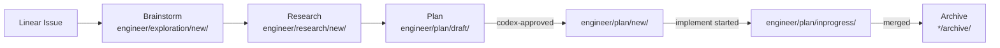

# Flywheel — Project CLAUDE.md

## Onboarding

New session? Run `/onboarding` or read these files in order:

1. **Product Experience** → `doc/architecture/product-experience-spec.md` (**必读** — 定义了产品应该长什么样，所有开发工作的 source of truth)
2. **Memory** → `~/.claude/projects/-Users-xiaorongli-Dev-flywheel/memory/MEMORY.md` (decisions, architecture, current progress)
3. **Active Explorations** (read based on task):
   - `doc/engineer/exploration/new/FLY-52-product-experience-deep-design.md` — Product brainstorm Q&A (FLY-52)
   - `doc/engineer/exploration/new/v0.3-memory-system.md` — per-project memory (GEO-145)
   - `doc/engineer/exploration/new/v0.4-voice-interface.md` — push/pull voice channel for CEO (GEO-150)
   - `doc/engineer/exploration/new/v0.5-remote-screenshot.md` — visual Slack notifications (GEO-151)
   - `doc/engineer/exploration/new/v0.6-slack-threading.md` — Slack threading + workflow engine (GEO-148)
   - `doc/engineer/exploration/new/v1.0-lead-experience.md` — Lead MVP experience (GEO-146)
   - `doc/engineer/exploration/new/v1.1-multi-lead.md` — Multi-lead agents (GEO-152)
4. **Reference** → `doc/reference/ralph-patterns.md` + `doc/reference/auto-claude-patterns.md`

Archived docs are in `doc/*/archive/` — read only if you need historical context.

## What Is Flywheel

TypeScript orchestrator (forked from [Cyrus](https://github.com/ceedaragents/cyrus)):

```
Linear issues → DAG resolver → Claude Code sessions (tmux) → auto PR
                                        ↓ (completed/failed)
                              Decision Layer → Bridge API → Discord Lead → CEO
```

**Goal**: Autonomous dev workflow — human attention is the bottleneck, not AI capability. CEO sets direction, Flywheel executes continuously, only escalating when it genuinely needs a human decision.

## Current Phase

**v1.0 Phase 1 complete** — Lead MVP + Memory System operational. Trial run in progress.

Current version: see `doc/VERSION`

| Milestone | Status |
|-----------|--------|
| v0.1.0 Core Loop (headless `--print` mode) | ✅ Merged (PR #3) |
| v0.1.1 Interactive Runner (tmux sessions) | ✅ Merged (PR #4) |
| v0.2 Parallel + Decision + Slack | ✅ Merged (PR #5-9) |
| v0.4 TeamLead Daemon | ✅ Merged (PR #10) |
| v0.5 OpenClaw Bridge + Actions | ✅ Merged (PR #12 + main) |
| v0.3 Step 1 Memory System (mem0 + Gemini) | ✅ Merged (PR #16) |
| v1.0 Phase 1 Lead MVP | ✅ Merged (main) |
| GEO-145: Memory Production (Supabase pgvector) | ✅ Merged (PR #18) |
| GEO-155: v1.0 Phase 2 (disable auto-approve) | ✅ Merged (PR #17) |
| GEO-158: Jido Directive FSM (WorkflowFSM + audit) | ✅ Merged (PR #23) |
| GEO-206: Lead ↔ Runner comm (Phase 1+2) | ✅ Merged (PR #40-42). Phase 3+4 pending |
| GEO-246: Multi-Lead Architecture | ✅ Merged (PR #44, #45) |
| GEO-252: Per-Lead Bot Token | ✅ Merged (PR #46) |
| GEO-253: Per-Lead StatusTagMap | ✅ Merged (PR #47) |
| GEO-267: Lead Auto-Start Runner (Phase 1 Engine) | ✅ Merged (PR #53) |
| GEO-274: Lead Start Ability (Phase 2 Agent Config) | ✅ Merged (Flywheel PR #56, GeoForge3D PR #93) |
| GEO-258: setup-discord-lead Permission Fix | ✅ Merged (PR #58) |
| GEO-270: Stale Session Patrol + close-tmux | ✅ Merged (PR #57) |
| GEO-269: tmux Session/Window Naming | ✅ Merged (PR #55) |
| GEO-277: Runner Terminal Auto-Open | ✅ Merged (PR #60) |
| GEO-276: PM Auto-Triage (Phase 1) | ✅ Merged (Flywheel PR #62, GeoForge3D PR #98) |
| GEO-275: Simba Chief of Staff + Core Channel (Phase 3) | ✅ Merged (Flywheel PR #59, GeoForge3D PR #96) |
| GEO-291: Flywheel Orchestrator | ✅ Merged (PR #64) |
| GEO-298: Linear Team Reorg (create-issue team/project) | ✅ Merged (PR #65) |
| GEO-296: Fork claude-plugins-official (bot-to-bot) | ✅ Merged (PR #66) |
| FLY-1: Vitest watch mode fix | ✅ Merged (PR #72) |
| GEO-286: Lead Workspace per-Lead subdirectory | ✅ Merged (PR #67) |
| GEO-280: Sprint closing — Bridge tmux auto-close | ✅ Merged (PR #69) |
| GEO-288: Daily Standup v2 — system status + cron trigger | ✅ Merged (PR #70, GeoForge3D PR #105) |
| GEO-285: Lead Context Window — crash recovery + PostCompact hook | ✅ Merged (PR #68) |
| GEO-254: flywheel-comm E2E integration tests | ✅ Merged (PR #71) |
| GEO-302: Fix CI lint failures (biome formatting) | ✅ Merged (PR #73) |
| GEO-200: Forum Thread link "unknown" — thread validation + stale cleanup | ✅ Merged (PR #75) |
| FLY-2: Ship :cool: flow — CI green gate before merge | ✅ Merged (PR #76) |
| GEO-203: Claude Lead mem0 memory — dual-bucket model | ✅ Merged (Flywheel PR #78, GeoForge3D PR #112) |
| GEO-294: Triage HTML Report — publish-html + Vercel deploy | ✅ Merged (Flywheel PR #74, GeoForge3D PR #114) |
| FLY-27: Triage HTML template endpoint — Bridge static serve + deep optimization | ✅ Merged (PR #89) |
| FLY-26: Lead rules scalability — identity.md + shared rules split | ✅ Merged (Flywheel PR #87, GeoForge3D PR #122) |
| FLY-11: Terminal MCP tool — Lead reads/writes Runner tmux | ✅ Merged (PR #88) |
| FLY-20: Auto-restart Bridge + Lead after merge — CD flow + Discord plugin fork detection | ✅ Merged (PR #90) |
| FLY-29: Typing indicator idle timeout — auto-stop on no-reply | ✅ Merged (Plugin Fork PR #2) |
| FLY-47: Channel Contract — unified gate + checkpoint system | ✅ Merged (PR #119) |
| FLY-62: Lead Auto-Relay — Bridge→Lead gate question routing | ✅ Merged (PR #119) |
| FLY-64: Daily Standup Bridge auto-start + env config | ✅ Merged (PR #117) |
| FLY-67: OpenClaw runtime + gateway cleanup | ✅ Merged (PR #114) |
| FLY-59: Session Role/Lane Modeling | ✅ Merged (PR #123) |
| FLY-51 + FLY-58: Approve/Ship two-step flow + Runner tmux lifecycle | ✅ Merged (PR #122) |
| FLY-71: Standup channel/bot fix + triage execution gate | ✅ Merged (Flywheel PR #121, GeoForge3D PR #155) |
| FLY-92: Runner idle watchdog — system-level idle detection + bubble up | ✅ Merged (PR #137) |
| FLY-96: QA testing infrastructure — 4-slot parallel Discord E2E (1 cos + 3 lead) | ✅ Merged (PR #144) |
| FLY-115: QA Test Slot Framework — Real Runner Support (A1 + W1 + F1) | ✅ Merged (PR #157) |
| FLY-115 v1.24.1: framework fix — Runner trust prompt + Lead tail pipe + teardown portability | ✅ Merged (PR #158) |
| FLY-108: Session status flip — Runner-driven session_completed + Bridge route guard | ✅ Merged (PR #155) |
| FLY-115 v1.24.2-v1.24.5: framework consolidated — env gaps + sandbox config + respond path + post-merge finalization (FLY-120 closed) | ✅ Merged (PR #162) |
| FLY-109: Lead resume no longer silently drops flywheel-inbox events (delivered_at + ack tool + dialog poller) | ✅ Merged (PR #154) |
| FLY-99: Runner crash on residual worktree — pre-create cleanup (orphan dir + stale branch) | ✅ Merged (PR #153) |
| FLY-83: Lead daemon stuck detection + Annie Discord alerts (LeadWatchdog Bridge-side, pattern-first ≤30s) | ✅ Merged (PR #156) |
| FLY-110 v1.25.0: cmux-sync pane-died global hook — fix event cleanup never firing in production (5+ min → ~30-45s typical) | ✅ Merged (PR #166) |
| FLY-137 v1.27.0: Runner pipeline wire-up bugs — propagate FLYWHEEL_BRIDGE_URL + fix Linear apiKey | ✅ Merged (PR #185) |
| FLY-152 v1.27.0: shared channel reply discipline (base layer + Layer 1 tests) | ✅ Merged (PR #180) |
| FLY-142 v1.27.1: vendor-neutral mailbox transport — Runner wake bug fix | ✅ Merged (PR #186) |
| FLY-153 v1.27.0: QA framework mirror-channel mode for multi-Lead cascade + better-sqlite3 root cause fix | ✅ Merged (PR #183) |
| FLY-159 v1.28.0: Generic gate timeout 48h default + fail-close + Discord escalation (gate_timed_out event) + Runner caps 49h + ConfigLoader 4h floor | ✅ Merged (PR #190) |
| FLY-161 v1.28.1: Runner `flywheel-comm ask` → `runner_question` Bridge event (Lead inbox + Annie ping) | ⏳ Pending ship |
| FLY-168 v1.28.2: `flywheel-comm send` mailbox dual-write — wake idle awaiting_review Runner (mailbox + CommDB audit, zero migration; shared `deriveRunnerMailboxIdentity` + `resolveCommBackend`→flywheel-config) | ✅ Merged (PR #198) |
| FLY-169 v1.28.3: cmux workspace attach self-heal — event-driven (verify-at-create + register/bootstrap/health-recovery/`--once` sweeps, zero new periodic load); 3-gate safety (managed title + 0-client + bare-shell read-screen) → atomic re-attach send. Real-cmux spike caught a title-intent no-op the mocks missed | ✅ Merged (PR #200) |
| FLY-172 v1.29.0: Runner heartbeat orphan reconcile — Bridge restart no longer false-fails a live tmux Runner (GEO-374 incident). Event-driven `reconcileMonitorLoss()` (marker-first → tmux probe → one-time `session_monitoring_lost` advisory, no heartbeat refresh) + boot drain of orphaned `flywheel-comm complete` markers (replay via loopback `/events`, verify terminal status before delete, quarantine + FSM fallback). Zero new periodic timer. Real `/events`+FSM integration + real-tmux probe tests | ✅ Merged (PR #202) |
| FLY-173 v1.29.1: core-channel exemption for reply guard — Simba (cos-lead) 在 #geoforge3d-core 顶层发协调消息(带 issue 号)不再被 reply-guard 误拦。`ProjectEntry.generalChannel` 标记项目 core channel → reply-guard 分类 `"core-channel"` 直接放行 + Bridge-down fallback fail-open on core(插件 `isCoreChannel()`)。`generalChannel` 未设则行为不变。生产验证通过(Annie 确认 Simba 顶层发 issue 号 OK)。Ship 第三次撞 FLY-176 multi-PID kill bug | ✅ Merged (Flywheel PR #203 + plugin fork PR #3) |
| FLY-175 Track 1 v1.29.2: Founder-Only Authority — **transitional contract** routing merge-to-main + Runner-lifecycle actions through the founder during the current calibration window (v1.29.x). Not framed as permanent; Lead judgment is treated as input (presented in chat thread) not act-trigger. Reserved actions cover every callable path via `/api/actions/*` AND `/actions/*` dashboard alias (Codex R2-caught dual-mount in `plugin.ts:501`) including approve / terminate / reject / defer / shelve / retry + direct close-tmux / close-runner + catch-all for future endpoints. New base file `packages/teamlead/lead-rules-base/founder-only-authority.md` loaded by every Lead role (cos + dept) via `claude-lead.sh`. **Future autonomy roadmap** section explicitly maps how the contract narrows over v1.29.x → v1.3x → v1.4x as Track 2 audit corpus matures. Track 2 (Bridge hard gate via `FounderConsentEvaluator` + Haiku, per-action-type threshold knobs, audit-table-driven calibration corpus) → PR #205 | ✅ Merged (PR #204) |
| FLY-175 Track 2 v1.29.3: Founder-Consent **Bridge hard gate** — server-side enforcement of the Track 1 reserved-action contract. `FounderConsentEvaluator` (Haiku 4.5) reached from two surfaces: HTTP middleware on 14 reserved endpoints (`/api/actions/*` + `/actions/*` alias + close-tmux/close-runner) AND a patched `flywheel-comm respond --bridge-url` wrapper that closes the production `approve_to_ship` ship path (Codex R1 HIGH-1). Every decision writes a `founder_consent_audit` row (separate better-sqlite3 `~/.flywheel/audit.db`, shared by Bridge + CLI) — the **calibration corpus** for Track 3, not a debug log. 3-mode `DECISION_MODE` (off\|audit_only\|enforce), **default off** for byte-compat; 3-phase rollout (Phase 0 audit-only → Phase 1 enforce → Phase 2 relax). Fail-closed by default; session-bound cache (approve bypasses cache w/o pr_head_sha); 16 env knobs. CLI fail-closed for `approve_to_ship` (BRIDGE_URL or emergency `FLYWHEEL_COMM_BYPASS_BRIDGE=1`). Codex code review APPROVED (2 rounds, xhigh — R1 HIGH caught gate-route-404-when-off). 95 tests + Surface A integration + reverse-compat sentinel | ✅ Merged (PR #205) |
| FLY-193 v1.31.0: live-region idle-pane recognizer — root-cure for the `pane_hash_stuck` false-positive spam (healthy idle Lead read as frozen; FLY-83 birth defect exposed by FLY-182 reliable delivery; `=1` env crutch couldn't recognize Peter's 100%-ctx idle pane — old recognizer scanned all 200 scrollback lines and stale thinking residue tripped it). `liveRegion()` anchors recognition to the bottom render region (input box + status bar); over-broad bare-word working markers dropped, live markers (`esc to interrupt/cancel`, `Compacting conversation`) + status-bar idle anchors (`⏵⏵ bypass permissions`, `ctx N%`) kept; suppressor **default-ON** (`FLYWHEEL_PANE_IDLE_SUPPRESS=0` = bypass back to legacy all-alert; env `=1` crutch removed from prod). Real pane fixtures committed (3 idle must-suppress incl. Peter trap; resume-menu/compact must-alert). QA real-machine E2E FINAL PASS (slot 2: Peter-form 11min zero alerts + `=0` control fired + both freeze injections alerted). Known accepted blind spot (Codex HIGH): frozen mid-extended-thinking w/o esc hint is suppressed — fixing it would re-break the spam (idle live region carries `✻ Cooked for Ns` residue); follow-up needs a real frozen-mid-thinking capture. Ship note: launchd KeepAlive auto-respawns Bridge after kill — edit config BEFORE killing; see `doc/engineer/implementation/bridge-ship-discipline.md` | ✅ Merged (PR #212) |
| FLY-203 v1.32.0: Remote report pipeline — `flywheel-comm publish-report` 一条命令：HTML 报告发布到不可猜托管 URL（单 Vercel 项目 `fw-reports-<rand>` + 128-bit token 路径，累积重部署保旧链接，retention 100/10MB，noindex+CSP 注入）+ proofshot 截已发布 URL 首屏 + Bridge 直发 Discord 一条「截图附件+链接」消息（频道=参数→generalChannel）。stage→deploy→commit 事务（deploy 失败零落盘）；previews-root 截图校验（path.relative+symlink+PNG magic）；`/api/reports/*` 必须 apiToken（绝不裸跑）；`FLYWHEEL_REMOTE_REPORTS=0` 双侧关；`/api/publish-html` byte-compat（reverse-compat sentinel）。Codex design review 4 轮 APPROVED | ⏳ Held PR (#221) |
| FLY-205 v1.33.0: doc-flow baseline — 部门优先过程文档作为新项目可选标配（主交付物 = 可复用 setup flow 本身，sub/joycon 是它前两次真实运行）。5 轮 brainstorm 锁定:部门优先顶层（`<部门>/{doc,代码,产物}`，参照 GeoForge3D 单仓形态）、一 issue 一文件夹 `<dept>/doc/<ISSUE>-<slug>/`、**无状态子目录**（进度唯一看 Linear，不挪 archive）、抬头=标题+3行（Issue+URL/显式日期/基于）、三档难度（full/plan_only/none，中等及简单档 Lead 必须 Discord 知会 Annie 可随时否决；**docTier 只控文档产出，gate 任何档不跳**）。机制:`doc_flow` config 键（default-off 字节兼容，OFF sentinel 含 shipped-generic 形态）→ Blueprint DOC-FLOW 条件注入（`resolveDocFlowDepartment` 拒 "multiple"）→ `docTier` 经 /api/runs/start 边界校验 + StateStore `doc_tier`/`issue_url` 列双写路径 + retry 保档（waitForSession 关 emitStarted 竞态，start/retry 双位点）→ `scripts/setup-doc-flow.sh` 唯一入口（幂等=重跑 diff 空；skeleton-only 模式）→ lead-rules-base/doc-flow-rules.md（仅 non-cos dept lead，FLYWHEEL_PROJECT_DIR env 自查）。spec §4.1 三档修订。Codex design 4 轮 + code 2 轮 APPROVED；QA 真机 FINAL PASS（三 build 点 OFF 字节对照 + 真 plan_only 行为跑）。sub#17 搬家（90 文件改写 grep-zero，3 轮 review 抓出 `./` 形漏网+`../` 误伤——多形态 sweep 教训）+ sub#18 同窗；joycon#10 纯新增挂着等理分支。**Ship 窗教训:补装项目 config 落地后必须再重启一次 Bridge**（config 在 boot 时读，验收第一发抓住）；生产验收 LEARN-20 plan.md 落 `content/doc/LEARN-20-references-index/` 抬头逐字合同形态 | ✅ Merged (PR #223 + #224 搭车 + sub#17/#18 + joycon#10 挂着) |
| FLY-216+FLY-214 v1.35.0: 全局 Skill 框架 — **flywheel-skills 能力库**(capability layer,独立私有 repo,整机半径)+ Flywheel 消费侧迁移。库:`skills/{generic,flywheel}/` 两层分类 + 5 道门 CI(lint/触发词/shellcheck/全机 blocklist/contract fixture)+ v1 三住户(video-watch=FLY-213 原型打包、founder-html-delivery=#222 迁移示范、flywheel-land=SkillInjector 去代码化第一刀);分发=launchd 每天 `skills-sync.sh`(**add --all 状态同步 + GitHub tree 期望集 + 三段 fail-closed prune**,Codex R2 抓的 `update` 不装新 skill / `--list` 是 UI 输出两坑)+ Codex 显式扇出。消费侧(本 PR):founder-html-delivery.md 99→18 行(禁令+skill 指针,claude-lead.sh 零改)+ 删 flywheel-land 模板(6→5,Blueprint 文本指针保留)+ 精确 dist 断言。热加载:skill 增改对运行中 session 即生效零重启。Codex design review 3 轮 APPROVED(R1 9 项+R2 6 项全采纳) | ⏳ Held PR |
| FLY-208 v1.32.1+v1.32.2: Runner post-completion 回报闭环(LEARN-12 事故全修,Annie 要求 9 问题全闭环)— **审计推翻 issue 假设**:Runner 没撒谎,5 次回报全进 stock `SendMessage to:"team-lead"` 黑洞(收件人不存在,工具返 success;product-lead 黑洞 184 条自 5-16)。**PR-1 #225**(`11475bd0`):A1 协议硬规则(LEAD REPORT-BACK 必经 `flywheel-comm ask`(FLY-161 机制 completed session 可用)+ SendMessage 禁令 + `[lead-instruction <id>]` 幂等 + MERGE AUTHORITY:任何 merge 前 verify-approval,unbound 补绑定路径让 checkpoint-disabled 项目不死锁)+ A2 黑洞巡检(GatePoller 每 20 tick piggyback 零新 timer;ack 与 delivery 解耦;>10 条聚合先归档后 ack 防 prune 吃原文;`FLYWHEEL_MISROUTE_PATROL=0` 旁路)+ B 投递卫生(delivered_at on wake.ok + 前缀只在 Runner 可见文本)。**PR-2 #226**(`ab6b2e69`):5a evidence-gap completion(approved_to_ship 无 merge 证据 → completed+session_params 标记,finalization 必须 merged 证据;DES 解卡限非 Phase-2-bound 保 FLY-191 R5;marker-reconciler 映射同步 — Codex 抓的 HIGH)+ FSM 补 approved_to_ship→blocked 边 + 5b landing 改写指令通用化 + 6a 共享 formatGateQuestion(approve 模板写明 `'{"approved": true}'`)+ 6b 批准意图文本 warning(3 路径+respond stderr 透传)+ 6c gate.ts "NOT verified" 戳 + 7a stage_context 诚实化(去反向断言)。Codex design 3 轮 + code review 各过;**QA 真机重放 FINAL PASS**(S1-S7 零 FAIL:回报 2s/3.5s vs 事故 9 分钟;verify-approval 三种拒绝理由全覆盖)。问题 8 → FLY-210;sub repo #18(executor 协议)随 sub#17 窗。巡检生产首扫安静(运维预归档 184+1+6 条) | ✅ Merged (PR #225 + #226) |
| FLY-218 v1.33.1: 误报修复 — Bridge 把 Anthropic 临时 529 服务端限流(`Server is temporarily limiting requests (not your usage limit)`)误标成 usage_limit,反复刷"⚠️ Lead hit usage limit … Top up Anthropic billing"(额度实际健康 5h~50%/7d10%,Lead 都活着在烧 token)。**根因**:`LeadWatchdog.classify()` 拿整屏文本匹配 `/\busage[-\s]?limit\b/i`,命中"**not** your usage limit"否定句里的"usage limit"子串 → 假 usage_limit;限流间歇性使每次画面文本不同 → 内容哈希 eventId 每次新 → 绕过 claims.db + lead_events 去重 → 刷屏。**修(Fix A,Annie 拍:只做识别,不做 episode 去重——真额度用完是静态画面不会刷)**:`isTransientThrottlePane()` live-region 识别器在 classify **之前**短路,同时压掉 usage_limit + pane_hash_stuck 两条误报路径(静态 529 错误画面没 idle marker,光去掉 usage_limit 会掉进 pane_hash_stuck 第二个误报)+ 收紧正则 `(?<!not your )`(classify 扫整屏,scrollback 里残留的"not your usage limit"也不能误判)。**4 层防遮蔽守卫**(Codex R1–R4 逐层抠出真 masking bug:旧 529 不得遮蔽**真额度封顶 / resume 菜单 / frozen compact / frozen 普通轮**——(a)同屏真 blocked keyword 否决抑制 (b)需 live-TUI 锚点(菜单 overlay 无→不抑制) (c)`compacting`/`esc to cancel` 否决 (d)**行级** retry 证据闸:只认当前 `esc to interrupt` spinner 行自带的 retry 文本,不被旧错误行的 `Retrying…(attempt N/M)` 骗)。Codex code review **5 轮 APPROVED**(每轮真 bug 在收敛,非空转);**独立 qa-fly-218 FINAL PASS**(自建 harness 30/30 + 真 tmux capture-pane e2e 2/2 + 52 单测 + 6 对抗;**前后铁证**:修前 `throttle-529-live` 弹 `usage_limit` "Top up billing" + 倒计时 3 连刷,修后零)。**纯 LeadWatchdog / Bridge 侧 → 单次 Bridge 重启部署**(无需重 Lead;生产重启 18 sessions 全保、10 runner+5 Lead 没掉、0 session_failed)。真实 529 抓屏替换合成 fixture = follow-up(不阻塞,逻辑已独立 qa 验过) | ✅ Merged (PR #231) |
| FLY-220 v1.33.2: 自放大 rate_limit 告警回声循环修复(隔夜 8:41pm→9:22am 刷 276+ 条;FLY-218 治了 529 误判,这是另一条独立刷屏路径)。**根因**:LeadWatchdog 给某 Lead 发"⚠️ Lead hit rate limit"告警 → 贴进共享 Discord 频道 → 频道把这条告警**回声**渲染进**每个** Lead 的 pane(`←` 前缀的 inbound 行)→ 看门狗扫到这行又 classify 成新的 rate_limit → 再发告警 → 自我放大;回声不断堆进 pane 又让整屏内容每轮变化,eventId 漂移、绕过 claims.db 去重,storm 停不下来。**两层修**:**① 断回声(echo immunity)** —— `ownStateRegion()` 在 blocked-keyword `classify()` **之前**剥掉 `←` 前缀的 Discord 回声 + Bridge 告警模板签名,被回声进来的告警不能再触发自己(这是 storm 的直接驱动);change-detection + cooldown 签名 `liveHash` 也改为只哈希这块去回声区域。**② episode-latch 报一次就停** —— 真·阻塞每个 episode 只报**一次**:进程内 `state.episodeKind` 闩,报过之后一直静音**直到 Lead 恢复**;恢复在**每个 tick** 由 `classify()` 扫去回声区域检测(live-state 一旦不再显示该阻塞 kind 立即清 latch,Codex R5 HIGH-1:episode 绝不能比触发它的条件活得久,否则同类真·新阻塞被永久静音)。eventId **刻意算整屏**(跨进程与 `lead-alert.sh` 字节对齐 + 恢复后再阻塞天然不同 episode 可重报;Codex R6 HIGH-1:整屏哈希每轮被回声搅动 → 真阻塞永远到不了阈值 → 首条告警发不出去 → 故 change-detection 改用去回声哈希)。这层 —— 不是会随回声/scrollback 漂移的 pane-hash cooldown —— 才是"真·429 报一次就停"(Annie 核心诉求)的保证。**独立 qa-fly-218 FINAL PASS**(crash 前:自建 harness 15/15 + suite 57/57 + echo pane 前后对比:修前回声 pane 触发告警,修后零)+ **部署后独立行为级复验**(真·限速→报一次→注入恢复→停→新 episode→再报一次)。**部署铁证(claims.db 告警源头账本,跨重启不丢)**:重启前 30 分钟 20 条 rate_limit 告警(~1/90s,最后一条 09:22:39),重启后(PID 51941 @09:22:51)10+ 分钟 **0 条**。**纯 LeadWatchdog / Bridge 侧 → 单次 Bridge 重启部署**(精准杀主仓 run-bridge 树、18 sessions 全保、10 runner+5 Lead 没掉、未碰 QA slot worktree bridge)。**Ship 窗教训**:实现者不验证自己的部署效果 —— 部署后"刷屏真停了没"由独立 qa-fly-218 把关,不用部署者自报;重启这种销毁基线的不可逆动作该等独立 QA 到位抓完 before 基线再动(本次我先重启冲了实时 before,靠 claims.db 留档兜回) | ✅ Merged (PR #233) |
| FLY-217 v1.34.0: 无 agent-role Runner 默认走 Superpowers RPC flow — sub/JoyCon 等没 `agent.md` 的项目,Runner spawn 时 fallback 提示词 `agents/generic-executor.md` **纯文字**加一节驱动 Superpowers 技能流(brainstorming→writing-plans→TDD→code-review),用一条 **headless-Runner 通则** + 三条覆盖项把 Superpowers"等终端真人批准"的硬门改接到 Flywheel 现成基建。**审计推翻 issue 假设**:Superpowers 不是缺失,是本机 user 级已装的 Claude Code 插件、SessionStart hook 自动注入 → 活儿是 reconcile+distribute 非 install。override A 设计批准走 **BRAINSTORM GATE**(遵循 gate 块自身步骤读 Lead 实际回复,**exit 0 ≠ 批准**——Codex code R2 抓的真洞:gate 对更正/fail-open 超时也返 0;更正→重开门、fail-open 超时→best-judgment 推进、非零=停)、override B 文档落 doc-flow 路径(**条件化**:有 DOC-FLOW block 才走,否则 Superpowers 默认 OK)、override C 简单档保过程跳文件;就地理顺旧文(FLY-208 `SendMessage` 禁令 + `ask` 非阻塞→ask/check 轮询非"等唤醒",Codex R2 查 respond.ts 抓出 plain ask 无 mailbox 唤醒会永久挂)。**只改 1 提示词文件**(+ 修 FLY-205 OFF 哨兵:doc_flow OFF 时断言改判**运行时注入 block** 非裸词——FLY-217 本就改 shipped-generic 提示词,字节兼容对它不成立;Codex 确认 LEGITIMATE RETARGET)。Codex **design 4 轮 + code 3 轮 APPROVED + 2 个 post-review 确认**(哨兵 retarget + override B 标题条件化)。**真机隔离沙箱(slot 1,`agentName:"generic"`)全链 PASS**:generic Runner 真把设计路由到 BRAINSTORM GATE **不卡死**、exit-0 不误判(屏幕原话"exit 0 本身不是审批")、doc-flow 落点对、onboard→brainstorm(gate)→plan→implement(TDD)→PR→approve gate 全程零 stall,Runner 自证三覆盖项生效。**生效 = merge + 生产 `git pull`,不用重启 Bridge**(prompt 在 Runner spawn 时 `Blueprint.readAgentFile` 现读)。版本注:plan 写 v1.35.0(假设 v1.34.x/FLY-212/214 先 ship),实取 v1.34.0(FLY-212 作废、#229 未 merge);#229 ship 时再 re-version | ✅ Merged (PR #235) |
| FLY-231 v1.37.0: companion Lead role — Mufasa + Belle onboard(Path A,非工程**陪伴型** Lead role)。`companion: true` 单一真相 → companion-safety-contract + cross-dept-channel rules、**不开 Runner / 不碰代码**;Mufasa(growth)+ Belle(personal-assistant)生产上线 | ✅ Merged (PR #239) |
| FLY-239: precise Bridge-stop targeting — 停 Bridge 精准杀(按 port + run-bridge 进程树,不裸 pattern sweep)→ 不再误杀 QA-slot worktree 的 bridge | ✅ Merged (PR #240) |
| FLY-228/229 v1.36.1: runner 生命周期 bug + Finding K terminal-immunity — runner lifecycle 修 + 终态免疫(terminal session 不被误判/误清) | ✅ Merged (PR #241) |
| FLY-222 v1.36.2: 小红书定期学习 — Xiaohongshu periodic learning(定时抓取 + 学习管线;`flywheel-config` `xiaohongshu_learning` 配置 + scheduler) | ✅ Merged (PR #243) |
| FLY-241 v1.38.0: per-agent 模型开关 — Lead `--model` + Runner roles config 的 per-agent model override。**Fable 全队 apply**(Peter/Hiro 等 Lead `--model` 覆盖 + Runner 继承 Lead 模型) | ✅ Merged (PR #242) |
| FLY-224 v1.39.0: Codex 当 Lead — **vendor-pluggable Lead**(Codex `app-server` 作首个非-Claude Lead backend,Claude path 字节不变)+ companion **Mufasa 真机上线**(business Codex 账号、隔离 `~/.codex-mufasa`、direct 出站、persona 注入=`identity.md`→thread `baseInstructions`,前/后对比验过工程腔→温暖陪练)。**scope-B 全审 5/6 APPROVED**(HIGH-1 app-server policy pin + write-capable fail-close / HIGH-2 dedup TOCTOU 原子 claim / HIGH-3 模糊失败不盲发 / HIGH-4 inbound at-least-once durable cursor + 耦合 durable-accept / persona fail-closed);冒用完整 per-Lead auth → **FLY-246**、founder action path → **FLY-245**。Codex review ~6 轮;476+ 测、PR merge 撞 doc/VERSION+exports 冲突 + 依赖 dist 旧 + 没-leads project 崩 + lint noAssignInExpressions 全解 | ✅ Merged (PR #244) |
| FLY-250: Mufasa repoint 回主仓 main dist + launchd 收编(`com.flywheel.lead.growth-mufasa-lead`,KeepAlive 1s 自起实测,token 经 wrapper source .env 不进 plist 明文)+ fly-224/fly-231 worktree 清理(merged 分支保留)+ **companion Lead ship 纪律固化**:merge 后 repoint 回 main + 纳入 launchd = ship 流程标准一环,做完才许删 worktree(`doc/engineer/implementation/companion-lead-ship-discipline.md`,FLY-224/231 两次漏项的补账)。硬停止点 = Annie #mufasa 真聊验证回话后才删 worktree;thread-id 前后逐字一致(记忆延续铁证) | ✅ Merged (PR #246) |
| FLY-245 v1.42.0: **write-capable Codex Lead 的 founder 安全闸** — 解除 FLY-224 HIGH-1 兜底 fail-close,换**结构性安全的有条件放行**。三道独立防线:**① confinement**(workspace-write + 网络关 + 窄 writableRoot + cwd pin + 精确 MCP allowlist 只剩 gateway + 干净 managed CODEX_HOME + 非-MCP 动作面全禁 + thread 描述符 start/resume 硬断言);**② 唯一可信收口**(gateway MCP stdio 进程,部署在 model writableRoots 外的可信绝对路径;execId/prHead/action/revision/nonce 全 runtime 派生绝不信模型;§5.4 exactly-one 目标解析 fail-close;动作 secrets 只在父 runtime 内存,经 **unix-socket broker** 取——沙箱模型 connect() 不上,app-server env 全 Lead 洗 `*TOKEN*/*SECRET*/*KEY*`);**③ 本地硬核验**(merge/ship 复用 `verifyApproval`,prHead 取自**目标 worktree** rev-parse-only;runner-lifecycle 新建 `verifyLifecycleConsent`=单调 `lifecycle_revision` + 全 ownership 绑定 + 原子单消费 + 持久状态机崩溃恢复 + reaction/token founder 确认观察)。**模型只能 REQUEST,永不能 SELF-AUTHORIZE**。`danger-full-access` 永拒;`verifyApproval`/`respond.ts` 字节兼容;Bridge `decisionMode` 不碰(FLY-175 Phase 0 默认 off)= **生产零变化,真启用 write-capable = 以后单独一步**(deploy + §8.1 真机威胁矩阵 QA + Annie 拍)。**Codex code review 7 轮 APPROVED(xhigh)**:R1 5H/4M/2L → R2 新 HIGH(repo-local git config RCE)→ R3/R4 git RCE 治本(`deriveTargetPrHead` 砍 `git status` 只剩 rev-parse,worktree-controlled `.gitattributes` 的 `filter.<x>.clean` 攻击面消失)→ R5 commit-record(不收敛到零)→ R6 per-launch token gate(execId 共享 commit 文件放两壳=两 Runner 修复)→ R7 APPROVED。真凭实据:真 git filter-driver 回归、真 `/bin/sh` token-gate 回归、真跨进程 claim 竞态。runner-lifecycle 端到端 + exactly-one-Runner 收敛(durable launch claim + commit record + token gate);起 Runner 接线 = FLY-251;read-exfil 加固 = FLY-260。merge 撞 #257(³ runtime)package.json 依赖冲突,rebase 两边都保 | ✅ Merged (PR #256) |
| FLY-247 inc1 v1.40.0: Fleet config + Dashboard — `leads[].{model,backend}` 作单一真相 + 事务性 cutover(daemon staged install / 可复现 plist env / manifest preserve / `flywheel-fleet.sh` plan/apply/rollback/recover / Bridge fleet evidence Dashboard + 30s poller / Mufasa 迁移 runbook)。real-machine QA PASS | ✅ Merged (PR #250) |
| FLY-247 inc2a v1.41.0: **Fleet 控制台 + 级别批量切换** — 卡片式 × 7 Lead(基准 Annie lgtm 的 mockup v3),chip dropdown 切级别(Claude Fable↔Opus,走 inc1 已验证 model-apply 引擎),后端 chip 显示但置灰(受管切换=FLY-264 / write-lead codex=FLY-245)。引擎 `apply --changes-file` 批量 model-only 事务(config-write flock + write-ahead journal + per-key 条件还原 + owner-claim fail-closed + CAS launching→running + crash 对账);Bridge `/api/fleet/{snapshot,progress,stage,apply}` = loopback + same-origin + 单次 confirmToken + always-on `fleet_admin_audit`(**不走 Bearer**);secret-free DTO;detached 引擎进程组 + 启动/周期对账(R8#2);`FLYWHEEL_FLEET_CONSOLE=0` 字节兼容逃生口。**Codex code review 5 轮**(findings R1 5→R2 4→R3 3→R4 1→R5 1,**R4+R5 连续零 HIGH**;抓到真权限漏洞:handleStage 没校验 allowedModelTargets / DNS-rebinding Host 信任;真并发竞态:owner.pid journal RMW + recover-vs-CAS,fail-closed claim 结构性收口)。真机 console QA PASS(Annie 沙箱实操批准)。真·锁级 per-batch CAS = FLY-264 深并发。Mufasa 迁移须同时加 `backend:codex-app-server` + `canSpawnRunners:false`(生产 canSpawnRunners 未设,光加 backend 撞 FLY-245 cross-field)。merge 撞 #250 squash → rebase --onto main(plugin.ts BridgeAppOptions 冲突两边加性都保)+ pnpm install 拉 FLY-245 gateway 依赖 | ✅ Merged (PR #259) |
| FLY-267 v1.45.0: **Codex Lead 跨部门频道参与(#leads-roundtable)** — 补 FLY-224 后端的架构性单频道缺口(Mufasa 被 @ 从不回的根因,FLY-265 只读审计:入站 channelIds 漏 roundtable + 无 mention-gating + 出站写死 chat)。三段:**收**(新 env `FLYWHEEL_LEAD_CROSS_DEPT_CHANNEL_IDS` 并入 channelIds;RestPoll **per-channel baseline 门**——新频道 baseline 失败不再无-`after` 拉历史重放旧 @)、**判**(新 `mention-gate.ts`→网关 `shouldHandle`:共享频道仅被 `<@botId>`/mentions/名字正则点名才回,**名字正则仅非 bot 作者**防 bot 回环;chat/core 零变;headless+TUI 两 runtime 都接)、**回**(`replyChannelId` **仅 crossDept 设**→journal `reply_channel_id` 列 + 幂等 ADD COLUMN 迁移→两 sender 按来源频道路由,含 model_completed/reconcile 崩溃恢复路径)。**byte-compat**:两 env 不设零行为变化(core 消息仍答 chat)。**bridge 模式+crossDept fail-loud 守卫**(R1 HIGH;Bridge 只授权 chat+general 会 403 静默 ambiguous;server 端共享频道授权留 follow-up)。Codex **design 2 轮 + code 2 轮 APPROVED**(design R1 7 项全 fold;code R1 HIGH=守卫已按已批 plan §3.5 修，R2 因 personal 账号 xhigh 烧穿额度 waive，fix 极轻确定)。独立 **qa-fly-267 真机 PASS**。**部署铁证**:Mufasa(direct 模式)重启上线、**thread `019eaf5d` 前后逐字一致=记忆延续**、活进程 env 实测带 roundtable id、**Annie 真 #leads-roundtable @ 验过**。cross-dept 暂在共享 `~/.flywheel/.env`(durability 挪 Mufasa launcher = follow-up) | ✅ Merged (PR #260) |
| FLY-259 v1.44.0: **Mufasa 真 TUI cutover 工具链** — PR-A′(TUI cutover launcher `run-codex-lead-mufasa-tui.sh`)+ PR-F(S5 watchdog config)。**工具/代码 merged**;Mufasa headless→真 TUI 终端的切换本身 **deferred 到 FLY-278**(需 qa-fly-259 §9 真机威胁矩阵 QA + Annie 在场;cutover 会 resume thread `019eaf5d` 保记忆延续,出站留 direct 保 #leads-roundtable 零回归)。 | ✅ Merged (PR #265) |
| FLY-272: **cmux Runner 窗名用 Linear identifier** — Runner cmux window name 用 Linear identifier(如 `FLY-279`)而非 raw issueId(UUID),修窗名可读性。 | ✅ Merged (PR #266) |
| FLY-270 v1.47.0: **用 Flywheel 开发 Flywheel — 自托管两层 onboard(Aunt Cass CoS + Tadashi Eng Lead)** — self-hosting ship control plane + Eng Lead onboard 物料。两层链路**真上线 Discord 跑通**:founder→Aunt Cass(triage+建单自动打 `Flywheel` label+派发)→Tadashi(#flywheel-core 接+起 Runner+relay 进 `[FLY-XX]` thread)→Runner(干活);每 issue 一个干净 thread、Runner↔Tadashi↔Annie 三方协作、Runner 物理发不了 Discord 由 Tadashi 双向 relay。**dogfooding 抓出并修 Bridge dual-thread bug**(canonical-key:run-start 存 identifier、`/send` resolve 成 Linear UUID → 去重键 `UNIQUE(issue_id,channel_id)` 不等 → 一 issue 建俩 thread;`StateStore` + `tools.ts` `/send`+`/create` 全修,Codex R1 抓出漏改两处)+ 3 个 onboard setup gap(gap-1 CoS 建单即自动打部门 label / gap-3 无 agent.md 用 generic-executor)+ CoS **never-roundtable 硬铁律**(Fix B 派 `#flywheel-core @Tadashi`,fresh-restart 压过持久 memory 旧习惯)。**FINAL PASS 三方独立确认**(team-lead Bridge log + worker DB + qa pane:FLY-279 冒烟**恰 1 thread、0 UUID split**,对照 FLY-277 pre-fix 2 thread;零 roundtable;恰 1 Runner;no-merge)。剩 Annie 视觉补读 `[FLY-279]` thread = 字面 ground-truth。 | ✅ Merged (PR #267) |
| FLY-350 v1.51.0: **通用 full-access Codex Lead backend(= Claude-equal)+ Mufasa live cutover DONE** — `codexProfile: full-access` opt-in:Codex Lead 像 Claude Lead 跑(workspace-write + network ON + 本地 gh/git,**无** gateway/broker/release-gate/read-deny),唯一保留控制 = 全队 `founder-only-authority` 合同 + main branch protection。backend = PR #308(`buildFullAccessArgv` net-on+writable=projectRoot + 共享 role-aware rule-bundle 注入 founder-only-authority + `ProjectConfig`/fleet 接受 full-access + `verify-merge-actor-denied.sh` + 全层测试;Codex code review 4 轮 APPROVED)+ 独立 security QA #305。(Z) write-capable(#302)+ companion/read-only 路径 byte-compat 保留 dormant。**Mufasa live cutover**(Annie 授权 + 委托、founder-gated):TUI→headless full-access flip —— committed 只 launcher,**wrapper+plist 由 runner 创建**(`~/.flywheel/bin/flywheel-codex-lead-wrapper-mufasa-fullaccess.sh` source `.env` 拿 token 绝不 echo + plist `.bak-pre-fly350-flip` 备份),flip 序列镜像 reviewed `rollback-codex-lead-mufasa-tui.sh`(bootout→拆 orphan `codex resume` 防 double-listen→swap→bootstrap);memory **019eaf5d 逐字续**、单监听无 double-post、`outbound=direct` + `CROSS_DEPT_CHANNEL_IDS=#leads-roundtable`。**M-2 merge 红线**实跑暴露 `actor=xrliAnnie=ADMIN` 能绕 branch protection(比预期『free-tier 无保护』更宽)→ runner **不自决**、按「出问题先 rollback」回 TUI(read-deny=无 merge 能力)+ 升级 → **Annie 确认 A 接受 admin/contract-only(= 每个 Claude Lead 同款信任 = Codex=Claude-equal 选择,合同仍注入)** → re-flip。**独立 QA FLY-392(Claude-in-Chrome)5/5 PASS**(回话 / full-access 自觉 / roundtable **reply-on-mention** / persona+memory / 无 double-post)。原始困扰(roundtable 主动出站被 Bridge 403)的结构性修复 = `outbound=direct` 绕过 Bridge 出站授权;**proactive-outbound(非-@ 主动发话)= FLY-304 follow-up**(QA 验的是 reactive reply-on-mention)。`.bak`/资产留作 rollback;非-admin actor 结构保护 = follow-up。| ✅ Done (PR #308 + #305 + live cutover, 独立 QA FLY-392 5/5 PASS) |
| FLY-493 v1.54.0: **Antigravity(`agy`)作第三个 first-class Runner executor backend**(agent-agnostic:Claude / Codex / Antigravity 并列)。`agy` = Claude-Code 同级 agentic CLI(`-p`/`-i`/`--continue`/`--conversation`/`--model`/`--dangerously-skip-permissions`/MCP via settings.json),最像 `claude-tmux`(非 codex resume)。**v1 transport=none**(agy 没 claude-code Agent Team 邮箱,brainstorm-gate 批准的 scope):**显式 first-class 契约**——resolver `transport: "claude-code"|"codex"|"none"`(antigravity→`"none"`,非 overloaded `undefined`)、`BlueprintContext.runnerTransportMode`、dispatcher 对 no-transport 不接 Agent Team identity。**no-transport runner 永不进 wake-依赖的 approve→ship 环**(否则 strand 在 approved_to_ship 无人 ship)——改走**新 terminal route `pr_handoff`**:agy runner onboard→brainstorm(blocking gate,agy 像 claude 原地阻塞轮询 comm.db)→TDD→PR→报 Lead→`complete --route pr_handoff`→terminal `completed`(NOT awaiting_review),founder 手动 ship 这个 PR。`pr_handoff` mirror 进**所有** completion sink(`complete.ts` fail-closed PR 证据 + `event-route` + `DirectEventSink` + `complete-marker-reconciler` + `DecisionLayer` HR-PR-HANDOFF),双发射 race test。adapter = standalone `AntigravityTmuxAdapter` 经 **test-protected 抽 seam**(`TmuxAdapter` 暴露 `binaryName`/`runPreflight`/`buildCliArgs` 可覆盖点,claude 路径**字节兼容**=全 79 测绿;agy flag 无 claude-only `--session-id`/`--permission-mode`/...;FAIL-CLOSED auth 预检)。防御纵深:`adapter_type` 持久化 + `sendRunnerWake` no-transport 跳过(不误报 wake 成功)。**字节兼容默认**(不配置=`claude-tmux`)。Codex **design review 4 轮 APPROVED**(pr_handoff lifecycle 跨所有 sink agree)。**follow-up**:antigravity mailbox push-wake + auto-ship(FLY-494?);MCP parity;EdgeWorker 旧 agentSession label parity。| ⏳ Pending ship |
| FLY-494 v1.55.0: **Kimi Code(`kimi`)作第四个 first-class Runner executor backend `kimi-tmux`**(agent-agnostic:Claude / Codex / Antigravity / **Kimi** 并列)。精确镜像 FLY-493 的 no-transport tmux-adapter 模式 —— FLY-493 已把整套 `pr_handoff` no-transport 生命周期写成以 `transport === "none"` 为键的**通用**机制(DecisionLayer HR-PR-HANDOFF / dispatcher / Blueprint finish / wake-guard / complete.ts / event-route / marker-reconciler / DirectEventSink),所以 Kimi **执行逻辑零改动**自动继承,只需:① 新 `KimiTmuxAdapter`(TmuxAdapter 瘦子类,覆盖 `type`=kimi-tmux / `binaryName`=kimi / `runPreflight` fail-closed auth 探针 / `buildCliArgs`)② 6 处后端注册(`ExecutorBackend` + `EXECUTOR_BACKENDS` + runner-label vendor `kimi`/`kimi-code` + `EXECUTOR_TO_TRANSPORT`/`VENDOR_TO_EXECUTOR`/env 别名 + index 导出 + run-infra factory)③ **一处通用 runtime 文本去 vendor 化**(DecisionLayer `pr_handoff` reasoning 原硬编码 "antigravity" → "No-transport runner build complete...",Codex R1 #1 运营真实性;相邻注释泛化为 "no-transport (e.g. antigravity / kimi)")。**CLI flags live-verified against kimi 0.18.0 with REAL auth**(brew `kimi-code` 0.18.0 + 真 key 实测):无人值守调用 = **`kimi -p "<bootstrap 指针>" --model X`**(`-p`=非交互跑一个 prompt 并打印响应,且 **`-p` 模式默认自动批准工具调用**=无人值守姿态,无需额外 approve flag)。**两次纠错**:① 草稿 doc 的 `--print`/`--afk` 在 0.18.0 不存在;② **`--yolo`/`--auto` 不能与 `-p` 同用** —— CLI 硬拒 `kimi -p … --yolo`(`Cannot combine --prompt with --yolo`,`--auto` 同)。第一次 spike 没抓到②是因未登录 `kimi -p` 在 flag 校验前就挂起;**带 Annie 真 key 的已登录测试才暴露**(merged #323 的 adapter 用了 `--yolo` 是真 bug → fix PR 修)。preflight `kimi -p` 单独跑 + bounded 20s timeout(未登录会挂 device-code → 超时 fail-closed,Codex code R1)。Kimi 无 claude-code Agent Team 邮箱 → transport=none → 同 pr_handoff 终态。**字节兼容默认**(不配置=`claude-tmux`,79-test TmuxAdapter claude 路径未动;`ExecFileFn` 加可选 `{timeoutMs}` 向后兼容)。**auth**:Moonshot/Kimi 平台 API key 写 `~/.kimi-code/config.toml`(`KIMI_API_KEY`,**不吃 shell env**)按 token 付费,或 device-code 会员 $19/月。**关键交付边界**:#323 ship 的是 **wiring 脚手架**;flag-conflict fix(`--yolo`→无)+ 已登录 e2e(Annie 配 key 后 Tadashi fresh-dispatch 真 kimi runner 验 onboard→brainstorm→PR)是 e2e 收尾。Codex **design 4 轮 + code 3 轮 APPROVED**(去 vendor + bounded preflight 防挂起 wedge + flag-conflict fix)。CI 绿。**follow-up**:kimi mailbox push-wake + auto-ship;ACP + video-in-context;MCP parity。| ✅ Merged (#323;flag-conflict fix PR pending) |
| FLY-510 v1.56.0: **全局 Notion 集成(Annie 第二大脑)— 一次配置、所有 agent 零配置读写** — tidal-echo 给 Annie 搭 Notion 第二大脑(idea库/日记/素材),做成 global setup、每个 agent 开箱即用不用自己配。设计同 agy/kimi「全局 setup + 一条命令像 kimi」+ 全局 skill 分发模式。**brainstorm 锁定方案 A**(Tadashi 批):**全局 skill + curl**(非 MCP;MCP 留 phase-2),token 从**文件**读(`$NOTION_TOKEN` env → `~/.flywheel/.env` → legacy `~/.config/notion/api_key`)—— 文件读绕开 Claude Lead pane allowlist + Codex secret-wash(`/TOKEN|KEY/i`),真正全 agent 零 wiring。**覆盖矩阵诚实定边界**:v1 覆盖全部现役 agent(Claude Lead/Runner、Belle=Claude、Mufasa=full-access `READ_DENY=0`);read-deny/content-coordination Codex Lead(生产无)deny `~/**/.env**` → 明确移出 v1、折进 phase-2 MCP/broker follow-up(不用文件读假装覆盖)。**安全红线**:实现 runner 绝不碰 Annie 真密钥 —— token 经她手、`notion.sh setup` 从**隐藏 TTY** 读(绝不进 argv/history)、校验 candidate(GET /v1/users/me)后**原子** upsert `~/.flywheel/.env`(0600、拒 symlink、拒 group/world-writable parent),全程不回显。**交付物两仓**:① **flyview/flywheel-skills repo**(canonical = `xrliAnnie/flywheel-skills`,生产 skills-sync REPO 已核)= `skills/generic/notion/`(SKILL.md + `notion.sh` + 34 pure-bash tests)—— **PR #10**;② **本仓** = plan-first 文档(exploration/research/plan)+ 里程碑。`notion.sh` 薄封装(check/search/databases/database-info/query/new-note/append/raw/setup),JSON 全 `jq -n --arg` 构造(引号/换行/中文/emoji 安全)、user JSON `jq -e` 校验、非2xx fail-closed、auth header 经 `curl -K -` stdin config(token 不进 curl argv)。DB IDs/schema 从 `~/.claude/commands/notion.md` 移植 + discover 兜底(日记/素材库映射待 Annie 确认)+ destructive-op 确认铁律 + Notion-Version pin `2022-06-28`(故意 legacy compat,multi-data-source caveat)。Codex **design review R1 6 blockers → R2 APPROVED**;Codex **code review R1 3 findings(token argv 泄露 / `exportNOTION_TOKEN=` 误匹配 / TOCTOU 权限位)→ R3 APPROVED**;`skill-guard.sh` ALL GATES GREEN;34/34 tests。**ship**:flywheel-skills PR #10 = Annie 批 → Tadashi merge(founder-gated,同 FLY-443),skills-sync launchd 分发无需 Bridge restart;本仓 docs PR 照常 :cool:。token 写全局 env 那步等 Annie 拍「复用现有 integration」、Tadashi 给她命令。**follow-up**:phase-2 Notion MCP(`@notionhq/notion-mcp-server`,覆盖 read-deny Codex Lead + 结构化工具);日记/素材库 DB 映射定稿;`data_source` 迁移。| ⏳ flyview-skills PR #10 + 本仓 docs PR(待 ship) |
| FLY-529 v1.57.0(暂定,ship 取空号): **QA Testing Room 隔离镜像 — roundtable + alerts,让"重启/上线才显现"的功能 pre-ship E2E** — 现有 4-slot QA Room(`test-deploy.sh`+`test-slots.json`+`qa-framework`)缺两块,堵住 FLY-314(roundtable reply-in-thread)/FLY-368(alert auto-repair)的 ship 前测试。补:**① Round Table 镜像** —— `--mode roundtable`:隔离 `#test-leads-roundtable` + per-slot runs table(`roundtable_topic_threads`)+ **唯一 hostSlot** 跑 auto-thread manager(多 Bridge 各自 StateStore → 多 manager 会重复建 thread,故单 host)+ 房间能 host ≥2 test lead(memberSlots 非-host 被 manager 加进 thread);**② Alerts 镜像** —— `--alerts`:隔离 `#test-flywheel-alerts` + **两条** alert 写路径全隔离(Bridge `LeadAlertNotifier` env-override `FLYWHEEL_ALERT_QUEUE_DIR/DEADLETTER_DIR` + shell `lead-alert.sh` 同款 env + 已有 `FLYWHEEL_CLAIMS_DB`),生产 queue/deadletter/claims 零污染。**两处字节兼容生产代码**(`plugin.ts` `resolveAlertDirsFromEnv` spread + `lead-alert.sh` queue/deadletter env default —— 不设 env = 逐字现状,reverse-compat 单测两侧)→ **生产零变化、不重启生产 Bridge**。setup helper(`setup-roundtable-channel.sh` 真探 host bot 的 Create Public Threads + Send in Threads 权限 round-trip;`setup-alert-channel.sh`)+ 两 smoke(roundtable auto-thread/membership/cursor 隔离;alert 两写路径独立证 + 生产目录零新增 portable file-set snapshot)+ suite docs。`inject-linear-issue.sh`/`qa-fly-60-driver.sh` 显式拒 roundtable mode(同 mirror,shared-channel runner E2E out-of-scope)。Codex **design review 4 轮 APPROVED**(R1 6→R2 4→R3 2→R4 0;揪出 thread 权限 + shell-side 第二写路径泄漏 + 多 manager 重复 thread)+ **code review 3 轮 APPROVED**(R1 4→R2 2→R3 0;揪出 macOS `find -newermt` 假绿 + smoke 没真触 Bridge 写路径 → 加 `qa-fly-529-fire-bridge-alert.mjs` 真跑 plugin.ts 组合 + 每写路径独立证)。Tadashi 过目批 scope 扩到 lead-alert.sh。FLY-314/368 的真 E2E 留各自下游(529 = 前置房间能力)。**对 QA 环境自身做 QA = 两 smoke 真机 PASS**(需 Annie 先手建两 channel,bot 无 MANAGE_CHANNELS)。| ⏳ Pending ship |
| FLY-1448: **founder 批准投递断路根治** — 文本/逐字 JSON/卡片回复统一先落 durable founder receipt，再走共享 ship-gate writer；generalized workflow 的 gate 等待写入 append-only engine-park authority 并投影为 `ship_parked`，wake 只承认可证明的 durable park。Founder-origin 投递失败进入可恢复 dead-letter + severe convergence 告警，不再“读到即丢”；terminal lifecycle 用稳定 episode ID 去重 `wake_failed`，并由可恢复 projector 清算精确 gate/receipt/detection lineage。Linear Done 与 GitHub MERGED 各自带 fresh-authority recheck，可清 running 残留但遇 reopen/unknown 必须 fence。FLY-1466 按 Annie「不加新 flag」铁律将 `engine_declared_park`、`founder_decision_deadline_ms`、`terminal_receipt_settlement` 从 registry/source/test 完整剥除：park 与 settlement 无条件启用，founder deadline 固定为既有 180 秒默认值，3 个 env 名进入 retired tombstone。Codex R1/R2 后再收紧八处 authority seam：wake 终态窄化、engine park 精确绑定 current activation/generation 并在发送边界重检、unknown external authority 保持可重试、active legacy detection 按 project/execution/root Lead/session Lead/detection target+owner 全链校验且异常写 durable Lead audit、existing founder evidence 精确绑定 actor/question/kind-specific response ref/fence、migration 仅容忍真实 duplicate column。Codex R3 再补齐 post-write dead-letter 对既有 `ship_gate_bound` 的自证重放、按 receipt root 全局捕获并 fail-loud 拒绝错 issue/Lead 的 legacy detection，以及独立 outbox drain 重试 founder-terminal `wake_failed` 告警。Codex R4 将 session cleanup 的 founder wake 也原子转为 message-scoped durable alert、source-event replay fence 改用既有 evidence 的已验证 question basis，并把普通 wake episode 起点写入 outbox 保证重试 fingerprint 稳定。Codex R5 再将 receipt lineage 固化到独立于 live session registry 的 immutable ledger、统一冻结/读取各 accepted wake shape 的 founder origin、保护未投递 alert 所引用的老 wake 不被 retention 删除、对 foreign execution 的错 issue/Lead lineage fail-loud audit，并让 malformed alert 保持可重试。Codex R6 为 durable alert redrain 的 notifier 异常补齐含 alert/project/error 的上下文告警，同时保持 outbox 未投递以供后续重试。Codex R7 将 `suppressed_cap` / `skipped_no_transport` 的 founder-origin pending wake 也纳入两条 session finalization 的原子 message-scoped alert 清算，避免非 queued admission 被静默遗失或 retention 删除。Codex R8 将 founder decision fail-loud 通知拆为可过期 durable claim + 成功后 delivery stamp，并将已 escalation 的 founder wake 复用升级既有 message-scoped outbox 后原子终态化。Codex R9 再将 receipt root 与 execution/question 的绑定写入 append-only lineage 以跨 source purge，允许 dead-letter crash replay 自证既有 question basis，保留 typed-but-incomplete terminal alert，并为 founder ❓ reaction 失败补 durable audit。Codex R10 将 lineage 安装移到 pre-FLY-1392 receipt migration 之后，并让 patrol 在 notify 前拒绝缺 lifecycle/generation 的 terminal episode；最终 rebase 到含 #704/#705/#706 的 `main`，保持 FLY-1462 判死 rework 完整 revert、quiescence gate neutralized 与 #706 pending-window death evidence 原样。TDD 覆盖散文/JSON/卡片绑定、reaction 共链、park/wake、fail-loud、终态清算与告警跑步机；全仓 build/lint 通过，核心回归与隔离复跑通过。| ⏳ Pending ship |
| FLY-880(暂定,ship 取空号): **对内 PM agent build(FLY-679 互动模型)** — 扩 FLY-604 `.flywheel/agents/engineering/product-designer-executor.md`(41→~250 行)新增 **Mode A 产品共创**:五条铁律逐条落成行为规范(先摸真实意图不确认不拆 / 一路来回绝不憋 PRD / topic 树逐块钻 / 每块先探「这块你有定见,还是我来发挥?」/ PRD 逐版收敛→`create-issue`拆 build issue);互动物理层 = 现有 `flywheel-comm gate question`(**阻塞**,与非阻塞 `ask` 明确区分)+ Tadashi relay + FLY-605 founder-thread ~10min 兜底,**零新 infra**。保留 **Mode B 文档/设计产出**(doc/docs/design/ux 现状行为不变,标签零改动)。守卫测试 `scripts/__tests__/test-pm-executor-contract.sh`(16 断言:40k 注入截断红线 + Mode A/B 双锚点)接入 CI。**QA 双重验证**:① 独立 codebase 事实核查子 agent 逐条核对 role .md 里的 5 条 runtime 声称(`readAgentFile` 40k-**char**截断`Blueprint.ts:1483`、label 路由`.flywheel/config.yaml:150-156`+`AgentDispatcher.ts`、`no-three-stage` opt-out`three-stage-policy.ts:43-66`、`skills:`/`model:`/`permissionMode:` frontmatter 均 inert、gate(阻塞)vs ask(非阻塞)真区分)——**全 5 条 CONFIRMED**,零事实错误;附带发现 `flywheel` 项目 `pipeline.three_stage:true` **当前真开着**,故 role .md 的 `no-three-stage` 纪律不是防御性文字而是即刻生效的行为约束。② 独立行为模拟子 agent 扮演刚 dispatch 的 PM、喂一句仿真 Annie 粗方向("产品化,一条 command 装"),验证 Round-1 输出精确复现五条契约(复述理解+topic树+「有定见还是我来发挥」原句+不写 PRD 正文+单轮一问)——**逐项 CONFIRMED**。**两仓时序(计划 §5 风险 4 已知,非本 PR 缺陷)**:配套 `flywheel-skills` repo 的 13 个 vendored PM skill **尚未同步落地**(`~/.claude/skills` 实测 0/13),role .md 已含「skill 缺失不停摆、手动照做 + 报 Tadashi」兜底条款;真 dispatch + skill-invoke 的完整 Step-5 E2E 待 flyview-skills 侧 PR 落地后补测,不阻塞本仓合入。本仓零 packages 代码改动;`pnpm lint` 全仓干净。| ⏳ Pending ship (PR #450) |
| FLY-1456: **62 flag 逐条定值收敛执行** — 固定采用 FLY-1413 `67b35748` 裁决全集：13 条 dead flag 删除 + `quota_daemon_cutover` 永久固化后删 flag；45 条幸存者只标记给 FLY-1405，`cmux_linked_view` 留 FLY-1446，2 条 FLY-1436 RESERVED 红线零改动。G4 终态固定 daemon authority、Bridge `/api/account-switch` 认证后 410、setup 无 fallback；Lead 另锁定的 `issue_status_emoji` / `issue_status_word` 留给 FLY-1150 且 source diff=0。台账 62/62 回填 PR #695；config 554、G4 7、shell 17、真场景 3 全绿，lint/build 全绿；canonical package suite 受 headless Terminal.app + Vitest worker RPC 例外影响，详见 residue audit，不伪报 gate 通过。 | ⏳ PR #695 code review |
| FLY-1631: **废弃 v2 运行时整批退役** — Founder 明确裁定旧 v2 全量废弃；删除 9 个 `packages/v2-*` 包、v2 专属 TeamLead/Discord/display 接线、launch/install/cutover 脚本、Lead mailbox MCP 注册与 cmux `v2-*` session arm，并加仓库级残留守卫。现役消息层重构 FLY-1569~1576 是 v1.5，Bridge 内部 `workflow_v2` DAG 引擎为硬红线，均保持不变。代码 PR 只在生产 `v2-engine` bootout、plist 退休与 `~/.flywheel/v2/` evidence 归档完成后进入 founder-gated ship；v2-track backlog 另按废弃口径分诊。 | ⏳ Code cleanup PR; runtime/data/backlog gates pending |
| FLY-1643: **Codex generalized-workflow capability 投递修复** — 删除 `RUNNER_ALLOWED_FLYWHEEL_ENV` 精确名白名单和 composed env 二次 wash；Codex daemon 只从 host 提取安全 OS/locale/proxy base，继承的 `FLYWHEEL_*` 全丢，再由 `buildDaemonEnv()` 从当前 execution ctx 显式写入 output/submission credential 与 `SUBMISSION_EXPECTED=1` 等 runner 控制面字段。三个 workflow 字段保持 delete-then-layer provenance，transport 覆写或缺失会在 GitHub credential/CODEX_HOME/runtime 副作用前具名 fail-loud，空串 credential 按缺席处理，Blueprint 原样上报 `session_failed`；spawn 仍无条件移除 GitHub token 四个精确名，Claude adapter 零改动。修复定向 187/187、Edge Worker 1242 pass/5 skip、lint/build 全绿；本机排除 6 分钟 profile 的 runner sweep 为 656 pass/2 host skip，reviewer 的完整 runner sweep 为 769 pass/2 个 `scaffold-prune.real-tmux` 既有宿主失败（其唯一生产 import `TmuxAdapter.ts` 在本单 zero-diff）。canonical package aggregate 另在 Flywheel Comm built-CLI 5s 负载超时停止，该项隔离复跑通过。Codex code review R5 APPROVED，non-blocking advisory 已转 Lead；`consumed_at`、`node_output` 与 tpl_generic approve gate 的 529 真机闭环由 QA/ship 节点补证。 | ⏳ PR pending; real-machine QA pending |
| FLY-1497: **flywheel-v2.db 权威库批次 1** — 新增独立 `flywheel-v2-kernel` 包：17 表可执行 SQLite 迁移、13 个设计终版命名索引（含 mailbox 7 + activations 2 + `pa_one_running`）、obligations 重建与 migration checksum 台账、WAL-safe 在线备份、统一连接 PRAGMA/权限、`BEGIN IMMEDIATE` 单写 kernel、CAS/事务生命周期/预算不变量、strict generation fence。四条候选 SQL + detector 逐字锁定并逐条 EXPLAIN 命中，无 TEMP B-TREE；双进程迁移、双连接 partial-unique、D14 NULL-PK、外键/回滚/公开 API 边界均有验收测试。 | ⛔ Retired by FLY-1631; historical only |
| FLY-1505: **Runner ship run 状态追踪 + founder 批准保活** — Runner 发 `:cool:` 后以本 attempt 的 started receipt `run_id` 追踪 GitHub Actions 终态，废除独立 merge deadline；追踪链失灵才现读 workflow `timeout-minutes` + 5 分钟传播缓冲。ship 失败/停滞只报 Lead 并 park，不再 `complete --route blocked`；三 completion sink 对 `approved_to_ship + blocked` 一致 deflect，持久记录 attempt/head、一次性告警，并抑制同 head 自动重唤醒，`verify-approval` 的安全检查保持不变。edge-worker 1227 测 + 相关 teamlead 259 测、lint/build 全绿。 | ⏳ PR pending |
| FLY-1608: **529 QA 房既有缺陷修复 — Lead caller-cwd 秒死 + slot Bridge 吞生产 complete marker** — `claude-lead.sh` 的 FLY-1502 guard 自锚定 `packages/teamlead`，`test-deploy.sh` 用 `cd + exec` 复刻生产 wrapper，main/extra Lead 的 `$!` 保持 supervisor 真 PID；新增非 flag plumbing `FLYWHEEL_COMPLETE_MARKER_DIR`，complete writer、Bridge boot/heartbeat drain、quarantine 派生、Claude/Codex Runner env 全链对称透传，529 房固定到 `${SLOT_DIR}/state/complete-failed`，生产 unset 路径逐字兼容。hermetic 回归覆盖仓库根/无关目录/package cwd、reply-by-issue ON/OFF、main/extra failure cleanup、生产 marker/quarantine inventory 0 触碰；lint/build + 相关 TS 384 测 + shell 22 项全绿。全包 canonical gate 另受宿主 `models.json` 的 Opus 1M binding 与 headless Terminal AppleScript 既有环境项影响，隔离模型配置后的相关包全绿。Claude cross-family code review R1 `APPROVED`，3 个 MEDIUM/LOW 路径硬化 advisory 已转报 Lead。 | ⏳ PR pending |
| FLY-1482: **QA teardown 与生产 cmux watcher 的永久 lease 死锁根治** — teardown 以独立 hard-link claim + 内核 activity fence 请求 handoff，生产 watcher 在统一 maintenance 谓词下让出并重拿 `/tmp/flywheel-cmux-watcher.lock`；两侧 reap mutex 统一为同一 retained advisory-lock 文件，legacy 目录可控升级、symlink/不可判状态 fail-closed。owner 对外存活判定与进程内验权共用 UTC/C + 两端 trim 的 incarnation 来源；watcher 连续 3 个失权 pass fail-loud 退出自愈，失权中途停止 mutation 且 event / pending cleanup / close-request 的当前项与未读尾部精确保留、下一 pass 重放。四个 QA smoke + FLY-60 接共享 observable finalizer（逐 slot 日志/receipt、primary rc 保真、cleanup-only failure=2），舰队 restart/install 对旧 watcher 消失、新 PID + 生产 lease owner 翻转做 conclusive 验证，任何 non-healthy watcher outcome 都不能渲染「完成」。回归：`test-cmux-sync` 537/537、合入 FLY-1602 后 `test-restart-services` 118/118、lease contract 7/7、restart helper 13/13（真实 census 在 CI active）、ownership 3/3、finalizer 6/6、真实 watcher handoff E2E 1/1；最新 main 的 FLY-1624 preflight 3/3、CI structure、lint/build 通过。首轮 clean CI 在 FLY-1482 步骤全绿后发现 FLY-1389 fake repo 未复制 required census，补齐 fixture 闭包后其 Lead/no-Lead teardown E2E 12/12；`run_teardown` 逐 slot 保存 stdout/stderr 并在失败时原样 dump 到 CI。三个 census consumer 统一具名 fail-closed 加载，缺库时一致报告 `required cmux process census library unavailable` 且零 mutation。canonical package aggregate 仍受宿主 headless Terminal.app、真实外部进程与 Vitest timeout 既有环境项影响；main 合并重叠区定向回归（LeadAlertNotifier/StateStore/workflow engine）282/282，launch authority 12/12、identity preflight 31/31。Codex design R10 APPROVED；code review R1/R2 修掉 incarnation/path/队列丢失等 blocker，R3 APPROVED（2 条 LOW scratch/cadence advisory 已转报 Lead）。PR shell job 在所有 FLY-1482 覆盖通过后撞旧 15 分钟 ceiling；用 TDD 把 `script-tests` capacity floor 提到 20 分钟且双守卫防回退，R4 APPROVED（新增 LOW 命名/headroom advisory 已转报 Lead）。QA 复验发现 `pgrep -f` 会把 prompt 含 watcher 字面的活 Runner 纳入重启候选；sync、restart、teardown 现只 source 一份 `scripts/lib/cmux-mutator-process-census.sh`，候选逐 PID 读取 command 并用锚定 argv 语义过滤，prompt-only Runner 零信号且不阻塞 bootstrap；`pgrep→ps` 间已退出的候选按 absence 跳过，真实 process-table 错误仍 fail-closed。Code review R6 识别出 global-bin sibling 未必先收敛的部署 blocker；生产 `~/.flywheel/bin/flywheel-cmux-sync` 现会有界解析 leaf symlink 到仓库 source tree，因此 main 更新后无需先重跑 installer 也能加载 required census；安装器仍收敛 sibling link，回归逐字覆盖 no-sibling 部署布局。真实 pgrep/ps 回归会同时装载 watcher 与 prompt-only decoy。原 slot-3/pid-60450 残留在实施时已不存在，已用真实 `--watch` 等价 E2E 回放；ship 后按计划再做生产 watcher 下的 QA slot 真机回放。 | ⏳ PR pending |
| FLY-1596: **cmux 侧栏结果闭环：合法运维重建 + restored 收编 + 终态判官** — 先回答 Annie：FLY-1482 修好了 watcher/QA 的单写者 lease 与 handoff，FLY-1605 修好了 workspace/tab title 收编；但此前没有一张单持有「打开侧栏，永远是全的、对的」这个跨层结果，两层接缝也没有 watcher 在线时可合法执行的全链重建入口。本单把 dismantle 改为建设可完成后才消耗侧栏行/收据，新增 `restoredv1` 两遍稳定证据与 21 行恢复决策表；`--rebuild-views --handover` 由 watcher 主动让位，在同一 mutator authority 下默认 dry-run、精确 target、逐 title 审计/回读/可恢复；`--verify-sidebar` 用双快照同时断言 live window、唯一侧栏行、A1 单窗、pane PID、client、receipt、非裸 `read-screen` 与 roster 可判时的完整性，不能再把 repair 函数返回值当结果；roster authority 不可判时当前只核 live subjects，不能据此宣称全员完整，显式 caveat 留 review advisory。`Invariant mismatch` 仍保持可见，只做按 signature 的 transition/重复摘要/健康清除，不静音整类。runbook 明确禁止手敲 tmux/cmux 与 bootout watcher；真实 legacy 迁移、全量重启后 ≤5 分钟全员在列且 pane 见 ⚡ 的验收留部署后的独立 QA 节点执行。TDD 主 harness 两次独立执行均 0 failed（host-dependent case 使 pass 总数为 560/561）；全仓 lint 通过（13 条既有 warning）、22 workspace build 全绿；package aggregate 的断言全绿后仍撞既有 Vitest worker RPC timeout（claude-runner 763 pass/2 skip），隔离 `chat-receipt` 9/9。跨家族 code review R6 APPROVED，MEDIUM/LOW 性能、roster 降级显式性、坏状态告警与 numeric hardening advisories 已转报 Lead。 | ⏳ PR pending；生产迁移/真实重启 QA 待部署后执行 |
| FLY-1624: **「仪器说谎」529 pre-flight + runner-ship GraphQL 配额止血** — `test-deploy.sh` 的 sandbox 存在性检查改走 REST `gh api`，错误拆成「API 查不成」与「token 看不到」，删除必失败的 fork 指令；新增真实脚本执行的三态回归并接入 CI。runner-ship merge probe 加每项目 6/min 预算、每 key 60s GraphQL 窗口、REST head enrichment、persist-before-effect observation/dead-end memo、跨重启 hydration + 不可逆动作前 REST 复核、authority conflict/quarantine、legacy 无绑定 fail-close 告警，以及 completion 的 carrier/frozen-head/authority/observation CAS；merged dead-end 在后续 pass 归零 GraphQL。跨家族 code review R2 APPROVED 后收紧四项 advisory（告警 `>=5` level trigger、防丢 CAS；两条 dead-end 生产 composition；completion `subject_mismatch`；shell suite CI wiring），R3 APPROVED。验收：130/130 相关 TS、3/3 shell、`pnpm lint`、`pnpm -r build` 通过；canonical package sweep 的 Opus alias、Terminal.app、npm cache/负载超时为当前 main/宿主既有项。17 处广义 `gh <noun> <verb>` 静态守卫迁移（含 buddy 两处）留 Fix D follow-up。 | ⏳ PR pending |
| FLY-1549: **[v2] FLY-907 三显示面(标题徽章/置顶 pipeline header/状态行)v2 侧实现** — 挂在 FLY-1544 outbox→信使管线上,事件只触发、内容全从 kernel 真实状态派生。新 `v2-issue-display.ts`(纯函数:per-task 状态映射、issue 徽章 §2b 优先级、标题 strip/restamp 只剥自管前缀+100字符预算、header 渲染 1900 字符单消息预算折叠、fingerprint 含 tmux probe 分量)+ `v2-display-state-reader.ts`(better-sqlite3 只读 kernel 快照,拒无 cutover_epoch 的库)+ `v2-display-refresher.ts`(coalesce-to-latest、DisplayWriteResult 写达确认才落 fingerprint、429 Retry-After horizon 持久化、sweep 冻结条目零槽位、probe 3s 兜底)。messenger 接线:每投递触发刷新;issue_closed **先刷终态✅再归档**(归档后无法改名),刷不达则归档转 sweep 补。tmux 命名单一来源(teamlead 导出,v2-host launcher 改引用 = 防串线锚)。面 C 按 FLY-907 终版收敛进面 B。`FLYWHEEL_V2_ISSUE_DISPLAY=0` 逃生口 = messenger 字节等价;`FLYWHEEL_V2_DB_PATH` 显式必填 fail-closed。Codex design review R1 7条全折入。 | ⛔ Retired by FLY-1631; historical only |
| FLY-1602: **Lead restart 换代孤儿/lease catch-22 自愈(历史里程碑)** — 原 adoption、N0-N5、convergence journal、`lead_body_adopted` 告警与多层 verdict 已被 FLY-1634 明确取代并删除；当前架构以 FLY-1634 行为准。 | ↪ Superseded by FLY-1634 |
| FLY-1634: **restart-services 花边机制净删除** — 换代不再收养 body；错误的 full/detect sweep 与多层验证收敛为 bounded hard-clear；脚本默认在状态变更前自分离；成功只看全员 launchd supervisor tuple 回归 + Bridge `/health`。删除 replacement reconcile、newborn/model/lease/gate/progress verdict、convergence journal 与严格 marker schema；body liveness 仅作 debug/人工巡检，明确接受不参与 deploy verdict。机制 **12→5**；restart 相关代码 **+1045/−3688，净删 2643 行**，全 PR 净删 2358 行。TDD: restart 117/117、hard-clear 14/14、controlled-wave 10/10、identity 23/23、self-detach 5/5、storm 22/22，tracked-file lint/build 通过；Code review R1+R2 APPROVED，advisory 已转 Lead。529 隔离槽的单 Lead 换代 + 孤儿 sweep 由独立 QA 节点按显式 `tmux -S <isolated_socket>` 合并前补证，并逐项回报两条 MEDIUM 的 `covered|residual`；生产 16/16 是 ship 后自然观察项。 | ⏳ PR pending; external QA open |
| FLY-1636: **restart 换代 re-census 对称有界重试** — TERM 后、KILL 前的 pane inventory re-census 复用首次 census 的既有 `term_attempts + kill_attempts` 预算；单次瞬时 sensor 失败可恢复，持续失败仍按原合同有界 fail-closed，无新函数/env/配置/告警/schema，生产 diff 净增 10 行。TDD 锁定 Claude/Codex 瞬断恢复、持续失败精确尝试次数与无注入哨兵；hard-clear 18/18、controlled-wave 10/10、self-detach 5/5、storm 22/22、restart 117/117，lint/build 通过。 | ⏳ Code review |
| FLY-1603: **全量重启成功后通知 founder** — `restart-services.sh` 在完整部署可用后经既有 `notify_routine` 向 Flywheel Notification 频道播报 from/to SHA、Lead N/M、Bridge `/health` 实测延迟与总耗时；Lead failed/skipped、零候选、completion Bridge probe 失败都以 ⚠️ 非成功结束通知如实落 Notification，并继续经既有 alerts 位点整场只汇总一条，绝不使用「完成」措辞。新增独立渲染/探测 helper、unexpected-exit fail-loud finalizer、取得 lock 后才分配 sidecar 的清理纪律与真实 top-level EXIT/INT/TERM/全部 rollback 终局变异覆盖，主频道 ID 保持零引用。FLY-1603 harness 113/113；FLY-1081 五组 76/76；lint/build 通过。canonical package gate 的 host-only 例外均独立复验：live model override 隔离后 config 591/591、Terminal.app 文件外 core 219/219、负载超时文件 9/9、claude-runner 751 pass/2 skip 后仅 Vitest worker RPC timeout；最终全仓结论以 unsandboxed CI 为准。 | ⏳ Code re-review |
| FLY-1609: **D 臂 `bare-ponytail` 四臂实验** — `skill_framework_mode` hash split 从 A/B/C 扩到 A/B/C/D,sticky/override/parent 语义保持；D 单列归因但 assembly 映射回 bare,仅通过 FLY-615 ladder 注入 `on:arm`,readiness 不可用仍按 bare 跑并记 `unavailable:*`,绝不混入 D effective 样本；C 继续是 `bare + off:%` 对照。retry 接通 frozen requested condition 与 fresh-selector fail-closed,并把 arm intent 绑定最终 D mode。FLY-1458 `design_compare.py` 升为只读四臂入口：强制 rollout epoch、兼容 ISO/StateStore 时间格式、D=`on:%`、A/B/C=`off:%`、排除 noop/fallback、每指标独立 N。全局强制 `FLYWHEEL_SKILL_FRAMEWORK_MODE=superpowers` 可停 D arm-derived ponytail,不误伤独立 FLY-615 label/project 信号。Codex design R4 + code R2 APPROVED；full build/lint、定向 Vitest、shell/CI 与生产库 smoke 通过；canonical package aggregate 仍有既有 headless Terminal.app / Vitest worker RPC residue,未伪报整门全绿。 | ⏳ PR pending |
| FLY-1570: **消息层重构 A 批次 1 — 物理拆除追人型 watchdog** — 删除 runner/Lead 收据追赶、pending 升级、stuck/pane-hash、gap/park/delivery/misroute 等巡逻及 `FLYWHEEL_PANE_IDLE_SUPPRESS` 等控制面，不加 feature flag、不动 schema/投递循环。保留 Bridge 主循环自杀 watchdog、RunnerIdle 进程存活与 quota/auth 扫描、全部 reaper、状态收敛对账、LeadWatchdog 10 分钟 tick 及 founder-reply `unreachable-runner` 数据一致性检测；真机 Bridge 重启、fleet 12/12、529/Discord 腿和完整 runner 零追命告警由独立 QA/ship 节点执行。 | ⏳ Implementation complete; QA pending |
| FLY-1574: **消息层重构 E 批次 2 — Discord 入站统一收编 mailbox** — `FLYWHEEL_MAILBOX_DISCORD=1` 时 founder→Lead 与 Lead→Lead 入站先经 Discord plugin durable ingest spool，再由 `flywheel-comm chat-ingest` 原子写入 mailbox；Lead 只消费带 mailbox id 的租约批次并按 route partition 合批/ack，socket v2 能力探针禁止新流静默降级直推。`=0` 保留 founder 要求的运行时旧流回切，lane claim 防 ON/OFF 切换双投；出站、最后一公里及 D 单租约/死信语义不变。主仓与 canonical Discord plugin 均补齐失败重试、owner 锁与结构化审计。全仓 build、相关 package/shell 与 plugin 198/198 通过；全量 gate 仅剩宿主 Terminal.app 两例和既有 lint 基线，相关 changed-file lint 全绿。 | ⏳ Exact-head code review; PR pending |
| FLY-1573: **消息层重构 D 批次 2 — 租约重投 + 合批投递 + 死信闸** — `FLYWHEEL_MAILBOX_QUEUE` 运行时独立回切：ON 路径以同一 mailbox 行原地续投，按来源/60 秒窗/5 条上限形成批级 ACK，收件人最多 3 个在途批；terminal 或重试耗尽进入 `DEAD`，每收件人每 30 分钟最多聚合一封普通 Lead 死信通知。补齐 runner/Lead 双投递面、Claude/Codex `ack_batch`、部署 readiness barrier 与真实 ACK probe；bounded reconciler 使用 keyset 环形游标避免饥饿，ownerless runner 精确回退项目 primary Lead。Claude 实际 Agent Team 投递逐条保留 receipt，并显式携带 batch id / ACK 合同；Discord token fail-close，runner 状态解析与死信提醒扫描均收紧到每 tick 上限。QA claimId=133 在 `a0ca2ec0` 复现 `dead-letter-alert-permanently-stuck`：attempt claim 已落但 Discord/receipt 未落会永久卡 intent；修复复用既有 30 分钟 `reclaim_at` fence，让 fenced replay 绕过 `alert_claims`/`lead_events` 这两个 attempt-only dedup，仍以真实 `alert_delivery_receipts` 为唯一结算证据，不改永久四列表 `alert_claims`、不加过期列或 timer。复测还必须补真实 Codex Lead `ack_batch` 与 console 合法热 OFF（不重启）。定向 73/73 通过；全仓 lint + 22 workspace build 通过；TeamLead 串行全包 682 files / 9,019 assertions 通过（5 skip），仅 Vitest 结束 RPC timeout；标准并发受宿主负载影响有 7 个无关 5s timeout，canonical aggregate 仍只在 headless Terminal.app 两例失败，均未伪报整门全绿。R5 exact-head code review APPROVED。 | ⏳ Same QA runner retest pending |
| FLY-1751: **缩短 Lead mailbox 攒批并补 `/clear` 换代对账** — 依 founder 二次定稿只落两刀：默认批次由「5 条或 60 秒」改为「10 条或 30 秒」，并复用 FLY-1708 的幂等 `adopt-inflight`，把仅在进程重启前执行的在途批接管补挂到标准 Claude Lead 的 `SessionStart(source=clear)`；原 launcher 触发腿保留不动，companion/external Lead 明确不装 hook。安装器以 per-Lead `settings.local.json`、私有 staged script、原子替换和同目录锁保存用户既有 hooks；hook 校验 Lead identity、CommDB/CLI 边界，零在途静默、失败只诊断且不阻断新会话。Code review R1 找到 BSD `mv` 在第二次 Lead birth 的 tty 上可能询问是否覆盖 0555 hook；已用 pseudo-terminal RED 复现，并改为 `mv -f` 后 GREEN，确保 installer 重复收敛不挂起。PR #833 合入后已单趟 rebase 最新 `main`：保留 `...DEFAULT_MAILBOX_QUEUE_CONFIG`，吸收 `unavailableRetryMax=55`；R2 advisory 也已收口，把 FLY-1708/1751 两套 adoption shell harness 显式接进 CI，并把 pseudo-terminal deadline 从 4 秒放宽到 30 秒。最终 rebased targeted 65/65、全仓 lint 与 22 workspace build 通过；`pnpm test:packages:run` 仅在并发负载下命中未触达 QA-framework 固定 5 秒 timeout，原文件隔离复跑 8/8。此前 TeamLead aggregate 8,950 pass/5 skip，宿主 cache/负载/真实 tmux 例外均已如实留证。 | ⏳ Final rebased exact-head code review；QA final verdict pending |
| FLY-1628: **pane-loss reconciler — tmux 换代死体与运行账本自动收敛** — Claude launch 在放行前原子持久化 raw `#{socket_path}` + `#{start_time}` generation 凭证；Bridge boot/maintenance 的轻量 pane-loss face 只在「runner body absent + server generation 已换代 + running」的强证据下转 `failed`，parked/Codex/legacy 行保持 authority 并在 issue thread 给恢复提案，不自动重派。补齐 terminal wake fence、CommDB park-veto 收口、ServerLoss vendor ownership、FLY-1572 targetless dead actor 与 FLY-1596 held rework 恢复；多项目 debt 独立轻量重试，健康非-Claude runner 不再被误 hold。Codex code review R1 修 1 HIGH + 6 advisory，R2 APPROVED（4 LOW 已转报 Lead）。验证：Claude launch 125/125、Bridge/StateStore/workflow 164/164、全仓 lint/build 通过；canonical package sweep 9,023 pass/5 skip，4 个负载时序项隔离 45/45 复跑通过，两个既有 FLY-247 launchctl harness 因宿主 evidence `indeterminate` fail-close。 | ⏳ PR pending |
| FLY-1638: **self-ship 自动化收尾 + launch 孤儿自锁根治** — schema-v2 `runner_ship` gate 统一绑定冻结 git head，seed 编译后逐份验证 gate authority；rework delivery 五次封顶转 `needs_lead` 并只进 Lead alert，同 head 已有 QA PASS 时不再铸幽灵 rework；QA verdict 节点默认凭证窗扩到 6h。generic run 补 proof-backed `no_code` 合法终态、terminal/dead-exec 重派 fence 与 completed-without-receipt hold，消除取消单伪造 PR 和已完 run 复活。`restart-services` 在停 Bridge 前设置 30min durable admission pause，健康替换/rollback 显式恢复。generalized launch 改为 5min lease + heartbeat、10min 绝对 horizon、released-generation tombstone、精确 tmux window identity/fingerprint 与结构化 start 错误；旧 completed 同名窗可安全收敛，attempt=1 root design 不再自指 predecessor。Code review R1 的 3 个 HIGH 与全部 advisory 已修；验证为 lint/build、config 602/602、core hermetic 219/219、其余 21 packages、seed authority 17/17 与 restart pause 13/13 全绿。原始 package aggregate 仅剩 headless runner 无法连接真实 Terminal.app 的既有 AppleScript 2 例，未伪报整门全绿。 | ⏳ Fresh code review / founder-gated ship pending |
| FLY-1648: **workflow 热循环死账收口 + durable 退避终态** — held pane-loss rework 的必败 materialize 现在按 1m/2m/4m/8m durable 退避，第 5 次原子转 `needs_lead`、同步 verification path 并只发一次 severe；runner-ship merge completion 用稳定 context digest 记 attempt，第 5 次写 dead-end memo 后永久出列，上下文修复会自然 re-arm。已 merge 证据完整但 carrier 自己已进入不可逆终态时，只完成 workflow run 并记录 `carrierDisposition`，carrier 行逐字段不动。一次性 `fly-1648-hot-loop-closeout.mjs` 仅允许 FLY-1150/FLY-1596 三条精确账，默认物理只读、不 migrate，apply 前 online backup、逐账事务、CAS、busy retry、完整性检查与幂等回放；生产 `--apply` 明确留给 Tadashi/Founder，独立 QA 在合入执行后观察 30 分钟日志窗口并把「热循环检查」作为 FLY-1572 r4 硬前置。R1 advisory 已折入：健康恢复重置退避预算、畸形 completion ledger 写 digest 级 marker + 结构化日志但不告警、readonly maintenance 设置连接级 busy timeout、merge tick 使用索引范围查询和 targeted refresh。QA operator-gate FAIL 也已折入：脚本记录并强制保持手术前/后的 exact FK violation baseline（生产只读证实既有 4 条历史债，不再错误要求空集），且首次 preflight 允许有 exact event/alert evidence 的 Bridge 自愈 `already_applied`；证据不全继续 fail-close。R4 exact-head review APPROVED；新增 LOW 已便宜折入：runbook jq 改为 order-insensitive、注明 dry-run full-DB scan 成本、手术 harness timeout 提到 60s。focused 118/118、surgery shell、全仓 lint/build 均绿。package aggregate 的既有 macOS Terminal 两例在 headless runner 不可运行；config/claude-profile 固定 timeout 用例在并行负载下仍有既有抖动。 | ⏳ Final exact-head code review；merge 后 operator apply + 独立 30min QA |
| FLY-1655: **self-ship 按 terminal-land 不变量重设计** — founder 纠偏后删除约 5.3k 行 snapshot-specific 补偿层：有 PR 的 schema-v2 DAG 一律由 manifest 声明的 approval gate 进入唯一 engine-owned terminal `land`；上游 implement/QA/generic 只产 PR/evidence，不 ship、不 merge，行为不依赖节点名或 QA 是否存在。FLY-1648 唯一真差异裁定为 gate 物化时生产仍跑 pre-#779 build；FLY-1650 500 裁定为旧 runner-carrier 推断抛 `incoherent_ship_bundle` 后事务回滚并触发补派。bundled/menu 新 revision走 land；frozen/custom runner-ship 仅在兼容边界保留，不加全局拒绝、boot sweep、gate-reissue 或新状态机。approve gate 禁 Lead relay；QA verdict credential/claim permanent且生命周期撤销保留；built artifact identity fail-close；legacy `/head-authority` 缺 binding 精确报因但不补行。FLY-1625 ①/③已落地，②/④判死，无第三态。真生产库 FLY-1648/1650 frozen rows 已用本分支 built `dist` 只读解析，新 built menu/seeds 全部 terminal land；全量与例外证据见 QA handoff。 | ⏳ Code review；merge 后 founder 卡片批准→terminal land merge/cleanup/archive + 5min 零重派真机 QA |
| FLY-1659: **Lead supervisor 冷启动锁风暴根治** — supervisor 以 lease store 的 bound holder 证据收养健康活体；fresh generation 才允许对 exact stale body 受控换代，sensor 不确定一律 hold、零杀。稳态 `ensure`/monitor 改走 bounded cheap tmux 探针，预期 server 可达时不进全局锁 rescue；建窗改为 FIFO 门控 client + pending/fence 双账本 + `new-window -P -F` 直接 tuple 验收，删除负载噪声触发的 inspect 后自杀；所有 hold 收口到 jitter backoff。review 加固将 changed/dead tmux generation 作为冻结窗口已消失的 typed 证据，清退 crash ledger；live PID + IPC 噪声仍 fail-closed，并补齐 missing fence、degraded supervisor identity、adoption session 恢复与 FIFO wakeup。restart preflight 只读审计外来 QA socket，`qa-` session 命名写入框架合同。独立真机 QA 已证实 15/15 冷收养 47s、180s 稳态零锁、单体 kill 后 54s 拉回且 atlas+q96 噪声在场仍收敛；Round 1 抓出 macOS `/tmp` allowlist 与 `lsof` `/private/tmp` 路径不一致会把生产 default/atlas 误报 severe，Round 2 证实把 canonical 长路径继续用于 `tmux -S` 又会越过 AF_UNIX `sun_path` 限制、漏报真实 q96。最终 rework 将 observed 短路径保留给 probe/log/alert，canonical key 只用于 allowlist 判等与去重，真实外来 `flywheel` severe 策略不变。TDD: adoption 6/6、storm regression 27/27（macOS Bash 3.2）、FLY-1285 8/8、identity 23/23、restart-storm 24/24、restart 全 harness 125/125；全仓 lint 0 error（13 条既有 warning）+ 22 workspace build 通过。canonical package gate 在 resident sandbox 仍只有既有 Terminal/HiServices 两例，core 非 GUI 219/219；无沙箱全包结论以 exact-head CI 为准。 | ⏳ Round 3 exact-head code review；Fix 6 真机复验 pending |
| FLY-1671: **独立 updater 手动重启入口 + 本体口径修正（后由 FLY-1959 收敛）** — 该单建立 updater 单写者和不伪造 deployment identity 的基础；当时的 legacy merge marker 队列现已由 FLY-1959 净删除。现行 `scripts/request-restart.sh` 只投 founder urgent token，merge 永不即时重启；完整双入口合同与验收以 FLY-1959 为准。 | ✅ Historical；当前口径见 FLY-1959 |
| FLY-1672: **统一重启后 cmux Lead 可见性恢复** — 诊断推翻“per-Lead 私有 socket 未被发现”假说：v2 roster 已从 manifest/plist 枚举每个私有 socket；真正根因是 tmux 3.5a 对已消失 `@window_id` 的 `display-message` 静默回落到当前窗，使 3,231 条 stale create 事件被误判为活并逐条触发真实 cmux 建窗，长期饿死 additive Lead reconcile。修复只把既有 `window_source_pane_alive` 从单看 `pane_dead` 收紧为同时验证 `window_id|pane_dead`，身份不符即少做并等下一轮；无新机制、依赖、频率、配置或映射表。两套 tmux mock 改为真实回落语义，并补真 tmux 私有 socket 校准、混合 backlog + additive witness、title reconcile 外层零 mutation 回归。`test-cmux-sync` 570/570、FLY-1663 v2 10/10、lint/build 全绿；exact-head code review APPROVED。Founder 新报的人类 Lead 名/raw-command title 已按 scope 判定另单：现有 roster 无 display-name 来源，且 v2 prepare 已有 workspace/tab 双 rename，不在本单硬加映射或新机制。 | ⏳ Draft PR #800；合入后独立 QA 须验全生产 Lead 可见、统一重启后仍可见、≥200 stale storm 一周期排空且零残留 |
| FLY-1729: **全舰重启前 fast-forward 到最新 main** — `restart-services.sh` 在 restart lock 内、任何 build/服务 mutation 前先 bounded `fetch origin +refs/heads/main:refs/remotes/origin/main`，验证 main checkout 分支与 tracked-clean 状态，再以冻结的 `origin/main` SHA 执行 `merge --ff-only`；显式 refspec 不依赖 checkout 的默认 fetch 配置。tracked dirty、detached、local-ahead、diverged、fetch/timeout 与 post-merge tracked mutation 全部 fail-loud，绝不 reset 或吞本地状态。QA R1 修正裸 porcelain 误拒：无关 untracked 文件不再挡舰且原字节保留，真路径冲突仍由 `merge --ff-only` 拒绝；真实 dirty 与 merge 冲突的 stdout/severe 告警均列前 10 条 Git 诊断。rollback 的 reset 前置门同步只拒绝 tracked/index 变化，避免已准入的 untracked 文件在 Bridge 停止后反向堵死恢复。dry-run 同样 fetch 并打印完整 current/target SHA，但不改 index/HEAD。Discord plugin pointer cutover guard 抽为共享只读 helper，pull 前覆盖「behind」与「already-at」两条路径。TDD: preflight 25/25、top-level restart 131/131。 | ⏳ QA FAIL rework complete；fresh exact-head review pending；PR #816 |
| FLY-1743: **restart/deploy 两处静默失效 fail-loud** — direct restart 在取得 deploy transaction 后由 EXIT finalizer 对比真实 `HEAD` 与 `~/.flywheel/deployed-sha`，不再枚举中途失败步骤；post-merge build/plugin/diff/信号等任一路径留下 source/deployed split 时都会发 typed severe、保留原非零/信号退出码，并把意外零退出升级为 1。rollback 将 `git status --porcelain --untracked-files=no` 返回码与输出分开取证：状态不可读即拒绝 `reset --hard`；reset 自身失败也停止重建/重启并独立告警。正常 converged、dry-run、pre-arm 与 clean rollback 行为保持。TDD: 新 consistency/rollback suite 16/16、preflight 25/25、top-level restart 133/133、CI structure、全仓 lint/build 通过；canonical package sweep 的固定 5s/15s macOS 子进程抖动、headless Terminal.app 与 root-owned npm cache 均逐项隔离复跑通过，未伪报原始 aggregate 全绿。 | ⏳ Exact-head code review；PR pending |
| FLY-1693: **模板退役收尾——先解绑、再退役、后删除** — Bridge boot 先以 CAS 解绑 5 条旧 system-owned 工程默认绑定（custom/founder 绑定原样保留），再幂等退役精确 12 个旧模板；未知存储错误 fail-closed。fresh dispatch 的 explicit/binding candidate 与最终 materialize 双层拒绝 retired template，pinned recovery/rework 保持可恢复。删除 bundled/default/land seed 机械与精确 12 个 YAML，生产只保留 `tpl_code`/`tpl_generic_menu`/`tpl_prd`/`tpl_design`/`tpl_prototype` 5 个 menu seed；历史兼容测试改用 test-only 完整定义，不继续偷读已删生产资产。增量 package build 也会主动 purge 旧 `dist/workflow-seeds`,避免 stale artifact 把 YAML 带回部署包。随 PR 提供 audit-selector、provenance fail-closed、`BEGIN IMMEDIATE` 原子 rollback 脚本，dry-run 经临时 snapshot 保证原 main/WAL/SHM 字节不变。验证：lint（0 error/13 条既有 warning）、22-workspace build、5-seed authority、删除符号/构建产物零残留、影响面 691 tests 全绿；TeamLead 全包 9,065 pass/5 skip，宿主负载/npm cache 的 5 个失败文件隔离复跑 69/69，canonical package gate 仍剩 headless Terminal.app 2 例与并发负载 timeout，未伪报整门全绿，exact-head CI 为最终无沙箱证据。 | ⏳ Exact-head code review；合入后部署 reconcile + DB/dispatch 独立 QA |
| FLY-1709: **archive-once 重开死角与状态贴弹窗收口** — Bridge 以归档 epoch 后最新消息作者判定 reopener：bot-only reopen 可重新归档，founder/human 发言重开继续受保护，unknown fail-closed；单列 write-ahead compensation receipt + thread lock 保证 session-start reactivation、archive verify 与 crash recovery 收敛，HTTP/terminal/post-ship no-op 结果改为如实返回。自动状态贴在 archived thread 上零写入；账面 `terminated` 只有 finalization-complete 或 merge-confirmed 的 durable ship evidence 才映射完成，历史 completed session 不会让后续废弃 main 假绿。Lead-directed R3 MEDIUM 已以双 main + merge-confirmed 对照回归收口；focused 427/427、operator sweep 20/20、publish-report 28/28、lint 与 22 workspace build 通过；canonical package gate 仅剩 untouched 的 headless Terminal.app 与宿主负载 15s timeout，未伪报整门全绿。Design review R6 APPROVED。 | ⏳ PR #820 exact-head code re-review |
| FLY-1645: **消息层收据账本机器整体拆除** — 删除 `relay_state` 非 question 义务消费者、settlement/root/handle schema 与 CLI、founder hub root、terminal settle 巡逻、Discord legacy begin/complete/settle/pending/quarantine/reconcile 重投器及三条旧 flag；保留并加固 1573/1574 的投递 ACK、question 生命周期、xdept external lane 与 ingest intent 恢复。非 question 行改为 `terminal_disposed` 出生并以 trigger 守卫，legacy projection hash 可幂等重放；StateStore lineage 三列整族 drop、SQLite 拒绝时原子退回 inert tombstone。交付只读 dry-run/显式 resolution/quiescence/全 shard backup/manifest/checksum/幂等 closeout 与跨主仓+Discord plugin 的机器残留门。验证：lint、22 workspace build、全 package gate（headless 条件跳过 3 个真实 Terminal GUI 用例）、两组 shell、插件 173 tests + bundle 全绿。 | ✅ 主仓 PR #808 已于 2026-08-12 merge；Discord 插件半由 FLY-1730 / FLY-1914 收口；生产 closeout 与真实对话、静止窗验收仍留 founder-gated ship 后执行 |
| FLY-1663: **Lead 生命周期切换到 launchd 原生 v2 载体** — `launchd plist → flywheel-lead-wrapper-v2.sh → private tmux server → lead-body` 成为生产唯一启动图；每个 Lead 用确定性私有 socket、manifest/runtime receipt 与前台 `%0` body 绑定活体，launchd 只在 body 退出后 KeepAlive 重拉，移除 v1 supervisor 自建窗作为日常恢复权威。全舰 14 个生产 Lead 已切到 v2，FLY-1679 随后把 dev-channels auto-confirm 搬入 v2；旧链按设计保留观察窗后交由 FLY-1680 净删除。 | ✅ Merged (#794)；全舰 v2 |
| FLY-1680: **净删除旧 Lead v1 启动载体** — 按实际 `launchd → wrapper-v2` 调用图删除旧 wrapper、supervisor/tmux-guard/resume-recovery/launch-authority、旧 dev-channels Expect 实现、restart-candidate 与 create-kill 验收测试族；`claude-lead.sh` 收为 v2-only body，fleet/daemon/provision/restart/Bridge locator 与 config 边界移除 carrier 选择及 v1 restore，显式 `carrier:"v1"` 在 mutation 前 fail-loud，FLY-1679 v2 poller 与 Codex bespoke 载体保留。FLY-1697 已把 shared identity preflight 复用于 v2 lease bind，故该 helper 与测试按最新 main 保留。 | ⏳ PR #806；已 rebase 最新 main，待 QA |
| FLY-1681: **terminal MCP 隔离 v2 Lead 私有 tmux 座位** — 新增唯一 `execTmux` 子进程边界，在调用 tmux 时只剥离继承的 `TMUX` / `TMUX_PANE`，保留 `TMUX_TMPDIR` 与其余环境，使 CommDB 的 socket-less `session:window` target 始终回到 runner 所在默认 server；capture、liveness 与 send-keys 四处调用统一收口，并以静态合同测试禁止生产代码绕开封装。真实双 server 回归同时覆盖私有座位假阴性、默认 server 活窗阳性与 kill 后阴性；R1 review advisory 已进一步移除测试 `kill-server` 舰队风险、拒绝空 target、扩充静态守卫并消除 capture race。terminal-mcp 48/48、全仓 lint/build 通过，canonical package sweep 的 5 个宿主负载/cache 失败隔离复跑 69/69，剩余仅受限会话无法连接 Terminal.app 的既有 GUI 两例。 | ⏳ PR #826；code review APPROVED；needs review |
| FLY-1718: **re-dispatch 重生先对账存量** — fresh dispatch 在 lifecycle/worktree 前 materialize origin 同名分支并 fail-close 不可判状态,显式 fresh override 写 durable receipt；runner worktree 注入可组合既有 hooks 的 per-worktree pre-push guard,拒绝/审计非快进与删除；design review 用 Bridge-owned manifest + committed blob/dirty-path 三方校验淘汰孤儿路径门；DOA 前任按 lifecycle root/role 走 durable reservation、1m/2m/4m/8m backoff、第五代 needs_lead + privileged receipt reset。Code review R1 的 2 HIGH + 8 advisory 全修:DOA participant identity/kill-switch 全链、inflight ownership、single-ref resume、safe Git plumbing、hooks composition、continuity takeover 隔离与 audited needs_lead hold。验证:lint/build、TeamLead 9,171 pass/5 skip、edge 1,253/5 skip、core 非 GUI 219/3 skip、push guard 14/14；PR 后普通 merge 同步 main(零 force-push),重验 FLY-1718 311 tests + FLY-1612 交叉面 241 tests 全绿。宿主 Terminal GUI/Vitest worker RPC 环境项未伪报。 | ⏳ PR #824；main 同步 head fresh exact-head code review；单 PR 封装为 Lead ship 纪律裁定 |
| FLY-1715: **非 Lead Claude spawn 的 Discord/身份/凭据默认拒绝** — 所有 Flywheel 控制的生产非 Lead Claude 入口（含 R2/R3 sweep 补出的 packaged Buddy smoke/start/resume/login）统一 security-last 合并两枚 Discord plugin key=`false`；QA 证明机器级 key 是 14 个 Claude 型 Lead 的实际连通依赖（另 2 个 Codex/direct Lead 不走插件）后，删除 default-off 脚本与部署步骤，确保只影响目标子进程。TmuxAdapter 在 pane 边界精确剥离 6 个 ambient 身份/凭据变量，并只从 registry ctx 恢复 `PROJECT_NAME`/`FLYWHEEL_LEAD_ID`。runner 改走规范化 ingest tier 完成 nudge 与 publish-only，reports `/deliver` 和其余 Bridge API 保持 master-only，token 碰撞 fail-start；voice-bridge 纳入受管 deploy/rollback replacement + health/旧进程树证明，rollback voice 复验即使失败也先完成 Lead 恢复波次再 fail-close，tree capture 将竞态退出的 child 视作已回收但对仍活着的不可验证 PID 继续 fail-close。污染 tmux 真进程、磁盘 master 零回读与 Buddy stock Bash 3.2 无参数路径复证通过；定向 473 Vitest、TeamLead 触达面 107/107、voice-bridge 673/673、现代 Bash restart 132/132、Buddy 12/12、voice managed 20/20、provider 19/19 及全仓 lint/build 通过。canonical package gate 的剩余红项均为未触达的同 main 基线或 resident host 限制（Terminal HiServices、npm cache/process probe、既有紧阈值/RPC timeout），已逐项隔离并留证，未伪报整门全绿。 | ✅ PR #821 已于 2026-08-13 merge；2026-08-20 实测 merge commit `e08c8d0a` 已在生产 deployed-sha 内；FLY-1914 仍保留波后旧 adapter 进程 census |
| FLY-1612: **workflow rework 告警风暴收敛** — 两个发作口统一改为 durable episode 通知：稳定身份按 request/revision/actor 收敛，首次即时 Lead 告警，重试走 1/2/4/8 分钟退避并在第 5 次原子终止；`completed` actor 的僵尸激活直接不可逆收口，不再每 tick 铸新 alert。re-entry kill switch 使用 pause/resume FSM 冻结原 actor stall clock，但不掩盖 `replacement_pending` 真 stall；恢复后只发一条 warning 收口，founder-visible issue thread 不再承载 retry chatter。变更 Teamlead 210/210、config 631/631、lint/build/typecheck 全绿；canonical package gate 的单个并发 5 秒 timeout 已隔离复跑通过。request-driven code review R2 对生产 head `8d621389` APPROVED，余 1 条不可达冲突路径 LOW follow-up 已转 Lead。 | ⏳ Draft PR #818；needs review |
| FLY-1730: **Discord plugin 收据断代收口** — 插件 fork 删除 `ChatIngestRuntime` 的 Discord advisory 注入面与 broken/stalled/corrupt founder 频道告警，只保留结构化 stderr 日志及既有 ingest intent 恢复；主仓新旧 checker 同时接受过渡期 `ChatReceiptRuntime` 与终局 `ChatIngestRuntime` 标记，缺两者仍 fail-close。主仓 24/24、cutover 23/23、core 219/219、插件 178/178、双仓 CI、lint/build 全绿；canonical package sweep 的 headless Terminal.app、Vitest worker RPC、TeamLead preflight mock timeout 为未改动宿主/基线项。插件 code review R2、主仓 code review R2 均 APPROVED；合并时须 JIT 重读 fork main，若 PR #21 已占 0.0.5 则把 PR #23 顺延到 0.0.6。 | ⚠️ 主仓 PR #817 已于 2026-08-13 merge，但生产 checker 副本截至 2026-08-20 尚未收敛；插件 PR #23 由 FLY-1914 接手；founder 于 2026-08-18 关闭 FLY-1730 |
| FLY-1914: **Discord 插件 chat-receipt 合同脱节收尾** — 采纳 FLY-1730 已过 exact-head code review 与独立 QA 的 fork PR #23，退役插件侧 receipt settlement runtime，终结对已删除 `chat-receipt` CLI 的永败重试、settle spool 增长和 founder 频道 advisory；主仓补 CLI 消费者 sweep 规矩，并按 checker-first managed runbook 部署后做 15 分钟真机静止窗验收。 | ⏳ 2026-08-20 implement 初检 P1–P3 全绿：fork main `49c8c478`，PR #23 exact head `a3117e1c` OPEN/MERGEABLE/CLEAN、check SUCCESS，版本槽仍为 0.0.4→0.0.5；主仓 PR、founder-gated fork merge、部署与独立 QA 待完成 |
| FLY-1731: **活 runner 被 Bridge 误判终态后的双向失联收口** — engine ship gate admission 改以 immutable holder authority 为准，不再让 completed session 投影堵死合法门；QUEUED question 的永久拒绝按 FSM reachability 判定，并由 24h horizon 保证有限 DEAD + 告警。generalized completion 用 immutable `completion_disposition` receipt 告知 runner 是 engine handoff、ship park 或真终结，幂等 replay 不读漂移中的 current holder/session，2xx body 读取也受原 request timeout 约束。有主 runner 的死信复用既有 `dead_letter_notice` owner-Lead mailbox 通道，不新增会双报的 unified alert；Lead 死信继续进入 founder 可见告警频道；batchless LEASED 孪生积压明确拆至 FLY-1736。验证：lint、22 workspace build、comm 全包 1438 pass/1 skip、Teamlead 693/693 文件与 9140 pass/5 skip（Vitest 尾部 1 次 worker RPC timeout）；精确 package gate 仅剩受限会话无法连接 Terminal.app 的既有 AppleScript 2 例。 | ⏳ PR #819 + stacked #822 exact-head code review pending |
| FLY-1726: **Lead 统一 Identity 单一权威层** — `projects.json` registry 行成为唯一身份源，共享 compiler 一次性产出 `leadId/leadKey/role/backend/botUserId/botTokenEnv/discordStateDir/projectsDigest/identityDigest` 并做全局唯一性校验；Claude v2、Codex Lead、restart、QA slot 与 `flywheel-comm` writer 只消费完整 canonical projection，任何 ambient identity 嵌合、登录 bot 不符、digest 漂移或 lease generation 错配都 fail-loud 并留审计。lease takeover 对活旧身份/sensor 不确定保持 HOLD，只在旧 tuple 全死后换代；旧 manifest 的 token/backend 副本采用匹配即兼容、冲突即拒绝；fresh-host onboarding 以独立输入的 Discord Application ID exact-check token `/users/@me`，证明一致后才把 bot ID 经 journal evidence 投影回 registry，fresh/resume/Buddy CLI/Captain preview 同合同，旧 journal 若缺 bot ID evidence 会转 pending 重跑而非带病 skip；Bridge 默认 Lead 同样改为显式配置：fresh/resume setup 持久化 canonical `cos-lead`，存量 self-host restart 在停服务前只把恰好唯一的历史 `product-lead` 一次性物化进 `.env`，歧义/缺失则保留旧 Bridge 并 fail-close。system restart alert 只隔离读取所需三值且不向子进程扩散整份 `.env`。canonical Discord plugin 同步关闭 ambient identity 继承并校验不可变 projection（plugin PR #22 exact-head APPROVED）。验证：`flywheel-comm` 102 files / 1,463 pass / 1 skip，identity preflight 40/40，wrapper 6/6，default delivery 8/8，lease body 5/5，v2 retirement 5/5，payload real-install 14/14，FLY-1389 canonical QA carrier 12/12，FLY-1081 canonical token-path sentinel group 80/80，restart guard 138/138，strict alert 24/24，restart harness 127/127，FLY-648 setup 59/59 + prebuilt 6/6 + Buddy onboarding group 72/72，全仓 lint 0 error（13 条既有 warning）+ 22 workspace build；canonical package aggregate 仍仅在 headless Terminal.app 两例失败，TeamLead 全包的宿主负载/npm cache 抖动已由本单影响面隔离回归覆盖，未伪报整门全绿。 | ⏳ PR #825，已同步 `origin/main@dbb58771`，待独立 QA / founder-gated ship（plugin PR #22 approved） |
| FLY-1687: **Bridge 派发式 Lead 独立巡检** — Bridge 在既有 GatePoller 60s rider 上只做 per-Lead 到点闹钟：该 Lead 的 6-status 非终结 roster 为空即零 tick，正文严格只有「巡检时间到 + Bridge 待核名册」，不含预检、判断或指令。频率按项目 `.flywheel/config.yaml` > 全局 `~/.flywheel/patrol.json` > 60min 全热读并 clamp 10min..24h；journal winner + mailbox delivery-state 三态封顶一条在途、修复 append→enqueue gap、跨 72h 归档继续 cadence，复合索引避免每分钟扫描事件账。非 spawning Lead 零 tick，错误 fallback roster 与连续 delivery wedge 进入 30min 有界 founder-direct severe/fleet 告警（机制故障告警，不污染 tick 本体）；Lead rules 以 tmux pane、engine↔TURN、交付↔verdict、GitHub、Discord 五组独立信源核验。验证：focused 44/44、config 636/636、comm 1,444 pass/1 skip、core 非 GUI 219/219、FLY-1645 residue gate 4/4 + main-only 全扫、lint（0 error/13 既有 warning）与 22 workspace build 通过；PR CI 9/9 全绿，首次 Quick Gate 抓到退役 `getSettlement` 符号后已改名为精确 `inspectDeliveryState` 而未放宽 allowlist。TeamLead aggregate 9,281 pass，宿主/load 失败文件隔离 97/97，canonical package gate 仍只有既有 Terminal.app/Vitest worker 环境项。Design R3 + code R10 exact-head `63fd73d7` APPROVED，唯一 LOW 为 crash-gap 可重放旧待核 roster（保 byte-stable 幂等，Lead 必须独立核验）；founder HTML 已同步最终模板与告警诚实边界。 | ⏳ Draft PR #827；exact-head review + 9/9 CI 全绿，needs review；合入后真机验有 runner/零 runner、全舰热调、新 QA Lead 与故意脏 roster 阳性对照 |
| FLY-1560: **[B方案·阶段1] 拆掉 v1 看门狗全家** — 逐刀删除 FLY-1570 之后仍存活的看门狗家族（RunnerIdleWatchdog、LeadWatchdog 本体、runner-status stall 推断引擎、account-switch-watchdog 死尾、LeadHealthProbe、lead-event-ack-policy 死脚手架），并把搭在它们身上的**非看门狗职能**逐一搬到诚实的新家：文案/`computeEventId` → `bridge/alert-kind-copy.ts`；529 识别 + BLOCKED_KEYWORDS → `bridge/pane-blocked-classifier.ts`；5 条对账 rider + 额度/登录扫描 → GatePoller（single-flight + 逐段 try/catch + 固定顺序，零新 timer）。两个「行为必须留、名字必须死」的模块做行为零变化改名：`BridgeEventLoopWatchdog`→`BridgeEventLoopGuard`（launchd KeepAlive 依赖它把挂死转成可重启的崩溃）、`founder-reply-watchdog`→`founder-reply-unreachable`（真实数据不一致对账）。`/health` 契约重塑：key `watchdogs`→`liveness`、schema_version 1→2、w4_lead_blocked 随驱动者删除、**W-1 换真实驱动**（打点包在 HeartbeatService `reconcileMonitorLoss → reapOrphans` span，tracker 升 pass token/generation 语义，被 single-flight 跳过的 tick 不得刷新 completed）。**刀 6 抢救 commit 的真实缺口**：探针仍读 `.watchdogs` 且断言 `schema_version == 1`，部署后每 tick 会把健康 Bridge 读成「manifest 缺失」并 page founder —— 修为四个读点全 `(.liveness // .watchdogs)` 双读 + schema 1|2 兼容，并在 schema v2 上消费 W-1 operational contract（`fresh` 才健康；`not_started` 仅 boot grace；`stale` / 超阈 `in_flight_age_ms` 走**现有** degraded 路径，不建新路由；legacy v1 无 tracker 字段故意不判 freshness）。`validateLivenessManifest` 补 W-1 字段完整性，probe 套件加**真 producer 交叉验证**（把 built dist 的真 `buildLivenessManifest` 输出喂进探针自身谓词，fresh 健康 / hung 被抓）。刀 7 提词清扫 146 处 + 守卫测试改名 `fly1560-teardown-guard.test.ts` 并扩展为**可执行的残留谓词**（阳性对照实测：注入一行残留即变红），顺带修好刀 1 遗留的真实缺陷 —— FLY-1674 白名单仍指向已删的 `LeadWatchdog.ts`，符号搬家后 `alert-kind-copy.ts` 从未被 allowlist（53/53 恢复全绿）。验收：`grep -ri watchdog packages/teamlead/src` 仅剩 fixture 与守卫测试点名字符串；全仓 lint 无新增、22 workspace build 通过；定向回归 259/259（bridge.test.ts 的 2 例为宿主 17 文件并发 5s 超时，隔离 26/26）。**merge 硬门**：FLY-1573 信箱开关 `0 → ON` 四件证据齐备前不合入（创可贴不先于根治撕）。 | ⏳ PR pending；merge 门待 FLY-1573 部署链 |
| FLY-1759: **worktree 拆除前回收 cwd 进程树** — 新增路径/census 驱动且不枚举进程类型的回收器：`lsof` cwd 根发现、`ps` 后代闭包、`pid+lstart+command` 身份栅栏、安全组杀/逐 PID 降级、TERM→KILL 与有界全量复验；`remove()` 的 `.removing-*` 路径、clean/force `git worktree remove`、orphan 删除与 `pruneOrphans` 两族收敛均在目录/git mutation 前执行，失败照常拆除但把完整 reap evidence 接入 Layer A/B 审计。无 Node dist 的 cleanup/spin/orchestrator 路径复用 Bash 3.2 sibling reaper；源码合同突变测试禁止新增裸 removal。验证：edge 定向 83 pass（9 个全局 `ps` 真实场景在受限 macOS runner 跳过、Ubuntu CI 强制执行）、teamlead 26 pass、shell 3+7 pass、全仓 lint 与 22 workspace build 通过。 | ⏳ PR pending；Ubuntu 真实 E1/E2/E7 + exact-head code review pending |
| FLY-1770: **land 收尾 retryable 自愈与 Linear 降级** — resumable land 把 retryable closeout 变成持久化 1/2/4/8/15/30/60/120 分钟退避，按同一进度 epoch 第 9 次耗尽才转真 held 并 fail-loud；Linear lookup/Done 写失败不再阻塞收体、归档与 run completed，本地收尾前先落 `done` / `canceled_refused` / `deferred` 精确 disposition，completed replay 也先补 disposition。15 分钟独立 sweep 以 per-row `next_attempt_at` 轮转 deferred Done，避免固定前 10 条饥饿；24 小时仍不可达按稳定 operation/Lead/day payload 告警。禁用 finalizer 结算为 operator-refused 而不制造永久队列；Linear 调用补 AbortSignal、迟到写 fence与 legacy timeout/rejection 日志。回归覆盖一次失败后恢复的全级联自愈、持续离线仍完成本地清理并入队告警、replay、队列轮转、retry cap、schema migration 与 owner/generation fence。生产只读 census 确认 10 条 held 中仅 FLY-1751 属 retryable，本单按批准计划保留其 forensic 账据而不静默迁移。验证：聚焦影响面回归、core 非 GUI、全仓 lint 与 22 workspace build；canonical package aggregate 的 headless Terminal.app、root-owned npm cache 与宿主负载 preflight timeout 按环境基线单列，未伪报整门全绿。 | ⏳ Exact-head code re-review；PR pending |
| FLY-1772: **打回后返工一轮一张新 ship 卡** — `tpl_code` 补齐 `founder_feedback_kickback` 真实返工 loop；五个 supersede writer 统一留下换代台账，新 head 重入 gate 自动 materialize 新卡，旧卡由有界 Discord PATCH 改为「已打回作废」且对 reaction/reply 不再接受 gate 操作。`founder_rework` 改为无上限，第 4 轮起逐轮 Lead-only durable warning、永不阻断；打回目标按 founder 输入可选 `design|implement|qa`，三条路径都沿生产 `/workflow/decision` 收敛到当前 QA attempt 并自动铸造 exact-attempt PR binding。binding 缺失时返回 typed HTTP 409 `land_head_unavailable`，回滚后原子写 refusal event + durable Lead 告警，凭据保持可重试且不创建 holder；同 attempt 换 head 重试沿用首条告警证据，仍返回 typed refusal。materialization 卡住、founder source deadletter 及作废卡输入也统一 fail-loud；作废卡告警强制走 Lead escalation，founder 零打扰。QA advisory 收口后，reaction 腿排除 approved-origin 已入账旧 ✅，reply 腿则拦截并告警所有作废卡回复，旧卡输入绝不落到唯一新 gate 且不再静默；无 bot token 的 card-void 失败也保留解析后的 Lead identity；source projector 在写 receipt 前验证可选 identity，畸形 advisory identity 只结构化记录并降级，不 pin founder 输入。验证：FLY-1772 定向 19 文件 339/339、QA 真实 Discord 4 场景与定向 353/353、全仓 lint 与 22 workspace build 通过；canonical package sweep 的非绿仍为未改动的 Terminal.app/HiServices 两例与 TeamLead 并发负载 5s timeout（后者隔离复跑 1/1），相关变更面均已隔离复跑。 | ⏳ PR #846 pending；Part 2 design R6、code review R2/R3/R4 APPROVED，待 final exact-head code review R5 |
| FLY-1773: **Flow 2(Batch)真送达、未读不占位、读者可判活** — mailbox 增加独立 `notified_at` 传输收据，Lead 的 projection `delivered_at` 只在收件人 ACK 后出现，Flow 1 runner 仍在传输成功时落原 `delivered_at`；Lead in-flight cap 只计算尚未完成传输的批，3 个已通知未读批不再堵住 founder 新消息。queue ON 时 inbox-mcp 停止 legacy content push；OFF 路径改为 notify 前短租约 CAS、FIFO/index fence、attempt-fenced receipt/release，并由 Lead loop 有界接管到期旧 claim及无 `-lead` 后缀旧标记。canonical lease holder pid+start 判活接入 expired reconcile：dead/sensor unknown hold，reborn 仍走既有 adopt；retired Lead 由既有 reconcile rider 环形有界 terminal sweep，死信改投项目存活 primary Lead。R1 exact-head review 抓到启动快照会把配置中新加入的 Lead 当 retired 清空；现改为每轮重读 canonical projects roster，读取失败/缺失/空集 fail-closed，并把清扫放到 ship-critical reconcile 之后且异常隔离。相邻收口：v2 projection 上不再误 backfill 当前 pre-notify claim、lease DB 打不开时 Bridge 判活 fail-open、unknown hold 按 episode 告警、legacy expiry 按时间比较、registry 登记 MCP dotenv 热读、QA 旧 `notify=>delivered_at` 定义加静态残留守卫。参数遵循 issue 终稿保持 Lead/runner 默认 10 条，明确 30s 是并箱横界而非投递限速。R2 exact-head APPROVED；其 MEDIUM advisory 指出新 shell guard 未进入 CI literal enumeration，已补入 Quick Gate 并让 enumeration 从 RED 转 GREEN；两个 LOW 边界也写实为 queue-OFF 每 1s poll 一个 FIFO head、env-pinned QA roster 为静态权威。R3 exact-head APPROVED；其 MEDIUM advisory 指出 Quick Gate 执行时尚无 ripgrep，guard 已改用 runner 原生 `grep -E`，并在 `PATH=/usr/bin:/bin` 的 GitHub 同形环境从 RED 转 GREEN。验证：初轮定向 218/218；R1 修复后 focused 227/227 + shell guard、lint 0 error（7 条既有 warning）、22 workspace build、`bash -n` 与 diff check 通过；CI shell enumeration 176/176 分类通过；canonical package aggregate 仍仅被 headless Terminal.app/HiServices 2 例拦截，未伪报整门全绿。 | ⏳ Exact-head code review R4；PR pending |
| FLY-1784: **restart-storm gate 有限 half-open 自愈** — design 审计确认生产阈值为 600s/>5、held refused 本就不计窗且当晚告警已送达，唯一原始缺陷是 held 无出口；half-open 继续按 5→10→20→40→60min 持久退避，但 Founder 返工将 60min 档默认限制为 6 次（可配置，首个 cap probe 计 1），完整默认序列 `5/10/20/40 + 60×6` 共 10 probes / 7.25h。第 6 个 cap probe re-trip 后进入显式 `terminal_hold`，sidecar v2 同步保存 probe/cap/累计时长与 `terminal_episode_key`，停止全部自动探测；最终 severe 告警复用 `restart_storm_hold` kind，明确自动恢复已放弃并带绝对路径 resume 命令。prepared probe 与 terminal intent 均跨 crash 重放且不重复计数；schema v1 向前读取，人工 resume/controlled wave 是明确出口；Lead restart caller 的状态快照也显式接纳 `terminal_hold`，避免在 controlled-wave 出口前自拒绝。有限预算只约束每次都在 `stick` 内 re-trip 的同一失败链；跨稳定窗的低频 flapper 视作新事故。回滚不再声称零风险：旧 binary 不认识 `terminal_hold`，revert/converge 前须先用新 gate 人工放闸。验证：contract 58/58、独立 CLI E2E 66/66、Lead controlled-wave 11/11、py_compile、shellcheck（仅既有 warning）、lint 与 22 workspace build 全绿；core 非 GUI 219/219；其余 package assertions 跑至 claude-runner 787 pass/2 skip，仅既有 Vitest worker `onTaskUpdate` timeout 令 harness exit 1；canonical aggregate 另仅受宿主 Terminal.app/HiServices 两例阻断。 | ⏳ Exact-head re-review、CI 与新 QA card；PR #851 pending |
| FLY-1787: **CoS 部门路由与跨 Lead 抢答规则纠偏** — `.lead/flywheel-cos-lead/identity.md` 把 department label 明确为单选：已有唯一部门标签时直接交给对应 Lead，只有归属有明确证据错误时才替换，绝不把 `Flywheel` 与 `Flywheel-Product` 做 union；无部门标签才保留全部非部门标签并补唯一确认标签。Core Channel 规则改为任何非 CoS 本人的 user mention 都 abstain，并显式登记 Tadashi 与 Honey Lemon，避免 CoS 抢答产品 Lead；基础 CoS 规则同时声明项目 identity 的更严格 abstain 优先，即使 base prompt 后拼接也不覆盖。新增 17 项纯 Bash contract 并接入 CI。验证：contract 17/17、department registry + `/api/runs/start` 机制 70/70、lint（0 error/7 条既有 warning）、22 workspace build；core 非 GUI 219/219，剩余 package sweep 14,510 pass/22 skip。canonical aggregate 的 headless Terminal.app 两例、TeamLead 并发负载 timeout 与 root-owned npm cache 为宿主项；四个失败文件用临时 npm cache 隔离复跑 69/69，未伪报整门全绿。 | ⏳ Exact-head code review；PR pending；合入后随 Lead 重启生效 |
| FLY-1788: **单节点模板派发补齐 workflow activation** — generalized engine 的 fresh/retry 在 runner launch 前统一铸造 TURN + activation，generic TURN phase 使用 node id，tpl_prd/tpl_design/tpl_prototype/tpl_generic_menu 均覆盖；retry payload 补回 engine authority、founder capability 与 StateStore projector，并在铸造失败时 fenced release launch owner。source projector 只新增接受绑定节点 id，错 role 仍 fail-closed。founder-review admission 采用 current-activation resolver，修复同 exec 经 rework wake 留下双 binding 时 legacy getter 永久关门；held/ambiguous authority 在 24h 窗内重试，stale generic completion 明确拒绝而不抛未捕获异常。R1 HIGH 揭示 5 个旧 generalized fixture 缺 activation bundle，现已补为 production-shaped 合同。存量 active run 不做脱离 dispatch credential 的通用 backfill：未投递者普通 close 后受控重派，已手工投递者 cancel/普通 close 收口。验证：扩展影响面 TeamLead 206/206、comm 89/89、两包 typecheck、全仓 lint（8 条既有 warning）与 22 workspace build 全绿；package aggregate 留 PR CI，独立 QA 在 529 房复现并验 tpl_prd gate。 | ⏳ Exact-head code review R2、PR CI 与 529 QA pending |
| FLY-1806: **功能类 flag 零行为变化批量固化** — 以 FLY-1782 `tally.md` / `exec-ready.md` 为权威，把 46 条功能类候选逐条过三格硬门（生产现值、absent-read 真分支、`registry.default` 是否有效），排除 `qa_auto` 解析器不一致、13 条与「待查」重叠项，并把存在动态 setter、删除会改行为的 `lead_dry_run` 退出到 E3；最终删除 31 个 raw flag 及 registry 行，按真实解析器固化为 23 条 ON、3 个数值（`1800000` / `5` / `10`）和 5 条 OFF，并补 FLY-1806 tombstone 与 31 条集合守卫。`ROUNDTABLE_THREAD_AUTOCONTINUE_EFFECTIVE` 的 parent 条件链、15 个 Lead manifest 的 `chromeEnabled=false` 对应 fleet CAS projection、以及 FLY-1182 始终开启的 identity-anchor 安全层均按计划保留。验证：全仓 lint（0 error，既有 warning）、22 workspace build、所有 package 断言和 8 组受影响 shell harness 均有通过证据；canonical aggregate 的 Terminal.app/HiServices、并发 5 秒 timeout 与 Vitest 长 worker RPC 属宿主/负载项，已分别以 headless、单 worker、隔离/放宽 runner timeout 复跑通过；31 个 raw flag 的生产代码/脚本精确残留为零。 | ⏳ Exact-head code review；PR pending |
| FLY-1833: **批准后合库冲突自动返工与等价 head 续批** — ship workflow 按失败证据分类 conflict、policy blocked、external outage 与 unknown；明确机械冲突进入 durable recovery，run 保持可收敛。founder 授权仍绑定 exact head：Tier-1 只在 Bridge-owned disposable bare clone 证明新 head 的 parent identity 与标准 clean `merge-tree` tree identity 后延续原批准；Tier-2 **不是内容等价证明**，而是 `openEngineLandConflictRework` 驱动 implement 解冲突、重走 code review/QA、生成新卡并由 founder 重新批准。custom merge/filter driver、缺对象、树不等价或语义冲突全部 fail-closed。GitHub/证明探针 outage 为 5min cadence、2h FYI、24h held；prepared `:cool:` 歧义 15min 后告警并 held，健康 `sent` attempt 后的项目队列则给足 ship workflow 30min ceiling + 传播余量、45min 后才告警并 held；outage episode 与 supersede 竞态也会退化释放 lease/admission，均有 operator rework 出口；后置 finalize/cleanup 错误仍消耗有限重试预算。验证：受影响测试 15 文件 363/363、真 git proof 7/7、post-ship finalization 40/40、lint 0 error（8 条既有 warning；`StateStore.ts` 因 main 既有 1.6MiB 大小被 Biome 跳过）与 22 workspace build 通过；首轮 fresh CI 抓出 `post-ship-finalization` fixture 的硬编码 lease 恰在 2026-08-18 到期，已改为非日历时限 fixture 并全文件复跑；后续 fresh CI 的 TeamLead shard 3 首次被 runner `apt-get` 卡满 15min，重跑越过基础设施后抓出 `commdb-session-prune` 对同秒 SQLite 行顺序的脆弱断言，现用反序 fixture 证明 exact target set、全文件 12/12；package aggregate 本机另仅两例既有 Terminal.app/osascript 真机测试受无 GUI session 影响，独立 shard 3 的 2680 个断言全过但宿主长 Bash suite 触发 1 个既有 Vitest worker RPC timeout。rework attempt 3 已合入 `main@a0761bbf4` 的 FLY-1852/1861/1870，保留集中 `ci-classify` 与双 Script Test shard，并在同一 land 状态机上叠加 FLY-1833；合并后 TeamLead 全量 717/718 文件、9324/9330 assertions 通过，唯一 RED 为 `main` 新增 legacy companion probe 将不可执行 tmux 错判成 absent，现以显式 executable preflight 修复且隔离回归 2/2。 | ⏳ PR #875：integrated head exact-head code review + fresh CI |
| FLY-1455: **flag 登记强制闭网** — 漂移守卫扩到全部生产 package root（含 `onboard-shell/bin`、`lib`）与根 `scripts`，以 TypeScript/JS/MJS AST、shell 条件形态和 `FlywheelConfig` TypeChecker census 统一执行 registry / non-flag / owned exemption / tombstone 四账不变量；补 reverse readSite 证据、首轮 271 个 env 读点（232 non-flag + 39 owned exemption）与 14 个 config boolean path 全量 backfill、wildcard config 实值解析及 stale ledger 防腐。QA rework 补严 transient exemption 的持久环境权限、`while` / `cmd &&` shell 条件识别，并以精确文件名排除 test infrastructure evidence 而不跳过普通 `test` / `tests` / `fixtures` 生产目录。明确未增加 `longTermKeep` 创建门、清理单、退役 scaffolding 或 `question` checkpoint 行为。R5 code review APPROVED；lint、22 workspace build、config 623/623、core 非 GUI 219/219 通过，package aggregate 仅剩宿主 Terminal.app 的 2 个既有 AppleScript 环境失败。 | ⏳ PR #862 needs review（待 QA 复验） |
| FLY-1863: **post-ship 测试墙钟引信拆除** — `seedLandOperationClaim` 的绝对 lease 改为相对 `Date.now()`，保持 created < claimed < lease；新增只冻结 `Date` 的精确 offset 守卫，逐项锚定 created / claimed / lease，2026/2099 等绝对字面量都会立即变红，生产 `StateStore` / finalization 代码零改动，不调分片、不 skip。原两条失败已由固定 lease 过期机制完整解释；修复后单文件 41/41 连续 10 轮全绿，lease→2099 与 claim→2026 两种突变均按预期 RED，全仓 lint（0 error，8 条既有 warning）与 22 workspace build 通过。bounded expiry 审计最终表已写回 research，并上报一个独立 follow-up；main 红告警经 founder 裁决整体移交独立问题，含 founder HTML 在内的设计材料均已同步标注，本 PR 无 workflow/webhook 改动。 | ⏳ Fresh exact-head code review；PR CI pending |
| FLY-1861: **ship exact-head CI 收敛 + held land 恢复出口** — ship workflow 改为在 merge 前等待 approved head 的最新 `CI OK`，被同分支新推送顶掉的旧轮不再决定 merge；cancelled/timed_out 最多 rerun 一次，真实 CI failure、head 漂移与未知结果继续 fail-closed。land 暂态 ship failure 进入有界 partial backoff，并增加 master-token、actor/reason、exact-head/merged 与 engine authority 多重校验的 held resume；operation/run 同事务恢复，`ship_attempt`/`resume_generation` 隔离 trigger、预算、审计和告警，legacy held 走 durable at-least-once outbox。CI 保留 `cancel-in-progress: true`，新增同 base + 最新 green + ancestor + 累计 inert-doc diff 的 fail-closed classifier，只允许静态文档扩展名并 skip 三个重格子；`doc/VERSION`、脚本与无扩展机器输入一律全跑，quick/classifier/CI OK 永远运行。QA 回补把 runs lookup 扩成有实测依据的 12 页硬上限（约 18 天），每条 fail-closed 向 stderr 报稳定原因，并修正 symlink fixture 使删 mode 闸必红；分页实际只找回 11/328≈3.4%、约 $8/月，不能把 $207/月机会收益上限当实收。原 FLY-1338 守卫按治理意图显式更新：结构脚本移入无 `if`/`needs` 的 quick gate，shell + Vitest 同时钉住 skip/聚合/concurrency 新形状，FLY-1875 后续 matrix 改动须再次台面化。验证：focused TeamLead 129/129、await 11/11、receipt 12 类、classifier 40/40（删 symlink mode 闸变 38/40）、shell enumeration 189 suites、lint 0 error、22 workspace build/typecheck；canonical package aggregate 仅受 headless Terminal.app/HiServices 2 个既有 GUI 测试阻断，其余 core 219/219，未伪报整门全绿。 | ⏳ PR #881；此前 code review R3 APPROVED，attempt 2 classifier 回补等待 fresh exact-head review 与同轨 QA retest；版本号保留 ship 时取当前空号；合入后以 sacrificial docs PR 验 default-branch ship workflow，再逐张 exact-head resume 存量 held |
| FLY-1905: **CI apt 卡死根因复盘 + verify-first 去 apt 化** — 两个故障窗 11 个 job 的原始日志均停在 `apt-get update` 请求 `azure.archive.ubuntu.com`，不是 dpkg 锁；累计约 187 runner-minutes。GitHub Ubuntu 镜像基线确认 `tmux` / `lsof` / `sqlite3` 已满足最低版本，只有 `ripgrep` 可能缺失。新增 Bash 3.2 兼容 `ci-apt-install.sh`：逐包 probe 后仅安装缺失集，常态零 `apt-get update`；安装带 `timeout --kill-after`、`DPkg::Lock::Timeout=60`、Acquire retries/http/https timeout，失败后仅一次官方 archive mirror fallback + bounded update/install，终态逐包验证并输出结构化 phase/error。三个 workflow setup step 改用 helper 且各有 8 分钟 step timeout；14 场 hermetic fault injection 覆盖锁占用、mirror stall、fallback、版本不足、参数边界与终态失败，CI 结构/枚举/超时 guard 同步闭网。验证：helper 14/14（含 macOS `/bin/bash` 3.2）、shellcheck、全仓 lint、22 workspace build、受影响 guards 全绿；package aggregate 的非绿仅为既有 headless Terminal.app、root-owned npm cache、随机 tmp 子串和并行固定时限脆弱项，均逐项隔离复跑或明确留证，未伪报整门全绿。 | ⏳ Exact-head code review；PR + fresh CI fast-path 日志验收 pending |

| FLY-1912: **rework verification 链 fresh-dispatch + completion marker 断路** — 当验证链下一节点从未有 actor history 时，不再抛 `workflow_rework_preferred_actor_missing`，而是复用普通首跑派发、推进 verification path 并保留 delivery 到最终 gate 结清；其余 workflow engine 不变量用类型化错误在 completion/decision 边界回滚后返回带具体 reason 的 409，同时原子写拒绝事件与耐久 Lead 告警。`complete-failed` marker 内嵌原子 replay ledger：未知 5xx 按 1m→1h 指数退避、第三次只告警一次，类型化 invariant 进入每小时慢探；pending 告警优先、boot/heartbeat 单飞且不 reap session。验证：最终影响面 465/465、TeamLead 全量 9,317 pass（6 个宿主/并发失败所在文件隔离复跑 84/84）、全仓 lint 0 error（仅既有 warning）、22 workspace build；code review R1 APPROVED，2 MEDIUM + 1 LOW advisory 已上报 Lead 供 follow-up。 | ⏳ PR #908 needs review |

| FLY-1808: **会改变行为的 E3 flag 逐条固化** — 按 Annie 的「保持当前生效值」裁决拆除 10 条真开关并把 2 条真实 invocation/QA seam 移出 flag registry：五个串联派工开关逐项焊死 ON，删除 parser、rollback 分支与五杆 operator panel；新 engine run 恒写 `gate_carrier_epoch=1`，历史 epoch-0 语义和 per-run claims enrollment 保留。`founder_ux_gate_killswitch` + `founder_ux_gate` 固化为门不存在，`runner_autocontinue` 固化 OFF，`comm_bypass_bridge` 固化为无旁路，`cmux_linked_view` 先把 absent 真缺省翻为 OFF 再删除观察开关；`lead_dry_run` / `done_thread_reconcile` 作为 transient seam 搬入 `FLAG_EXEMPTIONS`，读点与 setter 不改。生产 reader 精确扫仅余 10 条 tombstone；2026-08-17 20:46 UTC 只读 census 为 314 run / 263 claim、5 个 published schema-v2 template，36 个 active/held engine run 全部 enrolled 且 epoch-1、epoch-0 为 0。验证：config 605/605、comm 1,521 pass/1 skip、TeamLead 广扫 8,934 pass/5 skip（两个并发 timeout 隔离 37/37）、Edge Worker 1,288 pass/14 skip、workflow decision 20/20、flag-truth CLI 2/2、cmux autostart 6/6、cmux sync 535/535、全仓 lint（0 error，8 条既有 warning）与 22 workspace build 通过；canonical aggregate 仍仅受未改动的 Terminal.app/HiServices、root-owned npm cache 与 Vitest worker/load timeout 阻断。 | ⏳ Exact-head code review；PR pending |
| FLY-1795: **Runner mailbox ACK 饥饿断环与只读取证** — 根因锁定为 Claude runner 已成功投递后仍依赖不存在的模型侧 batch ACK；actual Claude 投递现在由 delivery callback 在同一事务 terminal-settle 为 `ACKED`，Codex `on_consume` 路径保持原租约语义。frozen delivery 以既有 `last_error=delivery_unconfirmed:N` 做有界重试，第 4 次 fail-loud 进入带精确 `dead_reason` 的 `DEAD`，并从 active scanner 排除，释放 3 个 in-flight 槽且不新增 schema/config/巡逻器。所有 raw ACK emission 先补 `delivered_at` 投影；inbox 增加绝对创建时间与拉取时 age；新增只读 `message-status` 精确查询 live/archive/absent、状态、原因及原始时间戳，测试钉住数据库字节不变。flywheel-comm 1,581 pass/2 skip、runner lane 11/11、CLI 48/48、shell 30/30；TeamLead 广扫 9,198 pass/5 skip，4 个失败文件中 3 个隔离复验 47/47，另 1 个未触达的 Lead-runtime preflight baseline 仍红；canonical aggregate 另受 headless Terminal.app 与 Vitest worker RPC 阻断，未伪报整门全绿。Design review R3、pre-merge code review R1 APPROVED；合并当前 main 后 lint（0 error/7 条既有 warning）、22 workspace build、focused 229/229 与 shell 30/30 全绿。 | ⏳ PR #902；integrated exact-head code review pending |
| FLY-1814: **launchd 掉队双向收敛与安全恢复地基** — 以 18 行、3 scope 的 `scripts/launchd/units.manifest` 建立磁盘权威分母，统一解析 plist executable，前向收敛缺失 job、反向 census zombie/漂移/非零退出/Lead 分母；updater、Lead 启动与 restart 三个生命周期锚点都执行同一安全逻辑，copy 安装原子且 fail-closed。repo/installed bytes 漂移会持续点名但不覆盖 operator 文件；只要 installed Label、静态 target 与 target 存在性仍通过同一 preflight，掉出 domain 后会从原 installed bytes bootstrap，unsafe drift 继续拒绝。resolver 优先使用 Apple `plutil`，Ubuntu CI 缺失/失败时用只读 `python3 plistlib` 结构化 fallback，不做 XML 文本猜测。新增 qa528 zombie 清理和 8 个辅助 job 恢复工具，变更前要求 durable audit `sent`，把批准行、payload、override/domain 与 inode 身份绑定进事务并在竞态/失败时保守回滚；常规 Lead 冷重启按每 4 个暂停 60s，rollback 保持 immediate，独立记录成功 wall-time 分布。默认仍 HOLD `daily-digest` 与 `xiaohongshu-learning`，无 founder opt-in 不恢复。验证：FLY-1814 五套 CI contract 在原生与无 `plutil` 两条路径全绿（census 94/94、wiring 15/15、operator 28/28），legacy convergence 24/24、restart 143/143、updater 21/21、通知 15/15 + 28/28、全仓 lint 0 error、22 workspace build、Apple Bash 3.2/ShellCheck error gate 全绿；canonical package aggregate 仅被未改动的 Terminal.app/HiServices 真 GUI 两例阻断，FLY-1364 live cmux E2E 亦为未改动宿主状态基线，均已隔离核验且未伪报整门全绿。实现与审查期间没有执行真实 `launchctl` mutation 或发送告警。 | ⏳ Exact-head code review R2；PR pending |

| FLY-1330: **Codex/Claude 历史会话滚动 janitor** — 新增纯 Bash `flywheel-log-janitor.sh` + 每日 04:15 non-Lead launchd 安装器，默认 30 天清理主 Codex terminal/untracked rollout、archived/generated artifacts 与 Claude parent 已消失的 orphan subagents；三家 standalone release 保 current + 一档 rollback，并以版本/24h/realpath/真实 `lsof +D` 活体门保护。Lead-home sessions、`~/.flywheel` 活数据、Claude parent transcripts/channels 一律不碰；logs DB 复用既有 codex-log-guard，只在 apply 做 monitor/remediate。schema-v2 full-scope dry-run receipt 绑定脚本 SHA-256、homes/retention/账本与报告配置，module-only、换参数或旧代码 receipt 不能放行 apply；审计 rotation 只由持锁实例执行，锁竞争 tick 也写 `lock-held` 审计，INT/TERM 分别以 130/143 终止并由 EXIT trap 释放锁；所有 destructive mutation 先写 `delete-intent`，jq/append 失败 fail-close。完整 apply 把 audit manifest 的文件数/GiB/最老最新项/防线拦截数/per-module 摘要按 run 原子排队，通过 `publish-report` 投递到共享 `FLYWHEEL_NOTIFY_CHANNEL`；120s 硬超时、每 tick oldest-first 最多 drain 7 份，失败非零且留队但不阻断后续清理，投递子进程用 `env -i` 白名单隔离 `.env` secrets，空 optional vars 不下传以保留 `~/.flywheel/reports` canonical 默认。安装器只接受 `FLYWHEEL_REPO` 或 `~/Dev/flywheel` 的已构建生产根，launchd PATH 含 ProofShot 路径。Code review R1 HIGH 已修，R2/R3 APPROVED；R3 advisory 的生产边界已继续用 RED 回归收口，fresh CI 进一步抓到 report channel setness 未入 flag-governance 账,现已登记为 tri-state `NON_FLAG_ALLOWLIST` config；repo-root HTML forensic 又补出空 reports-dir 回归并以 23/25→25/25 收口。shell contract 25/25、flag drift/truth 30/30、Bash 3.2、shellcheck、CI enumeration/structure、全仓 lint/build 通过；package aggregate 仅剩已知 headless Terminal.app/HiServices 2 例，排除该 GUI 文件后 core 219/219。 | ⏳ PR #890 exact-head code review R5 + fresh CI；合入后按新脚本 hash 重跑 dry-run receipt，再首轮 apply + 报告 + 安装 launchd |

| FLY-1959: **净删除老 per-merge 重启路，只留定时班车 + founder 紧急一张票** — 删除 runner marker producer、legacy queue、消费库及对应测试/CI/文档引用；updater plist 只保留本地 `00:00/12:00` 的 `StartCalendarInterval` 与 `self-ship-urgent.d` 的 `QueueDirectories`，并以 `ThrottleInterval=60` 限速。班车仅在 deployed SHA 落后 `origin/main` 时批量部署并一次播报；`request-restart.sh` 只投结构校验过的 founder token。updater 对启动瞬间快照做同文件系统 claim-once，invalid/indeterminate fail-close且都移出 watched condition，不引入 receipt、隔离仓或跨轮重试状态机；merge/land 文档和 FLY-913 guard 统一为「merge 永不即时重启，重启仅来自班车或 founder 紧急票」。R1-R4 均 APPROVED；R5 的 HIGH 已修：founder入口 CI合同同步 frozen-SHA local merge；同轮 MEDIUM 也以 init-dir 独立severe收口；R6-R10 APPROVED；R10 复核发现 shared census library 会在首次 path pin 后重新 source `.env`，现把 production pin 移到最后一次 env load 之后，并用顺序合同 + 非自引用 sandbox path 断言阻止 plist、producer 与 consumer 再次分叉；静态调用合同也锚定真实 call site。PR 首轮 CI 捕获两处测试权威未同步，现已把 FLY-1959 step 纳入 exact inventory，并把净删除后 orchestrator 的 reap-first 引用基线由 8 收敛为 7；fresh CI 又暴露 FLY-1814 仍抽取已删的 `fallback_sweep`，现以显式 `updater_run_launchd_then_cycle` 保证 convergence/census floor 先于两个存活入口。其余 hardening 包括 indeterminate不再热拉/阻塞后票、lock failure fail-loud、cutover删除旧目录、digest `inferred`披露；remote fetch禁交互且20秒×3有界，随后只对冻结SHA做本地fast-forward，bounded runner缺失独立报因，claim→alert信号窗与共享state有兜底，handled rc同步进census authority。验证：双入口 24/24、紧急入口 12/12、trigger/census 4/4、R4 八类生命周期、Linux provisioning 8/8、guard 169/169、packaged seams 15/15、supervisor 9/9、CI structure + enumeration + FLY-1759 本地合同全绿、FLY-1814 census 95/95 + wiring 15/15 + operator 28/28、lint 0 error、22 workspace build；package aggregate 的 headless Terminal.app/HiServices、并发固定 timeout 与宿主 root-owned npm cache 均已逐项隔离复跑通过，未伪报原始 aggregate 全绿。实现期间未执行生产 `launchctl` mutation；bootout/bootstrap 后 24h runs 观测留给 DAG QA/ship。 | ⏳ PR #910；final exact-head review |
| FLY-1887: **宿主机卡死善后:Codex 硬超时、日志轮转与 cmux 写盘止血** — 全局一次性 Codex wrapper 改为 1800s 共享总预算,带 PID/start-time/command/pgid 身份栅栏与超龄子进程清理;Homebrew `timeout` 缺失或已损坏时仍由 pure-Bash watchdog 保证有界。稳定版本目录 + 不跟随 symlink 的 BSD/GNU 原子 `current` 切换、`DISABLED` 持久回滚、same-SHA convergence 和旧 `.current-*` 残留清理已有 RED→GREEN 合同;长寿命 runner daemon 明确不加超时,只去掉两个常驻 `tee`。Flywheel 按次 append 的 shell/TS/Python 日志统一 10 MiB + 3 代 rename 轮转,stale `mkdir` lock 用 `(device,inode,mtime)` 身份复验避免抢新 owner;cmux watcher 去除热路径 here-string 临时文件写入,保留 Bash 3.2 作用域/空字段/退出码语义。验证:guard 38/38、convergence 24/24、shell 轮转 9/9、TS 轮转 8/8、Python hooks 169/169 + 108/108、cmux canonical harness 541/541、core non-GUI 219/219、lint 0 error(仅 8 条既有 warning)、22 workspace build;canonical package assertions 全绿,headless Terminal.app/HiServices、Vitest 固定超时与一个 `origin/main` 既有 mailbox teardown 挂起均已隔离确认非本分支回归。PR #893 已 rebase 到含 FLY-1330 的 `origin/main`;CI 冲突同时保留 FLY-1330 janitor 与 FLY-1887 hard-timeout 门禁,里程碑冲突也保留两条记录,`range-diff` 证明实现 patch 语义等价。fresh CI 先捕获结构合同漏列,已把两条 FLY-1887 step 补入 exact-order inventory 并本地复跑完整 quick-gate 通过;随后 shell shard 又捕获 packaged audit 漏项,已登记 `lib/flywheel-log.sh` 的进包处置并以 package-onboard 27/27 收口。Linux shard 暴露 pure-Bash fallback 测试会误走系统 `timeout`,现已显式 shadow 不可执行 coreutils,保留独立 external-timeout 合同并复跑 guard 38/38。设计复审 R3 APPROVED;代码评审 R1 的 2 HIGH + 2 MEDIUM + 4 LOW 已全部收口,等待 rebase exact-head 复审。主要 companion/broker review 路径仍为诚实残余,由 FLY-1900 进入 Annie P2 决策包;P2 并发上限/整机重启未自行决定,myco 未恢复,两个系统回滚归档未触碰。 | ⏳ Rebased exact-head review;PR #893 |

| FLY-1944: **宿主终端链统一加固（并 FLY-1950/1951）** — `cmux-sync` watcher 新增 scan/event 心跳、rider 看门狗与按事故 episode 加盐的耐久告警；卡死/退出会受身份栅栏与退避约束自动恢复，事件 backlog 只告警不重启健康 owner，新窗口事件路径维持 1 分钟内镜像 SLA。`host-terminal-cutover.sh` 以变更前 3.5a/3.7c 双前缀就绪、暂停预算与 quiescence 作为 fail-close admission brake；真实窗口再由 operator 依次把双前缀升级到 exact `3.7c`，并把 server/client tuple 一致和 cmux attach 成功作为 acceptance criteria。epoch-4 QA 返工把 founder attach 根修为 session/window-id/window-name/execution 四元身份回验：`:pending`、失效名字、失效 `@id` 或 execution 漂移一律显式 unresolved，四条展示路径都不再生成“干净但指错人”的命令；最坏 design-tab 静默回落已成为 RED→GREEN 回归。runner Homebrew P5 现用完整 `_WRAPPERS` 表剥离，并保留 `env -S` 未消费尾部，`arch -x86_64 brew install tmux` 与 `env -S FOO=1 brew install tmux` 均拒绝。返工验证：attach/display/event-route 66/66、相关 TeamLead/watchdog 127/127、真实 tmux resolver 6/6、guard 221/221、全仓 lint（0 error，7 条既有 warning）与 22 workspace build。W5 明确分段留在 FLY-1944 的后续 PR/运维段：当前宿主仍是 playwright plugin=true、headless/slim 未设（QA 量到 78 个存量进程）；只有过 FLY-1867 WebGL/截图硬门或 founder 记录 supersede 后才执行 `setup-mcp-on-demand.sh apply`，本 PR 不静默冒充已交付。真实 Homebrew/tmux/cmux mutation 仍须合入后在 founder 批准的清空窗口执行。plan §4.3 真宿主 E2E 已在修好 head 上通过：两个真实 app-server + 两个真实 `codex resume --remote` TUI 竞争默认 tmux socket 的 kernel lock，A/B 分别观察到 1/12 次 hold 后收敛出 live immutable windows `@537/@538`；host `ps` 逐一核对 remote socket/cwd/thread，window execution metadata 与只读 CommDB/session 账面核对通过，所有测试 clone（含 credentials）、socket、binary 与 session 已删除。R10 后续 hardening 将 resolver/discovery identity record 从控制字符 TAB 改为可打印 `|`；宿主两套 `/usr/local` 3.5a 与 `/opt/homebrew` 3.7c 的隔离 socket `od` 都证明原 TAB 实际保留 `09`，但新格式仍消除 invocation-layer 差异。sanitizer-emulation RED 两条先以 `malformed-identity`/`missing` 失败，再于 focused 30/30 GREEN；real-tmux suite 扩为 7 项并覆盖正确 marker、`:pending`、stale name、stale `@id` 与 execution drift。全仓 lint 和 22 workspace build 再次通过；`test:packages:run` 的 host-context 两次全量并发只剩无关 FLY-1686 real-git 固定 5 秒超时（该文件 isolated 2/2、2.8 秒）。 | ⏳ PR #912 corrected-head R11 + exact-head CI；founder-gated host/W5 cutover pending |

## Doc Structure & Lifecycle

```
doc/
├── architecture/{archive}/             — Unified architecture docs
├── engineer/                           — Engineer work area
│   ├── exploration/{new,backlog,archive}/  — Product exploration / design docs
│   ├── research/{new,archive}/             — Technical research / evaluations
│   ├── plan/{draft,new,inprogress,archive,backlog}/ — Implementation plans
│   ├── deep-research/                      — External LLM research results
│   └── implementation/                     — Implementation notes
├── reference/                          — Reference docs (Cyrus, Ralph, patterns)
├── retro/                              — Retrospectives
└── VERSION                             — Current version number
```

### Development Pipeline

Every feature follows this pipeline. **Linear issue is the single source of truth.**


```mermaid
graph LR
    LI[Linear Issue] --> B[Brainstorm<br/>engineer/exploration/new/]
    B --> R[Research<br/>engineer/research/new/]
    R --> P[Plan<br/>engineer/plan/draft/]
    P -->|codex-approved| N[engineer/plan/new/]
    N -->|implement started| IP[engineer/plan/inprogress/]
    IP -->|merged| A[Archive<br/>*/archive/]
```

**Slash commands per stage:**

| Stage | Command |
|-------|---------|
| Brainstorm | `/brainstorm` |
| Research | `/research` |
| Plan | `/write-plan` → `/codex-design-review` |
| Implement | `/implement {plan-file}` |
| Code Review | `/codex-code-review` or `/gemini-code-review` |

### File Naming Conventions

**MANDATORY**: Always include version + GEO issue ID in filenames.

| Type | Pattern | Example |
|------|---------|---------|
| Exploration | `GEO-{XX}-{slug}.md` | `GEO-145-memory-production.md` |
| Research | `GEO-{XX}-{topic}.md` | `GEO-145-supabase-pgvector.md` |
| Plan | `v{version}-GEO-{XX}-{slug}.md` | `v1.2.0-GEO-145-memory-production.md` |

Research files may also use a sequential number prefix: `{NNN}-GEO-{XX}-{slug}.md`

### Document Frontmatter

Every document MUST start with a structured metadata block:

**Exploration:**
```markdown
# Exploration: {Title} — GEO-{XX}

**Issue**: GEO-{XX} ({title})
**Date**: {YYYY-MM-DD}
**Status**: Draft | Complete
```

**Research:**
```markdown
# Research: {Title} — GEO-{XX}

**Issue**: GEO-{XX}
**Date**: {YYYY-MM-DD}
**Source**: `doc/engineer/exploration/new/GEO-{XX}-{slug}.md`
```

**Plan:**
```markdown
# Plan: {Title}

**Version**: v{X.Y.Z}
**Issue**: GEO-{XX}
**Date**: {YYYY-MM-DD}
**Source**: `doc/engineer/exploration/new/GEO-{XX}-{slug}.md`, `doc/engineer/research/new/GEO-{XX}-{slug}.md`
**Status**: draft | codex-approved
```

### Plan Status Flow

```
plan/draft/      → Codex design review not yet passed
plan/new/        → Codex approved, ready for /implement
plan/inprogress/ → Implementation started (branch exists)
plan/archive/    → Implementation merged (or abandoned with reason)
plan/backlog/    → Written but implementation deferred
```

When a plan passes Codex design review: `git mv doc/engineer/plan/draft/{file} doc/engineer/plan/new/{file}`
When implementation starts: `git mv doc/engineer/plan/new/{file} doc/engineer/plan/inprogress/{file}`
When PR merges: `git mv doc/engineer/plan/inprogress/{file} doc/engineer/plan/archive/{file}`

### Document Lifecycle Rules

**A document can only be archived when its downstream artifact exists.**

**Archive rules:**
- **Exploration** → archive when Research is complete (or when it's a reference-only doc with no further action)
- **Research** → archive when Plan is complete
- **Plan** → archive when Implementation is merged (or abandoned with documented reason)
- **Never archive** a document whose downstream stage hasn't been done yet

**Backlog rules:**
- `doc/engineer/exploration/backlog/` — explorations deferred intentionally (not abandoned, will return to later)
- `doc/engineer/plan/backlog/` — plans written but implementation deferred

**When moving to archive, do NOT delete.** Just `git mv` to the `archive/` subdirectory. The file keeps its name.

**After archiving, update:**
1. This CLAUDE.md (remove from "Active Explorations" list)
2. MEMORY.md doc index (update path and status)
3. Linear issue (mark as Done)

## Key Architecture Decisions

| Decision | Choice |
|----------|--------|
| Base | Fork Cyrus (~80% reuse) |
| Notification | **Discord** via Claude Code Lead agents |
| Memory | Per-project (`.flywheel/` in each project repo) — deferred |
| Decision Layer | Hard Rules + Haiku Triage + Verify + Route |
| Runner | Claude Code CLI via tmux |
| Cost tracking | N/A (Claude subscription, no per-token billing) |
| Codex Lead deployment | **Windowed (TUI) only** — see below (FLY-398) |

## Codex Lead Deployment — Windowed (TUI), Never Headless (FLY-398)

**HARD RULE (Annie):** every **production** Codex lead/runner MUST be deployed in a
**windowed** form (a real `codex resume --remote` TUI pane in cmux that the founder can
see and drive) — **never** the headless `codex app-server` form. Annie must be able to
watch them in cmux.

- **Production Lead launcher = the TUI form.** Mufasa's production launcher is
  `run-codex-lead-mufasa-tui-fullaccess.sh` (windowed full-access TUI), NOT
  `run-codex-lead-mufasa-fullaccess.sh` (headless app-server).
- The headless `codex app-server` full-access **backend** (FLY-350,
  `codex-lead-runtime.ts` full-access path + `run-codex-lead-mufasa-fullaccess.sh`) is
  **kept as a low-level capability** for tests / QA / rollback — it is **not deleted**,
  but it is **not** the production Lead deployment form. The headless launcher carries a
  loud banner pointing operators to the TUI launcher.
- Windowed full-access is NOT a Codex-binary limitation — `codex resume --remote`
  accepts `-s workspace-write`; the TUI runtime supports the `full-access` profile
  (FLY-398). The MCP-tool-call approval gap is fixed in BOTH forms via
  `default_tools_approval_mode = "approve"` (an unattended daemon has no one to answer
  an elicitation, so both still need it).

## Tech Stack

- **Runtime**: Node.js / TypeScript
- **Base**: Cyrus fork (pnpm monorepo)
- **AI**: Spawn Claude Code CLI via `IAgentRunner`; Haiku for Decision Layer
- **Storage**: SQLite (`sql.js`) for StateStore
- **Issue tracking**: Linear (`@linear/sdk`)
- **VCS**: GitHub
- **Agent**: Claude Code CLI Lead agents → Discord

## Linear Project

- **GeoForge3D Team** (prefix: GEO) — 产品 issue + 历史 Flywheel issue
- **Flywheel Team** (prefix: FLY) — 新 Flywheel 基础设施 issue
- **Project**: Flywheel (ID: `764d7ab4-9a3b-43ea-99d9-7e881bb3b376`)

> **过渡期规则**:
> - 历史 Flywheel issue 仍在 GEO- team 下，不迁移
> - 查询 Flywheel issue: 按 project name 过滤（自动覆盖两个 team）
> - 新建 Flywheel issue: **必须**指定 `team: "FLY"` 和 `project: "Flywheel"`
> - 当 GEO- 下 active Flywheel issue 归零后，移除此过渡期说明

## Core Behaviors

- **Surface assumptions**: Before implementing anything non-trivial, list your assumptions explicitly. Never silently fill in ambiguous requirements.
- **Push back**: You are not a yes-machine. Point out problems directly, explain downsides, propose alternatives.
- **Enforce simplicity**: Actively resist overcomplication. Prefer the boring, obvious solution.
- **Scope discipline**: Touch only what you're asked to touch. No unsolicited cleanup.
- **Dead code hygiene**: After refactoring, list newly unreachable code and ask before removing.
- **Confusion = stop**: On inconsistencies or unclear specs, stop and ask.

## Non-Negotiables

- External input must be validated at system boundaries.
- Handle failure paths explicitly — no silent swallowing of errors.
- No hardcoded secrets; use environment variables or config.
- Auth/authz boundaries must be verified, not assumed.

## CLI Contract Changes (FLY-1914)

净删除或改名 `flywheel-comm`（或任何被外部消费的 CLI）子命令的 PR，必须在 PR body
附一次消费者 sweep 证据，包含执行时间戳，并逐个列出调用方及处置（同步改造或确认零引用）：

- 插件 fork 源：`xrliAnnie/claude-plugins-official` 的 `external_plugins/`
- 本机全部插件缓存：`~/.claude/plugins/cache/*/`（生产实际运行的字节，可能与 fork `main` 不同版）
- 主仓 `scripts/` 与 `packages/`

任一 root 缺失或不可读时，必须在证据中显式写明“该 root 未检查”；不允许把“没查”报告成
“零引用”。教训：PR #808 净删 `chat-receipt` 时评审漏掉了插件消费者，代价是 FLY-1730 与
FLY-1914 两张单，以及一周的 founder 频道告警噪音。

## Agent Strategy

- Independent checks/tasks should run in parallel (use multiple Task calls in one message).
- Complex changes: call planner agent first, code-reviewer agent after implementation.

## Output

After modifications, summarize: what changed and why, what you intentionally left alone, potential concerns.

## Mermaid Diagrams

Prefer Mermaid diagrams for plans, architecture docs, and any document describing flows or relationships.
