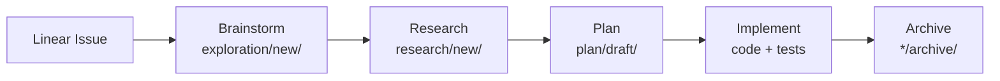

# Development Workflow

> 每个功能/改进都通过一个标准化 pipeline 从想法到代码。
> 本文档定义了 pipeline 各阶段的规则、文档格式、和文件流转方式。
> 适用于 Flywheel 自身开发，也适用于 Flywheel 管理的任何项目。

## Pipeline Overview



每个 Linear issue 对应一条完整的 pipeline。Issue 是 single source of truth。

## Stage Definitions

### 1. Linear Issue (Trigger)

所有工作从 Linear issue 开始。Issue 创建时必须包含：

- **Title**: `{version}: {feature name}` (e.g., `v0.3-next: Memory Production Setup`)
- **Description**: Context, goal, pipeline stage, 关联文档
- **Priority**: Urgent / High / Medium / Low
- **Labels**: 至少一个 domain label (backend, frontend, architecture, etc.)
- **Project**: Flywheel

### 2. Brainstorm → `doc/exploration/new/`

**目的**: 发散思考，探索方案空间，不做决策。

**输入**: Linear issue
**输出**: Exploration document

**文档格式**:
```markdown
# {version} {Feature Name}

> Linear: [{issue-id}](https://linear.app/geoforge3d/issue/{issue-id})
> Status: Draft | Complete
> Version: {version}

---

## 1. Problem Statement
## 2. Options Analysis
## 3. Recommendation
## 4. Open Questions
```

**完成条件**: 有明确的 recommendation 和 open questions 列表。
**流转规则**: 完成后在 Linear issue 更新 pipeline stage 注释。

### 3. Research → `doc/research/new/`

**目的**: 深入技术调研，验证 feasibility，解答 open questions。

**输入**: Exploration document
**输出**: Research document (编号递增: `001-xxx.md`, `002-xxx.md`)

**文档格式**:
```markdown
# {number}: {Research Topic}

> Linear: [{issue-id}](https://linear.app/geoforge3d/issue/{issue-id})
> Source: `doc/exploration/new/{exploration-file}`
> Version: {version}

---

## 1. Research Questions
## 2. Findings
## 3. Conclusions
## 4. Implications for Plan
```

**完成条件**: 所有 research questions 有答案，conclusions 可以直接 feed 到 plan。
**可选**: 不是每个 feature 都需要 research（如果 exploration 已经够清楚）。

### 4. Plan → `doc/plan/draft/`

**目的**: 详细实施计划，可以直接交给 `/implement` 执行。

**输入**: Exploration + Research documents
**输出**: Implementation plan

**文档格式**:
```markdown
# {version} {Step}: {Feature Name}

> Linear: [{issue-id}](https://linear.app/geoforge3d/issue/{issue-id})
> Source: `doc/exploration/new/{file}`, `doc/research/new/{file}`
> Status: draft | codex-approved
> Version: {version}

---

## Overview
## Tasks (ordered)
## Test Plan
## Risks & Mitigations
## Commit Messages
```

**完成条件**: Codex design review APPROVED (`status: codex-approved`)。
**流转规则**:
- Draft → `plan/draft/`
- Deferred → `plan/backlog/`
- Codex approved → ready for `/implement`

### 5. Implement → Code

**目的**: TDD 实现，每个 task 一个 commit。

**入口**: `/implement doc/plan/draft/{plan-file}.md`
**流程**: Branch → TDD → Code Review → PR → Merge

**规则**:
- Feature branch: `feat/{version}-{feature-slug}`
- Commit messages: Plan 中指定的 conventional commits
- PR 必须链接 Linear issue
- Code review (Codex/Gemini) 必须 APPROVED

### 6. Archive → `*/archive/`

**目的**: 完成的文档归档，保持 `new/` 和 `draft/` 干净。

**归档规则** (严格按依赖链):
| Document Type | Archive When |
|--------------|-------------|
| Exploration | Research complete (或无需 research 的参考文档) |
| Research | Plan complete |
| Plan | Implementation merged (或 abandoned with reason) |

**操作**: `git mv doc/{type}/new/{file} doc/{type}/archive/{file}`

**归档后更新**:
1. CLAUDE.md — 移除 Active Explorations 引用
2. MEMORY.md — 更新 Doc Index 路径和状态
3. Linear issue — 更新状态为 Done

## File Naming Conventions

| Type | Pattern | Example |
|------|---------|---------|
| Exploration | `{version}-{slug}.md` | `v0.3-memory-system.md` |
| Research | `{number}-{slug}.md` | `009-mem0-node-sdk-integration.md` |
| Plan | `{version}-{step}-{slug}.md` | `v0.3-step1-memory-system.md` |

## Pipeline Tracking in Linear

每个 issue 的 description 中标注当前 pipeline stage:

```
## Pipeline Stage: {current stage} → {next stages}
```

Examples:
- `Pipeline Stage: Brainstorm → Research → Plan → Implement` (刚开始)
- `Pipeline Stage: Plan exists → Implement` (plan 已写好)
- `Pipeline Stage: ✅ Complete` (已归档)

## Slash Commands Mapping

| Pipeline Stage | Command |
|---------------|---------|
| Brainstorm | `/brainstorm` |
| Research | `/research` |
| Plan | `/write-plan` → `/codex-design-review` |
| Implement | `/implement {plan-file}` |
| Code Review | `/codex-code-review` or `/gemini-code-review` |

## Generalization to Other Projects

本 workflow 可以直接 apply 到任何项目：

1. **创建 `doc/` 目录结构**: `exploration/`, `research/`, `plan/`, each with `new/` and `archive/`
2. **复制本文件** 到项目根目录
3. **Linear project** 作为 tracking hub
4. **CLAUDE.md** 引用 WORKFLOW.md

唯一需要项目化的是：
- Linear team/project name
- Version numbering scheme
- Domain-specific labels
