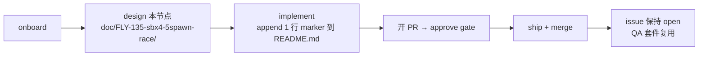

# Design: FLY-135 — [Sandbox] FLY-SBX-4 minimal doc-only change (5-spawn race fixture)

**Issue**: FLY-135 ([Sandbox] FLY-SBX-4 — dummy issue for FLY-128 5-spawn race testing)
**Date**: 2026-07-23
**Status**: Complete (design node deliverable)
**Repo**: `xrliAnnie/flywheel-qa-sandbox`(slot worktree,branch `project-slot-2-FLY-135`)

## 一句话总结

Implement 节点在沙箱仓 README.md 末尾 append **恰好一行**带 issue ID + UTC 时间戳的 marker 行,开 PR,等 approve gate,ship + merge —— 除此之外不碰任何东西。

## 背景

FLY-135 是 FLY-60 Hard Gate E2E QA 套件的 5 个常驻沙箱 issue 之一(FLY-SBX-4,与 FLY-124/FLY-SBX-1 同胞),用于 FLY-128 的 5-Runner 并发 spawn race 测试。issue 本身**永久保持 open**,内容规格冻结。本设计节点的产出是给 implement 节点的最小执行合同。

## 核心流程

## 变更合同(implement 节点执行规格)

| 项 | 规格 |
|----|------|
| 目标文件 | `README.md`(仓根) |
| 操作 | 在文件末尾 append 恰好一行,保留结尾换行 |
| 行格式 | `FLY-135 5-spawn race marker <UTC 时间戳 YYYYMMDDTHHMMSSZ>` |
| 先例 | 仓内已有同形态行:`FLY-1375 land E2E marker 20260722T023540Z` |
| Commit | `docs(FLY-135): append 5-spawn race marker (FLY-SBX-4)` |
| PR | base `main`,body 链接 FLY-135,test plan 注明 doc-only 无需测试 |
| 禁止 | 不关 issue、不改 issue scope、不做代码/配置变更、不动其他文件 |

时间戳取 implement 执行时刻的 UTC,保证 5 个并发 sibling 的 marker 行内容互不相同且可溯源。

## 关键取舍与被否方案

1. **README.md 而非 CLAUDE.md**(已选 README):CLAUDE.md 会被注入每个后续 session 的上下文,反复 append marker 会持续污染所有 agent 的 context;README.md 是惰性文件,且仓内 marker 先例都在 README。
2. **append 单行 @EOF 而非改写现有内容**(已选 append):改动面最小、review 平凡、与既有先例一致。已知代价:5-spawn race 下 5 个 sibling 分支都 append EOF,**顺序 merge 时第 2 个及以后的 PR 会在 EOF 产生冲突** —— 这是 QA 套件的已知形态,行内自带 issue ID + 时间戳使冲突解决(update branch 后重放自己那一行)平凡化。不为此引入 per-issue 独立文件等花哨方案 —— 那会改变 QA 依赖的稳定 spec。
3. **不写测试**(已选不写):doc-only 单行 append,无可测行为;强行加测试违反最小改动原则(PR test plan 中显式 waiver)。

## 诚实边界

- **本设计做**:定义 implement 节点的单行 append 合同 + PR/gate 流程。
- **本设计不做**:不改 QA 套件、不解决 5-PR 并发 merge 的 EOF 冲突自动化(归 ship 路径/QA 套件所有)、不关闭或修改 FLY-135 issue、不产生任何代码变更。
