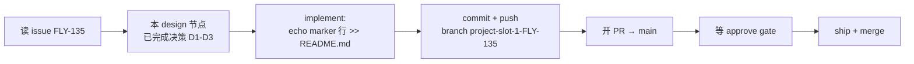

# Design: FLY-SBX-4 spawn-race fixture — 最小 doc-only 变更设计 — FLY-135

**Issue**: FLY-135([Sandbox] FLY-SBX-4 — dummy issue for FLY-128 5-spawn race testing;permanently-open QA fixture)
**Date**: 2026-07-23
**基于**: FLY-135 issue spec(FLY-60 Hard Gate E2E / FLY-128 5-spawn race)+ 本仓 README.md 既有 QA marker 行先例(FLY-1375 等)

## 一句话

为 FLY-128 5-spawn race 测试设计本 Runner 的最小 doc-only 变更:在 sandbox 仓 `README.md` 末尾追加**一行**带唯一标识(issue + exec-id + UTC 时间戳)的 marker,走标准 PR → approve → ship 流程。

## 目标 / 非目标

**目标**
- 给 implementation 节点一个可直接执行、零歧义的变更规格。
- 变更内容对 5 个并发 sibling Runner(FLY-SBX-1..5)各自唯一,便于 QA 事后核对每个 spawn 的落点。
- 严格遵守 issue 的 DO-NOT 约束:不关 issue、不改 scope、不引入真实工作。

**非目标(honest boundary)**
- 不测 merge 语义:race 测的是 **5-spawn 并发 spawn/Terminal race**,不是 5 个 PR 的合并顺序。若多 PR 先后 merge 在 README 末尾产生相邻行冲突,由 ship 流程 rebase 解决,不在本设计加协调机制。
- 不做任何代码/配置改动,不动 CLAUDE.md,不新建长期文件(本 doc 文件夹除外,它是 design 节点的标准交付物)。

## 设计决策

### D1: 落点选 README.md(而非 CLAUDE.md)

| 选项 | 结论 | 理由 |
|------|------|------|
| **README.md 末尾追加** | ✅ 采用 | 已有先例(`FLY-1375 land E2E marker ...` 等 marker 行就在 README 末尾);README 是惰性文档,追加噪音行零副作用 |
| CLAUDE.md 追加 | ❌ 拒绝 | CLAUDE.md 是指令承载文件,每个后续 agent session 都会加载;往里追加 QA 噪音会污染未来 session 的上下文 |
| 每次新建 marker 文件 | ❌ 拒绝 | 仓库会被 QA 反复跑积攒的碎文件填满;且偏离既有 README 先例 |
| 空 commit(no-op) | ❌ 拒绝 | issue spec 明确要求 doc-only **content** change |

### D2: marker 行格式(唯一性规格)

```
FLY-135 (FLY-SBX-4) spawn-race marker <UTC-ISO8601> exec 81c0a25a
```

- `FLY-135 (FLY-SBX-4)`:五个 sibling issue 各自不同 → 跨 issue 唯一。
- `<UTC-ISO8601>`(implement 时刻取,如 `20260723T???\???Z` 形式):同一 issue 被 QA 重复跑时仍唯一。
- `exec 81c0a25a`(execution id 前 8 位):把行精确绑回本次 run,QA 核对 spawn↔落点一一对应。

### D3: 流程遵循 sandbox 标准五步

不引入任何新流程;implementation 节点按 issue spec 原样走。

## 核心流程(handoff 给 implementation 节点)



implementation 节点的完整动作清单:
1. 在分支 `project-slot-1-FLY-135` 上,向 `README.md` 末尾追加一行(格式见 D2,时间戳现取)。
2. commit(建议:`test(FLY-135): append FLY-SBX-4 spawn-race marker`)并 push。
3. 开 PR(base `main`),PR body 链接 FLY-135。
4. 等 approve → ship + merge(由既有 gate/ship 流程驱动,不自行绕过)。

## 数据 / 结构模型

```
xrliAnnie/flywheel-qa-sandbox (branch: project-slot-1-FLY-135)
├── README.md                                  ← 唯一被改的既有文件(+1 行,EOF)
├── CLAUDE.md                                  ← 不动
└── doc/FLY-135-sbx4-spawn-race-fixture/       ← design 节点交付物(本文件夹)
    ├── design.md                              ← 本文件(implementation handoff)
    ├── design-report.html                     ← founder 视图
    └── progress.md                            ← 进度账本
```

## 风险与已知留白

- **相邻行 merge 冲突**(5 个 PR 都在 EOF 追加):接受;ship 时 rebase 即解,冲突本身不含语义。
- **QA 重复跑同一 issue**:D2 时间戳保证行唯一,README 单调增长——sandbox 仓的预期形态,不清理。
