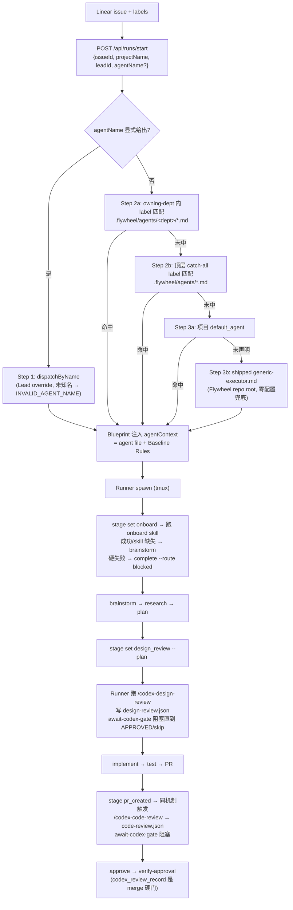

# Design: Runner Pipeline Gaps — Agent Dispatch + Codex Review Gates + Onboard Stage

**Issue**: FLY-137 (Runner pipeline gaps: agent dispatch + Codex review hooks + onboarding step missing)
https://linear.app/studio/issue/FLY-137
**Date**: 2026-07-23
**Based on**: `doc/engineer/exploration/new/v1.27.0-FLY-137-runner-pipeline-gaps-audit.md`, `doc/engineer/research/new/v1.27.2-FLY-137-geoforge3d-agents-audit.md`, 本仓代码现状核对（见 §1）
**Status**: design-node handoff（bounded design phase 产物；successor 由 DAG orchestrator 派发）

---

## 0. 一句话总结

把 Runner pipeline 的四个断点（agent 文件不随 label 分发、design/code 两道 Codex review 不触发、onboarding 无显式阶段）统一收敛为一条**确定性、配置驱动、fail-closed** 的 spawn→onboard→review-gated 流水线：Bridge 按 `.flywheel/config.yaml` 的 `agents:` 声明做 3-step 确定性分发（Lead override → label 匹配 → shipped generic 兜底），review 触发从"祈祷 Runner 记得跑 hook"改为 **Bridge 侧 stage 事件自动触发 + Runner 侧 `await-codex-gate` 阻塞等待**，onboard 成为 `VALID_STAGES` 里的一等阶段。

## 1. 现状核对（设计的事实基线）

本设计节点先对照仓库代码核实了两份既有审计文档的结论。**关键事实：本仓快照中 FLY-137 v1.27.2 的核心机制已经落地**，设计文档如实以"已成形设计 + 剩余边界"呈现，而不是假装从零设计：

| Gap（issue 原文） | 代码现状（本仓实证） |
|---|---|
| Gap 1: label → agent file 分发没接 | ✅ 已成形：`AgentDispatcher`（`packages/edge-worker/src/AgentDispatcher.ts`，319 行，dept-aware 3-step）已在 `run-infra.ts:423,740` 接线（注释明确 "was undefined pre-v1.27.2"）；`dispatchByName` 支持 Lead override |
| Gap 2: Codex design-review 不触发 | ✅ 已成形：`stage set design_review --plan <path>` → Bridge event-route 自动触发；`await-codex-gate`（`packages/flywheel-comm/src/commands/await-codex-gate.ts`，注释标 "FLY-137 Phase 5"）阻塞等待结果 JSON，fail-closed |
| Gap 3: Codex code-review 不触发 | ✅ 已成形：同一 gate 机制的 `code` review type（`pr_created` 触发）；`codex_review_record` + `verify-approval` CLI 镜像；后续 FLY-1188 又加了 cross-family reviewer-inversion |
| Gap 4: onboarding 无显式 stage | ✅ 已成形：`onboard` 在 `VALID_STAGES`（`stage-utils.ts`，注释标 "FLY-137 v1.27.2"），语义 = "attempted onboarding"（intent 信号） |

因此本文的价值 = 把散在代码注释与两份审计里的设计**整合成一份可交接的正式设计**（含 tradeoff、rejected alternatives、诚实边界），作为 design node 的 handoff artifact。

## 2. 核心流程设计



三条设计主线：

1. **分发确定性**：不用 LLM 分类、不写死 role enum。分发输入 = issue labels（caller 在边界 lowercase 归一）+ `DepartmentRegistry` 解析的 owningDept；输出 = `AgentDispatchResult { agentName, agentConfig, matchMethod, agentFileRoot, department }`。`matchMethod`（`override|label|default|shipped-generic|shipped-qa`）留审计痕迹。
2. **review 触发从 prompt 层降到机制层**：issue 原文假设走 "settings.json 继承 user-level PostToolUse hooks"——设计**否决**了这条路（见 §4-R3）。取而代之：Bridge 在 stage 事件上写 Codex instruction 文件，Runner 用 `await-codex-gate` 轮询 `.flywheel/runs/<execId>/codex/<type>-review.json`，**超时/坏 schema/坏 JSON 一律 exit 1（fail-closed）**；治理级跳过走 Bridge 写的 `skip.json`（codex-skip label），而不是 Runner 自由裁量。
3. **onboard 一等化**：`onboard` 插进 `started` 与 `brainstorm` 之间。语义刻意定为 "attempted"（Runner 在跑 skill **之前** set，dashboard 反映意图）；失败不新增 error stage，复用现有 `complete --route blocked --summary "onboard_failed: <reason>"` 终态通道。

## 3. 数据 / 结构模型

### 3.1 配置（`.flywheel/config.yaml`）

```yaml
agents:
  backend:
    agent_file: .flywheel/agents/product/backend-executor.md   # dept-owned (depth 1)
    match: { labels: [backend, api] }
    departments: [product, platform]   # 可选，FLY-901 dual-register；缺省 = 路径推导的单 dept
  general:
    agent_file: .flywheel/agents/general-executor.md           # 顶层 catch-all (depth 0)
    match: { labels: [chore] }
default_agent: general        # 可选；Step 3a
```

**路径合同（`parsedDept` 强制）**：必须以 `.flywheel/agents/` 开头；depth 0 = 跨部门 catch-all（永不参与 Step 2a）；depth 1 = dept-owned；depth ≥2 或 legacy `.claude/agents/...` → `InvalidAgentFilePathError`（ConfigLoader 加载期即拒，不是 spawn 期才炸）。

### 3.2 保留名（不可被项目占用/可被覆盖）

| 名字 | 语义 |
|---|---|
| `generic` | 永远解析到 shipped `agents/generic-executor.md`（`agentFileRoot: "flywheel"`）；ConfigLoader 拒绝项目声明同名 |
| `qa` | 项目声明了 `agents.qa` 则项目覆盖优先；否则 shipped `agents/qa-executor.md`——每个项目零配置获得独立 QA runner（FLY-579） |

### 3.3 运行期产物

```
.flywheel/runs/<execId>/codex/
├── design-review.json | code-review.json   # Runner 写；schema: {executionId, reviewType, status:"APPROVED", reviewedTarget, timestamp, rounds, codexThreadId}
└── skip.json                               # Bridge 写（codex-skip label 治理跳过）: {executionId, reviewType, reason, timestamp}
```

`await-codex-gate`：2s 轮询 × 30min 默认超时；结果同时经 `codex-review-result` 镜像成 Bridge 事件落 `codex_review_record`（StateStore）——这条记录是 `verify-approval` 的 merge 硬门输入，**review 的最终强制点在 approve/merge 边界，而非写文件当下**。

### 3.4 两层 fallback 的命名区分

- `general-executor.md` = **项目级** catch-all（项目自己写、自己声明）
- `generic-executor.md` = **Flywheel-shipped** 绝对兜底（零配置项目也能拿到 role context + pipeline 合同）
两层共存、各司其职（v1.27.1 明确保留双层）。

## 4. 关键 tradeoff 与被否决的替代方案

| # | 决策 | 被否决的替代 | 理由 |
|---|---|---|---|
| R1 | 确定性 label 匹配 | Haiku 语义分类 step（v1.27.0 曾含，v1.27.1 删） | 分发要可预测、可测试、可审计；LLM 分类引入不确定性 + 延迟 + 成本，且 label 已是 Linear 工作流的一等公民 |
| R2 | 显式 `agents:` 声明 + shipped 兜底 | Bridge 自动扫 `.claude/agents/*.md` 推断 map（审计 Q1 选项 B） | 自动扫把文件系统状态变成隐式行为合同（改个文件名 = 静默改分发）；显式声明 + `generic` 兜底同时拿到 zero-config 可用与声明式可审计 |
| R3 | Bridge 侧 stage 触发 + Runner 侧阻塞 gate | 继承 user-level PostToolUse hooks（issue 原文假设） | hooks 是 prompt 层提醒，fail-open：Runner 忘了/settings 没继承就静默跳过（GEO-371/GEO-372 实证）。gate 命令 fail-closed + Bridge 留痕，review 从"约定"变"机制" |
| R4 | `onboard` 语义 = attempted（intent） | "onboarding succeeded" 语义 / 独立 error stage | Runner 在跑 skill 前 set，dashboard 即刻反映进度；失败复用 `blocked` 终态通道，不膨胀 stage 机 |
| R5 | 每次 spawn 都报 onboard | once-per-project 持久化"已 onboard"标记 | 标记需要新持久化状态 + 失效判定（项目 rules 变了算不算 onboard 过?）；每次报的成本只是 dashboard 一行，简单胜过省一行 |
| R6 | flat dept dirs（depth ≤1） | 任意嵌套（`product/engineering/...`，研究 doc Q3） | 嵌套让 `parsedDept`/dispatch 优先级组合爆炸；一层 dept 已覆盖 `.lead/` 现有组织形态，需要更深再演进 |
| R7 | dispatch 失败兜底到 generic 而非报错 | 无匹配 → spawn 失败 | 分发的职责是"总能给 Runner 一个合理协议"，不是"惩罚没打 label 的 issue"；`matchMethod` 让 Lead 事后看到走了兜底 |

## 5. 诚实边界（这个设计做什么 / 不做什么）

**做**：
- label/config 驱动的确定性 agent 分发 + Lead 显式 override + 双保留名兜底
- design/code 两道 Codex review 的 Bridge 触发 + Runner fail-closed 阻塞 gate + merge 边界硬校验
- onboard 一等 stage（intent 语义）

**不做 / 已知边界**：
1. **无语义分类**：issue 没打 label 且项目没配 `default_agent` → 一律 generic。分发质量取决于 label 卫生。
2. **design gate 的触发依赖 Runner 上报**：Runner 从不 `stage set design_review` 就不会在写 plan 当下被拦——最终强制点在 approve/merge 边界（`verify-approval` 查 `codex_review_record`），写文件时刻是尽力触发而非硬拦截。
3. **onboard stage ≠ onboarding 质量证明**：它是 intent 信号；skill 内容是否被真正遵守不在本设计校验范围。
4. **不覆盖 Lead 侧 agent 文件**（`.lead/` 体系是 FLY-26/FLY-127 的领域）、不解决 marketing-lead 缺位（研究 doc 遗留，独立 issue）、不做 user-level 任意 hooks 的通用继承（被 R3 刻意替代）。
5. **QA-slot 会话状态异常**（本次执行实证）：`flywheel-comm progress` 因 exec-id status=completed 拒写 ledger——progress.md 改为手动维护随 artifacts 提交；该异常属 QA harness 会话状态，不影响设计本身，已在 Lead 报告中如实说明。

## 6. Handoff 给 successor（implement 节点）

本仓快照中核心机制已实现；successor 的合理起点是**验证性收口**而非重写：
1. 对照 §1 表逐条跑通 e2e（label → agent file 注入 → onboard → design gate → code gate → verify-approval）。
2. Gap C 遗留：目标项目（如 GeoForge3D）`.flywheel/config.yaml` 补 `agents:` block + 11 个 executor 按 §3.1 路径合同迁移（README 映射表可自动化生成）。
3. 边界 2 若要收紧（写 plan 当下硬拦），需要 three_stage pipeline 层面的 stage 顺序强制——超出本 issue，另开。
