# Infra Alerts Spec — 告警频道 = bot 工单队列(FLY-927 / FLY-915 ①)

> **Source of truth**:本 spec 是 infra 告警管道的工程合同(实现以此为准)。
> 产品出处 = `product/doc/FLY-915-infra-alerts-pipeline/prd.md` §2 / §3 / §4 / §10.0(CH-1/CH-2/CH-3)。
> 实施 = FLY-927(Router / schema / 门禁 / 速率 / 生命周期 / Watchdog v2)。

## 1. 三频道合同(CH-1 / CH-2 / CH-3)

| 落点 | 进什么 | 谁发 | 会不会 @Annie |
|---|---|---|---|
| **CH-1 · #flywheel-alerts**(告警频道 = bot 工单队列) | **没有**专属 issue thread 的 infra 真问题(工单白名单,§3) | **只有** infra bot 发送身份(+ auto-repair);别的进程被门禁拒(§6) | **默认不 @** —— owner bot 先 ACK + ARC;**修不掉才 @**(T2,§5) |
| **CH-2 · #flywheel-notify**(通知频道) | 非紧急 digest:token report / 系统重启 / 账号轮转成功 / 例行状态 | Claude Infra Bot(sender 迁移 = FLY-929,本期只留 Router 分类占位) | **绝不 @** |
| **CH-3 · [FLY-XX] issue thread** | 有专属 thread 的错误(issue 进展类)+ founder 通知(milestone / ship-ready / stuck page) | 对应 Lead bot / `founder-thread-notifier` | 就地 @(Annie 在上下文) |

**路由决策(D1,按「响应者」划分 —— brainstorm gate 裁定)**:

```mermaid
flowchart TD
    ERR["一条 infra 事件"] --> K{kind 属于哪类?}
    K -->|"infra 进程健康类<br/>(TICKET_KINDS,bot 修得了)"| AL["CH-1 工单队列<br/>(即使绑着 issue —— 响应者是 infra bot)"]
    K -->|"issue 进展类<br/>(ISSUE_PROGRESS_KINDS)"| Q{绑得到 [FLY-XX] thread?}
    Q -->|是| TH["CH-3 那条 issue thread"]
    Q -->|"否(fail-safe)"| AL
    K -->|"非紧急通知类<br/>(v1 无 kind 映射,FLY-929)"| NO["CH-2 通知频道"]
```

- 实现:`packages/teamlead/src/bridge/infra-event-router.ts`(纯函数 `classifyInfraEvent`)+
  `infra-alert-wiring.ts`(sessions → `resolveLeadForIssue` → `chat_threads` 解析 + issue-thread 投递腿)。
- **对 PRD §3.1 的一处明示偏差(D1 背书)**:PRD 字面上按「有没有 thread」分;本合同按**响应者**分 ——
  infra 进程健康类即使绑着 issue 也进队列(修它的是 bot,不是 issue 的 Lead/founder);
  `three_stage_stuck` / `founder_milestone_undelivered` / `runner_lead_pending_unhandled`
  绑得到 thread 时进 thread,绑不到时 fail-safe 进队列(PRD §4.1 那两行覆盖的就是 fail-safe 情形)。
- **绝不静默丢**:路由解析失败 / thread 投递烧完预算 / 任何路由 bug → 原告警 fail-safe 回队列(raw sink)。

## 2. 四条铁律

1. **告警 ≠ 通知**(FLY-523/818 判例正式固化):founder 通知(milestone / ship-ready / stuck page)走 issue thread,
   **绝不**进全局告警频道;告警频道的读者是「能解决问题的 bot」,不是 Annie。
2. **默认不 @Annie,修不掉才 @**:工单先 @ 唯一 owner bot → ACK → ARC;只有 T2 判定修不掉才升级。
3. **一条工单只有一个 owner**:每条工单只 @ 一个 owner bot;没被 @ 的 bot 不动手(FLY-267 mention-gate 天然保证)。
4. **谁都不救自己**:Claude 账号/auth 问题 @ Codex bot,Codex 账号/auth 问题 @ Claude bot
   (server 端 `actorBackend !== provider` 强制)。

## 3. 工单白名单 + owner 映射

进 CH-1 的 kind 全集 = `TICKET_KINDS`(`infra-event-router.ts`,与 `ALERT_EVENT_TYPES` 同源)。
owner 由 `resolveTicketOwner(kind, provider, registry)` 决定(`ticket-owner-map.ts`):

| kind | provider | owner(唯一 @) |
|---|---|---|
| `usage_limit` / `login_expired` / `rate_limit` / `runner_login_expired` | claude | **Codex bot**(交叉) |
| 同上 | codex | **Claude bot**(交叉) |
| 同上 | unknown | Claude bot(主力默认) |
| `pane_hash_stuck` / `crash_loop` / `runner_stuck_unhandled` / `runner_throttle_stalled` / `tui_window_lost` / `auto_qa_stuck` / `codex_gate_blocked` / `restart_guard_bypass` / `bridge_boot_stale_checkout` / `bridge_wrapper_fail` | 任意 | **Claude bot**(provider 无关默认) |
| `permission_blocked` | 任意 | **none**(权限 = 人的事,直接 needs_human,PRD §4.3 判例) |
| `runner_lead_pending_unhandled` | — | **none + 状态直落 ESCALATED**(FLY-637-ext 梯子催完 K 轮的产物,owner 首响应已发生过) |
| Watchdog v2 checkpoint 类 | — | 动态 `lead:<id>`(经 issue-thread 腿投,不进队列) |

- env:`FLYWHEEL_INFRA_BOT_USER_ID`(Codex bot,已有)+ `FLYWHEEL_CLAUDE_INFRA_BOT_USER_ID`(FLY-928 建好后填)。
- **owner env 未配置 → 不 @、不启 T2 无人认领兜底**,走现状 Cass 行为(FLY-928 前零回归,纯配置翻转)。

## 4. 消息 schema(逐字段)

统一频道模式 + `FLYWHEEL_ALERT_TICKETS=1` 下,每条工单 root 消息:

```
${sev} **${title}** (${leadId} / ${eventType})
🎫 ${projectName} · 首见 ${HH:MM} · owner ${<@ownerId> | ownerLabel | —} · 状态 ${NEW|ACK|REPAIRING|RESOLVED|ESCALATED}
${body}
```

| 字段 | 来源 | 约束 |
|---|---|---|
| 首行 `(leadId / kind)` | 现状锚,**一字节不动**(LeadWatchdog `ALERT_ECHO_START` 依赖它剥回声,FLY-220) | append-only:🎫 行只追加不改首行 |
| `projectName` | payload(修现状缺 project 的问题) | — |
| 首见 | `ticket.firstSeenMs`(PR-2 起取 `alert_threads.first_seen_at`;缺省 = 发射时刻) | 本地 HH:MM |
| owner | owner map(§3);snowflake 校验通过才渲染 `<@id>` + `allowed_mentions.users=[id]` | malformed → 降级 label/—,`parse:[]` |
| 状态 | `alert_threads.ticket_status`;状态变迁 = edit-in-place 重渲染 🎫 行 | edit 失败 → best-effort 降级(thread 叙事是真相流) |

- **echo-immunity 合同**:`ALERT_ECHO_START` 的 kind 交替组从 `ALERT_EVENT_TYPES` **同源派生**
  (新 kind 永不漏剥)+ `^🎫` 分支剥工单头;速率攒批摘要以 🎫 开头且**不含** `(leadId / kind)` 锚。
- eventId 构造(claims.db 合同)**一字节不动**:`sha1(project|leadId|kind|signature)`,shell 与 TS 逐字节一致。

## 5. 工单生命周期(状态机)

```mermaid
stateDiagram-v2
    [*] --> NEW: 检测 → 入队(root @ 唯一 owner)
    NEW --> ACK: owner bot 认领(action 路由回写)
    NEW --> ESCALATED: 无人认领 > 5min(owner 已配置才兜底)
    ACK --> REPAIRING: ARC 尝试
    REPAIRING --> RESOLVED: 修掉 → 安静 resolve(不 @Annie)
    REPAIRING --> ESCALATED: T2 修不掉(重试 2 次 或 5 分钟超时)
    ESCALATED --> [*]: 绑 issue → founder page 落 issue thread;不绑 → Hub needs_human @Annie
    RESOLVED --> [*]
```



- **T1(已锁)**:CH-1 root 消息 **20 条/分钟**,超了攒批(令牌桶 + 溢出摘要,`alert-rate-limiter.ts`;
  Hub thread 叙事 / issue-thread 投递 / meta-alert 不占额度)。
- **T2(已锁)**:修不掉判定 = **重试 2 次 或 距 first-seen 5 分钟超时**;无人认领兜底 = 5min 未 ACK(owner 已配置时)。
- **幂等**:同一问题不重复开工单(claims.db + episode-latch + `alert_threads` active-mapping 复用)。
- **行为变更(Annie 早报确认项)**:`runner_stuck_unhandled` 的 founder page 从「立即页」改为
  「T2 修不掉才页」(`FLYWHEEL_ALERT_TICKETS` 未设 = 立即页现状)。

## 6. 发送方门禁(三层)

| 层 | 机制 | 位置 |
|---|---|---|
| Discord 权限(硬边界) | 告警频道只给 infra bot + 发送身份 Send(ops,写进 FLY-928 部署 runbook) | Discord server 设置 |
| Bridge 代码 | `/api/chat-threads/send`、`/api/chat-threads/create` 目标 = 统一告警频道 → `403 alert_channel_gated`(挂 `FLYWHEEL_ALERT_ROUTING=1`) | `bridge/tools.ts` |
| shell 兜底(D3,与 FLY-954 对齐) | `lead-alert.sh` 认 `FLYWHEEL_UNIFIED_ALERT_CHANNEL_ID` + `FLYWHEEL_ALERT_SENDER_TOKEN_ENV` + 分钟级速率近似(超限落 queue 由 Bridge 代发);token 不进 argv;`allowed_mentions: {parse:[]}` | `scripts/lead-alert.sh` |

**单一发送身份(D2)**:`FLYWHEEL_ALERT_SENDER_TOKEN_ENV` 设了 → root/DM/drain/Hub thread 操作全部坍缩为该身份;
解析不到 token → dead-letter + meta-alert,**绝不**静默回退 own-bot 链(宁可 dead-letter 也不越权发)。
未设 → own-bot→Cass→字母序链逐字保留。生产终态配 `FLYWHEEL_ALERT_DISPATCH_BOT_TOKEN`(专用 sender-only dispatcher;
**绝不配任何 owner bot 的 token** —— bot 收不到自己发的 MESSAGE_CREATE,作者=owner 是自盲区,见 §11 / FLY-1049;CASS 过渡态已裁掉)。
bridge-wrapper 死机 🚨(D4)优先经 `lead-alert.sh`(kind=`bridge_wrapper_fail`),失败保留直 curl fallback。

## 7. 治假冻结(W-B)

- **idle 1h ≠ 冻结**:健康 idle 由 `isIdleHealthyPane`(FLY-193,default-ON)压掉 —— 永久验收断言锁死
  (全部已提交 idle fixture 含 Peter ctx-100% must-suppress;resume-menu / compact-prompt / frozen-compact must-alert)。
- **529 runner 真停要报**:pane 停滞 + 529/overloaded 残留 + **无行级 retry 活动** → `runner_throttle_stalled`
  工单(@ Claude bot,AutoRepairBot 可 ARC);健康 529(在 retry/在烧)沿用 `isTransientThrottlePane` 压制(FLY-218)。
- 已知盲点:frozen-mid-thinking(无 esc 提示)—— follow-up 抓真样本。

## 8. Watchdog v2(stuck-detection generic,FLY-912 事故补入)

- **按真实 stage 报,不靠 heuristic 猜**:kind/措辞取自 `flywheel-comm stage set` 上报的 `sessions.session_stage`。
- **park 元组归属**:〈真实 stage,阻塞方(founder|lead|runner|ci),owner Lead,waiting_since,投递证据〉
  (`checkpoint-park.ts` 纯函数派生)。
- **时效 1h(可配)**:`FLYWHEEL_CHECKPOINT_STUCK_MS`(默认 3600000)。
- **首响应人 = owner,不是 founder**:第一响 wake owning Runner/Lead 自查自愈;再超一窗才 founder page 落 issue thread。
- **文案模板(真话)**:`[FLY-XXX] [Runner] 停在<真实stage>已<N>h,球在<party>,owner=<Lead>,下一步=<…>`
  —— approve 停等的告警必须含「待你拍板/等你 ship」、**绝不**写「code review 卡住」(FLY-912 回归测试)。

## 9. env 开关一览(全部 default-off = 现状逐字节)

| env | 作用 | 生产值 |
|---|---|---|
| `FLYWHEEL_ALERT_ROUTING` | D1 Router + `/send` 门禁 | `1` |
| `FLYWHEEL_ALERT_TICKETS` | 🎫 schema 头 + owner @ + 生命周期/T2 | `1` |
| `FLYWHEEL_ALERT_RATE_PER_MIN` | T1 令牌桶 | `20` |
| `FLYWHEEL_ALERT_SENDER_TOKEN_ENV` | D2 单一发送身份(存 env 名) | `FLYWHEEL_ALERT_DISPATCH_BOT_TOKEN`(专用 dispatcher,作者≠owner —— FLY-1049 修正,CASS 过渡态已裁掉) |
| `FLYWHEEL_CLAUDE_INFRA_BOT_USER_ID` | Claude bot owner @(T3/FLY-928 后填) | 待 FLY-928 |
| `FLYWHEEL_CHECKPOINT_WATCHDOG` / `FLYWHEEL_CHECKPOINT_STUCK_MS` | Watchdog v2 巡检 / 时效 | `1` / 默认 1h |

## 10. 判例链接

- FLY-523(revert)/ FLY-818:founder page 落 issue thread、绝不进告警频道 —— 铁律 1 的出处。
- FLY-220 / FLY-218 / FLY-193:echo-immunity / 529 压制 / idle 识别 —— schema 改动的回归红线。
- FLY-368:统一告警频道 + Hub + auto-repair —— 本合同全部叠加在它之上。
- FLY-637-ext / FLY-605 / FLY-195:既有升级梯子 —— Watchdog v2 只兜底 + 收口措辞,不重建。
- FLY-912:错措辞事故(「Code Review 卡 3h」)—— §8 的直接动机。
- 边界:bot 建/部署 = FLY-928;notify sender 迁移 + self-heal 启用 = FLY-929;quick-fix = FLY-925。

## 11. 运行时开关与 enable 状态(FLY-1049 索引)

§9 的 env 全部 default-off,**统一在一个 founder-gated enable 窗翻转**(先写全表 env、
再一次 Bridge 重启吃下)。执行清单(单一权威,本节只做索引不复制)=
`engineering/doc/FLY-1049-fly915-alerts-closeout/enable-window-runbook.md`
(收敛 FLY-871 C6 部署步 + FLY-929 enable-runbook + 本 spec 所属 FLY-927 plan §5 步 2-5)。

- **发送身份终态(FLY-1049 Codex R1 修正)**:`FLYWHEEL_ALERT_SENDER_TOKEN_ENV=FLYWHEEL_ALERT_DISPATCH_BOT_TOKEN`
  —— 专用 sender-only dispatcher bot,不走 CASS 过渡态,也**绝不用任何 owner bot 的
  token**:Discord bot 收不到自己发的 MESSAGE_CREATE,作者 = owner 会让该 owner 永远
  收不到 @ 自己的工单(自盲区)。不变量:**工单帖作者 ≠ 任何 owner**。
- **FLY-925 先行 env**(`FLYWHEEL_BRIDGE_URL` / `STANDUP_PROJECT_NAME`)已落机
  (2026-07-09,token report 已 GREEN);防复发说明见根目录 `SETUP.md`。
- enable 后的探活/演练/观察 = runbook 步 5-9;验收 = FLY-1049 plan §3 七条。
