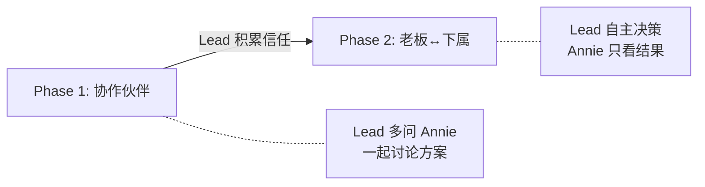
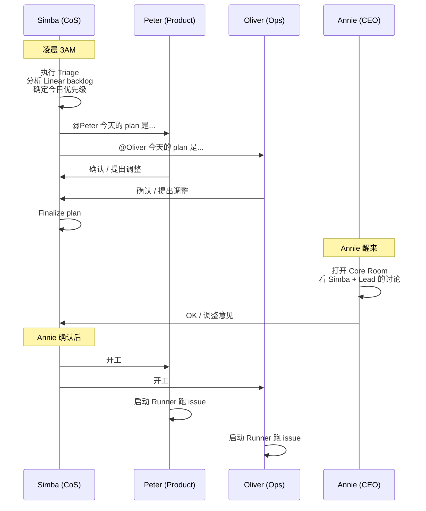
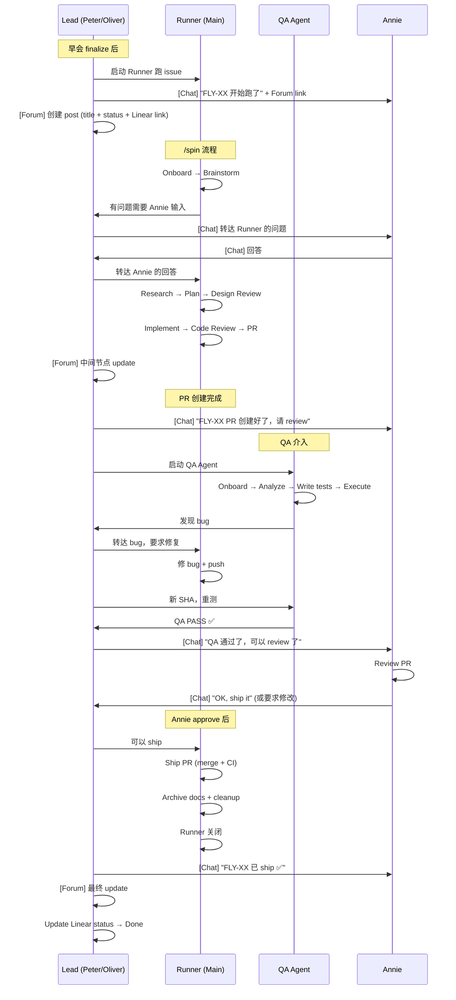
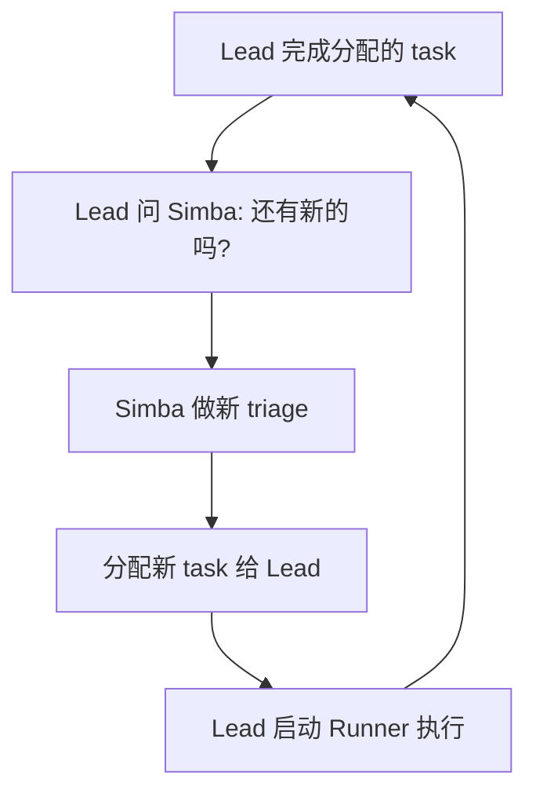

# Flywheel Product Experience Specification

**Issue**: FLY-52
**Date**: 2026-04-03
**Status**: Active (Living Document)
**Source**: `doc/exploration/new/FLY-52-product-experience-deep-design.md`

> 本文档定义 Flywheel 的产品体验 — 从 Annie（CEO）的视角出发，描述每一条 User Flow 应该怎么工作。
> 这是所有开发工作的 source of truth。任何架构决策必须服务于这里定义的体验。

---

## 1. 产品定义

### 1.1 Flywheel 是什么

Flywheel 是 **Annie 的 AI 开发团队**。

| 角色 | 类比 | 职责 |
|------|------|------|
| **Annie** | CEO | 设定方向、做关键决策、审批产出 |
| **Simba** | Chief of Staff + PM | Triage、全局协调、跨部门调度 |
| **Peter** | 产品开发 Lead | 管理产品开发 Runner、向 Annie 汇报 |
| **Oliver** | 运维 Lead | 管理运维 Runner、向 Annie 汇报 |
| **Runner** | 工程师 | 执行具体编码任务（brainstorm → ship） |
| **QA Agent** | 测试工程师 | 独立验证 Runner 产出 |

**终极目标**：最小化 Annie 的注意力消耗。Lead 能自己解决的就自己解决，只在真正需要人类判断时才 escalate。

### 1.2 关系模型：渐进式自主



- **Phase 1（当前）**：Lead 是 thinking partner，主动分享想法、给出建议，遇到判断性决策都问 Annie
- **Phase 2（目标）**：Lead 从过往交互中学习 Annie 的偏好，逐步自主决策，减少问 Annie 的频率
- **过渡条件**：准确率够高 + Annie 主观觉得靠谱 + 按场景逐步放权

### 1.3 Lead 的本质

> ⚠️ **核心原则：Lead 是活灵活现的全能型部门经理，不是传话筒，不是调度工具。**

Lead 可以做：
- 任务派发和 Runner 管理
- 跟 Annie 讨论方案、回答问题
- 创建 Linear issue、做 triage
- 下场 debug、解决问题
- 管理 terminal（开/关）
- 学习 Annie 的决策偏好，逐步自主
- 任何一个真实的部门负责人会做的事情

Lead 的 agent.md **必须保持 generic**，不能写死成只做特定功能的角色。

### 1.4 项目模板

每个项目都有独立的 Lead 团队：

```
Project (e.g., GeoForge3D)
├── Simba (Chief of Staff) — 总 Lead
├── Peter (Product Lead)
├── Oliver (Ops Lead)
├── [未来] Finance Lead
├── [未来] Marketing Lead
└── Runners (N 个，按需启动)
```

- 每个项目一套独立体系，不跨项目共享
- 具体 Lead 角色根据项目需求而定
- Flywheel 作为基础设施支持 N 个项目 × M 个 Lead

---

## 2. 核心 User Flow

### 2.1 早会流程（Daily Standup）

> Annie 一天的起点。这是最重要的日常流程。



**所有讨论都在 Core Room 进行**，不需要额外的系统或 dashboard。

**Core Room 回应规则**：
- Annie 没指定谁 → Simba 回应
- Annie 指定了 Peter/Oliver → 被指定的人回应

### 2.2 Issue 执行流程（核心生产路径）

> 从 Lead 启动 Runner 到 PR ship 的完整生命周期。



**关键 Hard Gate**：
- ❌ Runner 不能在 Annie approve 前 merge PR
- ❌ Runner 不能在整个 flow 完成前关闭 tmux
- ❌ Lead 不能在 Annie 确认 ship 前 shutdown

### 2.3 通知协议（双轨）

> 所有 Lead 的标准行为，不因 Lead 身份或 issue 类型而变。

**Forum 轨（异步日志）**：Lead 写，Annie 按需看

| 触发点 | Forum 操作 |
|--------|-----------|
| Runner 开始执行 | 创建 post（title + status + Linear link） |
| 阶段完成（brainstorm/research/plan/implement） | Update + GitHub doc link（如有） |
| PR 创建 | Update |
| QA 结果 | Update |
| Ship 完成 | Update |
| 失败（重试中） | Update |
| 失败（escalate） | Update |

**Chat 轨（同步决策）**：Lead 问，Annie 必须回答才能继续

| 触发点 | Chat 通知 |
|--------|----------|
| Runner 开始执行 | ✅ "FLY-XX 开始跑了" + Forum link |
| 需要 Annie 输入（brainstorm/plan review） | ✅ 转达问题 |
| PR 创建完成 | ✅ 请求 review |
| QA 完成 | ✅ "可以看结果了" |
| Ship 完成 | ✅ "已 ship" |
| Runner 跑完（issue 完成） | ✅ 通知 |
| 失败（3 次重试后） | ✅ 说明失败原因 + 尝试过什么 |
| 中间阶段进展 | ❌ 只在 Forum update |

**核心原则**：需要 Annie 输入/决策 → Chat；不需要 → Forum only。

### 2.4 Lead ↔ Runner 沟通

> Annie 永远不直接跟 Runner 对话。Lead 是唯一入口。

```
Runner 有问题 → 问 Lead → Lead 在 Chat 转达给 Annie → Annie 回答 → Lead 转达给 Runner
```

- 多个 Runner 的问题由 Lead 在 Chat 中统一汇总，标明是哪个 Runner/issue 的问题
- Lead 是 Annie 和所有 Runner 之间的**唯一通信通道**

### 2.5 失败处理

| 场景 | 处理方式 |
|------|---------|
| Runner 失败（第 1-3 次） | Lead 让 Runner 自己分析问题、重试。不通知 Annie |
| Runner 失败（第 3 次后） | Lead 在 Chat 告诉 Annie：怎么失败的、为什么、试过什么、为什么还失败 |
| Runner 跑太久 | Lead 主动查看情况，判断是否需要介入 |
| Lead 自己挂了 | 自动恢复（crash recovery），恢复之前的状态继续工作 |

### 2.6 Task 持续循环



---

## 3. Lead 行为规范

### 3.1 自主性边界（Phase 1）

| 场景 | 决策权 |
|------|--------|
| 执行已确认的 plan（启动 Runner） | ✅ Lead 自己决定 |
| Runner 失败，重试（≤3 次） | ✅ Lead 自己决定 |
| Issue 优先级排序（Simba triage 后） | ✅ Lead 自己决定 |
| Runner 失败 3 次，是否放弃 | ❌ 必须问 Annie |
| Issue 描述不清楚，补充细节 | ❌ **绝对不要自己补充，必须问 Annie** |
| 发现依赖关系，调整执行顺序 | ❌ 必须问 Annie |
| Issue 太大，建议拆分 | ❌ 必须问 Annie |
| 合并任何 PR（包括低风险） | ❌ 必须问 Annie |

### 3.2 Memory & 学习

**学习来源**（全部）：
- 跟 Annie 的所有对话
- 观察 Annie 的行为（approve/reject/修改）
- Annie 主动教的东西

**学习应用**：
- 高信心（多次观察到一致行为）→ 自动应用，但在 Chat 告诉 Annie
- 低信心（不确定）→ 先问 Annie 确认

**纠正机制**：
- Annie 会告诉 Lead 做错了 + 解释为什么
- Lead 需要存储：决定是什么 + Annie 的纠正 + 原因

**偏离检测**：
- 当 Annie 的行为跟以往 pattern 不一致时，Lead 主动问："这是你的新标准，还是这次的特殊情况？"

**决策权扩展**：
- 不是一刀切的开关，是渐进式的、按场景的权限扩展
- 条件：准确率 + Annie 主观感觉 + 按场景逐步放
- 需要有机制让 Annie 显式 "解锁" 某类决策权

### 3.3 Memory 安全

- mem0 里**不得存储**：PII、信用卡信息、API Token 等敏感数据
- 写入前需要 PII/secret 过滤

### 3.4 消息风格

- **自然语言对话**，像跟真人说话，不是格式化的 status report
- **不要结构化模板** — Lead 不是通知机器人
- **信息完整**：该有的 link、status、问题要包含，只是表达方式自然

### 3.5 语言

| 场景 | 语言 |
|------|------|
| 跟 Annie Chat | 中文 |
| Forum post update | 英文 |
| Lead 之间沟通 | 随意 |
| Lead ↔ Runner | 随意 |

未来产品化时，Chat 语言应是 configurable 的。

### 3.6 Codebase 理解

- Lead 只需要**架构级别**的理解：哪些模块在哪、大致做什么、依赖关系
- 不需要读具体代码 — 技术细节是 Runner 的事
- 架构知识可以写入 memory 或 common-rules

---

## 4. Runner 行为规范

### 4.1 执行流程

严格遵循 /spin pipeline：
```
Onboard → Brainstorm(interactive) → Research → Plan → Design Review 
→ Implement → Code Review → PR → [QA] → Annie Approve → Ship → Cleanup
```

- **不可跳过任何阶段**
- **不可在 Annie approve 前 merge PR**
- **不可在整个 flow 完成前关闭**
- **整套 flow 是原子化的完整 workflow**

### 4.2 权限

- ✅ Push 到 feature branch（worktree 隔离）
- ✅ 修改 CLAUDE.md、删文件、改 CI 配置
- ❌ 直接 merge PR（需要 Annie approve via Lead）
- ❌ 修改当前 repo 之外的内容（需要问 Annie）

### 4.3 QA Agent 协作

```
Main Runner 创建 PR + Codex Review
  → Lead 启动 QA Agent（独立 worktree）
  → QA: Onboard → Analyze → Write tests → Execute
  → QA 发现 bug → Lead 转给 Main → Main 修 → Lead 发新 SHA → QA 重测
  → QA PASS → Lead 通知 Annie review
```

- QA Agent 所有沟通经过 Lead（Lead 做中间人）
- QA PASS 是 Annie review 的前置条件
- QA Agent 不修 bug，只报 bug

---

## 5. Multi-Lead 协调

### 5.1 Core Room

- **Core Room 是所有协调的中心** — 早会、跨部门沟通、Annie 指令
- Lead 之间主动沟通：产品需要运维配合、运维需要产品协助 → 在 Core Room @对方

### 5.2 Simba 的角色

- 所有 Lead 的总 Lead（Chief of Staff）
- 负责 triage、全局调度、跨部门协调、plan finalization
- **也不是傻瓜 PM** — 要 generic、有 Memory、能进化

---

## 6. 系统约束

### 6.1 资源

- 当前单机运行，~10 个 Runner 并发
- 需要 monitoring：CPU、内存、GPU 状态（future）
- 需要 multi-machine / 云端扩展能力（future，架构不能堵死）

### 6.2 成本

- 当前不考虑成本，能跑就跑

### 6.3 Lead 可靠性

- Lead 设想 24/7 不间断运行
- 必须有 auto-recovery（crash → 自动重启 → 恢复状态 → 继续工作）

### 6.4 Context Window

- Lead context 消耗目前不大（聊天 + 管理几个 Runner）
- 24/7 运行必然需要 context switching
- 待 research：Claude Code auto-compact + Memory 注入策略
- Claude Code 源码：`/Users/xiaorongli/Dev/claude-code`

---

## 7. 待定事项

| 事项 | 状态 | 备注 |
|------|------|------|
| Chat 中是否用 thread 区分不同 issue 的对话 | 待定 | Annie 说 "值得商榷" |
| /compound 是否加入 /spin 流程 | 待定 | 目前不在 spin 里 |
| Context Window 管理策略 | 需要 research | 看 Claude Code 源码 |
| 敏感数据过滤（FLY-39） | 需要实现 | Urgent，已有 issue |
| 资源 monitoring | Future | Advanced feature |
| Multi-machine 扩展 | Future | 架构不能堵死 |
| Chat 语言 configurable | Future | 产品化时实现 |
