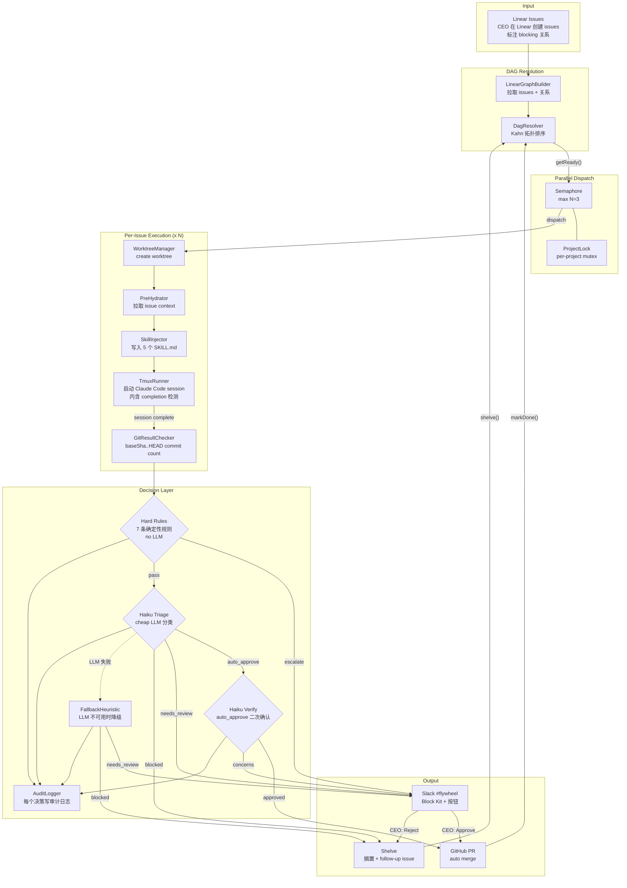
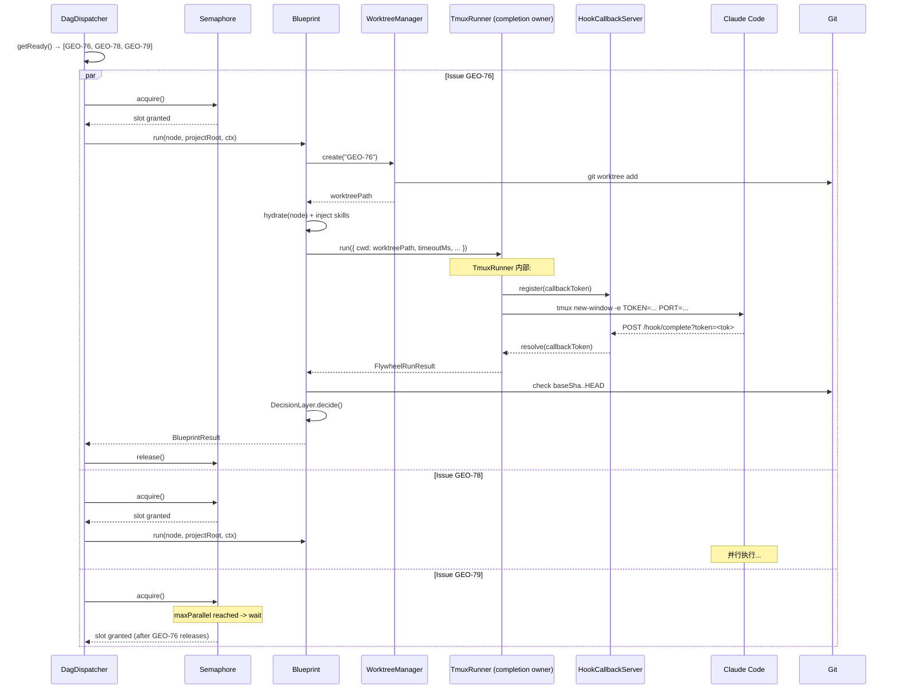
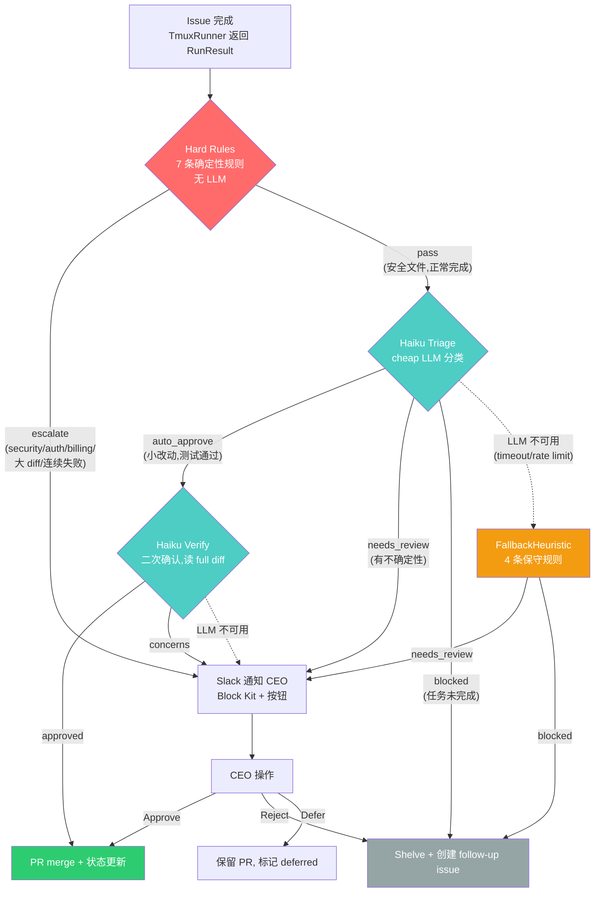
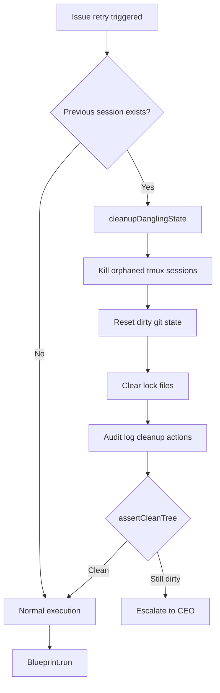
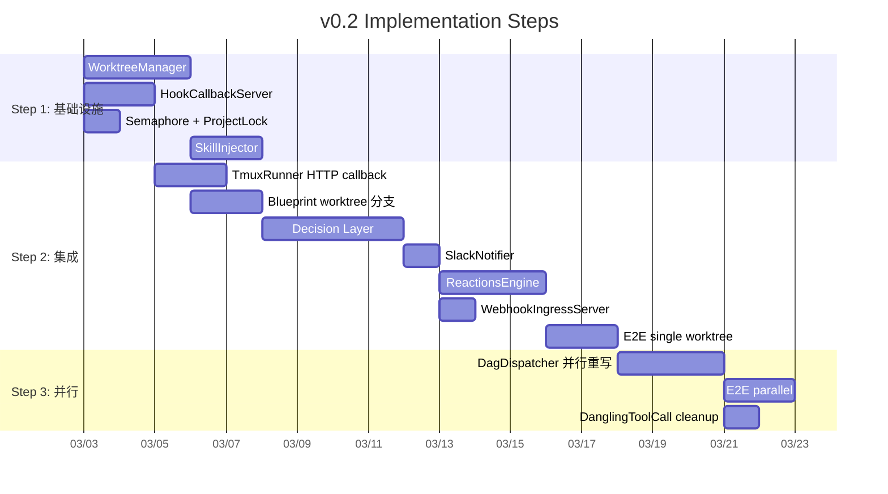
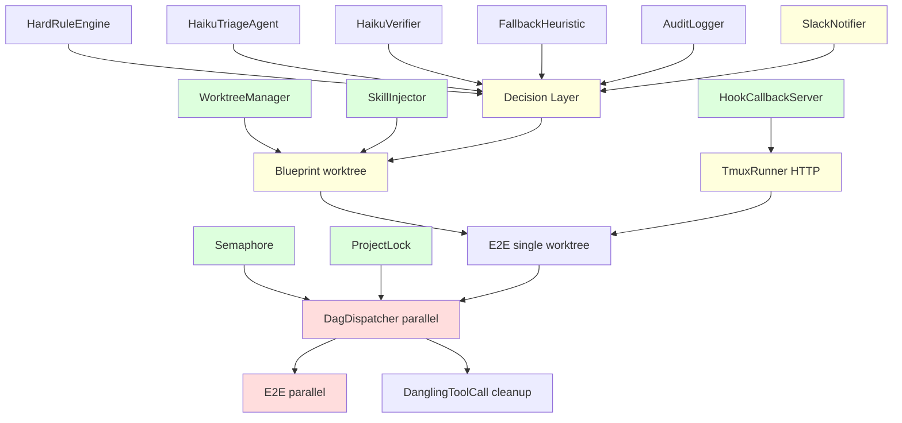

# Flywheel v0.2 Architecture

**Goal:** 从"串行执行 + 人工判断"升级到"并行执行 + 自动决策 + context-aware sessions"。

**v0.2 四大支柱:**

1. **并行执行层** — 每个 issue 在独立 git worktree 中执行，最多 N 个并行 session
2. **Decision Layer** — Hard Rules (确定性) + Haiku Triage/Verify (cheap LLM) + Fallback Heuristic (降级)
3. **Skill 注入系统** — 在 session 启动前写入 `.claude/skills/`，让 Claude 自动发现 project context + issue context + workflow guidance
4. **Reactions 系统** — Slack 按钮回调 (Approve/Reject/Defer)，CEO 通过 Slack 直接控制 Flywheel 决策

**不变的核心原则 (继承自 v0.1.0):**

- **Runner 策略**: spawn 现有 CLI 工具 (Claude Code CLI)，不自己写 agent
- **Blueprint 模式**: 确定性节点 + agent 节点混合编排
- **Model Agnosticity**: 编排层不直接 import LLM SDK，通过 `IFlywheelRunner` 接口调用
- **Pre-Hydrate**: agent 启动前注入 context，减少 token 浪费

---

## Phase 总览 — 从 v0.1.0 到 v0.3

```
Phase 0  ✅  Fork Cyrus, 建 monorepo
Phase 1  ✅  v0.1.0 Core Loop (DAG → headless --print → PR)
Phase 2  ✅  v0.1.1 Interactive Runner (tmux session → pane_dead polling)
Phase 3  ⬜  v0.2  ← 本文档 scope
  ├── Step 1: 基础设施  — 独立组件 (WorktreeManager, HookCallbackServer, Semaphore, SkillInjector)
  ├── Step 2: 集成      — 连接组件 (TmuxRunner 升级, Blueprint 扩展, Decision Layer, Slack 通知, Reactions 按钮回调)
  └── Step 3: 并行      — DagDispatcher 串行→并行重写, E2E parallel
Phase 4  ⬜  v0.3 Per-Project Memory (.flywheel/memory.json → SQLite + sqlite-vec)
Phase 5  ⬜  CIPHER Decision Intelligence (pattern learning + auto-decide)
```

**v0.2 (Phase 3) 的 3 个 Step 是递进关系**：Step 1 的组件独立可测，Step 2 把它们连接起来形成完整的单 issue 流程，Step 3 把单 issue 扩展为多 issue 并行。每个 Step 完成后都是可交付的。

---

# CEO Overview

## 我们在建什么

v0.1.1 已经能做到：你给 Flywheel 一批 Linear issues，它按顺序一个个执行 — 在 tmux 里启动 Claude Code session，写代码、提交、创建 PR。但它是**串行的**、**不会自主判断结果**、也**不知道项目的 coding conventions**。

v0.2 做三件事：

1. **并行执行**: DAG 中没有依赖关系的 issues 同时开跑（最多 3 个），每个在独立的 git worktree 里。完成时间从 N * T 降到 ~T（取决于并行度）。
2. **自动决策**: issue 完成后，Decision Layer 自动判断结果 — 安全的小改动直接 merge，大改动通知你在 Slack 审核，有问题的自动 shelve。你不需要逐个检查每个 PR。
3. **Context 注入**: 每个 session 开始前，Flywheel 把项目 context、issue 详情、git workflow 规范作为 skills 写入 worktree。Claude 不用花 token 去"发现"已知信息。

## v0.1.1 → v0.2 变化

| 维度 | v0.1.1 | v0.2 |
|------|--------|------|
| 执行模式 | 串行，共享目录 | 并行，per-issue worktree |
| 完成检测 | SessionEnd hook + pane_dead polling | HTTP callback (primary) + pane_dead (fallback) |
| 结果处理 | `commitCount > 0` = 成功，无后续动作 | Decision Layer 三路路由 (auto_approve / needs_review / blocked) |
| Session context | 仅 system prompt | 5 个 Flywheel Skills (`.claude/skills/`) |
| Retry cleanup | 无 | `cleanupDanglingState()` 清理 orphan tmux/git 状态 |

## v0.2 完成后的完整数据流



---

# Architecture Deep Dive

## 2.1 并行执行层

### 核心变化

```
v0.1.1:  DAG → issue1 → issue2 → issue3  (串行，共享目录)
v0.2:    DAG → ┬ issue1 (worktree1) ─→ done
               ├ issue2 (worktree2) ─→ done   (并行，隔离目录)
               └ issue3 (worktree3) ─→ done
```

### 组件概览

| 组件 | 来源 | 职责 |
|------|------|------|
| `WorktreeManager` | superset-ai git.ts 移植 | 创建/删除/列出 worktree，macOS rename trick |
| `HookCallbackServer` | superset-ai notify-hook 移植 | HTTP server 接收 SessionEnd callback |
| `Semaphore` | 新增 | 限制最大并行数（默认 3） |
| `ProjectLock` | superset-ai workspace-init-manager 移植 | Per-project mutex，防止并发 worktree 操作冲突 |

### WorktreeManager

**路径策略:**

```
~/.flywheel/worktrees/
├── geoforge3d/                    ← 项目名
│   ├── flywheel-GEO-76/          ← branch: flywheel-GEO-76
│   ├── flywheel-GEO-78/
│   └── flywheel-GEO-79/
├── another-project/
│   └── flywheel-PROJ-42/
```

Branch 名加 `flywheel-` 前缀，避免与用户手动创建的 branch 冲突。

**TypeScript Interface:**

```typescript
interface IWorktreeManager {
  /** 为一个 issue 创建 worktree */
  create(opts: {
    mainRepoPath: string;
    projectName: string;
    issueId: string;
    startPoint?: string;  // default: "origin/main"
  }): Promise<WorktreeInfo>;

  /** 删除 worktree（macOS 安全的 rename + background rm） */
  remove(mainRepoPath: string, worktreePath: string): Promise<void>;

  /** 检查 worktree 是否已注册 */
  isRegistered(mainRepoPath: string, worktreePath: string): Promise<boolean>;

  /** 列出所有 worktree */
  list(mainRepoPath: string): Promise<ExternalWorktree[]>;

  /** 清理所有孤儿 worktree（branch 已合并或目录不存在） */
  pruneOrphans(mainRepoPath: string, projectName: string): Promise<string[]>;
}

interface WorktreeInfo {
  projectName: string;
  issueId: string;
  worktreePath: string;     // 绝对路径
  branch: string;           // "flywheel-GEO-76"
  mainRepoPath: string;
}

interface WorktreeConfig {
  baseDir?: string;          // 默认 ~/.flywheel/worktrees
  createTimeoutMs?: number;  // 默认 120_000
  pruneTimeoutMs?: number;   // 默认 10_000
}
```

**Worktree 创建关键实现细节:**

- `git worktree add <path> -b <branch> <startPoint>^{commit}` — 使用 `^{commit}` 后缀防止 implicit upstream tracking（来自 superset-ai 的关键发现）
- 创建后设置 `push.autoSetupRemote = true`，首次 push 自动创建远程 branch
- Git lock error 友好提示（检测 `.lock` file exists 错误）
- Branch 已被其他 worktree 检出时抛出描述性错误

**Worktree 删除关键实现细节（macOS 安全）:**

1. `rename()` 到同文件系统的临时目录（避免 EXDEV cross-device error）
2. `git worktree prune` 清理 git metadata
3. `spawn /bin/rm -rf` 后台删除（不阻塞调用方）

为什么不用 Node.js `fs.rm()`: macOS 上遇到 .app bundle 的 extended attributes 时 `fs.rm()` 会 hang。`/bin/rm` 是原生实现，更可靠。

### HookCallbackServer

v0.1.1 使用 marker file + pane_dead polling 检测 session 完成。v0.2 升级为 HTTP callback — 多 session 并行时需要区分哪个 session 完成了。

### Completion Detection Owner: TmuxRunner (单一职责)

**v0.2 策略**: TmuxRunner.run() **仍然是阻塞调用** — 它负责 launch + wait + return。Blueprint 不做额外的 `waitForCompletion()`。

v0.2 升级 TmuxRunner 内部 completion 检测策略:
- **Primary**: HTTP callback (HookCallbackServer) — 比 pane_dead 更快、更可靠
- **Fallback**: pane_dead polling (已有, v0.1.1) — hook 未安装或 server 崩溃时自动接管
- **Timeout**: 来自 `FlywheelRunRequest.timeoutMs`（统一来源，不再有两套 timeout）
- **Trust Prompt 自动处理** (v0.2 Step 2b): 在 pane polling 中检测 "Do you trust the files in this folder?" 等 workspace trust prompt，自动发送 Enter 消除。模式参考 Claude Squad (`CheckAndHandleTrustPrompt()`)。v0.1.1 E2E 测试已发现此问题 — `bypassPermissions` 不跳过 trust prompt。详见 `doc/engineer/exploration/new/v0.2-external-repo-survey.md` §2.5。

```typescript
interface IHookCallbackServer {
  /** 启动 HTTP server */
  start(port?: number): Promise<number>;  // 返回实际 port

  /** 停止 server */
  stop(): Promise<void>;

  /**
   * 注册一个等待: 当收到匹配 callbackToken 的 POST 时 resolve Promise。
   * callbackToken 由 TmuxRunner per-run 生成 (UUID)。
   */
  waitForCompletion(callbackToken: string, timeoutMs: number): Promise<SessionEndEvent>;
}

interface SessionEndEvent {
  callbackToken: string;
  sessionId: string;     // Claude hook 天然提供的 session_id (参考用)
  timestamp: string;
  exitCode: number | null;
}
```

**Transport Contract (端到端):**

```
Blueprint                 TmuxRunner (completion owner)           Claude Code          Hook Script          HookCallbackServer
   │                          │                                      │                    │                      │
   │── runner.run(req) ──────→│                                      │                    │                      │
   │   (blocking call)        │── callbackToken = uuid()             │                    │                      │
   │                          │── server.waitFor(token, timeout)  ──→│                 ──→│                  ──→ │ register(token)
   │                          │── tmux new-window -e                 │                    │                      │
   │                          │   FLYWHEEL_CALLBACK_PORT=<port>      │                    │                      │
   │                          │   FLYWHEEL_CALLBACK_TOKEN=<token>    │                    │                      │
   │                          │── also start pane_dead polling ──→   │                    │                      │
   │                          │   (fallback)                         │                    │                      │
   │                          │                                      │── session ends ───→│                      │
   │                          │                                      │                    │── POST /hook/complete │
   │                          │                                      │                    │   ?token=<tok>        │
   │                          │                                      │                    │──────────────────────→│── resolve(token)
   │                          │←── first of: callback OR pane_dead ──│────────────────────│←─────────────────────│
   │←── FlywheelRunResult ────│                                      │                    │                      │
```

**关键设计决策:**

1. **Completion owner = TmuxRunner（唯一）**。TmuxRunner.run() 是阻塞调用，内部管理 callback + pane_dead + timeout。Blueprint 只需 `await runner.run()` 一次，不做额外等待。这与 v0.1.1 的调用语义完全一致（[TmuxRunner.ts#L89](../../packages/claude-runner/src/TmuxRunner.ts#L89)），只是内部策略从 pane_dead-only 升级为 callback+pane_dead race。

2. **Correlation key = `callbackToken` (UUID)，不是 `sessionId`**。原因: Claude hook 的 `session_id` 和 CLI `--session-id` [不一定相同](../../packages/claude-runner/src/TmuxRunner.ts#L151)。TmuxRunner 内部生成 callbackToken，不暴露给 Blueprint。

3. **环境注入: `tmux new-window -e`（per-window）**。`tmux set-environment` 作用于 session scope，并行窗口互相覆盖。`new-window -e VAR=value` 是 per-window 注入。

4. **Timeout 统一来源**: `FlywheelRunRequest.timeoutMs` → 传入 TmuxRunner → 同时用于 callback wait 和 pane_dead polling。Blueprint/DagDispatcher 不再有独立 timeout。当前默认 30min（[TmuxRunner.ts#L47](../../packages/claude-runner/src/TmuxRunner.ts#L47)），v0.2 config 可通过 `parallel.sessionTimeoutMs` 覆盖。

5. **HookCallbackServer 生命周期**: DagDispatcher 在 `dispatchAll()` 开始时 `start()`、结束时 `stop()`。TmuxRunner 通过构造函数接收 `hookServer` 引用，在每次 `run()` 中注册 per-run callback token。

6. **FlywheelRunRequest 无新字段** — callbackToken 和 port 是 TmuxRunner 内部实现细节，不进入 runner 契约。

### Semaphore + ProjectLock

```typescript
/** 异步信号量 — 限制并行 session 数 */
class Semaphore {
  constructor(private maxParallel: number) {}

  /** 获取一个 slot（可能等待） */
  async acquire(): Promise<void>;

  /** 释放一个 slot */
  release(): void;

  /** 当前可用 slot 数 */
  get available(): number;
}

/** Per-project mutex — 防止同一项目的并发 worktree 操作冲突 */
class ProjectLock {
  /** 获取项目锁 */
  async acquire(projectName: string): Promise<() => void>;  // 返回 release function
}
```

### Worktree 生命周期时序



### 错误处理

| 场景 | 处理 |
|------|------|
| Worktree 创建失败 (git lock) | 抛出描述性错误，DagDispatcher 将 issue 标记为 failed |
| Worktree 创建失败 (branch 已存在) | 尝试 `pruneOrphans()` 清理后重试一次 |
| Hook server 崩溃 | TmuxRunner 内部 pane_dead polling 自动接管（5s 间隔，timeout 由 `FlywheelRunRequest.timeoutMs` 控制） |
| Worktree 清理失败 | 记录 warning，不阻塞后续执行；`pruneOrphans` 在下次 dispatch 前后执行 |
| Git lock 冲突 (多 worktree) | `ProjectLock` mutex 序列化同一项目的 worktree 操作 |

---

## 2.2 Decision Layer

### 架构概览

Decision Layer 的核心职责：**在 Claude Code session 完成一个 issue 后，决定如何处置结果** — 自动合并、通知 CEO 审核、还是搁置。

设计原则（来自 DevPulseAI）：确定性工作不需要 LLM。Agent 只用于需要推理判断的地方。



### HardRuleEngine — 7 条确定性规则

在 LLM 调用之前执行，纯确定性规则。任何匹配的场景**直接 escalate**，不经过 Haiku。

```typescript
interface HardRule {
  id: string;
  description: string;
  priority: number;     // 数字越小越先执行
  evaluate: (ctx: ExecutionContext) => HardRuleResult;
}

interface HardRuleResult {
  triggered: boolean;
  action: 'escalate' | 'block';
  reason: string;
}
```

| ID | 优先级 | 场景 | Action | 原因 |
|----|--------|------|--------|------|
| `HR-001` | 1 | Issue labels 含 `security` / `auth` / `billing` | escalate | 安全/权限/计费变更必须人工 |
| `HR-002` | 2 | `consecutiveFailures >= 3` | escalate | 连续失败超过阈值 |
| `HR-003` | 3 | Diff 含 `.env*` / `*secret*` / `*credential*` 文件 | escalate | 可能涉及 secrets |
| `HR-004` | 4 | Diff 超过 500 行（净增） | escalate | 大规模变更需人工审查 |
| `HR-005` | 5 | Issue labels 含 `breaking-change` | escalate | Breaking change 必须人工确认 |
| `HR-006` | 6 | Trust score < 300 (SUSPENDED) | escalate | 低信任项目不允许自动决策 |
| `HR-007` | 7 | Runner 超时（非正常完成） | block | session 异常终止，需要清理 |

**实现:**

```typescript
class HardRuleEngine {
  private rules: HardRule[] = [];

  registerRule(rule: HardRule): void {
    this.rules.push(rule);
    this.rules.sort((a, b) => a.priority - b.priority);
  }

  /** 按优先级顺序评估，第一个触发即返回（short-circuit）*/
  evaluate(ctx: ExecutionContext): HardRuleResult | null {
    for (const rule of this.rules) {
      const result = rule.evaluate(ctx);
      if (result.triggered) return result;
    }
    return null;  // 无触发 -> 交给 Haiku
  }
}
```

### HaikuTriageAgent — Triage Prompt

Haiku (cheap LLM) 根据 execution summary 分类结果为 `auto_approve` / `needs_review` / `blocked`。

**Prompt 模板（简化版）:**

```
You are a triage agent for an autonomous development system.
Your job is to decide what to do with a completed development task.

## Context
Issue: {{issueIdentifier}} — {{issueTitle}}
Project: {{projectId}}
Labels: {{labels}}

## Execution Summary
- Commits: {{commitCount}}
- Files changed: {{filesChangedCount}} ({{changedFilePaths}})
- Lines added/removed: +{{linesAdded}} / -{{linesRemoved}}
- Duration: {{durationMinutes}} minutes
- Test results: {{testResults}}
- Consecutive failures: {{consecutiveFailures}}

## Commit Messages
{{commitMessages}}

## Diff Summary (truncated to 2000 chars)
{{diffSummary}}

## Decision
Classify into ONE route: auto_approve / needs_review / blocked

Respond with JSON:
{
  "route": "auto_approve" | "needs_review" | "blocked",
  "confidence": 0.0 to 1.0,
  "reasoning": "one sentence",
  "concerns": ["list of concerns"]
}
```

包含 3 个 few-shot examples 覆盖三种路由。

### HaikuVerifier — Verify Prompt

仅在 Triage 返回 `auto_approve` 时触发。读取 full diff（不是 truncated summary），逐项检查。

**Prompt 模板（简化版）:**

```
You are a code review verifier. A triage agent recommended auto-approving this PR.
Your job is to double-check.

## Verification Checklist
1. Do changes match the issue description?
2. Are there any obvious bugs or logic errors?
3. Are error paths handled (no silent failures)?
4. Are there any hardcoded secrets or credentials?
5. Is the change scope appropriate (no unnecessary changes)?

Respond with JSON:
{
  "approved": true | false,
  "confidence": 0.0 to 1.0,
  "concerns": [],
  "checklist": {
    "matches_issue": bool,
    "no_obvious_bugs": bool,
    "error_handling": bool,
    "no_secrets": bool,
    "appropriate_scope": bool
  }
}
```

### FallbackHeuristic — LLM 降级

当 Haiku LLM 不可用（API timeout、rate limit、服务故障），Decision Layer 降级为纯规则引擎。遵循 DevPulseAI 的原则："better to over-flag than miss"。

**4 条规则:**

```typescript
function fallbackHeuristic(ctx: ExecutionContext, error: string): DecisionResult {
  // Rule 1: zero output -> blocked
  if (ctx.commitCount === 0) {
    return { route: 'blocked', confidence: 0.9, decisionSource: 'fallback_heuristic', ... };
  }

  // Rule 2: consecutive failures -> blocked
  if (ctx.consecutiveFailures >= 2) {
    return { route: 'blocked', confidence: 0.85, decisionSource: 'fallback_heuristic', ... };
  }

  // Rule 3: large changes -> needs_review
  if (ctx.linesAdded > 200 || ctx.changedFilePaths.length > 10) {
    return { route: 'needs_review', confidence: 0.6, decisionSource: 'fallback_heuristic', ... };
  }

  // Rule 4: default -> needs_review (conservative, never auto-approve)
  return { route: 'needs_review', confidence: 0.5, decisionSource: 'fallback_heuristic', ... };
}
```

**关键约束: Fallback 永远不 auto-approve。** 保守安全 — 宁可多审核不可误合并。

### Slack 通知格式

使用 Slack Block Kit 构造结构化消息，通过 Flywheel 的 `slack-event-transport` 包发送。

**needs_review 消息结构:**

```
┌──────────────────────────────────────┐
│ Review Required: GEO-42              │  ← header
├──────────────────────────────────────┤
│ Issue: GEO-42: Add user auth         │  ← section (fields)
│ Project: geoforge3d                  │
│ Commits: 3                           │
│ Changed: 5 files (+120/-15)          │
├──────────────────────────────────────┤
│ Decision: needs_review (70%)         │  ← section
│ Reasoning: Functional changes to     │
│   user-facing registration flow      │
├──────────────────────────────────────┤
│ Concerns:                            │  ← section (conditional)
│ - validation rules may need review   │
│ - 5 files touched across auth        │
├──────────────────────────────────────┤
│ Commit messages:                     │  ← section
│ ```                                  │
│ feat(auth): add JWT validation       │
│ test(auth): add unit tests           │
│ ```                                  │
├──────────────────────────────────────┤
│ [Approve & Merge] [Reject] [Defer]   │  ← actions (buttons)
│ [View PR]                            │
├──────────────────────────────────────┤
│ Flywheel | Source: haiku_triage      │  ← context (footer)
│ Attempt: 1/3                         │
└──────────────────────────────────────┘
```

**blocked 消息** 额外包含 attempt history 和 Retry/Shelve/Investigate 按钮。

---

## 2.3 Skill 注入系统

### 核心思路

TmuxRunner 启动 session 前，SkillInjector 往 worktree 的 `.claude/skills/` 写入 context skills。Claude Code 原生支持自动发现 skills 目录下的 SKILL.md 文件。

### SKILL.md 格式规范

遵循 [Agent Skills 标准](https://agentskills.io/)，由 claude-scientific-skills（148 个 skills）广泛采用。

```
<skill-name>/
├── SKILL.md          # 必须，核心描述文件
├── references/       # 可选，分层文档
└── scripts/          # 可选，可执行脚本
```

Frontmatter:

```yaml
---
name: <kebab-case-name>
description: <one-paragraph>        # Agent 自动选择的核心依据
allowed-tools: Read Write Edit Bash  # 可选工具白名单
---
```

### 5 个 Flywheel Skills

| Skill | 内容 | 价值 |
|-------|------|------|
| `flywheel-context` | 项目概述 (tech stack, conventions, key files, architecture) | 减少 Claude 探索时间，避免浪费 token |
| `linear-issue-context` | Issue 描述、依赖关系、acceptance criteria、related PRs | 精准理解当前任务，不处理无关 issues |
| `flywheel-git-workflow` | 告知 agent 已在 `flywheel-<issue>` 分支上工作（WorktreeManager 预创建），**不要创建二级 feature branch**；commit format、PR template、`gh pr create` 命令 | 一致的 git 工作流，GitResultChecker 可检测 |
| `flywheel-escalation` | 何时升级 (缺 credentials / 架构歧义 / 外部故障 / scope 超出 / 3 次失败)、如何升级 (保存 WIP + 停止) | 减少无效重试，让 Decision Layer 接管 |
| `flywheel-tdd` | RED → GREEN → REFACTOR cycle、commit 节奏 (test → impl → refactor)、80%+ coverage 要求 | 质量保障，测试先行 |

### SkillInjector Interface

```typescript
interface SkillContext {
  issue: HydratedContext;        // PreHydrator.hydrate() 返回类型
  config: FlywheelConfig;        // packages/config FlywheelConfig
}

class SkillInjector {
  /**
   * 写入 Flywheel skill files 到 <projectRoot>/.claude/skills/
   * 在 Blueprint.run() 中 TmuxRunner.run() 之前调用
   */
  async inject(projectRoot: string, ctx: SkillContext): Promise<void>;
}
```

每个 skill 是一个 Handlebars-like 模板，用 `{{issueId}}`、`{{projectName}}`、`{{testCommand}}` 等 placeholder 渲染。模板数据从 `FlywheelConfig`（`.flywheel/config.yaml`）和 `HydratedContext`（PreHydrator 输出）获取。

### Injection Point in Blueprint

```
Blueprint.run()
  ├── Step 1: WorktreeManager.create(issueId)            ← 创建隔离目录 (分支: flywheel-<issue>)
  ├── Step 2: Git assertCleanTree + captureBaseline      ← 记录 baseSha (必须在 skill 写入前，避免 dirty tree)
  ├── Step 3: PreHydrator.hydrate(node)                  ← 拉取 issue context → HydratedContext
  ├── Step 4: SkillInjector.inject(worktreePath, ctx)    ← 写入 5 个 SKILL.md (需要 HydratedContext)
  ├── Step 5: TmuxRunner.run(prompt, worktreePath)       ← 阻塞直到完成 (内含 callback + pane_dead)
  ├── Step 6: GitResultChecker.check(baseSha)            ← 检查 commit count
  ├── Step 7: ExecutionEvidenceCollector.collect()        ← 收集证据
  ├── Step 8: DecisionLayer.decide(executionContext)      ← 决定结果处置
  └── Step 9: Conditional cleanup (per-outcome)          ← 按决策路由清理 worktree
```

### CLAUDE.md vs SKILL.md 共存

| 层次 | 文件 | 内容 | 更新频率 |
|------|------|------|----------|
| 项目级规范 | `CLAUDE.md` | 永久项目规则（Non-negotiables、Core Behaviors） | 低（人工维护） |
| Session 级 Context | `SKILL.md` | 动态信息（issue details、runtime config） | 高（每次 session 自动生成） |

冲突规则: `CLAUDE.md` 的"what"优先于 `SKILL.md`；`SKILL.md` 的"how"优先于 `CLAUDE.md` 的泛化描述。

---

## 2.4 Updated Blueprint Flow

### 完整 Blueprint.run() 伪代码

**注意**: 以下伪代码以 v0.1.1 已有类型为基线（`IFlywheelRunner`, `FlywheelRunRequest`, `FlywheelRunResult`, `FlywheelConfig`），v0.2 新增的类型标注 `// v0.2 NEW`。

```typescript
class Blueprint {
  constructor(
    private worktreeManager: IWorktreeManager,           // v0.2 NEW
    private skillInjector: SkillInjector,                // v0.2 NEW
    private hydrator: PreHydrator,                       // 已有 (v0.1.1)
    private gitChecker: GitResultChecker,                // 已有 (v0.1.1)
    private evidenceCollector: ExecutionEvidenceCollector, // v0.2 NEW — 扩展 GitResultChecker
    private getRunner: (name: string) => IFlywheelRunner, // 已有 (v0.1.1) — TmuxRunner 内部持有 HookCallbackServer
    private decisionLayer: IDecisionLayer,               // v0.2 NEW
    private config: FlywheelConfig,                      // 已有 (v0.1.1, packages/config)
    private shell: ShellRunner,                          // 已有 (v0.1.1)
  ) {}

  async run(
    node: DagNode,
    projectRoot: string,
    ctx: BlueprintContext,
  ): Promise<BlueprintResult> {
    let worktreeInfo: WorktreeInfo | null = null;

    try {
      // Step 1: Create worktree (isolated git directory)
      worktreeInfo = await this.worktreeManager.create({
        mainRepoPath: projectRoot,
        projectName: this.config.project,  // FlywheelConfig.project (config.yaml)
        issueId: node.id,
      });
      const cwd = worktreeInfo.worktreePath;

      // Step 2: Assert clean tree + capture baseline (BEFORE skill injection to avoid dirty tree)
      await this.gitChecker.assertCleanTree(cwd);  // 已有 (v0.1.1)
      const baseSha = await this.gitChecker.captureBaseline(cwd);  // 已有 (v0.1.1)

      // Step 3: Pre-Hydrate (deterministic, zero token cost)
      const hydrated = await this.hydrator.hydrate(node);  // hydrate(node: DagNode)

      // Step 4: Inject skills (.claude/skills/flywheel-*)
      // NOTE: 写入 .claude/skills/ — 这些文件对 git 可能不可见 (.gitignore)
      // 也可能是 untracked，但 assertCleanTree 已在 Step 2 完成
      await this.skillInjector.inject(cwd, {
        issue: hydrated,
        config: this.config,  // FlywheelConfig, not ProjectConfig
      });

      // Step 5: Build prompt + launch Claude Code session
      const prompt = `Implement ${hydrated.issueId}: ${hydrated.issueTitle}.\n\n${hydrated.issueDescription}`;
      const runner = this.getRunner(ctx.runnerName);  // 按 ctx.runnerName 选择，不硬编码

      // Step 5: Launch runner (blocking — TmuxRunner 内部处理 completion 检测)
      // TmuxRunner.run() 阻塞直到 session 完成 (HTTP callback 或 pane_dead fallback)
      // Infra error → throw，DagDispatcher catches → shelve
      const runResult = await runner.run({
        prompt,
        cwd,
        label: `${hydrated.issueId}-${hydrated.issueTitle}`,
        permissionMode: 'bypassPermissions',
        appendSystemPrompt: this.buildSystemPrompt(),
        timeoutMs: this.config.parallel?.sessionTimeoutMs,  // 统一 timeout 来源
        // NOTE: sessionId intentionally NOT set — TmuxRunner ignores it in interactive mode
        // NOTE: maxCostUsd NOT set — interactive mode doesn't support --max-budget-usd
        // NOTE: callbackToken 由 TmuxRunner 内部生成，不暴露给 Blueprint
      });

      // Step 6: Check git for results (baseSha..HEAD)
      // Infrastructure errors propagate — NOT masked as "0 commits" (v0.1.1 policy preserved)
      const gitResult = await this.gitChecker.check(cwd, baseSha);

      // Step 7: Collect execution evidence for Decision Layer
      const evidence = await this.evidenceCollector.collect(cwd, baseSha, gitResult);

      // Step 8: Build execution context
      const execCtx = this.buildExecutionContext(node, hydrated, evidence, runResult);

      // Step 9: Decision Layer — route result
      // Decision Layer failures 降级为 needs_review (保守路由)，不上抛
      let decision: DecisionResult;
      try {
        decision = await this.decisionLayer.decide(execCtx);
      } catch (err) {
        console.warn(`[Blueprint] Decision Layer failed, falling back to needs_review: ${err}`);
        decision = { route: 'needs_review', confidence: 0, decisionSource: 'fallback_error', reasoning: String(err) };
      }

      // Step 10: Execute decision
      await this.executeDecision(decision, execCtx, worktreeInfo);

      return {
        issueId: node.id,
        outcome: decision.route,
        commitCount: gitResult.commitCount,
        decision,
        worktreePath: cwd,
        tmuxWindow: runResult.tmuxWindow,
      };

    } finally {
      // Step 11: Conditional cleanup — per-outcome, NOT unconditional
      // (v0.1.1 policy: preserve worktree on failure/timeout for debugging)
      // See "Worktree Cleanup Policy" table below
    }
  }
}
```

### Worktree Cleanup Policy

继承 v0.1.1 的策略：失败/超时保留现场，成功清理。Decision Layer 路由结果扩展了终态：

| 终态 | Worktree 处理 | tmux Window | 原因 |
|------|-------------|-------------|------|
| `auto_approve` + merged | **立即删除** | 立即 kill | 工作完成，释放资源 |
| `needs_review` | **保留** (CEO 审核中) | 保留 | CEO 可能要看 diff、tmux history。DAG: `markDone()` 释放下游 — CEO 审核是 merge 决策，不阻塞下游 issue |
| `blocked` / shelved | **保留** (TTL 24h) | 保留 | 调试、后续 retry 可能需要 |
| infra error (throw) | **保留** | 保留 | DagDispatcher catch → shelve + 保留现场 |
| timeout | **保留** | 保留 (session 可能仍在运行) | Phase 1 兼容 |

**注意**: infra error 不进入 `BlueprintResult.outcome` — Blueprint 直接 throw，DagDispatcher 在 catch 中负责 shelve + worktree 保留。`outcome` 类型 (`DecisionRoute`) 只表示 Decision Layer 路由结果。

`pruneOrphans()` 在 dispatch 前后执行，清理超过 TTL 的 worktree。

### BlueprintResult Interface

```typescript
interface BlueprintResult {
  issueId: string;
  outcome: DecisionRoute;       // 'auto_approve' | 'needs_review' | 'blocked'
  commitCount: number;
  decision: DecisionResult;
  worktreePath: string;
  prUrl?: string;               // 如果创建了 PR
  // NOTE: 没有 error 字段 — infra error 由 Blueprint throw，DagDispatcher catch → shelve
}
```

---

## 2.5 DagDispatcher v0.2

### 从串行到并行

v0.1.1 的 DagDispatcher 是一个 `while` 循环，每次取一个 ready issue 执行完再取下一个（[DagDispatcher.ts](../../packages/edge-worker/src/DagDispatcher.ts)）。v0.2 改为并行 dispatch:

**Node 状态扩展** (参考 Conductor task state machine, `doc/engineer/exploration/new/v0.2-external-repo-survey.md` §1.2):

v0.1.1 只有 3 种状态 (`pending`/`done`/`shelved`)。v0.2 扩展为 DagDispatcher 内部追踪更多状态用于 observability 和重试决策：

| Status | 含义 | DagResolver 映射 |
|--------|------|-----------------|
| `pending` | 等待依赖完成 | pending |
| `scheduled` | 依赖满足，排队等待 semaphore slot | pending (内部状态) |
| `in_progress` | Claude Code session 正在执行 | pending (内部状态) |
| `completed` | 成功完成 | done |
| `failed` | 可重试的失败 (timeout, startup failure) | pending → retry |
| `terminal_error` | 不可重试 (repo 不存在, config 无效) | shelved |
| `timed_out` | session 超时 | failed → retry or shelved |
| `shelved` | 人工搁置或 blocked | shelved |

**注意**: DagResolver 的 3 态 API 不变（`pending`/`done`/`shelved`）。扩展状态是 DagDispatcher 的内部追踪，用于 AuditLogger 和 Slack notification。

**关键修复**: v0.2 使用 `scheduled` + `running` 双层状态防止重复调度 race condition。节点在进入 semaphore 队列**之前**就标记为 `scheduled`，防止下一轮循环重复 dispatch 同一节点。

```typescript
class DagDispatcher {
  constructor(
    private resolver: DagResolver,
    private blueprint: Blueprint,
    private semaphore: Semaphore,
    private worktreeManager: IWorktreeManager,
    private config: FlywheelConfig,  // FlywheelConfig (not ProjectConfig)
    private buildContext: (node: DagNode) => BlueprintContext,  // 已有 (v0.1.1)
  ) {}

  async dispatchAll(projectRoot: string): Promise<DispatchResult> {  // DispatchResult (not DispatchReport)
    // 0. 清理孤儿 worktree
    await this.worktreeManager.pruneOrphans(projectRoot, this.config.project);

    const completed: string[] = [];
    const shelved: string[] = [];
    // 双层状态: scheduled (已入队等待 semaphore) + running (已获取 semaphore, 正在执行)
    const scheduled = new Set<string>();
    const promises: Promise<void>[] = [];

    while (this.resolver.remaining() > 0) {
      const ready = this.resolver.getReady()
        .filter(n => !scheduled.has(n.id));  // 排除已入队的

      if (ready.length === 0 && promises.length > 0) {
        // 等待至少一个 in-flight 完成后再检查
        await Promise.race(promises);
        continue;
      }
      if (ready.length === 0) break;  // 所有节点 done/shelved/blocked

      for (const node of ready) {
        // 立即标记为 scheduled — 防止下一轮循环重复 dispatch
        scheduled.add(node.id);

        const ctx = this.buildContext(node);
        const p = this.dispatchOne(node, projectRoot, ctx, completed, shelved, scheduled);
        promises.push(p);
      }

      // 等待任一完成，让新 ready 尽快 dispatch
      await Promise.race(promises);
      // 清除已完成的 promises
      // (实际实现: 用 Promise wrapper 追踪 settled 状态)
    }

    // 等待所有 in-flight 完成
    await Promise.allSettled(promises);

    // 最终清理
    await this.worktreeManager.pruneOrphans(projectRoot, this.config.project);

    return { completed, shelved, halted: shelved.length > 0 };
  }

  private async dispatchOne(
    node: DagNode,
    projectRoot: string,
    ctx: BlueprintContext,
    completed: string[],
    shelved: string[],
    scheduled: Set<string>,
  ): Promise<void> {
    await this.semaphore.acquire();  // 等待 slot (节点已在 scheduled 中)

    try {
      const result = await this.blueprint.run(node, projectRoot, ctx);

      if (result.outcome === 'blocked') {
        this.resolver.shelve(node.id);
        shelved.push(node.id);
      } else {
        // auto_approve AND needs_review 都释放下游:
        // - auto_approve: 工作完成，PR 已 merge
        // - needs_review: PR 已创建，代码工作完成；CEO 审核是 merge 决策，不阻塞下游 issue
        // 如果 CEO reject，可通过新 issue 或 retry 重新进入 pipeline
        // v0.2 DagResolver 保持 3 态 (pending/done/shelved)，不引入 review_pending 状态
        this.resolver.markDone(node.id);
        completed.push(node.id);
      }
    } catch (err) {
      this.resolver.shelve(node.id);
      shelved.push(node.id);
    } finally {
      this.semaphore.release();
      // NOTE: 不从 scheduled 中删除 — 防止已完成的节点被重新 dispatch
    }
  }
}
```

### 错误传播

| 场景 | 处理 |
|------|------|
| Blueprint.run() throws | issue shelved，下游保持 blocked |
| Worktree 创建失败 | issue shelved + Slack 通知 |
| Decision Layer throws | Blueprint 内部 catch → 降级为 `needs_review`（保守路由），不上抛 |
| 所有 ready issues 都 shelved | Dispatcher 终止，Slack 通知"全部阻塞" |

---

# Interfaces & Data Models

所有关键 TypeScript interfaces 汇总。

### ExecutionContext

Session 执行状态追踪，适配自 MobileAgent v3 InfoPool。

```typescript
export interface ExecutionContext {
  // --- Issue Identity ---
  issueId: string;
  issueIdentifier: string;     // e.g., "GEO-42"
  issueTitle: string;
  issueDescription: string;
  labels: string[];
  projectId: string;
  repositoryPath: string;

  // --- Execution State ---
  currentAttempt: number;       // 1-based
  maxAttempts: number;
  baseSha: string;
  headSha: string | null;
  tmuxSessionName: string;
  startedAt: string;            // ISO
  completedAt: string | null;
  exitReason: 'completed' | 'timeout' | 'user_stopped' | 'error';

  // --- Result Metrics (from ExecutionEvidence) ---
  commitCount: number;
  commitMessages: string[];
  changedFilePaths: string[];     // from ExecutionEvidenceCollector (git diff --name-only)
  filesChangedCount: number;      // from GitResultChecker (number)
  linesAdded: number;
  linesRemoved: number;
  diffSummary: string;
  testResults: string | null;

  // --- Error Tracking ---
  consecutiveFailures: number;
  consecutiveFailureThreshold: number;  // 默认 3
  attemptHistory: AttemptRecord[];

  // --- Decision ---
  decision: DecisionResult | null;
}

export interface AttemptRecord {
  attempt: number;
  startedAt: string;
  completedAt: string;
  outcome: 'success' | 'failure' | 'timeout' | 'error';
  commitCount: number;
  errorDescription: string | null;
  route: DecisionRoute | null;
}
```

### DecisionResult

```typescript
export type DecisionRoute = 'auto_approve' | 'needs_review' | 'blocked';

export interface DecisionResult {
  route: DecisionRoute;
  confidence: number;           // 0.0-1.0
  reasoning: string;
  concerns: string[];
  decisionSource: 'hard_rule' | 'haiku_triage' | 'fallback_heuristic' | 'cipher_match';
  hardRuleId?: string;
  verification?: VerificationResult;
}

export interface VerificationResult {
  approved: boolean;
  confidence: number;
  concerns: string[];
  checklist: {
    matchesIssue: boolean;
    noObviousBugs: boolean;
    errorHandling: boolean;
    noSecrets: boolean;
    appropriateScope: boolean;
  };
}
```

### AuditEntry

每个 Decision Layer 调用产生一条 AuditEntry，存入 SQLite。

```typescript
export interface AuditEntry {
  id: string;                   // UUID v4
  timestamp: string;            // ISO

  eventType:
    | 'decision_made'
    | 'decision_overridden'
    | 'decision_confirmed'
    | 'hard_rule_triggered'
    | 'llm_fallback'
    | 'cipher_match';

  issueId: string;
  issueIdentifier: string;
  projectId: string;
  route: DecisionRoute;

  decisionSource: DecisionResult['decisionSource'];
  confidence: number;
  reasoning: string;
  result: 'executed' | 'overridden' | 'pending' | 'error';

  metrics: {
    commitCount: number;
    filesChanged: number;
    linesAdded: number;
    linesRemoved: number;
    durationMinutes: number;
    consecutiveFailures: number;
  };

  trustScoreDelta: number;      // Phase 5 CIPHER
  details: Record<string, unknown>;
}
```

### IDecisionLayer

```typescript
export interface IDecisionLayer {
  /** 评估 execution context，返回决策结果 */
  decide(ctx: ExecutionContext): Promise<DecisionResult>;

  /** 记录 CEO 操作（用于审计和 CIPHER 学习） */
  recordCeoAction(
    issueId: string,
    action: 'approve' | 'reject' | 'defer' | 'revert',
  ): Promise<void>;
}
```

### IWorktreeManager

```typescript
export interface IWorktreeManager {
  create(opts: {
    mainRepoPath: string;
    projectName: string;
    issueId: string;
    startPoint?: string;
  }): Promise<WorktreeInfo>;

  remove(mainRepoPath: string, worktreePath: string): Promise<void>;
  isRegistered(mainRepoPath: string, worktreePath: string): Promise<boolean>;
  list(mainRepoPath: string): Promise<ExternalWorktree[]>;
  pruneOrphans(mainRepoPath: string, projectName: string): Promise<string[]>;
}
```

### IHookCallbackServer

```typescript
export interface IHookCallbackServer {
  start(port?: number): Promise<number>;
  stop(): Promise<void>;
  waitForCompletion(callbackToken: string, timeoutMs: number): Promise<SessionEndEvent>;
}
```

**Correlation Key**: `callbackToken` (UUID)，由 TmuxRunner per-run 生成（Blueprint 不感知）。不使用 `sessionId` 作为 correlation key，因为 Claude hook 的 `session_id` 和 CLI `--session-id` 参数[不一定相同](../../packages/claude-runner/src/TmuxRunner.ts#L151)。详见 "并行执行层" 章节 "Transport Contract"。

**Completion Owner**: TmuxRunner（唯一）。TmuxRunner.run() 内部同时启动 `hookServer.waitForCompletion(token)` 和 pane_dead polling，取先到者。Blueprint 只需 `await runner.run()`，不做额外等待。

### ExecutionEvidenceCollector (v0.2 NEW)

v0.1.1 的 `GitResultChecker` 返回 `{ commitCount, filesChanged, commitMessages }`。Decision Layer 需要更多字段来做 Triage/Verify。`ExecutionEvidenceCollector` 在 `GitResultChecker` 基础上扩展，不替换。

```typescript
/** 收集 Decision Layer 所需的完整证据链 */
export interface ExecutionEvidenceCollector {
  /**
   * 基于 gitResult + worktree 状态收集完整证据。
   * 部分字段收集失败时降级为 partial (不抛出)，记录 warning。
   */
  collect(
    cwd: string,
    baseSha: string,
    gitResult: GitCheckResult,  // 已有 (v0.1.1)
  ): Promise<ExecutionEvidence>;
}

export interface ExecutionEvidence {
  // --- 来自 GitResultChecker (v0.1.1 已有) ---
  commitCount: number;            // GitResultChecker.commitCount
  filesChangedCount: number;      // GitResultChecker.filesChanged (number, 保持不变)
  commitMessages: string[];       // GitResultChecker.commitMessages

  // --- v0.2 新增 (ExecutionEvidenceCollector 额外执行 git diff --name-only) ---
  changedFilePaths: string[];     // `git diff --name-only baseSha..HEAD` (EvidenceCollector 生成，非 GitResultChecker)

  // --- v0.2 新增 (git diff 衍生) ---
  linesAdded: number;             // git diff --stat 解析
  linesRemoved: number;
  diffSummary: string;            // truncated to 2000 chars for Triage prompt
  fullDiff: string;               // full diff for Verify prompt

  // --- v0.2 新增 (worktree 状态) ---
  headSha: string | null;         // git rev-parse HEAD after session
  testResults: string | null;     // 仅从 commit message grep "test" (best-effort); TmuxRunner 无 stdout 访问

  // --- 收集质量 ---
  partial: boolean;               // true if any field failed to collect
  warnings: string[];             // 收集过程中的 warning
}
```

**字段来源映射:**

| ExecutionEvidence 字段 | 来源 | 失败模式 |
|---------------------|------|---------|
| `commitCount`, `filesChangedCount`, `commitMessages` | GitResultChecker (v0.1.1, 不修改) | 抛出 (infra error) |
| `changedFilePaths` | `git diff --name-only baseSha..HEAD` (EvidenceCollector 新增) | 降级为 [], partial=true |
| `linesAdded`, `linesRemoved` | `git diff --stat baseSha..HEAD` | 降级为 0, partial=true |
| `diffSummary` | `git diff baseSha..HEAD \| head -c 2000` | 降级为 "", partial=true |
| `headSha` | `git rev-parse HEAD` | 降级为 null |
| `testResults` | 仅从 commit message grep "test" (TmuxRunner 无 stdout) | 降级为 null (best-effort) |

### ISkillInjector

```typescript
export interface ISkillInjector {
  inject(projectRoot: string, ctx: SkillContext): Promise<void>;
}

export interface SkillContext {
  issue: HydratedContext;  // PreHydrator.hydrate() 返回类型 (packages/edge-worker)
  config: FlywheelConfig;  // FlywheelConfig (packages/config)
}
```

### HardRule

```typescript
export interface HardRule {
  id: string;
  description: string;
  priority: number;
  evaluate: (ctx: ExecutionContext) => HardRuleResult;
}

export interface HardRuleResult {
  triggered: boolean;
  action: 'escalate' | 'block';
  reason: string;
}
```

### BlueprintResult (v0.2)

```typescript
export interface BlueprintResult {
  issueId: string;
  outcome: DecisionRoute;
  commitCount: number;
  decision: DecisionResult;
  worktreePath: string;
  prUrl?: string;
  // NOTE: 没有 error 字段 — infra error 由 Blueprint throw，DagDispatcher catch → shelve
}
```

### ParallelExecutionConfig

```typescript
export interface ParallelExecutionConfig {
  /** 最大并行 session 数 */
  maxParallel: number;           // 默认 3
  /** Worktree 根目录 */
  worktreeBaseDir: string;       // 默认 ~/.flywheel/worktrees
  /** Hook callback server port */
  hookPort: number;              // 默认 0 (自动选择)
  /** 单 session 最大时长 (ms) */
  sessionTimeoutMs: number;      // 默认 4 * 60 * 60 * 1000 (4h)
  /** 清理间隔 — pruneOrphans 频率 (ms) */
  pruneIntervalMs: number;       // 默认 30 * 60 * 1000 (30min)
  /** 重试策略 (来自 Conductor retry policy pattern, external-repo-survey.md) */
  retry: RetryPolicy;
}

/** Issue 执行重试配置 — Claude session 成本高，默认保守 */
export interface RetryPolicy {
  maxRetries: number;              // 默认 1 (最多重试一次)
  delaySeconds: number;            // 默认 30
  backoff: 'fixed' | 'linear' | 'exponential';  // 默认 'fixed'
  backoffRate?: number;            // linear/exponential 的增长因子
}
```

---

# Configuration

## `.flywheel/config.yaml` v0.2 Schema

```yaml
# ─── 基础 ───
project: geoforge3d
linear:
  team_id: "TEAM_ID"
  labels: ["flywheel-managed"]

# ─── Runner ───
runners:
  default: claude
  available:
    claude:
      type: claude
      model: sonnet                    # CLI 默认 model
      max_budget_usd: 5.0             # per-session budget cap

# ─── 并行执行 (v0.2 新增) ───
parallel:
  max_parallel: 3                      # 最大并行 session 数
  worktree_base_dir: ~/.flywheel/worktrees
  hook_port: 0                         # 0 = 自动选择
  session_timeout_minutes: 240         # 4 小时
  prune_interval_minutes: 30
  retry:                               # v0.2 Step 2b — 来自 Conductor retry policy pattern
    max_retries: 1                     # Claude sessions 成本高，默认 1 次重试
    delay_seconds: 30                  # 重试间隔
    backoff: fixed                     # fixed | linear | exponential

# ─── Decision Layer (v0.2 新增) ───
decision_layer:
  autonomy_level: observer             # manual_only | observer | advisor | autonomous
  escalation_channel: "#flywheel"      # Slack channel
  hard_rules:
    max_diff_lines: 500                # HR-004 阈值
    consecutive_failure_threshold: 3   # HR-002 阈值
    sensitive_labels:                   # HR-001 + HR-005
      - security
      - auth
      - billing
      - breaking-change
    sensitive_file_patterns:            # HR-003
      - "*.env*"
      - "*secret*"
      - "*credential*"
  haiku:
    model: claude-3-5-haiku-20241022   # Triage + Verify model
    max_diff_chars: 2000               # Triage prompt diff 截断
    verify_full_diff: true             # Verify 使用完整 diff
  fallback:
    enabled: true                      # LLM 不可用时启用 fallback

# ─── Skill 注入 (v0.2 新增) ───
skills:
  enabled: true
  custom_skills_dir: .flywheel/skills  # 项目自定义 skills（与 Flywheel 内置合并）

# ─── Teams ───
teams:
  - name: product
    orchestrators:
      - type: dev
        runner: claude
        budget_per_issue: 5.0

# ─── Reactions (v0.2 Step 2) ───
reactions:
  webhook_ingress: tailscale_funnel   # tailscale_funnel | ngrok | cloudflare_tunnel
  webhook_port: 9877                  # Reactions callback HTTP port
  changes-requested:
    action: send-to-agent
    retries: 2
    escalateAfter: "30m"
  approved-and-green:
    action: notify              # 初期 notify，后期 auto-merge
  slack_buttons:
    approve: merge-pr            # Slack "Approve" 按钮 → 自动 merge PR
    reject: shelve-issue         # Slack "Reject" 按钮 → shelve issue, notify CEO
    defer: snooze-24h            # Slack "Defer" 按钮 → 24h 后重新 triage
```

## 环境变量

| 变量 | 用途 | 必须 |
|------|------|------|
| `ANTHROPIC_API_KEY` | Claude Code CLI + Haiku API | Yes |
| `LINEAR_API_KEY` | Linear SDK 拉取 issues | Yes |
| `GITHUB_TOKEN` | `gh` CLI 创建 PR | Yes |
| `SLACK_BOT_TOKEN` | Slack 通知 | Yes (Phase 2+) |
| `FLYWHEEL_CONFIG_PATH` | 配置文件路径覆盖 | No |
| `FLYWHEEL_LOG_LEVEL` | 日志级别 (debug/info/warn/error) | No |

---

# Error Handling & Recovery

## Typed Error Hierarchy (v0.2 Step 2b)

参考 Maestro 的 sealed exception hierarchy（`doc/engineer/exploration/new/v0.2-external-repo-survey.md` §3.3），v0.2 引入类型化错误，区分**启动异常** vs **运行时异常** vs **决策升级**：

```typescript
/** Discriminated union — 取代 result.error string */
export type FlywheelError =
  | { type: 'runner_timeout'; sessionId: string; elapsed: number }
  | { type: 'runner_startup_failure'; reason: string }  // trust prompt、workspace init 等启动问题
  | { type: 'git_conflict'; worktree: string; files: string[] }
  | { type: 'hook_callback_timeout'; hookId: string }
  | { type: 'decision_escalation'; reason: string; context: unknown }
  | { type: 'terminal_error'; reason: string };  // 不可重试 (repo 不存在, config 无效)
```

**价值**: DagDispatcher 可根据 error type 决定重试策略 — `runner_timeout` 和 `runner_startup_failure` 可重试，`terminal_error` 和 `git_conflict` 不可重试，`decision_escalation` 走 Slack 通知。

## 各组件失败处理

| 组件 | 失败场景 | 处理策略 |
|------|----------|----------|
| **WorktreeManager.create** | Git lock / branch 冲突 | 尝试 `pruneOrphans()` 后重试一次；仍失败则 shelve issue |
| **WorktreeManager.remove** | 目录不存在 (ENOENT) | 仅 `git worktree prune` 清理 metadata，不报错 |
| **HookCallbackServer** | Server crash / port 占用 | pane_dead polling 自动接管 |
| **Haiku Triage** | API timeout / rate limit | FallbackHeuristic 降级（永远不 auto-approve） |
| **Haiku Verify** | API timeout | auto_approve 降级为 needs_review |
| **SkillInjector** | 写入失败 | 记录 warning，session 仍继续（没有 skills 不致命） |
| **PreHydrator** | Linear API 失败 | 使用 cached issue data 或 minimal prompt |
| **GitResultChecker** | Git 命令失败 | **显式抛出错误** (v0.1.1 policy: 基础设施错误 ≠ blocked task，不伪装为 "0 commits") |
| **ExecutionEvidenceCollector** | 部分字段收集失败 | 用可用字段构建 partial context，记录 warning，Decision Layer 降低 confidence |
| **Slack 通知** | Slack API 失败 | 重试 3 次，间隔 exponential backoff；仍失败则 stdout 记录 |

## DanglingToolCall 清理

Blueprint 重试失败 issue 时，上次被中断的 session 可能留下 orphan 状态。`cleanupDanglingState()` 在重试前执行:



**清理动作:**

1. Kill orphaned tmux sessions: `tmux kill-session -t flywheel-<issueId>`
2. Reset git state: `git checkout -- .` + `git clean -fd`（仅清理未 commit 的变更，不丢弃 committed work）
3. Clear lock files: `rm -f .flywheel/lock`
4. Audit: 记录清理动作到 AuditLogger

## Worktree 孤儿清理

`pruneOrphans()` 在 dispatch 前后执行，检测并清理:

- Branch 已合并到 main 但 worktree 目录仍存在
- Worktree 目录已被手动删除但 git metadata 仍在
- `flywheel-` 前缀的 worktree 超过 24 小时未活动

## LLM Fallback 策略

```
Haiku Triage 调用
  ├── 成功 → 使用 Haiku 结果
  └── 失败 (timeout / rate limit / 服务故障)
       └── FallbackHeuristic (4 条规则)
            ├── commitCount == 0 → blocked
            ├── consecutiveFailures >= 2 → blocked
            ├── linesAdded > 200 || files > 10 → needs_review
            └── default → needs_review (保守)
                └── 永远不 auto-approve
```

---

# Relationship to v0.1.0

## 仍然有效的原则

v0.1.0 架构文档定义了 Flywheel 的核心设计原则。以下在 v0.2 中**完全保留**:

| 原则 | v0.2 状态 |
|------|-----------|
| Runner 策略: spawn CLI 工具 | 保留 — TmuxRunner 仍启动 `claude` CLI |
| Blueprint 模式: 确定性 + agent 混合编排 | 保留 — 增加 worktree/skill/decision 节点 |
| Model Agnosticity: `IFlywheelRunner` 接口 | 保留 — v0.1.1 已从 `IAgentRunner` 重构为 `IFlywheelRunner` |
| Pre-Hydrate: agent 前注入 context | 保留 + 增强 — SkillInjector 补充 SKILL.md |
| 预算控制 | 保留 (config 层)，但 interactive mode 无法强制 per-session cap — 见下方说明 |
| Kahn 拓扑排序 | 保留 — DagResolver 不变 |
| shelve 默认阻断下游 | 保留 |
| 失败保留现场 | 保留 — Blueprint 在 failure/timeout 时保留 worktree + tmux window |

**预算控制说明**: v0.1.0 设计了 `--max-budget-usd` per-session cap，但 TmuxRunner (interactive mode) 已确认 [不支持该参数](../../packages/claude-runner/src/TmuxRunner.ts#L135)。v0.2 预算控制通过: (1) `budget_per_issue` 在 config 中声明（文档性约束）; (2) Decision Layer 的 HR-004 (diff 行数阈值) 间接控制; (3) `session_timeout_minutes` 作为时间兜底。真正的运行时预算强制需要 SDK mode (v0.2.1 Present/Away 模式)。

## 变化及原因

| 变化 | v0.1.0/v0.1.1 | v0.2 | 原因 |
|------|--------------|------|------|
| Phase 划分 | Phase 1-4 大阶段 | Phase 3 (v0.2) 内分 Step 1/2/3 | 小步迭代，每步可交付 |
| Blueprint 步骤 | Pre-Hydrate → Implement → Lint → Push → CI → Fix | WorktreeCreate → GitBaseline → Hydrate → SkillInject → Run → GitCheck → Decide → Cleanup | v0.1.1 已简化 (移除 lint/CI loop)，v0.2 增加前后步骤 |
| 执行模式 | 串行 | 并行 — Semaphore + worktree (Step 3) | 消除串行瓶颈，充分利用 AI 资源 |
| 完成检测 | SessionEnd hook (marker file) + pane_dead | HTTP callback (TmuxRunner 内部, primary) + pane_dead (fallback) | 多 session 并行需区分来源; TmuxRunner 统一管理 |
| 结果判断 | `commitCount > 0` | Decision Layer (Hard Rules + Haiku + Fallback) | 有决策才能真正自主 |
| 成本追踪 | `costUsd` in RunResult | 移除 (v0.1.1 已 optional 化) | `--print` 不存在时无法获取 |

## Reactions 系统 — v0.2 Step 2 实现

v0.1.0 Phase 2 设计了完整的 Reactions 系统（[原文档 Task 11b](archive/v0.1.0-flywheel-orchestrator.md)）。**v0.2 Step 2 实现 Reactions** — CEO 明确需要 Slack 按钮回调作为默认交互方式。

**核心流程**: Decision Layer `needs_review` → SlackNotifier 发送 Block Kit 消息（含 Approve/Reject/Defer 按钮）→ CEO 点击按钮 → Slack webhook 回调 → ReactionsEngine 执行对应动作。

**Reactions 组件:**

| 组件 | ~LOC | 描述 |
|------|------|------|
| `ReactionsEngine` | 200 | config match → dedup → dispatch (从 v0.1.0 设计移植) |
| `SlackButtonHandler` | 80 | 解析 Slack `block_actions` payload，路由到对应 handler |
| `WebhookIngressServer` | 60 | HTTP server 接收 Slack 回调（与 HookCallbackServer 共用端口或独立端口） |
| `reaction_runs` 表 | -- | SQLite 持久化防重入 + 审计（复用 AuditLogger 的 DB） |

**Slack 按钮 → 动作映射:**

| 按钮 | 动作 | 实现 |
|------|------|------|
| **Approve** | 自动 merge PR | `gh pr merge --squash` (via ShellRunner) |
| **Reject** | Shelve issue, 通知 CEO | `resolver.shelve(issueId)` + Slack 确认消息 |
| **Defer** | 24h 后重新 triage | 写入 `deferred_until` 到 RunState，下一轮跳过 |

**Webhook Ingress**: 需要 Slack 能回调到本地 Mac。推荐 Tailscale Funnel（零配置，`tailscale funnel 9877`）。备选 ngrok 或 Cloudflare Tunnel。

**重要澄清**: Decision Layer 的 `auto_approve` 路由 **不等同于** Reactions 的 `approved-and-green` handler。区别:

| 维度 | v0.2 Decision Layer auto_approve | Reactions Slack 按钮 Approve |
|------|--------------------------------|-----------------------------------|
| 触发源 | Issue 完成后，Blueprint 内部调用 | CEO 在 Slack 点击 Approve 按钮 |
| Dedup | 无需（Blueprint 单次调用） | 需要 reaction_runs 表 (repo+PR+headSha+type) |
| Head SHA 验证 | 无需 | 需要验证 approval 仍指向 current headSha |
| Mergeability 检查 | 无 | 需要检查 GitHub mergeable_state |

**完整 v0.1.0 Reactions 设计参考** (部分 v0.2 暂不实现):
- `ReviewFixHandler` — PR review comment auto-fix (v0.2.1+，需要 GitHub webhook)
- `ApprovedAndGreenHandler` — GitHub PR approved + CI pass 自动触发 (v0.2.1+，需要 GitHub webhook ingress)
- Crash-safe escalation — 使用 DB `started_at` 而非进程时间 (v0.2 已实现，复用 AuditLogger)

## v0.1.0 → v0.2 Carry-Forward Matrix

以下明确 v0.1.0 每个主要系统在 v0.2 中的处置，确保工程师**不需要再回去翻 v0.1.0**。

| v0.1.0 系统 | v0.2 处置 | 说明 |
|------------|----------|------|
| **DAG Resolver (Kahn)** | ✅ Preserved | 代码不变 (`packages/dag-resolver/`) |
| **LinearGraphBuilder** | ✅ Preserved | 代码不变 |
| **ConfigLoader + FlywheelConfig** | ✅ Preserved + Extended | `parallel:` / `decision_layer:` / `skills:` 段新增 (见 Configuration 章节) |
| **Blueprint** | ✅ Preserved + Extended | 增加 worktree/skill/evidence/decision 步骤 (见 "Updated Blueprint Flow") |
| **PreHydrator** | ✅ Preserved | 不变，hydrate(node: DagNode) |
| **GitResultChecker** | ✅ Preserved + Extended | 不变，新增 `ExecutionEvidenceCollector` 在其上扩展 |
| **TmuxRunner** | ✅ Preserved + Extended | 增加 HTTP callback 路径 (见 "并行执行层") |
| **DagDispatcher** | 🔄 Rewritten | 串行 → 并行 (见 "DagDispatcher v0.2"), `DispatchResult` 接口保留 |
| **IFlywheelRunner / FlywheelRunRequest / FlywheelRunResult** | ✅ Preserved | `packages/core/src/flywheel-runner-types.ts` 不变 |
| **Decision Layer** | 🆕 New in v0.2 | Hard Rules + Haiku Triage/Verify + Fallback (见 "Decision Layer") |
| **Skill Injection** | 🆕 New in v0.2 | 5 个 Flywheel Skills (见 "Skill 注入系统") |
| **WorktreeManager** | 🆕 New in v0.2 | superset-ai 移植 (见 "并行执行层") |
| **Reactions System** | 🆕 New in v0.2 Step 2 | Slack 按钮回调 (Approve/Reject/Defer)；ReactionsEngine + WebhookIngressServer；见 "Reactions 系统" 节 |
| **Auto-Loop Controller** | ⏸️ Deferred to v0.2.1+ | 连续执行需要 Decision Layer 稳定后再加；规格摘要见 "Future Phases" |
| **RunState 崩溃恢复** | ⏸️ Deferred to v0.2.1+ | 依赖 Auto-Loop；规格摘要见 "Future Phases" |
| **DecisionStore SQL schema** | ⏸️ Deferred to v0.2.1+ | v0.2 只需 AuditLogger (SQLite)；完整 event-sourced schema 在 CIPHER 时引入；规格摘要见 "Future Phases" |
| **Issue Blocking 自动分析** | ⏸️ Deferred to Phase 3+ | 异步 suggestion，需 Auto-Loop + memory；规格摘要见 "Future Phases" |
| **Multi-Team** | ⏸️ Deferred to Phase 5+ | team isolation, shared memory, standup；规格摘要见 "Future Phases" |
| **Deployment Strategy** | ⏸️ Deferred to v0.2.1+ | 本地 Mac → Mac Mini；规格摘要见 "Future Phases" |
| **Per-Project Memory (Task 14-15)** | ⏸️ Deferred to v0.3 | `.flywheel/memory.json` → SQLite + sqlite-vec；摘要见 "Future Phases" |
| **Decision Intelligence / CIPHER (Task 17-21)** | ⏸️ Deferred to Phase 5 | Pattern promotion + Dual-Gate auto-decide；摘要见 "Future Phases" |

### v0.1.1 → v0.2 Interface Delta

v0.2 对 v0.1.1 公开类型的变更:

| 类型 | 包 | 变化 | 详情 |
|------|---|------|------|
| `FlywheelConfig` | `packages/config` | **Extended** | `decision_layer`/`reactions` 已存在 (v0.1.1)；v0.2 新增 `parallel`, `skills` 段，细化 `decision_layer` 子配置，`reactions` 从注释激活为正式配置 (含 `slack_buttons` + `webhook_ingress`) |
| `BlueprintResult` | `packages/edge-worker` | **Extended** | 新增 `outcome: DecisionRoute`, `decision`, `worktreePath` |
| `BlueprintContext` | `packages/edge-worker` | **No change** | `{ teamName, runnerName }` 不变 |
| `DispatchResult` | `packages/edge-worker` | **No change** | `{ completed, shelved, halted }` 不变 |
| `FlywheelRunRequest` | `packages/core` | **No change** | TmuxRunner 已有所有需要的字段 |
| `FlywheelRunResult` | `packages/core` | **No change** | `tmuxWindow`, `timedOut` 等已在 v0.1.1 添加 |
| `ExecutionContext` | NEW | **New** | Decision Layer 输入 (见 Interfaces 章节) |
| `DecisionResult` | NEW | **New** | Decision Layer 输出 (见 Interfaces 章节) |
| `ExecutionEvidence` | NEW | **New** | ExecutionEvidenceCollector 输出 |
| `AuditEntry` | NEW | **New** | Decision 审计日志 |
| `WorktreeInfo` | NEW | **New** | WorktreeManager 输出 |
| `SessionEndEvent` | NEW | **New** | HookCallbackServer 输出 |

**不存在 `ProjectConfig` / `project.json`** — 所有配置走 `FlywheelConfig` (`.flywheel/config.yaml`)。

### Hook Callback 演进路径 (Issue #5)

v0.2 的 HTTP callback 分两步演进，而非一步到位:

**Step 1 (基础设施)**: 利用已有的全局 hook 基础设施 (`scripts/install-hooks.sh` + `scripts/hooks/flywheel-session-end.sh`)，增加环境变量分支:
```bash
# flywheel-session-end.sh (修改)
if [ -n "$FLYWHEEL_CALLBACK_PORT" ]; then
  # callbackToken 由 TmuxRunner per-run 生成，通过 tmux new-window -e 注入
  curl -s "http://localhost:$FLYWHEEL_CALLBACK_PORT/hook/complete?token=$FLYWHEEL_CALLBACK_TOKEN&sessionId=$SESSION_ID" || true
else
  # 原有 marker file 逻辑 (fallback)
  touch "$FLYWHEEL_MARKER_DIR/$SESSION_ID.done"
fi
```
- TmuxRunner 通过 `tmux new-window -e FLYWHEEL_CALLBACK_PORT=<port> -e FLYWHEEL_CALLBACK_TOKEN=<token>`（per-window 注入，非 session-scoped `set-environment`）
- `FlywheelRunRequest` 不需要新字段 — port/token 是 TmuxRunner 内部实现细节（TmuxRunner 构造函数接收 `hookServer` 引用）

**Step 2 (集成, 仅在 spike 证明全局 hook 不够时)**: 引入 per-run `--settings` 注入，为每个 worktree 写入独立的 `claude-settings.json`。

---

# Future Phases

## Present/Away Mode

**Present 模式 (v0.1.1 已实现, v0.2 默认)**:
每个 issue 启动时自动弹开 tmux 窗口，CEO 在电脑前可以实时看到 Claude Code 的执行过程，必要时可以打字交互。这是 v0.1.1 TmuxRunner 的现有行为，v0.2 继续使用，不需要额外开发。

**Away 模式 (v0.2.1+ deferred)**:
CEO 不在时，切换到 SDK `forkSession` 高效执行（无 tmux 开销）。阻塞原因: `@anthropic-ai/claude-code` SDK 的 `forkSession` 稳定性待验证。验证通过后可作为独立 sub-milestone 实施。~30 LOC ModeSwitch + 条件分支。

**CEO 需求**: 两种模式都想要。Present 优先级高（已有），Away 不急（等 SDK 稳定）。

## Phase 4: Per-Project Memory (v0.3)

三步迁移:
1. `.flywheel/memory.json` — Haiku 提取 facts，JSON 存储
2. `.flywheel/memory.db` — SQLite + sqlite-vec，salience 排序（`similarity * log(reinforcement+1) * exp(-0.693 * days/halfLife)`）
3. Context injection — Blueprint 自动注入 `<project_memory>` block

关键决策: mem0 graph memory Phase 3 不采用，Phase 5 考虑 Kuzu；content_hash SHA256 去重防止重复学习。

详见 [v0.3-memory-system.md](../exploration/new/v0.3-memory-system.md)。

## Phase 3+: Remote Mac Execution

推荐方案: Tailscale + SSH + tmux（零额外依赖，macOS 完全兼容）。OpenSandbox + Docker 因 macOS egress 控制不兼容（nftables 仅 Linux）被排除。

详见 [007-remote-execution-eval.md](../research/new/007-remote-execution-eval.md)。

## Phase 5+: Multi-Machine Consensus

ruflo Raft/BFT 实现是 vaporware（零网络调用）。推荐中心化 Coordinator + SQLite CAS（~240 LOC）。Flywheel 的 2-5 台规模，Raft 是典型 overengineering。Timeline: 2026 Q4+。

详见 [008-multi-machine-consensus.md](../research/new/008-multi-machine-consensus.md)。

## Phase 5: CIPHER Pattern Promotion

CIPHER (Contextual Intelligence for Pattern-driven Human-agent Evaluation and Routing) — 从 CEO 决策历史中学习，逐步实现自动决策。

**Pattern 生命周期:**

```
candidate → validated → trusted → (archived if inactive 90 days)
                                 → (demoted if overrideCount > 2 in 30 days)
```

**晋升规则:**

| 转换 | 条件 |
|------|------|
| candidate → validated | validationCount >= 3 AND overrideCount == 0 |
| validated → trusted | validationCount >= 10 AND overrideRate <= 10% |
| trusted → demoted | overrideCount > 2 in last 30 days |
| any → archived | lastUsedAt > 90 days |

**Dual-Gate 自动决策:**
- Gate 1: vector similarity >= 0.85 (sqlite-vec cosine search)
- Gate 2: trustScore >= 700 (STANDARD tier)
- 两关都过才 auto-decide；否则回退到 Haiku Triage

**Trust Score Tiers (来自 awesome-llm-apps TrustLayer):**

| Range | Level | 行为 |
|-------|-------|------|
| 0-299 | SUSPENDED | 模式暂停，所有决策 escalate |
| 300-499 | RESTRICTED | 每次需人工确认 |
| 500-699 | PROBATION | 需要 Haiku Verify |
| 700-899 | STANDARD | 减少 Verify 频率 |
| 900-1000 | TRUSTED | 直接自动决策 |

**CIPHERPattern Interface:**

```typescript
export interface CIPHERPattern {
  id: string;
  decisionType: DecisionRoute;
  contextDescription: string;
  decision: string;
  embedding: number[];                // @xenova/transformers 本地生成

  tier: 'candidate' | 'validated' | 'trusted' | 'archived';
  validationCount: number;
  overrideCount: number;
  usageCount: number;
  recentOverrideCount: number;        // 30 天滑动窗口
  qualityScore: number;               // 0.0-1.0
  trustScore: number;                 // 0-1000

  projectId: string;
  createdAt: string;
  lastUsedAt: string;
  updatedAt: string;
}
```

## Deferred: Auto-Loop Controller (v0.2.1+)

v0.1.0 Phase 3 设计的连续执行引擎，依赖 Decision Layer 稳定后再加。最小规格保留:

- **核心逻辑**: `while (resolver.remaining() > 0 && totalCost < dailyBudgetUsd)` → `getReady()` → `sort(byPriorityThenAge)` → `blueprint.run()` → `handleResult()`
- **RunState 持久化**: `.flywheel/teams/{team}/run-state.json` — `{ currentIssue, attempt, retries, totalCost, sessionIds }`
- **崩溃恢复**: 进程重启 → 读 RunState → 有 currentIssue 且有 sessionId → resume via `blueprint.run(..., { resumeSessionId })`；无 sessionId → count as failed attempt
- **handleResult** 共享逻辑: main loop 和 crash recovery 使用同一函数，防止双路径分叉
- **Session checkpoint**: Blueprint 通过 `onSessionCreated` 回调在拿到 sessionId 后立即落盘
- **Budget cap**: `dailyBudgetUsd` 硬上限 + 80% alert (Slack 通知)

详见 [v0.1.0 Task 13](archive/v0.1.0-flywheel-orchestrator.md)。

## Deferred: DecisionStore SQL Schema (CIPHER 时引入)

v0.2 使用简单的 `AuditLogger` (SQLite 单表)。v0.1.0 设计的完整 event-sourced schema 在 CIPHER (Phase 5) 时引入:

```sql
-- 严格 append-only 事件流 (no UPDATE/DELETE)
CREATE TABLE decision_events (
  id TEXT PRIMARY KEY,
  created_at TEXT NOT NULL DEFAULT (datetime('now')),
  decision_id TEXT NOT NULL,   -- 同一决策的事件分组 (correlation key)
  event_type TEXT NOT NULL,    -- CREATED | CHOICE_MADE | AUTO_DECIDED | OUTCOME | REVERTED
  issue_id TEXT NOT NULL,
  category TEXT NOT NULL,
  payload TEXT NOT NULL,       -- JSON
  evidence_refs TEXT           -- JSON array
);

-- 物化视图 (从 events 重建)
CREATE TABLE decision_snapshots (
  decision_id TEXT PRIMARY KEY,
  issue_id TEXT NOT NULL,
  category TEXT NOT NULL,
  context_summary TEXT NOT NULL,
  human_choice TEXT,
  auto_decided INTEGER NOT NULL DEFAULT 0,
  confidence REAL,
  outcome TEXT,                -- SUCCESS | REVERTED | MODIFIED
  inferred_rule TEXT           -- CIPHER-generated
);

-- Reactions 去重 (v0.2 Step 2)
CREATE TABLE reaction_runs (
  id TEXT PRIMARY KEY,
  repo TEXT NOT NULL,
  pr_number INTEGER NOT NULL,
  head_sha TEXT NOT NULL,
  reaction_type TEXT NOT NULL,
  status TEXT NOT NULL DEFAULT 'running',
  attempts INTEGER NOT NULL DEFAULT 0,
  UNIQUE(repo, pr_number, head_sha, reaction_type)
);
```

## Deferred: Deployment Strategy (v0.2.1+)

v0.1.0 定义的部署方案，本地开发验证后迁移:

| 阶段 | 环境 | 说明 |
|------|------|------|
| v0.2 开发 | 本地 Mac (CEO 开发机) | 手动启动，开发调试 |
| v0.2.1+ 运行 | Garage Mac Mini | 24/7 无人值守 |

**关键技术选型:**
- **入站事件**: Tailscale Funnel (本地端口 → 公网 HTTPS URL, 免费, 自动 TLS)
- **进程管理**: `launchd` plist (crash 自动重启)
- **远程管理**: Tailscale SSH
- **Secrets**: macOS Keychain (`security find-generic-password`)
- **日志**: `~/Library/Logs/flywheel/` + `newsyslog` rotation
- **健康监控**: Slack 通知 Flywheel 自身启动/重启/异常停止

详见 [v0.1.0 Deployment Strategy](archive/v0.1.0-flywheel-orchestrator.md)。

## Deferred: Issue Blocking 自动分析 (Phase 3+)

异步 suggestion-only — 不在 auto-loop 热路径上。LLM 分析一批新 issues 之间的代码依赖关系，输出 `{ blockedIssueId, blockerIssueId, confidence, evidence[] }`。默认不直写 Linear — 通过 Slack 发给 CEO 确认后才应用。

## Deferred: Multi-Team (Phase 5+, Optional)

支持在一个项目里配置多个 team (Product, Content, Marketing):
- 每 team 独立 `decision.db` + memory
- `.flywheel/shared/` 跨 team 共享资源 (brand, roadmap)
- Slack `#standup` 频道每日自动汇总各 team progress

## File Impact Summary

v0.2 对 monorepo 的预期影响:

```
flywheel/
├── packages/
│   ├── core/                    [NO CHANGE] IFlywheelRunner 等不变
│   ├── dag-resolver/            [NO CHANGE] DagResolver 不变
│   ├── config/                  [MODIFIED] FlywheelConfig 新增 parallel/decision/skills 段
│   ├── claude-runner/           [MODIFIED] TmuxRunner HTTP callback 路径
│   ├── edge-worker/             [MODIFIED] Blueprint/DagDispatcher/PreHydrator 扩展
│   │   ├── src/
│   │   │   ├── Blueprint.ts          [MAJOR] worktree + skill + evidence + decision
│   │   │   ├── DagDispatcher.ts      [REWRITE] 串行 → 并行
│   │   │   ├── PreHydrator.ts        [NO CHANGE]
│   │   │   ├── GitResultChecker.ts   [NO CHANGE]
│   │   │   └── [NEW] ExecutionEvidenceCollector.ts
│   │   │   └── [NEW] decision/       ← HardRuleEngine, HaikuTriage, etc.
│   │   │   └── [NEW] worktree/       ← WorktreeManager, ProjectLock
│   │   │   └── [NEW] skills/         ← SkillInjector + 模板
│   │   │   └── [NEW] hooks/          ← HookCallbackServer
│   ├── slack-event-transport/   [NO CHANGE] 复用 Cyrus 实现
│   ├── linear-event-transport/  [NO CHANGE]
│   └── github-event-transport/  [NO CHANGE]
├── scripts/
│   ├── hooks/flywheel-session-end.sh  [MODIFIED] 增加 HTTP callback 分支
│   └── install-hooks.sh               [NO CHANGE]
└── .flywheel/config.yaml              [EXTENDED] v0.2 配置段
```

---

# Implementation Roadmap

## v0.2 三个 Step

v0.2 (Phase 3) 分 3 个 Step 递进交付。每个 Step 完成后都是可交付、可测试的。



### Step 1: 基础设施（独立组件，可单独测试）

**目标**: 构建 v0.2 所需的独立基础组件。这些组件之间互不依赖，可以并行开发。

| Task | 新增/修改 | ~LOC | 描述 |
|------|----------|------|------|
| WorktreeManager | 新增 | 200 | superset-ai 移植，create/remove/list/prune |
| HookCallbackServer | 新增 | 100 | HTTP server + SessionEnd 回调 |
| Semaphore | 新增 | 40 | 异步信号量，限制并行数 |
| ProjectLock | 新增 | 40 | Per-project mutex |
| SkillInjector | 新增 | 80 | 写入 .claude/skills/ + 模板渲染 |
| Skill 模板 (5 个) | 新增 | 200 | Flywheel 内置 skill SKILL.md 模板 |
| Notify hook script | 新增 | 30 | HTTP callback shell 脚本 |
| Tests | 新增 | 550 | 上述所有组件的单元测试 |
| **合计** | | **~1,240** | |

**Step 1 完成标志**: 每个组件有独立的单元测试通过，`pnpm build && pnpm test` 全绿。

### Step 2: 集成（连接组件，单 issue 完整流程）

**目标**: 把 Step 1 的组件连接到已有的 TmuxRunner / Blueprint 中，形成完整的单 issue 执行 + 决策 + 通知流程。

| Task | 新增/修改 | ~LOC | 描述 |
|------|----------|------|------|
| TmuxRunner 升级 | 修改 | +30 | 支持 HTTP callback (构造函数接收 HookCallbackServer，per-run 注册 callbackToken，`tmux new-window -e` 注入) |
| Blueprint worktree | 修改 | +20 | worktree create/cleanup 条件分支 |
| HardRuleEngine | 新增 | 100 | 7 条硬规则 |
| HaikuTriageAgent | 新增 | 150 | Triage prompt + LLM 调用 |
| HaikuVerifier | 新增 | 80 | Verify prompt + 二次确认 |
| FallbackHeuristic | 新增 | 60 | LLM 降级规则引擎 |
| AuditLogger | 新增 | 50 | 决策审计日志 (SQLite) |
| SlackNotifier | 新增 | 80 | Block Kit 消息构造 + 发送 (via `slack-event-transport`)，含 Approve/Reject/Defer 按钮 |
| ReactionsEngine | 新增 | 200 | Slack 按钮回调处理：config match → dedup → dispatch |
| SlackButtonHandler | 新增 | 80 | 解析 Slack `block_actions` payload，路由到 approve/reject/defer handler |
| WebhookIngressServer | 新增 | 60 | HTTP server 接收 Slack 回调 (Tailscale Funnel 暴露) |
| E2E single worktree | 新增 | 100 | 单 issue worktree 集成测试（含 Reactions 回调测试） |
| **合计** | | **~1,010** | |

**Step 2 完成标志**: 单个 Linear issue → worktree → Claude Code session → Decision Layer 判断 → Slack 通知（含 Approve/Reject/Defer 按钮）→ CEO 点击按钮 → Flywheel 执行对应动作（merge/shelve/defer），E2E 测试通过。

### Step 3: 并行（DagDispatcher 重写，多 issue 同时跑）

**目标**: 把 Step 2 的单 issue 流程扩展为并行执行 — DAG 中无依赖的 issues 同时跑（受 Semaphore 限制）。

| Task | 新增/修改 | ~LOC | 描述 |
|------|----------|------|------|
| DagDispatcher 重写 | 修改 | 重写 | 并行执行 + Semaphore + WorktreeManager |
| ParallelExecutionConfig | 新增 | 30 | 并行执行配置 |
| cleanupDanglingState | 新增 | 50 | 重试前清理 orphan 状态 |
| E2E parallel | 新增 | 200 | 多 issue 并行 E2E 测试 |
| **合计** | | **~280+** | |

**Step 3 完成标志**: 多个无依赖 issues 并行执行、各自 worktree 隔离、Decision Layer 独立判断、E2E parallel 测试通过。

**v0.2 总计: ~2,190 LOC 新增/修改**

### 依赖关系



> 绿色 = Step 1 基础设施 | 黄色 = Step 2 集成 | 红色 = Step 3 并行

## 风险表

| 风险 | 概率 | 影响 | 缓解 |
|------|------|------|------|
| `claude --settings` flag 不可用 | Medium | High | Spike 验证；fallback 到 marker file |
| 多 worktree git lock 冲突 | Medium | Medium | ProjectLock mutex |
| Haiku API rate limit | Medium | Low | FallbackHeuristic 保底 |
| HTTP callback server 崩溃 | Low | Medium | pane_dead polling fallback |
| Worktree 残留占磁盘 | Medium | Low | pruneOrphans + `flywheel cleanup` CLI |
| SDK `forkSession` 不稳定 | Medium | Low | 延迟到 v0.2.1，不阻塞 v0.2 |
| Decision Layer auto-approve 误判 | Low | High | Haiku Verify 二次确认 + Fallback 永不 auto-approve |
| Skill 注入占用 context window | Low | Low | SKILL.md 精简（每个 ~50 行），合计 ~250 行 |

---

# Document Index

本架构文档引用的所有详细设计文档:

| 文档 | 路径 | 内容 |
|------|------|------|
| **v0.1.0 架构** | `doc/architecture/archive/v0.1.0-flywheel-orchestrator.md` | 原始架构设计（Phase 划分、Blueprint 模式、Reactions、CIPHER 初步） |
| **并行执行设计** | `doc/engineer/exploration/new/v0.2-parallel-execution.md` | Worktree 管理、Hook 升级、Present/Away 模式、17 个 implementation tasks |
| **Decision Layer 设计** | `doc/engineer/exploration/new/v0.2-decision-layer.md` | Hard Rules、Haiku prompt、ExecutionContext、AuditEntry、CIPHER 预留 |
| **Skill 注入设计** | `doc/engineer/exploration/new/v0.2-skill-system.md` | SKILL.md 格式、5 个 Flywheel skills、注入机制、Blueprint 集成 |
| **Memory 系统设计** | `doc/engineer/exploration/new/v0.3-memory-system.md` | mem0/memU/deer-flow 对比、3 步迁移、extraction prompt |
| **Remote 执行评估** | `doc/engineer/research/new/007-remote-execution-eval.md` | SSH+tmux vs OpenSandbox vs Tailscale 评估 |
| **多机共识评估** | `doc/engineer/research/new/008-multi-machine-consensus.md` | Raft/BFT 评估、中心化 Coordinator 方案 |
| **Trending Repo 调研** | `doc/engineer/exploration/new/v0.2-trending-repo-survey.md` | 13 个 GitHub trending repo 调研 |
| **External Repo Survey** | `doc/engineer/exploration/new/v0.2-external-repo-survey.md` | Conductor/Claude Squad/Maestro 架构深度分析，可借鉴模式汇总 |
| **Industry Reference** | `doc/reference/ralph-patterns.md` + `auto-claude-patterns.md` | 业界自主开发模式参考 |
