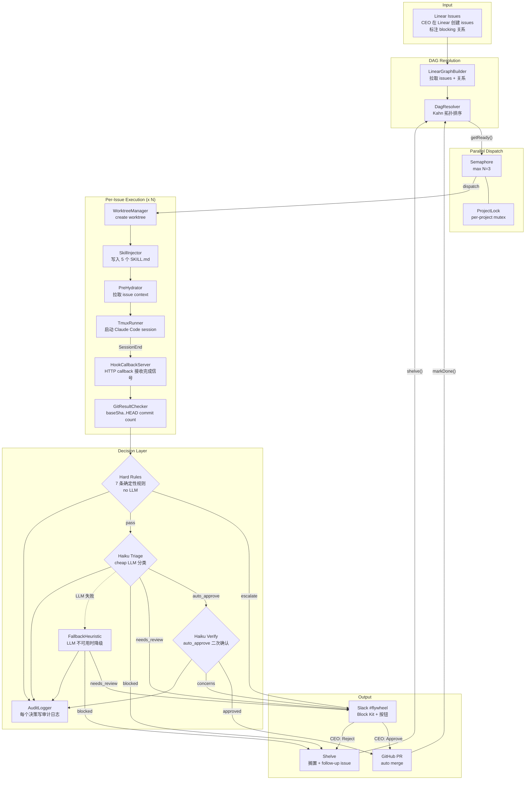
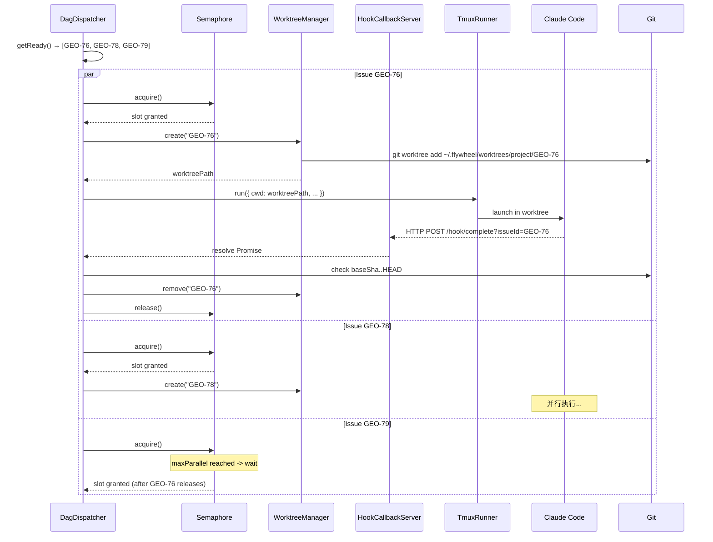
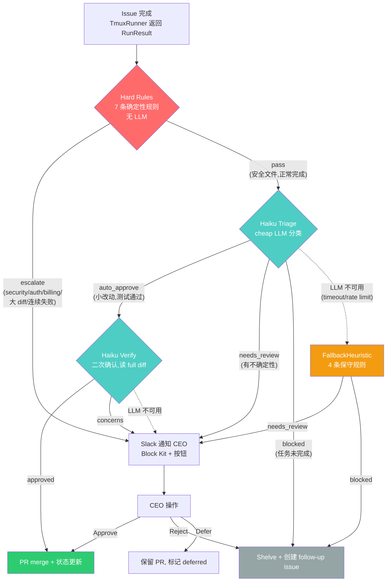
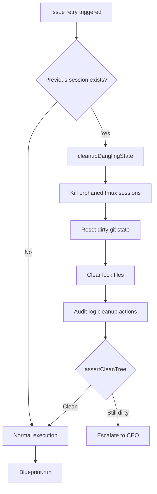
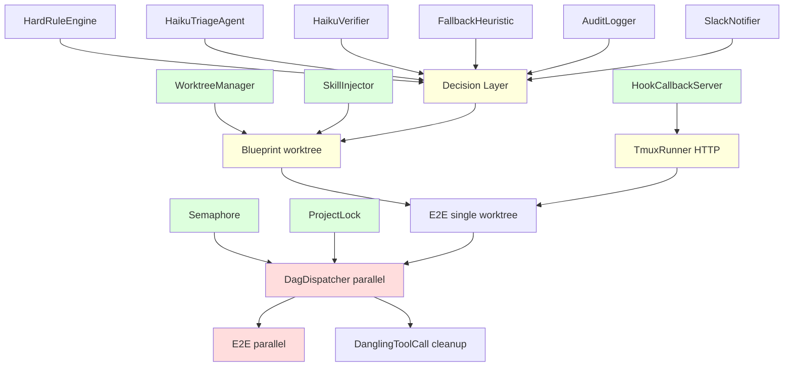

# Flywheel v0.2 Architecture

**Goal:** 从"串行执行 + 人工判断"升级到"并行执行 + 自动决策 + context-aware sessions"。

**v0.2 三大支柱:**

1. **并行执行层** — 每个 issue 在独立 git worktree 中执行，最多 N 个并行 session
2. **Decision Layer** — Hard Rules (确定性) + Haiku Triage/Verify (cheap LLM) + Fallback Heuristic (降级)
3. **Skill 注入系统** — 在 session 启动前写入 `.claude/skills/`，让 Claude 自动发现 project context + issue context + workflow guidance

**不变的核心原则 (继承自 v0.1.0):**

- **Runner 策略**: spawn 现有 CLI 工具 (Claude Code CLI)，不自己写 agent
- **Blueprint 模式**: 确定性节点 + agent 节点混合编排
- **Model Agnosticity**: 编排层不直接 import LLM SDK，通过 `IAgentRunner` 接口调用
- **Pre-Hydrate**: agent 启动前注入 context，减少 token 浪费

---

# Part 1: CEO Overview

## 我们在建什么

v0.1.1 已经能做到：你给 Flywheel 一批 Linear issues，它按顺序一个个执行 — 在 tmux 里启动 Claude Code session，写代码、提交、创建 PR。但它是**串行的**、**不会自主判断结果**、也**不知道项目的 coding conventions**。

v0.2 做三件事：

1. **并行执行**: DAG 中没有依赖关系的 issues 同时开跑（最多 3 个），每个在独立的 git worktree 里。完成时间从 N * T 降到 ~T（取决于并行度）。
2. **自动决策**: issue 完成后，Decision Layer 自动判断结果 — 安全的小改动直接 merge，大改动通知你在 Slack 审核，有问题的自动 shelve。你不需要逐个检查每个 PR。
3. **Context 注入**: 每个 session 开始前，Flywheel 把项目 context、issue 详情、git workflow 规范作为 skills 写入 worktree。Claude 不用花 token 去"发现"已知信息。

## v0.1.1 → v0.2 变化

| 维度 | v0.1.1 | v0.2 |
|------|--------|------|
| 执行模式 | 串行，共享目录 | 并行，per-issue worktree |
| 完成检测 | SessionEnd hook + pane_dead polling | HTTP callback (primary) + pane_dead (fallback) |
| 结果处理 | `commitCount > 0` = 成功，无后续动作 | Decision Layer 三路路由 (auto_approve / needs_review / blocked) |
| Session context | 仅 system prompt | 5 个 Flywheel Skills (`.claude/skills/`) |
| Retry cleanup | 无 | `cleanupDanglingState()` 清理 orphan tmux/git 状态 |

## v0.2 完成后的完整数据流



---

# Part 2: Architecture Deep Dive

## 2.1 并行执行层

### 核心变化

```
v0.1.1:  DAG → issue1 → issue2 → issue3  (串行，共享目录)
v0.2:    DAG → ┬ issue1 (worktree1) ─→ done
               ├ issue2 (worktree2) ─→ done   (并行，隔离目录)
               └ issue3 (worktree3) ─→ done
```

### 组件概览

| 组件 | 来源 | 职责 |
|------|------|------|
| `WorktreeManager` | superset-ai git.ts 移植 | 创建/删除/列出 worktree，macOS rename trick |
| `HookCallbackServer` | superset-ai notify-hook 移植 | HTTP server 接收 SessionEnd callback |
| `Semaphore` | 新增 | 限制最大并行数（默认 3） |
| `ProjectLock` | superset-ai workspace-init-manager 移植 | Per-project mutex，防止并发 worktree 操作冲突 |

### WorktreeManager

**路径策略:**

```
~/.flywheel/worktrees/
├── geoforge3d/                    ← 项目名
│   ├── flywheel-GEO-76/          ← branch: flywheel-GEO-76
│   ├── flywheel-GEO-78/
│   └── flywheel-GEO-79/
├── another-project/
│   └── flywheel-PROJ-42/
```

Branch 名加 `flywheel-` 前缀，避免与用户手动创建的 branch 冲突。

**TypeScript Interface:**

```typescript
interface IWorktreeManager {
  /** 为一个 issue 创建 worktree */
  create(opts: {
    mainRepoPath: string;
    projectName: string;
    issueId: string;
    startPoint?: string;  // default: "origin/main"
  }): Promise<WorktreeInfo>;

  /** 删除 worktree（macOS 安全的 rename + background rm） */
  remove(mainRepoPath: string, worktreePath: string): Promise<void>;

  /** 检查 worktree 是否已注册 */
  isRegistered(mainRepoPath: string, worktreePath: string): Promise<boolean>;

  /** 列出所有 worktree */
  list(mainRepoPath: string): Promise<ExternalWorktree[]>;

  /** 清理所有孤儿 worktree（branch 已合并或目录不存在） */
  pruneOrphans(mainRepoPath: string, projectName: string): Promise<string[]>;
}

interface WorktreeInfo {
  projectName: string;
  issueId: string;
  worktreePath: string;     // 绝对路径
  branch: string;           // "flywheel-GEO-76"
  mainRepoPath: string;
}

interface WorktreeConfig {
  baseDir?: string;          // 默认 ~/.flywheel/worktrees
  createTimeoutMs?: number;  // 默认 120_000
  pruneTimeoutMs?: number;   // 默认 10_000
}
```

**Worktree 创建关键实现细节:**

- `git worktree add <path> -b <branch> <startPoint>^{commit}` — 使用 `^{commit}` 后缀防止 implicit upstream tracking（来自 superset-ai 的关键发现）
- 创建后设置 `push.autoSetupRemote = true`，首次 push 自动创建远程 branch
- Git lock error 友好提示（检测 `.lock` file exists 错误）
- Branch 已被其他 worktree 检出时抛出描述性错误

**Worktree 删除关键实现细节（macOS 安全）:**

1. `rename()` 到同文件系统的临时目录（避免 EXDEV cross-device error）
2. `git worktree prune` 清理 git metadata
3. `spawn /bin/rm -rf` 后台删除（不阻塞调用方）

为什么不用 Node.js `fs.rm()`: macOS 上遇到 .app bundle 的 extended attributes 时 `fs.rm()` 会 hang。`/bin/rm` 是原生实现，更可靠。

### HookCallbackServer

v0.1.1 使用 marker file 检测 session 完成。v0.2 升级为 HTTP callback — 多 session 并行时需要区分哪个 session 完成了。

```typescript
interface IHookCallbackServer {
  /** 启动 HTTP server */
  start(port?: number): Promise<number>;  // 返回实际 port

  /** 停止 server */
  stop(): Promise<void>;

  /** 等待指定 issue 的 session 完成 */
  waitForCompletion(issueId: string, timeoutMs: number): Promise<SessionEndEvent>;
}

interface SessionEndEvent {
  issueId: string;
  sessionId: string;
  timestamp: string;
  exitCode: number | null;
}
```

**工作原理:**

1. DagDispatcher 启动时调用 `HookCallbackServer.start()` 监听 `localhost:<port>`
2. TmuxRunner 启动 Claude Code 时注入 `--settings` 参数，包含 SessionEnd hook 脚本
3. Hook 脚本在 session 结束时 POST `http://localhost:<port>/hook/complete?issueId=<id>`
4. `waitForCompletion()` 返回对应 Promise
5. pane_dead polling 保留为 fallback（hook 脚本可能未正确安装）

### Semaphore + ProjectLock

```typescript
/** 异步信号量 — 限制并行 session 数 */
class Semaphore {
  constructor(private maxParallel: number) {}

  /** 获取一个 slot（可能等待） */
  async acquire(): Promise<void>;

  /** 释放一个 slot */
  release(): void;

  /** 当前可用 slot 数 */
  get available(): number;
}

/** Per-project mutex — 防止同一项目的并发 worktree 操作冲突 */
class ProjectLock {
  /** 获取项目锁 */
  async acquire(projectName: string): Promise<() => void>;  // 返回 release function
}
```

### Worktree 生命周期时序



### 错误处理

| 场景 | 处理 |
|------|------|
| Worktree 创建失败 (git lock) | 抛出描述性错误，DagDispatcher 将 issue 标记为 failed |
| Worktree 创建失败 (branch 已存在) | 尝试 `pruneOrphans()` 清理后重试一次 |
| Hook server 崩溃 | pane_dead polling 自动接管（5s 间隔，4h timeout） |
| Worktree 清理失败 | 记录 warning，不阻塞后续执行；`pruneOrphans` 在下次 dispatch 前后执行 |
| Git lock 冲突 (多 worktree) | `ProjectLock` mutex 序列化同一项目的 worktree 操作 |

---

## 2.2 Decision Layer

### 架构概览

Decision Layer 的核心职责：**在 Claude Code session 完成一个 issue 后，决定如何处置结果** — 自动合并、通知 CEO 审核、还是搁置。

设计原则（来自 DevPulseAI）：确定性工作不需要 LLM。Agent 只用于需要推理判断的地方。



### HardRuleEngine — 7 条确定性规则

在 LLM 调用之前执行，纯确定性规则。任何匹配的场景**直接 escalate**，不经过 Haiku。

```typescript
interface HardRule {
  id: string;
  description: string;
  priority: number;     // 数字越小越先执行
  evaluate: (ctx: ExecutionContext) => HardRuleResult;
}

interface HardRuleResult {
  triggered: boolean;
  action: 'escalate' | 'block';
  reason: string;
}
```

| ID | 优先级 | 场景 | Action | 原因 |
|----|--------|------|--------|------|
| `HR-001` | 1 | Issue labels 含 `security` / `auth` / `billing` | escalate | 安全/权限/计费变更必须人工 |
| `HR-002` | 2 | `consecutiveFailures >= 3` | escalate | 连续失败超过阈值 |
| `HR-003` | 3 | Diff 含 `.env*` / `*secret*` / `*credential*` 文件 | escalate | 可能涉及 secrets |
| `HR-004` | 4 | Diff 超过 500 行（净增） | escalate | 大规模变更需人工审查 |
| `HR-005` | 5 | Issue labels 含 `breaking-change` | escalate | Breaking change 必须人工确认 |
| `HR-006` | 6 | Trust score < 300 (SUSPENDED) | escalate | 低信任项目不允许自动决策 |
| `HR-007` | 7 | Runner 超时（非正常完成） | block | session 异常终止，需要清理 |

**实现:**

```typescript
class HardRuleEngine {
  private rules: HardRule[] = [];

  registerRule(rule: HardRule): void {
    this.rules.push(rule);
    this.rules.sort((a, b) => a.priority - b.priority);
  }

  /** 按优先级顺序评估，第一个触发即返回（short-circuit）*/
  evaluate(ctx: ExecutionContext): HardRuleResult | null {
    for (const rule of this.rules) {
      const result = rule.evaluate(ctx);
      if (result.triggered) return result;
    }
    return null;  // 无触发 -> 交给 Haiku
  }
}
```

### HaikuTriageAgent — Triage Prompt

Haiku (cheap LLM) 根据 execution summary 分类结果为 `auto_approve` / `needs_review` / `blocked`。

**Prompt 模板（简化版）:**

```
You are a triage agent for an autonomous development system.
Your job is to decide what to do with a completed development task.

## Context
Issue: {{issueIdentifier}} — {{issueTitle}}
Project: {{projectId}}
Labels: {{labels}}

## Execution Summary
- Commits: {{commitCount}}
- Files changed: {{filesChanged}}
- Lines added/removed: +{{linesAdded}} / -{{linesRemoved}}
- Duration: {{durationMinutes}} minutes
- Test results: {{testResults}}
- Consecutive failures: {{consecutiveFailures}}

## Commit Messages
{{commitMessages}}

## Diff Summary (truncated to 2000 chars)
{{diffSummary}}

## Decision
Classify into ONE route: auto_approve / needs_review / blocked

Respond with JSON:
{
  "route": "auto_approve" | "needs_review" | "blocked",
  "confidence": 0.0 to 1.0,
  "reasoning": "one sentence",
  "concerns": ["list of concerns"]
}
```

包含 3 个 few-shot examples 覆盖三种路由。

### HaikuVerifier — Verify Prompt

仅在 Triage 返回 `auto_approve` 时触发。读取 full diff（不是 truncated summary），逐项检查。

**Prompt 模板（简化版）:**

```
You are a code review verifier. A triage agent recommended auto-approving this PR.
Your job is to double-check.

## Verification Checklist
1. Do changes match the issue description?
2. Are there any obvious bugs or logic errors?
3. Are error paths handled (no silent failures)?
4. Are there any hardcoded secrets or credentials?
5. Is the change scope appropriate (no unnecessary changes)?

Respond with JSON:
{
  "approved": true | false,
  "confidence": 0.0 to 1.0,
  "concerns": [],
  "checklist": {
    "matches_issue": bool,
    "no_obvious_bugs": bool,
    "error_handling": bool,
    "no_secrets": bool,
    "appropriate_scope": bool
  }
}
```

### FallbackHeuristic — LLM 降级

当 Haiku LLM 不可用（API timeout、rate limit、服务故障），Decision Layer 降级为纯规则引擎。遵循 DevPulseAI 的原则："better to over-flag than miss"。

**4 条规则:**

```typescript
function fallbackHeuristic(ctx: ExecutionContext, error: string): DecisionResult {
  // Rule 1: zero output -> blocked
  if (ctx.commitCount === 0) {
    return { route: 'blocked', confidence: 0.9, decisionSource: 'fallback_heuristic', ... };
  }

  // Rule 2: consecutive failures -> blocked
  if (ctx.consecutiveFailures >= 2) {
    return { route: 'blocked', confidence: 0.85, decisionSource: 'fallback_heuristic', ... };
  }

  // Rule 3: large changes -> needs_review
  if (ctx.linesAdded > 200 || ctx.filesChanged.length > 10) {
    return { route: 'needs_review', confidence: 0.6, decisionSource: 'fallback_heuristic', ... };
  }

  // Rule 4: default -> needs_review (conservative, never auto-approve)
  return { route: 'needs_review', confidence: 0.5, decisionSource: 'fallback_heuristic', ... };
}
```

**关键约束: Fallback 永远不 auto-approve。** 保守安全 — 宁可多审核不可误合并。

### Slack 通知格式

使用 Slack Block Kit 构造结构化消息，通过 Flywheel 的 `slack-event-transport` 包发送。

**needs_review 消息结构:**

```
┌──────────────────────────────────────┐
│ Review Required: GEO-42              │  ← header
├──────────────────────────────────────┤
│ Issue: GEO-42: Add user auth         │  ← section (fields)
│ Project: geoforge3d                  │
│ Commits: 3                           │
│ Changed: 5 files (+120/-15)          │
├──────────────────────────────────────┤
│ Decision: needs_review (70%)         │  ← section
│ Reasoning: Functional changes to     │
│   user-facing registration flow      │
├──────────────────────────────────────┤
│ Concerns:                            │  ← section (conditional)
│ - validation rules may need review   │
│ - 5 files touched across auth        │
├──────────────────────────────────────┤
│ Commit messages:                     │  ← section
│ ```                                  │
│ feat(auth): add JWT validation       │
│ test(auth): add unit tests           │
│ ```                                  │
├──────────────────────────────────────┤
│ [Approve & Merge] [Reject] [Defer]   │  ← actions (buttons)
│ [View PR]                            │
├──────────────────────────────────────┤
│ Flywheel | Source: haiku_triage      │  ← context (footer)
│ Attempt: 1/3                         │
└──────────────────────────────────────┘
```

**blocked 消息** 额外包含 attempt history 和 Retry/Shelve/Investigate 按钮。

---

## 2.3 Skill 注入系统

### 核心思路

TmuxRunner 启动 session 前，SkillInjector 往 worktree 的 `.claude/skills/` 写入 context skills。Claude Code 原生支持自动发现 skills 目录下的 SKILL.md 文件。

### SKILL.md 格式规范

遵循 [Agent Skills 标准](https://agentskills.io/)，由 claude-scientific-skills（148 个 skills）广泛采用。

```
<skill-name>/
├── SKILL.md          # 必须，核心描述文件
├── references/       # 可选，分层文档
└── scripts/          # 可选，可执行脚本
```

Frontmatter:

```yaml
---
name: <kebab-case-name>
description: <one-paragraph>        # Agent 自动选择的核心依据
allowed-tools: Read Write Edit Bash  # 可选工具白名单
---
```

### 5 个 Flywheel Skills

| Skill | 内容 | 价值 |
|-------|------|------|
| `flywheel-context` | 项目概述 (tech stack, conventions, key files, architecture) | 减少 Claude 探索时间，避免浪费 token |
| `linear-issue-context` | Issue 描述、依赖关系、acceptance criteria、related PRs | 精准理解当前任务，不处理无关 issues |
| `flywheel-git-workflow` | Branch naming (`feat/<issue-id>-<desc>`)、commit format、PR template、`gh pr create` 命令 | 一致的 git 工作流，GitResultChecker 可检测 |
| `flywheel-escalation` | 何时升级 (缺 credentials / 架构歧义 / 外部故障 / scope 超出 / 3 次失败)、如何升级 (保存 WIP + 停止) | 减少无效重试，让 Decision Layer 接管 |
| `flywheel-tdd` | RED → GREEN → REFACTOR cycle、commit 节奏 (test → impl → refactor)、80%+ coverage 要求 | 质量保障，测试先行 |

### SkillInjector Interface

```typescript
interface SkillContext {
  issue: HydratedIssue;
  projectConfig: ProjectConfig;
}

class SkillInjector {
  /**
   * 写入 Flywheel skill files 到 <projectRoot>/.claude/skills/
   * 在 Blueprint.run() 中 TmuxRunner.run() 之前调用
   */
  async inject(projectRoot: string, ctx: SkillContext): Promise<void>;
}
```

每个 skill 是一个 Handlebars-like 模板，用 `{{issueId}}`、`{{projectName}}`、`{{testCommand}}` 等 placeholder 渲染。模板数据从 `ProjectConfig`（`.flywheel/project.json`）和 `HydratedIssue` 获取。

### Injection Point in Blueprint

```
Blueprint.run()
  ├── Step 1: WorktreeManager.create(issueId)           ← 创建隔离目录
  ├── Step 2: SkillInjector.inject(worktreePath, ctx)    ← 写入 5 个 SKILL.md
  ├── Step 3: PreHydrator.hydrate(issue)                 ← 拉取 issue context
  ├── Step 4: TmuxRunner.run(prompt, worktreePath)       ← 启动 Claude session
  ├── Step 5: GitResultChecker.check(baseSha)            ← 检查 commit count
  ├── Step 6: DecisionLayer.decide(executionContext)      ← 决定结果处置
  └── Step 7: WorktreeManager.cleanup(worktreePath)      ← 清理 worktree
```

### CLAUDE.md vs SKILL.md 共存

| 层次 | 文件 | 内容 | 更新频率 |
|------|------|------|----------|
| 项目级规范 | `CLAUDE.md` | 永久项目规则（Non-negotiables、Core Behaviors） | 低（人工维护） |
| Session 级 Context | `SKILL.md` | 动态信息（issue details、runtime config） | 高（每次 session 自动生成） |

冲突规则: `CLAUDE.md` 的"what"优先于 `SKILL.md`；`SKILL.md` 的"how"优先于 `CLAUDE.md` 的泛化描述。

---

## 2.4 Updated Blueprint Flow

### 完整 Blueprint.run() 伪代码

```typescript
class Blueprint {
  constructor(
    private worktreeManager: IWorktreeManager,
    private skillInjector: SkillInjector,
    private hydrator: PreHydrator,
    private gitChecker: GitResultChecker,
    private getRunner: (name: string) => IFlywheelRunner,
    private decisionLayer: IDecisionLayer,
    private projectConfig: ProjectConfig,
  ) {}

  async run(
    node: DagNode,
    projectRoot: string,
    ctx: BlueprintContext,
  ): Promise<BlueprintResult> {
    let worktreeInfo: WorktreeInfo | null = null;

    try {
      // Step 1: Create worktree (isolated git directory)
      worktreeInfo = await this.worktreeManager.create({
        mainRepoPath: projectRoot,
        projectName: this.projectConfig.name,
        issueId: node.id,
      });
      const cwd = worktreeInfo.worktreePath;

      // Step 2: Inject skills (.claude/skills/flywheel-*)
      const hydrated = await this.hydrator.hydrate(node.id);
      await this.skillInjector.inject(cwd, {
        issue: hydrated,
        projectConfig: this.projectConfig,
      });

      // Step 3: Record base SHA for result detection
      const baseSha = await gitRevParse(cwd, 'HEAD');

      // Step 4: Build prompt + launch Claude Code session
      const prompt = this.buildPrompt(hydrated);
      const runner = this.getRunner('claude');
      const runResult = await runner.run({
        prompt,
        cwd,
        sessionId: `flywheel-${node.id}`,
      });

      // Step 5: Check git for results (baseSha..HEAD)
      const gitResult = await this.gitChecker.check(cwd, baseSha);

      // Step 6: Build execution context for Decision Layer
      const execCtx = this.buildExecutionContext(node, hydrated, gitResult, runResult);

      // Step 7: Decision Layer — route result
      const decision = await this.decisionLayer.decide(execCtx);

      // Step 8: Execute decision
      await this.executeDecision(decision, execCtx);

      return {
        issueId: node.id,
        outcome: decision.route,
        commitCount: gitResult.commitCount,
        decision,
        worktreePath: cwd,
      };

    } finally {
      // Step 9: Cleanup worktree (always, even on error)
      if (worktreeInfo) {
        await this.worktreeManager.remove(
          projectRoot,
          worktreeInfo.worktreePath,
        ).catch(err => console.error(`[blueprint] cleanup failed: ${err.message}`));
      }
    }
  }
}
```

### BlueprintResult Interface

```typescript
interface BlueprintResult {
  issueId: string;
  outcome: DecisionRoute;       // 'auto_approve' | 'needs_review' | 'blocked'
  commitCount: number;
  decision: DecisionResult;
  worktreePath: string;
  prUrl?: string;               // 如果创建了 PR
  error?: string;               // 如果执行失败
}
```

---

## 2.5 DagDispatcher v0.2

### 从串行到并行

v0.1.1 的 DagDispatcher 是一个 `while` 循环，每次取一个 ready issue 执行完再取下一个。v0.2 改为并行 dispatch:

```typescript
class DagDispatcher {
  constructor(
    private resolver: DagResolver,
    private blueprint: Blueprint,
    private semaphore: Semaphore,
    private worktreeManager: IWorktreeManager,
    private projectConfig: ProjectConfig,
  ) {}

  async dispatchAll(projectRoot: string): Promise<DispatchReport> {
    // 0. 清理孤儿 worktree
    await this.worktreeManager.pruneOrphans(projectRoot, this.projectConfig.name);

    const results: BlueprintResult[] = [];
    const inFlight = new Set<string>();

    while (this.resolver.remaining() > 0) {
      const ready = this.resolver.getReady()
        .filter(n => !inFlight.has(n.id));

      if (ready.length === 0) {
        // 等待 in-flight 完成后再检查
        await waitForAny(inFlight);
        continue;
      }

      // 并行 dispatch ready issues (受 Semaphore 限制)
      const dispatches = ready.map(node => this.dispatchOne(node, projectRoot, results, inFlight));
      await Promise.race(dispatches);  // 不 await all — 让新 ready 尽快 dispatch
    }

    // 等待所有 in-flight 完成
    await Promise.all([...inFlight].map(id => this.waitForId(id)));

    // 最终清理
    await this.worktreeManager.pruneOrphans(projectRoot, this.projectConfig.name);

    return { results, ... };
  }

  private async dispatchOne(
    node: DagNode,
    projectRoot: string,
    results: BlueprintResult[],
    inFlight: Set<string>,
  ): Promise<void> {
    await this.semaphore.acquire();
    inFlight.add(node.id);

    try {
      const result = await this.blueprint.run(node, projectRoot, {});
      results.push(result);

      if (result.outcome === 'blocked') {
        this.resolver.shelve(node.id);
      } else {
        this.resolver.markDone(node.id);
      }
    } catch (err) {
      this.resolver.shelve(node.id);
    } finally {
      inFlight.delete(node.id);
      this.semaphore.release();
    }
  }
}
```

### 错误传播

| 场景 | 处理 |
|------|------|
| Blueprint.run() throws | issue shelved，下游保持 blocked |
| Worktree 创建失败 | issue shelved + Slack 通知 |
| Decision Layer throws | 降级为 `needs_review`（保守路由） |
| 所有 ready issues 都 shelved | Dispatcher 终止，Slack 通知"全部阻塞" |

---

# Part 3: Interfaces & Data Models

所有关键 TypeScript interfaces 汇总。

### ExecutionContext

Session 执行状态追踪，适配自 MobileAgent v3 InfoPool。

```typescript
export interface ExecutionContext {
  // --- Issue Identity ---
  issueId: string;
  issueIdentifier: string;     // e.g., "GEO-42"
  issueTitle: string;
  issueDescription: string;
  labels: string[];
  projectId: string;
  repositoryPath: string;

  // --- Execution State ---
  currentAttempt: number;       // 1-based
  maxAttempts: number;
  baseSha: string;
  headSha: string | null;
  tmuxSessionName: string;
  startedAt: string;            // ISO
  completedAt: string | null;
  exitReason: 'completed' | 'timeout' | 'user_stopped' | 'error';

  // --- Result Metrics ---
  commitCount: number;
  commitMessages: string[];
  filesChanged: string[];
  linesAdded: number;
  linesRemoved: number;
  diffSummary: string;
  testResults: string | null;

  // --- Error Tracking ---
  consecutiveFailures: number;
  consecutiveFailureThreshold: number;  // 默认 3
  attemptHistory: AttemptRecord[];

  // --- Decision ---
  decision: DecisionResult | null;
}

export interface AttemptRecord {
  attempt: number;
  startedAt: string;
  completedAt: string;
  outcome: 'success' | 'failure' | 'timeout' | 'error';
  commitCount: number;
  errorDescription: string | null;
  route: DecisionRoute | null;
}
```

### DecisionResult

```typescript
export type DecisionRoute = 'auto_approve' | 'needs_review' | 'blocked';

export interface DecisionResult {
  route: DecisionRoute;
  confidence: number;           // 0.0-1.0
  reasoning: string;
  concerns: string[];
  decisionSource: 'hard_rule' | 'haiku_triage' | 'fallback_heuristic' | 'cipher_match';
  hardRuleId?: string;
  verification?: VerificationResult;
}

export interface VerificationResult {
  approved: boolean;
  confidence: number;
  concerns: string[];
  checklist: {
    matchesIssue: boolean;
    noObviousBugs: boolean;
    errorHandling: boolean;
    noSecrets: boolean;
    appropriateScope: boolean;
  };
}
```

### AuditEntry

每个 Decision Layer 调用产生一条 AuditEntry，存入 SQLite。

```typescript
export interface AuditEntry {
  id: string;                   // UUID v4
  timestamp: string;            // ISO

  eventType:
    | 'decision_made'
    | 'decision_overridden'
    | 'decision_confirmed'
    | 'hard_rule_triggered'
    | 'llm_fallback'
    | 'cipher_match';

  issueId: string;
  issueIdentifier: string;
  projectId: string;
  route: DecisionRoute;

  decisionSource: DecisionResult['decisionSource'];
  confidence: number;
  reasoning: string;
  result: 'executed' | 'overridden' | 'pending' | 'error';

  metrics: {
    commitCount: number;
    filesChanged: number;
    linesAdded: number;
    linesRemoved: number;
    durationMinutes: number;
    consecutiveFailures: number;
  };

  trustScoreDelta: number;      // Phase 5 CIPHER
  details: Record<string, unknown>;
}
```

### IDecisionLayer

```typescript
export interface IDecisionLayer {
  /** 评估 execution context，返回决策结果 */
  decide(ctx: ExecutionContext): Promise<DecisionResult>;

  /** 记录 CEO 操作（用于审计和 CIPHER 学习） */
  recordCeoAction(
    issueId: string,
    action: 'approve' | 'reject' | 'defer' | 'revert',
  ): Promise<void>;
}
```

### IWorktreeManager

```typescript
export interface IWorktreeManager {
  create(opts: {
    mainRepoPath: string;
    projectName: string;
    issueId: string;
    startPoint?: string;
  }): Promise<WorktreeInfo>;

  remove(mainRepoPath: string, worktreePath: string): Promise<void>;
  isRegistered(mainRepoPath: string, worktreePath: string): Promise<boolean>;
  list(mainRepoPath: string): Promise<ExternalWorktree[]>;
  pruneOrphans(mainRepoPath: string, projectName: string): Promise<string[]>;
}
```

### IHookCallbackServer

```typescript
export interface IHookCallbackServer {
  start(port?: number): Promise<number>;
  stop(): Promise<void>;
  waitForCompletion(issueId: string, timeoutMs: number): Promise<SessionEndEvent>;
}
```

### ISkillInjector

```typescript
export interface ISkillInjector {
  inject(projectRoot: string, ctx: SkillContext): Promise<void>;
}

export interface SkillContext {
  issue: HydratedIssue;
  projectConfig: ProjectConfig;
}
```

### HardRule

```typescript
export interface HardRule {
  id: string;
  description: string;
  priority: number;
  evaluate: (ctx: ExecutionContext) => HardRuleResult;
}

export interface HardRuleResult {
  triggered: boolean;
  action: 'escalate' | 'block';
  reason: string;
}
```

### BlueprintResult (v0.2)

```typescript
export interface BlueprintResult {
  issueId: string;
  outcome: DecisionRoute;
  commitCount: number;
  decision: DecisionResult;
  worktreePath: string;
  prUrl?: string;
  error?: string;
}
```

### ParallelExecutionConfig

```typescript
export interface ParallelExecutionConfig {
  /** 最大并行 session 数 */
  maxParallel: number;           // 默认 3
  /** Worktree 根目录 */
  worktreeBaseDir: string;       // 默认 ~/.flywheel/worktrees
  /** Hook callback server port */
  hookPort: number;              // 默认 0 (自动选择)
  /** 单 session 最大时长 (ms) */
  sessionTimeoutMs: number;      // 默认 4 * 60 * 60 * 1000 (4h)
  /** 清理间隔 — pruneOrphans 频率 (ms) */
  pruneIntervalMs: number;       // 默认 30 * 60 * 1000 (30min)
}
```

---

# Part 4: Configuration

## `.flywheel/config.yaml` v0.2 Schema

```yaml
# ─── 基础 ───
project: geoforge3d
linear:
  team_id: "TEAM_ID"
  labels: ["flywheel-managed"]

# ─── Runner ───
runners:
  default: claude
  available:
    claude:
      type: claude
      model: sonnet                    # CLI 默认 model
      max_budget_usd: 5.0             # per-session budget cap

# ─── 并行执行 (v0.2 新增) ───
parallel:
  max_parallel: 3                      # 最大并行 session 数
  worktree_base_dir: ~/.flywheel/worktrees
  hook_port: 0                         # 0 = 自动选择
  session_timeout_minutes: 240         # 4 小时
  prune_interval_minutes: 30

# ─── Decision Layer (v0.2 新增) ───
decision_layer:
  autonomy_level: observer             # manual_only | observer | advisor | autonomous
  escalation_channel: "#flywheel"      # Slack channel
  hard_rules:
    max_diff_lines: 500                # HR-004 阈值
    consecutive_failure_threshold: 3   # HR-002 阈值
    sensitive_labels:                   # HR-001 + HR-005
      - security
      - auth
      - billing
      - breaking-change
    sensitive_file_patterns:            # HR-003
      - "*.env*"
      - "*secret*"
      - "*credential*"
  haiku:
    model: claude-3-5-haiku-20241022   # Triage + Verify model
    max_diff_chars: 2000               # Triage prompt diff 截断
    verify_full_diff: true             # Verify 使用完整 diff
  fallback:
    enabled: true                      # LLM 不可用时启用 fallback

# ─── Skill 注入 (v0.2 新增) ───
skills:
  enabled: true
  custom_skills_dir: .flywheel/skills  # 项目自定义 skills（与 Flywheel 内置合并）

# ─── Teams ───
teams:
  - name: product
    orchestrators:
      - type: dev
        runner: claude
        budget_per_issue: 5.0

# ─── Reactions (Phase 2+, 预留) ───
# reactions:
#   changes-requested:
#     action: send-to-agent
#     retries: 2
#     escalateAfter: "30m"
#   approved-and-green:
#     action: notify              # 初期 notify，后期 auto-merge
```

## 环境变量

| 变量 | 用途 | 必须 |
|------|------|------|
| `ANTHROPIC_API_KEY` | Claude Code CLI + Haiku API | Yes |
| `LINEAR_API_KEY` | Linear SDK 拉取 issues | Yes |
| `GITHUB_TOKEN` | `gh` CLI 创建 PR | Yes |
| `SLACK_BOT_TOKEN` | Slack 通知 | Yes (Phase 2+) |
| `FLYWHEEL_CONFIG_PATH` | 配置文件路径覆盖 | No |
| `FLYWHEEL_LOG_LEVEL` | 日志级别 (debug/info/warn/error) | No |

---

# Part 5: Error Handling & Recovery

## 各组件失败处理

| 组件 | 失败场景 | 处理策略 |
|------|----------|----------|
| **WorktreeManager.create** | Git lock / branch 冲突 | 尝试 `pruneOrphans()` 后重试一次；仍失败则 shelve issue |
| **WorktreeManager.remove** | 目录不存在 (ENOENT) | 仅 `git worktree prune` 清理 metadata，不报错 |
| **HookCallbackServer** | Server crash / port 占用 | pane_dead polling 自动接管 |
| **Haiku Triage** | API timeout / rate limit | FallbackHeuristic 降级（永远不 auto-approve） |
| **Haiku Verify** | API timeout | auto_approve 降级为 needs_review |
| **SkillInjector** | 写入失败 | 记录 warning，session 仍继续（没有 skills 不致命） |
| **PreHydrator** | Linear API 失败 | 使用 cached issue data 或 minimal prompt |
| **GitResultChecker** | Git 命令失败 | 假设 commitCount = 0，走 blocked 路由 |
| **Slack 通知** | Slack API 失败 | 重试 3 次，间隔 exponential backoff；仍失败则 stdout 记录 |

## DanglingToolCall 清理

Blueprint 重试失败 issue 时，上次被中断的 session 可能留下 orphan 状态。`cleanupDanglingState()` 在重试前执行:



**清理动作:**

1. Kill orphaned tmux sessions: `tmux kill-session -t flywheel-<issueId>`
2. Reset git state: `git checkout -- .` + `git clean -fd`（仅清理未 commit 的变更，不丢弃 committed work）
3. Clear lock files: `rm -f .flywheel/lock`
4. Audit: 记录清理动作到 AuditLogger

## Worktree 孤儿清理

`pruneOrphans()` 在 dispatch 前后执行，检测并清理:

- Branch 已合并到 main 但 worktree 目录仍存在
- Worktree 目录已被手动删除但 git metadata 仍在
- `flywheel-` 前缀的 worktree 超过 24 小时未活动

## LLM Fallback 策略

```
Haiku Triage 调用
  ├── 成功 → 使用 Haiku 结果
  └── 失败 (timeout / rate limit / 服务故障)
       └── FallbackHeuristic (4 条规则)
            ├── commitCount == 0 → blocked
            ├── consecutiveFailures >= 2 → blocked
            ├── linesAdded > 200 || files > 10 → needs_review
            └── default → needs_review (保守)
                └── 永远不 auto-approve
```

---

# Part 6: Relationship to v0.1.0

## 仍然有效的原则

v0.1.0 架构文档定义了 Flywheel 的核心设计原则。以下在 v0.2 中**完全保留**:

| 原则 | v0.2 状态 |
|------|-----------|
| Runner 策略: spawn CLI 工具 | 保留 — TmuxRunner 仍启动 `claude` CLI |
| Blueprint 模式: 确定性 + agent 混合编排 | 保留 — 只是增加了 Decision Layer 节点 |
| Model Agnosticity: `IAgentRunner` 接口 | 保留 — `RunnerSelectionService` 按 config 选择 |
| Pre-Hydrate: agent 前注入 context | 保留 + 增强 — SkillInjector 补充 SKILL.md |
| 预算控制: per-session budget cap | 保留 |
| Kahn 拓扑排序 | 保留 — DagResolver 不变 |
| shelve 默认阻断下游 | 保留 |

## 变化及原因

| 变化 | v0.1.0/v0.1.1 | v0.2 | 原因 |
|------|--------------|------|------|
| Phase 划分 | Phase 1-4 大阶段 | 细粒度 v0.1.x → v0.2.x | 小步迭代，每步可交付 |
| Blueprint 步骤 | Pre-Hydrate → Implement → Lint → Push → CI → Fix | WorktreeCreate → SkillInject → Hydrate → Run → GitCheck → Decide → Cleanup | v0.1.1 已简化 (移除 lint/CI loop)，v0.2 增加前后步骤 |
| 执行模式 | 串行 | 并行 (Semaphore + worktree) | 消除串行瓶颈，充分利用 AI 资源 |
| 完成检测 | SessionEnd hook (marker file) | HTTP callback | 多 session 并行需区分来源 |
| 结果判断 | `commitCount > 0` | Decision Layer (Hard Rules + Haiku + Fallback) | 有决策才能真正自主 |
| 成本追踪 | `costUsd` in RunResult | 移除 (v0.1.1 已 optional 化) | `--print` 不存在时无法获取 |

## Reactions 系统映射

v0.1.0 Phase 2 设计了 Reactions 系统（PR review → agent auto-fix, approved+green → notify/auto-merge）。在 v0.2 中:

- **PR review auto-fix**: 延迟到 v0.2.1+，需要 GitHub webhook 基础设施
- **Approved + green**: 部分实现 — Decision Layer 的 `auto_approve` 路由在 Verify 通过后可 merge
- **Dedup (reaction_runs 表)**: 延迟，当前无 webhook 重投场景
- **Escalation 超时**: Decision Layer 的 `HR-007` (session timeout) 覆盖此场景

---

# Part 7: Future Phases

## v0.2.1: Present/Away Mode

当 CEO 在场时，session 在 tmux 中可见可交互；离开时，切换到 SDK `forkSession` 高效执行（无 tmux 开销）。

**阻塞原因**: `@anthropic-ai/claude-code` SDK 的 `forkSession` 稳定性待验证。验证通过后可作为独立 sub-milestone 实施。~30 LOC ModeSwitch + 条件分支。

## v0.3: Per-Project Memory

三步迁移:
1. `.flywheel/memory.json` — Haiku 提取 facts，JSON 存储
2. `.flywheel/memory.db` — SQLite + sqlite-vec，salience 排序（`similarity * log(reinforcement+1) * exp(-0.693 * days/halfLife)`）
3. Context injection — Blueprint 自动注入 `<project_memory>` block

关键决策: mem0 graph memory Phase 3 不采用，Phase 5 考虑 Kuzu；content_hash SHA256 去重防止重复学习。

详见 [v0.3-memory-system.md](../exploration/new/v0.3-memory-system.md)。

## Phase 3+: Remote Mac Execution

推荐方案: Tailscale + SSH + tmux（零额外依赖，macOS 完全兼容）。OpenSandbox + Docker 因 macOS egress 控制不兼容（nftables 仅 Linux）被排除。

详见 [007-remote-execution-eval.md](../research/new/007-remote-execution-eval.md)。

## Phase 5+: Multi-Machine Consensus

ruflo Raft/BFT 实现是 vaporware（零网络调用）。推荐中心化 Coordinator + SQLite CAS（~240 LOC）。Flywheel 的 2-5 台规模，Raft 是典型 overengineering。Timeline: 2026 Q4+。

详见 [008-multi-machine-consensus.md](../research/new/008-multi-machine-consensus.md)。

## Phase 5: CIPHER Pattern Promotion

CIPHER (Contextual Intelligence for Pattern-driven Human-agent Evaluation and Routing) — 从 CEO 决策历史中学习，逐步实现自动决策。

**Pattern 生命周期:**

```
candidate → validated → trusted → (archived if inactive 90 days)
                                 → (demoted if overrideCount > 2 in 30 days)
```

**晋升规则:**

| 转换 | 条件 |
|------|------|
| candidate → validated | validationCount >= 3 AND overrideCount == 0 |
| validated → trusted | validationCount >= 10 AND overrideRate <= 10% |
| trusted → demoted | overrideCount > 2 in last 30 days |
| any → archived | lastUsedAt > 90 days |

**Dual-Gate 自动决策:**
- Gate 1: vector similarity >= 0.85 (sqlite-vec cosine search)
- Gate 2: trustScore >= 700 (STANDARD tier)
- 两关都过才 auto-decide；否则回退到 Haiku Triage

**Trust Score Tiers (来自 awesome-llm-apps TrustLayer):**

| Range | Level | 行为 |
|-------|-------|------|
| 0-299 | SUSPENDED | 模式暂停，所有决策 escalate |
| 300-499 | RESTRICTED | 每次需人工确认 |
| 500-699 | PROBATION | 需要 Haiku Verify |
| 700-899 | STANDARD | 减少 Verify 频率 |
| 900-1000 | TRUSTED | 直接自动决策 |

**CIPHERPattern Interface:**

```typescript
export interface CIPHERPattern {
  id: string;
  decisionType: DecisionRoute;
  contextDescription: string;
  decision: string;
  embedding: number[];                // @xenova/transformers 本地生成

  tier: 'candidate' | 'validated' | 'trusted' | 'archived';
  validationCount: number;
  overrideCount: number;
  usageCount: number;
  recentOverrideCount: number;        // 30 天滑动窗口
  qualityScore: number;               // 0.0-1.0
  trustScore: number;                 // 0-1000

  projectId: string;
  createdAt: string;
  lastUsedAt: string;
  updatedAt: string;
}
```

---

# Part 8: Implementation Roadmap

## Sub-milestones

v0.2 分 3 个 sub-milestone 递进交付:


## v0.1.2: 基础设施（可独立交付）

| Task | 新增/修改 | ~LOC | 描述 |
|------|----------|------|------|
| WorktreeManager | 新增 | 200 | superset-ai 移植，create/remove/list/prune |
| HookCallbackServer | 新增 | 100 | HTTP server + SessionEnd 回调 |
| Semaphore | 新增 | 40 | 异步信号量，限制并行数 |
| ProjectLock | 新增 | 40 | Per-project mutex |
| SkillInjector | 新增 | 80 | 写入 .claude/skills/ + 模板渲染 |
| Skill 模板 (5 个) | 新增 | 200 | Flywheel 内置 skill SKILL.md 模板 |
| Notify hook script | 新增 | 30 | HTTP callback shell 脚本 |
| Tests | 新增 | 550 | 上述所有组件的单元测试 |
| **合计** | | **~1,240** | |

## v0.1.3: 集成（连接组件）

| Task | 新增/修改 | ~LOC | 描述 |
|------|----------|------|------|
| TmuxRunner 升级 | 修改 | +30 | 支持 HTTP callback + `--settings` 注入 |
| Blueprint worktree | 修改 | +20 | worktree create/cleanup 条件分支 |
| HardRuleEngine | 新增 | 100 | 7 条硬规则 |
| HaikuTriageAgent | 新增 | 150 | Triage prompt + LLM 调用 |
| HaikuVerifier | 新增 | 80 | Verify prompt + 二次确认 |
| FallbackHeuristic | 新增 | 60 | LLM 降级规则引擎 |
| AuditLogger | 新增 | 50 | 决策审计日志 (SQLite) |
| SlackNotifier | 新增 | 80 | Block Kit 消息构造 + 发送 |
| E2E single worktree | 新增 | 100 | 单 issue worktree 集成测试 |
| **合计** | | **~670** | |

## v0.2.0: 并行（核心升级）

| Task | 新增/修改 | ~LOC | 描述 |
|------|----------|------|------|
| DagDispatcher 重写 | 修改 | 重写 | 并行执行 + Semaphore + WorktreeManager |
| ParallelExecutionConfig | 新增 | 30 | 并行执行配置 |
| cleanupDanglingState | 新增 | 50 | 重试前清理 orphan 状态 |
| E2E parallel | 新增 | 200 | 多 issue 并行 E2E 测试 |
| **合计** | | **~280+** | |

**v0.2 总计: ~2,190 LOC 新增/修改**

## 依赖关系



> 绿色 = v0.1.2 基础设施 | 黄色 = v0.1.3 集成 | 红色 = v0.2.0 并行

## 风险表

| 风险 | 概率 | 影响 | 缓解 |
|------|------|------|------|
| `claude --settings` flag 不可用 | Medium | High | Spike 验证；fallback 到 marker file |
| 多 worktree git lock 冲突 | Medium | Medium | ProjectLock mutex |
| Haiku API rate limit | Medium | Low | FallbackHeuristic 保底 |
| HTTP callback server 崩溃 | Low | Medium | pane_dead polling fallback |
| Worktree 残留占磁盘 | Medium | Low | pruneOrphans + `flywheel cleanup` CLI |
| SDK `forkSession` 不稳定 | Medium | Low | 延迟到 v0.2.1，不阻塞 v0.2 |
| Decision Layer auto-approve 误判 | Low | High | Haiku Verify 二次确认 + Fallback 永不 auto-approve |
| Skill 注入占用 context window | Low | Low | SKILL.md 精简（每个 ~50 行），合计 ~250 行 |

---

# Part 9: Document Index

本架构文档引用的所有详细设计文档:

| 文档 | 路径 | 内容 |
|------|------|------|
| **v0.1.0 架构** | `doc/architecture/archive/v0.1.0-flywheel-orchestrator.md` | 原始架构设计（Phase 划分、Blueprint 模式、Reactions、CIPHER 初步） |
| **并行执行设计** | `doc/exploration/new/v0.2-parallel-execution.md` | Worktree 管理、Hook 升级、Present/Away 模式、17 个 implementation tasks |
| **Decision Layer 设计** | `doc/exploration/new/v0.2-decision-layer.md` | Hard Rules、Haiku prompt、ExecutionContext、AuditEntry、CIPHER 预留 |
| **Skill 注入设计** | `doc/exploration/new/v0.2-skill-system.md` | SKILL.md 格式、5 个 Flywheel skills、注入机制、Blueprint 集成 |
| **Memory 系统设计** | `doc/exploration/new/v0.3-memory-system.md` | mem0/memU/deer-flow 对比、3 步迁移、extraction prompt |
| **Remote 执行评估** | `doc/research/new/007-remote-execution-eval.md` | SSH+tmux vs OpenSandbox vs Tailscale 评估 |
| **多机共识评估** | `doc/research/new/008-multi-machine-consensus.md` | Raft/BFT 评估、中心化 Coordinator 方案 |
| **Trending Repo 调研** | `doc/exploration/new/v0.2-trending-repo-survey.md` | 13 个 GitHub trending repo 调研 |
| **Industry Reference** | `doc/reference/ralph-patterns.md` + `auto-claude-patterns.md` | 业界自主开发模式参考 |
