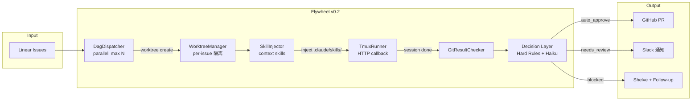
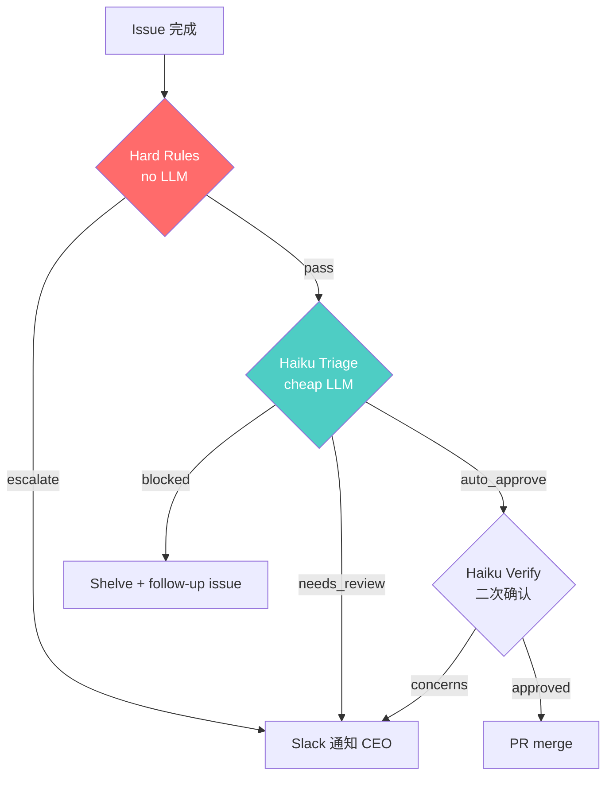
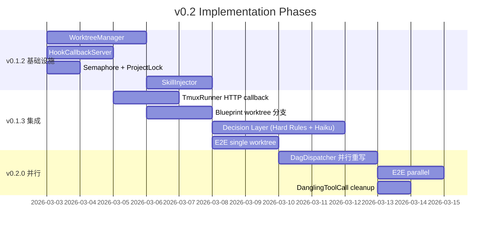

# v0.2 统一架构文档

> 状态：Draft
> 前置：v0.1.1 ✅ Merged (PR #4)
> 前置架构：[v0.1.0-flywheel-orchestrator.md](archive/v0.1.0-flywheel-orchestrator.md) — 原始架构设计（Phase 划分、Blueprint 模式、Reactions 概念、CIPHER 初步构想）
> 输入：R1-R6 research deliverables（6,474 行设计文档）
> 目的：定义 v0.2 scope、整合架构、为 implementation plan 提供 single source of truth

### 与 v0.1.0 架构的关系

v0.1.0 架构文档定义了 Flywheel 的核心设计原则，这些在 v0.2 中**仍然有效**：

- **Runner 策略**：spawn CLI 工具，不自己写 agent（`IAgentRunner` 接口）
- **Blueprint 模式**：确定性节点 + agent 节点混合编排
- **Model Agnosticity**：编排层不直接 import LLM SDK
- **Pre-Hydrate**：agent 启动前注入 context，减少 token 浪费
- **Reactions 系统**（v0.1.0 Phase 2 设计）：PR review → agent auto-fix，在 v0.2 Decision Layer 中部分实现

v0.2 的**变化**：
- Phase 划分从 v0.1.0 的 Phase 1-4 → 细粒度 v0.1.x → v0.2 → v0.3
- Blueprint 已在 v0.1.1 中大幅简化（移除 lint/CI loop，委托 Claude Code 全权处理）
- Decision Layer 设计从 v0.1.0 的概念 → 基于 R3 research 的具体 spec
- 并行执行从 v0.1.0 的"未来考虑" → 基于 R1 research 的 worktree 方案

---

## 1. 从 v0.1.1 到 v0.2 — 做什么、不做什么

### v0.1.1 回顾（已完成）

```
Linear issues → DAG (sequential) → TmuxRunner (单窗口) → git check → 结果
```

串行执行，单目录，marker file 检测完成，无决策层。够用但不够自主。

### v0.2 目标

**一句话**：从"串行执行 + 人工判断"升级到"并行执行 + 自动决策 + context-aware sessions"。

### Scope 界定

| 功能 | v0.2 | 理由 |
|------|------|------|
| Git worktree 并行执行 | ✅ | 核心能力升级，消除串行瓶颈 |
| Decision Layer (Hard Rules + Haiku) | ✅ | 有决策才能真正自主 |
| Skill 注入系统 | ✅ | 提升 session 质量，低成本高收益 |
| HTTP callback hook | ✅ | 并行必需，替代 marker file |
| DanglingToolCall 修复 | ✅ | 重试场景必备 |
| Present/Away 模式 | ⬜ v0.2.1 | SDK forkSession 稳定性未验证 |
| Per-project 记忆 | ⬜ v0.3 | 独立功能，不阻塞 v0.2 |
| Remote Mac 执行 | ⬜ Phase 3+ | 当前不需要 |
| 多机共识 | ⬜ Phase 5+ | 远期 |

### v0.2 完成后的流程



---

## 2. 架构组件

### 2.1 并行执行层

> 详细设计：[v0.2-parallel-execution.md](../exploration/new/v0.2-parallel-execution.md)

**核心变化**：DagDispatcher 从串行变并行，每个 issue 在独立 git worktree 中执行。

```
v0.1.1:  DAG → issue1 → issue2 → issue3  (串行，共享目录)
v0.2:    DAG → ┬ issue1 (worktree1) ─→ done
               ├ issue2 (worktree2) ─→ done   (并行，隔离目录)
               └ issue3 (worktree3) ─→ done
```

**关键组件**：

| 组件 | 来源 | 职责 |
|------|------|------|
| `WorktreeManager` | superset-ai git.ts 移植 | 创建/删除/列出 worktree，macOS rename trick |
| `HookCallbackServer` | superset-ai notify-hook 移植 | HTTP server 接收 SessionEnd callback |
| `Semaphore` | 新增 | 限制最大并行数（默认 3） |
| `ProjectLock` | superset-ai workspace-init-manager 移植 | Per-project mutex，防止并发 worktree 操作冲突 |

**Worktree 路径**：`~/.flywheel/worktrees/{project}/{issueId}/`

**Hook 升级**：marker file (v0.1.1) → HTTP callback (v0.2)。pane_dead polling 保留为 fallback。

**设计决策**：

| 决策 | 选择 | 理由 |
|------|------|------|
| 默认并行数 | 3 | API rate limit + 资源保守 |
| Worktree 前缀 | `flywheel-{issueId}` | 避免 branch 名冲突 |
| Hook 机制 | HTTP callback primary | 多 session 需要区分来源 |
| 清理策略 | `pruneOrphans` 在 dispatch 前后执行 | 防止残留 |

### 2.2 Decision Layer

> 详细设计：[v0.2-decision-layer.md](../exploration/new/v0.2-decision-layer.md)

**核心职责**：issue 完成后，决定结果的处置——自动合并、通知审核、还是搁置。



**关键组件**：

| 组件 | 类型 | LLM? | 职责 |
|------|------|------|------|
| `HardRuleEngine` | Utility | No | 安全/billing/auth → 直接 escalate |
| `HaikuTriageAgent` | Agent | Haiku | 分类：auto_approve / needs_review / blocked |
| `HaikuVerifier` | Agent | Haiku | auto_approve 二次确认 |
| `FallbackHeuristic` | Utility | No | LLM 不可用时的规则降级 |
| `AuditLogger` | Utility | No | 每个决策写审计日志 |
| `SlackNotifier` | Utility | No | Block Kit 消息构造 + 发送 |

**Hard Rules（7 条，no LLM）**：

| # | 规则 | 动作 |
|---|------|------|
| HR-001 | Issue 标签含 `security` / `auth` / `billing` | → escalate |
| HR-002 | 连续失败 ≥ 2 次 | → blocked |
| HR-003 | Diff 含 `.env` / `credentials` / `secrets` | → escalate |
| HR-004 | Diff 超过 500 行 | → needs_review |
| HR-005 | 涉及 breaking changes | → needs_review |
| HR-006 | Trust score < 300 (SUSPENDED) | → escalate |
| HR-007 | Session 超时 | → blocked |

**CIPHER 预留**（Phase 5）：
- 决策模式 candidate → validated → trusted 三级晋升
- Dual-Gate: vector similarity ≥ 0.85 AND trustScore ≥ 700
- 详见 [v0.2-decision-layer.md](../exploration/new/v0.2-decision-layer.md) §8

**设计决策**：

| 决策 | 选择 | 理由 |
|------|------|------|
| Hard Rules 先于 LLM | 确定性 > 概率性 | DevPulseAI 模式 |
| Fallback 永远不 auto-approve | 保守安全 | 宁可多审核不可误合并 |
| 信任对象 | 决策类型（不是 agent） | Flywheel 场景：信任的是"auto_merge for 这个项目" |
| Slack 格式 | Block Kit + 按钮 | 可直接在 Slack 操作 |

### 2.3 Skill 注入系统

> 详细设计：[v0.2-skill-system.md](../exploration/new/v0.2-skill-system.md)

**核心思路**：TmuxRunner 启动 session 前，往 worktree 的 `.claude/skills/` 写入 context skills，让 Claude Code 自动发现和使用。

**5 个 Flywheel Skills**：

| Skill | 内容 | 价值 |
|-------|------|------|
| `flywheel-context` | 项目概述、tech stack、conventions | 减少 Claude 探索时间 |
| `linear-issue-context` | Issue 描述、依赖、acceptance criteria | 精准理解任务 |
| `flywheel-git-workflow` | Branch naming、commit format、PR template | 一致的 git 工作流 |
| `flywheel-escalation` | 什么时候 shelve、什么时候继续 | 减少无效重试 |
| `flywheel-tdd` | RED → GREEN → REFACTOR + 80% coverage | 质量保障 |

**注入机制**：

```
Blueprint.run()
  ├── Step 1: WorktreeManager.create(issueId)
  ├── Step 2: SkillInjector.inject(worktreePath, projectConfig)  ← 新增
  │     └── 写入 5 个 SKILL.md 到 worktree/.claude/skills/flywheel-*/
  ├── Step 3: PreHydrator.hydrate(issue)
  ├── Step 4: TmuxRunner.run(prompt, worktreePath)
  └── Step 5: GitResultChecker.check()
```

**CLAUDE.md vs SKILL.md 共存**：
- CLAUDE.md = 永久项目规则（Non-negotiables、Core Behaviors）
- SKILL.md = 动态 session context（每次可能不同的 issue context、workflow 指引）

### 2.4 DanglingToolCall 修复

> 来源：[006-decision-layer-patterns.md](../research/new/006-decision-layer-patterns.md) §7

Blueprint 重试失败 issue 时，上次被中断的 session 可能留下 orphan 状态。`cleanupDanglingState()` 在重试前：
1. 检测并 kill 残留的 tmux pane
2. 清理 dirty git state（`git reset --hard`）
3. 删除 orphan lock files

### 2.5 ExecutionContext（Session 状态追踪）

> 来源：MobileAgent InfoPool → [v0.2-decision-layer.md](../exploration/new/v0.2-decision-layer.md) §4

```typescript
interface ExecutionContext {
  // Issue 身份
  issueId: string;
  projectId: string;

  // 执行状态
  attemptNumber: number;
  consecutiveFailures: number;
  consecutiveFailureThreshold: number;  // 默认 2

  // 结果指标
  commitCount: number;
  filesChanged: string[];
  linesAdded: number;
  linesRemoved: number;
  testsPassed: boolean;

  // 时间
  startedAt: string;
  durationMs: number;
}
```

---

## 3. 不在 v0.2 中的功能（已有设计文档）

### v0.2.1: Present/Away 模式

> 设计文档：[v0.2-parallel-execution.md](../exploration/new/v0.2-parallel-execution.md) §4

- Present（tmux 可见）vs Away（SDK forkSession 高效）
- 阻塞原因：`@anthropic-ai/claude-code` SDK 的 `forkSession` 稳定性待验证
- 待验证后可作为 v0.2.1 独立实施

### v0.3: Per-Project Memory

> 设计文档：[v0.3-memory-system.md](../exploration/new/v0.3-memory-system.md)

三步迁移：
1. `.flywheel/memory.json`（JSON，Haiku 提取 facts）
2. `.flywheel/memory.db`（SQLite + sqlite-vec，salience 排序）
3. Context injection（Blueprint 自动注入 `<project_memory>`）

关键决策（已确定）：
- mem0 graph memory Phase 3 不采用，Phase 5 考虑 Kuzu
- Salience 公式从 memU 移植
- Memory extraction prompt 从 deer-flow 翻译适配
- content_hash 去重防止重复学习

### Phase 3+: Remote Mac Execution

> 评估文档：[007-remote-execution-eval.md](../research/new/007-remote-execution-eval.md)

- 推荐方案：Tailscale + SSH + tmux（不是 OpenSandbox）
- OpenSandbox 的 `commands.run()` 是阻塞式，与 tmux 交互不兼容

### Phase 5+: Multi-Machine Consensus

> 评估文档：[008-multi-machine-consensus.md](../research/new/008-multi-machine-consensus.md)

- ruflo Raft/BFT 是 vaporware（零网络调用）
- 推荐：中心化 Coordinator + SQLite CAS（~240 LOC）
- Timeline：2026 Q4 后

---

## 4. v0.2 Implementation 拆分建议

基于 R1 的 follow-up task 分析，v0.2 建议分 3 个 sub-milestone：



### v0.1.2: 基础设施（可独立交付）

| Task | 新增/修改 | ~LOC | 描述 |
|------|----------|------|------|
| WorktreeManager | 新增 | 200 | superset-ai 移植，create/remove/list/prune |
| HookCallbackServer | 新增 | 100 | HTTP server + SessionEnd 回调 |
| Semaphore | 新增 | 40 | 异步信号量，限制并行数 |
| ProjectLock | 新增 | 40 | Per-project mutex |
| SkillInjector | 新增 | 80 | 写入 .claude/skills/ + 模板渲染 |
| Notify hook script | 新增 | 30 | HTTP callback shell 脚本 |
| Tests | 新增 | 550 | 上述所有组件的单元测试 |

### v0.1.3: 集成（连接组件）

| Task | 新增/修改 | ~LOC | 描述 |
|------|----------|------|------|
| TmuxRunner 升级 | 修改 | +30 | 支持 HTTP callback + `--settings` 注入 |
| Blueprint worktree | 修改 | +20 | worktree create/cleanup 条件分支 |
| HardRuleEngine | 新增 | 100 | 7 条硬规则 |
| HaikuTriageAgent | 新增 | 150 | Triage prompt + LLM 调用 |
| HaikuVerifier | 新增 | 80 | Verify prompt + 二次确认 |
| FallbackHeuristic | 新增 | 60 | LLM 降级规则引擎 |
| AuditLogger | 新增 | 50 | 决策审计日志 |
| SlackNotifier | 新增 | 80 | Block Kit 消息构造 |
| E2E single worktree | 新增 | 100 | 单 issue worktree 集成测试 |

### v0.2.0: 并行（核心升级）

| Task | 新增/修改 | ~LOC | 描述 |
|------|----------|------|------|
| DagDispatcher 重写 | 修改 | 重写 | 并行执行 + Semaphore + WorktreeManager |
| ExecutionConfig | 新增 | 30 | 并行执行配置 |
| cleanupDanglingState | 新增 | 50 | 重试前清理 orphan 状态 |
| E2E parallel | 新增 | 200 | 多 issue 并行 E2E 测试 |

**总计**：~2,000 LOC 新增/修改（v0.1.1 是 ~280 LOC 净减少，v0.2 是净增长，因为新增了 Decision Layer）

---

## 5. 技术风险

| 风险 | 影响 | 缓解 |
|------|------|------|
| `claude --settings` flag 可用性 | Hook 注入失败 | Spike 验证；fallback 到 marker file |
| 多 worktree git lock 冲突 | 创建/删除失败 | ProjectLock mutex |
| Haiku API rate limit | Decision Layer 降级 | FallbackHeuristic 保底 |
| HTTP callback server 崩溃 | 完成检测失效 | pane_dead polling fallback |
| Worktree 残留 | 磁盘泄漏 | pruneOrphans + `flywheel cleanup` |
| SDK `forkSession` 不稳定 | Away mode 不可用 | 延迟到 v0.2.1 |

---

## 6. 文档索引

本架构文档引用的所有详细设计文档：

| 文档 | 路径 | 内容 |
|------|------|------|
| **并行执行** | `doc/exploration/new/v0.2-parallel-execution.md` | Worktree 管理、Hook 升级、并发控制、17 个 implementation tasks |
| **决策层** | `doc/exploration/new/v0.2-decision-layer.md` | Hard Rules、Haiku prompt、ExecutionContext、AuditEntry、CIPHER 预留 |
| **Skill 注入** | `doc/exploration/new/v0.2-skill-system.md` | SKILL.md 格式、5 个 Flywheel skills、注入机制 |
| **记忆系统** | `doc/exploration/new/v0.3-memory-system.md` | mem0/memU/deer-flow 对比、3 步迁移、extraction prompt |
| **Remote 执行** | `doc/research/new/007-remote-execution-eval.md` | SSH+tmux vs OpenSandbox vs Tailscale 评估 |
| **多机共识** | `doc/research/new/008-multi-machine-consensus.md` | Raft/BFT 评估（vaporware）、中心化方案 |
| **初步研究** | `doc/research/new/004-006` | 各技术领域的初步代码分析摘要 |
| **Trending 总览** | `doc/exploration/new/v0.2-trending-repo-survey.md` | 13 个 GitHub trending repo 调研 |
| **v0.1.0 架构** | `doc/architecture/archive/v0.1.0-flywheel-orchestrator.md` | 原始架构设计（仍有效的核心原则） |

---

## 7. 下一步

1. **CEO 确认 v0.2 scope** — 上面的 scope 界定是否 OK？
2. **写 v0.1.2 implementation plan** — 基础设施组件，可独立交付
3. **写 v0.1.3 implementation plan** — 集成 + Decision Layer
4. **写 v0.2.0 implementation plan** — 并行重写 DagDispatcher
5. **每个 plan 创建对应的 Linear issues**（GEO-xx）
