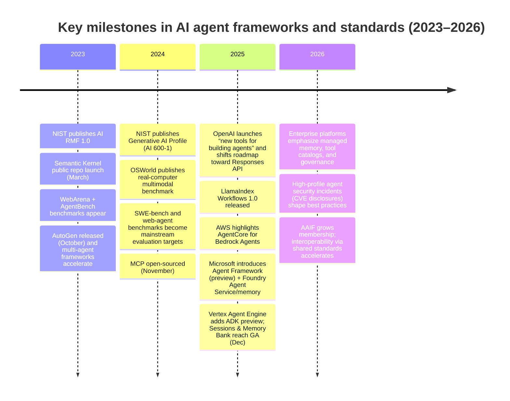

# AI Agent Frameworks in 2026: Trends, Landscape, and Practical Guidance

**Source**: Deep Research (DeepSeek)
**Date**: 2026-03-20
**Related Issue**: GEO-187 (Lead Agent Behavior Design)

---

## Executive summary

“AI agent frameworks” in 2026 are best understood as **developer-facing systems for building, running, and governing task-completing AI systems** that can (a) plan and act across tools and environments, (b) maintain state (short-term and often long-term memory), and (c) operate inside explicit guardrails and lifecycle controls (testing, observability, and policy). This definition is now reflected in mainstream platform documentation: agents are framed as systems that act “on your behalf,” using models plus tools, under guardrails. citeturn19search7turn0search20

Across 2024–2026, the dominant trend is an **evolution from “prompt + tools” demos toward production agent engineering**: durable orchestration (graphs/workflows), managed memory services, standardized tool connectivity (notably MCP), and first-class evaluation/observability. Open-source ecosystems (e.g., LangChain/LangGraph, AutoGen, LlamaIndex, Semantic Kernel, CrewAI, Haystack, smolagents, PydanticAI) show sustained growth and rapid release cadence, while cloud vendors and enterprise SaaS providers increasingly ship managed “agent runtimes” with governance, identity, and auditability. citeturn9view0turn7view0turn10view0turn10view3turn10view1turn10view2turn6view3turn6view2turn7view4turn11search17turn16search11turn0search21

A second major 2026 theme is **standardization and interoperability**. The **Agentic AI Foundation (AAIF)** under the **entity["organization","Linux Foundation","open source foundation"]** anchors MCP, AGENTS.md, and goose as shared infrastructure projects, aiming to reduce fragmentation and make agent ecosystems more interoperable and predictable. citeturn20search0turn20search8turn20search1turn20search2

Public benchmark evidence still shows a substantial **capability gap** for long-horizon, tool-rich, real-environment tasks: e.g., OSWorld reports humans at ~72% task success versus best evaluated models at ~12% (as reported in the OSWorld paper’s evaluation), while GAIA highlights large differences between humans and tool-augmented frontier models on seemingly simple “assistant” questions. This gap is driving research and framework features around grounding, robustness, and cost/latency efficiency. citeturn22search1turn15search0

## Definitions and taxonomy of AI agent frameworks in 2026

### Working definition

In 2026, a practical working definition is:

An **AI agent framework** is a software framework and/or managed platform that provides primitives to:  
(1) represent and execute an agent policy (instructions + decision logic),  
(2) call tools and interact with external systems safely,  
(3) manage state and memory across steps/sessions, and  
(4) support production requirements (observability, evaluation, governance, and controlled deployment). citeturn19search7turn11search17turn16search11turn7view0

This definition matters because “agentic” behavior is no longer synonymous with a single model call. In production platforms, “agents” are explicitly framed as **multi-step systems** that persist context, coordinate tools, and operate under guardrails—shifting engineering focus from prompt design alone to orchestration, identity, monitoring, and risk controls. citeturn7view0turn17search7turn16search11turn0search21

### Taxonomy used in this report

A useful 2026 taxonomy slices “agent frameworks” into six overlapping categories:

**Agent SDKs (library-first scaffolds).** Provide core abstractions (agent, tool, handoff, memory hooks) but typically leave deployment and governance to you (or to adjacent products). Examples: OpenAI Agents SDK, PydanticAI, smolagents. citeturn19search4turn7view4turn6view2

**Agent orchestration frameworks (workflow/graph-first).** Treat agent behavior as an explicit workflow graph or state machine, emphasizing durability, inspection, retries, and human-in-the-loop. Example: LangGraph. citeturn6view0turn7view0

**Multi-agent coordination frameworks.** Make “teams of agents” a first-class abstraction: role specialization, handoffs, group chat coordination, and orchestration controllers. Examples: AutoGen, CrewAI, Microsoft Agent Framework (unifying AutoGen + Semantic Kernel foundations). citeturn10view0turn10view2turn11search20turn9view5

**Data/knowledge agent frameworks (RAG + agentic retrieval).** Organize retrieval, tool use, and structured data access around knowledge-heavy tasks. Examples: LlamaIndex, Haystack; typically integrate vector stores, document processing, and “agent over your data” patterns. citeturn10view3turn6view3turn2search6

**Managed agent runtimes.** Cloud “agent engines” that provide sessions, long-term memory, sandboxed code execution, tracing/evals, and identity controls as managed services. Examples: Vertex AI Agent Engine, Microsoft Foundry Agent Service, Amazon Bedrock Agents/AgentCore. citeturn16search11turn17search14turn11search17turn0search21

**Agent ecosystem standards (interoperability layer).** Protocols/formats that enable tools, skills, and repository rules to be portable across agent implementations. Key examples: MCP, Agent Skills, AGENTS.md; governance increasingly coordinated via AAIF. citeturn20search8turn19search1turn20search1turn20search0

## Framework landscape and comparison

### Open-source frameworks and SDKs

Open-source interest remains concentrated in a handful of ecosystems. The chart above uses **GitHub stars as a proxy for OSS mindshare** (not revenue or enterprise penetration). As of early March 2026, LangChain (~129k) leads, followed by AutoGen (~55k), LlamaIndex (~47k), CrewAI (~45k), and a cluster around ~20–27k (Semantic Kernel, LangGraph, smolagents, Haystack, OpenAI Swarm), with PydanticAI (~15k) and Microsoft Agent Framework (~7.7k) rising quickly. citeturn9view0turn10view0turn10view3turn10view2turn10view1turn7view0turn7view2turn7view3turn7view1turn7view4turn10view4

Key observation: the most prominent OSS projects increasingly pair **framework + platform** (e.g., orchestration plus observability/deployment), which aligns with enterprise demands for evaluation, monitoring, and governance. citeturn6view0turn16search8turn16search2

### Commercial and managed frameworks

Managed “agent engines” from hyperscalers and SaaS platforms have converged on similar primitives:

- **Sessions / state stores** (conversation history as a “definitive source” for long-term memory) citeturn17search10  
- **Long-term memory services** with scoped isolation (per-user, per-tenant) citeturn17search7turn17search2  
- **Tool catalogs and governance** (validated tool definitions, centralized management) citeturn17search23turn1search11  
- **Tracing/observability** using industry standards like OpenTelemetry citeturn16search11turn16search19  
- **Sandboxed execution** (especially for code-running or “computer use”) citeturn17search14turn16search15  

These services also make implicit claims: agent frameworks are now expected to integrate with IAM, auditing, and enterprise governance by default—features that are difficult for teams to bolt on after the prototype stage. citeturn11search17turn17search11turn17search38

### Framework comparison tables

#### Open-source agent frameworks and SDKs

| Framework | Vendor / steward | License | Primary languages | Orchestration model | Tool integration & interoperability | “Memory” story | Maturity signals (Mar 2026) | Typical use cases |
|---|---|---|---|---|---|---|---|---|
| LangChain | entity["company","LangChain","agent framework company"] | MIT | Python (plus JS ecosystem) | Chains + agent patterns; ecosystem-first | Broad integrations; pairs with LangGraph for advanced orchestration | Integrations + patterns; often paired with LangGraph/LangSmith | ~129k stars; frequent releases (example: Mar 2 2026) | General-purpose agent apps, rapid prototyping, integration-heavy systems citeturn9view0 |
| LangGraph | LangChain | MIT | Python | Graph/state-machine; durable execution & human-in-loop | Integrates with LangChain + LangSmith | Explicit “comprehensive memory” framing | ~25.8k stars; active releases (Mar 2 2026) | Long-running stateful agents; auditable workflows citeturn6view0turn7view0 |
| AutoGen | entity["company","Microsoft","software company"] | CC-BY-4.0 + MIT (code) | Python, C#, TypeScript | Multi-agent conversation framework | Tooling includes MCP concepts in ecosystem; used for agent teams | Framework-oriented; often paired with external memory & eval tooling | ~55.3k stars; releases through Sep 2025; extensive contributors | Multi-agent systems, research-to-prod scaffolding citeturn10view0turn2search14 |
| Semantic Kernel | Microsoft | MIT | C#, Python, Java | SDK + orchestration; plugins/planners | Model-agnostic connectors | Provides agent + multi-agent orchestration capabilities | ~27.4k stars; active releases (Mar 4 2026) | Enterprise apps, multi-language stacks, plugin-based agents citeturn9view2turn10view1 |
| Microsoft Agent Framework | Microsoft | MIT | Python + .NET | “Graph-based orchestration” and multi-agent workflows | Explicitly positioned to unify AutoGen + Semantic Kernel foundations | Integrates with Foundry ecosystem; memory via Foundry services (managed) | ~7.7k stars; release candidates Mar 2026 | Enterprise multi-agent orchestration with Azure runtime targets citeturn11search20turn10view4turn9view5 |
| LlamaIndex OSS | entity["company","LlamaIndex","agentic data framework company"] | MIT | Python | Workflows + agentic data access patterns | Integrations; enterprise platform alongside OSS | Workflows form of stateful orchestration; data-centric memory patterns | ~47.4k stars; active releases (Feb 18 2026); Workflows 1.0 in 2025 | Knowledge agents over private data; RAG + multi-step retrieval pipelines citeturn10view3turn2search6 |
| CrewAI | entity["company","CrewAI","agent orchestration company"] | (Unspecified in provided excerpt; repo shows framework claims) | Python | “Crews” + “Flows” (event-driven orchestration) | Integrates tools/providers; framework claims independence from LangChain | Framework-level memory patterns; specifics vary by integration | ~45.4k stars; active releases (Mar 4 2026) | Role-based multi-agent automation; enterprise agent workflows citeturn9view3turn10view2 |
| Haystack | entity["company","deepset","ai company"] | Apache-2.0 (plus noted additional file) | Python | Modular pipelines + agent workflows | Vendor-agnostic model integrations; mentions MCP serving via Hayhooks | Explicit control over retrieval/memory/routing | ~24.4k stars; active releases (Mar 5 2026) | Production RAG, transparent pipelines, agentic workflows citeturn6view3turn7view3 |
| smolagents | entity["company","Hugging Face","ai platform company"] | Apache-2.0 | Python | “Agents that think in code” | Emphasizes code agents; sandboxed execution options | Typically externalized to tools/state; framework minimalism | ~25.8k stars; releases Jan 2026 | Lightweight code agents; sandboxed tool execution citeturn6view2turn7view2 |
| PydanticAI | entity["organization","Pydantic","python data validation project"] | MIT | Python | Typed agent framework | Strong provider breadth; “model-agnostic” messaging | Integrates with Pydantic ecosystem; memory via patterns/integrations | ~15.3k stars; active releases (Mar 6 2026) | Type-safe agent apps, structured outputs, production workflows citeturn6view4turn7view4 |
| OpenAI Swarm | entity["company","OpenAI","ai company"] | MIT | Python | Lightweight multi-agent “handoffs” | Educational; explicitly distinct from Assistants API | Stateless between calls (as stated) | ~21.1k stars; no releases | Teaching/reference patterns for delegation/handoff orchestration citeturn6view1turn7view1 |

Notes: (a) GitHub stars/releases are **snapshots**; (b) “Community/activity” is approximated via GitHub-visible releases and contributors; (c) where a field is not clearly specified in an official source excerpt, it is marked **unspecified**.

#### Managed/commercial agent runtimes and platform frameworks

| Platform / service | What it is (2026 framing) | Languages / SDK surface | Key primitives | Observability / evals | Pricing model (public) | Typical use cases |
|---|---|---|---|---|---|---|
| OpenAI Agents platform | Agents defined as systems that act on your behalf, with tools + guardrails; Agents SDK supports MCP | Python Agents SDK; APIs (Responses) | Agent + tools; MCP connectivity; guardrails | Emphasis on evals “cookbook” and agent workflow optimization | Unspecified (usage-based APIs; details vary) | Consumer/enterprise agents; tool-connected workflows citeturn19search7turn19search4turn0search20turn16search7 |
| Amazon Bedrock Agents / AgentCore | Managed agents with AgentCore runtime; knowledge bases for RAG | AWS SDKs / console | Agents + AgentCore; Knowledge Bases; session context mgmt | Unspecified in excerpt; AWS provides managed capabilities | Unspecified (service pricing varies) | Enterprise automation, governed tool use, RAG agents citeturn0search21turn17search1turn17search29 |
| Microsoft Foundry Agent Service | Production-ready foundation for agents; managed memory in preview/GA progression | Foundry SDKs; Azure integration | Agents service; managed long-term memory stores; tool catalogs | Foundry supports managed agent lifecycle; memory docs discuss scoped access | Azure subscription (terms vary; preview terms noted) | Enterprise agents in Microsoft ecosystem; governance + identity controls citeturn11search17turn17search7turn17search11turn17search23 |
| Google Vertex AI Agent Engine | “Agent Engine” with sessions, memory bank, code execution; supports OpenTelemetry tracing; A2A protocol (preview) | Vertex SDK; ADK | Sessions; Memory Bank; sandboxed Code Execution; A2A | OpenTelemetry + Cloud Trace; evaluation services referenced in release notes | Pricing updated in release notes; public details vary by region/tier | Managed agents, multi-agent systems, traceable production workloads citeturn16search11turn17search14turn17search38turn16search15 |
| Salesforce Agentforce | Enterprise “digital labor” agents with flexible pricing | Salesforce platform tooling | Actions/agent operations; integrates into Sales/Service workflows | Unspecified in excerpt | Explicitly consumption-based (Flex Credits / conversations) and per-user options | Customer service, sales ops automation in Salesforce CRM citeturn11search4turn11search6 |
| IBM watsonx Orchestrate | No-code + pro-code agent building; prebuilt agents + tools; governance framing | IBM platform | 100+ domain agents; 400+ tools (product claim); centralized oversight | “Security-rich” environment with guardrails and policy enforcement (product claim) | Unspecified | Enterprise workflow automation; HR/finance/customer service integration citeturn11search1turn11search3 |
| ServiceNow Now Assist agentic workflows | Agentic workflows embedded in ServiceNow processes | ServiceNow platform | Customized agentic workflows for task resolution & automation | Unspecified; platform governance features exist | Unspecified | ITSM/enterprise workflows; agentic task handling inside ServiceNow citeturn11search19turn11search25 |

### Timeline of key milestones 2023–2026

citeturn12search5turn12search6turn8search28turn22search8turn15search38turn2search15turn22search1turn2search9turn2search2turn0search20turn2search6turn0search21turn11search20turn17search15turn17search38turn12search11turn20search14

## Technical advances shaping agent frameworks in 2024–2026

### Multi-agent coordination moves from “chat” to “systems engineering”

The most visible advance is the maturation of **multi-agent architectures**: orchestrator + specialized subagents (web/file/code/terminal), explicit delegation/handoffs, and standardized evaluation harnesses for side-effectful agents. Magentic-One exemplifies this with an Orchestrator directing specialist agents (web/file/code/terminal) and reporting competitive results across multiple agentic benchmarks while emphasizing modularity and extensibility; it also introduces AutoGenBench for controlled evaluation. citeturn14search0turn14search12turn4search18

Frameworks are increasingly designed around the assumption that **single-agent systems hit ceilings** on breadth, reliability, and latency; hence, orchestration primitives (teams, roles, handoffs, graphs) have become first-class rather than add-ons. This is evident across AutoGen, CrewAI, LangGraph, and Microsoft’s unified Agent Framework positioning. citeturn10view0turn9view3turn6view0turn11search20

### Memory as a managed service, not just a vector store

A clear 2025–2026 shift is **“memory” moving from DIY embeddings to managed, scoped long-term memory services**:

- Microsoft Foundry describes memory as a managed long-term solution enabling continuity across sessions/devices, with scoped segmentation to isolate user memory, and explicit warnings to avoid storing secrets. citeturn17search7turn17search39  
- Google Vertex AI Agent Engine introduces Sessions as a definitive source for conversation context and Memory Bank for storing/retrieving information and generating memories from session events, including scoping by user_id. citeturn17search10turn17search2turn17search22  
- LangGraph positions “comprehensive memory” (short-term + persistent) as a core benefit alongside durable execution and human oversight. citeturn6view0turn7view0  

The operational implication is that memory is now treated as a **governed datastore** with access controls and lifecycle management, not a purely algorithmic feature.

### Planning and tool-use: interfaces matter as much as models

Work from 2023–2024 established that **interleaving reasoning and actions** (ReAct) and **learning from linguistic feedback** (Reflexion) can materially improve agent success without full model retraining. ReAct formalizes the “reason+act” paradigm; Reflexion uses verbal feedback stored in an episodic memory buffer to improve future behavior. citeturn14search2turn14search3

In 2024, SWE-agent sharpened the point that the **agent-computer interface (ACI)** can be a primary lever: it studies how interface design changes LM agent performance and introduces an ACI that improves repository navigation, file edits, and command execution for software engineering tasks. citeturn14search1turn14search9

On the tool-evaluation side, ToolLLM/ToolBench describes a pipeline for tool-use datasets and evaluation across thousands of real-world APIs—an underpinning for frameworks that want robust tool calling and schema adherence. citeturn15search22turn15search14

### Grounding and multimodality: from web browsing to full OS interaction

Benchmarks increasingly require agents to act in **realistic, multimodal, open-ended environments**:

- WebArena provides a realistic, reproducible environment with multiple functional websites and embedded tools/knowledge resources; it is designed to reduce the “synthetic environment gap.” citeturn22search8turn22search11  
- OSWorld extends this to full computer environments (Ubuntu/Windows/macOS), with execution-based evaluation scripts; it reports a large gap between humans and evaluated agent systems, with GUI grounding a major failure mode. citeturn22search1turn22search9  
- OSWorld-Human adds an explicit efficiency lens (steps and temporal performance), highlighting that planning/reflection calls dominate latency and that even top agents take substantially more steps than human trajectories. citeturn22search2turn22search13  

A notable 2025–2026 follow-on is OSWorld-MCP, which argues that evaluating “computer-use agents” fairly requires measuring both GUI operation and tool invocation via MCP-like tools, and shows that tools can improve success rates but tool-use reliability remains limited. citeturn22academia41

### Standardization: MCP, Agent Skills, and repository-level governance

The “agent framework” boundary is expanding beyond code libraries into **portable standards**:

- MCP is positioned as an open protocol for supplying context and tools to models, now governed within AAIF (via Linux Foundation) after being donated by entity["company","Anthropic","ai company"] with co-founding support from OpenAI and entity["company","Block","fintech company"]. citeturn19search4turn20search8turn20search0  
- Agent Skills is an open specification for packaging reusable “skills” (instructions/scripts/resources), with ecosystem adoption including developer tooling (e.g., VS Code documentation references portability across agents). citeturn19search1turn19search0turn19search21  
- AGENTS.md provides a predictable, repository-level format for coding-agent instructions; OpenAI’s Codex documentation states Codex reads AGENTS.md before doing work, and the AAIF press release explicitly frames AGENTS.md as a donated project for safer, more interoperable agent development. citeturn20search9turn20search0turn20search1  

Additionally, managed platforms are exploring **agent-to-agent interoperability** explicitly (e.g., Vertex Agent Engine references an A2A protocol preview for interoperable multi-agent systems). citeturn16search11

### Safety/alignment features shift from “prompt rules” to system controls

The 2024–2026 shift is from relying on prompts to relying on **defense-in-depth controls**: governance frameworks (NIST AI RMF), formalized security guidance (OWASP LLM Top 10), and incident-driven hardening of tool connectors.

- entity["organization","NIST","us standards agency"] AI RMF 1.0 and the Generative AI Profile (AI 600-1) provide structured risk-management actions for generative AI systems. citeturn12search5turn12search6turn12search2  
- entity["organization","OWASP Foundation","application security nonprofit"] Top 10 for LLM Applications (v1.1 / 2025 materials) enumerates risks like prompt injection, insecure output handling, model DoS/unbounded consumption, and supply chain vulnerabilities—highly relevant for tool-using agents. citeturn21search0turn21search1turn21search20  
- entity["organization","MITRE","us research nonprofit"]’s ATLAS materials include recent investigation writeups emphasizing prompt injection, tool invocation abuse, and configuration manipulation as recurring patterns in agentic attack surfaces. citeturn21search3turn21search6  

## Benchmarks and performance metrics used in 2024–2026

### What gets measured in “agent benchmarks” now

From 2024–2026, benchmarks increasingly measure:

- **Task success / completion rate** under interactive constraints (web, OS, APIs). citeturn22search1turn22search8turn15search2  
- **Execution-based correctness** (did the agent actually change the environment to the goal state?) rather than judge-based textual scoring alone. citeturn22search1turn22search8  
- **Reliability across trials** (e.g., τ-bench’s pass^k framing for repeated trials). citeturn15search2  
- **Efficiency** (step count, latency, wall-clock time, tool-call budget), especially for computer-use agents. citeturn22search2turn22search13  
- **Safety and rule-following** (domain policies; avoiding unsafe tool use), increasingly modeled explicitly in agent-user-tool benchmarks. citeturn15search2turn22academia41  

### Benchmark table

| Benchmark (year) | Domain | What it stresses | Typical metrics | Notable findings (from primary sources) |
|---|---|---|---|---|
| AgentBench (2023) | Multi-environment suite | “LLM-as-agent” reasoning/decision-making across environments | Success rate per environment | Designed to quantify agent performance in interactive environments citeturn15search38 |
| WebArena (2023) | Web interaction across realistic sites | Realistic web task execution, reproducibility | Task success; execution-based evaluation | Built to close the gap vs synthetic web environments citeturn22search8turn22search11 |
| GAIA (2023) | General AI assistant questions | Tool use, browsing, multimodality, “simple for humans” tasks | Accuracy / success | Reports humans ~92% vs GPT-4+plugins ~15% in the paper’s evaluation citeturn15search0 |
| OSWorld (2024) | Real computer environment | Multimodal GUI grounding, open-ended OS tasks | Success rate; execution-based scoring | Reports humans ~72% vs best model ~12% in evaluation; GUI grounding key weakness citeturn22search1 |
| SWE-bench (2024→) | Real GitHub issues | End-to-end software fixes | % resolved; variants (Verified / Live / Pro) | Public leaderboard and benchmark family used widely for coding agents citeturn2search18turn2search20 |
| SWE-agent (2024) | Software engineering agent system | Agent-computer interface design | Success on SWE-bench; task completion | Shows interface design can materially improve agent capability citeturn14search1turn14search9 |
| AssistantBench (2024) | Realistic, time-consuming web tasks | Long-horizon web navigation across many sites | Automatically evaluated success | 214 tasks across many websites; targets realistic browsing needs citeturn15search1turn15search9 |
| τ-bench (2024) | Tool-agent-user interaction | Rule-following + tool orchestration in dialogue | Success rate; pass^k reliability | Emulates dynamic user conversations with APIs and policy constraints citeturn15search2turn15search10 |
| OSWorld-Human (2025) | Efficiency on OSWorld | Latency + step inefficiency | Steps vs human trajectory; temporal profiling | Finds planning/reflection calls dominate latency; top agents use 1.4–2.7× steps citeturn22search2turn22search13 |
| MedAgentBench (2025–2026) | Clinical EHR agent tasks | Tool use in FHIR-compliant EHR; realistic clinical workflows | Task success on clinical actions | Virtual EHR environment with 300 clinician-authored tasks; focuses on “agent” capabilities beyond QA citeturn18search2turn18search14turn18search38 |
| OSWorld-MCP (2025) | Tool invocation + GUI computer use | Fair evaluation of tool invocation vs GUI-only agents | Success; tool invocation rate | Shows MCP tools can improve success but tool invocation remains a bottleneck citeturn22academia41 |

### Tooling for evaluation in production pipelines

Two notable trends are: (1) evaluation frameworks becoming shared infrastructure, and (2) tracing becoming standardized via OpenTelemetry.

- OpenAI maintains open-source evaluation frameworks (openai/evals) and publishes eval-focused guidance in its developer materials. citeturn16search1turn16search7  
- The UK AI Security Institute’s Inspect ecosystem provides an evaluation framework plus a growing repository of community evaluations (Inspect Evals), including agentic benchmarks like GAIA, emphasizing reproducibility and sandboxing. citeturn16search9turn16search29turn16search6  
- Google’s Vertex AI Agent Engine explicitly references tracing agents via OpenTelemetry and Cloud Trace, reflecting a broader move toward standardized observability. citeturn16search11turn16search15turn16search19  
- LangSmith positions itself as an observability platform with tracing, monitoring, and evaluation workflows for agent systems. citeturn16search2turn16search8turn16search5  

## Real-world deployments, security, privacy, and regulation

### Representative deployments and case studies across sectors

**Enterprise automation.** IBM markets watsonx Orchestrate as enabling no-code/pro-code agents with large catalogs of prebuilt agents/tools and governance controls; IBM provides client stories such as UFC and others on its product pages. citeturn11search1turn11search3

**Finance.** IBM’s Comparus case study describes a “banking assistant” used for process orchestration and conversational banking experiences. citeturn18search3

**Customer service / CRM.** Salesforce Agentforce emphasizes flexible pricing models (consumption credits/conversations and per-user options) aimed at scaling “digital labor” across business functions; this is a signal that SaaS vendors treat agent actions as a billable unit of work. citeturn11search4turn11search6

**IT and workflow platforms.** ServiceNow documents “Now Assist agentic workflows” for resolving tasks, executing procedures, and investigating trends within ServiceNow workflows—an example of agents embedded into operational systems rather than built as standalone apps. citeturn11search19turn11search25

**Healthcare.** MedAgentBench (NEJM AI and associated materials) provides a realistic virtual EHR environment for benchmarking medical LLM agents on clinician-authored tasks in a FHIR-compliant environment—illustrating increasing rigor and caution in agent evaluation for high-stakes domains. citeturn18search2turn18search14turn13search2

**Robotics.** LLM-driven multi-robot collaboration work (e.g., RoCo) uses language-model agents to coordinate task strategy and path planning, representing a parallel “agent frameworks” evolution in robotics research (often with explicit human-in-loop and planning constraints). citeturn18search0turn18search13turn18search17

### Security realities: why agents expand the attack surface

Agent frameworks increase security exposure because they connect models to **capability-bearing tools** (filesystem, code execution, workflow APIs) and persistent state (memory). Recent disclosures illustrate concrete risks:

- ServiceNow’s advisory for CVE-2025-12420 describes an issue enabling unauthenticated impersonation and actions under the impersonated user’s permissions—materially amplified when “Now Assist AI Agents” and related APIs can perform actions. citeturn12search0turn12search11turn12search3  
- MCP server vulnerabilities (e.g., CVE-2025-68145) show how tool servers can be exploited via argument/path validation weaknesses—particularly dangerous when chained with filesystem access and prompt injection patterns. citeturn12search27turn12search1turn21search2  

These incidents align with OWASP’s risk taxonomy for LLM apps (prompt injection, insecure output handling, supply chain vulnerabilities) and MITRE’s ATLAS framing of attack pathways involving tool invocation and “agent configuration” manipulation. citeturn21search0turn21search3turn21search6

### Privacy and regulatory considerations

**EU risk-based regulation.** The **entity["organization","European Union","regional political union"]** AI Act timeline is material for agent builders because agents frequently operate in regulated contexts (employment, healthcare, finance). The EU’s official timeline clarifies staged applicability dates and compliance phases (high-level obligations are time-phased rather than instantaneous). citeturn2search18turn2search7

**Governance standards.** ISO/IEC 42001:2023 (AI management systems) and ISO/IEC 23894:2023 (AI risk management guidance) provide organization-level management frameworks that map well to agent lifecycle governance (policies for data, monitoring, incident response). citeturn13search0turn13search1

**U.S. risk and cybersecurity guidance.** NIST AI RMF 1.0 and the Generative AI Profile provide concrete actions for generative AI risk management; HHS efforts to strengthen cybersecurity protections for electronic protected health information (ePHI) show that sector regulators continue to update baseline security expectations that directly affect agent systems handling sensitive data. citeturn12search5turn12search6turn13search2turn13search22

## Ecosystem and market trends, open challenges, and recommendations

### Developer experience and ecosystem shifts

A defining (and underappreciated) 2026 trend is that **DX is now a competitive differentiator** for agent frameworks. The baseline expectation is:

- **Standard tool connectivity** (MCP) and portable skill packaging (Agent Skills) citeturn19search4turn19search1  
- **Repository-level agent guidance** (AGENTS.md) for coding workflows, integrated into agent tooling such as Codex citeturn20search9turn20search1  
- **Observability by default** (OpenTelemetry tracing, platform dashboards, cost/latency monitoring) citeturn16search11turn16search35turn16search2  
- **Evaluation as a lifecycle practice** (e.g., OpenAI’s eval frameworks and cookbooks; Inspect Evals as shared benchmark implementations) citeturn16search1turn16search9turn16search6  

This aligns with a broader message from Anthropic’s “building effective agents” guidance: many successful implementations rely on composable patterns rather than maximal framework complexity—suggesting that frameworks win when they clarify primitives and integrate properly with governance and tooling. citeturn19search30

### Business and market signals

**Funding and vendor platformization.** Framework vendors are raising significant capital, reflecting market expectations that orchestration + observability + deployment will become a durable category:

- LangChain announced a $125M Series B at a $1.25B valuation (Oct 20, 2025), positioning itself as an “agent engineering platform.” citeturn3search35turn5search20  
- LlamaIndex announced a $19M Series A (Mar 4, 2025) to build enterprise-grade knowledge agents. citeturn2search25turn5search17  
- ServiceNow’s disclosed AI revenue targets and acquisitions (e.g., Moveworks) reflect a SaaS “agents embedded into workflows” strategy, with AI monetization targets tied to enterprise contract value rather than developer tooling alone. citeturn11news38turn11news39  

**Pricing models.** Publicly documented pricing for agent products increasingly mixes (a) per-user licensing and (b) consumption/action-based units (credits, conversations). Salesforce’s Agentforce is explicit about offering consumption-based and per-user licensing options; its press release refers to $2 per conversation pricing and “Flex Credits.” citeturn11search4turn11search6

**M&A and security adjacency.** A related market trend is that “agent adoption” drives demand for observability, identity, and security acquisitions, because agents can amplify the blast radius of workflow tools when compromised. Recent large acquisitions cited in major business outlets (e.g., ServiceNow’s Armis deal expectations; other security/observability consolidation) illustrate this adjacency, though exact causality to “agents” varies and is often framed as broader AI-driven security demand. citeturn11news46turn5news43

**Market share data caveat.** Reliable public “market share” for agent frameworks (by revenue or production deployments) is generally **unspecified**, because vendors do not disclose comparable usage denominators and open-source metrics (stars/downloads) are not market share.

### Open challenges that remain unsolved in 2026

Agent frameworks are improving quickly, but several hard problems remain:

- **Robustness in open environments.** OSWorld/WebArena-class tasks still show large gaps vs humans, dominated by GUI grounding errors, operational knowledge gaps, and compounding mistakes. citeturn22search1turn22search8  
- **Cost/latency and “agent efficiency.”** OSWorld-Human highlights that planning/reflection dominates latency and step inflation persists even for strong agents. citeturn22search2turn22search13  
- **Tool security and supply chain risk.** OWASP’s LLM Top 10 emphasizes prompt injection and supply chain vulnerabilities; real MCP server CVEs and enterprise platform CVEs show that tool layers and agent “glue code” are high-risk surfaces. citeturn21search0turn12search27turn12search11  
- **Evaluation stability and reproducibility.** Tool APIs change, web environments drift, and side effects complicate benchmarking, motivating “verified” benchmark distributions and sandboxed evaluators. citeturn15search7turn22search18turn16search9  
- **Governed memory.** Long-term memory improves UX but creates privacy and security pitfalls (sensitive retention, cross-user leakage, prompt injection persistence), leading platforms to emphasize scoping and caution. citeturn17search7turn17search22turn17search39  

### Actionable recommendations for developers and decision-makers

1) **Choose an orchestration primitive that matches your operational risk.** If your agent must run long-horizon workflows with retries, approvals, and post-mortems, prefer explicit workflow/graph orchestration (e.g., LangGraph-style durability) or a managed agent runtime with sessions/tracing, rather than an opaque “single loop” agent. citeturn6view0turn11search17turn16search11

2) **Adopt standards deliberately, but treat tool servers and skills as third-party code.** MCP and Agent Skills improve portability and accelerate integration, but they also expand supply chain and prompt-injection attack surfaces; implement allowlists, sandboxing, path validation, and human approval gates for destructive actions. Ground this in OWASP LLM Top 10 guidance and learn from real MCP server CVEs. citeturn19search4turn19search1turn21search0turn12search27turn21search20

3) **Institutionalize evals + tracing early (before “production”).** Use standardized evaluation harnesses (OpenAI evals, Inspect/Inspect Evals) and instrument traces (OpenTelemetry where available) to prevent silent regressions in tool calling, memory behavior, and latency. Treat “agent changes” like code changes: gated by tests and monitored in production. citeturn16search1turn16search9turn16search11turn16search35

4) **Prefer retrieval and governed knowledge integration for factual freshness; fine-tune primarily for behavior.** Managed knowledge-base services (e.g., Bedrock Knowledge Bases) explicitly frame RAG as the mechanism to inject proprietary/up-to-date information, while fine-tuning is better aligned with output behavior and task specialization. Use hybrid approaches only when you can evaluate end-to-end. citeturn17search1turn17search13turn17search28turn17search32

5) **Treat memory as regulated data storage.** Implement scoping (per-user/per-tenant), retention policies, and secret-handling rules (do not store credentials in memory). Align controls with NIST AI RMF / ISO 42001 governance, and sector rules (e.g., HIPAA security updates if handling ePHI). citeturn17search7turn17search39turn12search6turn13search0turn13search2