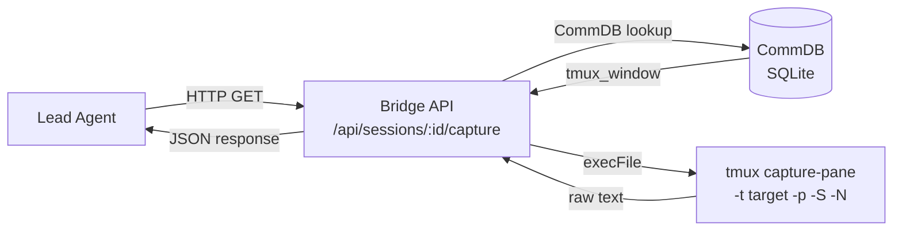
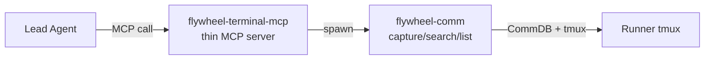
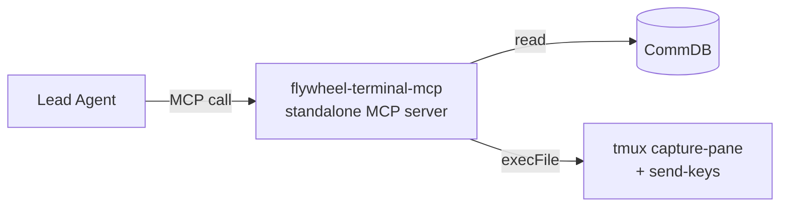
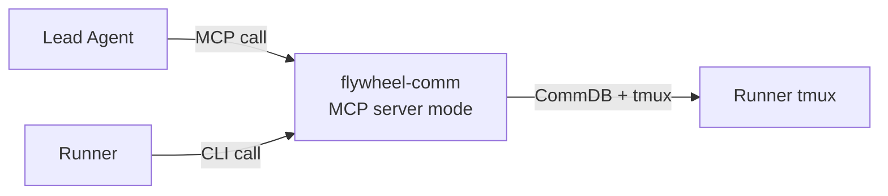
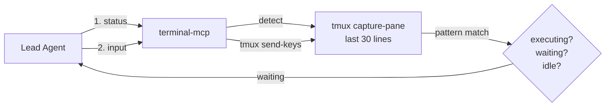

# Exploration: Terminal Observation MCP Tool — FLY-11

**Issue**: FLY-11 (Terminal Observation MCP Tool)
**Date**: 2026-03-30
**Status**: Complete

## Background

Lead 作为 department head，需要实时观察 Runner（Claude Code in tmux）的工作状态。当前的观察路径是 **间接的**：Lead 通过 Bridge REST API (`GET /api/sessions/:id/capture`) 获取 tmux 终端快照。

FLY-11 的目标：让 Lead 能通过 **MCP tool 直接观察** Runner 终端，减少中间层，提升观察效率。

## Current State

### 观察路径（GEO-262, PR #49）



**特点**：
- 单次快照（snapshot），不支持 streaming
- 通过 Bridge HTTP 中转，有网络开销
- Lead 只能观察（read-only），不能发送输入
- Lead scope 过滤确保只能看自己的 Runner

### 现有 tmux 工具链

| Module | Package | Purpose |
|--------|---------|---------|
| `tmux-naming.ts` | core | Session/window 命名规范 |
| `tmux-viewer.ts` | core | Terminal.app 可视化 |
| `tmux-lookup.ts` | teamlead/bridge | CommDB → tmux target 解析 |
| `session-capture.ts` | teamlead/bridge | capture-pane 封装 |

### flywheel-comm 现有命令

`flywheel-comm` 已支持 9 个命令（ask/check/pending/respond/send/inbox/sessions/capture/stage），其中 `capture` 就是终端快照。架构可扩展——添加新 command 只需新建 `commands/*.ts` + 注册。

### AgentsMesh 参考（FLY-3 Research）

AgentsMesh 有 3 个终端观察机制值得参考：

1. **Pod Binding** — Agent A 直接 read/write Agent B 的终端（`get_pod_snapshot` + `send_pod_input`），需要 binding 授权
2. **Relay WebSocket** — 实时 terminal streaming（pub/sub 架构）
3. **Autopilot iteration tracking** — 进度检测 + 重复错误断路器

Flywheel 的差距：缺少 terminal input、streaming、iteration-level 进度追踪。

## Goal

Lead 调用 MCP tool 直接看到 Runner 终端内容，无需经过 Bridge HTTP。

## Design Questions

### Q1: Read-only vs Read-write?

| 选项 | 描述 | 风险 |
|------|------|------|
| **Read-only** | Lead 只能 capture 终端输出 | 安全，但 Lead 无法直接干预 Runner |
| **Read-write** | Lead 还能 send keystrokes/input | 强大，但可能干扰 Runner 正在执行的 Claude Code session |
| **Hybrid** | Read 默认开启，write 需要显式授权/确认 | 平衡安全与能力 |

**关键考量**：Runner 是 Claude Code CLI session，不是普通 shell。直接发送 keystrokes 可能破坏 Claude 的上下文，或触发意外操作。当前 Lead→Runner 指令通道是 `flywheel-comm send/inbox`（异步、结构化），比 raw terminal input 更安全。

### Q2: MCP Server 放在哪里？

| 选项 | 描述 | 优点 | 缺点 |
|------|------|------|------|
| **A. 独立 MCP Server** | 新建 `packages/terminal-mcp/` | 职责清晰，可单独部署 | 多一个进程，多一个 package |
| **B. 扩展 flywheel-comm** | 在 flywheel-comm 加 MCP server 模式 | 复用现有 CommDB/tmux 逻辑 | flywheel-comm 现在是 CLI，加 MCP 是架构变更 |
| **C. 在 Lead 启动脚本中内嵌** | `claude-lead.sh` 启动时注册 MCP tools | 零额外进程 | 耦合 Lead 启动流程 |
| **D. 扩展 Discord plugin** | 在 claude-plugins-official fork 中添加 terminal tools | Lead 已经用 Discord plugin | 终端观察与 Discord 无关，职责混乱 |

### Q3: API 设计选项

```typescript
// Option 1: 基础快照（对标现有 Bridge capture）
terminal_capture(session_id: string, lines?: number): CaptureResult

// Option 2: 搜索终端历史
terminal_search(session_id: string, pattern: string): SearchResult

// Option 3: 实时流（需要长连接，MCP 不原生支持）
terminal_stream(session_id: string): StreamHandle  // ⚠️ MCP 限制

// Option 4: 发送输入（read-write 模式）
terminal_send_input(session_id: string, text: string): void

// Option 5: 终端元数据
terminal_info(session_id: string): TerminalInfo  // size, last_activity, process tree

// Option 6: 列出可观察的 session
terminal_list(): SessionInfo[]
```

### Q4: 与 Bridge capture 的关系？

| 策略 | 描述 |
|------|------|
| **替代** | MCP tool 完全取代 Bridge `/api/sessions/:id/capture` |
| **互补** | MCP tool 是 Lead 专用的快速路径，Bridge API 保留给外部系统（dashboard、webhook） |
| **统一底层** | MCP tool 和 Bridge API 共享同一个 capture 函数，只是入口不同 |

推荐 **互补 + 统一底层**：Lead 直接调用 MCP（快），Bridge API 保留给非 Lead 消费者（dashboard、审计）。两者共享 `captureSession()` 底层实现。

### Q5: 安全边界

- Lead 只能观察 **自己 scope 内的 Runner**（沿用 GEO-259 lead scope 过滤）
- CommDB 中 session 记录了 lead_id，MCP tool 用调用者的 lead_id 过滤
- 同机部署（Lead + Runner 在同一台机器），无网络攻击面
- Path traversal guard 沿用现有实现

### Q6: 轮询频率 vs 事件驱动

| 模式 | 描述 | 适用场景 |
|------|------|----------|
| **按需** | Lead 主动调用 `terminal_capture` | 最简单，当前 Bridge 就是这样 |
| **定时轮询** | Lead 每 N 秒自动 capture | 有上下文窗口开销 |
| **tmux 监控钩子** | tmux `monitor-activity` + hook 触发 | 复杂，维护成本高 |

推荐 **按需调用**：Lead 是 Claude Code session，它会根据需要决定何时观察 Runner。不需要自动轮询。

## Options

### Option A: 扩展 flywheel-comm + MCP wrapper



**实现**：
1. flywheel-comm 新增 `search` 命令（grep tmux scrollback）
2. 新建 `packages/terminal-mcp/` — thin MCP server，调用 flywheel-comm CLI
3. Lead 启动时通过 `--mcp` 加载这个 server

**优点**：复用 flywheel-comm 的 CommDB/tmux 逻辑；CLI 和 MCP 两个入口
**缺点**：多一个 package；CLI spawn 有 overhead

### Option B: 独立 MCP Server 直接操作 tmux



**实现**：
1. 新建 `packages/terminal-mcp/` — 完整 MCP server
2. 直接 import `tmux-lookup.ts` 和 `session-capture.ts` 逻辑（或共享 utility）
3. 暴露 3-5 个 MCP tools
4. Lead 通过 `--mcp` 加载

**优点**：最快路径（直接 tmux，无中间进程）；职责清晰
**缺点**：需要共享 tmux utility code（可能需要 refactor 到 core package）

### Option C: 扩展 flywheel-comm 为双模式（CLI + MCP）



**实现**：
1. flywheel-comm 加 `--serve` 模式启动 MCP server
2. 复用所有现有 command 逻辑
3. 新增 terminal 相关 commands（search, info）
4. Lead 启动时 `flywheel-comm --serve --project geoforge3d`

**优点**：零额外 package；flywheel-comm 成为 Lead↔Runner 通信的统一入口
**缺点**：flywheel-comm 架构变更较大（CLI→CLI+Server）；可能影响 Runner 端 CLI 稳定性

## Decision Record

**Annie 决定**：Read-write，不分 Phase。按 AgentsMesh Pod Binding 模式实现。

- **Q1 Read-only vs Read-write?** → **Read-write**。Annie 明确要求在 PR #88 中加入 write 能力
- **Q2 MCP Server 放哪里?** → **Option A（混合）**：独立 `packages/terminal-mcp/` MCP server + flywheel-comm 共享逻辑
- **Q3 API 设计** → 5 个 tools: capture + list + search + **status** + **input**
- **Q5 安全边界** → status detection 用 soft recommendation（tool description 提示只在 waiting 时 input），不做 hard block

### Write 能力设计（AgentsMesh Pod Binding 模式）



**Status Detection** (`runner_terminal_status`):
- `executing` — agent 正在工作（没有 prompt/wait 信号）
- `waiting` — 终端显示确认/权限/输入提示
- `idle` — shell prompt 可见，没有 agent 运行
- `dead` — tmux session 不存在

**Terminal Input** (`runner_terminal_input`):
- `tmux send-keys -t target text [Enter]`
- 2000 char limit，可选是否按 Enter
- Safety: tool description 明确提示只在 waiting 时使用

## Key Questions for Annie

~~1. **Read-only 还是 read-write？**~~ → **已决定: Read-write**

~~2. **哪个 Option 优先？**~~ → **已决定: Option A 混合方案**

~~3. **MCP tool 粒度？**~~ → **已决定: 5 tools (capture + list + search + status + input)**

4. **优先级 vs 其他 backlog items？** FLY-11 相比 GEO-289（Lead 空闲再分配）、GEO-281（TOOLS.md 模板化）的优先级如何？

5. **远期方向？** 是否考虑 AgentsMesh 风格的 WebSocket streaming？还是 snapshot 足够？
