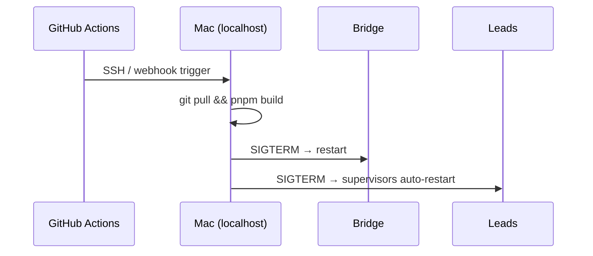
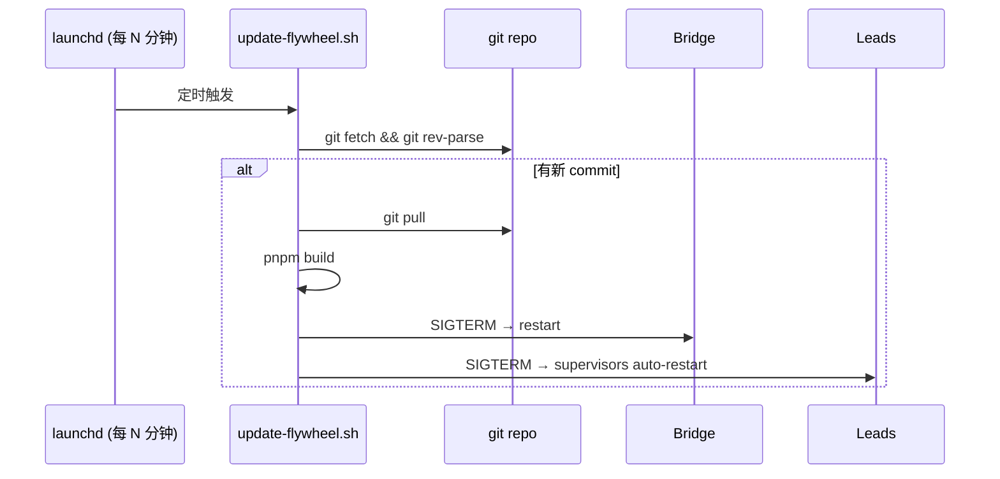
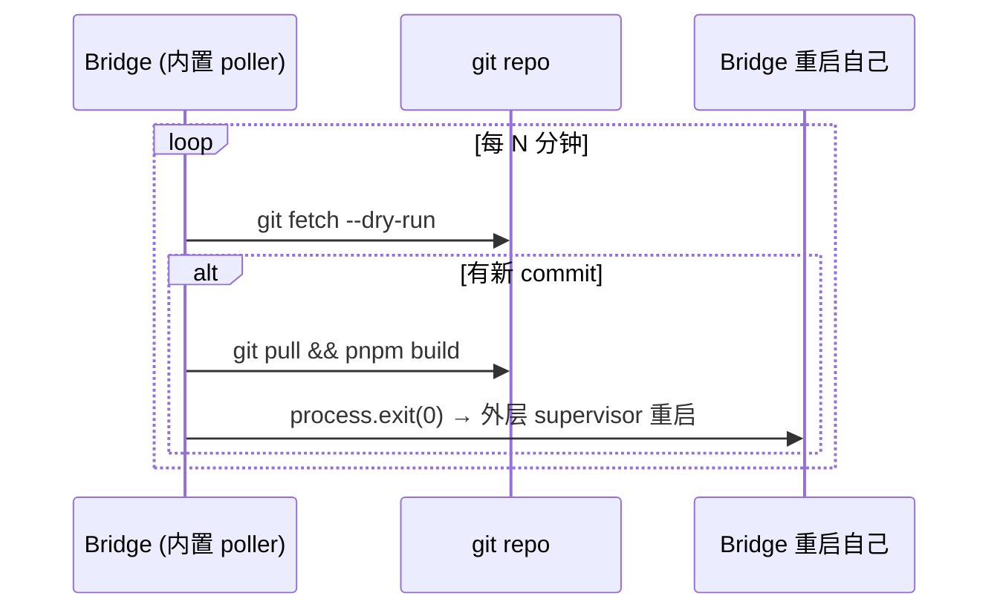
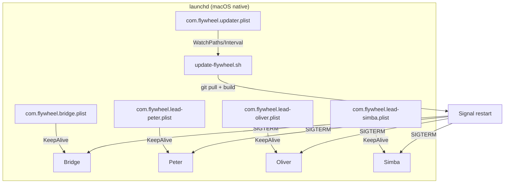
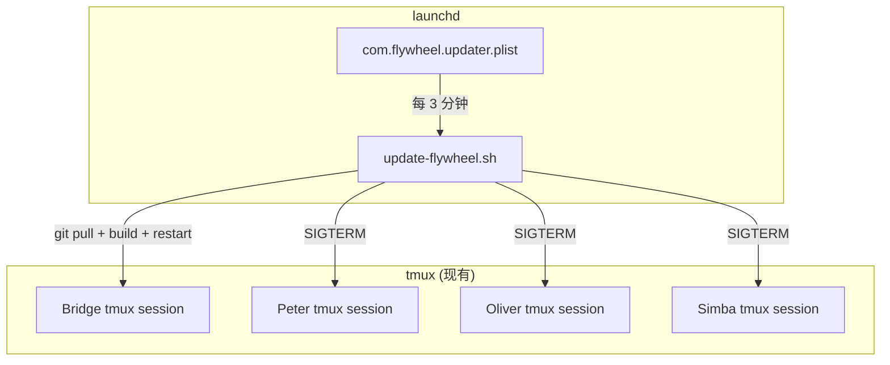

# Exploration: Auto-restart Bridge + Lead after Merge — FLY-20

**Issue**: FLY-20 (Auto-restart Bridge + Lead after merge — CD flow)
**Date**: 2026-03-30
**Status**: Draft

---

## 1. Current State: How Bridge / Lead Start Today

### Bridge (Express + SQLite)

| Item | Detail |
|------|--------|
| Entry point | `scripts/run-bridge.ts` → `npx tsx scripts/run-bridge.ts` |
| Process model | 单进程 Node.js，无 PM2/forever/systemd |
| Port | `127.0.0.1:9876` |
| State | SQLite `~/.flywheel/teamlead.db` |
| Config | `packages/teamlead/.env` + `~/.flywheel/projects.json` |
| Graceful shutdown | `SIGINT/SIGTERM` → drain retries → teardown runtimes → close DB |
| 启动方式 | **手动** — 终端里跑或 tmux session 里跑 |

### Lead (Claude Code CLI sessions × 3)

| Item | Detail |
|------|--------|
| Supervisor | `packages/teamlead/scripts/claude-lead.sh` |
| Leads | Peter (product-lead), Oliver (ops-lead), Simba (cos-lead) |
| Process model | Bash supervisor loop → fork `claude --agent <id> --channels discord` |
| Crash recovery | Exponential backoff (5/15/30/60s)，3 次 quick-exit 后 fresh start |
| Session state | `~/.flywheel/claude-sessions/{project}-{lead}.session-id` |
| Agent file | 启动时从 `{project}/.lead/{lead}/agent.md` 拷贝到 `~/.claude/agents/` |
| Discord plugin | 启动时检查 fork 版本，过期则更新 |
| 启动方式 | **手动** — 每个 Lead 单独跑 `claude-lead.sh`，通常在独立 tmux session |

### Daily Standup (唯一的 launchd 自动化)

| Item | Detail |
|------|--------|
| Plist | `~/Library/LaunchAgents/com.flywheel.daily-standup.plist` |
| Schedule | 每天 3:00 AM |
| Action | `curl POST /api/standup/trigger` |

### Ship Flow (FLY-2)

`:cool:` comment → GitHub Actions (`ship-on-comment.yml`) → CI → squash merge → 分支删除。

**Post-merge**:
- Bridge `postMergeCleanup()` 关 Runner tmux session
- Orchestrator/worker 归档文档、更新 CLAUDE.md/VERSION/MEMORY.md、清理 worktree

**关键缺口**: merge 后代码到了 main，但 **没有任何自动化** 让 Bridge/Lead 用上新代码。需要人工：
1. `git pull` 拉新代码
2. `pnpm build` 重新编译
3. 重启 Bridge 进程
4. 重启 3 个 Lead 进程

---

## 2. Problem: 自主循环的断裂点

Flywheel 的目标是 autonomous dev workflow，但当前：

**断裂点 C→D** 需要 Annie 手动介入。这违背了 "human attention is the bottleneck" 的核心设计理念。

**具体痛点**:
1. **新功能不生效**: 改了 Bridge API、Lead 行为、CommDB schema 等，需重启才能用
2. **夜间/周末 idle**: 没人重启 = 新能力闲置
3. **多服务协调**: Bridge + 3 Lead + hooks，手动重启容易遗漏或顺序错
4. **中断 in-flight work**: Lead 正在 Discord 对话，粗暴重启会丢 context

---

## 3. Options

### Option A: GitHub Actions post-merge → SSH webhook → Mac restart

**实现方式**: 
- GitHub Actions `ship-on-comment.yml` 增加 post-merge step
- 通过 SSH (需 Mac 开 remote login) 或 HTTP webhook (需反向代理/ngrok) 触发本地脚本
- 本地脚本: `git pull` → `pnpm build` → restart

**Pros**:
- 和现有 ship flow 无缝衔接
- 触发时机精确（merge 后立即）
- GitHub Actions 有完整日志

**Cons**:
- 🔴 **安全风险大**: Mac 需要暴露 SSH 或 HTTP 端口到公网
- 🔴 **ngrok/tailscale 依赖**: 增加额外基础设施
- 🟡 **网络不稳定**: Mac 休眠/断网 = 触发失败
- 🟡 **密钥管理**: GitHub Secrets 存 SSH key

**复杂度**: 高  
**失败模式**: 网络中断、Mac 休眠、SSH 超时、端口暴露安全风险

---

### Option B: launchd watch + auto pull + restart

**实现方式**:
- launchd plist，每 2-5 分钟执行一次
- 脚本: `git fetch` → 比较 `HEAD` vs `origin/main` → 有变化则 pull + build + restart
- Bridge/Lead 的 PID 存在 pidfile，脚本发 SIGTERM

**Pros**:
- ✅ **纯本地，无外部依赖**
- ✅ **launchd 已有先例**（daily-standup 就是这样跑的）
- ✅ **Mac 休眠恢复后自动补执行**
- ✅ **简单可靠**

**Cons**:
- 🟡 **延迟**: 最多 N 分钟才检测到新代码（可接受）
- 🟡 **build 期间 downtime**: pull + build 期间服务不可用（通常 <30s）
- 🟡 **build 失败**: 新代码编译不过 → 需要回滚策略

**复杂度**: 低-中  
**失败模式**: build 失败（可回滚）、pnpm install 失败（lockfile 变化）

---

### Option C: Bridge self-update (内置 poller)

**实现方式**:
- Bridge 内增加 `SelfUpdateService`，定时 `git fetch` 检查
- 检测到新 commit 后：pull → build → graceful shutdown（exit 0）
- 外层 supervisor（新增）检测到 exit 后重启 Bridge

**Pros**:
- ✅ Bridge 有完整的上下文（知道有无 in-flight session）
- ✅ 可以选择"安全时机"更新（无 active runner 时）

**Cons**:
- 🔴 **循环依赖**: Bridge 自己更新自己，chicken-and-egg 问题
- 🔴 **复杂度高**: 需要额外的 supervisor 来重启 Bridge
- 🟡 **职责混乱**: Bridge 是应用层，不应该管自己的部署
- 🟡 **build 在 Bridge 进程内跑**: 影响运行时性能

**复杂度**: 高  
**失败模式**: 自更新逻辑 bug → Bridge 挂了 → 没人重启

---

### Option D: Systemd/launchd 管理全生命周期 (推荐探索)

**实现方式**:
- 每个服务一个 launchd plist（`KeepAlive=true`，自动重启）
- Updater plist: 定时检查 git，有更新则 pull + build + `launchctl kickstart` 重启各服务
- 所有 PID/log 由 launchd 管理

**Pros**:
- ✅ **macOS 原生，最可靠**
- ✅ **KeepAlive**: crash 自动重启，不需要 bash supervisor loop
- ✅ **统一管理**: `launchctl list | grep flywheel` 看全部状态
- ✅ **日志集成**: stdout/stderr 自动写文件
- ✅ **启动顺序**: Bridge 先起，Lead 后起（可用依赖）
- ✅ **和 daily-standup plist 一致的模式**

**Cons**:
- 🟡 **claude-lead.sh 需适配**: 当前 supervisor loop 和 launchd KeepAlive 重叠
- 🟡 **环境变量**: 每个 plist 需要配完整 env（bot token 等）
- 🟡 **调试麻烦**: launchd 错误日志不直观

**复杂度**: 中  
**失败模式**: plist 配置错误（可测试）、环境变量遗漏（可 validate）

---

### Option E: Hybrid — launchd updater + 现有 supervisor 不变

**实现方式**:
- 只加一个 launchd updater plist（最小变更）
- Bridge/Lead 启动方式不变（仍然手动 tmux 或现有 supervisor）
- Updater 检测到新代码后：pull + build + 发 SIGTERM 给各进程
- Lead 的 `claude-lead.sh` supervisor 收到 SIGTERM 后 graceful shutdown，人工或另一个机制重启

**Pros**:
- ✅ **最小变更**: 不动现有启动流程
- ✅ **风险低**: 只加了一个 poller 脚本

**Cons**:
- 🟡 **只解决一半问题**: SIGTERM 后需要有人/机制重启
- 🟡 **如果 tmux session 被杀了，谁来重新起?**

**复杂度**: 低  
**失败模式**: 重启后无人拉起 → 需配合 Option D 的 KeepAlive

---

## 4. Comparison Matrix

| | A: SSH webhook | B: launchd poll | C: Self-update | D: Full launchd | E: Hybrid |
|---|---|---|---|---|---|
| 安全性 | 🔴 暴露端口 | ✅ 纯本地 | ✅ 纯本地 | ✅ 纯本地 | ✅ 纯本地 |
| 可靠性 | 🟡 网络依赖 | ✅ 高 | 🔴 自我依赖 | ✅ 最高 | ✅ 高 |
| 复杂度 | 高 | 低-中 | 高 | 中 | 低 |
| 延迟 | 即时 | 2-5 分钟 | 2-5 分钟 | 2-5 分钟 | 2-5 分钟 |
| 维护成本 | 高 | 低 | 中 | 中 | 低 |
| 生产就绪 | 🟡 | ✅ | 🔴 | ✅ | 🟡 |

**初步推荐**: **Option D (Full launchd)** 或 **Option B + D 混合**（先 B 快速上线，后迁移到 D）

---

## 5. Key Questions for Annie

### Q1: 重启范围 (Scope)
每次代码更新后，应该重启哪些服务？
- **A) 全部**: Bridge + 3 Leads (最安全，但中断大)
- **B) 智能**: 只重启受影响的（检测哪些 package 变了）— 复杂度高
- **C) 只重启 Bridge**: Lead 保持运行，下次 compact/crash 时自然用新 agent.md — 延迟大

### Q2: In-flight session 处理
Lead 正在 Discord 对话或 Runner 正在跑 issue 时，重启策略？
- **A) 等 idle**: 等所有 in-flight 工作完成再重启 — 可能等很久
- **B) Graceful drain**: 给 30s 完成当前操作，然后 SIGTERM — 推荐
- **C) 立即重启**: SIGTERM，Lead supervisor 自动恢复 session — 最快

### Q3: Build 失败的回滚
如果 `git pull` 后 `pnpm build` 失败怎么办？
- **A) 自动回滚**: `git stash` / `git reset --hard` 到上一个 known-good commit
- **B) 告警不回滚**: 发 Discord 通知 Annie，保持当前（旧）版本运行
- **C) 阻断**: 停止所有服务，等修复 — 太激进

### Q4: Lead session 是否应该随 Bridge 重启？
- **A) 独立生命周期**: Bridge 重启不影响 Lead（Lead 只用 Bridge API，短暂不可用可容忍）
- **B) 联动重启**: Bridge 重启时也重启 Lead（确保一致性）
- **C) Lead 延迟重启**: Bridge 重启后等 10s，再逐个重启 Lead（有序）

### Q5: 进程管理迁移
是否趁此机会将 Bridge + Lead 全部迁移到 launchd 管理？
- **A) 是**: 一步到位，Option D
- **B) 渐进**: 先加 updater（Option E），后续再迁移生命周期
- **C) 不迁移**: 保持 tmux 手动启动，只加 auto-update

### Q6: 通知机制
更新/重启发生时，通知到哪？
- **A) Discord #cos-lead-control**: Simba 频道，Annie 日常不看
- **B) Discord #geoforge3d-core**: Annie 主要频道
- **C) 两者**: core 简要通知 + control 详细日志

---

## 6. Recommended Approach (Pending Annie's Input)

**Phase 1 (Quick Win)**:
- launchd updater plist (每 3 分钟 git fetch)
- 检测新 commit → `git pull` + `pnpm build` + 通知
- 如果 build 成功 → SIGTERM Bridge → SIGTERM Leads
- Lead `claude-lead.sh` supervisor 自动 restart with 新代码

**Phase 2 (Robustness)**:
- Bridge 也加 launchd KeepAlive（crash/kill 自动重启）
- Build 失败自动回滚 + Discord 告警
- Health check endpoint 验证重启成功

**Phase 3 (Optional)**:
- Lead 全量迁移 launchd（替代 bash supervisor）
- 智能重启（只重启受影响服务）
- 版本 pin + canary 策略
