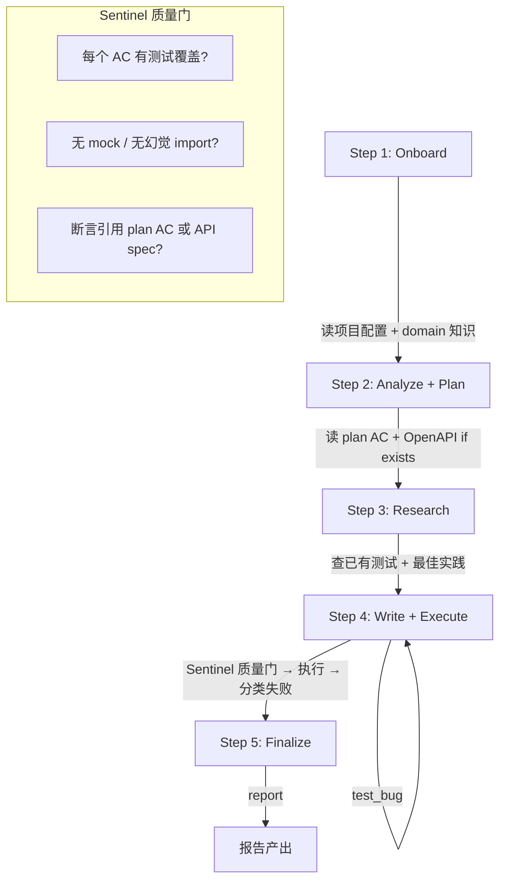
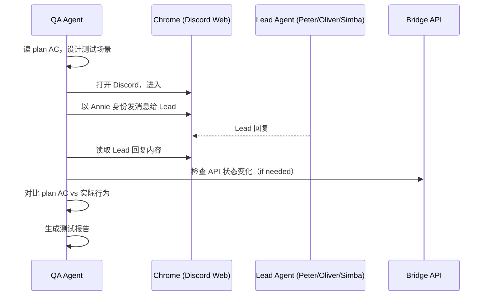

# Exploration: Global QA Agent Framework — FLY-66

**Issue**: FLY-66 (feat: Global QA Agent Framework — extract project-agnostic testing pipeline from GEO-308)
**Date**: 2026-04-03
**Status**: Complete

---

## 1. Background

GEO-308 在 GeoForge3D 实现了一套 QA Agent v2（PR #138），核心是 5 步 plan-aware 测试管线：

```
Onboard → Analyze+Plan → Research → Write+Execute → Finalize
```

但它**完全硬编码在 GeoForge3D 里**（Shopify URL、3MF 验证、OpenAPI 路径、测试数据）。Annie 希望把它提取成通用框架，让 GeoForge3D 和 Flywheel 都能用，未来新项目也能直接获得 QA 能力。

## 2. Brainstorm Q&A（Annie 确认）

### Q1: 安装范围
**A**: 不是单独安装 QA 组件，而是安装 Flywheel 整体（QA 是其中一个模块）。但本 issue **不解决安装问题** — 设计时考虑将来可提取性即可。

### Q2: 框架范围边界
**A**: 三件套全要：
1. **QA Agent 协议**（5 步状态机）— 必须
2. **Sample Skills**（backend-test、frontend-test、e2e-test、onboard-qa）— 提供通用样本，项目拿去定制。GeoForge3D 特定内容不放 sample
3. **Orchestrator**（状态管理、agent 生命周期）— 必须

### Q3: 最小子集
**A**: Plan-driven QA 是核心通用能力。不管什么项目，"读 plan AC → 设计测试策略 → 执行" 这个流程本身通用。具体测什么（API？前端？agent 行为？）由项目配置决定。框架是自助餐模式 — 项目挑选需要的组件。

### Q4: Flywheel 自己的 QA
**A**: 杀手级需求是 **Agent 行为 E2E 测试** — QA Agent 通过 Chrome 自动化进入 Discord 网页版，以 Annie 身份跟 Lead 对话，验证 Lead 行为是否符合预期。
- Chrome 自动化优先（Claude-in-Chrome），Bot API 如果可行也行
- 用 Annie 真实账号（Chrome 已登录）
- 验证方式是**智能判断**：QA agent 根据 issue/plan 上下文决定验证什么（回复内容、Bridge API 状态、其他），不预定义固定模式

### Q5: 安装模式（A/B/C）
**A**: 不影响 QA 设计，以后再讨论。

## 3. Design Decisions

| 决策 | 结论 | 理由 |
|------|------|------|
| 框架位置 | Flywheel monorepo `packages/qa-framework` | 随 Flywheel 整体安装，将来可发布 NPM |
| 协议通用性 | 5 步状态机保持 project-agnostic | Plan-driven QA 流程本身不依赖特定项目 |
| Skill 策略 | 通用 sample + 项目覆盖 | Sample 提供起步，项目配置定制细节 |
| GeoForge3D 回迁 | 提取后必须零回归 | GeoForge3D 是第一个验证客户 |
| Flywheel E2E | Chrome 自动化 + Discord 网页版 | 过去经验证明比 Bot API 更可靠 |
| 验证模式 | Agent 智能判断，不预定义 | 每次测试内容不同，需要 agent 根据 plan 推理 |
| 安装形态 | 本 issue 不解决 | 设计时保持可提取性 |

## 4. Architecture Sketch

### 4.1 两层分离

```
packages/qa-framework/              ← Layer 1: 通用框架（Flywheel 提供）
├── agents/
│   └── qa-parallel-executor.md     ← 通用 5 步协议
├── skills/
│   ├── onboard-qa/SKILL.md         ← 通用 onboarding 流程
│   ├── backend-test/SKILL.md       ← 通用 API 测试流程
│   ├── frontend-test/SKILL.md      ← 通用 Playwright 测试流程
│   └── e2e-test/SKILL.md           ← 通用全链路测试流程
├── orchestrator/
│   ├── schema.sql                  ← 通用 SQLite schema
│   ├── state.sh                    ← 通用状态管理
│   └── config-template.sh          ← 配置模板
├── templates/
│   ├── project-config.yaml         ← 项目 manifest 模板
│   └── {skill}-config.md           ← 各 skill 配置模板
└── package.json

{project-repo}/.claude/             ← Layer 2: 项目配置（每个项目自定义）
├── project-config.yaml             ← 项目 manifest
├── skills/
│   ├── onboard-qa/{project}-config.md
│   ├── backend-test/{project}-test-suite.md
│   ├── frontend-test/{project}-config.md
│   └── e2e-test/{project}-config.md
└── orchestrator/
    └── config.sh                   ← 从 project-config.yaml 读取
```

### 4.2 QA Agent 5 步协议（通用）



### 4.3 Flywheel 特有：Agent 行为 E2E



## 5. GeoForge3D 当前 QA 组件通用性评估

| 组件 | 文件 | 通用性 | 提取策略 |
|------|------|--------|---------|
| Agent 协议 | `qa-parallel-executor.md` (535L) | 95% | 去掉 OpenAPI 硬编码路径，参数化 |
| QA Onboard | `onboard-qa/SKILL.md` | 40% | 拆成通用流程 + `geoforge3d-config.md` |
| Backend 测试 | `backend-integration-test/SKILL.md` | 50% | 拆成通用 API 测试 + `geoforge3d-test-suite.md` |
| Frontend 测试 | `frontend-integration-test/SKILL.md` | 30% | 拆成通用 Playwright + `shopify-config.md` |
| E2E 测试 | `e2e-integration-test/SKILL.md` | 35% | 拆成通用全链路 + 项目配置 |
| Orchestrator | `config.sh`/`state.sh`/`schema.sql` | 95% | config.sh 参数化，其余直接复用 |

## 6. Scope Summary

### In Scope（本 issue）
1. 在 Flywheel `packages/qa-framework` 创建通用框架
2. 通用 5 步 QA agent 协议
3. 4 个 sample skill（backend/frontend/e2e/onboard）
4. Orchestrator 状态管理
5. `project-config.yaml` schema + 模板
6. GeoForge3D 回迁验证（拆分后零回归）
7. Flywheel 项目配置 + Agent 行为 E2E 测试定义

### Out of Scope（以后做）
- Flywheel 安装脚本 / NPM 发布
- 跨项目安装体验设计
- QA Agent 自动化部署 / CI 集成
- 其他新项目的 QA 配置

## 7. Open Questions（Research 阶段回答）

1. `project-config.yaml` 的最佳 schema 设计？需要哪些字段？
2. Sample skill 如何做到"通用但有用"？需要研究其他 QA 框架的模板设计
3. Chrome 自动化测 Discord 的技术可行性？Claude-in-Chrome MCP 的稳定性如何？
4. Orchestrator state.sh 从 GeoForge3D 提取需要改什么？
5. 通用 Sentinel 质量门应该检查哪些条件？
