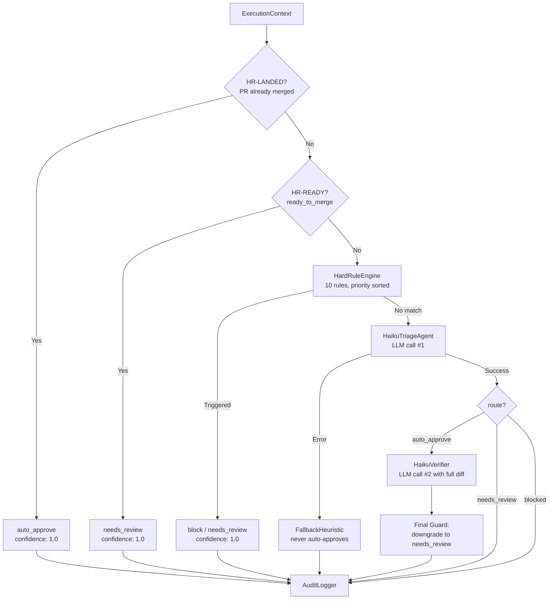
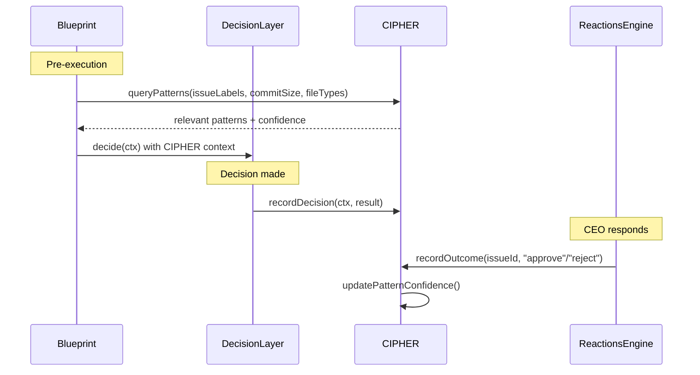
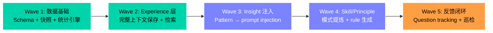
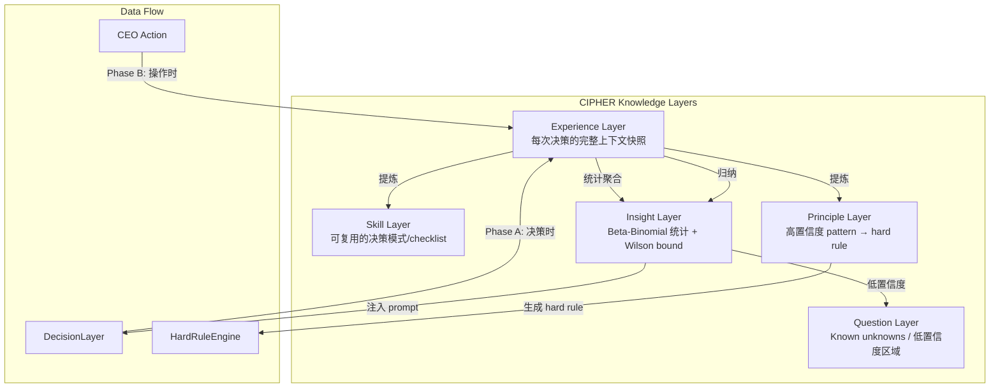

# Exploration: CIPHER Decision-Making Memory — GEO-149

**Issue**: GEO-149 (CIPHER: Decision-making memory)
**Domain**: backend / architecture
**Date**: 2026-03-15
**Depth**: Deep
**Mode**: Technical
**Status**: draft

## 0. Background

CIPHER = **C**ontinuous **I**ntelligent **P**attern **H**arvesting for **E**xecution **R**outing。

目标：从 CEO 的 approve/reject 行为中提取 pattern，让 Decision Layer 随时间变得更智能。

核心价值：当前 Decision Layer 每次决策都是"从零开始"——不记得上次 CEO 对同类 issue 的反应。CIPHER 要让系统学会 "CEO 对小 bug fix 通常直接 approve" 或 "涉及 auth 的改动 CEO 一定要看"。

### 前置条件

- v0.3 Memory 在生产环境运行 (GEO-145, PR #18) — Supabase pgvector ✅
- v1.0 Phase 2 disable auto-approve (GEO-155, PR #17) — CEO 参与每个决策 ✅
- Trial run 产生足够 decision 数据 — 进行中

## 1. 当前架构分析

### Decision Layer 流程



### 数据可用性（决策时）

| 数据 | 来源 | 可用于 CIPHER |
|------|------|--------------|
| Issue 标题/标签 | ExecutionContext | 分类 pattern |
| commit 数量/大小/文件 | ExecutionContext | 复杂度 pattern |
| diff summary | ExecutionContext | 内容 pattern |
| decision route | DecisionResult | 历史决策 |
| reasoning + concerns | DecisionResult | 决策逻辑 |
| CEO 反应 (approve/reject) | ReactionsEngine / StateStore | 真实反馈 |
| session duration | ExecutionContext | 效率 pattern |
| consecutive failures | ExecutionContext | 风险 pattern |

### AuditLogger 现有 Schema

```sql
audit_entries (
  id, timestamp, event_type,
  issue_id, issue_identifier, project_id,
  route, decision_source, confidence, reasoning,
  commit_count, files_changed, lines_added, lines_removed,
  duration_minutes, consecutive_failures
)
```

已经记录了每次决策，但**不记录 CEO 的后续反应**（approve/reject）。这是 CIPHER 最关键的缺失。

### Memory 集成现状

Blueprint 已有 memory 读写：
- **Pre-execution**: `searchAndFormat(issueTitle + description)` → 注入 Claude prompt
- **Post-execution**: `addSessionMemory()` → 存储 decision route + reasoning

但这是**项目记忆**（"Auth tokens expire after 1h"），不是**决策记忆**（"CEO 通常 approve 只改 test 的 PR"）。

## 2. CIPHER 需要什么

### 核心能力

1. **Observe**: 记录每次 CEO 的 approve/reject + 上下文
2. **Extract**: 从历史中提取 pattern（"小 PR + bug label → 95% approve"）
3. **Score**: 每个 pattern 有置信度，随数据变化
4. **Inject**: 在 HaikuTriageAgent 决策前注入历史 pattern
5. **Evolve**: Pattern 随时间强化/弱化（不是 overwrite）

### CIPHER 读写位置



## 3. 技术选项比较

### Option A: mem0 扩展（零新依赖）

**核心思路**: 在现有 mem0 + Supabase 上扩展，用 `agentId: "cipher"` 隔离决策记忆。

**实现方式**:
- 新建 `CipherService` 包装 `MemoryService`
- CEO 操作（approve/reject）→ `addSessionMemory()` with cipher-specific context
- Pattern 作为 fact 存储："CEO approved bug-fix PR with 3 commits and 50 lines"
- 查询时用 `searchAndFormat()` with decision-context query
- 置信度存在 metadata 中，手动管理

**代码影响**:
| 文件 | 改动 |
|------|------|
| `packages/edge-worker/src/memory/CipherService.ts` | 新建 |
| `packages/edge-worker/src/decision/DecisionLayer.ts` | 注入 CIPHER context |
| `packages/edge-worker/src/reactions/ApproveHandler.ts` | 记录 outcome |
| `packages/edge-worker/src/reactions/RejectHandler.ts` | 记录 outcome |
| `packages/edge-worker/src/Blueprint.ts` | 传递 CIPHER service |

**Pros**:
- 零新基础设施（复用 Supabase pgvector）
- TypeScript 原生，与 Flywheel 同进程
- 几天内可以 ship
- 生产环境已验证（mem0 + Supabase 已稳定运行）

**Cons**:
- mem0 没有原生 opinion/belief system — 置信度需要手动实现
- 单一检索策略（纯向量相似度）— 没有时间范围查询或关键词匹配
- Pattern 存为 flat facts，没有结构化的 reinforce/weaken 机制
- 可能需要 customPrompt (GEO-164) 来让 fact extraction 理解"决策 pattern"

**Effort**: Small (1-2 weeks)

---

### Option B: Hindsight Docker Sidecar（全功能决策记忆）

**核心思路**: 在 Mac Mini 上运行 Hindsight Docker 容器，专门用于 CIPHER。

**Hindsight 关键能力**:
- **Opinion network**: 信念有置信度 `c ∈ [0,1]`，reinforce/weaken/contradict 自动更新
- **4-way retrieval (TEMPR)**: 语义 + 关键词 + 知识图谱 + 时间 → RRF 融合 → cross-encoder 重排
- **Reflect**: LLM 推理现有记忆，发现新连接，形成新观点
- **Temporal awareness**: "最近一周 CEO reject 了哪些？" 原生支持
- **MCP native**: product-lead agent 可直接通过 MCP 连接

**部署方式**:
```bash
docker run -d -p 8888:8888 -p 9999:9999 \
  -e HINDSIGHT_API_LLM_API_KEY=$GEMINI_API_KEY \
  -v ~/.hindsight:/home/hindsight/.pg0 \
  ghcr.io/vectorize-io/hindsight:latest
```

**集成方式**:
```typescript
import { HindsightClient } from "@vectorize-io/hindsight-client";
const client = new HindsightClient({ baseUrl: "http://localhost:8888" });

// CIPHER 写入
await client.retain("flywheel-cipher", `CEO approved PR #18: bug fix, 3 commits, 50 lines`);

// CIPHER 查询
const memories = await client.recall("flywheel-cipher", "bug fix PR with small changes");

// CIPHER 反思（发现 pattern）
await client.reflect("flywheel-cipher", "What patterns do I see in CEO's approvals?");
```

**代码影响**:
| 文件 | 改动 |
|------|------|
| `packages/edge-worker/src/cipher/HindsightCipher.ts` | 新建：Hindsight client wrapper |
| `packages/edge-worker/src/decision/DecisionLayer.ts` | 注入 CIPHER context |
| `packages/edge-worker/src/reactions/*.ts` | 记录 outcome |
| `docker-compose.yml` 或 LaunchAgent | Hindsight 容器管理 |
| `scripts/lib/setup.ts` | 初始化 Hindsight client |

**Pros**:
- 专为 CIPHER 设计的 opinion/belief 系统 — confidence 自动演化
- 91.4% LongMemEval（vs mem0 ~81%）— 更精准的检索
- Temporal queries 原生支持 — 时间维度的 pattern 分析
- Reflect 操作 — 系统可以"反思"过去的决策，主动发现 pattern
- MCP 原生 — OpenClaw product-lead 可直接查询 CIPHER
- 不影响现有 mem0 session memory — 并行运行

**Cons**:
- 需要运维 Docker 容器 + 内部 PG（9GB standalone 镜像）
- 需要额外的 LLM API key 用于内部处理（Gemini/OpenAI/Ollama）
- Python 服务，TypeScript 项目 debug 跨语言
- pre-1.0（v0.4.x），API 可能变动
- retain 是异步的 — 写入后可能不立即可查
- 80+ 环境变量配置
- Slim 镜像 (500MB) 需要外部 embedding provider

**Effort**: Medium (3-4 weeks)

---

### Option C: AuditLogger 扩展（纯本地，零外部依赖）

**核心思路**: 在现有 AuditLogger SQLite 上扩展，加入 pattern 表和简单的统计学习。

**实现方式**:
```sql
-- 新表：记录 CEO 反应
CREATE TABLE decision_outcomes (
  id TEXT PRIMARY KEY,
  audit_entry_id TEXT REFERENCES audit_entries(id),
  issue_id TEXT NOT NULL,
  decision_route TEXT NOT NULL,    -- 系统推荐
  ceo_action TEXT NOT NULL,        -- approve/reject/defer
  action_timestamp TEXT NOT NULL,
  labels TEXT,                     -- JSON array
  commit_count INTEGER,
  lines_changed INTEGER
);

-- 新表：提取的 pattern
CREATE TABLE decision_patterns (
  id TEXT PRIMARY KEY,
  pattern_type TEXT NOT NULL,      -- "label_route", "size_route", "combined"
  pattern_key TEXT NOT NULL,       -- "bug:small" or "auth:large"
  approve_count INTEGER DEFAULT 0,
  reject_count INTEGER DEFAULT 0,
  confidence REAL DEFAULT 0.5,
  last_updated TEXT NOT NULL
);
```

**Pattern 提取**: 纯统计——不用 LLM，不用向量搜索：
- `label_route`: "bug" label → 90% approve（8/9 次）
- `size_route`: <100 lines → 85% approve
- `combined`: "bug" + <100 lines → 95% approve

**注入方式**: 在 HaikuTriageAgent prompt 中追加：
```
Historical CEO patterns (confidence > 0.7):
- Issues labeled "bug" with <100 lines: 90% approved (9 samples)
- Issues labeled "auth": 100% reviewed (3 samples)
```

**Pros**:
- 零新依赖（复用 SQLite + sql.js）
- 最简单、最快实现
- 完全可控，TypeScript 原生
- 不需要 LLM 来提取 pattern — 纯统计
- 可解释性最强（"8 次 approve / 9 次总计 = 89%"）
- 如果效果好，后续可以叠加更复杂的方案

**Cons**:
- 纯统计，无法捕捉复杂的、跨维度 pattern
- 没有向量搜索，无法理解语义相似性
- 冷启动问题严重（需要 20+ 决策数据才有意义）
- 手动定义 pattern 维度（哪些特征组合值得跟踪）
- 不会随时间"遗忘"过时的 pattern

**Effort**: Small (1 week)

---

## 4. Recommendation: 全范围实现 + 五层知识模型

### ~~原方案: C → A → B 渐进式~~ (已弃用 2026-03-15)

原计划分三阶段渐进实现。经过 agent-knowledge-framework 研究 (Section 8) 和 Codex 两轮设计审查后，决定一次性实现全范围 CIPHER，避免 schema migration 和 API 返工。

### 新方案: 架构一步到位，实现分波交付

**核心架构**：五层知识模型（experience → skill → principle → insight → question），参考 agent-knowledge-framework 的分类体系。

**存储层**：一次性设计好全部表结构，覆盖五层知识类型。具体存储方案（SQLite vs Supabase vs 混合）在 Research 阶段确定。

**实现分波**：每波有独立可验证的价值：



**技术选型综合评估**：三个 Option 不再互斥，而是在五层模型内各有位置：

| 层 | 最佳技术 | 理由 |
|----|---------|------|
| Experience | 结构化存储 + 可选向量索引 | 需要精确查询（by executionId）+ 语义相似度检索 |
| Skill | 结构化存储 + LLM 提炼 | 从 experience 中提取可复用模式 |
| Principle | HardRuleEngine 扩展 | 高置信度 pattern 自动生成 rule |
| Insight | Beta-Binomial + Wilson (Option C 的核心) | 纯统计，最可靠 |
| Question | 简单标记 | 低置信度 pattern 的显式追踪 |

## 5. Clarifying Questions

### Scope

1. CIPHER 的 pattern 应该影响哪个阶段？
   - **A**: 只影响 HaikuTriageAgent（LLM triage prompt 中注入历史 pattern）
   - **B**: 也影响 HardRuleEngine（当 confidence > 0.95 时自动生成新的 hard rule）
   - **C**: 也影响 HaikuVerifier（验证阶段参考历史 pattern）
   - **推荐 A**：最安全，pattern 只是 LLM 参考信息，不会自动改变决策逻辑

2. CEO 的 approve/reject 数据从哪里获取？
   - **A**: ReactionsEngine 的 ApproveHandler/RejectHandler 已有逻辑，在此基础上记录
   - **B**: 从 StateStore 的 session status 变化推断（approved → approve, rejected → reject）
   - **推荐 A**：最直接，有明确的 action + timestamp

### Safety

3. CIPHER 是否应该有 "pattern 下限"（至少 N 次数据才启用）？
   - 建议：confidence > 0.7 且 样本数 >= 5 才注入 prompt
   - 防止 "CEO 只 approve 过一次 auth PR" → "auth PR 100% approve" 的过拟合

4. 是否需要 pattern decay（时间衰减）？
   - 旧的 approve/reject 逐渐降权，确保 pattern 反映近期偏好
   - 例：30 天前的数据权重 0.5，7 天内权重 1.0

### Data

5. 当前有多少 decision 数据（audit_entries 行数）？这决定了阶段 1 的启动时间。

## 6. User Decisions

### 已确认

1. **渐进路径**: C → A → B（先 AuditLogger 统计，后续按需升级）
2. **Pattern 影响范围**: 方案 A — 只注入 HaikuTriageAgent prompt 作为参考信息，不自动生成 hard rules
3. **时间衰减**: 暂不实现，等数据量上来再加

### CEO 反馈（关键 insight）

**Binary approve/reject 不够！** CEO 在做决策前有复杂的中间过程：
- 调取截图查看实际效果
- 查看 PR diff 和 commit 详情
- 了解上下文（发生了什么、为什么这么做）
- 可能在 Slack thread 中追问 agent
- 基于这些信息综合判断

→ CIPHER 需要捕获的不只是最终动作，还需要 CEO 的决策上下文：
- Slack thread 中的对话内容（CEO 问了什么、agent 回答了什么）
- 从通知到决策的时间间隔（deliberation time）
- CEO 是否要求了额外信息（follow-up questions）
- CEO 给出的理由或评论（如果有）

### Codex 建议（已采纳）

#### Safety 策略

- **不用原始频率**，用 Beta-Binomial 平滑（Bayesian）
  - 先验锚定全局基线：如果全局 approve rate = 95%，prior strength = 10
  - `posterior_mean = (approve + α) / (approve + reject + α + β)`
  - 这样 "1/1 approve" 不会看起来像 100% 可靠
- **用区间下界**而不是点估计（Wilson lower bound）
  - 只有当 pattern 的下界明显优于基线时才注入 prompt
- **Pattern 成熟度分级**:
  - `exploratory` (n < 10): 只记录，不展示
  - `tentative` (n >= 10): 可作为弱 reference 注入 prompt
  - `established` (n >= 20): 稳定注入 prompt
  - `trusted` (n >= 50): 可信赖（但 Phase 1 仍不自动批准）

#### 数据捕获升级：从"结果表"到"事件流"

**三类结果** (替代 binary approve/reject):
- `fast_approve`: CEO 无追问，直接批准
- `approve_after_review`: CEO 追问/要求改动后批准
- `reject_or_block`: CEO 拒绝

**摩擦度评分 (friction score)**:
- `low`: 无追问、无改动、快速 approve
- `medium`: 有少量追问，仍在首轮 approve
- `high`: 要求改动、多轮对话、或最终 reject

**Deliberation signals** 结构化记录:
- `time_to_first_response` — CEO 多久第一次回复
- `time_to_final_decision` — 从通知到最终决策
- `ceo_message_count` — CEO 发了多少条消息
- `question_count` — CEO 问了多少问题
- `request_changes_count` — CEO 要求改几次
- `thread_turn_count` — 对话来回几轮

**Reason codes** (手工分类，Phase 1 不需要 NLP):
- `scope_too_large` / `user_visible_risk` / `ui_quality_concern`
- `missing_test_evidence` / `auth_or_security_sensitive`
- `unclear_reasoning` / `needs_screenshot` / `needs_followup`

#### 防过拟合

- **限制 pattern 维度**: 只用 10-15 个手工 pattern family（label, size_bucket, area_touched 等）
- **分层回退**: `bug+small+frontend` 样本不够 → 退到 `bug+small` → 退到 `bug` → 退到全局基线
- **从 Day 1 维护时间窗口**: `all_time_count` + `last_90d_count` + `last_seen_at`
- **降级规则**: 60-90 天没出现的 pattern 自动降级

## 8. External Research: Agent Knowledge Framework (2026-03-15)

### 来源

- GitHub: `st1page/agent-knowledge-framework` (@tennyzhuang)
- 知乎文章: 「Agent 知识工程：让 AI Agent 像人一样学习、记忆和成长」（同一作者，repo 内 `doc/agent-knowledge-engineering.md`）

### 核心模型：知识五分法

框架提出 agent 团队知识的五层分类体系：

| 层 | 回答什么 | 生成关系 | CIPHER 对应 |
|----|---------|---------|------------|
| **experience** | 发生了什么？（原始素材） | 基础层 | 每次 CEO 决策的完整上下文快照 |
| **skill** | 下次怎么操作？（可复用流程） | 从 experience 提炼 | PR 质量 checklist、决策模式 |
| **principle** | 应该/不应该做什么？（行为准则） | 从 experience 提炼 | 高置信度 pattern → hard rule 自动生成 |
| **insight** | 为什么会这样？（规律性认知） | 跨多次 experience 归纳 | Beta-Binomial 统计模式 |
| **question** | known unknown（待验证疑问） | 知识的前体 | 低置信度区域的显式标记 |

### 关键设计模式

1. **分层加载 (Layered Retrieval)**
   - 常驻层：AGENTS.md 索引（轻量、始终在 context 中）
   - 按需层：skill/principle/insight（关键词/trigger 匹配时加载）
   - 升级层：experience（需要回溯原始素材时加载）
   - → CIPHER 应用：prompt 注入也应分层——只注入最相关的 pattern，不全量灌入

2. **Trigger 机制（两层过滤）**
   - 索引摘要做粗筛（常驻）
   - 文档 front matter 的 `triggers` 字段做精筛（按需）
   - → CIPHER 应用：pattern key 做粗筛，维度匹配做精筛

3. **反馈闭环 > 单向统计**
   - 犯错 → 追问为什么 → 发现知识缺失 → agent 自己改进知识
   - → CIPHER 应用：当预测与 CEO 实际决策不符时，应主动标记为 question

4. **Dreaming / 巡检**
   - `maintainer` 角色定期扫描知识库：坏链接、索引缺口、近似重复
   - → CIPHER 应用：定期扫描矛盾决策、偏好漂移、pattern 衰减

5. **知识由 agent 自己写，人只做审核**
   - 核心观点：agent 不是菜，他只是不知道
   - Prompt engineering = 战术（优化单次对话），Knowledge engineering = 战略（解决认知基础）
   - → CIPHER 应用：pattern 提炼应该是自动化的，CEO 只需要确认/纠正

### 对 CIPHER 的核心启示

1. **不能只做统计 (insight 层)**：需要同时保留决策上下文 (experience 层) 并提炼可执行规则 (skill/principle 层)
2. **SQLite + 结构化分类对 CIPHER 的规模完全够用**：单个 CEO 的决策历史量级有限，不需要复杂向量方案
3. **定性知识体系 + 定量统计模型 = 双轨架构**：框架的分类体系 + CIPHER 的 Beta-Binomial 推断互补
4. **Phase 1→2→3 的渐进路径被验证**：experience → skill → principle → insight 的自然升级

### 结论

agent-knowledge-framework 的五层模型为 CIPHER 提供了更完整的架构框架。原计划的三阶段渐进路径（统计 → 语义 → 信念）与该模型高度吻合，但启发了一个关键改进：**应在架构和 schema 设计上一步到位，覆盖全部五层，避免后续迁移成本。**

---

## 9. 范围扩展决策 (2026-03-15)

### 决策

**放弃分阶段实现，一次性实现全范围 CIPHER。**

原因：
- agent-knowledge-framework 研究表明，只做统计层 (insight) 是不够的，需要同时覆盖 experience/skill/principle/question 层
- 分阶段实现意味着 schema migration 和 API 返工，总工作量反而更大
- Codex Round 2 指出的架构问题（sql.js 跨进程写入、executionId 传递）在全范围设计中可以一次性解决

### 新架构：五层知识模型



### 存储方案待定

Codex Round 2 #1 指出 `sql.js` 跨进程写 `audit.db` 有 last-writer-wins 风险。全范围实现需要重新评估存储方案：

| 方案 | 优点 | 缺点 |
|------|------|------|
| **SQLite (sql.js)** 单写者 | 零外部依赖，现有模式 | 跨进程限制，无向量搜索 |
| **Supabase pgvector** | 已有基础设施 (GEO-145)，支持向量搜索，多进程安全 | 网络延迟，外部依赖 |
| **SQLite + Supabase 混合** | 结构化数据本地，语义搜索远程 | 复杂度高 |
| **独立 SQLite 文件** | CipherService 独占写入，避免 AuditLogger 冲突 | 需要新的持久化管理 |

→ 需要在 Research 阶段确定。

### Codex Design Review 发现（Round 1 + Round 2）

Round 1 和 Round 2 共发现 18 个问题，关键架构级发现：

| 问题 | 影响 | 状态 |
|------|------|------|
| `sql.js` 跨进程写入丢写 | 阻塞 | 需要在 Research 中解决 |
| `ExecutionContext` 无 `executionId` | 阻塞 | 需要扩展 core types |
| `transitionSession()` sync/async 断层 | 阻塞 | 需要改为 async |
| TeamLead 装配路径 (`plugin.ts`) 缺失 | 阻塞 | 需要完整盘点 |
| `defer` 从 `blocked` 状态污染统计 | 中等 | 需要状态门控 |
| `runStatements()` 缺少事务语义 | 中等 | 需要 BEGIN/COMMIT/ROLLBACK |

这些发现直接输入扩展版 Research。

### 原 Phase 1 Plan 处理

`doc/engineer/plan/draft/v1.2.0-GEO-149-cipher-decision-memory.md` 保留在 draft/，不再继续 Codex review loop。新的全范围 plan 将替代它（版本号升级到 v1.3.0 或由 Research 确定）。

## 10. Suggested Next Steps

- [ ] 扩展版 Research：五层知识模型的技术实现方案、存储选型、Codex 发现的解决方案
- [ ] 重写 Plan：全范围 CIPHER 实现（架构一步到位，实现分波交付）
- [ ] 确认 Slack thread 内容捕获可行性（experience 层需要）
- [ ] 确认 skill/principle 自动提炼的触发机制
