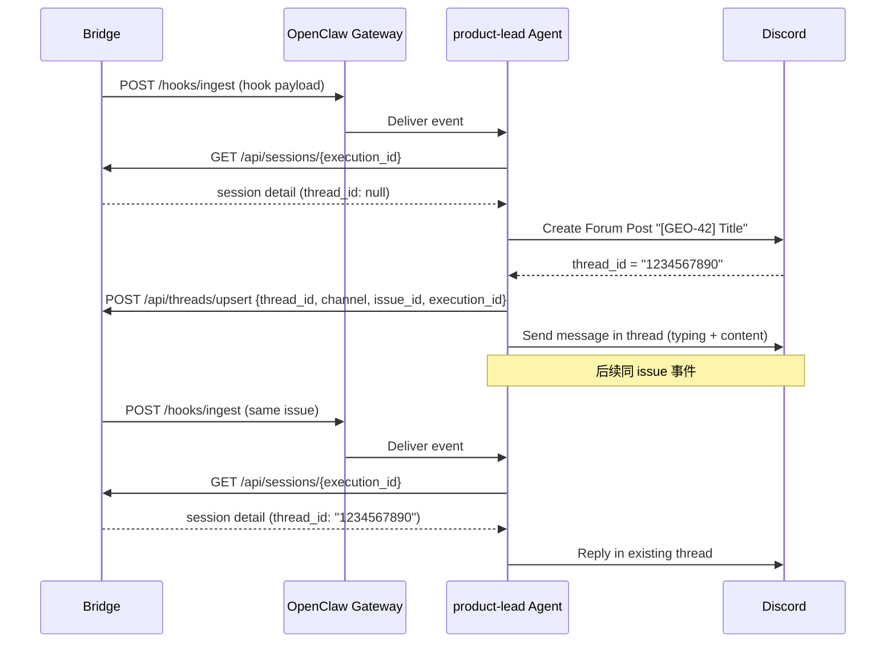
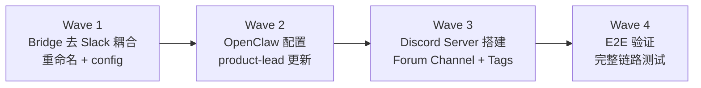

# Exploration: Slack → Discord Migration + Forum Channel Architecture — GEO-163

**Issue**: GEO-163 (Slack → Discord Migration + Forum Channel Architecture)
**Date**: 2026-03-15
**Status**: Draft

---

## 1. 问题背景

Flywheel 当前通过 OpenClaw product-lead agent 将所有通知发送到 Slack `#general`（Channel ID: `CD5QZVAP6`）。实际使用中发现 Slack 作为 AI agent 通知渠道有明显不足：

| 痛点 | 详情 |
|------|------|
| **无 typing indicator** | Bot 思考/生成时用户看不到任何反馈，不知道 bot 是在处理还是挂了 |
| **Thread 容易被埋** | Slack thread 在主频道不突出，CEO 容易漏看 |
| **单一频道模式** | 无法支持未来多 Org、多 Agent 管理场景 |
| **移动端体验差** | Slack mobile 对 thread 的处理不如 Discord |

**决策：全面迁移到 Discord，不再使用 Slack 作为 Flywheel 通知渠道。**

Discord 原生支持 typing indicator、Forum Channel（结构化 thread）、丰富的 channel 组织能力，更适合 Flywheel 工作模式。

---

## 2. 当前 Slack 耦合度分析

### 2.1 Bridge 代码 (teamlead package)

#### 硬编码 Channel ID

| 文件 | 行号 | 代码 |
|------|------|------|
| `event-route.ts` | 228 | `channel: "CD5QZVAP6"` |
| `StuckWatcher.ts` | 87 | `channel: "CD5QZVAP6"` |

两处都是在构建 `HookPayload` 时硬编码 Slack channel ID。**应从 `BridgeConfig` 读取。**

#### Slack-specific 命名

| 标识符 | 文件 | 出现次数 | 改为 |
|--------|------|----------|------|
| `slack_thread_ts` | StateStore (interface + schema + SQL) | ~12 | `thread_id` |
| `slack_thread_ts` | event-route.ts | 1 | `thread_id` |
| `slack_thread_ts` | StuckWatcher.ts | 1 | `thread_id` |
| `slack_thread_ts` | tools.ts | 4 | `thread_id` |
| `HookPayload.thread_ts` | hook-payload.ts | 1 | `thread_id` |
| `HookPayload.channel` | hook-payload.ts | 1 | 保留（platform-agnostic） |

`thread_ts` 这个命名来自 Slack 的 "thread timestamp" 概念。迁移后 Bridge 只需要一个 opaque string `thread_id`，不关心底层格式：

| 平台 | thread_id 格式 | 含义 |
|------|----------------|------|
| Slack (旧) | `1234.5678` | Parent message timestamp |
| Discord Forum | `1479341196022382622` | Forum Post / Thread snowflake ID |

#### conversation_threads 表

```sql
CREATE TABLE conversation_threads (
    thread_ts TEXT PRIMARY KEY,    -- 改为 thread_id
    channel TEXT NOT NULL,
    issue_id TEXT,
    ...
)
```

`thread_ts` 列名和 PK、相关 index 都需要迁移。SQLite `ALTER TABLE RENAME COLUMN` 从 3.25.0+ 支持。

#### API Endpoint 命名

| 当前 | 改为 | 说明 |
|------|------|------|
| `GET /api/thread/:thread_ts` | `GET /api/thread/:thread_id` | URL param 重命名 |
| `POST /api/threads/upsert` body: `{thread_ts}` | body: `{thread_id}` | Request body field |
| Response: `slack_thread_ts` | Response: `thread_id` | JSON response field |

#### 注释

| 文件 | 行号 | 当前 | 改为 |
|------|------|------|------|
| `event-route.ts` | 188 | "CEO must approve via Slack before merge" | "CEO must approve via chat before merge" |
| `tools.ts` | 68 | "if session has no slack_thread_ts" | "if session has no thread_id" |

### 2.2 Edge Worker Package

Edge worker 有更深层的 Slack 耦合，但大部分是 **Cyrus 遗留代码**（非 Flywheel 核心路径）：

| 组件 | 角色 | Flywheel 是否使用 |
|------|------|-------------------|
| `SlackAction` interface | Action 数据结构 | **是** — ActionExecutor 依赖 |
| `SlackInteractionServer` | 接收 Slack button clicks | **否** — Flywheel 通过 OpenClaw agent 处理交互 |
| `SlackChatAdapter` | 格式化 Slack thread context | **否** — 遗留组件 |
| `SlackNotifier` | 直接发 Slack 消息 | **否** — Flywheel 通过 OpenClaw 发消息 |
| `ReactionsEngine` | Action dispatch | **是** — 但只用类型签名 |
| `ApproveHandler` / `RejectHandler` / `DeferHandler` | Action 执行器 | **是** — 核心 action 逻辑 |

**关键决策**：`SlackAction` → `ChatAction` 重命名。这是跨包的 breaking change：
- edge-worker: 类型定义 + 所有 handler 签名
- teamlead: `ActionExecutor.ts` import

`SlackInteractionServer` 暂不需要改（Flywheel 不用它，但其他 Cyrus consumer 可能用）。如果要改可以标记 deprecated 并新增 `ChatInteractionServer`。

### 2.3 OpenClaw 配置

| 配置项 | 当前值 | 目标值 |
|--------|--------|--------|
| `bindings[0].match.channel` | `"slack"` | `"discord"` |
| `hooks.mappings[0].channel` | `"slack"` | `"discord"` |
| `hooks.mappings[0].to` | `"CD5QZVAP6"` | Discord Forum Channel ID (TBD) |
| `channels.slack` section | 完整 Slack 配置 | 可保留但标记不再用于 Flywheel |

### 2.4 product-lead Workspace

| 文件 | Slack 引用 | 需要改动 |
|------|-----------|----------|
| `SOUL.md` | 13 处引用 Slack/slack | 全面改为 Discord + Forum Post 行为 |
| `TOOLS.md` | 5 处引用 Slack | 更新工具名和 API 说明 |

SOUL.md 中的核心行为逻辑（thread 创建、回写、反查）不变，只是把 `slack:sendMessage` 改为 Discord 对应工具，`thread_ts` 改为 `thread_id`，channel ID 更新。

---

## 3. Discord 架构设计

### 3.1 Channel 结构

```
Discord Server: little piggy
│
├── 📂 CATEGORY: GeoForge3D
│   └── 📋 geoforge3d (Forum Channel)
│       ├── [GEO-155] Disable auto-approve       ← 每个 issue = 一个 forum post
│       ├── [GEO-160] Fix approve→merge
│       └── ...
│
├── 📂 CATEGORY: Org-2 (未来扩展)
│   └── 📋 org-2-ops (Forum Channel)
│
├── 📂 CATEGORY: Leadership
│   ├── 💬 cross-team (Text Channel)             ← Heads 之间的对话
│   └── 📋 standup (Forum Channel)               ← 每天/每周一个 standup post
│       ├── 2026-03-15 Daily Standup
│       └── ...
│
└── 🔊 Meeting Room (Voice Channel)              ← 未来 GEO-150 voice interface
```

### 3.2 Forum Channel 作为 Issue Tracker

| 特性 | 映射 |
|------|------|
| Forum Post = Issue | 标题 `[GEO-XXX] {title}` |
| Thread = 讨论 | Agent + CEO 在 thread 内对话 |
| Forum Tags | 状态标记：`reviewing`, `approved`, `blocked`, `merged`, `failed` |
| Auto-archive | 不活跃 thread 自动归档（建议 7d） |
| Overview | Forum 主页 = 所有 active issues 列表 |

**优势**：
- CEO 一眼看到所有 active issues（Forum 主页就是看板）
- 每个 issue 讨论完全隔离
- Typing indicator 在 thread 内可见（Discord 原生支持）
- Forum Tags 提供视觉状态标记
- 历史可追溯（archived threads 可搜索）

### 3.3 Thread Model 映射

Bridge 存储 `thread_id` 为 opaque string。Agent 负责：
1. 创建 Forum Post → 获得 thread snowflake ID
2. 通过 Bridge API `POST /api/threads/upsert` 回写 `thread_id`
3. 后续消息使用已存 `thread_id` 在 thread 内回复



### 3.4 OpenClaw Discord 工具

OpenClaw 内置 Discord 集成。Agent 目前在 `#ideas` channel 使用 Discord 工具。需要确认 Forum Channel 相关能力：

| 操作 | OpenClaw 工具 | 备注 |
|------|---------------|------|
| 创建 Forum Post | `discord:createForumPost` (需确认) | 或者用 `discord:sendMessage` 到 Forum Channel |
| 在 thread 内回复 | `discord:sendMessage` with threadId | 需确认参数名 |
| 管理 Forum Tags | 可能需要 Discord API 直接调用 | tags = status 标记 |
| Typing indicator | 自动支持 | Discord 原生 |

**待确认**：OpenClaw 是否已支持 Discord Forum Post 创建。如果不支持，agent 可能需要使用 `exec` 工具调用 Discord API。

---

## 4. 迁移策略

### 4.1 分波实施



**Wave 1: Bridge 代码 (teamlead + edge-worker)**
1. `slack_thread_ts` → `thread_id`（StateStore schema + interfaces + SQL + API responses）
2. `conversation_threads.thread_ts` → `thread_id`（表列重命名 + 相关查询）
3. `HookPayload.thread_ts` → `thread_id`
4. 硬编码 `CD5QZVAP6` → `BridgeConfig.notificationChannel`
5. `SlackAction` → `ChatAction`（edge-worker + teamlead）
6. API endpoint: `/api/thread/:thread_ts` → `/api/thread/:thread_id`
7. 注释更新
8. 所有相关测试更新

**Wave 2: OpenClaw 配置 + product-lead**
1. `openclaw.json`: bindings + hooks.mappings 切换到 Discord
2. `SOUL.md`: 更新所有 Slack 引用为 Discord + Forum Post
3. `TOOLS.md`: 更新工具名和 API 字段名

**Wave 3: Discord Server 搭建**
1. 创建 `GeoForge3D` Category + `geoforge3d` Forum Channel
2. 配置 Forum Tags: `reviewing`, `approved`, `blocked`, `merged`, `failed`
3. 设置 auto-archive (7d)
4. 确保 OpenClaw Bot 有 Forum Channel 权限
5. 创建 `Leadership` Category + `cross-team` Text Channel + `standup` Forum Channel

**Wave 4: E2E 验证**
1. 用 test issue 跑完整链路
2. 验证 Forum Post 创建 + thread 回复 + CEO 交互 + typing indicator
3. 验证 thread_id 回写 + 反查

### 4.2 SQLite Migration 策略

SQLite 3.25.0+ 支持 `ALTER TABLE RENAME COLUMN`，但 `sql.js` (Flywheel 用的 WASM SQLite) 版本需确认。

**安全方案**：在 `StateStore.migrate()` 中新增 migration step：

```typescript
// Migration: slack_thread_ts → thread_id
try {
    this.db.run("ALTER TABLE sessions RENAME COLUMN slack_thread_ts TO thread_id");
} catch {
    // Column might already be renamed, or doesn't exist yet
}

// Migration: conversation_threads.thread_ts → thread_id
try {
    this.db.run("ALTER TABLE conversation_threads RENAME COLUMN thread_ts TO thread_id");
} catch {
    // Already renamed
}
```

**回退方案**：如果 `RENAME COLUMN` 不支持，用 create-copy-drop-rename 四步走。

### 4.3 BridgeConfig 扩展

```typescript
export interface BridgeConfig {
    host: string;
    port: number;
    dbPath: string;
    ingestToken?: string;
    apiToken?: string;
    gatewayUrl?: string;
    hooksToken?: string;
    stuckThresholdMinutes: number;
    stuckCheckIntervalMs: number;
    notificationChannel?: string;  // NEW: replaces hardcoded CD5QZVAP6
}
```

---

## 5. 设计决策

### 5.1 重命名范围

| 决策 | 选择 | 理由 |
|------|------|------|
| `slack_thread_ts` → ? | `thread_id` | 语义明确，platform-agnostic，且比 `thread_ts` 更准确（Discord 不是 timestamp） |
| `SlackAction` → ? | `ChatAction` | 通用且明确。`PlatformAction` 太抽象，`Action` 太泛 |
| `thread_ts` (DB column) → ? | `thread_id` | 与 session 字段保持一致 |
| `SlackInteractionServer` → ? | **暂不改** | Flywheel 不使用，改动无收益。未来如果其他项目需要可以新增 `DiscordInteractionServer` |

### 5.2 向后兼容

| 考虑 | 处理 |
|------|------|
| 已有 SQLite 数据 | `RENAME COLUMN` 保留数据，PK/index 自动跟随 |
| API 消费者 | product-lead agent 是唯一消费者，SOUL.md/TOOLS.md 同步更新即可 |
| 并行运行 | 不需要。迁移是一次性 cutover，不需要同时支持两个平台 |

### 5.3 Forum Post 创建者

**选择：Agent 创建 Forum Post**（非 Bridge 直接发 Discord）

- Agent 已经是 Discord 用户（OpenClaw Bot）
- Agent 有 thread 上下文和消息格式控制
- Bridge 只负责存储和传递 `thread_id`，不直接与 Discord 通信
- 与当前 Slack 模式一致（Agent 创建 parent message → 回写 thread state）

---

## 6. 风险和开放问题

### 6.1 风险

| 风险 | 影响 | 缓解 |
|------|------|------|
| OpenClaw 不支持 Forum Post 创建 | 阻塞 Wave 2 | Agent 可用 `exec` 工具调 Discord API；或在 OpenClaw 侧添加支持 |
| `sql.js` WASM 不支持 `RENAME COLUMN` | 需要更复杂的 migration | 预先测试；准备 create-copy-drop-rename 回退方案 |
| Discord rate limit | Forum Post 创建频率受限 | Flywheel 并发度低（~4 sessions），不太可能触发 |
| Forum Tags 管理需要额外权限 | Bot 可能无法自动管理 tags | 手动创建 tags，agent 只设置已有的 tag |

### 6.2 开放问题

1. **OpenClaw Forum Channel 支持**：需要测试 OpenClaw Bot 是否能在 Forum Channel 创建 post。当前 `#ideas` channel (`1479341196022382622`) 的使用经验是 text channel + 手动 thread。
2. **Discord Forum Channel ID**：需要先创建 Forum Channel 才能获取 ID，填入配置。这是 Wave 3 的前置。
3. **Forum Tags API**：Discord API 支持 `available_tags` 和 `applied_tags`，但 OpenClaw 的 Discord 集成是否暴露了 tag 管理能力？
4. **已有 Slack Thread 数据**：现有 SQLite 中的 `slack_thread_ts` 值（Slack timestamp 格式）在迁移后语义失效。不需要清理，但也无法继续使用。新的 Discord thread_id 会从头开始。
5. **Slack 回退**：迁移后是否保留 Slack channel 作为备用？建议不保留 — 单一渠道避免混乱。

---

## 7. 非目标 (Out of Scope)

- **SlackInteractionServer 重构**：Cyrus 遗留组件，Flywheel 不使用
- **SlackChatAdapter / SlackNotifier 迁移**：同上
- **Multi-agent / Multi-org 实际部署**：本次只搭建 channel 结构框架，不实现多 agent 路由
- **Voice Channel 集成**：归属 GEO-150
- **Bot 权限精细化**：初期给 admin 权限，后续收紧

---

## 8. 总结

| 维度 | 评估 |
|------|------|
| **改动范围** | 中等 — 主要是重命名 + config，核心逻辑不变 |
| **风险** | 低 — 一次性 cutover，无需双平台并行 |
| **价值** | 高 — typing indicator + Forum 看板 + 为多 Org 铺路 |
| **依赖** | OpenClaw Forum Channel 支持需确认 |
| **预估 Waves** | 4 waves，Wave 1 最大（代码改动），Wave 2-4 配置 + 验证 |
