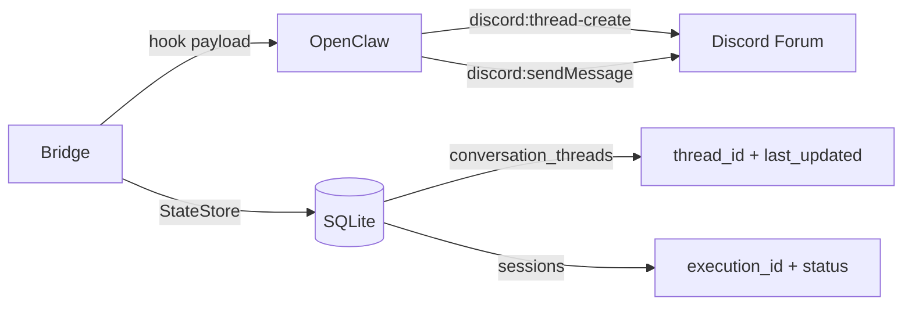
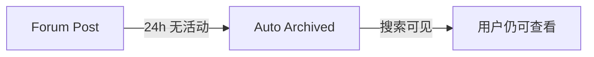
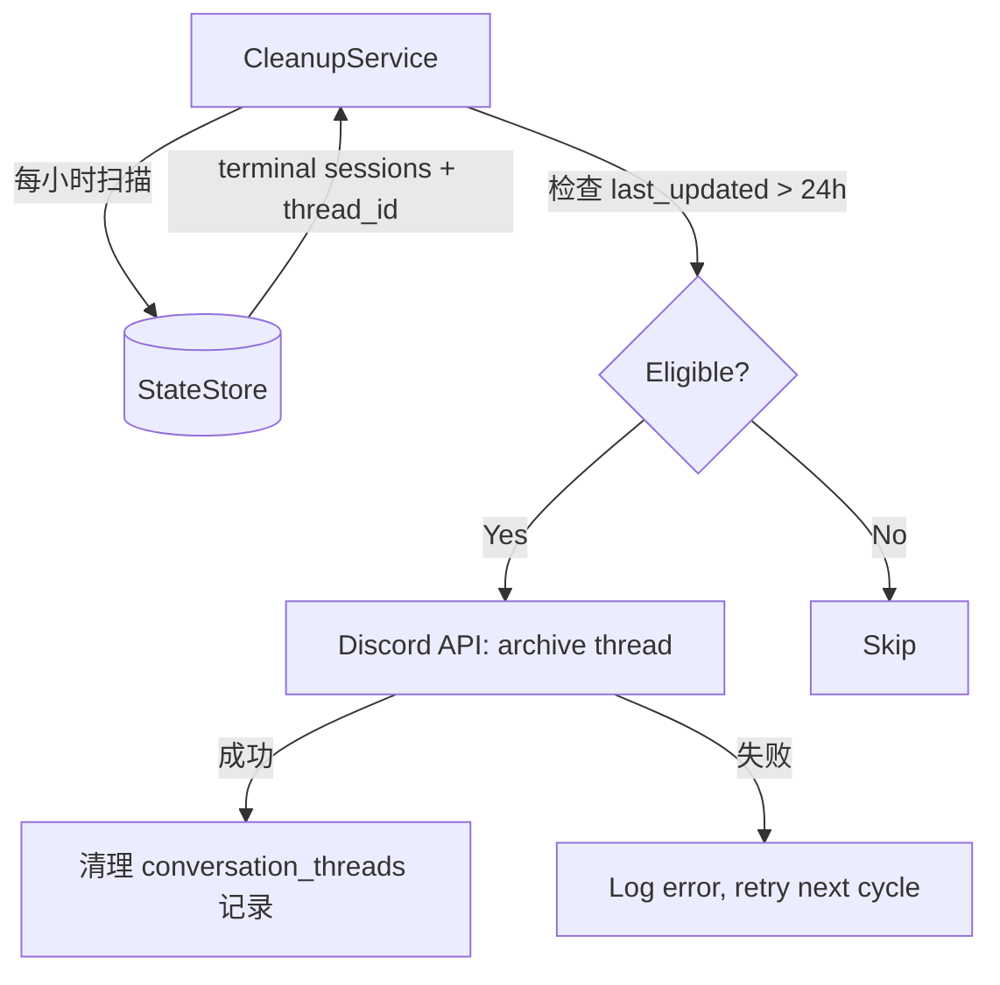
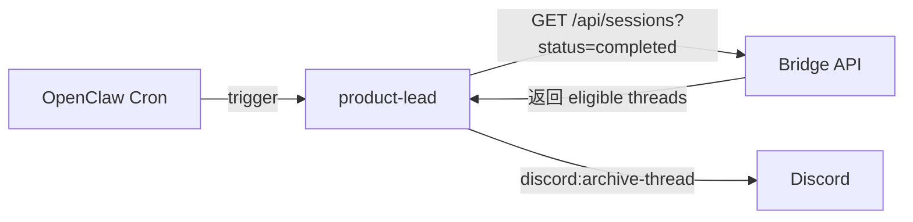

# Exploration: Completed Forum Post 24h 自动归档/清理 — GEO-169

**Issue**: GEO-169 (Completed Forum Post 24h 自动归档/清理)
**Date**: 2026-03-15
**Status**: Complete

## Problem

Discord Forum Channel (`1482925814533329049`) 中，`completed` / `failed` 状态的帖子会一直停留在默认视图里。随着时间推移，Forum 列表变得杂乱，CEO 需要手动区分"还在进行中"和"已经完成"的帖子。

**CEO 需求**: completed 状态的帖子在 24h 后自动消失（不需要手动清理）。

## Current Architecture

### 数据流



### 关键数据

| 表 | 字段 | 用途 |
|----|------|------|
| `sessions` | `status`, `last_activity_at` | 执行状态（running/completed/failed 等） |
| `conversation_threads` | `thread_id`, `issue_id`, `last_updated` | Discord 帖子 ↔ Issue 映射 |

### 现有定时任务: HeartbeatService

```
HeartbeatService
├── setInterval(check, intervalMs)    // 默认 60s
├── checkStuck() → 通知 stuck sessions
└── reapOrphans() → force-fail 超时 orphan sessions
```

**模式**: 周期扫描 → 阈值判断 → 执行动作 → dedup。可直接复用。

### Forum Tags (已创建)

| Tag | ID | 对应 Status |
|-----|----|------------|
| `in-progress` | `1482926857581232310` | running |
| `awaiting-review` | `1482927658454089912` | awaiting_review |
| `blocked` | `1482929080629329941` | blocked |
| `completed` | `1482929593001181214` | completed, approved |
| `failed` | `1482930162491330783` | failed |

## Options

### Option A: Discord Auto-Archive (零代码)

Discord Forum 内置 `default_auto_archive_duration`（1h/24h/3d/7d）。设为 24h 后，**不活跃**的帖子自动归档。



**优点**:
- 零代码，一条 API 调用即可启用
- Discord 原生行为，用户熟悉

**缺点**:
- 基于"不活跃"而非 status——in-progress 但暂时无消息的帖子也会被 archive
- 无法区分 completed 和 blocked（都可能 24h 无活动）
- CEO 查看 archived posts 需要额外操作（切换 filter）

**结论**: 作为兜底层不错，但**不能作为主方案**，因为粒度不够。

### Option B: Bridge CleanupService (精确控制)

在 Bridge 新增 `CleanupService`，复用 HeartbeatService 模式：



**查询逻辑**:
```sql
SELECT ct.thread_id, ct.issue_id, s.status, ct.last_updated
FROM conversation_threads ct
JOIN sessions s ON s.issue_id = ct.issue_id
WHERE s.status IN ('completed', 'approved', 'failed', 'rejected', 'deferred', 'shelved')
  AND ct.last_updated < datetime('now', '-24 hours')
  AND ct.thread_id IS NOT NULL
```

**动作选择**:

| 动作 | API | 效果 | 可恢复 |
|------|-----|------|--------|
| Archive | `PATCH /channels/:id {archived: true}` | 隐藏，可搜索 | Yes |
| Lock + Archive | `PATCH /channels/:id {archived: true, locked: true}` | 隐藏 + 禁止回复 | Yes |
| Delete | `DELETE /channels/:id` | 永久删除 | No |

**推荐 Archive + Lock**:
- Archive 让帖子从默认视图消失（满足 CEO 需求）
- Lock 防止意外在 archived thread 里继续回复
- 可恢复（CEO 随时可以 unarchive 查看历史）
- StateStore 记录保留（仅标记 `archived_at`），方便审计

**优点**:
- 精确基于 status + 时间双重条件
- 复用 HeartbeatService 模式，代码量小
- 可配置（阈值、要清理的 status 列表、动作类型）
- 有审计日志

**缺点**:
- 需要 Bridge 持有 Discord Bot Token（或通过 OpenClaw agent 间接调用）
- 新增 ~100-150 LOC

### Option C: Agent 驱动清理 (OpenClaw Scheduled Task)

让 product-lead agent 自己清理：通过 OpenClaw scheduled task，agent 定期查询 Bridge API 并调用 Discord 工具。



**优点**:
- Agent 有 Discord 权限，不需要 Bridge 直接调 Discord API
- Agent 可以在 archive 前发最后一条消息（"此帖子已自动归档"）

**缺点**:
- OpenClaw 目前没有 cron/scheduled task 功能
- Agent 可能"创造性"地处理（幻觉风险）
- 多一层间接调用，调试难度增加
- 依赖 agent 在线且正常（不如确定性代码可靠）

## Recommendation

**Option B: Bridge CleanupService**

理由:
1. **精确性**: 基于 `status` + `last_updated` 双重条件，不会误 archive in-progress 帖子
2. **可靠性**: 确定性代码，不依赖 LLM agent 在线
3. **一致性**: 与 HeartbeatService 同样的模式，维护成本低
4. **可恢复**: Archive + Lock 而非 Delete，CEO 随时可以回看

**补充**: 同时启用 Discord Auto-Archive 24h 作为兜底——即使 CleanupService 挂了，帖子也会在不活跃 24h 后被 Discord 自动 archive。

## Implementation Sketch

### 新增文件
- `packages/teamlead/src/CleanupService.ts` — 主逻辑
- `packages/teamlead/src/__tests__/CleanupService.test.ts` — 测试

### Schema 变更
- `conversation_threads` 新增 `archived_at TEXT` 列

### StateStore 新增方法
- `getEligibleForCleanup(thresholdMinutes: number): CleanupCandidate[]`
- `markArchived(threadId: string): void`

### 配置
```typescript
interface CleanupConfig {
  intervalMs: number;          // 扫描间隔，默认 3600_000 (1h)
  thresholdMinutes: number;    // 清理阈值，默认 1440 (24h)
  terminalStatuses: string[];  // 要清理的 status 列表
  action: 'archive' | 'delete'; // 动作类型，默认 archive
  dryRun: boolean;             // 试运行模式
}
```

### Discord API 调用
Bridge 需要 Discord Bot Token 来调 archive API。两种方案:
1. **Bridge 直接调 Discord API** — 最简单，Bridge 加 `DISCORD_BOT_TOKEN` env var
2. **通过 OpenClaw agent 中转** — Bridge 发 hook 请求 agent archive，但增加复杂度

推荐方案 1（Bridge 直接调），因为 archive 是确定性操作，不需要 LLM 参与。

### 初始化
在 Bridge 启动时（`server.ts`）初始化 CleanupService，与 HeartbeatService 并列:
```typescript
const cleanupService = new CleanupService(store, discordClient, config);
cleanupService.start();
```

## Open Questions

1. **Bot Token 获取**: Bridge 目前不持有 Discord Bot Token。需要从 OpenClaw config 中获取，或单独配置 env var。
2. **failed 帖子是否也清理**: CEO 可能想保留 failed 帖子更久（用于复盘）。建议 failed 用 72h 阈值。
3. **Archive 前是否通知**: 是否需要在帖子里发一条 "此帖子将在 X 分钟后归档" 的消息？
4. **last_updated 准确性**: 当前 `conversation_threads.last_updated` 是否在每次 status change 时更新？需要验证。

## Scope

- **In scope**: CleanupService + StateStore changes + Discord archive API + 测试
- **Out of scope**: Runtime tag 更新 (GEO-167)、retry requeue (GEO-168)、multi-channel (GEO-170)
- **Dependencies**: 无硬依赖。Bot Token 可作为 env var 配置。
