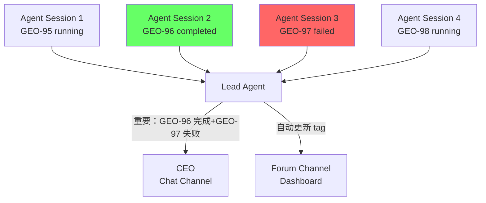
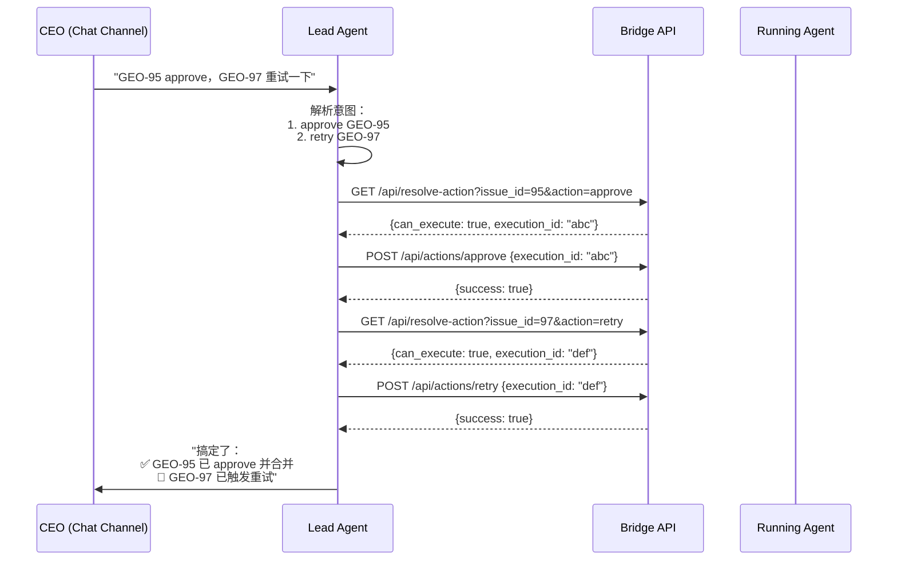
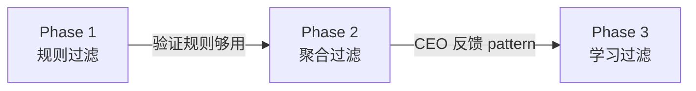
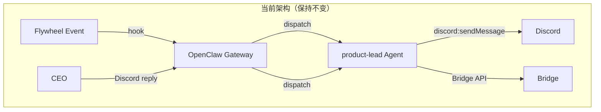
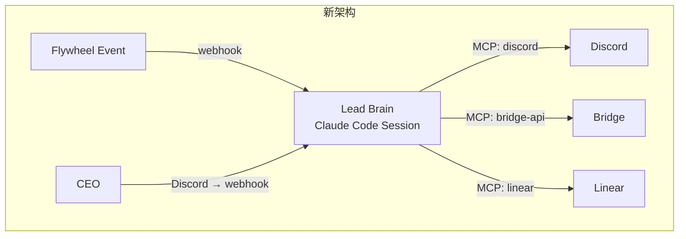
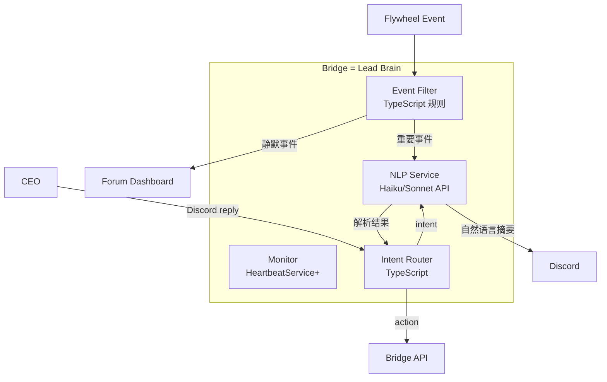
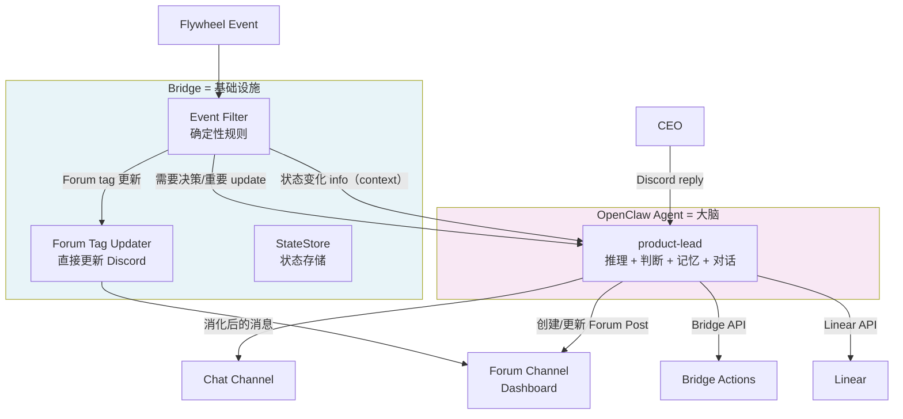

# Exploration: Lead Agent Behavior Design — GEO-187

**Issue**: GEO-187 (Lead Agent Behavior Design — bubble up/down, monitoring, chat interaction)
**Date**: 2026-03-18
**Depth**: Deep
**Mode**: Both (Product + Technical)
**Status**: final
**Depends On**: GEO-152 (multi-lead infra, PR #34)

---

## 0. Product Research

### Problem Statement

CEO 管理 N 个并发运行的 AI coding agent，需要一个 "team lead" 层来做信息过滤和决策中继。当前系统（v1.0 Phase 1）有一个 product-lead agent 可以发 Discord 通知、执行 approve 等 action，但它本质上是一个 **通知管道**（event → 转发 → 等指令），不是一个 **有判断力的 team lead**。

**Struggling moment**: CEO 打开 Discord 看到 15 条通知，3 条需要决策，5 条是例行更新，7 条是不需要关注的中间状态。CEO 需要自己做过滤和优先级判断——这应该是 Lead 的工作。

### Target User

- **Annie (CEO)**: 唯一的人类用户。通过 Discord 与 N 个 Lead agent 交互。
- **成功标准**: 感觉像在和真人 team lead 对话——Lead 有自己的判断、会主动提建议、不废话、有上下文记忆。

### Scope Frame

- **Appetite**: L (Large)——这是一个行为设计 + 架构选型问题，不是简单的功能添加
- **Essential core (Phase 1)**: Lead 能智能过滤通知、消化信息后用自己的话表达、CEO 回复后正确路由到 action
- **Nice to haves**: 日报/早报、跨 team standup、自主 approve 小改动、主动建议拆分 issue
- **Explicitly deferred**: 跨 Lead 协调、自主权演进（CIPHER 已 merge，学习机制已就绪——GEO-149 PR #22）

### Competitive Landscape

| Alternative | Approach | Strength | Weakness |
|-------------|----------|----------|----------|
| Status quo (Bridge 通知管道) | 每个事件都转发给 CEO | 简单、可靠、无遗漏 | CEO 信息过载，无智能过滤 |
| GitHub Copilot Agent | Single-agent code assistant | 成熟、集成好 | 无 team 概念，无多 agent 协调 |
| Devin | 自主 dev agent | 端到端自主 | 无 team lead 抽象，单打独斗 |
| Claude Code Agent Teams | 多 Claude 实例协作 | 原生 Claude 生态 | 实验性（v2.1.32 preview），无 session 恢复 |
| CrewAI / AutoGen | Multi-agent 框架 | 成熟框架，多角色支持 | 太 generic，需要大量定制 |
| Hierarchical orchestrator pattern | Lead agent 分解任务给 worker agents | 业界验证，90%+ 性能提升 | 需要自建，无现成方案 |

**Key insight**: 业界趋势是 hierarchical orchestration——一个不直接干活的 "project manager" agent 负责分解和路由任务。这正是我们要做的事情。

---

## 1. Lead 行为模型

### 1.1 Bubble UP: Agent → Lead → CEO

Lead 监控 N 个正在运行的 agent session，决定什么值得汇报给 CEO。



**过滤逻辑（按优先级）**:

| 事件类型 | 默认行为 | 可配 |
|----------|----------|------|
| `session_failed` | **必报** — 在 Chat 通知 CEO | - |
| `session_completed` (需 review) | **必报** — 在 Chat 通知 + 建议 action | - |
| `session_stuck` | **必报** — 在 Chat 提醒 | 可调阈值 |
| `session_started` | **静默** — 只更新 Forum dashboard | 可开启通知 |
| `session_completed` (auto_approve) | **静默** — 只更新 Forum | 可开启通知 |
| Heartbeat (无变化) | **静默** — 不做任何事 | - |

**消化 vs 转发**:

Lead 不是原样转发 event JSON，而是消化后用自己的话表达：

```
❌ 转发: "session_completed: execution_id=abc, status=awaiting_review, commits=3, lines_added=120, lines_removed=45"
✅ 消化: "GEO-95 做完了。3 个 commit，改了 120 行。主要是优化了首页加载。我看了下 diff，改动不大，建议 approve。"
```

### 1.2 Bubble DOWN: CEO → Lead → Action

CEO 在 Chat Channel 给出指令，Lead 解析意图并执行。



**复杂指令场景**:

| CEO 说的 | Lead 理解 | Lead 执行 |
|----------|-----------|-----------|
| "approve" | 当前 thread 的 issue → approve | 调 resolve-action → approve |
| "这个先不看，放一下" | defer | 调 resolve-action → defer |
| "全部 approve" | 所有 awaiting_review → approve | 逐个 resolve-action → 批量 approve |
| "GEO-95 那个 migration 能不能晚上再部署" | 这不是 Bridge action，是对话 | 回复信息，记住偏好 |
| "帮我看看 GEO-97 的 diff" | 需要代码查看工具 | Phase 2 (需 GitHub tool) |
| "这类 bug fix 以后自动 approve" | CIPHER 学习 pattern | Phase 3+ |

### 1.3 Forum Management (Dashboard)

Forum Channel 是自动化 dashboard，不需要 CEO 主动交互：

```
📋 Product Forum
├─ [GEO-95] 优化首页加载速度          [awaiting-review]
├─ [GEO-96] 添加 OAuth 支持           [completed] ✅
├─ [GEO-97] 暗黑模式                  [failed] ❌
├─ [GEO-98] 重构认证模块              [in-progress] 🔄
└─ [GEO-99] API 性能优化              [in-progress] 🔄
```

每个 Forum Post = 一个 issue thread，tag 自动更新。这部分基本已实现。

### 1.4 Smart Filtering — Evolution Path



| Phase | 过滤方式 | 示例 |
|-------|----------|------|
| **1. 规则过滤** | 硬编码优先级表 | Failed/completed 必报，started 静默 |
| **2. 聚合过滤** | 合并同类事件 | "3 个 session 完成了（GEO-95/96/99），2 个需要你 review" |
| **3. 学习过滤** | 从 CEO 行为学习 | CEO 总是立刻 approve bug fix → 下次自动 approve |

---

## 2. Architecture Options

核心问题：**Lead 的 "智能" 住在哪里？**

### Option A: "Smart Prompt" — 迭代 OpenClaw Agent

保持现有架构，通过增强 SOUL.md prompt + 增加 tools 来实现 Lead 行为。



**What changes:**
- SOUL.md 大幅重写：从 "通知机器人" 升级为 "team lead 角色"
- 新增 tools：批量 session 查询、趋势检测、diff 预览
- HEARTBEAT.md 增强：从 "stuck check" 到 "主动监控 + 日报"
- MEMORY.md 结构化：记住 CEO 偏好和决策 pattern
- Filtering 靠 prompt 实现（在 SOUL.md 里定义过滤规则）

**Pros:**
- ✅ 改动最小，增量迭代
- ✅ OpenClaw 的 persistent memory 天然支持
- ✅ 多 agent 支持现成（每个 Lead = 一个 agent workspace）
- ✅ Discord 集成已验证（thread-create, sendMessage, tags）
- ✅ session/hook 基础设施已完善

**Cons:**
- ❌ 所有行为靠 prompt engineering，不可测、不可预测
- ❌ Per-turn 模型：agent 不能主动监控，只能被动响应
- ❌ 过滤逻辑在 LLM 里，不稳定（可能有时过滤有时不过滤）
- ❌ OpenClaw 是不完全可控的依赖——debug 困难
- ❌ Annie 已表达 concern："东西太多了"

**Effort**: S (Small)
**Risk**: Medium — prompt 驱动的行为可能不够稳定

---

### Option B: "Agent Brain" — 持久 Claude Code Session 作为 Lead

用一个长期运行的 Claude Code session（tmux 里）替代 OpenClaw agent。



**What changes:**
- 新建 `LeadAgent` 组件，管理 Claude Code persistent session
- MCP servers: Bridge API, Discord, Linear, GitHub
- Session 生命周期管理（timeout、crash recovery、context pruning）
- Discord bot integration（接收 CEO 消息 → 注入 session）
- 移除 OpenClaw 依赖

**Pros:**
- ✅ 完全自主控制——行为由 system prompt + MCP tools 定义
- ✅ 持久上下文——session 内可以关联多个事件
- ✅ Claude Code 原生生态（MCP、agent teams、hooks）
- ✅ Observable（tmux 可以 peek）
- ✅ 未来可用 agent teams 做多 Lead 并行

**Cons:**
- ❌ Context window 会满（需要 pruning 策略）
- ❌ Session timeout/crash recovery 无成熟方案
- ❌ Agent teams 还是实验性功能（v2.1.32 preview），session resumption 有已知问题
- ❌ 需要自建 Discord bot integration
- ❌ 架构变动大，开发周期长
- ❌ Per-session cost（虽然有 subscription）

**Effort**: L (Large)
**Risk**: High — 新架构 + 实验性功能

---

### Option C: "Orchestrated Intelligence" — Bridge 做大脑，LLM 做嘴

Bridge（TypeScript）成为 Lead 的 "大脑"——处理过滤、路由、监控、调度。LLM（Haiku/Sonnet）仅用于 NLP 任务（摘要、意图解析、自然语言回复）。



**What changes:**
- Bridge 新增 `LeadIntelligence` 模块：过滤规则引擎、事件聚合、调度
- 新增 LLM service：Haiku for triage/routing，Sonnet for complex conversation
- Discord integration 完全移入 Bridge（不经 OpenClaw）
- 确定性路由 + 可测试的逻辑

**Pros:**
- ✅ 最可控、最可测试——过滤逻辑是 TypeScript，有 unit tests
- ✅ 确定性路由——不依赖 LLM 的不确定行为
- ✅ 成本低——Haiku for triage 很便宜
- ✅ 无外部依赖——不需要 OpenClaw
- ✅ Debug 容易——全在我们代码里

**Cons:**
- ❌ 失去 "对话 team lead" 的魔力——CEO 感觉在和 "系统" 对话
- ❌ 代码量大——每个行为都要手写逻辑
- ❌ 对话质量取决于 per-call LLM，没有 persistent context
- ❌ 每次交互都是独立的 LLM call，缺乏跨对话记忆
- ❌ 扩展新行为需要写代码，不能靠 prompt 快速迭代

**Effort**: M (Medium)
**Risk**: Medium — 成熟技术，但工程量不小

---

### Option D: "Smart Infrastructure" — Bridge 做基础设施 + OpenClaw Agent 做大脑 (Recommended)

Bridge 是 **基础设施层**——负责确定性逻辑（事件过滤、Forum tag 更新、状态存储、路由）。OpenClaw Agent 是 **大脑**——负责需要智能的事情（理解 CEO 意图、消化信息、做判断、执行 action、记忆）。



**What changes:**
- Bridge 新增 Event Filter：确定性过滤规则（TypeScript，可测试）
  - 每个事件经过 filter → 标记为 `notify_agent` / `update_forum_only` / `skip`
  - Filter 规则可配置（per-Lead, per-project）
  - 过滤后的事件仍携带完整上下文（包括状态变化信息），Agent 能看到全貌
- Bridge 新增 Event Aggregator：合并近期事件
  - "过去 10 分钟有 3 个 session completed" → 合并为一条通知
  - 避免连续 3 条 "GEO-xx 完成了" 的 spam
- Bridge 直接做 Forum tag 更新：不经 agent roundtrip
  - 更快更可靠
  - Agent 仍被告知状态变化（作为 hook payload 的一部分），保持上下文
- OpenClaw Agent SOUL.md 升级：从 "通知机器人" 到 "team lead 大脑"
  - 不再处理 Forum tag 等确定性任务
  - 专注：信息消化、CEO 对话、判断、action 执行、记忆、建议
  - 新增 tools：Linear API（创建/修改 issue、调优先级）、执行 context 修改
- 日报/早报：不在 GEO-187 范围内（后续 issue）

**Pros:**
- ✅ 关注点分离：基础设施确定性逻辑 vs Agent 智能判断
- ✅ 过滤逻辑可测试、可预测（TypeScript 规则引擎）
- ✅ Agent 是真正的大脑——有推理、记忆、判断力
- ✅ Forum tag 更新更快更可靠（不经 agent roundtrip）
- ✅ Agent 仍有完整上下文（status change info 在 hook payload 里）
- ✅ 减少对 OpenClaw 的依赖面（关键基础设施在 Bridge）
- ✅ Aggregation 天然解决 spam 问题

**Cons:**
- ❌ 两层架构需要清晰的接口定义
- ❌ Bridge 的过滤规则需要维护
- ❌ Agent 仍是 OpenClaw 依赖（但依赖面减小）

**Effort**: M (Medium) — Bridge 侧加 filter + tag updater，Agent 侧升级 SOUL.md
**Risk**: Low-Medium — 增量改进，不改变基础架构

---

### Options Comparison Summary

| 维度 | A: Smart Prompt | B: Claude Code | C: Bridge Brain | D: Smart Pipeline |
|------|----------------|----------------|-----------------|-------------------|
| **过滤可靠性** | ❌ LLM 不稳定 | ⚠️ 需要 prompt | ✅ TypeScript 规则 | ✅ TypeScript 规则 |
| **对话体验** | ✅ Agent 原生 | ✅ Claude 原生 | ❌ Per-call LLM | ✅ Agent 原生 |
| **可测试性** | ❌ Prompt 不可测 | ⚠️ 部分可测 | ✅ 全可测 | ✅ 过滤可测 + 对话靠 agent |
| **持久记忆** | ✅ OpenClaw memory | ⚠️ Session 内 | ❌ 无 | ✅ OpenClaw memory |
| **开发量** | S | L | M | M |
| **风险** | Medium | High | Medium | Low-Medium |
| **可替换性** | ❌ OpenClaw 锁定 | ✅ 完全自主 | ✅ 完全自主 | ⚠️ Agent 可替换 |
| **Spam 控制** | ❌ 靠 prompt | ❌ 靠 prompt | ✅ 代码控制 | ✅ Aggregator |

### Recommendation: Option D — "Smart Pipeline"

**理由**:

1. **关注点分离最清晰**: 确定性逻辑（过滤、路由、聚合）属于代码，不确定性判断（对话、摘要）属于 LLM。混在一起是反模式。
2. **最可测试**: 过滤规则有 unit tests，对话质量靠 agent 评估——两个独立的质量保证。
3. **最低风险**: 不改变基础架构，在现有系统上增量添加。OpenClaw agent 已证明可用。
4. **未来灵活性**: Bridge 是大脑，agent 是嘴。如果未来想换成 Claude Code session 或其他平台，只需替换 "嘴"，"大脑" 不变。
5. **解决 Annie 的两个 concern**: 不过度依赖 OpenClaw（关键逻辑在 Bridge），也不失去对话体验（agent 仍在）。

---

## 3. Affected Files and Services

| File/Service | Impact | Notes |
|-------------|--------|-------|
| `packages/teamlead/src/bridge/event-route.ts` | Modify | 添加 Event Filter 调用，替代直接 hook |
| `packages/teamlead/src/bridge/EventFilter.ts` | **New** | 过滤规则引擎 |
| `packages/teamlead/src/bridge/EventAggregator.ts` | **New** | 事件聚合器 |
| `packages/teamlead/src/bridge/ReportScheduler.ts` | **New** | 日报/早报 cron |
| `packages/teamlead/src/bridge/hook-payload.ts` | Modify | 支持 pre-processed payload |
| `packages/teamlead/src/HeartbeatService.ts` | Modify | 配合 filter 做 smart monitoring |
| `packages/teamlead/src/bridge/actions.ts` | Minor | 可能添加 batch action 支持 |
| `packages/teamlead/src/bridge/types.ts` | Modify | 新增 FilterResult, AggregatedEvent types |
| OpenClaw `product-lead/SOUL.md` | Rewrite | 简化为 "对话专家"，不再做过滤 |
| OpenClaw `product-lead/TOOLS.md` | Update | 可能添加新 Bridge API endpoints |
| Forum tag 更新 | Move to Bridge | 不再经 agent roundtrip |

## 4. Architecture Constraints

- **GEO-152 依赖**: 多 Lead 路由（labels, dual channels）必须先完成
- **OpenClaw hook format**: Filter 输出仍需符合 OpenClaw `/hooks/ingest` 格式
- **Discord rate limits**: Aggregator 需考虑 Discord API 频率限制
- **Backward compatibility**: Filter 需支持 "pass-through" 模式，可逐步迁移
- **Bridge 已有 HeartbeatService**: 不需要从零建 monitoring，增强现有即可

## 5. External Research

### Industry Practices

- **Hierarchical orchestration** 是 2026 年多 agent 系统的主流模式：一个不直接干活的 "coordinator" agent 负责分解和路由任务（[Deloitte](https://www.deloitte.com/us/en/insights/industry/technology/technology-media-and-telecom-predictions/2026/ai-agent-orchestration.html), [Azure](https://learn.microsoft.com/en-us/azure/architecture/ai-ml/guide/ai-agent-design-patterns)）
- Multi-agent 系统在内部评估中比 single-agent 提升 90%+ 性能（[Codebridge](https://www.codebridge.tech/articles/mastering-multi-agent-orchestration-coordination-is-the-new-scale-frontier)）
- Claude Code Agent Teams（v2.1.32 preview）已支持 shared task list + mailbox，但 session resumption 仍有已知限制（[Claude Code Docs](https://code.claude.com/docs/en/agent-teams)）
- OpenAI guide 建议："Most business agents need mechanisms to escalate complex decisions... the ability to seamlessly involve humans when needed is what makes agents reliable enough for high-stakes processes"

### Current OpenClaw Agent Capabilities (Verified)

| Capability | Status | Notes |
|------------|--------|-------|
| Hook event 接收 | ✅ | 202 async dispatch, non-blocking |
| Discord thread-create | ✅ | Forum Post + tags |
| Discord sendMessage | ✅ | Thread reply support |
| Bridge API 查询 | ✅ | sessions, threads, resolve-action |
| Bridge actions | ✅ | approve (Phase 1) |
| Forum tag 更新 | ✅ | via Bridge `/api/forum-tag` |
| Persistent memory | ✅ | MEMORY.md, per-agent |
| Heartbeat | ✅ | Periodic wake, stuck check |
| Multi-agent | ⚠️ | 每个 agent 独立 workspace，但无 inter-agent 通信 |
| CEO reply handling | ✅ | Discord → OpenClaw → agent turn |

---

## 6. Clarifying Questions

### Scope

**Q1**: 过滤策略 — 你希望 Lead 默认 **通知一切** 然后你忽略不重要的？还是 Lead 默认 **安静**，只在重要时打扰你？

> 第一种更安全（不遗漏），第二种更省心（不 spam）。这影响 Phase 1 的默认过滤规则。

### Interaction Model

**Q2**: Bubble down 的复杂度 — 当你在 Chat 说 "这个用不同的方法试试"，你期望 Lead 做什么？

- a) 只能告诉你 "我目前只支持 approve/reject/defer/retry"
- b) 能把你的指令转化为新的 issue context（修改下次执行的 prompt/approach）
- c) 能直接创建新 issue 或修改现有 issue 的描述

> 这决定了 Lead 需要什么级别的 tool access。

### Intelligence

**Q3**: Forum tag 更新现在是 agent 做的（收到 hook → agent → Bridge API → Discord）。如果改成 Bridge 直接做（不经 agent），你觉得可以吗？

> 这样更快更可靠，但 agent 失去了 "看到更新" 的上下文。

### Platform

**Q4**: 你对 OpenClaw 的主要 concern 是什么？

- a) 太复杂/功能太多，不知道在用什么
- b) 不够可控/难以 debug
- c) 担心 vendor lock-in
- d) 性能/可靠性问题
- e) 其他

> 这帮助我决定 Option D 里 Bridge 和 Agent 的责任边界。

### Priority

**Q5**: 日报/早报功能对你有多重要？

- a) Phase 1 必须有
- b) Nice to have，Phase 2
- c) 不需要，Chat Channel 通知够了

---

## 7. User Decisions

### 架构方向
**选定 Option D: "Smart Infrastructure"** — Bridge 做基础设施（过滤、tag 更新、状态存储），OpenClaw Agent 做大脑（推理、判断、对话、记忆）。

### Q&A 记录

| # | 问题 | 决定 |
|---|------|------|
| Q1 | 过滤策略 | **A+B 中间**：Forum 做所有状态更新（dashboard），Chat 只推需要决策 + 重要 update。参考 Agent Teams 的 lead 只在需要 synthesize 或 blocker 时 surface。 |
| Q2 | Bubble down 复杂度 | **B + Linear 操作**：能修改执行 context（approach），也能创建/修改 issue、调优先级。PR 改动仍由 subagent 做。 |
| Q3 | Forum tag 更新 | **Bridge 直接做**，不经 agent。但 agent 仍在 hook payload 中收到状态变化信息，保持上下文。 |
| Q4 | OpenClaw concerns | (a) 太复杂 (d) 性能/可靠性/安全性 + 可能需要改源码但难以 contribute back。务实路线：用 OpenClaw 但减少依赖面。 |
| Q5 | 日报/早报 | **不在 GEO-187 范围**，后续 issue。 |
| Q6 | Lead 人格 | **部门负责人**，不是 EM。每个 Lead 的人格根据部门定制（Product Lead 管 engineer+PM+designer，Ops Lead 可能无 engineer）。非常 hands-on（进度追踪、PR 判断、行动计划），但不亲自改代码。 |
| Q7 | Lead-CEO 关系 | **渐进式**：Phase 1 = B（助手），演进到 C（partner），最终 D（独立决策者）。CIPHER 已 merge（GEO-149），学习机制就绪可推动演进。GEO-187 scope = Phase B。 |
| Q8 | 监控模式 | **A+B**：Sub-agents 主动汇报（event-driven）+ Lead 定期巡检（heartbeat）。对齐 Agent Teams 模式。基础设施已存在。 |
| Q9 | 双 Channel 交互 | **B（Chat 引用 Forum）**：Chat 里简短提一嘴 + Forum 链接，不赘述。CEO 大多数时候不会点进 Forum 看。 |
| Q10 | 能力边界 | **a（诚实说不能）**：不装能，不承诺未来，直接告知做不到。 |

### 关键产品定义

**Lead 是什么**：
- 部门负责人级别，hands-on 但不亲自写代码
- 每个 Lead 有独立的人格和专业领域（per-department SOUL.md）
- Phase 1 以助手姿态为主，通过 CIPHER 逐步演进到 partner/独立决策者

**Lead 做什么**：
- 收到 sub-agent 事件通知 + 定期巡检 → 消化信息 → 在 Chat 推重要内容（带 Forum 链接）
- CEO 回复 → 解析意图 → 执行 action / 修改执行 context / Linear 操作
- 做不到的事情诚实说不能

**Lead 不做什么**：
- 不亲自改代码（subagent 的事）
- 不做 Forum tag 更新（Bridge 基础设施的事）
- 不做日报/早报（不在 GEO-187 范围）
- 不装能

## 8. Suggested Next Steps

- [ ] 考虑是否需要跑 ChatGPT Deep Research 深入研究 multi-agent orchestration patterns（Annie 提到可能需要）
- [ ] 进入 /research 阶段，详细分析 Option D 的实现路径
- [ ] 确认 GEO-152 (PR #34) 完成后再开始实现
