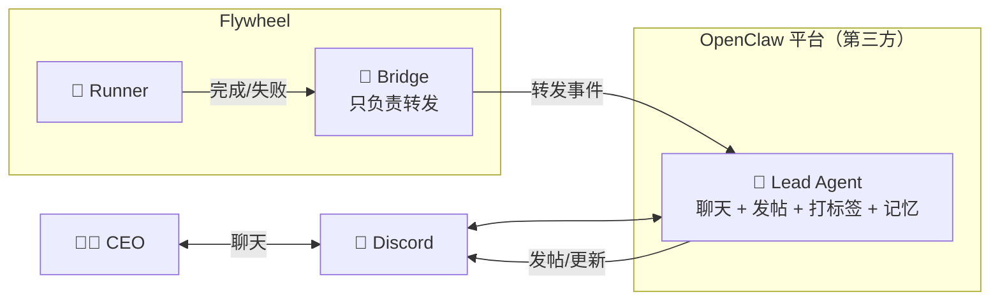
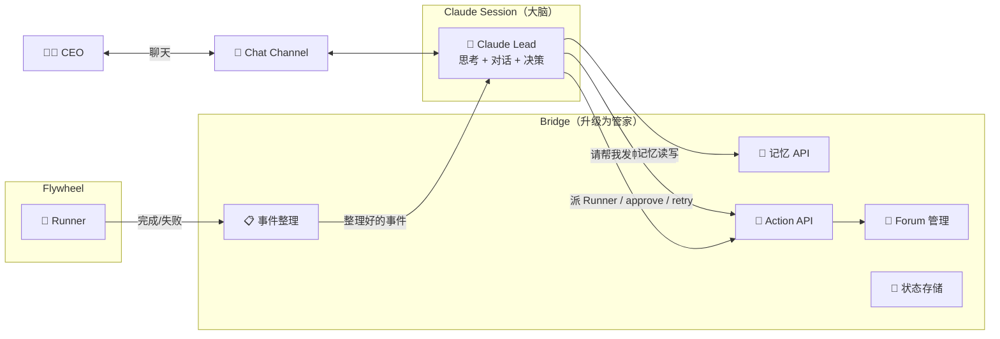

# Exploration: Claude Discord Plugin 作为 Lead Runtime — GEO-195

**Issue**: GEO-195 (Explore Claude Discord Plugin as OpenClaw replacement)
**Date**: 2026-03-21
**Status**: Draft

---

## 背景

Anthropic 官方发布了 [Claude Discord Plugin](https://github.com/anthropics/claude-plugins-official/blob/main/external_plugins/discord/README.md)，提供 Claude Code ↔ Discord 双向 MCP 通信。本文探索是否可以用它替代 OpenClaw Gateway，作为 Lead Agent 的运行时。

### 灵感来源

Matt Shumer 的文章 "10x Your Coding Agent Productivity" 描述了一种 **persistent orchestrator + ephemeral subagents** 模式：
- Orchestrator：长期运行，维护项目全局理解，不写代码，只委派和审阅
- Subagents：短期运行，接受约束任务，做具体实现

这与 Flywheel 的 Lead（orchestrator）+ Runner（subagent）架构高度吻合。

---

## 现有架构



**OpenClaw 承担的职责：**
- 持久 agent session（always-on）
- Discord 消息收发（聊天 + forum thread 管理）
- 自带记忆（+ mem0 外部记忆层，但当前未正确接入，见 GEO-198）
- 接收 Bridge 转发的 Flywheel 事件

**Bridge 当前职责：**
- 接收 Flywheel runner 事件
- SQLite 状态存储
- 格式化 payload 后转发给 OpenClaw
- `/api/forum-tag` — 直接调 Discord REST API 改标签（GEO-167）
- Action API（approve/retry/shelve）
- CIPHER 写入

---

## 提案：Claude Code Persistent Session 作为 Lead

### 核心思想

用 `claude --channels plugin:discord` 启动一个长期运行的 Claude Code session 作为 Lead agent。



### 两层分离原则（来自 Codex 咨询）

| 层 | 归属 | 职责 |
|---|---|---|
| **Control Plane（手脚）** | Bridge | 事件过滤/聚合、Forum thread 生命周期、Tag 管理、状态存储、crash 恢复、mem0 记忆 API、Action 执行 |
| **Reasoning Plane（大脑）** | Claude Session | 消化事件、与 CEO 对话、委派 runner、审阅结果、决策、distill learnings |

**核心原则：Lead 只当大脑，不当基础设施。** 如果 Lead crash 了，Bridge 的数据不会丢。

---

## 七个关键问题

### 1. 事件怎么传给 Lead？

**推荐方案：Discord hidden control channel**

为每个 Lead 增加一个隐藏控制通道（CEO 看不到）：

| Channel | 用途 |
|---------|------|
| `lead-chat` | CEO ↔ Lead 对话 |
| `lead-forum` | Bridge 管理 issue dashboard |
| `lead-control` | Flywheel/Bridge 写入结构化事件 |

Bridge 把事件 normalize + dedupe + 优先级分类后，通过 Discord webhook 发到 control channel。Lead session 通过 `--channels` 自然接收。

**不推荐**：MCP push（MCP 适合 tool pull，不适合外部主动推送）、cron polling（延迟高、浪费 token）。

### 2. Session crash 怎么恢复？

**Lead session 是可丢失的**，真正 durable 的状态在 Bridge 侧：

1. **Supervisor**（pm2 / launchd）— 自动重启
2. **Event journal** — Bridge 持久化所有已投递事件，带 offset/ack
3. **Bootstrap snapshot** — 重启时 Bridge 生成当前状态摘要（open issues, pending decisions, recent activity）
4. **Memory rehydrate** — 从 mem0 拉取 lead-specific 记忆

```
session crash → supervisor 重启 → 注入 bootstrap → replay 未 ack 事件 → 恢复运行
```

### 3. Forum thread/tag 管理？

**留在 Bridge，不交给 Claude session。**

Discord plugin 只有 reply/react/edit/fetch，没有 forum-specific 能力。Bridge 已经有 `/api/forum-tag`，扩展为 `ForumManager`：
- `ensureIssueThread(issueId, leadId)`
- `setIssueThreadState(issueId, state)`
- `appendIssueUpdate(issueId, content)`
- `archiveIssueThread(issueId)`

Lead 需要发帖时，调 Bridge API，不直接操作 Discord。

### 4. 成本？

| 维度 | OpenClaw | Claude Session |
|------|----------|----------------|
| 基础费用 | OpenClaw 订阅 | Claude Max ($100-200/mo) |
| 空闲成本 | always-on，可预测 | 不透明 — idle 是否零消耗？ |
| 活跃成本 | 可预测 | 2 个 persistent Lead + CEO chat + runner review 可能触发 throttling |

**建议**：先一个 Lead 跑有限时间，记录 turn count / event count，评估实际消耗。

### 5. 两套系统怎么并行？

**引入 `LeadRuntime` adapter interface：**

```typescript
interface LeadRuntime {
  deliver(event: LeadEventEnvelope): Promise<void>;
  sendBootstrap(snapshot: LeadBootstrap): Promise<void>;
  health(): Promise<LeadRuntimeHealth>;
  shutdown(): Promise<void>;
}
```

两个实现：`OpenClawRuntime` + `ClaudeDiscordRuntime`。

Bridge shared services（EventFilter, ForumManager, ActionResolver, MemoryAdapter）两个 runtime 共用。可以按 lead / project 切流，或 shadow mode 双写对比。

### 6. 一个 session 能监听多个 channel 吗？

**未验证，当作未知。**

保守设计：Lead 只监听一个 ingress（chat + control 合并，或只监听 control channel）。Bridge 负责 forum。

### 7. Orchestrator 模式怎么实现？

Lead session 严格遵守：
- **Never write code**
- **Never own infra state**
- **Delegate, review, decide, communicate**

职责流程：
1. 从 control channel 读取 normalized events
2. 从 mem0 拉取相关记忆
3. 决策：ignore / synthesize to CEO / spawn runner / request retry / ask clarification
4. 审阅 runner outputs（PR URL, diff summary, test results, risk notes）
5. 写回 distilled learnings 到 mem0

---

## 对比矩阵

| 维度 | OpenClaw | Claude Code Session |
|------|----------|-------------------|
| Runtime 模型 | 专为 persistent agents 设计 | 通用 Claude session + Discord plugin |
| 事件接收 | Native webhook | 需要 Discord control channel |
| Forum 管理 | 已验证 | 需留在 Bridge |
| 状态持久性 | Gateway 级别 | 需外部化，session 是 cache |
| Crash 恢复 | Gateway 自带 | 需自建 supervisor + replay |
| 扩展性 | 受限于 OpenClaw 平台 | 高 — Claude Code 有完整工具链 |
| Reasoning 能力 | 中 — 受限于 OpenClaw 模型 | 高 — 原生 Claude，compound learning |
| 成本可预测性 | 好 | 差 — idle cost 不透明 |
| Vendor lock-in | OpenClaw | Anthropic |
| A/B 切换 | 基线 | 需 runtime adapter |

---

## 风险与缓解

### 1. Session 不稳定 / context 丢失
- **缓解**：supervisor + bootstrap + event replay + 外部 durable state

### 2. Plugin 能力不足（forum/tag）
- **缓解**：forum 留在 Bridge，Lead 只通过 API 请求

### 3. 成本/限流不确定
- **缓解**：先一个 Lead + 有限时间试跑，记录消耗数据

### 4. 事件重复/乱序
- **缓解**：Bridge 生成 monotonic event_seq，Lead 忽略已 ack 的

### 5. Reasoning 和 Infrastructure 耦合
- **缓解**：严格 API boundary — Lead 请求，Bridge 执行

---

## MVP 范围

### 目标：验证 4 件事

1. Claude persistent Lead 能稳定接收 machine events
2. Lead 能把 runner output 消化成 CEO-friendly synthesis
3. Lead 能通过 Bridge API 成功 delegate/retry/approve
4. Session crash 后能在 1 次重启内恢复有用上下文

### MVP Build List

1. **`ClaudeDiscordRuntime` adapter** — launch/health/restart + bootstrap injection
2. **Hidden control channel per Lead** — Bridge posts normalized envelopes
3. **Lead bootstrap generator** — open issues, pending approvals, recent failures, mem0 recall
4. **Ack/replay store** — per-lead delivered/acked event sequence
5. **3 个 Bridge tools** — `list_open_work()`, `delegate_runner()`, `execute_action()`

### MVP 不包含

- Forum thread 创建 parity
- Forum tag mutation by Claude
- Multi-channel 假设
- Ops lead（只跑 Product lead）
- 自主 memory 写入策略

### 前置依赖

- **GEO-198**: 修正 mem0 记忆层归属（从 runner → Lead）

---

## 备选方案

| 方案 | 描述 | 优点 | 缺点 |
|------|------|------|------|
| A. Stateless Claude Responder | 不用 persistent session，每次只调 Claude 做 synthesis | 低运维风险 | 无连续对话感 |
| B. Claude SDK + 自写 Discord Adapter | 不走 plugin，自控 session lifecycle | event push 可控 | 开发量大 |
| C. 只换 reasoning model | 保留 OpenClaw，升级 prompt/model | 最低迁移风险 | 无法验证 Claude-native 是否更好 |
| D. Event-Sourced Lead | 每次从 event log + mem0 重建 | crash recovery 最干净 | 无 compound thread 感 |
| E. Split-Brain Lead | Control Lead（处理事件）+ Chat Lead（CEO 对话）分离 | 干净分离 | 协调复杂 |

---

## 结论

> **用 Claude Discord Plugin 做 Lead 的"大脑"，可以试；用它做 Lead 的"基础设施"，不该试。**

推荐路径：
1. 保留 Bridge 做 control plane
2. 引入 `LeadRuntime` adapter 支持 A/B
3. MVP 只验证一个 Lead（Product）+ 一个 ingress + 核心决策流
4. 先解决 GEO-198（mem0 归属修正）
5. 根据 MVP 结果决定是否全面替换 OpenClaw
