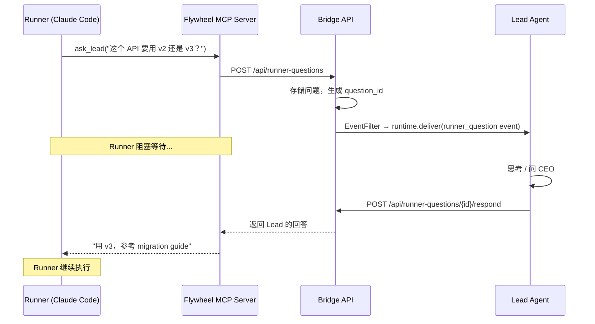

# Exploration: Lead ↔ Runner 双向通信 — GEO-206

**Issue**: GEO-206 (Lead ↔ Runner 双向通信 — 重新设计 Lead 与 Runner 的交互架构)
**Domain**: Infrastructure / Architecture
**Date**: 2026-03-22
**Depth**: Deep
**Mode**: Technical
**Status**: final

---

## 0. 问题陈述

当前系统是 **单向通知** 架构：

```
Runner 完成/失败 → Bridge (event) → EventFilter → RuntimeRegistry → Lead → CEO
CEO 决策 → Lead → Bridge API (curl) → Bridge 执行 (git merge / retry / terminate)
```

### 缺失的通信通道

| 通道 | 现状 | 理想 |
|------|------|------|
| Runner → Lead (运行中) | ❌ 不存在。Runner 只能在 完成/失败 时通知 | Runner 遇到问题可以暂停、问 Lead |
| Lead → Runner (指令) | ❌ 不存在。Lead 不能给 Runner 发指令 | Lead 可以指导 Runner："先改 A 再改 B" |
| Lead → tmux (可见性) | ❌ 不存在。Lead 看不到 Runner 在干什么 | Lead 可以查看 Runner 的 tmux pane 内容 |
| CEO → Runner (直达) | ❌ 要绕两层（CEO → Lead → Bridge → action） | CEO 指令通过 Lead 直达 Runner |

### 这带来的真实痛点

1. **Runner 只能 fail** — 遇到问题不能问人，只能 fail → 等 CEO retry with context
2. **CEO retry 效率低** — fail → 等通知 → 看情况 → retry with context → 新 session 重新跑，丢失所有进度
3. **Lead 是"盲人管理者"** — 管理 Runner 却看不到它们在做什么，不能直接干预
4. **反馈循环太长** — Runner 问题 → fail → Lead 通知 → CEO 回复 → retry → 可能又 fail

### 理想交互模型

```
Runner 遇到歧义 → 调用 ask_lead() 工具 → 暂停等待
                                          ↓
Lead 收到问题 → 自己判断 or 问 CEO → 回答 → 答案送回 Runner
                                          ↓
Runner 收到答案 → 继续执行（不丢失进度）
```

---

## 1. Affected Files and Services

| File/Service | Impact | Notes |
|-------------|--------|-------|
| Bridge API (`plugin.ts`, `event-route.ts`) | modify | 新增 runner-questions endpoints |
| 新 MCP Server (`flywheel-mcp/`) | **新增** | Runner 端的通信工具 |
| TmuxAdapter (`TmuxAdapter.ts`) | modify | MCP server 注入到 tmux 环境 |
| ClaudeRunner (`ClaudeRunner.ts`) | modify | MCP server 配置注入 |
| Blueprint (`Blueprint.ts`) | modify | 传递 MCP config 到 adapter |
| Supervisor script (`claude-lead.sh`) | modify | Lead 需要知道如何使用 respond API |
| Lead agent file (GEO-205) | modify | 添加 runner 通信工具说明 |
| StateStore | modify | 新增 `runner_questions` 表 |
| EventFilter (`EventFilter.ts`) | modify | 新增 `runner_question` 事件类型 |

---

## 2. 现有架构约束

### 2.1 Runner 端能力

| Runner 类型 | 流式输入 | MCP 支持 | tmux | 生产使用 |
|------------|---------|---------|------|---------|
| **TmuxAdapter** | ❌ `supportsStreaming = false` | ✅ Claude Code 原生支持 MCP | ✅ | **当前主力** |
| **ClaudeRunner** (SDK) | ✅ `addStreamMessage()` | ✅ via SDK config | ❌ | Edge Worker 用 |
| **ClaudeCodeAdapter** (--print) | ❌ | ❌ (非交互) | ❌ | 已弃用 |

**关键发现**: TmuxAdapter 启动的 Claude Code 会话天然支持 MCP servers（通过 `--mcp-config` 或 `.claude/settings.json`），这是最自然的 Runner → Lead 通信通道。

### 2.2 Lead 端能力

| 能力 | Claude Discord Lead | OpenClaw Lead |
|------|-------------------|---------------|
| 接收事件 | ✅ via control channel | ✅ via webhook |
| 调用 Bridge API | ✅ via `curl` (Bash tool) | ✅ via TOOLS.md |
| tmux 操作 | ❌ | ❌ |
| 访问 Runner 进程 | ❌ | ❌ |

### 2.3 Bridge 现有事件流

```
POST /events → store event → FSM transition → ForumPostCreator
                                              → EventFilter.classify()
                                              → ForumTagUpdater
                                              → RuntimeRegistry.resolve()
                                              → runtime.deliver(envelope)
```

EventFilter 已支持 11 种事件类型路由规则。新增 `runner_question` 类型自然融入。

### 2.4 现有"准双向"模式

**Retry with Context (GEO-168)**:
- CEO 通过 retry action 传递指令
- 新 Runner session 的 system prompt 包含 previous error + CEO instruction
- 但这是 **新 session**，不是与原 Runner 的对话
- 丢失所有执行进度

**ChatSessionHandler (Edge Worker)**:
- 使用 `ClaudeRunner.addStreamMessage()` 注入 follow-up 到运行中的 session
- 但只适用于 ClaudeRunner (SDK)，不适用于 TmuxAdapter
- 且仅用于 Linear @ mention 场景

---

## 3. 外部研究

### 3.1 Multi-Agent 通信模式

| 模式 | 描述 | 适用性 |
|------|------|--------|
| **Orchestrator-Worker** | 中心编排器分发任务、收集结果 | 当前架构的演进方向 |
| **Blackboard** | 共享状态空间，agents 读写 | Bridge 已是中心化状态存储 |
| **Message Broker** | 发布/订阅，异步解耦 | 适合 Lead → Runner 异步指令 |
| **Synchronous RPC** | 调用方阻塞等待响应 | 适合 Runner → Lead 同步提问 |

**业界最佳实践**: 现代 multi-agent 系统普遍采用 **message broker + synchronous RPC** 混合模式。异步通知 + 同步阻塞调用各取所长。

### 3.2 Claude Code 原生机制

| 机制 | 描述 | 可利用性 |
|------|------|----------|
| **MCP Servers** | Claude Code 原生支持自定义 MCP tools | ✅ Runner 可通过 MCP tool 调用 Bridge |
| **Agent Tool** | spawn subagent，独立 context window | ⚠️ Lead 可 spawn Runner 但需要同进程 |
| **Hooks** | 生命周期钩子（PreToolUse, PostToolUse） | ✅ 可拦截特定操作 |
| **`--mcp-config`** | CLI flag 注入 MCP server 配置 | ✅ TmuxAdapter 已支持传递 CLI args |
| **Teams** (2026) | Agent 团队，mutual communication | ⚠️ 需要 SDK 直接使用，不适合 tmux |

### 3.3 WebSocket / SSE 方案

- `claude-agent-server` (dzhng) 提供 WebSocket 控制 Claude sessions
- Flywheel Bridge 已有 SSE endpoint (`/sse`) 用于 dashboard
- 可复用 SSE 机制做实时推送

**Sources:**
- [Claude Code Custom Subagents](https://code.claude.com/docs/en/sub-agents)
- [Agent SDK Subagents](https://platform.claude.com/docs/en/agent-sdk/subagents)
- [claude-agent-server (WebSocket)](https://github.com/dzhng/claude-agent-server)
- [Multi-Agent Design Patterns (Confluent)](https://www.confluent.io/blog/event-driven-multi-agent-systems/)
- [AI Agent Orchestration Patterns (Microsoft)](https://learn.microsoft.com/en-us/azure/architecture/ai-ml/guide/ai-agent-design-patterns)
- [MCP in Agent SDK](https://platform.claude.com/docs/en/agent-sdk/mcp)

---

## 4. Options Comparison

### Option A: Flywheel MCP Server + Bridge RPC（推荐）

**Core idea**: 给 Runner 配一个 Flywheel MCP server，提供 `ask_lead()` 等工具。Bridge 作为中转站（rendezvous point）。Runner 调用 MCP tool → HTTP 到 Bridge → Bridge 通知 Lead → Lead 回答 → Bridge 返回给 Runner。



**MCP Server 提供的工具**:
```
ask_lead(question, context?)     → 同步阻塞，等 Lead 回答
report_progress(status, details) → 异步，不阻塞
check_inbox()                    → 检查 Lead 发来的指令
```

**Bridge 新增 endpoints**:
```
POST   /api/runner-questions                    → Runner 提问
GET    /api/runner-questions/pending?lead_id=X  → Lead 查询待答问题
POST   /api/runner-questions/{id}/respond       → Lead 回答
POST   /api/runner-inbox/{executionId}          → Lead 发送指令给 Runner
GET    /api/runner-inbox/{executionId}          → Runner 检查收件箱
```

**Pros**:
- 与 **任何 Runner 类型** 兼容（TmuxAdapter、ClaudeRunner、未来的 adapter）
- 完全 **可审计**（所有问答存储在 Bridge）
- **增量可实施** — Phase 1 只做 Runner → Lead，Phase 2 加 Lead → Runner
- 复用现有事件架构（EventFilter + RuntimeRegistry）
- Runner 和 Lead **完全解耦** — 不需要同进程、同机器
- MCP server 是 Claude Code 的 **原生扩展点**，不是 hack
- 对 Runner 的 prompt 影响最小 — 只需注入 MCP config

**Cons**:
- 需要新建一个 MCP server package（`packages/flywheel-mcp/`）
- `ask_lead()` 的 long-poll 有超时风险（Lead/CEO 回复慢）
- Runner 不知道什么时候该用 `ask_lead()`（需要 prompt engineering）
- 新增 Bridge endpoints 和 StateStore 表

**Effort**: Medium（1-2 周 for Phase 1）

**What gets cut**: 本 option 不包含 Lead tmux 可见性（Phase 3），不包含 CEO → Runner 直达（通过 Lead 中转）

---

### Option B: tmux send-keys + Sentinel File Protocol

**Core idea**: Lead 用 `tmux send-keys` 直接往 Runner 的 tmux pane 注入文本。Runner 写问题到文件，Lead watch 文件变化。

```
Lead → Runner: tmux send-keys -t flywheel:{window} "your answer here" Enter
Runner → Lead: echo "question: ..." > /tmp/flywheel-questions/{executionId}.txt
               Lead watches /tmp/flywheel-questions/ 目录
```

**Pros**:
- 实现极简，几乎不需要新代码
- 利用现有 tmux 基础设施
- 低延迟（tmux send-keys 立即生效）

**Cons**:
- **极其脆弱** — 依赖 Claude Code CLI 当前接受 stdin 输入的行为，Anthropic 任何 CLI 更新都可能打破
- **不可靠** — tmux send-keys 不保证文本被正确接收（可能 CLI 在处理其他输入）
- **安全风险** — 任意文本注入 shell，可能造成命令注入
- **不可审计** — 文件系统通信没有结构化日志
- **不跨机器** — Lead 和 Runner 必须在同一台机器
- **只适用于 TmuxAdapter** — ClaudeRunner (SDK) 无法使用
- Claude Code **不是交互式 REPL** — `--print` 模式下没有 stdin，交互模式下 stdin 被 UI 占用
- 不适合 Runner → Lead 场景（Runner 不知道怎么"问问题"）

**Effort**: Small（2-3 天），但维护成本高

**What gets cut**: 可审计性、可靠性、跨机器支持

---

### Option C: SDK-Native Streaming（ClaudeRunner 直连）

**Core idea**: 迁移到 ClaudeRunner (SDK)。用现有的 `addStreamMessage()` 做 Lead → Runner 注入。用 custom MCP tool 做 Runner → Lead 提问。

```
Lead → Runner: ClaudeRunner.addStreamMessage("你的指令")
Runner → Lead: MCP tool ask_lead() → Bridge → Lead
```

**Pros**:
- `addStreamMessage()` **已实现**（ChatSessionHandler 在用）
- 类型安全，SDK 原生支持
- 低延迟（直接内存注入）
- 支持 streaming prompt 的 `AsyncIterable` 模式

**Cons**:
- **只适用于 ClaudeRunner (SDK)**，不适用于 TmuxAdapter
- 当前生产 **全部用 TmuxAdapter** — 迁移是一个大工程
- Lead 和 Runner 需要 **同进程** 才能调 `addStreamMessage()`
- 如果用 IPC/RPC 暴露 `addStreamMessage()`，等于重新实现 Option A
- ClaudeRunner 没有 tmux 可视化（CEO 看不到执行过程）

**Effort**: Large（3-4 周，含 TmuxAdapter → ClaudeRunner 迁移）

**What gets cut**: tmux 可视化、现有 tmux-based 运维工具

---

### Option D: Lead 作为 Orchestrator（Agent Tool 直接 spawn）

**Core idea**: 重构架构，Lead 用 Claude Code 的 `Agent` tool 直接 spawn Runner 作为 subagent。Lead 是 parent，Runner 是 child，天然双向通信。

```
Lead:
  Agent(
    prompt: "实现 GEO-206...",
    tools: [...],
    allowedTools: [...]
  ) → Runner result
```

**Pros**:
- Claude Code **原生 parent-child** 通信模式
- 完整的双向通信（parent 控制 child lifecycle）
- Lead 对 Runner 有完全控制权
- 不需要 Bridge 中转
- 2026 Agent Teams 特性可能进一步增强

**Cons**:
- **根本性架构重写** — Lead 替代 Blueprint 成为执行引擎
- Lead 需要 **极长的 context window**（管理多个 Runner 的状态）
- Lead **必须持续运行**（不能 crash/restart），否则所有 Runner 丢失
- **资源密集** — 每个 Runner 消耗 Lead 的 context 空间
- 与现有 Blueprint → TmuxAdapter → hooks → Bridge 的执行链完全不兼容
- Lead crash = **所有** Runner 丢失（single point of failure）
- 当前 Claude Code Agent tool 限制：subagent 独立 context window，通信有限
- **不可增量实施** — 必须一次性重写

**Effort**: XL（4-8 周，完全重写执行引擎）

**What gets cut**: 现有 Blueprint 引擎、tmux 可视化、Bridge event flow

---

### Recommendation: Option A（Flywheel MCP Server + Bridge RPC）

**理由**:

1. **最符合增量原则** — Phase 1 只需 MCP server + 3 个 Bridge endpoints，不影响现有架构
2. **Runner 类型无关** — TmuxAdapter 和 ClaudeRunner 都支持 MCP，未来迁移不受影响
3. **可审计** — 所有 Runner ↔ Lead 通信存储在 Bridge StateStore，可追溯
4. **解耦** — Lead 和 Runner 不需要同进程，不需要同机器，不需要知道对方实现细节
5. **复用现有基础设施** — EventFilter 路由、RuntimeRegistry 投递、StateStore 存储
6. **MCP 是 Claude Code 的一等公民** — 不是 hack，是官方推荐的扩展方式

**风险**:
- `ask_lead()` 超时处理需要仔细设计（Lead/CEO 回复可能很慢）
- Runner 需要 prompt engineering 让它知道何时调用 `ask_lead()`
- 首次实施需要验证 MCP server 在 tmux Claude session 中的可用性

---

## 5. 分阶段实施路线

### Phase 1: Runner → Lead 同步提问（核心价值）


- 新建 `packages/flywheel-mcp/` — SSE transport 的 MCP server
- Bridge 新增 `runner_questions` 表 + 3 个 endpoints
- EventFilter 新增 `runner_question` 事件类型
- TmuxAdapter 注入 `--mcp-config` 或环境变量

### Phase 2: Lead → Runner 异步指令

- Bridge 新增 `runner_inbox` 表 + 2 个 endpoints
- MCP server 新增 `check_inbox()` tool
- Runner prompt 添加 "定期检查收件箱" 指令
- 或用 MCP notification push（如果 Claude Code 支持）

### Phase 3: Lead tmux 可见性

- Bridge 新增 `/api/sessions/{id}/capture` — 调用 `tmux capture-pane`
- Lead 可查看 Runner 当前输出
- 用于诊断"Runner 卡住了在做什么"

### Phase 4: CEO → Runner 直达（通过 Lead）

- Lead 收到 CEO 指令 → 写入 Runner inbox
- Runner 通过 `check_inbox()` 收到指令
- 或 Lead 直接回答 Runner 的 `ask_lead()` 调用

---

## 6. Clarifying Questions

### Scope

1. **优先实现哪个方向？** Runner → Lead（同步提问）还是 Lead → Runner（异步指令）？前者解决 "Runner 遇到问题只能 fail" 的痛点，后者解决 "Lead 不能指导 Runner" 的痛点。

2. **`ask_lead()` 超时策略？** Runner 调用 `ask_lead()` 后应该等多久？建议选项：
   - A) 5 分钟超时，超时后 Runner 用自己的判断继续
   - B) 30 分钟超时，超时后 Runner fail 并标记为 `needs_lead_response`
   - C) 可配置，默认 10 分钟

3. **Runner 何时该调用 `ask_lead()`？** 需要在 Runner 的 prompt/CLAUDE.md 中定义触发条件。你倾向于：
   - A) 明确规则（如 "遇到架构选择时问 Lead"）
   - B) Runner 自行判断（依赖 Claude 的判断力）
   - C) 混合（给几个明确场景 + "不确定时也可以问"）

### Architecture

4. **MCP server 运行方式？**
   - A) stdio transport（嵌入 Claude Code 进程，简单）
   - B) SSE/HTTP transport（独立进程，可跨机器）
   - 推荐 A — Runner 和 MCP server 同进程最简单

5. **与 GEO-205 的时序？** GEO-205 定义 Lead agent identity。双向通信的 Lead 端需要知道如何使用 respond API。应该先完成 GEO-205 再做 GEO-206 Phase 1？还是可以并行？

### Data Model

6. **问答历史保留策略？** Runner ↔ Lead 的问答记录是否需要持久化？
   - A) 只在 session 生命周期内保留（内存/临时存储）
   - B) 永久保留，可用于 CIPHER 学习
   - C) 保留 30 天，然后清理

---

## 6. User Decisions (2026-03-22 CEO 讨论后确认)

### 产品方向

1. **Lead 是管理者，不是执行引擎** — 监督、指导、回答问题、escalate 给 CEO
2. **Lead 自主程度渐进** — 初期多问 CEO，随 CIPHER 学习逐渐自主
3. **Lead 需要 tmux 可见性** — 实时看 Runner terminal output
4. **多 Lead 协作** — Product Lead, Ops Lead, Marketing Lead 通过 Discord project-wide channel 协作
5. **Daily Stand-up** — 定时（暂定 9:00 AM），Lead 自动发日报，CEO ~10:00 review
6. **晚间自主运行** — Lead 扫 Linear backlog，自主启动 Runner，早上汇报
7. **资源控制** — 并发 Runner 数受硬件资源限制，需 Resource Monitor

### 技术选型

1. **Lead runtime: Claude Code CLI** — `--agent` + `--channels discord`，不用 OpenClaw
2. **不用 Agent Teams** — Lead 间已通过 Discord 通信，Agent Teams experimental 限制太多
3. **Lead ↔ Runner: 自建文件 inbox + MCP tool** — 受 Agent Teams file-based inbox 启发
4. **Blueprint/DAG 被 Lead 吸收** — Lead 自主判断优先级和调度，不再需要 DAG
5. **Bridge 保留基础设施角色** — StateStore、Forum 管理、审计、Dashboard
6. **同机部署** — Lead + Runner 在同一台机器，不考虑跨机器

### 关键参考
- 完整产品 vision: `doc/architecture/v2.0-product-vision.md`

## 7. Suggested Next Steps

- [x] 产品方向讨论 → 确认 v2.0 vision
- [x] 技术选型确认 → Claude Code + 自建通信层
- [ ] `/research` — 深入研究 Lead ↔ Runner 通信层实现细节
- [ ] 验证 MCP server 在 tmux Claude Code session 中的可用性（POC）
- [ ] 设计 Runner MCP tool 协议（ask_lead, check_inbox, report_progress）
