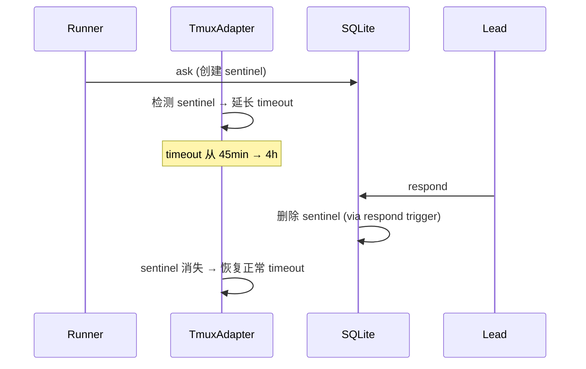

# Exploration: Lead ↔ Runner 双向通信 Phase 2 — GEO-206

**Issue**: GEO-206 (Lead ↔ Runner 双向通信 — Phase 2)
**Domain**: Infrastructure / Architecture
**Date**: 2026-03-22
**Depth**: Deep
**Mode**: Technical
**Status**: Draft

---

## 0. Context: Phase 1 回顾

Phase 1 (PR #40, #41) 实现了 Runner → Lead 的同步提问:

```
Runner ask → SQLite → Lead pending → Lead respond → Runner check → 获得答案
```

**已有基础**:
- `packages/flywheel-comm/` CLI: ask, check, pending, respond
- SQLite (better-sqlite3 WAL): `~/.flywheel/comm/{project}/comm.db`
- Schema 已支持 `instruction` 和 `progress` message types（未使用）
- Blueprint system prompt 注入（leadId 有值时）
- TmuxAdapter env 注入（FLYWHEEL_COMM_DB）
- leadId 解析（loadProjects → resolveLeadForIssue）

**Phase 1 的限制**:
- Runner 只能提问，不能接收 Lead 的主动指令
- 无 session pause/resume — Runner 45 分钟后超时
- Lead 看不到 Runner tmux 输出

---

## 1. Phase 2 Feature 分析

### Feature 1: Lead 主动指令 (Lead → Runner Instructions)

**问题**: Lead 目前只能回答 Runner 的问题（respond），不能主动发指令给 Runner。

**场景**:
- Lead 观察到 Runner 走错方向，想纠正："停止改 A 文件，应该先改 B"
- CEO 通过 Lead 下达紧急指令："先处理 hotfix GEO-999"
- Lead 想给 Runner 补充上下文："FYI: 刚合并的 PR #42 改了相关 API"

**实现分析**:

Schema 已有 `instruction` type，DB adapter 只需新增两个方法:

```typescript
// db.ts 新增
insertInstruction(fromAgent: string, toAgent: string, content: string): string
getUnreadInstructions(agentId: string): Message[]  // 未读指令
markInstructionRead(id: string): void              // 标记已读
```

CLI 新增两个 command:

| Command | 方向 | 用法 |
|---------|------|------|
| `send` | Lead → Runner | `flywheel-comm send --to <exec-id> --from <lead-id> "指令内容"` |
| `inbox` | Runner 检查 | `flywheel-comm inbox --exec-id <id> [--json]` |

**需要解决的问题**:

1. **Runner 怎么知道要检查 inbox?**
   - Option A: 在 system prompt 中要求 Runner 定期检查（每 N 分钟执行 `flywheel-comm inbox`）
   - Option B: Runner 只在特定时机检查（开始新任务前、提交前）
   - Option C: Blueprint 注入 Claude Code Hook（PostToolUse），自动在每次工具调用后检查
   - **推荐 A+B**: system prompt 指导 + 关键时机检查。Hook 方案侵入性大。

2. **指令 vs 回复的区别**:
   - `respond` 是对 Runner 问题的回答（parent_id 链接到 question）
   - `send` 是 Lead 主动发出的指令（no parent_id）
   - Runner 消费方式不同：`check` 查回复，`inbox` 查指令

3. **已读标记**:
   - 需要新增 `read_at` 字段（或独立 `message_reads` 表）
   - 避免 Runner 重复处理同一指令
   - 简单方案：`inbox` 返回后自动标记已读（side effect）

### Feature 2: 动态超时 / Session Pause+Resume

**问题**: TmuxAdapter 当前有 45 分钟硬超时。Runner 问 Lead 问题后，如果 Lead/CEO 回复慢（可能 1-8 小时），Runner session 早已超时。

**当前流程**:
```
Runner ask → 等待 → 45分钟超时 → session 结束 → 所有进度丢失
```

**理想流程**:
```
Runner ask → 继续其他工作 → Lead 回复 → Runner check 得到答案 → 继续
                                    或
Runner ask → 无其他工作可做 → pause session → Lead 回复 → resume → 继续
```

**深度分析**:

Claude Code CLI session 不支持真正的 "pause/resume"。有几个可行方向:

#### Option A: 延长超时 + Runner 自主等待 (最简方案)

- TmuxAdapter timeout 从 45 分钟延长到可配置（如 4 小时）
- Runner 在 system prompt 中被告知可以等待 Lead 回复
- Runner 每隔几分钟执行 `flywheel-comm check` poll
- 如果 Lead 45 分钟没回，Runner 用 best judgment 继续
- **不需要任何 session 暂停机制**

**Pros**: 极简，几乎不需要改代码
**Cons**: session 持续运行消耗资源（Claude subscription 无 token 计费，但占 tmux window）

#### Option B: Sentinel file 触发超时延长

- Runner 执行 `flywheel-comm ask` 后，CLI 自动创建一个 sentinel file
- TmuxAdapter 的 poll loop 检测 sentinel file → 延长 timeout
- Lead respond 后，CLI 删除 sentinel file → 超时恢复正常
- 这是 **TmuxAdapter 级别** 的超时管理，不需要 session pause



**Pros**: 精确控制超时，不浪费资源
**Cons**: sentinel file 增加复杂度，sentinel 和 DB 状态需要保持同步

#### Option C: 基于 comm.db 的超时扩展 (推荐)

**不用 sentinel file。TmuxAdapter poll loop 直接检查 comm.db**:
- TmuxAdapter 已有 `FLYWHEEL_COMM_DB` env var 指向 DB 路径
- poll 循环中，检查 DB 是否有 pending questions（未回复的问题）
- 有 pending questions → 超时延长到 `waitingTimeoutMs`（如 4 小时）
- 所有 questions 都已回复 → 恢复正常超时

```typescript
// TmuxAdapter waitForCompletion poll loop 中新增
if (ctx.commDbPath && existsSync(ctx.commDbPath)) {
  const db = new CommDB(ctx.commDbPath, false);
  const pendingCount = db.getPendingQuestions(ctx.leadId ?? "").length;
  db.close();
  if (pendingCount > 0) {
    effectiveTimeout = ctx.waitingTimeoutMs ?? 14_400_000; // 4h
  }
}
```

**Pros**:
- 不需要额外文件，复用现有 DB
- 状态总是一致的（DB 是 single source of truth）
- TmuxAdapter 已有 commDbPath
**Cons**:
- TmuxAdapter 需要依赖 flywheel-comm 的 CommDB 或自己读 SQLite
- poll 频率（5s）读 SQLite 性能 OK（better-sqlite3 极快）
- 需要 leadId 传到 TmuxAdapter（目前只在 Blueprint 中）

#### Option D: Claude Code `--resume` session 恢复

- Claude Code CLI 支持 `--resume` flag 恢复之前的 session
- Runner session 超时后，Lead 回复后启动新 session with `--resume`
- 这是 **真正的 pause/resume**，但需要:
  1. 保存 session ID
  2. 新的执行路径（timeout → save → wait → resume）
  3. 重新设计 TmuxAdapter 的 execute 方法

**Pros**: 真正的进度保留
**Cons**:
- 复杂度高，需要重构 TmuxAdapter 执行流
- `--resume` 在交互模式是否可靠未验证
- 需要 orchestrator 层面的支持（谁来触发 resume?）

#### 推荐: Option C (基于 comm.db 的超时扩展)

理由:
1. 最小改动——只修改 TmuxAdapter poll loop
2. 复用现有 DB 状态，无额外同步问题
3. 渐进式——可以先做 Option A（改默认超时），再升级到 Option C
4. 为未来 Option D 留空间（如果需要真正的 resume）

### Feature 3: Lead tmux 可见性 (可选)

**问题**: Lead 不知道 Runner 在做什么。"盲人管理者"。

**场景**:
- Runner 卡住了，Lead 想看它在做什么
- Lead 要决定是否该给 Runner 发指令纠正方向
- CEO 问 Lead "Runner 进展如何"，Lead 需要能看到

**实现分析**:

tmux 原生提供 `capture-pane`:
```bash
tmux capture-pane -t flywheel:@{window_id} -p -S -100
# 捕获最近 100 行输出
```

**方案**: 新增 CLI command `capture`

```bash
flywheel-comm capture --session flywheel --window @42
# 或
flywheel-comm capture --exec-id <execution-id>
```

**需要解决的问题**:

1. **execution-id → tmux window 映射**:
   - TmuxAdapter 返回 `tmuxWindow: "flywheel:@42"` 在 AdapterExecutionResult 中
   - 需要将这个映射存到某处（comm.db? StateStore?）
   - Lead 调用 `capture` 时需要知道 window ID

2. **简单方案**: Lead 直接用 tmux 命令
   - Lead 是 Claude Code session，有 Bash tool
   - 可以直接执行 `tmux capture-pane -t flywheel:@42 -p`
   - 不需要新 CLI command——在 Lead 的 CLAUDE.md 中说明即可
   - **但 Lead 怎么知道 window ID?**

3. **Execution registry in comm.db**:
   - 新增 `sessions` 表记录 execution_id → tmux_window 映射
   - Runner 启动时注册，结束时更新
   - Lead 通过 `flywheel-comm sessions --project geoforge3d` 查看活跃 sessions

**推荐**: Phase 2 先做简化版——
- comm.db 新增 `sessions` 表
- Blueprint/TmuxAdapter 启动时写入 session 记录
- Lead 查 sessions 表获得 tmux window ID → 直接用 tmux capture-pane

---

## 2. Affected Files and Services

| File/Service | Impact | Feature |
|-------------|--------|---------|
| `packages/flywheel-comm/src/db.ts` | modify | F1: instruction CRUD, F3: sessions 表 |
| `packages/flywheel-comm/src/commands/send.ts` | **新增** | F1: Lead → Runner 指令 |
| `packages/flywheel-comm/src/commands/inbox.ts` | **新增** | F1: Runner 检查指令 |
| `packages/flywheel-comm/src/commands/sessions.ts` | **新增** | F3: 查看活跃 sessions |
| `packages/flywheel-comm/src/index.ts` | modify | F1+F3: 新 CLI commands |
| `packages/flywheel-comm/src/types.ts` | modify | F1: Instruction 类型 |
| `packages/edge-worker/src/Blueprint.ts` | modify | F1: prompt 注入 inbox 指令, F2: waitingTimeoutMs |
| `packages/claude-runner/src/TmuxAdapter.ts` | modify | F2: 动态超时, F3: session 注册 |
| `packages/core/src/adapter-types.ts` | modify | F2: waitingTimeoutMs, leadId |
| `packages/teamlead/scripts/claude-lead.sh` | modify | F1+F3: Lead 端 CLI 说明 |

---

## 3. 分阶段实施建议

### Step 1: Lead 主动指令 (send + inbox)


- DB: `insertInstruction()`, `getUnreadInstructions()`, `markInstructionRead()`
- CLI: `send` command, `inbox` command
- Schema: 新增 `read_at` 列（ALTER TABLE 或 schema migration）
- Blueprint: system prompt 扩展（定期检查 inbox）
- 测试: TDD — unit + round-trip

### Step 2: 动态超时 (TmuxAdapter comm.db 检查)

- TmuxAdapter: poll loop 检查 pending questions
- AdapterExecutionContext: 新增 `waitingTimeoutMs?`, `leadId?`
- Blueprint: 传递 waitingTimeoutMs 和 leadId 到 adapter context
- 默认: 正常 45 min，有 pending question 时 4h

### Step 3: Session 注册 + Lead tmux 可见性

- DB: 新增 `sessions` 表
- TmuxAdapter: execute() 开始时注册 session
- CLI: `sessions` command
- Lead CLAUDE.md: 说明如何用 tmux capture-pane

---

## 4. Options Comparison

| 方案 | 复杂度 | 风险 | 价值 |
|------|--------|------|------|
| F1: Lead 主动指令 | Low | Low | **High** — 填补 Lead → Runner 通信空白 |
| F2a: 延长默认超时 | Trivial | Low | Medium — 简单但粗糙 |
| F2c: comm.db 动态超时 | Medium | Medium | **High** — 精确控制超时 |
| F2d: --resume session | High | High | High — 但改动大 |
| F3: tmux 可见性 | Low | Low | Medium — 提升 Lead 管理能力 |

**推荐优先级**: F1 > F2c > F3

---

## 5. Schema 变更需求

### 5.1 已读标记

两个选择:

**Option A: 新增 `read_at` 列**
```sql
ALTER TABLE messages ADD COLUMN read_at DATETIME;
```
- 简单，一列搞定
- `inbox` 查询: `WHERE to_agent = ? AND type = 'instruction' AND read_at IS NULL`
- 读取时 UPDATE: `SET read_at = datetime('now') WHERE id = ?`

**Option B: 独立 `message_reads` 表**
```sql
CREATE TABLE message_reads (
  message_id TEXT PRIMARY KEY,
  read_at DATETIME DEFAULT CURRENT_TIMESTAMP,
  FOREIGN KEY (message_id) REFERENCES messages(id)
);
```
- 不修改现有表
- 但更复杂

**推荐 Option A** — 直接在 messages 表加 `read_at` 列。简单够用。

### 5.2 Sessions 表

```sql
CREATE TABLE IF NOT EXISTS sessions (
  execution_id  TEXT PRIMARY KEY,
  tmux_window   TEXT NOT NULL,
  project_name  TEXT NOT NULL,
  issue_id      TEXT,
  lead_id       TEXT,
  started_at    DATETIME DEFAULT CURRENT_TIMESTAMP,
  ended_at      DATETIME,
  status        TEXT DEFAULT 'running' CHECK(status IN ('running','completed','failed','timeout'))
);
```

---

## 6. Clarifying Questions

### Scope

1. **Phase 2 是否包含 Lead tmux 可见性 (Feature 3)?**
   - F1 和 F2 是明确在 scope 内的
   - F3 当时标注为 "可选"
   - sessions 表对 F3 很有用，但如果不做 F3，sessions 表也对其他功能（审计、Lead 查看 Runner 状态）有价值
   - **建议**: 做 sessions 表但不做完整 capture 功能，留给后续

2. **Lead 指令的优先级 vs Runner 当前任务**:
   - Runner 收到 Lead 指令后，应该:
     - A) 立即中断当前工作，执行指令
     - B) 完成当前步骤后再处理指令
     - C) 由 Runner (Claude) 自行判断
   - **建议 C** — prompt 中告知 Runner 有指令到达，让 Claude 决定何时处理

3. **`inbox` 是否自动标记已读?**
   - A) 读取即标记（简单，但如果 Runner crash 可能丢失）
   - B) 需要 Runner 显式 `ack`（复杂但可靠）
   - **建议 A** — Phase 2 先用简单方案，crash 场景可接受

4. **comm.db 动态超时需要 TmuxAdapter 依赖 flywheel-comm?**
   - Option A: TmuxAdapter import CommDB（package dependency）
   - Option B: TmuxAdapter 直接用 better-sqlite3 读 DB（重复代码）
   - Option C: 提取共享库到 flywheel-core（改动大）
   - **建议 A** — TmuxAdapter import CommDB，加 `flywheel-comm` 为 `claude-runner` 的依赖

### Architecture

5. **Version bump**: Phase 2 应该是 v1.9.0 还是 v1.8.1?
   - F1+F2+F3 是新功能 → minor bump → **v1.9.0**

---

## 7. Risk Assessment

| 风险 | 概率 | 影响 | 缓解 |
|------|------|------|------|
| Runner 不检查 inbox | 高 | Medium | System prompt + 关键时机提醒 |
| TmuxAdapter 读 SQLite 性能 | 低 | Low | better-sqlite3 本地读取 <1ms |
| Schema migration 破坏现有数据 | 低 | Medium | `ALTER TABLE ADD COLUMN` 向后兼容 |
| commDbPath 在 TmuxAdapter poll loop 中不可用 | 低 | High | 已在 ctx 中传递 |
| Lead 和 Runner 的 execution-id 对不上 | 中 | High | 统一从 Blueprint context 获取 |

---

## 8. Suggested Next Steps

- [ ] CEO 确认 scope（F1+F2c 必做，F3 sessions 表做/不做 capture）
- [ ] `/research` — 深入 TmuxAdapter 动态超时实现细节
- [ ] `/write-plan` → `/codex-design-review`
- [ ] `/implement`
