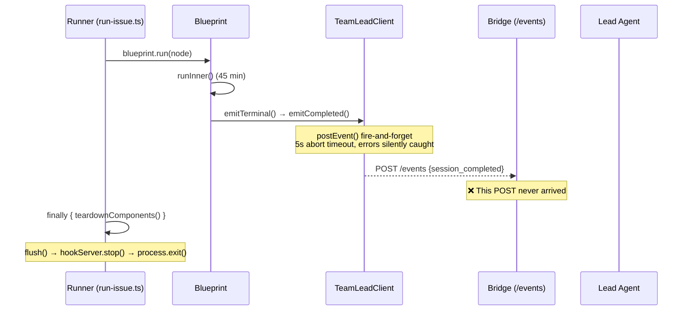

# Exploration: Runner session_completed Event Missing — GEO-261

**Issue**: GEO-261 ([Bug] Runner 成功完成但 session_completed 事件未送达 Bridge)
**Date**: 2026-03-25
**Status**: Complete

## Problem

Runner 成功完成 GEO-95（创建 PR #87，`success: true`，耗时 45 分钟），但 Bridge 没有收到 `session_completed` 事件。

Bridge 日志时间线：
```
00:48:57  session_started   ✅  (Runner → Bridge POST /events)
00:58:32  session_stuck     ✅  (Bridge HeartbeatService internal)
01:08:32  session_stuck     ✅  (Bridge HeartbeatService internal)
01:34:00  Runner completes       (success: true, PR created)
          session_completed  ❌  MISSING
```

关键环境因素：`run-issue.ts` 从 Claude Code session 内部调用（脚本输出 `WARNING: Running inside Claude Code session`）。

## Event Delivery Chain Analysis



## Code Path Detail

### 1. Blueprint.emitTerminal() (`Blueprint.ts:481-504`)

```typescript
private async emitTerminal(env, result): Promise<void> {
    if (!this.eventEmitter) return;  // Guard: no emitter → silent return
    try {
        if (result.success || result.decision) {
            await Promise.race([
                this.eventEmitter.emitCompleted(env, result, summary),
                new Promise<void>((r) => setTimeout(r, 1000)),  // 1s timeout
            ]);
        } else {
            // emitFailed path...
        }
    } catch (err) {
        console.warn(`[Blueprint] emitTerminal failed: ...`);  // Swallowed!
    }
}
```

**注意**: `emitCompleted()` 是 fire-and-forget（内部不 await `postEvent()`），所以 Promise.race 的 1s 超时实际无意义 — `emitCompleted()` 总是立即 resolve。

### 2. TeamLeadClient.postEvent() (`ExecutionEventEmitter.ts:155-181`)

```typescript
private async postEvent(body): Promise<void> {
    try {
        const controller = new AbortController();
        const timeout = setTimeout(() => controller.abort(), 5_000);
        const res = await fetch(`${this.baseUrl}/events`, { ... });
        clearTimeout(timeout);
        if (!res.ok) console.warn(`Event rejected: ${res.status}`);
    } catch (err) {
        console.warn(`Failed to post event: ...`);  // Error SWALLOWED
    }
}
```

**关键**: 5 秒 abort timeout + try-catch 吞错误 → HTTP 失败完全静默。

### 3. teardownComponents() (`setup.ts:601-611`)

```typescript
export async function teardownComponents(c) {
    await c.eventEmitter.flush();    // Wait for pending promises
    await c.hookServer.stop();       // Then close callback server
    // ...
}
```

`flush()` 调用 `Promise.allSettled(this.pending)` 等待所有 pending HTTP 请求完成。顺序正确。

## Root Cause Hypotheses

### H1: POST /events 请求失败（静默吞错） — ⭐ 最可能

**机制**: `postEvent()` 的 5 秒 abort timeout 触发，或 Bridge 不可达（连接拒绝/超时），错误被 try-catch 静默吞掉。

**证据**:
- `session_started` 在 00:48 成功送达，但 `session_completed` 在 01:34 送达失败
- 45 分钟间隔内 Bridge 可能已重启或端口变更
- `postEvent()` 的 catch 只 warn 不 retry，不抛错
- `flush()` 看到的是一个已 resolved 的 promise（因为 catch 吞了错误）

**验证方法**: 在 `postEvent()` 中添加结构化日志，记录 HTTP 状态码和错误详情。

### H2: 进程被外部信号终止 — ⭐ 可能

**机制**: 从 Claude Code session 内部跑 `run-issue.ts` 时，外部 session 可能发送 SIGTERM/SIGINT 终止子进程。Node.js 在收到信号后 `finally` 块的 async 操作可能不完整执行。

**证据**:
- Issue 明确提到 "WARNING: Running inside Claude Code session"
- `teardownComponents()` 是 async 操作，包含 `flush()` 和 `hookServer.stop()`
- 如果进程在 `flush()` 之前被 kill，pending 事件丢失

**验证方法**: 添加 `process.on('SIGTERM', ...)` handler 确保 flush。

### H3: Blueprint result 判定为 failure — 低

**机制**: `result.success` 为 false 且没有 `result.decision`，导致 `emitFailed()` 而非 `emitCompleted()`。

**证据**: Issue 说 Bridge 也没收到 `session_failed`，所以不太可能是路径选择问题。更像是 terminal event 完全没送出。

**排除条件**: 如果 Bridge 收到了 `session_failed` 则此假设成立。

### H4: this.eventEmitter 为 null — 极低

**机制**: `emitTerminal()` 第一行 `if (!this.eventEmitter) return` 导致静默返回。

**证据**: `session_started` 成功送达说明 eventEmitter 在 session 开始时存在。但如果中途被 GC 或重新赋值...极不可能。

## Recommended Fix Direction

1. **必须修**: `postEvent()` 失败时至少重试一次 terminal events（session_completed / session_failed）
2. **必须修**: `emitTerminal()` 应 await `postEvent()` 而非 fire-and-forget（对 terminal events）
3. **应该修**: 添加 process signal handler 确保 graceful shutdown
4. **应该修**: `postEvent()` 对 terminal events 的日志从 warn 升级为 error
5. **可选**: Bridge 端添加 orphan session 超时后主动发 `session_timeout` 事件

## Scope

修复应限于 `packages/edge-worker/src/` 中的事件发射链路。不改 Bridge 端接收逻辑（那部分工作正常）。
