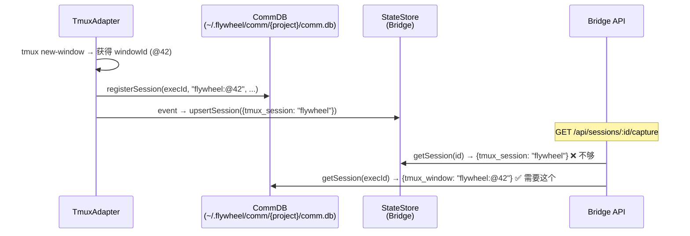

# Exploration: Lead tmux 可见性 — GEO-262

**Issue**: GEO-262 ([Lead] Phase 3: Lead tmux 可见性 — Lead 能看 Runner 在干什么)
**Domain**: Backend (Bridge API + tmux)
**Date**: 2026-03-25
**Depth**: Standard
**Mode**: Technical
**Status**: final

---

## 0. 问题陈述

Lead（Peter/Oliver）管理多个 Runner 但完全看不到 Runner 在干什么。只能通过 Bridge 元数据（status、heartbeat、last_activity）猜测进度。

**真实案例**: GEO-252 E2E 中 Peter 以为 Runner "卡住了"（42 分钟无 activity 更新），实际上 Runner 已经创建了 PR 并在等 CI。

**目标**: Bridge 新增 `GET /api/sessions/{id}/capture` 接口，返回 Runner 当前 tmux 终端的文本输出。

---

## 1. 核心架构约束

### 1.1 双数据库问题（关键发现）

系统有**两个独立的 SQLite 数据库**存储 tmux 信息：

| 数据库 | 包 | 引擎 | tmux 字段 | 存储内容 | 示例 |
|--------|-----|-------|-----------|----------|------|
| **StateStore** | `teamlead` | sql.js | `tmux_session` | tmux session 名称 | `"flywheel"` |
| **CommDB** | `flywheel-comm` | better-sqlite3 (WAL) | `tmux_window` | 完整 tmux 目标（session:window） | `"flywheel:@42"` |

**`tmux capture-pane` 需要完整目标**（如 `flywheel:@42`），仅有 session 名称（`flywheel`）不够。

### 1.2 数据流



### 1.3 已有基础

- **`flywheel-comm/src/commands/capture.ts`**: 已实现完整的 capture 逻辑
  - 打开 CommDB → 查询 session → 获取 `tmux_window` → `execFileSync("tmux", ["capture-pane", ...])`
  - 支持 `lines` 参数（默认 100 行）
  - 错误处理：DB 不存在、session 不存在、tmux window 不存在
- **`CommDB.openReadonly()`**: 已有只读打开模式（跳过 schema/migration/purge）
- **Bridge `tools.ts`**: 已有 `/api/sessions/:id` 路由，添加 `/api/sessions/:id/capture` 自然
- **Bridge `actions.ts`**: terminate action 已有调用 tmux 的先例（`execFileAsync("tmux", ["kill-session", ...])`)
- **CommDB 路径约定**: `~/.flywheel/comm/{projectName}/comm.db`

---

## 2. Affected Files and Services

| File/Service | Impact | Notes |
|-------------|--------|-------|
| `packages/teamlead/src/bridge/tools.ts` | **modify** | 添加 `GET /sessions/:id/capture` 路由 |
| `packages/teamlead/src/bridge/plugin.ts` | **modify** | 传递项目配置给 query router |
| `packages/teamlead/package.json` | **modify** | 添加 `flywheel-comm` 依赖（Option A） |
| `packages/teamlead/src/__tests__/tools.test.ts` | **modify** | 添加 capture 端点测试 |
| `doc/reference/product-lead-TOOLS.md` | **modify** | 更新 Lead agent 使用指引 |

---

## 3. Options Comparison

### Option A: 复用 flywheel-comm capture 逻辑（推荐）

**Core idea**: Bridge 导入 flywheel-comm 的 CommDB，通过只读模式查询 tmux 窗口目标，然后执行 capture-pane。

**实现流程**:
1. `GET /api/sessions/:id/capture?lines=100`
2. 从 StateStore 查 session → 获取 `project_name` + `execution_id`
3. 派生 CommDB 路径: `~/.flywheel/comm/{projectName}/comm.db`
4. `CommDB.openReadonly(dbPath)` → `getSession(execId)` → `tmux_window`
5. `execFileSync("tmux", ["capture-pane", "-t", tmuxWindow, "-p", "-S", `-${lines}`])`
6. 返回文本

**Pros**:
- **代码最少**: 复用 flywheel-comm 已有的 CommDB + capture 逻辑
- **精确定位**: 使用 CommDB 存储的完整 tmux 目标（如 `flywheel:@42`）
- **已验证**: capture 逻辑在 Phase 2 中已被测试和使用
- **Best-effort 语义**: 不按 session status 拒绝，直接尝试 capture-pane，窗口不存在则报错

**Cons**:
- **新依赖**: `packages/teamlead` 需要添加 `flywheel-comm` 依赖（引入 better-sqlite3）
- **跨 DB 耦合**: Bridge 同时读 StateStore 和 CommDB
- **CommDB 可能不存在**: 如果 Runner 未使用 flywheel-comm（老 session 或配置缺失）

**Effort**: Small（1-2 天）
**What gets cut**: ANSI 颜色处理（返回原始文本，Lead 端处理）

---

### Option B: 扩展 StateStore 存储完整 tmux 目标

**Core idea**: 修改 StateStore schema，添加 `tmux_target` 字段（存储完整 `flywheel:@42`），在 event pipeline 中传递。Bridge 只读 StateStore 即可完成 capture。

**实现流程**:
1. StateStore schema 新增 `tmux_target TEXT` 列
2. TmuxAdapter 在 session event 中传递 `tmux_target = "flywheel:@42"`
3. event-route 将 tmux_target 存入 StateStore
4. Bridge 直接从 StateStore 读取 tmux_target → capture-pane

**Pros**:
- **架构更干净**: Bridge 只读自己的 StateStore，不依赖 CommDB
- **无跨 DB 耦合**: 单一数据源
- **无新依赖**: 不需要引入 better-sqlite3

**Cons**:
- **改动面更大**: schema migration + event pipeline + DagDispatcher + TmuxAdapter 全链路改动
- **数据冗余**: 同一信息存两个 DB（CommDB 也有 tmux_window）
- **需要回填**: 已运行的 session 没有 tmux_target，需要 fallback 逻辑

**Effort**: Medium（2-3 天）
**What gets cut**: 同 Option A

---

### 推荐: Option A

**理由**:

1. **变更最小**: Option A 只改 Bridge query 层 + 添加依赖；Option B 要改 5+ 个文件横跨 3 个包
2. **CommDB 路径确定性高**: 约定 `~/.flywheel/comm/{project}/comm.db`，且 Bridge 已有 project 配置
3. **better-sqlite3 已在 monorepo**: flywheel-comm 已使用，不引入新的 native 依赖
4. **CommDB 不存在是可预期的**: 返回明确错误即可，不影响其他功能
5. **与 Phase 2 设计一致**: GEO-206 Phase 2 plan 已将 capture 基于 CommDB 设计

Option B 更"干净"但 ROI 不值 — 多一倍的工作量，且 CommDB 本身就是 Lead ↔ Runner 通信层，Bridge 读它是合理的。

---

## 4. 设计细节（Option A 展开）

### 4.1 API 设计

```
GET /api/sessions/:id/capture?lines=100

Response 200:
{
  "execution_id": "abc-123",
  "tmux_target": "flywheel:@42",
  "lines": 100,
  "output": "... terminal text ...",
  "captured_at": "2026-03-25T12:00:00Z"
}

Response 404 (session not found):
{ "error": "Session not found" }

Response 404 (CommDB not found):
{ "error": "Communication database not found for project 'geoforge3d'" }

Response 404 (no tmux window in CommDB):
{ "error": "No tmux window registered for execution abc-123" }

Response 502 (tmux window gone):
{ "error": "tmux window not found: flywheel:@42" }
```

### 4.2 CommDB 路径解析

```typescript
function getCommDbPath(projectName: string): string {
  return join(homedir(), ".flywheel", "comm", projectName, "comm.db");
}
```

### 4.3 安全考虑

- **Auth**: 已通过 `/api` 的 `tokenAuthMiddleware` 保护（apiToken）
- **Input validation**: `lines` 参数限制范围 (1-500)，防止过大的 capture
- **Shell injection**: 使用 `execFileSync`（非 exec），参数不经过 shell
- **只读 DB 访问**: 使用 `CommDB.openReadonly()` 打开，不影响 Runner 写入

### 4.4 测试策略

1. **Unit tests** (`tools.test.ts`):
   - Session 存在 → 返回 capture 文本
   - Session 不存在 → 404
   - CommDB 不存在 → 404 + 明确错误信息
   - tmux window 不存在 → 502
   - lines 参数验证
2. **需要 mock**: CommDB + execFileSync（tmux capture-pane）

---

## 5. 架构方向讨论：tmux capture-pane vs Agent-to-Agent

用户提出关键问题：Lead 和 Runner 都是 agent，是否应该用 agent-to-agent 通信而非 tmux 截屏？

### 调研结果

业界多 agent 系统（claude_code_agent_farm、Ruflo、ntm）**全都用 tmux** 做监控。Claude Agent SDK 提供 `SDKTaskProgressMessage` 但只是摘要级别。Claude Code Hooks（HTTP POST）可以在每次工具调用时推送事件。

### 三种方案对比

| | tmux capture-pane | Runner progress 消息 | HTTP Hooks |
|---|---|---|---|
| 工作量 | **Small (1-2 天)** | Medium (2-3 天) | Medium (2-3 天) |
| Runner 卡住时 | ✅ 有效 | ❌ 无效 | ⚠️ 部分 |
| 多机部署 | ❌ 同机器 | ✅ 跨机器 | ✅ 跨机器 |
| 可靠性 | 高 | 低 | 高 |

### 决定：两步走

1. **GEO-262**: 先做 tmux capture-pane（解决当前痛点，1-2 天）
2. **新 issue（后续）**: HTTP Hooks 结构化监控（跨机器 ready）

---

## 6. User Decisions

### Q1: ANSI escape codes 处理
**答案**: 不需要特殊处理。**调研发现 `tmux capture-pane -p` 不加 `-e` 标志时默认返回纯文本，自动去除 ANSI 颜色代码**。这正好满足 AI agent 的需求。

### Q2: flywheel-comm CLI capture 子命令
**答案**: **做**。加 CLI 方便调试。用户表示"主要是要存取去用"。

### Q3: Lead agent 如何使用
**答案**: **加到 TOOLS.md**。和现有 session 查询一样的使用模式，Lead 通过 curl 调用 Bridge API。

### 架构方向
**答案**: **两步走** — GEO-262 先做 capture-pane API，后续新 issue 做 HTTP Hooks 结构化监控。理由：capture-pane 最快上线且在 Runner 卡住时也有效（核心痛点）。

---

## 7. Suggested Next Steps

- [x] 架构方向确认（两步走：capture-pane → HTTP Hooks）
- [x] Q1-Q3 决定完成
- [ ] 写 implementation plan（/write-plan）
- [ ] TDD 实现：先写测试 → 再实现 API + CLI
- [ ] 更新 `doc/reference/product-lead-TOOLS.md` Lead 使用指引
- [ ] 创建后续 issue：HTTP Hooks 结构化 Runner 监控
