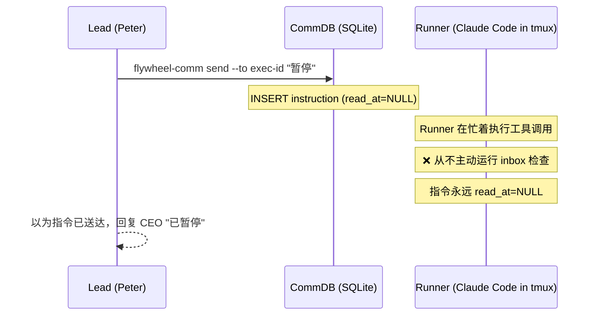
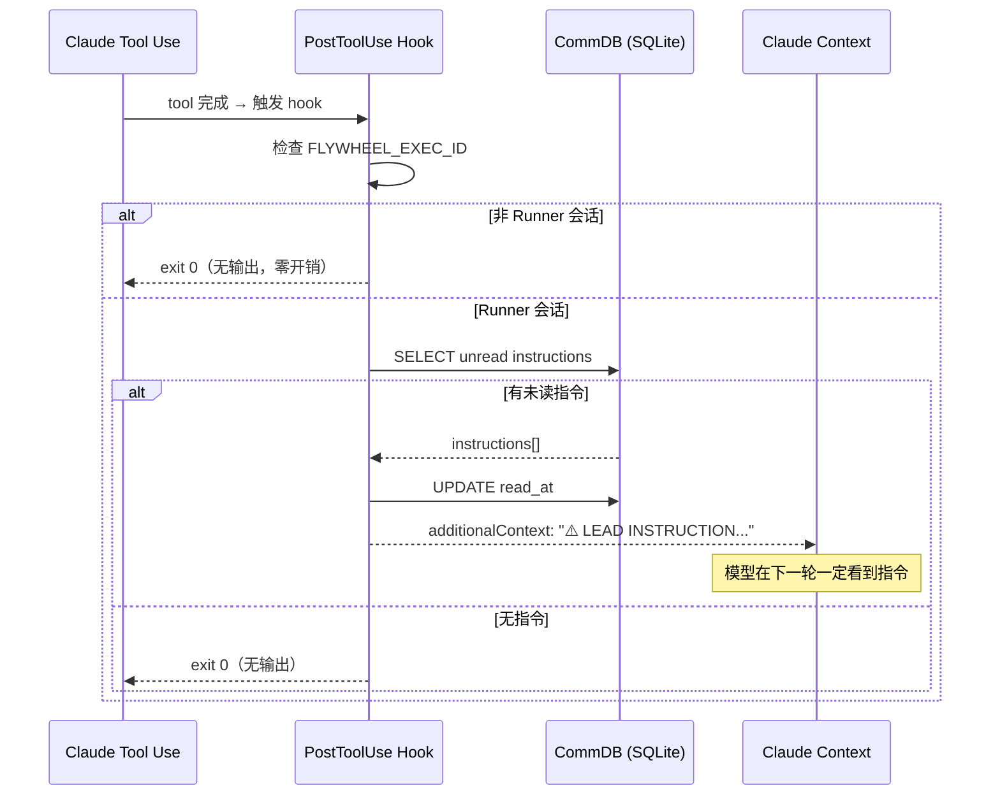

# Exploration: Runner Inbox Polling Fix — GEO-266

**Issue**: GEO-266 ([Bug] Runner 不检查 Lead inbox — send/inbox 实际不可用)
**Domain**: Backend / Infrastructure
**Date**: 2026-03-26
**Depth**: Deep
**Mode**: Technical
**Status**: final

## 0. Product Research

Product research skipped (Technical mode)

## 1. Problem Analysis

### 根因

GEO-206 Phase 2 实现了 Lead → Runner 指令通道，但仅通过 **prompt engineering** 告诉 Runner "定期检查 inbox"：

```typescript
// Blueprint.ts:312-321
systemPromptLines.push(
  `Additionally, your Lead may send you proactive instructions. ` +
  `Periodically check for instructions with ` +
  `\`node ${commCliPath} inbox --exec-id ${executionId}\`. ` +
  `Check at task boundaries...`
);
```

Claude Code 在连续执行工具调用时，不会主动中断去执行 inbox 检查命令。这是 LLM agent 的固有行为——当模型在 "执行模式" 中（连续 tool use），它不会插入自发的 shell 命令。

### 数据流



### 为什么 prompt engineering 不够

1. Claude Code 的 tool calling loop 是紧密耦合的：模型决定下一步 → 调用工具 → 收到结果 → 决定下一步。中间没有 "检查 inbox" 的自然插入点
2. `--append-system-prompt` 的指令优先级低于模型当前的工作上下文
3. 即使模型 "记得" 要检查，在编译/测试/写代码的密集执行中也不会中断

## 2. Affected Files and Services

| File/Service | Impact | Notes |
|-------------|--------|-------|
| TmuxAdapter (`claude-runner/src/TmuxAdapter.ts`) | modify | 注入新环境变量 `FLYWHEEL_EXEC_ID` |
| Blueprint (`edge-worker/src/Blueprint.ts`) | minor modify | 可选：简化 inbox prompt（hook 替代 prompt） |
| `packages/flywheel-comm/scripts/inbox-hook.sh` | **new** | PostToolUse hook 脚本 |
| `~/.claude/settings.json` 或 project settings | modify | 注册 PostToolUse hook |
| flywheel-comm inbox CLI | no change | 现有 inbox 命令已够用 |
| CommDB schema | no change | 现有 messages 表结构已够用 |

## 3. Architecture Constraints

### Runner 启动方式

TmuxAdapter 用 CLI 启动 Runner（不是 SDK）：

```typescript
// TmuxAdapter.ts:144-158
this.execFileFn("tmux", [
  "new-window", "-P", "-F", "#{window_id}",
  "-t", `=${this.sessionName}`,
  ...envArgs,
  "-n", windowName, "-c", ctx.cwd,
  "claude", ...claudeArgs,
]);
```

这意味着：
- **SDK 编程式 hooks 不可用**（`query()` 的 `hooks` 参数仅限 SDK 模式）
- **CLI 文件式 hooks 可用**（`~/.claude/settings.json` 或 `.claude/settings.local.json`）
- TmuxAdapter 已注入 `FLYWHEEL_COMM_DB` 环境变量到 tmux 环境

### Hook 机制

Claude Code PostToolUse hook：
- 在每次工具调用完成后自动运行
- 通过 stdin 接收 JSON（`session_id`, `tool_name`, `tool_input`, `tool_response`）
- 通过 stdout 返回 JSON，可包含 `additionalContext` 注入到对话
- 配置在 settings.json 文件中（用户级 / 项目级 / 本地级）

```json
{
  "hookSpecificOutput": {
    "hookEventName": "PostToolUse",
    "additionalContext": "Lead 指令内容..."
  }
}
```

### 现有环境变量

TmuxAdapter 已注入：
- `FLYWHEEL_COMM_DB` — CommDB 路径
- `FLYWHEEL_CALLBACK_PORT` — Hook callback server 端口
- `FLYWHEEL_CALLBACK_TOKEN` — 回调 token
- `FLYWHEEL_ISSUE_ID` — Issue ID

**缺少**: `FLYWHEEL_EXEC_ID` — Runner 的 execution ID（inbox 查询需要）

## 4. External Research

### Claude Code Hooks 机制

来源：[Claude Code Hooks Reference](https://code.claude.com/docs/en/hooks)、[Claude Agent SDK Hooks](https://platform.claude.com/docs/en/agent-sdk/hooks)

关键发现：
1. PostToolUse hook 返回的 `additionalContext` 会**追加到工具结果**中，模型一定会看到
2. Hook 通过 stdin 接收 JSON，通过 stdout 返回 JSON，exit 0 为成功
3. Hook 配置位置优先级：managed policy > user settings > project settings > local settings
4. **没有 CLI 参数**可以直接传递 hook 配置——必须通过 settings 文件
5. SDK 模式支持编程式 hooks（TypeScript callbacks），CLI 模式仅支持文件式 hooks

### 行业实践

Agent-to-agent 指令传递的常见模式：
- **Polling with hooks** — 最常见：定期检查 + 自动注入（Claude Code 的 hooks 就是这个）
- **Event-driven push** — 需要运行时支持中断模型执行（Claude Code 不支持）
- **Shared memory** — 写入共享空间，模型在 context 中看到（类似 additionalContext）

## 5. Options Comparison

### Option A: 项目级 PostToolUse Hook（TmuxAdapter 自动部署）

**核心思路**: TmuxAdapter 在启动 Runner 前，自动将 inbox hook 写入目标项目的 `.claude/settings.local.json`

**流程**:
1. TmuxAdapter 注入 `FLYWHEEL_EXEC_ID` 到 tmux 环境
2. TmuxAdapter 读取目标项目的 `.claude/settings.local.json`（如果存在）
3. Merge 一个 PostToolUse hook 条目
4. 启动 Claude CLI（它会读取该 settings 文件）
5. Runner 完成后，TmuxAdapter 恢复原始 settings

**Hook 脚本** (`inbox-hook.sh`):
```bash
#!/bin/bash
EXEC_ID="${FLYWHEEL_EXEC_ID:-}"
DB_PATH="${FLYWHEEL_COMM_DB:-}"
if [ -z "$EXEC_ID" ] || [ -z "$DB_PATH" ] || [ ! -f "$DB_PATH" ]; then exit 0; fi

COUNT=$(sqlite3 "$DB_PATH" "SELECT COUNT(*) FROM messages WHERE to_agent='$EXEC_ID' AND type='instruction' AND read_at IS NULL AND expires_at > datetime('now');" 2>/dev/null)
if [ "$COUNT" -gt "0" ]; then
  MSGS=$(sqlite3 "$DB_PATH" "SELECT '['||from_agent||'] '||content FROM messages WHERE to_agent='$EXEC_ID' AND type='instruction' AND read_at IS NULL AND expires_at > datetime('now');" 2>/dev/null)
  sqlite3 "$DB_PATH" "UPDATE messages SET read_at=datetime('now') WHERE to_agent='$EXEC_ID' AND type='instruction' AND read_at IS NULL;" 2>/dev/null
  printf '{"hookSpecificOutput":{"hookEventName":"PostToolUse","additionalContext":"⚠️ LEAD INSTRUCTION — READ AND ACT NOW:\\n%s"}}' "$MSGS"
fi
exit 0
```

- **Pros**: 完全自动化，无需手动设置
- **Cons**: 写入目标项目的 settings 文件，可能冲突；merge/restore 复杂度高；多 Runner 竞争写同一文件
- **Effort**: Medium
- **Affected files**: `TmuxAdapter.ts`（settings 文件操作），`inbox-hook.sh`（新建）
- **What gets cut**: 不处理 settings 文件备份失败的边缘情况

### Option B: 用户级 PostToolUse Hook + 环境变量守卫（推荐）

**核心思路**: 一次性在用户 `~/.claude/settings.json` 添加 PostToolUse hook。Hook 通过检查 `FLYWHEEL_EXEC_ID` 环境变量来判断是否在 Runner 会话中——非 Runner 会话直接 exit 0，零开销。

**流程**:
1. 一次性设置：在 `~/.claude/settings.json` 的 PostToolUse hooks 中添加 inbox check hook
2. 部署 hook 脚本到 `~/.flywheel/hooks/inbox-check.sh`
3. TmuxAdapter 注入 `FLYWHEEL_EXEC_ID` 到 tmux 环境（新增 1 行代码）
4. 每次工具调用后，hook 自动检查 inbox → 如有指令，注入 additionalContext

**Hook 脚本** (同上，使用 `sqlite3` CLI 避免 Node.js 启动开销):



- **Pros**: 最简单；与现有 hook 模式一致（用户已有多个 PostToolUse hooks）；无运行时文件操作；无竞争条件；非 Runner 会话零开销
- **Cons**: 需要一次性手动/脚本设置；修改用户全局 settings（但已有先例）
- **Effort**: Small
- **Affected files**: `TmuxAdapter.ts`（+1 行 env 注入），`~/.flywheel/hooks/inbox-check.sh`（新建），`~/.claude/settings.json`（添加 hook 条目）
- **What gets cut**: 不自动安装 hook（需要 setup 步骤或 /setup-flywheel-hooks skill）

### Option C: SDK 迁移 — 切换到编程式 Hooks（长期方案）

**核心思路**: 将 Runner 从 TmuxAdapter（CLI 启动）迁移到基于 SDK `query()` 的新 adapter，使用 TypeScript 编程式 PostToolUse hooks。

**流程**:
1. 创建 `SdkTmuxAdapter`：用 SDK `query()` 执行 Runner，同时在 tmux pane 显示输出
2. 在 SDK hooks 中注册 PostToolUse callback，直接用 TypeScript 检查 CommDB
3. 如有指令，返回 `{ hookSpecificOutput: { additionalContext: "..." } }`

```typescript
// 伪代码
const inboxHook: HookCallback = async (input, toolUseID, { signal }) => {
  const msgs = commDb.getUnreadInstructions(execId);
  if (msgs.length > 0) {
    for (const m of msgs) commDb.markInstructionRead(m.id);
    return {
      hookSpecificOutput: {
        hookEventName: "PostToolUse",
        additionalContext: `⚠️ LEAD INSTRUCTION: ${msgs.map(m => m.content).join('\n')}`
      }
    };
  }
  return {};
};
```

- **Pros**: 最灵活；TypeScript 类型安全；无 shell 脚本依赖；可扩展性强
- **Cons**: **重大架构变更**——需要构建 SdkTmuxAdapter；失去原生交互式 tmux 体验（pane 变只读）；工作量最大
- **Effort**: Large (1-2 周)
- **Affected files**: 新建 `SdkTmuxAdapter.ts`；修改 `setup.ts` adapter factory；可能影响 Blueprint
- **What gets cut**: 交互式 tmux（用户不能在 tmux 里直接和 Runner 交互）

### Recommendation: Option B（用户级 Hook）

**理由**:
1. **投入产出比最高** — 仅需 1 个 shell 脚本 + TmuxAdapter 加 1 行环境变量注入
2. **与现有模式完全一致** — 用户的 `~/.claude/settings.json` 已有 5+ 个 PostToolUse hooks
3. **零架构变更** — 不需要修改 Runner 启动方式、不需要 merge settings 文件
4. **可靠性高** — PostToolUse hook 由 Claude Code 保证执行，additionalContext 保证注入
5. **向前兼容** — 日后迁移到 SDK 模式（Option C）时，hook 逻辑直接转为 TypeScript callback

Option C 是 v2.0 的方向，但现在的 bug fix 不需要这么大的投入。

## 6. Clarifying Questions

### Scope
- Q1: Hook 脚本部署位置？
- Q2: 是否需要自动安装 skill？

### 行为
- Q3: 指令优先级 — urgent vs normal？

### 测试
- Q4: E2E 测试方式？

## 7. User Decisions

### 架构原则（CEO 决策）
**Flywheel 是安装包，不是运行时依赖。** 安装后目标环境必须自包含：
- 运行环境不一定有 Flywheel repo
- 部署的脚本/hooks 必须复制到独立位置（`~/.flywheel/`）
- 不能有回指 Flywheel 仓库的绝对路径
- 版本更新通过 "重新运行 setup" 完成

### Q1: Hook 脚本位置
**决定**: `~/.flywheel/hooks/inbox-check.sh` — setup 时从 Flywheel 仓库复制过去，运行时独立。

### Q2: 自动安装
**决定**: 做一个 `/setup-flywheel-hooks` skill，自动复制脚本 + 注册到 `~/.claude/settings.json`。

### Q3: 指令优先级
**决定**: 支持两种优先级：
1. **urgent** — "STOP EVERYTHING AND EXECUTE THIS NOW"（Lead 要求立即暂停/改方向）
2. **normal** — "在下一个自然断点执行"（补充信息/建议）

实现方式：`flywheel-comm send` 增加 `--priority urgent|normal` 参数，CommDB messages 表加 `priority` 字段，hook 脚本根据 priority 生成不同措辞的 additionalContext。

### Q4: E2E 测试
**决定**: Peter 真实测试 — 启动 Runner → Peter 发 send 指令 → 验证 Runner 下一次 tool use 后收到并执行。

## 8. Suggested Next Steps

- [x] 确认 Option B 方向 ✅
- [x] 确认架构原则（Flywheel = installer）✅
- [x] 确认指令优先级（urgent + normal）✅
- [x] 确认 E2E 测试方式 ✅ Peter 真实测试
- [ ] 进入 /research 阶段
- [ ] 进入 /write-plan 阶段
