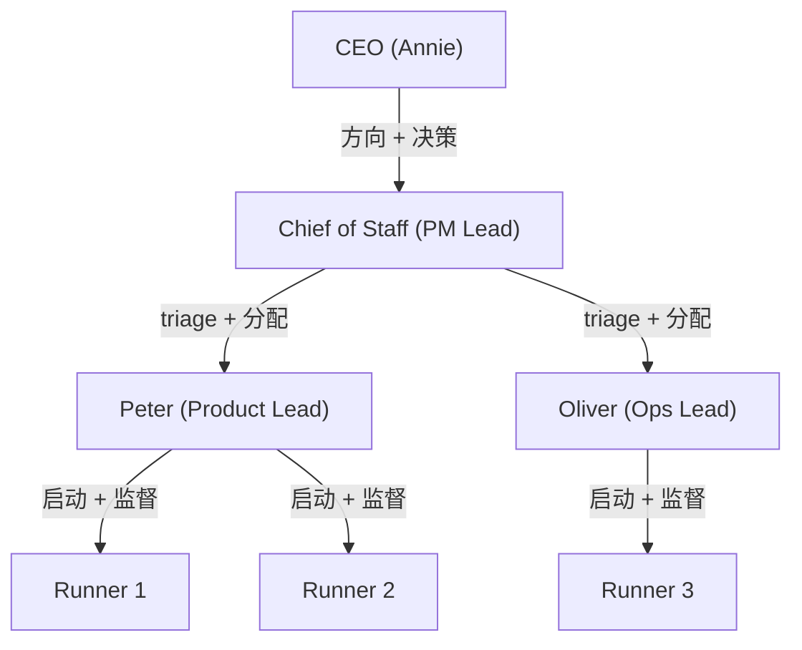
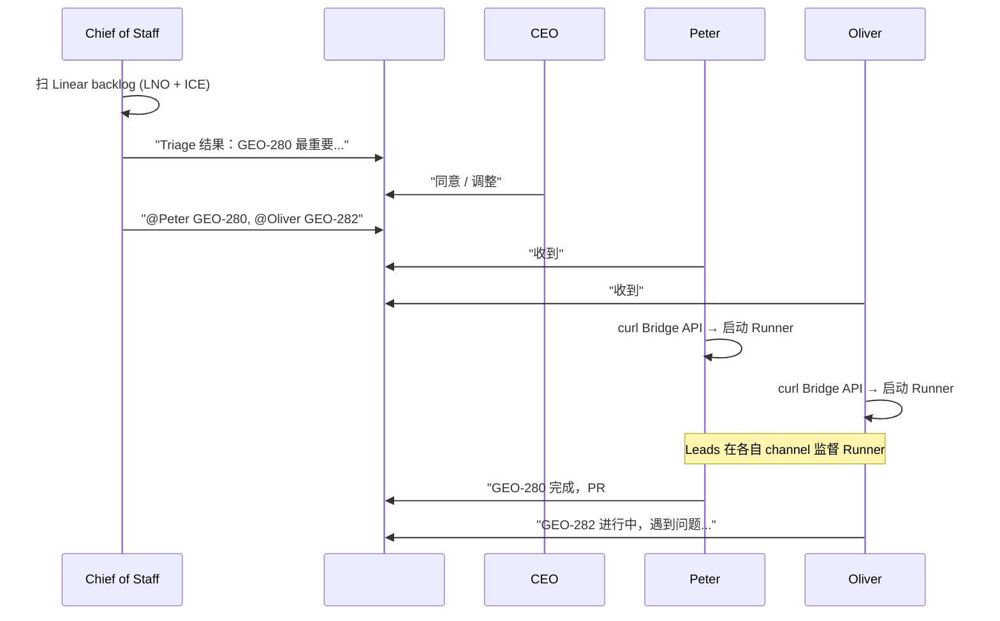
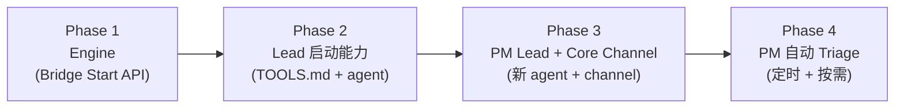

# Exploration: Lead 自动启动 Runner + PM Lead (Chief of Staff) — GEO-267

**Issue**: GEO-267 ([Product] Lead 自动启动 Runner — 去掉手动 run-issue.ts)
**Domain**: Product + Backend (orchestration / infrastructure)
**Date**: 2026-03-27
**Depth**: Deep
**Mode**: Both (Product + Technical)
**Status**: final

---

## 0. Product Research

### Problem Statement

CEO 需要手动在终端执行 `npx tsx scripts/run-issue.ts GEO-XXX ~/Dev/Project` 来启动 Runner。这违背了 v2.0 愿景的核心理念 —— **最小化 CEO 注意力消耗**。当前流程要求 CEO：

1. 离开 Discord（主交互界面）
2. 打开终端，记住命令和参数
3. 分别去各 Lead 的 channel 分配任务（随着 Lead 增多，注意力分散加剧）

此外，没有统一的 triage 机制 —— CEO 需要自己决定所有 issue 的优先级，手动分配给各 Lead。

### Target Users

- **CEO (Annie)** — 希望在一个 channel 完成所有任务分配，不用逐个 channel 去安排
- **Lead (Peter/Oliver)** — 希望收到明确的任务指令后自主启动 Runner 执行
- **PM Lead (Chief of Staff, 新增)** — 负责 triage backlog、优先级排序、任务分配

### v2.0 愿景对齐

v2.0 Product Vision 已描述目标模型：

```
晚间（自主运行）：
Lead 扫 Linear backlog → 发现可做的 issue → 检查系统资源 → 启动 Runner

早上（站会）：
各 Lead 发日报 → CEO 看报告 → 讨论方向和优先级

日间（按需交互）：
CEO 有需求 → 通过 Discord 交互 → Lead/PM 执行
```

当前缺失两个核心能力：
1. **Lead 启动 Runner 的技术能力** (Engine)
2. **统一的 triage + 任务分配机制** (PM Lead + Core Channel)

---

## 1. 产品愿景：Core Channel + Chief of Staff

### 1.1 组织架构



### 1.2 Core Channel Channel

所有 agent 和 CEO 共同参与的统一 Discord channel：

```
┌─────────────────────────────────────────────────┐
│  #geoforge3d-core                                       │
│                                                  │
│  PM: "Triage 完成。当前最重要的任务：             │
│    1. GEO-280 [Product] — Leverage, ICE=72       │
│    2. GEO-282 [Ops] — Leverage, ICE=65           │
│    3. GEO-275 [Product] — Neutral, 可延后"        │
│                                                  │
│  CEO: "同意。GEO-280 先做"                        │
│                                                  │
│  PM: "@Peter GEO-280 归你，@Oliver GEO-282"       │
│                                                  │
│  Peter: "收到，启动 Runner"                       │
│  Oliver: "明白"                                   │
│                                                  │
│  (Leads 回各自 channel 启动 Runner 执行)           │
└─────────────────────────────────────────────────┘
         ↓                    ↓
  #peter-forum          #oliver-forum
  (Peter → Runner)      (Oliver → Runner)
```

### 1.3 角色职责

| 角色 | 职责 | 在 Core Channel 做什么 | 技术能力 |
|------|------|-------------------|---------|
| **CEO** | 定方向、做决策 | 看 triage 结果、确认优先级、偶尔给新指令 | Discord |
| **PM (Chief of Staff)** | Triage + 分配 | 扫 Linear backlog、LNO/ICE 排序、分配给 Lead | Linear API, Bridge API (查状态) |
| **Lead (Peter/Oliver)** | 执行 + 监督 | 领取任务、反馈进度 | Bridge API (启动 Runner, 查状态), flywheel-comm |
| **Runner** | 写代码 | 不参与 geoforge3d-core | Claude Code in tmux |

### 1.4 日常运行流程



### 1.5 Triage 机制

复用 GeoForge3D 已有的 `pm-triage` skill 的核心逻辑：

- **LNO 分类**: Leverage (10x) / Neutral (1:1) / Overhead (负 ROI)
- **ICE 评分**: Impact × Confidence × Ease (仅 Leverage 项)
- **数据源**: Linear API 查询项目 backlog
- **验证**: 不盲信 Linear status，检查代码/PR 实际状态
- **PM 需要项目 context**: 了解当前阶段、north star、团队能力（后续加 memory 支持）

### 1.6 资源约束

当前单机 (Mac) 环境：
- **总容量**: ~7-8 个 Claude Code 进程
- **常驻进程**: PM + Peter + Oliver + Bridge = 4
- **可用 Runner 槽位**: 3-4
- **maxConcurrentRunners**: 可配置，默认 3
- **后续**: 可能增加第二台机器扩容

---

## 2. 技术架构

### 2.1 分层设计

```
Layer 4: PM Triage 自动化 — PM 定时/按需扫 Linear, 分配任务
Layer 3: 多 Agent Core Channel — 多 bot 共享 channel, @mention 路由
Layer 2: Lead Triage 逻辑 — Lead 查状态、判断资源、启动 Runner
Layer 1: Engine — Bridge POST /api/runs/start (核心基础设施)
```

**无论上层模型如何变化，Layer 1 都是必需的基础。**

### 2.2 Layer 1: Bridge Start API (Engine)

**复用 RetryDispatcher 模式**，在 Bridge daemon 中添加 "启动 Runner" 能力。

**当前 Runner 启动链 (run-issue.ts)**:
```
run-issue.ts (手动)
  → loadConfig() + loadProjects()
  → setupComponents() → Blueprint + 子组件
  → git preflight (clean tree)
  → resolveLeadForIssue()
  → blueprint.run(node, projectRoot, ctx) — 核心
  → auto-interaction (trust prompt, tmux viewer)
  → evidence collection + Decision Layer
```

**RetryDispatcher 模式（已有）**:
```
Bridge POST /api/actions/retry
  → RetryDispatcher.dispatch(req)
    → blueprintsByProject.get(projectName)
    → Blueprint.run() (fire-and-forget)
    → single-flight per issue guard
```

**新增 Start 流程**:
```
Lead → curl POST /api/runs/start
  → RunDispatcher.start(req)
    → 验证: 并发限制 (maxConcurrentRunners)
    → 验证: 同一 issue 不重复启动
    → 获取 issue 数据: 从请求体 (Lead 传入)
    → Blueprint.run() (fire-and-forget)
    → 返回 { executionId, status: "started" }
```

**请求格式**:
```json
{
  "issueId": "GEO-280",
  "issueTitle": "[P0] Fix floating buildings",
  "issueDescription": "Buildings float above terrain...",
  "labels": ["Product"],
  "projectName": "GeoForge3D",
  "leadId": "product-lead"
}
```

Issue 数据由 Lead 传入（Lead 从 Linear/Discord 上下文获取），Bridge 不直接依赖 Linear API。

### 2.3 Layer 3: 多 Agent Core Channel (关键技术挑战)

当前每个 Lead 是独立的 Claude Code session + 独立 Discord bot，各自监听各自的 channel。

**Core Channel 的技术挑战**：让多个 bot 在同一个 channel 中有秩序地交互。

**方案**: @mention 路由
1. 每个 bot (PM, Peter, Oliver) 都加入 #geoforge3d-core channel
2. 只响应 @自己 的消息 + 全员通知
3. Discord 的 mention 机制天然支持（`<@bot_id>`）
4. Claude Code `--channels discord` 需要支持多 channel 监听

**Message 路由逻辑**:
```
geoforge3d-core 收到消息
  → 是否 @mention 了某个 bot？
    → 是 → 只有被 mention 的 bot 响应
    → 否 → PM 可能响应（作为默认接管者），其他 bot 忽略
```

### 2.4 Affected Files and Services

| File/Service | Impact | Layer | Notes |
|-------------|--------|-------|-------|
| `scripts/lib/retry-dispatcher.ts` | 扩展 | L1 | → RunDispatcher，支持 start + retry |
| `packages/teamlead/src/bridge/retry-dispatcher.ts` | 扩展接口 | L1 | IRetryDispatcher → IRunDispatcher |
| `packages/teamlead/src/bridge/tools.ts` | 新增 | L1 | `POST /api/runs/start` endpoint |
| `packages/teamlead/src/bridge/plugin.ts` | 修改 | L1 | 注册 start route |
| `packages/teamlead/src/config.ts` | 新增字段 | L1 | maxConcurrentRunners 配置 |
| Lead agent files (GeoForge3D) | 更新 | L2 | TOOLS.md 添加 start 能力 |
| PM agent file (新建) | 新建 | L3-4 | Chief of Staff agent config |
| Discord channel setup | 新建 | L3 | #geoforge3d-core channel + bot 权限 |
| `pm-triage` skill | 重构 | L4 | 从 CEO skill → PM agent 内置行为 |

---

## 3. Existing Patterns to Reuse

### 3.1 RetryDispatcher → RunDispatcher

`scripts/lib/retry-dispatcher.ts` 已有完整的 fire-and-forget Blueprint.run() 模式：
- `blueprintsByProject` Map — 预配置的 Blueprint 实例
- Single-flight per issue guard
- Inflight tracking
- Graceful shutdown (stopAccepting + drain)

扩展为 RunDispatcher，增加：
- `start()` method (vs 现有 `dispatch()` for retry)
- `maxConcurrentRunners` 检查
- Issue 数据接受（不依赖现有 session）

### 3.2 pm-triage Skill

GeoForge3D 的 `.claude/skills/pm-triage/SKILL.md` 已有：
- LNO (Leverage/Neutral/Overhead) 分类框架
- ICE (Impact/Confidence/Ease) 评分
- Linear API 查询 + 状态验证
- HTML dashboard 生成
- 中文输出

PM Lead 可以复用此框架作为核心 triage 逻辑。

### 3.3 Multi-Lead Architecture (GEO-246)

已有 per-lead bot token, per-lead workspace, per-lead statusTagMap 基础设施。
PM Lead 是第三个 Lead，复用相同的 `projects.json` 配置模式。

---

## 4. Q&A Decisions

### Q1: Scheduling Model
**决策**: PM Lead (Chief of Staff) + Core Channel Channel
- 新建 PM Lead agent，负责 triage + 分配
- 统一 #geoforge3d-core channel，所有 agent + CEO 共同参与
- Lead 直接在 geoforge3d-core 发言讨论
- 确定任务后，Lead 回各自 channel 启动 Runner

### Q2: 谁启动 Runner？
**决策**: Lead 自己启动
- PM 只做 triage + 分配，不直接启动 Runner
- Lead 收到任务后，通过 Bridge API 启动 Runner
- Lead 负责 Runner 的监督和结果 review

### Q3: Issue 数据来源
**决策**: Lead 传入
- Start 请求包含 issue title/description/labels
- Lead 从 Linear/Discord 上下文获取后传给 Bridge
- Bridge 不直接依赖 Linear API

### Q4: 并发控制
**决策**: 可配置，默认 3
- 常驻进程 (PM + 2 Lead + Bridge) = 4，总容量 ~7-8
- maxConcurrentRunners 默认 3，可在 Bridge 配置中调整

### Q5: Scope
**决策**: 先做完整设计，然后拆成多个 issue 渐进实现

---

## 5. 建议实施路径



| Phase | 内容 | 预估 | 依赖 |
|-------|------|------|------|
| **Phase 1** | Bridge `POST /api/runs/start`, RunDispatcher, maxConcurrentRunners | 1 周 | 无 |
| **Phase 2** | Lead TOOLS.md 更新, agent 行为配置 (接收 PM 指令后启动 Runner) | 2-3 天 | Phase 1 |
| **Phase 3** | PM Lead agent 创建, #geoforge3d-core channel, 多 bot 共享 channel, @mention 路由 | 1-2 周 | Phase 2 |
| **Phase 4** | PM triage 自动化 (Linear 扫描 + LNO/ICE + 分配), PM memory | 1-2 周 | Phase 3 |

---

## 6. Open Questions (Plan 阶段解决)

1. **Multi-channel monitoring**: Claude Code `--channels discord` 能否同时监听 geoforge3d-core + 自己的 forum？需要验证
2. **@mention 路由**: 多 bot 在同一 channel 时，如何确保只有被 mention 的 bot 响应？
3. **PM Lead 命名**: "Chief of Staff" 确认？还是其他名字？(Disney 角色命名惯例)
4. **PM Memory**: PM 需要项目 context 来做有效 triage — memory 机制怎么做？
5. **Trust Prompt**: Runner 启动时的 workspace trust 自动确认策略
