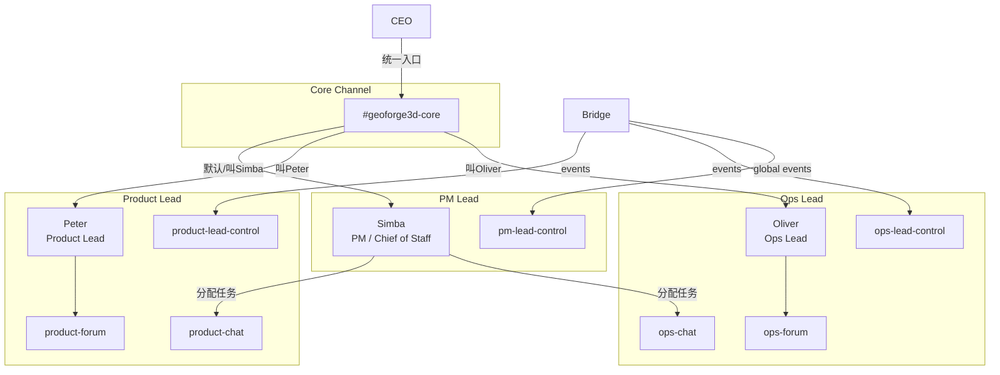

# Exploration: PM Lead Simba + Core Channel — GEO-275

**Issue**: GEO-275 (PM Lead Simba + Core Channel — Chief of Staff 统一调度)
**Date**: 2026-03-27
**Status**: Complete

---

## 背景

v2.0 愿景要求 CEO 能在一个统一 channel 完成所有任务分配，不用逐个 Lead channel 安排。当前架构中 Peter (Product) 和 Oliver (Ops) 各自有独立的 chat/forum/control channel，CEO 需要切换 channel 来与不同 Lead 交互。

GEO-275 引入第三个 Lead —— **Simba (PM Lead, Chief of Staff)**，并创建 **#geoforge3d-core** 作为统一交互入口。

## Simba 与 Peter/Oliver 的本质区别

| 维度 | Peter / Oliver | Simba |
|------|---------------|-------|
| 角色 | 部门 Lead — 管理 Runner | PM / Chief of Staff — 统一调度 |
| 管理 Runner | ✅ 直接管理 | ❌ 不管 Runner |
| 核心能力 | 事件处理 + CEO 指令 + Runner 通信 | Triage + 任务分配 + 全局状态 |
| 自有 Channel | chat + forum + control (3个) | 待讨论（见下方） |
| Core Channel | 被叫名字时响应 | 默认接管 |

## 设计问题

### Q1: Simba 需要哪些 Discord Channels?

**选项 A: 仅 Core Channel（最简）**
- Simba 只在 #geoforge3d-core 活动
- 不需要自己的 forum/chat/control channel
- 优点：简单，避免 channel 过多
- 缺点：Simba 没有独立的 forum dashboard（但 PM 不管 Runner，可能不需要）；没有 control channel 意味着 Bridge 不能向 Simba 推送事件

**选项 B: Core + Control（推荐）**
- Simba 在 #geoforge3d-core 与 CEO 交互
- 有自己的 control channel 接收 Bridge 全局事件（如跨部门汇总）
- 不需要 forum（PM 不产生 Runner 执行记录）
- 优点：能接收 Bridge 推送；Core channel 保持干净
- 缺点：多一个 channel

**选项 C: Core + Chat + Control（完整）**
- 和 Peter/Oliver 一样有完整 3 channel 集
- 优点：架构一致
- 缺点：PM 不管 Runner，forum channel 会是空的

**推荐**: 选项 B — Core Channel 作为 Simba 的主 channel + 独立 control channel。

### Q2: Core Channel 的路由机制

CEO 在 core channel 说话时，所有 bot 都能看到消息。如何确保正确的 bot 回复？

**方案: Prompt-Level NLP 路由（Zero Infrastructure）**

每个 bot 的 agent.md 添加 core channel 路由规则：

```
## Core Channel 路由规则

当你在 #geoforge3d-core (channel ID: {core_channel_id}) 中收到消息时：

1. **被叫名字** → 你回复
   - 消息包含你的名字（Peter/Oliver/Simba）或 @mention 你
   - 例: "Peter，GEO-42 什么情况？" → Peter 回复
2. **叫了别人** → 不回复
   - 消息包含其他 Lead 的名字 → 静默忽略
3. **没叫任何人** → 仅 Simba 回复
   - 一般性消息 → Simba 作为默认接管者回复
   - Peter/Oliver 静默忽略
```

**优势**:
- 零基础设施改动 — 纯 prompt 实现
- Claude 天然理解自然语言路由
- 不需要修改 Bridge 或 EventFilter
- 失败模式优雅：最多就是两个 bot 同时回复（可接受，比没人回复好）

**风险**:
- 多 bot 竞争：CEO 说 "Peter 和 Oliver，你们的进度如何？" → 两个都回复 ✅（符合预期）
- 模糊消息：CEO 说 "GEO-42 批准" 但没叫名字 → Simba 回复并转发给对应 Lead
- Bot 误判：低概率。可通过 agent.md 中的例子强化理解

### Q3: Simba 如何分配任务给 Lead?

**方案 A: Discord 跨 Channel 消息**
- Simba 在 core channel 收到 CEO 任务
- Simba 用 Discord MCP 向 Peter/Oliver 的 chat channel 发消息
- 对应 Lead 看到消息后执行

**方案 B: Bridge API 中转**
- Simba 调 Bridge API 创建 Linear issue (with label) → Bridge → EventFilter → 对应 Lead
- 更正式但更复杂

**推荐**: 方案 A — Discord 消息直接发送。简单、即时、可追溯。Simba 的 TOOLS.md 中记录每个 Lead 的 chat channel ID。

### Q4: Simba 需要 projects.json 中的 `match.labels` 吗?

Simba 不管特定 label 的 issue。但 projects.json 的 `match.labels` 用于 Bridge 将事件路由到正确 Lead。

**选项**:
- 不设 match.labels — Simba 不接收 Bridge issue 事件
- 设 `match: { labels: ["PM"] }` — 收到 PM label 的事件

**推荐**: 设 `match: { labels: ["PM"] }` 保持架构一致。未来 PM 类 issue（feature spec、triage）可以直接路由到 Simba。

### Q5: Simba 需要 Runner 通信 (flywheel-comm) 吗?

不需要。Simba 不管 Runner。但 Simba 应该能查看全局状态：
- `GET /api/runs/active` — 查看 Runner 容量
- `GET /api/sessions?mode=recent` — 全局 session 列表

### Q6: Simba 需要 statusTagMap 吗?

仅当 Simba 有自己的 forum channel 时才需要。根据 Q1 推荐方案 B（无 forum），不需要。

但 projects.json schema 要求 `statusTagMap` 可选吗？需检查。当前 LeadConfig 中 `statusTagMap?` 是 optional，所以可以不设。

## 实施范围

### 需要创建的东西

1. **Discord Bot: Simba**
   - 注册新 bot application
   - 头像: Simba (The Lion King) — 遵循 Disney 角色命名规范
   - Token → `SIMBA_BOT_TOKEN` in `~/.flywheel/.env`

2. **Discord Channels (2 个)**
   - `#geoforge3d-core` — Text channel（不是 forum），所有 bot + CEO 可见
   - `#pm-lead-control` — 隐藏 control channel，仅 Simba bot 可见

3. **Bot 权限配置**
   - Simba: core + control
   - Peter: 原有 3 channels + core
   - Oliver: 原有 3 channels + core

4. **GeoForge3D repo: `.lead/pm-lead/` 目录**
   - `agent.md` — Simba 身份 + triage 行为 + 分配规则
   - `TOOLS.md` — Bridge API + 其他 Lead 的 channel ID

5. **projects.json: 新增 pm-lead 条目**
   ```json
   {
     "agentId": "pm-lead",
     "chatChannel": "{core_channel_id}",
     "controlChannel": "{pm_control_channel_id}",
     "match": { "labels": ["PM"] },
     "runtime": "claude-discord",
     "botTokenEnv": "SIMBA_BOT_TOKEN"
   }
   ```
   注意: 没有 `forumChannel` 和 `statusTagMap`

6. **access.json 文件 (3 个更新)**
   - `~/.claude/channels/discord-pm-lead/access.json` — 新建
   - Peter 的 access.json — 添加 core channel
   - Oliver 的 access.json — 添加 core channel

### 需要修改的东西

7. **Peter agent.md — 添加 Core Channel 路由规则**
   - Channel 隔离规则中增加 core channel 为 ✅
   - 添加 "Core Channel 路由规则" section
   - 当消息在 core channel 且没叫 Peter → 静默忽略

8. **Oliver agent.md — 同上**

9. **claude-lead.sh — 无需修改**
   - 现有脚本支持任意 lead-id，直接 `./claude-lead.sh pm-lead /path/to/geoforge3d` 即可

### 可能需要修改的东西

10. **projects.json schema 验证**
    - 确认 `forumChannel` 是否为 required。如果是，需要改为 optional 或给 Simba 一个空值
    - 确认没有 `statusTagMap` 时 Bridge 是否正常工作

11. **Bridge 代码**
    - `ForumPostCreator` — 如果 lead 没有 forumChannel，是否会报错？需要加 guard
    - `ForumTagUpdater` — 同上
    - `RuntimeRegistry` — 确认能注册没有 forum 的 lead

## 不在 Scope 内

- ❌ Phase 4 (GEO-276): PM 自动 Triage (LNO/ICE 框架) — 后续 issue
- ❌ Simba 自行回答 Runner 问题 — PM 不管 Runner
- ❌ 修改 DAG/Blueprint — 已被 Lead 架构取代
- ❌ Simba 创建 Linear issue — 可以后续加，不在 MVP

## 架构图



## Open Questions

1. **Simba 是否需要 forum channel?** — 推荐不需要，但需确认 Bridge 代码兼容
2. **projects.json 中 forumChannel 是否 required?** — 需查代码
3. **Core channel 类型** — Text channel 还是 Forum channel? 推荐 Text channel
4. **Simba 接收哪些 Bridge 事件?** — 全局汇总?还是不接收?
5. **多 bot 回复冲突** — 是否需要更严格的去重机制? 推荐暂不加，观察实际效果
