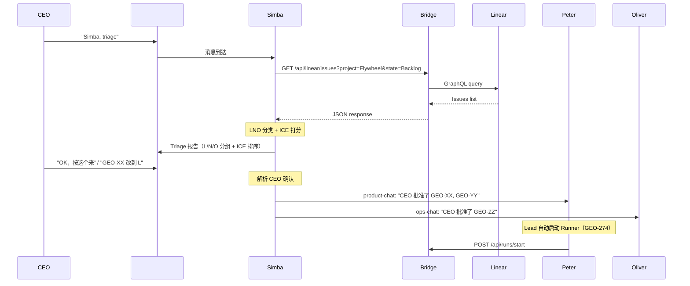

# Exploration: PM 自动 Triage — GEO-276

**Issue**: GEO-276 ([Product] PM 自动 Triage — Simba 扫 Linear backlog + LNO/ICE 评估)
**Date**: 2026-03-28
**Status**: Complete
**Dependencies**: GEO-275 (Simba Chief of Staff + Core Channel) — DONE

---

## 问题定义

CEO 当前的工作流是：手动去 Linear 查看 backlog → 脑内 triage → 在 Discord 告诉各 Lead 做什么。

**GEO-276 Phase 1（本 issue）**: CEO 在 #geoforge3d-core 说 "Simba, triage"，Simba 自动完成：
1. 扫描 Linear backlog（整个 Flywheel project，不限状态/label）
2. 同时查询当前 session 状态（哪些在跑、哪些 stuck）
3. 用 LNO/ICE 框架评估优先级
4. 输出结构化报告到 #geoforge3d-core
5. CEO 确认后，Simba 分配给各 Lead
6. Lead 收到后在自己的 channel 启动 Runner

**更大的 vision（后续 issue）**:
- **GEO-288**: Daily Standup — 8:00 AM 自动 triage + Lead 讨论期 + CEO 复核
- **GEO-289**: Lead 空闲再分配 — Lead 完成任务后主动向 Simba 请求新工作

### Lead 间讨论机制

Lead 之间通过 @mention 在 #geoforge3d-core 讨论。现有 NLP 路由已支持：
- Simba 在 triage 报告中 @Peter @Oliver 征求意见
- Peter @Simba 讨论优先级调整
- Oliver @Peter 确认依赖关系
CEO 在讨论结束后复核确认。

---

## 现状分析

### Simba 当前能力

| 能力 | 状态 | 实现方式 |
|------|------|---------|
| Discord 收发消息 | ✅ | Discord MCP plugin |
| Bridge API 查询 (sessions/runs) | ✅ | curl via Bash |
| 任务分配给 Peter/Oliver | ✅ | Discord MCP → Lead chat channel |
| Linear 查询 | ❌ | 无端点 |
| Triage 逻辑 | ❌ | 无 |

### Bridge Linear API 现状

| Endpoint | Method | 功能 |
|----------|--------|------|
| `/api/linear/create-issue` | POST | 创建 issue |
| `/api/linear/update-issue` | PATCH | 更新 issue |
| 列表查询 | ❌ | **缺失** |

### Lead Session 架构约束

- Simba 通过 `claude --agent cos-lead --channels plugin:discord` 启动
- Working directory: `~/.flywheel/lead-workspace/cos-lead`（隔离工作区，非项目目录）
- Agent 文件来自 `GeoForge3D/.lead/cos-lead/agent.md`（启动时复制到 `~/.claude/agents/`）
- 只有 Bash + Discord MCP 两种工具（disallowedTools: Write, Edit, MultiEdit, Agent, NotebookEdit）

---

## 设计空间

### Decision 1: Linear 数据访问方式

#### Option A: Bridge 新增 Linear Query 端点（推荐）

```
GET /api/linear/issues?project=Flywheel&state=Backlog&labels=Product,Operations
```

**优点**:
- 一致的 proxy 模式（与 create/update 对齐）
- LINEAR_API_KEY 仅 Bridge 持有，不暴露给 Lead
- 所有 Lead 共享，未来的项目也能用
- 可加缓存、rate limit、审计

**缺点**:
- 需要 Bridge 代码改动
- 需要设计查询参数

#### Option B: Lead 直接调用 Linear GraphQL API

**优点**: 无 Bridge 改动
**缺点**: 需要暴露 LINEAR_API_KEY 到 Lead 环境，GraphQL 复杂，每个 Lead 需要自己的 API key 管理

#### Option C: 给 Lead 添加 Linear MCP 工具

**优点**: 类型安全，自动发现
**缺点**: 改变 Lead 启动架构（需要额外 MCP server），与当前 "Bash + Discord" 模式不一致

**推荐 Option A** — 保持 Bridge 作为 Linear 代理的统一模式。

### Decision 2: Triage 逻辑放哪里

#### Option A: Simba agent.md 内嵌 Triage 行为（推荐 Phase 1）

在 `cos-lead/agent.md` 添加 "Triage" 专用 section：
- 触发规则（"Simba, triage" / "triage" / "看看 backlog"）
- LNO/ICE 评估标准（项目特定的 North Star）
- Report 模板
- 分配流程

**优点**:
- 最简实现，零基础设施改动
- 项目特定（agent.md 在 GeoForge3D repo 里）
- Claude 天然擅长按指令做分类评估
- 不需要改变 Lead 启动方式

**缺点**:
- agent.md 会变长（但 cos-lead 目前只有 145 行，空间充足）

#### Option B: pm-triage 作为独立 skill 文件

把 triage 逻辑放在 `.claude/commands/pm-triage.md`，agent.md 引用。

**优点**: 逻辑分离，可独立维护
**缺点**: Simba 的 working directory 不是项目目录（是 `~/.flywheel/lead-workspace/cos-lead`），项目级 skill 不会被自动加载。需要先做 GEO-286（Lead Workspace → 项目目录）或者放 user-level（失去项目特定性）

#### Option C: Agent.md + 外部 skill（Phase 2）

Phase 1 用 agent.md 内嵌，Phase 2（GEO-286 完成后）迁移到项目级 skill。

**推荐 Option A (Phase 1)** — agent.md 内嵌是最快路径。GEO-286 完成后再考虑分离为 skill。

### Decision 3: LNO/ICE 评估方式

#### Claude 直接判断（推荐）

Simba 收到 Linear issues 列表后，用 agent.md 中定义的标准直接做 LNO 分类和 ICE 打分。Claude 擅长这种需要理解上下文的分类任务。

**项目特定配置**（写在 agent.md 中）:
```markdown
### North Star
GeoForge3D 的 North Star: 完成 Flywheel 自动化系统，让 CEO 全程通过 Discord 操作。

### LNO 判断标准
- L (Leverage): 直接推进 Flywheel 自动化、提升 Lead/Runner 能力、CEO workflow 改善
- N (Neutral): 代码质量改善、非关键 bug、nice-to-have
- O (Overhead): 当前阶段不需要的功能、过度工程化
```

#### 结构化打分算法

预定义评分矩阵，用代码计算 ICE 分数。
**不推荐** — 过度工程化。Claude 的判断力加上 agent.md 的标准就够了。

---

## 端到端流程设计



---

## Report 模板设计

```markdown
📋 **Triage 报告** — 2026-03-28

**Backlog 概况**: 12 个 issue，涉及 Product (8) / Operations (4)

---

### 🔴 Leverage (高优先级 — 直接推进 North Star)

| # | Issue | Title | ICE | Department |
|---|-------|-------|-----|-----------|
| 1 | GEO-280 | Sprint 收尾流程 — Runner post-merge 自动关闭 | 8.5 | Product |
| 2 | GEO-285 | Lead Context Window 管理 | 7.8 | Product |

### 🟡 Neutral (正常优先级 — 有价值但非关键)

| # | Issue | Title | Department |
|---|-------|-------|-----------|
| 3 | GEO-283 | Discord typing indicator 消失 | Product |
| 4 | GEO-264 | Lead Bot Token 管理方案 | Product |

### ⚪ Overhead (低优先级 — 当前阶段不做)

| # | Issue | Title | Reason |
|---|-------|-------|--------|
| 5 | GEO-150 | Voice Interface | 暂不需要 |

---

**建议**: 先做 #1 #2（高 Leverage），#3 #4 看容量安排。

需要你确认或调整。
```

---

## 改动范围

### Flywheel (Bridge)

| 改动 | 文件 | 说明 |
|------|------|------|
| 新增 Linear Query 端点 | `packages/teamlead/src/bridge/plugin.ts` | `GET /api/linear/issues` |
| 新增单元测试 | `packages/teamlead/src/__tests__/linear-query.test.ts` | Query 参数、错误处理 |

**预估行数**: ~100 行代码 + ~80 行测试

### GeoForge3D (Agent)

| 改动 | 文件 | 说明 |
|------|------|------|
| 更新 Simba agent.md | `.lead/cos-lead/agent.md` | 新增 Triage 行为 section |

**预估行数**: ~80 行 agent 指令

### 不需要改的

- Peter/Oliver agent.md — 不需要改，他们已有任务接收和 Runner 启动能力
- Bridge 其他 API — 不影响
- claude-lead.sh — 不需要改

---

## 风险与关注点

1. **Linear Rate Limit** — Linear API 有 rate limit（~50 req/min）。单次 triage 一个请求，不会触发。但如果 CEO 频繁触发需要注意。
2. **Report 长度** — Discord 消息限制 2000 字符。如果 backlog 很多，需要分页或精简。
3. **LNO 判断准确性** — Claude 的判断可能和 CEO 不一致。这是 expected 的——Triage 是建议，CEO 做最终决策。Report 格式支持 CEO 调整。
4. **Agent.md 长度** — 加上 triage section 后 cos-lead agent.md 约 ~225 行。Claude Code 对 agent prompt 长度没有硬限制，可接受。

---

## 后续演进

| Phase | Issue | 内容 | 触发条件 |
|-------|-------|------|---------|
| **Phase 1（本 PR）** | **GEO-276** | Bridge 端点 + agent.md triage 行为（CEO 手动触发） | — |
| Phase 2 | **GEO-288** | Daily Standup — 8:00 AM 自动 triage + Lead 讨论 + CEO 复核 | Phase 1 跑顺后 |
| Phase 3 | **GEO-289** | Lead 空闲再分配 — Lead 完成后主动请求新任务 | Daily Standup 跑顺后 |
| Phase 4 | GEO-286 | Lead Workspace → 项目目录，pm-triage 分离为项目级 skill | 架构改善 |
| Phase 5 | — | 跨项目 triage（多个 Linear project） | 支持多个产品时 |
