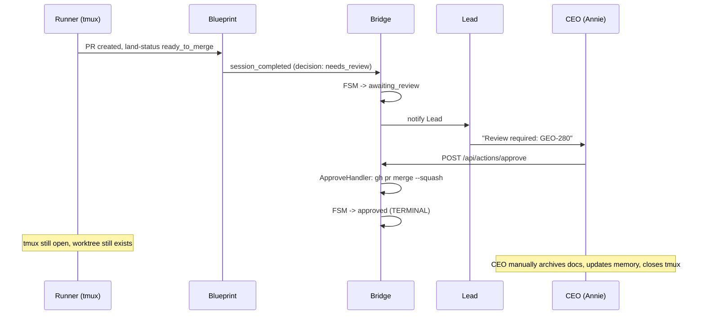

# Exploration: Sprint 收尾流程 — GEO-280

**Issue**: GEO-280 (Sprint 收尾流程：Runner 完成后自动进入 post-merge 阶段)
**Date**: 2026-03-28
**Status**: Complete

## Problem

Runner 完成 PR 后，tmux session 停在那里等 CEO review。即使 PR merge 后，也没有自动收尾。CEO 需要手动：
- Archive docs (exploration/research/plan -> archive/)
- Update MEMORY.md
- Cleanup worktree
- Close tmux session

这些都是重复性工作，应该自动化。

## 当前生命周期

## 分析：为什么当前架构不支持 post-merge

1. **approved 是终态**: FSM `approved: []` 没有 outgoing transitions
2. **Runner tmux 已经 idle**: Blueprint run 结束后 tmux session 仍在但 Claude 已 idle
3. **ApproveHandler 只做 merge**: `gh pr merge --squash --delete-branch`，不触发后续动作
4. **没有 "post-merge Runner" 概念**: Blueprint 只有一次 run 的 lifecycle

## 方案分析

### 方案 A: Bridge 侧脚本 (post-approve hook)

ApproveHandler merge 成功后，Bridge 直接执行 post-merge 脚本。

**优点**: 简单，不需要 Runner 参与
**缺点**: Bridge 不在 worktree context 里; MEMORY.md 更新需要 AI

### 方案 B: Lead -> Runner 注入指令

Approve 后，Lead 通过 flywheel-comm 向 Runner 发送 post-merge 指令。

**缺点**: Runner 的 Claude session 已经 idle/exited

### 方案 C: 新 Runner session

Approve 后启动新的 Blueprint run 执行 post-merge。

**缺点**: 重装备，post-merge 不需要 AI

### 方案 D: Lead 自己执行

Lead agent 自己做 post-merge。

**缺点**: Lead context window 已满

## 推荐方案（修订版 — Annie 反馈 2026-03-29）

### 职责划分

Annie 指出清理工作应按**谁有 context**来划分：

1. **Runner（子 agent）自己清理**：worktree、doc archive、MEMORY.md — Runner 有完整的项目 context
2. **Bridge 只负责**：关 tmux session（Runner 跑在 tmux 里，自己关不掉自己）+ 审计事件

### 已有覆盖

| 清理任务 | 已有覆盖 | 位置 |
|----------|----------|------|
| worktree 清理 | `/spin` Archive 阶段 + `cleanup-agent.sh` | `.claude/commands/spin.md` line 162, `.claude/orchestrator/cleanup-agent.sh` |
| doc archive | `/spin` Archive 阶段 | `.claude/commands/spin.md` line 165-169 |
| MEMORY.md 更新 | `/spin` Archive 阶段 | `.claude/commands/spin.md` line 175 |
| CLAUDE.md 更新 | `/spin` Archive 阶段 | `.claude/commands/spin.md` line 174 |
| branch 删除 | `cleanup-agent.sh` | `.claude/orchestrator/cleanup-agent.sh` line 37-44 |
| tmux session 关闭 | **没有自动化** | ← GEO-280 填补这个空白 |

### GEO-280 最终 scope

**Bridge 做的**：
- approve 后 fire-and-forget 关闭 Runner tmux session
- 记录审计事件（`post_merge_completed` / `post_merge_partial`）

**Bridge 不做的**：
- worktree 清理（Runner/orchestrator 职责，已有 /spin + cleanup-agent.sh）
- doc archive（Runner 职责，已有 /spin）
- MEMORY.md/CLAUDE.md 更新（Runner 职责，已有 /spin）

## 下一步

-> Research: 确认实现细节 -> Plan -> Implement
