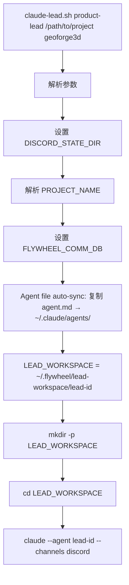

# Exploration: Lead Workspace 指向项目目录 — GEO-286

**Issue**: GEO-286 ([Product] Lead Workspace 指向项目目录 — 让 Lead 真正理解项目)
**Date**: 2026-03-28
**Updated**: 2026-03-29 (v2 — per-Lead 子目录方案)
**Status**: Complete

## 背景

当前每个 Lead 的 workspace 是空的隔离目录（`~/.flywheel/lead-workspace/<lead-id>/`），Lead 对项目没有任何 context。Lead 不能读取项目 CLAUDE.md、不理解目录结构、不知道技术栈。这导致 Lead 在回答 Annie 关于项目的问题时只能依赖 agent.md 中硬编码的知识，无法动态获取项目状态。

## 目标

让每个 Lead 运行在项目中**各自对应的子目录**：
- Peter (product-lead) → `GeoForge3D/product/`
- Oliver (ops-lead) → `GeoForge3D/operations/`
- Simba (cos-lead) → `GeoForge3D/`（根目录，需要全局视角）

## 当前架构分析

### claude-lead.sh 启动流程



关键点：
1. `LEAD_WORKSPACE` 默认是 `~/.flywheel/lead-workspace/<lead-id>/` — 空目录
2. 可通过 `LEAD_WORKSPACE` 环境变量覆盖
3. `cd "$LEAD_WORKSPACE"` 决定了 Claude Code 的工作目录
4. Claude Code 在工作目录下自动读取 `CLAUDE.md`

### GeoForge3D 目录结构

```
GeoForge3D/
├── CLAUDE.md                    # 项目级 context（技术栈、命令、架构）
├── .lead/
│   ├── product-lead/agent.md    # Peter agent 行为文件
│   ├── ops-lead/agent.md        # Oliver agent 行为文件
│   └── cos-lead/agent.md        # Simba agent 行为文件
├── product/                     # 产品代码（Backend + Frontend）
│   ├── .lead/
│   │   ├── product-lead/        # OpenClaw 遗留 + TOOLS.md
│   │   └── claude-lead/CLAUDE.md # 旧版 Claude Lead CLAUDE.md
│   └── GeoForge3D-Backend/
├── operations/                  # 运营代码
│   └── .lead/ops-lead/agent.md
└── doc/                         # 文档
```

### Claude Code CLAUDE.md 加载行为（Research 验证）

**Claude Code 会向上遍历目录树加载所有 CLAUDE.md**：
- 在 `GeoForge3D/product/` 运行 → 自动加载 `GeoForge3D/CLAUDE.md` + `GeoForge3D/product/CLAUDE.md`（如果存在）
- 更具体路径的 CLAUDE.md 优先级更高（子目录 > 父目录）
- 子目录的 CLAUDE.md 是 on-demand 懒加载
- `.claude/` 目录（settings, memory）从 git root 查找，不受 cwd 影响

**结论**: 子目录方案可行 — Lead 在子目录运行仍能获得项目级 CLAUDE.md。

### Bridge API 路径分析（Research 验证）

所有关键路径都是**绝对路径**，不受 cwd 影响：

| 路径 | 类型 | 安全 |
|------|------|------|
| BRIDGE_URL | 环境变量 URL | ✅ |
| FLYWHEEL_COMM_CLI | SCRIPT_DIR 派生，cd+pwd 解析为绝对 | ✅ |
| FLYWHEEL_COMM_DB | $HOME 派生 | ✅ |
| SESSION_ID_FILE | $HOME 派生 | ✅ |
| DISCORD_STATE_DIR | $HOME 派生 | ✅ |
| AGENT_TARGET | $HOME 派生 | ✅ |

**结论**: 改变 cwd 到任何子目录不会 break 任何基础设施。

### Lead 当前限制

所有 Lead 的 agent.md 都有：
- `disallowedTools: Write, Edit, MultiEdit, Agent, NotebookEdit` — 禁止写文件
- `permissionMode: bypassPermissions` — 绕过权限提示（只影响 Bash）
- Agent 行为规则明确 "绝对不做: 写代码"

## 方案分析

### 方案 A: 所有 Lead 都在项目根目录（v1 plan）

**描述**: `LEAD_WORKSPACE` 设为 GeoForge3D 项目根目录。

**优点**:
- 最简单 — 改一行就行
- Lead 自动获得项目 CLAUDE.md
- Simba (Chief of Staff) 需要全局视角，根目录最合适

**缺点**:
- 所有 Lead 看到完全一样的视图，没有职责隔离
- Peter 不需要看 `operations/` 的内容，Oliver 不需要看 `product/`
- 不符合 multi-lead 的分工设计意图

**结论**: ❌ 功能上可行但不够精确，Annie 明确要求 per-Lead 子目录。

### 方案 B: Per-Lead 子目录（v2 plan — 推荐）

**描述**: 每个 Lead 运行在各自对应的子目录。

| Lead | LEAD_WORKSPACE | 视角 |
|------|---------------|------|
| Peter (product-lead) | `GeoForge3D/product/` | 产品代码 + Backend + Frontend |
| Oliver (ops-lead) | `GeoForge3D/operations/` | 运营 + 3D 打印自动化 |
| Simba (cos-lead) | `GeoForge3D/` | 全局视角（根目录） |

**优点**:
- Lead 的 cwd 对齐其职责范围
- Claude Code 向上遍历仍加载项目 CLAUDE.md — 不丢 context
- 可在子目录放 Lead-specific CLAUDE.md（未来需要时）
- Simba 在根目录，符合 Chief of Staff 全局视角

**缺点**:
- 需要在 LeadConfig 中添加 workspace 配置
- 子目录必须存在（但 GeoForge3D 已有 `product/` 和 `operations/`）

**结论**: ✅ 推荐。精确对齐 Lead 职责，且 CLAUDE.md 向上遍历保证不丢 context。

### Agent File 放置决策

**选项 A — 每个子目录建 `.lead/`**:
- `GeoForge3D/product/.lead/product-lead/agent.md`
- `GeoForge3D/operations/.lead/ops-lead/agent.md`
- `GeoForge3D/.lead/cos-lead/agent.md`

**选项 B — 统一在项目根 `.lead/`（现状）**:
- `GeoForge3D/.lead/product-lead/agent.md`
- `GeoForge3D/.lead/ops-lead/agent.md`
- `GeoForge3D/.lead/cos-lead/agent.md`

**推荐选项 B（维持现状）**:
- Agent file 是身份配置，不是工作内容 — 集中管理更清晰
- Workspace（cwd）和 agent file 位置是两个独立概念
- 分散到 3 个不同目录增加维护成本
- `claude-lead.sh` 的 `AGENT_SOURCE` 查找用的是 `${PROJECT_DIR}/.lead/${LEAD_ID}/agent.md`，这个路径不受 cwd 影响
- 现有 agent file 不需要移动

## 推荐方案

**方案 B + 选项 B**: Per-Lead 子目录作为 workspace，agent file 统一在项目根 `.lead/`。

### 实现路径

1. **claude-lead.sh 修改**:
   - 新增 `LEAD_SUBDIR` 概念：从 LeadConfig（projects.json）读取每个 Lead 的子目录
   - `LEAD_WORKSPACE` 默认值改为 `${PROJECT_DIR}/${LEAD_SUBDIR}`（LEAD_SUBDIR 为空时等于 PROJECT_DIR）
   - 保留 `LEAD_WORKSPACE` 环境变量覆盖能力
   - Agent source 查找不变：`${PROJECT_DIR}/.lead/${LEAD_ID}/agent.md`
   - 去掉兼容层（不再 fallback 到 `${LEAD_WORKSPACE}/agent.md`）

2. **GeoForge3D 无需改动**:
   - `product/` 和 `operations/` 目录已存在
   - `.lead/` 下的 agent.md 位置不变

3. **向下兼容**:
   - 不需要。Annie 明确说了。

### 变更范围

| 文件 | 改动 |
|------|------|
| `packages/teamlead/scripts/claude-lead.sh` | 新增 `LEAD_SUBDIR` 参数（第 4 个可选参数），workspace 改为 `PROJECT_DIR/LEAD_SUBDIR` |

## 风险

| 风险 | 概率 | 影响 | 缓解 |
|------|------|------|------|
| Lead 通过 Bash 修改项目文件 | 低 | 中 | disallowedTools 禁止 Write/Edit；agent.md 禁止代码操作 |
| 子目录不存在 | 低 | 高 | `mkdir -p` 保底 + 启动日志明确打印路径 |
| Claude Code 在子目录找不到 `.claude/` settings | 无 | N/A | Research 确认 `.claude/` 从 git root 查找 |
| CLAUDE.md 不加载 | 无 | N/A | Research 确认向上遍历加载 |
