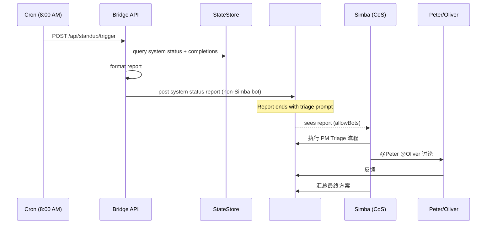

# Exploration: Daily Standup — GEO-288

**Issue**: GEO-288 (Daily Standup — Simba 8:00 AM 自动 Triage + Lead 讨论)
**Date**: 2026-03-28 (updated 2026-03-29)
**Status**: Complete

## Background

当前 Flywheel 的 Lead agents (Peter, Oliver, Simba) 通过 Discord 实时响应事件和 Annie 的指令。但没有一个结构化的"每日站会"流程——没有人在每天早上自动汇报系统状态、并触发 triage 讨论。

Annie 需要一个"开机就能看到今天该干什么"的体验。

## v1 反馈（2026-03-29 Annie rework）

v1 实现过于复杂，与 PM Triage (GEO-276) 功能重叠：

1. **PM Triage 已覆盖**: Simba 已有完整 triage 能力（查 Linear backlog + session 状态 → ICE 打分 → 生成报告 → Lead 讨论 → Annie 确认 → 分配）。GEO-288 不应重复这些。
2. **Bridge 内 setInterval 过度工程化**: 每 30 分钟轮询检查是否到了 standup 时间，完全可以用系统 cron 替代。
3. **Blockers/Backlog 段多余**: PM Triage 已处理 backlog 分析和 blocker 识别。

## v2 设计（简化）

### 核心思路

GEO-288 只做 PM Triage 缺少的部分：**系统运行状态汇报**。然后用这个汇报触发 Simba 已有的 triage 流程。

### Annie 期望的流程

### Scope

**GEO-288 做的：**
- Bridge API `POST /api/standup/trigger`：System Status + Completions(24h)
- Cron 配置：launchd plist，每天 8AM 调 Bridge API
- 报告末尾包含 triage 触发提示（Simba @mention）

**GEO-288 不做的：**
- Bridge 内部 StandupScheduler（用 cron 替代）
- Linear backlog 查询（PM Triage 已有）
- Blockers 分析（PM Triage 已有）
- 自动 assign（GEO-289）

### Bot Token 策略

报告通过 Discord REST API 发送到 #geoforge3d-core。为了让 Simba 看到消息并触发 triage：
- 发送时使用 **非 Simba** 的 bot token（默认 product-lead/Peter）
- Simba 的 allowBots 已包含 Peter → Simba 能看到消息
- 报告末尾 @mention Simba → 触发 Simba 的 core channel 路由规则

### 配置

| 变量 | 默认值 | 说明 |
|------|--------|------|
| `STANDUP_CHANNEL` | 无（必填） | 投递的 Discord channel ID |
| `STANDUP_LEAD_ID` | 第一个非 cos lead | 用哪个 bot token 发消息 |
| `STANDUP_ENABLED` | `"true"` | 开关（控制 cron 脚本行为） |

### Cron 方案

macOS launchd plist，每天 8:00 AM Pacific Time 执行 `curl POST /api/standup/trigger`。

优点：
- 零依赖（macOS 自带）
- 精确到分钟
- 开机后自动补执行（launchd 特性）
- 与 Bridge 完全解耦

## Implementation Scope

### Bridge 侧 (packages/teamlead)
1. 精简 `standup-service.ts` — 只保留 system status + completions 聚合 + Discord 投递
2. 精简 `standup-route.ts` — 保留 `POST /api/standup/trigger`
3. 新增 `discord-utils.ts` — 共享 Discord 工具（已有）
4. 精简 plugin.ts 集成 — 去掉 StandupScheduler

### 运维侧
1. `scripts/daily-standup.sh` — cron 执行脚本
2. `scripts/com.flywheel.daily-standup.plist` — launchd 配置

### 不在 scope 内
- Simba agent.md 更新（follow-up，GeoForge3D repo）
- Lead 自动讨论 turn-taking（现有 bot-to-bot 处理）
- 自动 assign（GEO-289）
- HTML report（GEO-294）
