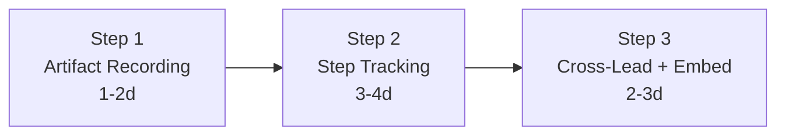

# Exploration: Lead 智能编排能力 — GEO-292

**Issue**: GEO-292 (Lead 智能编排能力)
**Date**: 2026-03-30
**Status**: Complete

---

## 背景

Discord Lead（Peter/Oliver/Simba）已经具备启动 Runner、查询状态、tmux capture、stale patrol、approve/retry/terminate 等基础能力。但 Lead 对 Runner 执行过程的可见性仍然是黑盒——不知道 Runner 走到哪一步、出了什么 PR、代码 review 是否通过。

本 exploration 分析 Lead 编排能力的 gap，提出分步解决方案。

---

## 现有 Lead 能力清单（代码验证）

| 能力 | 实现位置 | 说明 |
|------|---------|------|
| 启动 Runner | Bridge `POST /api/runs/start` | RunDispatcher + Linear pre-flight + concurrency cap |
| 查询 Session 状态 | Bridge `GET /api/sessions` | active/recent/stuck/by_identifier，leadId scope 过滤 |
| tmux 终端 capture | Bridge `GET /api/sessions/:id/capture` | 获取 Runner tmux 最近 N 行输出 |
| 关闭 stale tmux | Bridge `POST /api/sessions/:id/close-tmux` | 仅限 terminal state |
| Stale session patrol | Bridge `POST /api/patrol/scan-stale` + HeartbeatService | 按 Lead 分组 Discord 汇总 |
| 执行 action | Bridge `/api/actions` (approve/retry/terminate) | resolve-action + scope-aware candidate |
| 发指令给 Runner | flywheel-comm `send` | Runner PostToolUse hook 轮询 |
| 查看 Runner 问题 | flywheel-comm `pending` + `respond` | Runner ask → Lead respond |
| Linear issue 查询/创建 | Bridge `GET /api/linear/issues` + `POST /api/linear/create-issue` | team/project aware |
| Daily standup | Bridge `POST /api/standup` + StandupService | 聚合 + 格式化 + Discord 投递 |
| Discord 通信 | Claude Code `--agent --channels discord` | 与 Annie 和其他 Lead 对话 |
| Forum 管理 | ForumPostCreator + ForumTagUpdater | 自动创建/更新 thread + tag |
| Simba triage | Agent.md 行为定义 | 马上做/本周完成 分组，NLP routing |

## Gap Analysis

### Gap 1: Artifact Recording — Session 缺少 PR Number

**现状**：StateStore Session 追踪了 `commit_count`、`files_changed`、`lines_added/removed`、`summary` 等字段。Runner 在 `session_completed` event 中上报了 PR 信息，但 Bridge 没有把 PR number 存到容易查询的字段。Lead 查 session 时看不到 PR number。

**影响**：Lead 知道 Runner "完成了"，但不知道出了哪个 PR，需要手动查 GitHub。

**方案**：Session 表加 `pr_number` nullable text 字段，event handler 从 payload 中提取 PR number 写入。

### Gap 2: Step Tracking — Runner 执行过程是黑盒

**现状**：Orchestrator（bash + SQLite）有 9 步 step template + gate，但只给本地 Claude Code session 用。Discord Lead 通过 Bridge 操作，没有步骤追踪。Lead 启动 Runner 后只能看到 `running` 状态，不知道 Runner 是在写代码、做 code review 还是创建 PR。

**影响**：Lead 无法做 proactive 干预（如 Runner 写代码超时该 capture 检查）。

**方案**：StateStore Session 加 `session_stage` 字段，追踪 4 个粗粒度状态：`started` → `code_written` → `pr_created` → `merged`。Runner 通过新 event type `stage_changed` 上报。Lead agent.md 定义 intervene 行为规则。

### Gap 3: Cross-Lead 协调 — 无系统级依赖追踪

**现状**：Peter 和 Oliver 基本独立工作。Simba 在 #geoforge3d-core 协调，但靠 Discord 对话——没有依赖追踪。

**影响**：有依赖时可能出现 Peter 等 Oliver 但没人通知的情况。

**方案**：利用 Linear blocking 关系作为 source of truth，Simba triage 时检查依赖，先分配无依赖任务。纯 agent.md 行为改动，不需要基础设施。

### Gap 4: Dashboard — Discord 消息格式粗糙

**现状**：standup 和 stale patrol 的 Discord 消息是纯文本。Annie 在手机 Discord 上看。

**影响**：信息密度低，不够直观。

**方案**：改用 Discord rich embed 格式（表格化数据、颜色编码状态）。

### Gap 5: Health Check — 评估后决定不做

HeartbeatService 的 stuck/orphan/stale 检查已覆盖主要场景。当前 3 Lead + 3 Runner 规模够用。不增加系统健康评分机制。

---

## 可借鉴模式

### Orchestrator 模式（本地，bash + SQLite）

| 模式 | 说明 | 借鉴价值 |
|------|------|----------|
| Step Template | `step_templates` 表 + 9 步 executor 模板 | Step 2 的设计参考（粗粒度化后复用思路） |
| Step Gate | `track.sh gate` — 前置步骤必须完成 | 启发 agent.md 行为规则设计 |
| Artifact Recording | `artifacts` 表 — PR/commit/test_result 等类型 | Step 1 的设计参考 |
| Dashboard | `dashboard.py` + SQLite query | 启发 Discord embed 格式设计 |

### AgentsMesh 模式（FLY-3 Research）

| 模式 | 说明 | 借鉴价值 |
|------|------|----------|
| Autopilot 断路器 | no-progress + same-error → 暂停 | 未来 Runner 智能暂停的参考（不在本期范围） |
| Agent 状态检测 | executing/waiting/idle 三态 | 未来 Lead 感知 Runner 状态的参考 |
| Loop/Cron 统一 | 统一调度 + 并发策略 | 远期可考虑统一 standup/patrol 调度 |

---

## 分步交付计划

### Step 1: Artifact Recording（P1）
- Session 加 `pr_number` 字段
- event handler 提取 PR number
- API 返回 `pr_number`
- 6-8 个测试
- **复杂度**：小（1-2 天）

### Step 2: Step Tracking（P1）
- Session 加 `session_stage` 字段（started/code_written/pr_created/merged）
- 新 event type `stage_changed`
- API 返回 `stage`
- agent.md 行为规则（capture 时机、intervene 规则）
- 10-12 个测试
- **复杂度**：中（3-4 天）

### Step 3: Cross-Lead 协调 + Discord Embed（P2-P3）
- Simba agent.md 加 Linear 依赖检查行为
- standup + stale patrol Discord embed 格式
- 不需要 Bridge 代码改动
- **复杂度**：小（2-3 天）

---

## 决策记录

| 决策 | 选择 | 理由 |
|------|------|------|
| Step 粒度 | 粗粒度 4 状态 | Lead 已有 tmux capture 看细节，系统层只需关键节点 |
| Artifact 存储 | Session 加字段 + event payload | 关键字段（pr_number）直接查，其他走 event |
| Health Check | 不做 | HeartbeatService 够用，3 Lead 规模不需要健康评分 |
| Cross-Lead 依赖 | Linear + Simba agent.md | 零基础设施改动，复用 Linear blocking 关系 |
| Dashboard | Discord embed | Annie 在手机 Discord 上看，不做 Web dashboard |
| Orchestrator 定位 | 两套系统分离 | Orchestrator 给人类直接用，Bridge 给 Discord Lead |

## 不做的事（Explicit Non-Goals）

- **Runner 侧断路器**：有价值但不在本期范围。Runner 卡住由 HeartbeatService 的 stuck 检查覆盖。
- **Agent 状态检测（executing/waiting/idle）**：依赖 tmux 进程检测或 OSC escape，单独 issue 追踪。
- **Terminal Observation MCP Tool**：Lead 已有 Bridge capture API，MCP 包装是锦上添花。
- **Loop/Cron 统一**：当前 launchd 够用，定时任务数量不多。
- **Web Dashboard**：Annie 用 Discord 就够。
- **Orchestrator 与 Bridge 合并**：保持两个系统分离。
