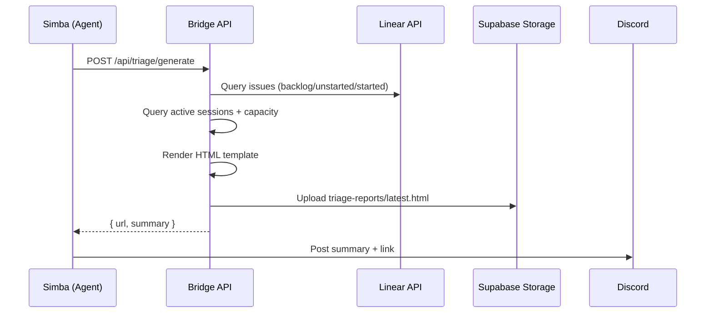
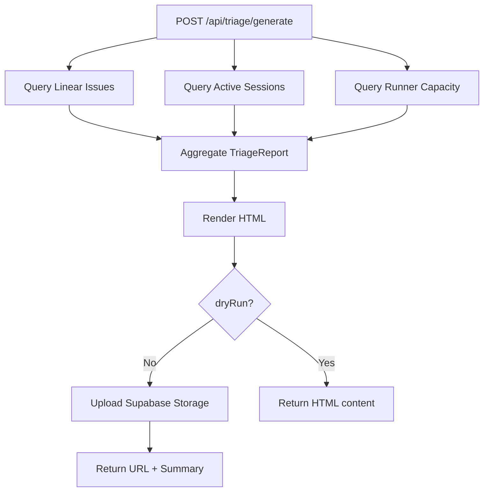

# Exploration: Triage HTML Report — GEO-294

**Issue**: GEO-294 (Triage HTML Report — Supabase Storage 托管)
**Date**: 2026-03-30
**Status**: Complete

## 背景

GEO-276 Phase 1 实现了 Simba 的 PM triage 功能，但报告是 Discord 纯文本格式，受限于 2000 字符上限。Annie 希望有更丰富的 HTML 报告：表格、颜色编码、ICE 进度条、可点击链接等。

### 当前状态
- Simba 通过 Bridge API 查询 Linear issues + active sessions
- 生成 markdown 格式 triage 报告，直接发到 Discord
- 受 Discord 2000 字符限制，信息密度低
- 无法展示复杂的优先级可视化（如 ICE 分数条形图）

### 目标
- 生成美观的 HTML triage 报告，托管在 Supabase Storage
- Discord 发送简版摘要 + 报告链接
- URL 固定，CEO 可以随时访问最新报告

## 方案探索

### 方案 A: Bridge 生成 HTML + Supabase Storage（推荐）



**优点**:
- HTML 生成在 TypeScript 中，可测试、可维护
- 模板逻辑与 agent 行为解耦
- Bridge 已有 Linear 查询和 session 聚合能力
- Supabase public bucket 提供稳定 URL

**缺点**:
- Bridge 新增端点 + Supabase Storage 依赖
- 需要额外的 `@supabase/supabase-js` 或直接 REST API

### 方案 B: Simba 直接生成 HTML + curl 上传

**优点**: 无 Bridge 改动
**缺点**: Agent 生成复杂 HTML 不可靠，不可测试，每次输出不一致

### 方案 C: Bridge 自托管（不用 Supabase）

**优点**: 无外部依赖
**缺点**: Bridge 是本地服务，无公网 URL，CEO 无法远程访问

### 方案 D: 静态 HTML 文件 + GitHub Pages

**优点**: 免费托管
**缺点**: 需要 git commit 才能更新，延迟高，过度复杂

### 决定: 方案 A

Bridge 负责数据聚合 + HTML 渲染 + Supabase 上传。Simba 只需调用一个 API 端点。

## 设计要点

### 1. Supabase Storage 配置

- Bucket: `triage-reports`（public）
- 固定路径: `triage-reports/latest.html`（最新报告，覆盖写入）
- 历史: `triage-reports/{YYYY-MM-DD}.html`（每日存档）
- Public URL: `https://{ref}.supabase.co/storage/v1/object/public/triage-reports/latest.html`
- 上传方式: Supabase Storage REST API（`Authorization: Bearer {service_role_key}`）

### 2. Bridge API 新端点

```
POST /api/triage/generate
  Body: { projectName: string, dryRun?: boolean }
  Response: { url: string, summary: string, report: TriageReport }
```

- `dryRun=true`: 生成报告但不上传，返回 HTML 内容
- Auth: 同其他 `/api/*` 端点（Bearer token）

### 3. HTML 报告内容

| Section | 数据源 | 可视化 |
|---------|--------|--------|
| Header | 日期 + 项目名 | 标题 + 生成时间 |
| System Status | StateStore sessions | 指标卡片 (running/awaiting/stuck) |
| Immediate (马上做) | Linear backlog + ICE | 红色标签 + 优先级排序表格 |
| This Week (本周完成) | Linear backlog + ICE | 黄色标签 + 表格 |
| In Progress (进行中) | Active sessions | 绿色/黄色状态 badge |
| Team Breakdown | Issue labels → Lead | Product/Operations 分组 |
| Runner Capacity | Active sessions + config | 进度条 |
| Recent Completions | Last 24h sessions | 简表 |

### 4. HTML 模板设计

- 独立 `.ts` 文件，纯函数（data → HTML string）
- 内联 CSS（邮件兼容，无外部依赖）
- 暗色主题，对齐现有 dashboard 风格
- 响应式布局（CEO 可能在手机上看）
- ICE 分数用彩色进度条
- Issue 标题链接到 Linear

### 5. Simba Agent 变更

- 新增 triage 工具: `POST /api/triage/generate`
- Triage 流程更新: Step 4 改为调用 API 生成报告 → 发链接
- 保留 Discord 简版摘要（前 3 优先项 + 链接）
- TOOLS.md 添加新端点文档

### 6. ICE 评分

Bridge 不做 AI 评分（那是 Simba 的工作）。两种路径:

**路径 1 (MVP)**: Bridge 聚合原始数据，HTML 展示优先级/标签/状态，不含 ICE 分数
**路径 2 (增强)**: Simba 先算 ICE → 传给 Bridge → Bridge 渲染带分数的 HTML

MVP 先走路径 1。ICE 评分可后续迭代加入（Simba POST body 传入排序好的 issue 列表）。

## 数据流



## 边界与约束

- **不做**: AI 排序/评分（Simba 职责）、邮件发送、PDF 导出
- **Supabase 限制**: Free tier 1GB storage, 2GB bandwidth/month — 足够（HTML 文件 <100KB）
- **覆盖写入**: `latest.html` 每次覆盖，历史按日期保留
- **无 RLS**: public bucket，无敏感数据（issue titles 是公开信息）
- **降级**: Supabase 上传失败时，仍返回报告数据，Simba 降级为纯文本

## 风险

| 风险 | 影响 | 缓解 |
|------|------|------|
| Supabase Storage API 变更 | 上传失败 | REST API 稳定，SDK 可选 |
| HTML 太大 | 加载慢 | 限制 issue 数量（top 30） |
| 无网络时 CEO 看不到 | 信息延迟 | Discord 摘要保留关键信息 |

## 下一步

1. Research: Supabase Storage REST API 上传方式
2. Plan: 详细实现计划
3. Implement: Bridge 端点 + HTML 模板 + Supabase 上传 + Simba agent 更新
