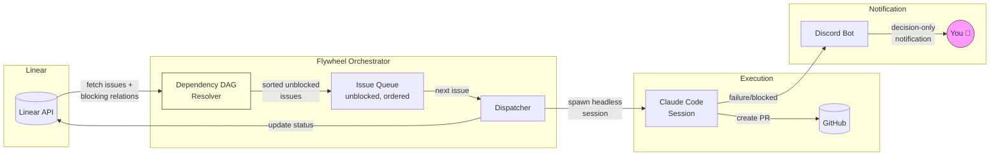
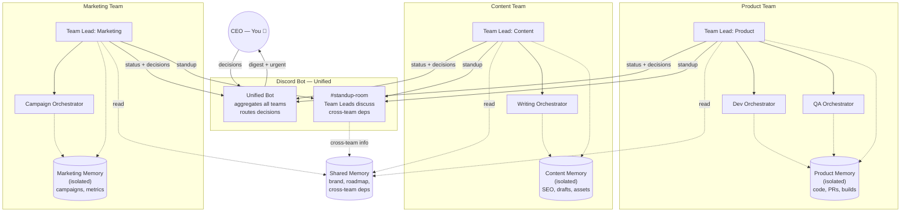
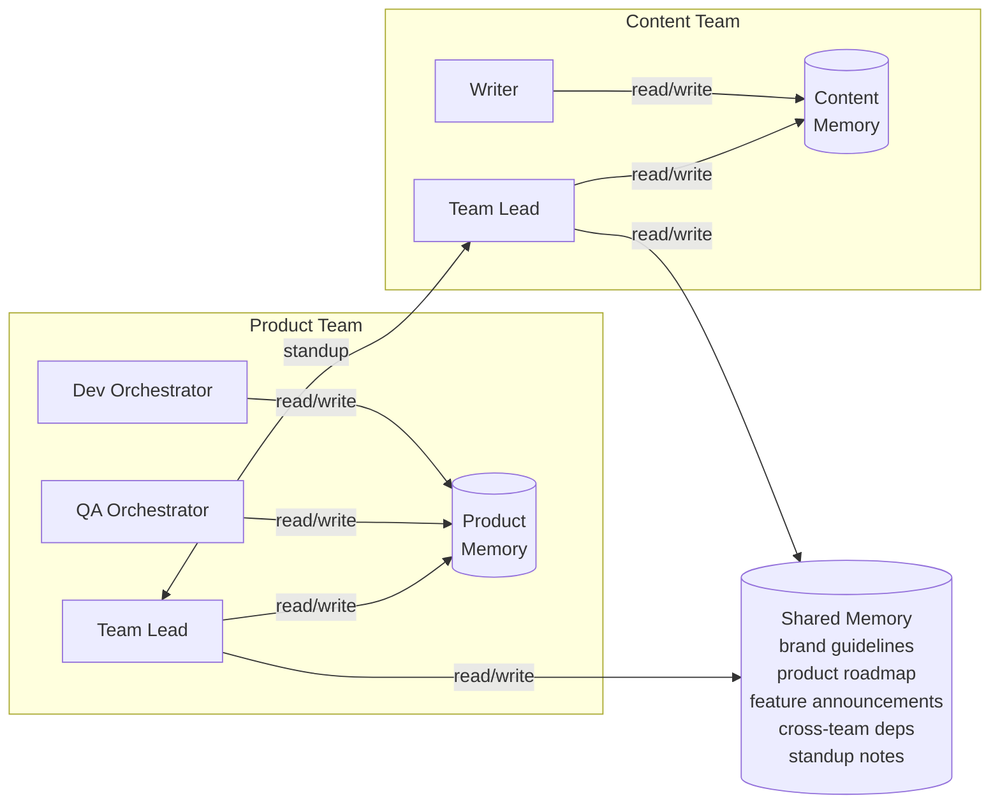
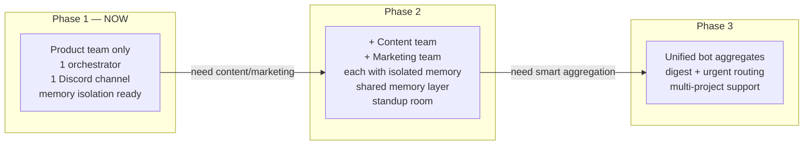
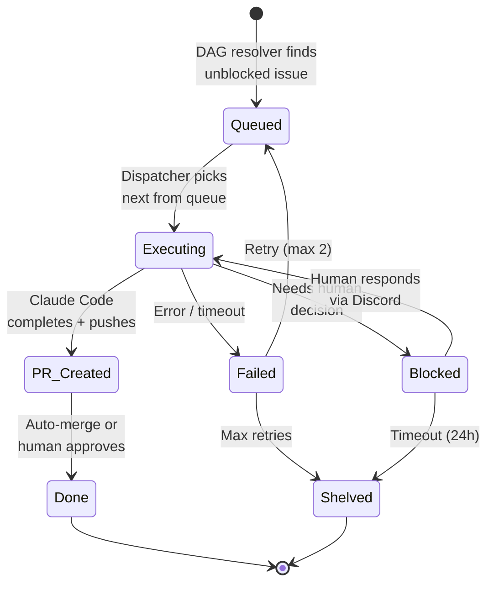
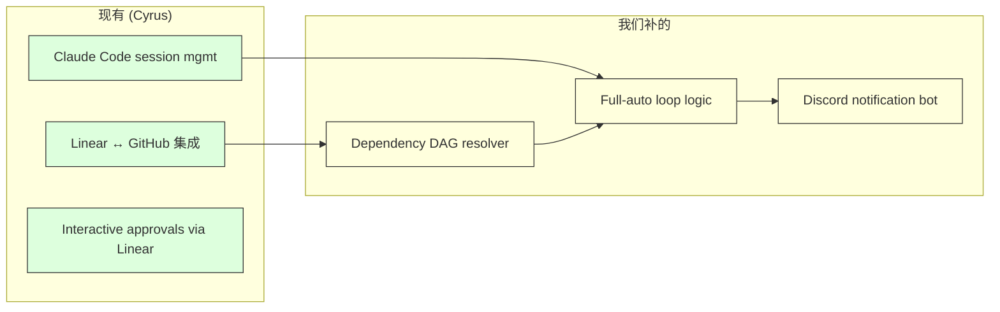
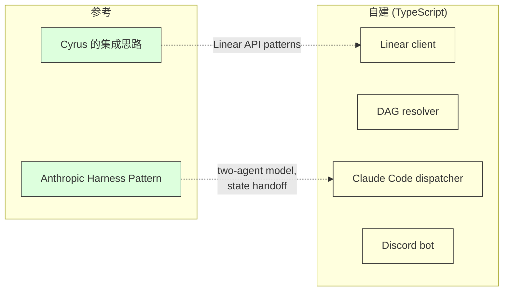

# Exploration: Flywheel — Autonomous Dev Workflow

## 0. Product Research

### Problem Statement

Solo developer 管理多个项目（GeoForge3D 等），每个项目用 Claude Code 执行开发任务。当前模式：人坐在 tmux 前等待 Claude Code 的 approval prompt，逐个处理。**Human attention 是瓶颈** — 不是 AI 能力不足，而是人无法同时关注多个 session。结果：$50-100+/day 的 agent 算力利用率低，issue backlog 堆积，项目进度受限于 human availability。

### Existing Tools — 可直接复用的部分

> **定位**: 我们不是做产品跟别人竞争。目标是**自用优化** — 现有工具能用就用，缺什么补什么。
> 如果自己用得足够好，再考虑推广。

| Tool | 做什么 | 可复用的部分 | 我们需要补的 |
|------|--------|-------------|-------------|
| **[Cyrus](https://github.com/ceedaragents/cyrus)** | Linear issue → Claude Code → PR | Linear/GitHub 双向集成，Claude Code session management | Dependency DAG, messaging, Head of Product |
| **[Auto-Claude](https://github.com/AndyMik90/Auto-Claude)** | Desktop: spec → plan → code → QA | Spec/QA pipeline 设计思路 | 无 Linear 集成，AGPL 许可 |
| **[Nanobot](https://github.com/HKUDS/nanobot)** | Lightweight messaging gateway (4K 行 Python) | Discord/Telegram bot + MCP 集成 | 无 orchestration 逻辑 |
| **[Anthropic Harness](https://www.anthropic.com/engineering/effective-harnesses-for-long-running-agents)** | 官方 long-running agent 模式 | Two-agent pattern, state handoff via artifacts | Single-session, 无 issue tracker |

### 我们要补的核心差异

1. **Dependency DAG scheduling** — 根据 Linear blocking/blocked-by 关系自动排序
2. **Head of Product 层** (Phase 2) — 跨 orchestrator 的智能聚合/过滤
3. **Full-auto loop** — issue → code → PR → next issue，无需人盯着

### Target User

**Phase 1**: Developer / indie hacker — 用 AI coding tools (Claude Code etc.) 做开发，需要自动化 issue→code→PR 流程。
**长期**: 各行各业 — 任何需要管理 AI agent 执行任务并保持 human oversight 的人。

核心 struggling moment: "我花了一整天坐在电脑前，但大部分时间在等 AI 回应，而不是做有价值的决策。"

### Scope Frame

- **Appetite**: L (6-8 weeks 完成两层系统的 MVP)
- **Essential core**: Orchestrator 从 Linear 拉取 unblocked issues → 自动执行 → 需要人决策时通知用户
- **Nice to haves**: Head of Product 智能聚合层、multi-project 并行、voice response via Discord、自动 PR merge

## Architecture Overview

### Phase 1: Orchestrator MVP

### Target Architecture: Team-based with Memory Isolation

**核心设计原则**: AI agent 的 context window 是稀缺资源。不同 team 的 memory 必须隔离 — 否则每个 agent 都背着无关 context，浪费 token，降低执行质量，compaction 时丢失关键信息。

**Memory 分层**:

| Memory Type | Scope | Example |
|-------------|-------|---------|
| Team Memory (isolated) | 只有该 team 内 agents 可见 | Product: builds, PRs. Content: SEO, drafts |
| Shared Memory | Team Leads 可读写 | Brand guidelines, roadmap, cross-team deps, standup notes |

**Memory Access 规则**:

- **Workers**: 只能 read/write 自己 team 的 memory
- **Team Leads**: read/write team memory + shared memory（唯一跨 boundary 的角色）
- **Standup room**: Team Leads 交换跨 team 信息，产出写入 shared memory
- **CEO**: 通过 Discord bot 间接 access 所有层

### Evolution Path

**Phase 1**: 只有 Product team，但架构从一开始支持 memory isolation，加 team 是增量操作，不是重写。

### Issue Lifecycle (Single Issue)

## 1. Affected Files and Services

Greenfield project — 无现有代码。

| File/Service | Impact | Notes |
|-------------|--------|-------|
| `VISION.md` | existing | 当前唯一文件，方向描述 |
| Orchestrator service | new | 核心：Linear → dependency resolution → Claude Code dispatch |
| Messaging layer | new | Discord/Telegram bot for notifications + approvals |
| Head of Product layer | new (Phase 2) | 智能聚合/过滤层 |
| Linear workspace | external | GeoForge3D team + Learning team，~50 issues |

## 2. Architecture Constraints

- **Claude Code Agent SDK**: TypeScript 或 Python，支持 headless mode (`-p` flag)，session resume，hooks system
- **Linear API**: 32 MCP tools 可用，但无 "unblocked issues" 原生 filter — 需要 ~20 行 orchestrator 逻辑处理 dependency graph
- **Context window**: Compaction 可能丢失信息，Anthropic 建议 single-feature-per-session + external state files
- **Cost**: 连续 agent teams $50-100+/day；well-scoped tasks ~87% success rate
- **macOS**: 开发环境 macOS，orchestrator 可跑 local 或 VPS

## 3. External Research

### Industry Practices

- **Multi-agent orchestration** 是 2026 主流趋势 — Gartner 报告 multi-agent 咨询量增长 1445%（[source](https://www.deloitte.com/us/en/insights/industry/technology/technology-media-and-telecom-predictions/2026/ai-agent-orchestration.html)）
- **Anthropic 官方模式**: Two-agent harness（initializer + coder），incremental progress，`claude-progress.txt` 做 state handoff（[source](https://www.anthropic.com/engineering/effective-harnesses-for-long-running-agents)）
- **Agent SDK** 已从 "Claude Code SDK" 更名为 "Claude Agent SDK"，支持非 coding 应用（[source](https://www.anthropic.com/engineering/building-agents-with-the-claude-agent-sdk)）
- **Key principle**: "Structure prompts to focus on single features per session" — one-shotting leads to incomplete features
- **Nanobot**: 4K 行 Python 的 OpenClaw 替代品，MCP support，多 messaging 平台（[source](https://github.com/HKUDS/nanobot)）— 比 OpenClaw 轻量 99%，但同样只是 gateway，不做 orchestration

### Anthropic Recommended Patterns

1. **Initializer + Coding agent** 两阶段模式
2. **External state files** (`claude-progress.txt`, feature list JSON) 做 cross-session 持久化
3. **Git commit + progress summary** 做 clean state handoff
4. **Testing-first validation** — agent 必须验证后才能 mark done

## 4. Options Comparison

> **原则**: 不是做产品竞争。能用现成的就用，我们只补缺失的部分。

### Option A: 用 Cyrus + 补 DAG 和 Discord — Recommended

**Core idea**: 直接用 Cyrus 做 Linear→Claude Code→PR 的 base。我们只在上面加：
1. Dependency DAG resolver — 按 blocking/blocked-by 排序 issues
2. Discord bot — decision-only 通知
3. Full-auto loop — issue 完成后自动拿下一个

**Pros**:
- **最快落地** — Linear/GitHub/Claude Code 集成不用重写
- Cyrus 已开源，可以直接 fork 或作为 dependency 使用
- 我们只聚焦在差异化部分（DAG + Discord + auto-loop）

**Cons**:
- 需要先深入了解 Cyrus 代码，评估是否适配
- 如果 Cyrus 架构不灵活，改造成本可能比新建更高
- Cyrus 更新节奏不确定，长期维护依赖上游

**Appetite**: 1-2 weeks（评估 Cyrus + 补 DAG/Discord）

---

### Option B: 从零建，参考 Anthropic Harness Pattern

**Core idea**: TypeScript 从零建。但不是闭门造车 — 参考 Cyrus 的 Linear 集成思路 + Anthropic 的 harness pattern。只写我们需要的，不多写。

**Pros**:
- 完全按我们的需求设计，无历史包袱
- 架构清晰，Phase 2 加 Head of Product 层没有阻力
- 只依赖 Linear API + Claude Code CLI，dependency 极少

**Cons**:
- Linear API 集成需要自己写（虽然不复杂）
- Claude Code session management 需要自己处理

**Appetite**: 2-3 weeks (Orchestrator MVP)

---

### Recommendation: 先评估 Cyrus，再决定

**判断标准**: `/research` 阶段深入读 Cyrus 源码。如果 Cyrus 的架构足够灵活（能加 DAG + Discord 而不用大改），选 Option A。如果 Cyrus 是 monolith 或架构不合，选 Option B。

两条路都不长 — 关键是做对评估。

## 5. Clarifying Questions

### Scope
- **Q1**: Flywheel 的第一个 pilot project 是哪个？GeoForge3D（有 real production issues）还是一个新的 test project？
- **Q2**: Orchestrator 应该支持多少并发 Claude Code sessions？1 个（sequential）还是 2-3 个（parallel）？

### Architecture
- **Q3**: 用 TypeScript (Agent SDK native) 还是 Python？考虑到 Agent SDK 同时支持两者。
- **Q4**: Orchestrator 跑在哪里？本地 Mac（开发方便但不 always-on）还是 VPS（always-on 但需要部署）？

### Risk Tolerance
- **Q5**: Orchestrator 的自主权边界在哪？
  - (a) Auto-execute everything, only notify on failure
  - (b) Auto-execute, but require approval for PR merge
  - (c) Always require human approval before Claude Code starts working on an issue

### Notification
- **Q6**: 通知 channel 优先级？Discord / Telegram / both？
- **Q7**: 通知粒度：every issue started/completed，还是只在需要决策时通知？

## 6. User Decisions

**Selected approach**: Option A — Orchestrator-First (Bottom-Up)

| Question | Decision |
|----------|----------|
| Q1: Pilot project | **GeoForge3D** — real production issues (checkout flow, map preview, E2E tests) |
| Q2: Concurrency | **Start 1 (sequential), scale later** — MVP 先 sequential，验证后加 parallel |
| Q3: Language | **TypeScript** — Agent SDK primary language, type safety |
| Q4: Hosting | **Local Mac first, VPS later** — MVP 在 Mac 上跑，验证后迁移 |
| Q5: Autonomy | **Full auto** — auto-execute all issues, auto-create PR, only notify on failure/blocked |
| Q6: Notification channel | **Discord** — decision-only notifications |
| Q7: Notification granularity | **Decision-only** — 只在需要人决策时通知（PR review, blocking question, failure） |

### 综合画像

Flywheel MVP = **TypeScript Orchestrator**，从 Linear GeoForge3D 项目拉取 unblocked issues，按 dependency DAG 顺序 sequential 执行 Claude Code sessions，auto-create PR。只在需要人决策或遇到 failure 时通过 Discord bot 通知用户。先跑在 local Mac，稳定后迁 VPS。

## 7. Suggested Next Steps

- [ ] Run `/research` for deep technical research (Agent SDK, Linear API, Discord bot patterns)
- [ ] Write implementation plan via `/write-plan`
- [ ] Create Linear project for Flywheel itself
- [ ] Set up TypeScript project scaffold
