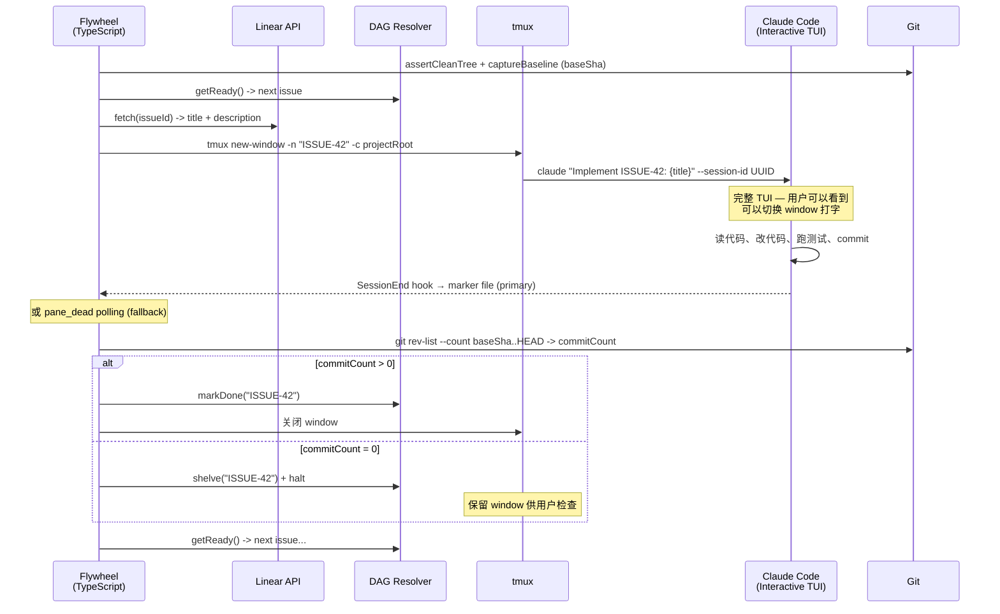
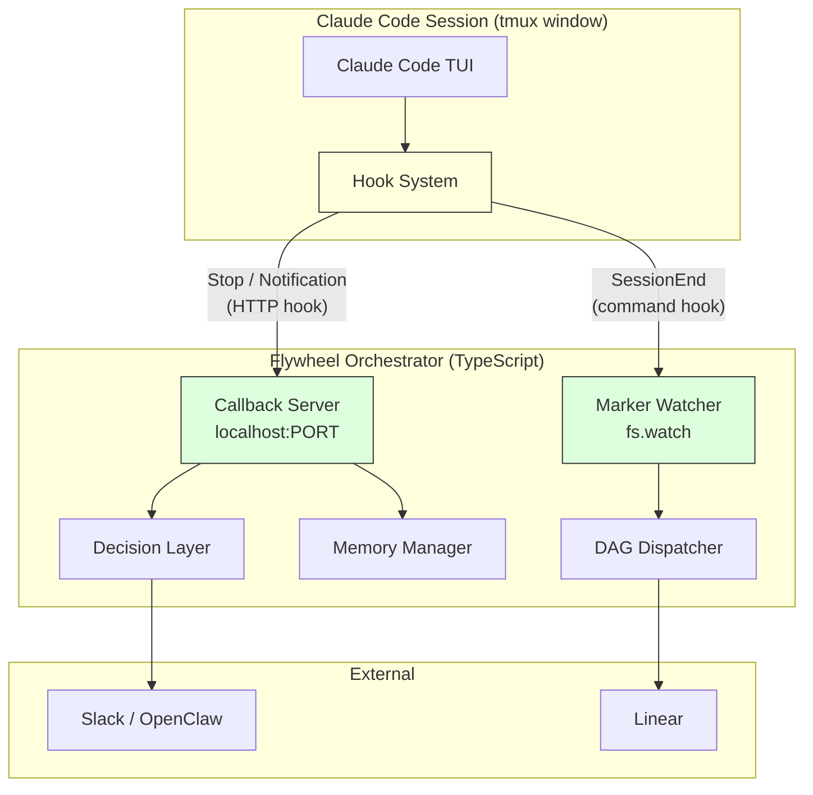

# Exploration: Interactive Runner Architecture

## 问题

当前 Flywheel 架构全部假设 headless 模式（`claude --print`）—— 用户看不到 session 运行过程，无法介入。这不符合 Phase 1 需求：

> "每开一个新的任务，它就会开一个新的 Window 去跑交互。起码 Phase 1 还是需要有不同的 terminal 能够让我看见。"

**核心需求**：
1. 每个 issue = 一个可见的 Claude Code session（完整 TUI）
2. 用户可以随时切换到任何 session 并直接打字交互
3. 跑完后 Flywheel 能获取结果（success/fail）
4. Phase 1 只做 Present 模式；Remote（Slack）留 Phase 2

## 设计原则

> **"TypeScript 做最少的调度，Claude Code interactive session 做一切实际工作"**

参考 [Ralph](https://github.com/snarktank/ralph) 项目的核心哲学：orchestrator 只负责"再来一次"，所有智能都在 AI agent 里。Ralph 用 113 行 bash 实现了完整的自主开发循环——验证了"极简编排 + 文件系统即状态"模式的可行性。

Flywheel 在此基础上增加 Ralph 没有的能力：DAG 依赖排序、tmux 可见性、Decision Layer / Slack 通知。

## 1. Affected Files and Services

| File/Service | Impact | Notes |
|-------------|--------|-------|
| `packages/claude-runner/src/TmuxRunner.ts` | **新增** | tmux interactive 模式（`ClaudeCodeRunner` 保留为 `claude-headless` fallback） |
| `packages/core/src/flywheel-runner-types.ts` | **简化** | costUsd 可选 + tmuxWindow 字段 + label 字段 |
| `packages/edge-worker/src/Blueprint.ts` | **大幅简化** | 砍掉 buildPrompt/lint/CI loop，只做 git preflight + tmux launch + wait + git SHA check |
| `packages/edge-worker/src/PreHydrator.ts` | **砍掉或极简化** | 只保留 Linear API 拉 title+description |
| `packages/edge-worker/src/DagDispatcher.ts` | **小改** | 移除 cost tracking，halt on failure，marker dir lifecycle |

## 2. Architecture Constraints

### Claude Code CLI 能力（2026-02 v2.1.62）

| 能力 | Flag | 说明 |
|------|------|------|
| Interactive 模式 | `claude "prompt"` | 完整 TUI，用户可交互 |
| Headless 模式 | `claude -p "prompt"` | 无 UI，输出 JSON |
| Worktree 隔离 | `--worktree name` | 每 session 独立 git worktree |
| tmux 集成 | `--tmux` | 需配合 `--worktree`，自动创建 tmux session（Round 5 验证：无 `--teammate-mode tmux` flag） |
| Session resume | `--resume <id>` | 恢复任何已有 session |
| Agent Teams | `--agent <name>` | 内置多 agent 协调（Round 5 验证：使用 `--agent` flag，非 `--teammate-mode`） |
| System prompt 注入 | `--append-system-prompt` | Interactive + print 都支持 |
| Permission bypass | `--permission-mode bypassPermissions` | 跳过权限确认 |
| Max turns | ~~`--max-turns`~~ | **不存在** — v2.1.63 无此 flag。Duration 仅靠 `timeoutMs` 控制 |
| Hooks | SessionEnd, Stop, Notification, PreToolUse, etc. | **16 lifecycle events** — 可在 session 事件时执行 command/HTTP/prompt/agent hooks |

### 核心矛盾

| 模式 | 能看到过程 | 能自动获取结果 | 能交互 |
|------|-----------|--------------|--------|
| `claude -p --output-format json` | ❌ | ✅ (JSON) | ❌ |
| `claude "prompt"` (interactive) | ✅ (完整 TUI) | ❌ | ✅ |

**没有任何模式同时满足"看到过程 + 自动获取结构化结果 + 可交互"三个条件**。

**解决方案**：放弃追求精确结构化结果（cost/turns），改用 git SHA 范围比较检测（`baseSha..HEAD` commit count）——这是 Ralph 验证过的模式的改进版。

**补充（2026-03）**：Claude Code [Hooks](https://code.claude.com/docs/en/hooks) 提供了一个中间方案——interactive 模式下，hooks 可以在 session 结束、工具调用、权限请求等节点主动向外部系统上报状态。虽然仍无法获取精确的 cost/turns 结构化数据，但 hooks 将"等待检测"变成了"主动通知"，显著提升了 orchestrator 的响应速度和集成深度。详见 [Section 5: Hooks Integration](#5-claude-code-hooks--cross-phase-integration-strategy)。

## 3. External Research

### Ralph（snarktank/ralph）— 核心参考

[Ralph](https://github.com/snarktank/ralph) 是一个 113 行 bash 的自主开发循环：

```
PRD (markdown) -> prd.json (structured tasks) -> bash loop -> AI tool instance -> 检查文件系统 -> 循环
```

**关键设计模式**：

| 模式 | 说明 | Flywheel 借鉴 |
|------|------|-------------|
| **Stateless iteration** | 每次迭代 spawn 全新 AI 进程，无 context 继承 | 每个 issue = 独立 Claude Code session |
| **Prompt 即编排** | 所有智能在 prompt 里，orchestrator 只做"再来一次" | TypeScript 极简，Claude Code 做重活 |
| **文件系统即状态** | `prd.json` + `progress.txt` + git history = 全部状态 | git SHA range (baseSha..HEAD) = 结果检测 |
| **Append-only 学习日志** | `progress.txt` 顶部模式汇总 + 底部操作记录 | Phase 3 memory 阶段借鉴 |
| **Magic completion signal** | AI 输出 `<promise>COMPLETE</promise>` 表示完成 | 类似机制或 Claude Code 退出检测 |

**Ralph 的局限**（= Flywheel 的价值）：
- 无 DAG 依赖管理（只有线性 priority）
- 无通知/escalation（没有 Slack/Decision Layer）
- 无可见性（`--print` headless）
- 无成本控制
- 无错误恢复（同一个 task 反复失败直到 max iterations）

### 社区工具

| 工具 | 可借鉴 |
|------|--------|
| [claude-tmux](https://github.com/nielsgroen/claude-tmux) | **状态检测**：分析 pane content 判断 Working/Idle/Waiting |
| [muxtree](https://github.com/b-d055/muxtree) | worktree 生命周期管理 |
| [Codeman](https://github.com/Ark0N/Codeman) | WebUI 管理 Claude Code in tmux |

### Agent Teams（Phase 2 评估）

Claude Code 内置 Agent Teams 功能适合并发场景（多 teammate 同时干活），但 Phase 1 是串行的，引入 Agent Teams 会增加不必要的复杂度。Phase 2 做并发时再评估。

## 4. Chosen Approach: Minimal TypeScript + tmux Interactive

### 设计哲学

```
TypeScript 只做:                    Claude Code 自己做:
  Linear API -> issue 信息             读 CLAUDE.md / 项目代码
  DAG -> 决定下一个 issue               决定改什么文件
  tmux new-window -> 启动 CC           写代码、跑测试、commit
  SessionEnd hook → 完成检测            判断自己是否完成
  检查 git SHA range -> 完没完？        所有"智能"工作
  循环下一个
```

### 架构图



### 执行细节

**1. 启动 session**

TypeScript 使用 `execFileSync` 调用 tmux 命令（非 shell exec，安全）：

```typescript
// 安全启动 — 使用 execFile 避免 shell injection
import { execFileSync } from "node:child_process";

const prompt = `Fix ${issueId}: ${title}. ${description}`;
const systemPrompt = "When done, commit your changes and exit.";

// 创建 tmux window 并启动 interactive Claude Code
execFileSync("tmux", [
  "new-window", "-n", issueId,
  "claude", prompt,
  "--permission-mode", "bypassPermissions",
  "--append-system-prompt", systemPrompt,
]);
```

- `tmux new-window -n` 创建命名 window，用户可以 `Ctrl-b` + 窗口号切换
- `claude 'prompt'` 启动 interactive mode，完整 TUI
- `--append-system-prompt` 注入最小指令（commit + exit）
- prompt 极简：一句话，包含 issue ID + title + description

**2. 等待完成（双路径）**

```typescript
// Primary: SessionEnd hook → 写 marker file → fs.watch() 立即检测
// Fallback: remain-on-exit + pane_dead polling（每 5s，hooks 失效时自动降级）
// 两路 race：先到先 resolve Promise
```

**3. 判断结果**

```typescript
// 不靠 Claude Code 的结构化输出，靠 git SHA 范围比较（Round 5 对齐 plan）：
// 启动前记录 baseline
const baseSha = git("rev-parse", "HEAD");

// ... session 结束后 ...
const commitCount = git("rev-list", "--count", `${baseSha}..HEAD`);
const messages = git("log", "--format=%s", `${baseSha}..HEAD`);

if (parseInt(commitCount) > 0) {
  // Claude 做了 commit -> 标记完成
  dag.markDone(issueId);
} else {
  // 没有 commit -> 可能失败了
  dag.shelve(issueId);
}
```

**4. Window 生命周期**

- 成功 -> 自动关闭 window
- 失败 -> 保留 window，用户可以查看（Phase 1 不支持 Flywheel 自动 resume，仅供 inspect）

### 砍掉的组件

| 组件 | 原来做什么 | 为什么砍 |
|------|-----------|---------|
| `PreHydrator.hydrate()` 拼装 relatedFiles/projectRules | 给 AI 提供上下文 | Claude Code 自己读 CLAUDE.md 和项目文件 |
| `Blueprint.buildPrompt()` 多段拼接 | 构建精心组织的 prompt | 一句话 prompt 就够，AI 自己探索 |
| `Blueprint` lint/push/CI loop | 确保代码质量 | 让 Claude Code 自己跑测试和 lint |
| `Blueprint.checkCI()` 轮询 GitHub Actions | 检查 CI 结果 | Phase 1 本地执行，无 CI |
| `FlywheelRunResult` 精确字段 (cost/turns/duration) | 详细执行报告 | Phase 1 只需要 success/fail |

### 对比表

| 维度 | 原方案 (headless + heavy TypeScript) | 新方案 (interactive + minimal TypeScript) |
|------|------|-------|
| Runner 模式 | `claude --print` (headless) | `claude "prompt"` (interactive TUI) |
| 可见性 | ❌ 看不到 | ✅ 完整 TUI |
| 可交互 | ❌ | ✅ 用户可以打字 |
| Prompt 构建 | TypeScript 拼接多段 (PreHydrator + Blueprint) | 一句话：issue ID + title + description |
| 结果获取 | JSON 解析 (cost, turns, sessionId) | git SHA range (baseSha..HEAD) + SessionEnd hook |
| 代码质量保障 | TypeScript lint/CI loop | Claude Code 自己跑 test/lint |
| TypeScript 代码量 | ~500-800 LOC (Runner + Blueprint) | ~150-200 LOC (tmux launch + wait + git preflight + git check + hooks) |
| 复杂度 | Medium-High | **Low** |

## 5. Claude Code Hooks — Cross-Phase Integration Strategy

### 背景

Claude Code [Hooks](https://code.claude.com/docs/en/hooks) 是用户定义的 shell command / HTTP endpoint / LLM prompt / agent（四种类型：`command`、`http`、`prompt`、`agent`），在 Claude Code 生命周期的特定节点自动执行。这对 Flywheel 的意义是：**TypeScript orchestrator 不需要自己实现监控/检测逻辑，Claude Code 内置的 hook 系统可以主动上报状态**。

### Hook Events 与 Flywheel 的对应关系

| Hook Event | 触发时机 | Flywheel 用途 | Phase |
|------------|---------|-------------|-------|
| `SessionEnd` | Session 结束 | **完成检测** — 替代 tmux pane_dead polling | 1 |
| `Stop` | Claude 认为自己完成时 | **质量关卡** — type: agent hook 自动跑测试 | 2 |
| `Notification` (permission_prompt) | Claude 需要权限批准 | **Decision Layer 触发** → Haiku classify → Slack | 2 |
| `Notification` (idle_prompt) | Claude 空闲等待输入 | **同上** — escalate to CEO | 2 |
| `SessionStart` (compact) | Context compaction 后 | **Memory re-injection** — 从 .flywheel/ 重新注入 | 3 |
| `PostToolUse` (Bash: git) | 每次 git commit/push | **实时进度追踪** — 更新 memory | 3 |
| `PreToolUse` / `PermissionRequest` | 工具调用前 / 权限请求 | **CIPHER auto-approve** — 已知安全操作自动放行 | 4 |
| `TeammateIdle` | Team agent 空闲 | **多 agent 调度** — 自动分配新 issue | 5 |
| `TaskCompleted` | 任务完成标记 | **DAG 推进** — 触发下一个依赖节点 | 5 |
| `SubagentStart/Stop` | 子 agent 生命周期 | **并发追踪** — 监控所有活跃 sessions | 5 |

### Architecture: Hooks 作为集成层



### 分阶段实施

#### Phase 1 (v0.1.1): 最小 Hooks — 文件标记

```
SessionEnd → command hook → write marker file → fs.watch() → TmuxRunner resolves
```

- Hook 类型: `command`（shell script）
- 传输: 文件系统（`/tmp/flywheel/sessions/{sessionId}.done`）
- 安装: 全局 `~/.claude/settings.json`，仅在 marker dir 存在时激活
- Fallback: pane_dead polling（hook 失败时自动降级）

**为什么不直接用 HTTP hooks?** Phase 1 不需要实时双向通信，文件标记足够且无需 HTTP server。简单优先。

#### Phase 2: HTTP Hooks + Decision Layer

```
Stop → agent hook → verify tests pass → allow/block
Notification (permission_prompt) → HTTP hook → Decision Layer → Haiku classify → auto/Slack
Notification (idle_prompt) → HTTP hook → Decision Layer → notify CEO
```

**升级路径**: Flywheel 启动时开启 HTTP callback server (`localhost:PORT`)。`SessionEnd` 从 command hook 升级为 HTTP hook。所有需要 Decision Layer 的 hooks 统一走 HTTP。

关键 hooks:
- `Stop` hook (type: agent): 在 Claude 停下之前**强制验证**测试是否通过。比"希望 Claude 自己跑测试"更可靠——这恢复了 v0.1.0 headless 模式被删掉的 lint/CI 质量关卡。
- `Notification`: Permission prompts 天然就是"需要决策"的信号——正是 Decision Layer 的核心触发条件。不需要 Flywheel 自己检测，Claude Code hooks 已经提供了。

#### Phase 3: Memory Hooks

```
SessionStart (compact) → re-inject .flywheel/ memory + recent decisions
PostToolUse (Write|Edit) → track modified files → update memory
SessionEnd → summarize session → write to .flywheel/session-history/
```

- `SessionStart` hook (matcher: `compact`): Compaction 后重新注入关键上下文（decision history, active constraints）
- `PostToolUse`: 实时追踪 Claude 修改了哪些文件，更新 `.flywheel/file-ownership.json`
- ~~`CLAUDE_ENV_FILE`~~（待验证，当前官方 hooks 文档未确认此接口。已确认的环境变量有 `CLAUDE_PROJECT_DIR`、`CLAUDE_SESSION_ID` 等）

#### Phase 4: CIPHER Auto-Approve Hooks

```
PreToolUse → Decision Layer → CIPHER confidence check → allow/deny/ask
PermissionRequest → Decision Layer → known-safe pattern → auto-approve
```

- `PreToolUse` hook: 在工具调用前查 CIPHER pattern database，已知安全操作自动 allow
- `PermissionRequest` hook: 权限对话框出现前，Decision Layer 自动判断
- Hard rules (auth/billing/delete) → 永远 escalate（不走 CIPHER）
- Kill switch: 全局 `disableAllHooks: true` 立即停止所有自动审批

#### Phase 5: Multi-Agent Hooks

```
TeammateIdle → assign next issue from DAG
TaskCompleted → mark DAG node done → trigger dependents
SubagentStart/Stop → track active sessions → resource management
```

- 如果 Phase 5 使用 Claude Code Agent Teams 做并发，这些 hooks 提供对 team 状态的完整观测
- `TeammateIdle` → Flywheel 自动分配 DAG 中下一个可执行的 issue
- `TaskCompleted` + exit code 2 可以**阻止**任务被标完（如果 git check 显示没有 commit）

### 与 Team Agent 的关系

CEO 当前的 Team Agent 工作流验证了类似 Flywheel 的编排模式：

| Current Team Agent Workflow | Flywheel Target Workflow | 差异 |
|---------------------------|------------------------|------|
| 手动 tell Orchestrator 抓 issue | Linear webhook → 自动 dispatch | Pull vs Push |
| 无 dependency 概念 | DAG resolver → 自动排序 | 智能调度 |
| Terminal only | Slack + OpenClaw | 远程操作 |
| tmux multi-pane (窗口挤) | tmux named windows + attach | 更好 UX |
| 无跨 session 持久化 | 持久化 (DAG, memory, decisions) | 跨 session 状态 |

**结论**: Team Agent 本身不适合作为 Flywheel 核心（无持久化、无外部集成 API、无 DAG），但 Hooks 系统可以成为 Flywheel 与 Claude Code sessions 之间的标准集成协议。

### 设计原则

1. **Hooks 不是 control plane** — Flywheel TypeScript 仍是 orchestrator，hooks 是 telemetry + guard rails
2. **Progressive adoption** — 每个 Phase 增量添加 hooks，不需要一次全上
3. **Fallback-first** — 每个 hook 功能都有非 hook 的 fallback（polling, manual check, etc.）
4. **Inert by default** — 全局安装的 hooks 在 Flywheel 不运行时完全静默

## 6. User Decisions (Updated)

### Q1: 代码隔离
**A**: 串行执行，共用代码目录。Phase 1 不需要 worktree。

### Q2: Window 生命周期
**A**: 自动关闭，失败时保留供检查。

### Q3: 交互深度
**A**: 能看 + 能打字（读写）。

### Q4: Present/Remote
**A**: Phase 1 只做 Present 模式，Remote 留 Phase 2。

### Q5: Agent Teams
**A**: Phase 1 不用。Phase 2 做并发时评估。

## 7. Suggested Next Steps

- [x] 更新 Phase 1 plan——重写 Runner 架构部分 → `doc/engineer/plan/draft/v0.1.1-interactive-runner.md`
- [ ] Prototype: tmux new-window + claude interactive + git SHA range + hook 检测
- [ ] 安装 Flywheel SessionEnd hook (`scripts/install-hooks.sh`)
- [ ] Phase 2: 设计 HTTP callback server + Stop quality gate hook
- [ ] Phase 2: 评估 Agent Teams 用于并发场景
- [ ] Phase 3: 设计 SessionStart memory re-injection hook
- [ ] Phase 4: 设计 CIPHER + PreToolUse/PermissionRequest auto-approve hooks

## Sources

- [Ralph — Autonomous AI Agent Loop](https://github.com/snarktank/ralph)
- [Geoffrey Huntley — Ralph Pattern](https://ghuntley.com/ralph/)
- [Claude Code CLI Reference](https://code.claude.com/docs/en/cli-reference)
- [Claude Code Hooks Reference](https://code.claude.com/docs/en/hooks)
- [Claude Code Hooks Guide](https://code.claude.com/docs/en/hooks-guide)
- [Claude Code Agent Teams](https://code.claude.com/docs/en/agent-teams)
- [Claude Code Common Workflows — Git Worktrees](https://code.claude.com/docs/en/common-workflows#run-parallel-claude-code-sessions-with-git-worktrees)
- [Boris Cherny — worktree + tmux](https://www.threads.com/@boris_cherny/post/DVAAoZ3gYut)
- [claude-tmux — Session Management](https://github.com/nielsgroen/claude-tmux)
- [muxtree — Worktree + tmux](https://github.com/b-d055/muxtree)
- [Codeman — WebUI for Claude Code](https://github.com/Ark0N/Codeman)
- [Bug #27562 — --tmux --worktree 不启动](https://github.com/anthropics/claude-code/issues/27562)
