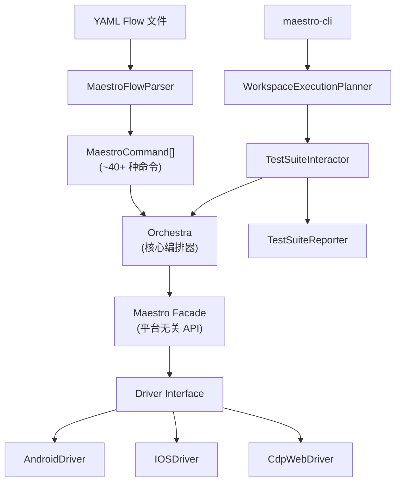

# External Repo Survey — Flywheel 架构借鉴分析

> 日期：2026-03-03
> 目的：对 3 个与 Flywheel 高度相关的 GitHub repo 做架构 deep dive，识别可借鉴的设计模式
> 方法论：每个 repo 启动独立 subagent 做深度代码分析，从 architecture 层面评估复用/参考价值

## 调研范围

| Repo | Stars | 语言 | License | 定位 |
|------|-------|------|---------|------|
| [conductor-oss/conductor](https://github.com/conductor-oss/conductor) | 31.5k | Java (Spring Boot) | Apache-2.0 | 通用分布式 workflow 引擎 (Netflix) |
| [smtg-ai/claude-squad](https://github.com/smtg-ai/claude-squad) | 6.2k | Go | **AGPL-3.0** | 多 AI agent session 管理 TUI |
| [mobile-dev-inc/Maestro](https://github.com/mobile-dev-inc/Maestro) | ~11k | Kotlin | Apache-2.0 | 移动端 E2E 测试编排框架 |

**结论**: 三个都不建议 fork — 语言壁垒 + 定位差异。但各有值得借鉴的架构模式。

---

## 1. Conductor OSS

### 1.1 项目概述

Netflix 开源的分布式 workflow orchestration 引擎，由 Orkes 维护。核心定位是通用 "workflow-as-code" 平台，用于协调数千个 microservices。

| 维度 | Conductor | Flywheel |
|------|-----------|----------|
| **语言** | Java (Spring Boot) | TypeScript (Node.js) |
| **用途** | 通用 microservice workflow orchestration | 专用: Linear issues → Claude Code → auto PR |
| **部署** | Server + external workers (分布式) | 单机 Mac (本地 tmux sessions) |
| **Worker 模型** | 多语言 SDK, HTTP/gRPC polling | 单一 runner: Claude Code CLI |
| **持久化** | Redis + MySQL/PostgreSQL + Elasticsearch | 无持久层 (Phase 2: SQLite) |
| **DAG** | JSON workflow definition, 运行时 evaluate | Kahn's topological sort, Linear issue dependencies |
| **并发** | 分布式 task queues, worker pools | Semaphore (configurable, default 3) |

### 1.2 核心架构

```
┌──────────────────────────────────────────────────────┐
│                   Conductor Server                    │
│                                                      │
│  WorkflowDef ──→ DeciderService ──→ Task Queues      │
│  (JSON schema)   (DAG evaluate)     (poll-based)     │
│                                                      │
│  WorkflowExec    Reconciler/Sweeper  Lock (dist.)    │
│  (state mgmt)    (self-healing)      (Zookeeper)     │
│                                                      │
│  ExecutionDAO    TaskMapper Registry                  │
│  (persistence)   (extensible task types)             │
└──────────────────────────────────────────────────────┘
                         │ poll/update
                         ▼
              External Workers (Java/Python/Go/JS)
              poll → execute → report status
```

#### 关键设计模式

**a) DeciderService — DAG 评估核心**

`DeciderService.decide()` 是最核心的方法 — 递归评估 workflow 当前状态，确定下一个可调度的 task，处理 Fork/Join 并行分支，管理 timeout/retry/state checkpoint。返回 `DeciderOutcome`（包含待调度 tasks + workflow 完成状态）。

**b) Task State Machine — 9 种状态**

```
SCHEDULED → IN_PROGRESS → COMPLETED
                        → FAILED → (retry) → SCHEDULED
                        → TIMED_OUT → (retry) → SCHEDULED
                        → FAILED_WITH_TERMINAL_ERROR (不可重试)
                        → COMPLETED_WITH_ERRORS (可选 task)
                        → CANCELED
                        → SKIPPED
```

关键区分：**可重试 failure** vs **terminal error**。Flywheel 当前只有 3 种状态（pending/done/shelved），缺少对 timeout、可重试失败、terminal error 的区分。

**c) 三层 Timeout 机制**

| Timeout | 含义 | Flywheel 等价 |
|---------|------|--------------|
| `pollTimeoutSeconds` | Task 在 queue 中等待 worker 的最大时间 | 无（直接 spawn） |
| `responseTimeoutSeconds` | Worker 必须在此时间内汇报进度 | `pane_dead` polling |
| `timeoutSeconds` | Task 总执行时间上限 | `sessionTimeoutMs` |

**d) Retry Policy — 3 种 backoff 策略**

```java
enum RetryLogic {
    FIXED,                // 固定延迟
    LINEAR_BACKOFF,       // 线性递增
    EXPONENTIAL_BACKOFF   // 指数递增
}
// + retryCount, retryDelaySeconds, backoffScaleFactor
```

**e) WorkflowReconciler (Sweeper) — 自愈模式**

定期扫描所有运行中的 workflow，找出 stuck/timeout 的，触发 `decide()` 重新评估。这是 self-healing 的核心机制。

**f) TaskMapper Registry — 可扩展 task 类型**

每种 task type 注册对应的 `TaskMapper`（ForkJoin、Switch、DoWhile、SubWorkflow、Human 等），遵循 Open-Closed principle。

### 1.3 与 Flywheel 的关联

**相似设计模式:**
- DAG-first 执行模型 — Conductor workflow definition 是显式 DAG；Flywheel 从 Linear dependencies 动态构建
- Task/Blueprint 抽象 — Conductor `WorkflowSystemTask` ≈ Flywheel `Blueprint`
- 状态评估循环 — `decide()` → schedule → wait → callback → `decide()` ≈ `dispatch()` → `getReady()` → `run()` → `markDone()` → loop
- External Blocker 处理 — Conductor `Human` task ≈ Flywheel `resolveExternalBlocker()`

**根本性不匹配:**
- Worker Polling Model — Conductor 假设大量无状态 workers poll queue。Flywheel 的 "worker" 是有状态的长时间 AI session，push model 更合适
- Java 生态系统 — 需要 Redis + Elasticsearch + Zookeeper，违背 "enforce simplicity" 原则
- 通用 vs 垂直 — 通用引擎的抽象层给垂直场景带来不必要的 complexity

### 1.4 可借鉴设计

| 优先级 | 模式 | 行动 | 目标阶段 |
|--------|------|------|----------|
| **P0** | Task 状态机细化 | 扩展 `NodeStatus` 到 7+ 种状态 | v0.2 Step 2b |
| **P0** | Retry Policy | 给 Blueprint 添加 `RetryPolicy` 配置 (3 种 backoff) | v0.2 Step 2b |
| **P1** | Response Timeout (Heartbeat) | Session 无进展时触发 Decision Layer 评估 | v0.2 Step 3 |
| **P1** | Compensation Workflow | `failureAction` 配置 (notify/escalate/retry_with_context) | v0.2 Step 2c |
| **P2** | Sweeper/Reconciler 自愈 | 定期扫描 orphan worktrees, zombie tmux panes | v0.3 |
| **P2** | Blueprint Registry | TaskMapper 模式 — 当 multi-runner 需求出现时 | Phase 2+ |
| Skip | Polling Model | Flywheel push model 更适合 AI agent |  |
| Skip | Distributed Locking | 单机运行，本地 Semaphore 足够 |  |
| Skip | Workflow DSL | DAG 来自 Linear issues，不需要静态定义 |  |

### 1.5 推荐

**Reference（参考）— 不建议 fork 或集成任何代码。**

借鉴 state machine 设计、retry policy、sweeper self-healing 模式，但 Java 生态、polling worker model、通用 workflow DSL 与 Flywheel "轻量、垂直、AI-native" 定位不匹配。

---

## 2. Claude Squad

### 2.1 项目概述

Go 语言编写的 terminal 管理工具，用于同时运行和管理多个 AI coding agent（Claude Code、Aider、Codex、Gemini）的独立工作区。

| 维度 | Claude Squad | Flywheel |
|------|-------------|----------|
| **核心目标** | 手动管理多个 agent session（TUI） | 全自动 issue → PR pipeline |
| **Session 启动** | 用户手动创建 | DAG resolver 自动 dispatch |
| **Completion 判定** | SHA256 hash + prompt 字符串检测 | HTTP callback + pane_dead poller |
| **PR 创建** | 用户手动 push | Blueprint 自动 via Claude prompt |
| **语言** | Go | TypeScript |
| **Session 限制** | 10 (hard limit) | Semaphore 控制 (configurable) |
| **Worktree lifecycle** | Pause/Resume (branch 保留) | Create/Remove (one-shot) |

### 2.2 核心架构

```
┌─────────────────────────────────────────────────────┐
│  CLI (Cobra)  →  rootCmd                            │
├─────────────────────────────────────────────────────┤
│  App Layer (Bubble Tea TUI)                         │
│  States: Default | New | Prompt | Help | Confirm    │
│  Tick: 500ms metadata polling                       │
├────────────────────┬────────────────────────────────┤
│  session/tmux/     │  session/git/                  │
│  TmuxSession       │  GitWorktree                   │
│  PTY attach/detach │  worktree CRUD                 │
│  Trust prompt auto │  Branch management             │
│  SHA256 hash diff  │  Push via gh CLI               │
│  Completion detect │  Diff stats tracking           │
├────────────────────┴────────────────────────────────┤
│  Instance lifecycle  |  JSON persistence            │
│  NewInstance→Start→Pause→Resume→Kill                │
│  daemon/daemon.go — Background polling              │
└─────────────────────────────────────────────────────┘
```

### 2.3 关键设计

**a) Session Instance 生命周期**

```
NewInstance() → Start(firstTimeSetup=true) → Running
                     ↓
              Pause() → commit + detach + remove worktree (branch preserved)
                     ↓
              Resume() → recreate worktree + restore tmux session
                     ↓
              Kill() → close tmux + cleanup worktree + delete branch
```

核心设计：Pause 时 worktree 被移除但 branch 保留，Resume 时从 branch 重建。节省磁盘空间。

**b) Trust Prompt 自动处理**

`CheckAndHandleTrustPrompt()` 扫描 pane 输出，检测 "Do you trust the files in this folder?" 等字符串，自动发送 Enter。维护了多种 program 的检测字符串。

**c) Completion Detection — 双信号**

- Content SHA256 hash 变化检测（`HasUpdated()`）
- Program-specific prompt 检测（e.g., "No, and tell Claude what to do differently"）
- 500ms polling interval

**d) Worktree 命名策略**

路径: `{worktreeDir}/{branchName}-{nanosecond_timestamp}` — 纳秒时间戳避免冲突。Flywheel 用 `removeIfExists()` 更显式。

### 2.4 与 Flywheel 的关联

**关键差异:**
- **Session vs Window 粒度**: Claude Squad 每个 instance 一个完整 tmux session；Flywheel 一个 session 下多个 windows（更轻量）
- **Completion Detection**: Claude Squad 用 hash polling + prompt 匹配（fragile）；Flywheel 用 HTTP callback（event-driven, 更精确）
- **Error Recovery**: Claude Squad 支持 Pause/Resume；Flywheel 用 `removeIfExists()` 做 rerun safety

**License 风险**: AGPL-3.0 要求通过网络提供服务的修改版本开源。即使只参考设计，fork code 需要注意 contamination。

### 2.5 可借鉴设计

| 优先级 | 模式 | 行动 | 目标阶段 |
|--------|------|------|----------|
| **P0** | Trust Prompt 自动处理 | 集成到 TmuxRunner pane polling，自动检测 + dismiss | v0.2 Step 2b |
| **P1** | State 持久化 | DAG execution state → SQLite，crash recovery | v0.3 |
| **P2** | Diff Stats 实时追踪 | 实时 diff stats 增强 Slack notification | v0.2 Step 2c |
| **P2** | Pause/Resume for Blocked | Decision Layer `blocked` 释放 worktree 磁盘 | v0.3 |
| Skip | 纳秒时间戳命名 | `removeIfExists()` 已解决 | |
| Skip | Daemon PID 管理 | Flywheel 不需要 daemon 化 | |
| Skip | TUI / Bubble Tea | Flywheel 是 headless orchestrator | |

### 2.6 推荐

**Reference（参考）— 不建议 fork（Go 语言壁垒 + AGPL license 风险）。**

主要参考价值在 trust prompt 自动处理和 session state 持久化两个 Flywheel 尚未完善的领域。Flywheel 在 HTTP callback、DAG dispatch、evidence collection 方面已经更成熟。

---

## 3. Maestro

### 3.1 项目概述

mobile.dev inc. 开发的 E2E 移动端和 Web 测试框架。通过 YAML 定义测试流程（Flow），实现跨平台 UI 自动化测试。

| 维度 | Maestro | Flywheel |
|------|---------|----------|
| **编排目标** | UI 测试命令 (tap/swipe/assert) | AI Agent 会话 (Claude Code) |
| **依赖模型** | 线性序列 (takeWhile 连续匹配) | DAG (拓扑排序, 动态 in-degree) |
| **并行模型** | 串行本地 + 闭源云端并行 | Worktree + Semaphore (本地并行) |
| **决策** | 静态 optional/continueOnFailure | AI Decision Layer (Haiku triage) |
| **输入** | YAML files (静态, 预定义) | Linear issues (动态, 实时 webhook) |
| **输出** | Test report (JUnit XML / HTML) | Git commits + PR |
| **语言** | Kotlin (JVM) | TypeScript (Node.js) |

### 3.2 核心架构



### 3.3 关键设计

**a) Sealed Exception Hierarchy — 类型化错误**

```
MaestroException (sealed)
├── UnableToLaunchApp
├── AppCrash
├── DriverTimeout
├── AssertionFailure
│   └── ElementNotFound
├── InvalidCommand
└── ... (~15 种具体异常)

MaestroDriverStartupException (sealed, 独立层级)
├── AndroidDriverTimeoutException
└── AndroidInstrumentationSetupFailure
```

关键区分: **运行时异常** vs **启动异常** 分开处理。`optional` flag 控制命令是否可以失败继续。

**b) Callback Hook 系统**

Orchestra 提供 `onCommandStart/Complete/Failed/Warned/Skipped` 细粒度回调。三级分类: `CommandWarned`（警告继续）、`CommandSkipped`（静默跳过）、`CommandFailed`（可选/必需）。

**c) Scope Isolation for Sub-flows**

`enterEnvScope()` / `leaveEnvScope()` 隔离嵌套执行的变量。每个 sub-flow 有独立的环境变量 scope。

**d) Structured Execution Summary**

`TestExecutionSummary → SuiteResult → FlowResult → StepResult` 层级结构，支持 JUnit XML + HTML + AI 分析报告。

### 3.4 可借鉴设计

| 优先级 | 模式 | 行动 | 目标阶段 |
|--------|------|------|----------|
| **P0** | Typed Error Hierarchy | Discriminated union: `RunnerTimeout`, `GitConflict`, `HookTimeout`, `DecisionEscalation` | v0.2 Step 2b |
| **P1** | Structured Execution Summary | AuditLogger 数据模型参考 — `ExecutionSummary → IssueResult → StepResult` | v0.2 Step 2b |
| **P1** | Fine-grained Lifecycle Callbacks | 比 success/error 二分法更精细的状态上报 | v0.2 Step 2c |
| **P2** | Scope Isolation | Sub-task 场景下嵌套 session 环境变量隔离 | v0.3 |
| Skip | Linear Execution Planner | Flywheel DAG 已经更强 | |
| Skip | Device Driver 抽象 | 只有一种 runner (Claude Code) | |
| Skip | YAML Flow DSL | 不需要静态 flow DSL | |

### 3.5 推荐

**Reference（参考）— 不推荐 fork（Kotlin → TypeScript 跨语言, 领域不同）。**

值得带走的三个 pattern: (1) Typed error hierarchy, (2) Fine-grained lifecycle callbacks, (3) Structured execution summary model。

---

## 综合对比与优先级汇总

### 按优先级排序的可借鉴设计

#### P0 — 直接融入 v0.2 Step 2b/2c

| # | 模式 | 来源 | 当前 Flywheel 状态 | 建议改进 |
|---|------|------|-------------------|---------|
| 1 | **Task 状态机细化** | Conductor | 3 种: pending/done/shelved | 7+ 种: 加 `scheduled`, `in_progress`, `failed`, `terminal_error`, `timed_out` |
| 2 | **Typed Error Hierarchy** | Maestro | `result.error` string | Discriminated union，区分启动异常 vs 运行时异常 vs 决策升级 |
| 3 | **Retry Policy** | Conductor | 无重试 | 3 种 backoff (FIXED, LINEAR, EXPONENTIAL)，Claude session 默认 retry=1 |
| 4 | **Trust Prompt 自动处理** | Claude Squad | v0.1.1 已知 bug，手动 workaround | 集成到 TmuxRunner pane polling，自动检测 + dismiss |

#### P1 — v0.2 后期或 Step 3

| # | 模式 | 来源 | 建议 |
|---|------|------|------|
| 5 | Structured Execution Summary | Maestro | AuditLogger 分层数据模型 |
| 6 | Fine-grained Lifecycle Callbacks | Maestro | 比 success/error 更精细的状态上报 |
| 7 | Response Timeout (Heartbeat) | Conductor | Session 无进展时触发 Decision Layer |
| 8 | Compensation Workflow | Conductor | `failureAction` 配置化 |

#### P2 — v0.3+

| # | 模式 | 来源 | 建议 |
|---|------|------|------|
| 9 | State 持久化 | Claude Squad | DAG state → SQLite, crash recovery |
| 10 | Sweeper/Reconciler | Conductor | 定期扫描 orphans + stuck sessions |
| 11 | Pause/Resume | Claude Squad | blocked 状态释放 worktree 磁盘 |
| 12 | Scope Isolation | Maestro | Sub-task 环境变量隔离 |
| 13 | Diff Stats 实时追踪 | Claude Squad | Slack notification 实时进度 |

### 三大洞察

1. **Flywheel 定位独特** — 三个 repo 都不是直接竞品。Conductor 太重（通用分布式引擎），Claude Squad 不够自动化（手动管理工具），Maestro 领域不同（测试框架）。没有发现可以直接 fork 复用的 repo。

2. **Claude Squad 底层重叠最高** — tmux + worktree 机制高度重叠，但 Flywheel 的实现已更成熟（HTTP callback、DAG dispatch、evidence collection）。主要参考价值在 trust prompt 处理和 state 持久化。

3. **Conductor 模式深度最高** — 状态机、retry policy、sweeper 是经过 Netflix 大规模验证的 pattern，直接适用于 Decision Layer 和 DagDispatcher。

### 对 v0.2 Step 2b 的具体影响

以下设计将融入 Step 2b（Decision Layer）实现计划：

```typescript
// 1. Typed Error Hierarchy (from Maestro)
type FlywheelError =
  | { type: 'runner_timeout'; sessionId: string; elapsed: number }
  | { type: 'runner_startup_failure'; reason: string }  // 区分启动 vs 运行时
  | { type: 'git_conflict'; worktree: string; files: string[] }
  | { type: 'hook_callback_timeout'; hookId: string }
  | { type: 'decision_escalation'; reason: string; context: unknown }
  | { type: 'terminal_error'; reason: string }  // 不可重试

// 2. Retry Policy (from Conductor)
interface RetryPolicy {
  retryCount: number;        // default: 1 (Claude sessions 成本高)
  retryDelaySeconds: number; // default: 30
  retryLogic: 'FIXED' | 'LINEAR_BACKOFF' | 'EXPONENTIAL_BACKOFF';
  backoffRate?: number;
}

// 3. Expanded Node Status (from Conductor)
type NodeStatus =
  | 'pending'        // 等待依赖
  | 'scheduled'      // 依赖满足，等待 semaphore slot
  | 'in_progress'    // Claude Code 正在执行
  | 'completed'      // 成功完成
  | 'failed'         // 可重试的失败
  | 'terminal_error' // 不可重试
  | 'timed_out'      // 超时
  | 'shelved'        // 人工搁置
  | 'skipped';       // 跳过 (依赖 terminal_error)

// 4. Structured Execution Summary (from Maestro)
interface ExecutionSummary {
  issueId: string;
  status: NodeStatus;
  duration: number;
  worktree?: string;
  prUrl?: string;
  steps: StepResult[];  // hydrate → inject → run → check → decide
  failure?: { message: string; phase: 'setup' | 'execution' | 'cleanup' };
  retryAttempt: number;
  retryPolicy: RetryPolicy;
}
```

---

## 与前次 Survey 的关系

本调研是对 `doc/engineer/exploration/new/v0.2-trending-repo-survey.md`（2026-03-01，13 个 trending repos）的**补充调研**。前次 survey 覆盖了 superset-ai（worktree + hook 代码直接移植）、ruflo（session forking）、markitdown（附件预处理）等直接可用的工具。

本次 3 个 repo 侧重**架构模式参考**（不是代码复用），与前次 survey 互补：

| 维度 | 前次 Survey (13 repos) | 本次 Survey (3 repos) |
|------|----------------------|---------------------|
| **目标** | 代码复用 + 直接集成 | 架构模式借鉴 |
| **产出** | 实际移植代码 (WorktreeManager, HookCallbackServer) | 设计 pattern 融入计划 |
| **阶段影响** | v0.2 Step 1 (已完成) | v0.2 Step 2b/2c (即将开始) |
