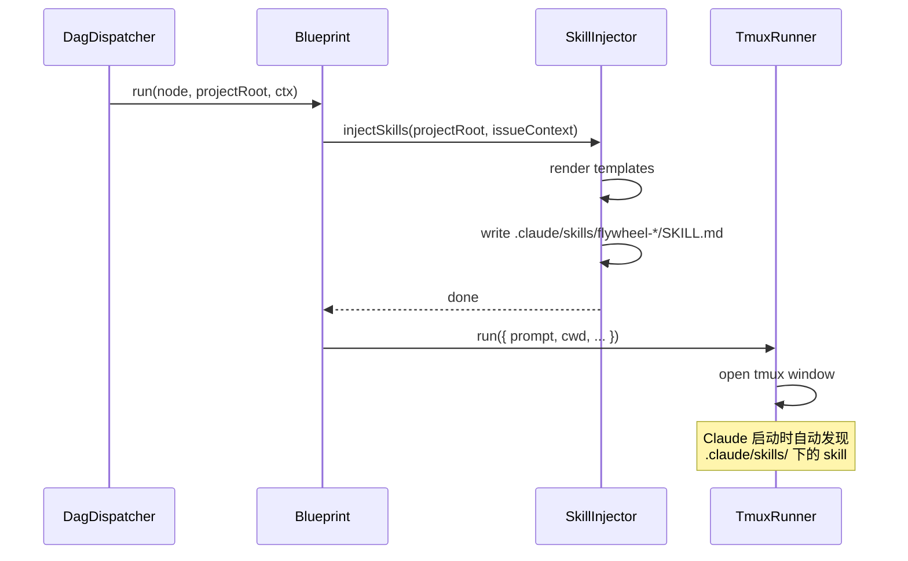

# v0.2 Skill 注入系统设计

> 日期：2026-03-01
> 阶段：v0.2 探索设计
> 输入：`claude-scientific-skills` 代码分析 + `v0.2-trending-repo-survey.md`

---

## 1. SKILL.md 格式规范

### 1.1 格式来源

[Agent Skills 标准](https://agentskills.io/) 是一个开放规范，由 claude-scientific-skills（148 个 skill）广泛采用。Claude Code、Cursor、Codex 均原生支持此格式，自动发现安装目录下的 skill 文件夹。

### 1.2 完整格式结构

一个 skill 由一个目录组成，目录内必须包含 `SKILL.md` 文件：

```
<skill-name>/
├── SKILL.md          # 必须，核心描述文件
├── references/       # 可选，分层文档（按需加载）
│   ├── topic-a.md
│   └── topic-b.md
├── scripts/          # 可选，可执行脚本
│   └── helper.py
└── assets/           # 可选，静态资源
```

### 1.3 YAML Frontmatter 字段

从 claude-scientific-skills 分析提取的 frontmatter 字段：

```yaml
---
name: <skill-name>                    # 必须。唯一标识符，小写连字符（kebab-case）
description: <one-paragraph>          # 必须。Agent 自动发现时读取的描述
                                      #   应包含：何时用、适用场景、与其他 skill 的关系
allowed-tools: Read Write Edit Bash   # 可选。限制 Agent 可用的工具
                                      #   省略 = 不限制（默认全部可用）
license: MIT License                  # 可选，推荐填写
metadata:
    skill-author: <author>            # 可选
    skill-version: <version>          # 可选（非标准，部分 skill 使用）
---
```

**关键观察**：
- `description` 字段是 Agent 自动选择 skill 的核心依据，必须精确描述触发场景
- `allowed-tools` 在需要工具限制时填写（如只需 `Read Write`，不需要 `Bash`）
- 科学类 skill 通常不填 `allowed-tools`，让 Agent 自由使用工具
- Flywheel skill 建议明确填写 `allowed-tools`，防止 Claude 越权操作

### 1.4 Markdown Body 结构（从多个 skill 提取的最佳实践）

claude-scientific-skills 所有 skill 遵循一致的 body 结构：

```markdown
# <Skill 标题>

## Overview
一段话概述：这个 skill 是什么，核心价值是什么。

## When to Use This Skill
明确的触发场景列表（bullet points）。
包含 NOT to Use 或对比场景（与其他 skill 的区别）。

## <核心内容区域>
Skill 的主要文档，可以是：
- 分步骤工作流（Phase 1 → Phase 2 → ...）
- 配置和参数说明
- 代码示例（Quick Start）
- 参考资料引用（"See references/topic.md for details"）

## Best Practices
可操作的最佳实践列表。

## Troubleshooting（可选）
常见问题及解决方案。

## Integration with Other Skills（可选）
与其他 skill 的协作方式，体现 skill 互操作性。
```

### 1.5 关键设计模式

从 claude-scientific-skills 提取的三个核心 prompt 设计模式：

**模式 1：分层文档引导（Tiered Reference Loading）**
```
SKILL.md 包含 overview + 快速示例
references/ 包含深度文档，只在需要时读取
→ 减少 context window 占用，按需展开
```

**模式 2：明确的 When/NOT to Use**
```
与竞争 skill 的对比说明（如 biopython vs gget vs bioservices）
→ 帮助 Agent 在多个 skill 之间做出正确选择
```

**模式 3：Skill 互操作引用**
```
"After completing this step, use the <other-skill> skill for..."
→ 构建 skill 协作链，支持复杂多步骤工作流
```

---

## 2. Flywheel 专用 Skill 模板（5 个完整文件）

### 2.1 flywheel-context

**目的**：注入项目上下文（codebase 概述、tech stack、coding conventions）。

```markdown
---
name: flywheel-context
description: Flywheel project context injection. Use at the START of every Flywheel-orchestrated session to understand the project structure, tech stack, and coding conventions. This skill is automatically injected by TmuxRunner before session start. Contains project-specific codebase overview, TypeScript conventions, file structure, and key architectural decisions. Do NOT use for issue-specific information (use linear-issue-context instead).
allowed-tools: Read Bash
metadata:
    skill-author: flywheel
    skill-version: 0.1.0
---

# Flywheel: Project Context

## Overview

你正在参与一个由 Flywheel 编排的自动化开发任务。本 skill 提供项目的完整 context，
帮助你快速理解 codebase 结构、技术栈和开发规范，避免浪费 token 重复探索。

**读取本 skill 后，你已经掌握了足够的上下文开始工作。**

## When to Use This Skill

- 在每个 Flywheel session 开始时自动加载（TmuxRunner 注入）
- 在需要了解项目整体结构时主动调用
- 在查找某个模块/文件应该放在哪里时参考

## Project: {{projectName}}

**类型**：{{projectType}}
**语言**：{{primaryLanguage}}
**主要框架**：{{frameworks}}

## Tech Stack

{{techStackSection}}

## Project Structure

```
{{projectStructure}}
```

## Key Files

{{keyFilesSection}}

## Coding Conventions

### TypeScript
- 使用 `type` 而非 `interface`（除非需要 declaration merging）
- 所有公共 API 使用 JSDoc 注释
- 错误处理：显式处理，不 swallow errors
- 严格模式：`"strict": true`，不用 `any`

### Git & PR
- 分支命名：`feat/<issue-id>-<short-desc>`（如 `feat/GEO-42-add-auth`）
- Commit format：`<type>(<scope>): <description>`
- PR 标题：简洁，< 70 字符
- 每个 PR 必须关联 Linear issue（在 description 中注明）

### 文件组织
{{fileOrganizationSection}}

## Architecture Overview

{{architectureSection}}

## Dependencies and Services

{{dependenciesSection}}

## Do NOT

- 修改 `.env` 文件或 hardcode secrets
- 在 `src/` 之外创建业务逻辑文件
- 跳过错误处理
- 使用 `console.log` 作为生产日志（使用项目的 logger）

## Related Skills

- `linear-issue-context` — 获取当前 Linear issue 的详细信息
- `flywheel-git-workflow` — 具体的 Git 操作规范
- `flywheel-tdd` — TDD 工作流要求
```

### 2.2 linear-issue-context

**目的**：注入 Linear issue 具体信息（描述、依赖、历史 PR）。

```markdown
---
name: linear-issue-context
description: Linear issue context for the current Flywheel task. Use IMMEDIATELY after flywheel-context to understand what specific work is required. Contains the issue title, description, acceptance criteria, blocked-by/blocks relationships, and links to related PRs. This skill is dynamically generated per-issue by TmuxRunner. Do NOT use this skill as a general project guide (use flywheel-context instead).
allowed-tools: Read
metadata:
    skill-author: flywheel
    skill-version: 0.1.0
---

# Linear Issue Context

## Current Issue

**ID**：{{issueId}}
**Title**：{{issueTitle}}
**Status**：{{issueStatus}}
**Priority**：{{issuePriority}}
**Assignee**：Flywheel (automated)
**URL**：{{issueUrl}}

## Description

{{issueDescription}}

## Acceptance Criteria

{{acceptanceCriteria}}

## Dependencies

### Blocked By (must complete first)
{{blockedBy}}

### Blocks (will unblock after this)
{{blocks}}

## Related Context

### Related PRs
{{relatedPrs}}

### Related Issues
{{relatedIssues}}

### Labels
{{issueLabels}}

## Implementation Hints

{{implementationHints}}

## Definition of Done

完成本 issue 的标准：

1. 所有 acceptance criteria 满足
2. 写了相关测试（unit + integration，按需 E2E）
3. 测试全部通过
4. 代码已 commit 到 feature branch
5. PR 已创建并关联本 issue（{{issueId}}）
6. PR description 包含：变更摘要 + 测试计划

## What NOT to Do

- 不要处理 "Blocked By" 中的依赖 issue（那是 Flywheel 的 DAG 调度范围）
- 不要更改与本 issue 无关的文件
- 不要在本 issue 中修复 "顺便发现" 的 bug（创建新 Linear issue）
```

### 2.3 flywheel-git-workflow

**目的**：强化 Flywheel 的 Git 工作流规范。

```markdown
---
name: flywheel-git-workflow
description: Flywheel Git workflow enforcement. Use when creating branches, making commits, or opening pull requests. Provides exact branch naming conventions, commit message format, PR template, and GitHub CLI commands. This skill OVERRIDES default git behavior — follow it precisely so Flywheel's GitResultChecker can detect completed work. Incorrect branch naming or missing commits will cause the session to be marked as FAILED.
allowed-tools: Bash Read Write
metadata:
    skill-author: flywheel
    skill-version: 0.1.0
---

# Flywheel: Git Workflow

## Overview

Flywheel 通过 GitResultChecker 检测工作是否完成（`commitCount > 0`）。
本 skill 规定了精确的 Git 工作流，必须严格遵守，否则 session 会被判定为失败。

## When to Use This Skill

- 创建 feature branch 时
- 每次 commit 前
- 创建 PR 时
- 需要 push 或处理 CI 失败时

## Step 1: Create Feature Branch

```bash
# 格式：feat/<issue-id>-<short-description>
# Issue ID 使用小写，单词用连字符分隔
git checkout -b feat/{{issueId}}-{{branchSuffix}}

# 示例：
# git checkout -b feat/geo-42-add-user-auth
# git checkout -b feat/fly-7-tmux-runner-completion
```

**规则**：
- 前缀必须是 `feat/`（bug fix 用 `fix/`，重构用 `refactor/`）
- Issue ID 小写（`GEO-42` → `geo-42`）
- 描述简短，2-4 个单词，连字符分隔
- 不使用空格或特殊字符

## Step 2: Make Commits

```bash
# Commit message 格式：<type>(<scope>): <description>
# Types: feat, fix, refactor, test, docs, chore, perf
# Scope: 可选，表示影响的模块

git add <specific-files>    # 不要 git add -A（避免提交不相关文件）
git commit -m "feat(auth): add JWT token validation"

# 多行 commit（大改动时）：
git commit -m "feat(runner): implement TmuxRunner session lifecycle

- Add tmux window creation with session ID
- Implement SessionEnd hook detection
- Add pane_dead polling fallback (5s interval, 4h timeout)
- Preserve window on failure for debugging"
```

**Commit 规范**：
- 每个逻辑变更一个 commit（不要把所有改动堆在一个 commit）
- description 使用英文，动词开头（add, implement, fix, remove）
- **至少要有 1 个 commit** — 这是 Flywheel 判定成功的标准

## Step 3: Push Branch

```bash
# 首次 push（设置 upstream）
git push -u origin feat/{{issueId}}-{{branchSuffix}}

# 后续 push
git push
```

## Step 4: Create Pull Request

```bash
# 使用 gh CLI 创建 PR（必须包含 Linear issue 链接）
gh pr create \
  --title "feat: <description> ({{issueId}})" \
  --body "$(cat <<'EOF'
## Summary

- <变更点 1>
- <变更点 2>

## Test Plan

- [ ] Unit tests pass: `pnpm test`
- [ ] Integration tests pass
- [ ] Manual verification: <steps>

## Linear Issue

{{issueId}}: {{issueTitle}}
{{issueUrl}}
EOF
)"
```

## Step 5: Handle CI Failures

如果 CI 失败：

```bash
# 查看 CI 状态
gh pr checks

# 查看失败详情
gh run view <run-id> --log-failed

# 修复问题后重新 push
git add <fixed-files>
git commit -m "fix(<scope>): resolve CI failure - <reason>"
git push
```

## Critical Rules

1. **必须在 feature branch 上工作**，不能直接在 `main` 上 commit
2. **必须有至少 1 个 commit** — Flywheel 以此判断任务完成
3. **PR 必须关联 Linear issue** — 在 body 中包含 `{{issueId}}` 和 issue URL
4. **不要 `git add -A`** — 只 add 与本 issue 相关的文件
5. **不要 force push** — 除非明确被要求

## Pre-commit Checklist

在最终 commit 前检查：

```bash
# 运行 linter
{{lintCommand}}

# 运行测试
{{testCommand}}

# 检查 diff（确认没有误提交）
git diff --staged
```

## Related Skills

- `flywheel-tdd` — 测试要求（RED → GREEN → REFACTOR）
- `flywheel-escalation` — 当 CI 持续失败时的升级流程
```

### 2.4 flywheel-escalation

**目的**：定义遇到阻塞时的升级流程（何时 shelve、何时重试、何时请求人工介入）。

```markdown
---
name: flywheel-escalation
description: Flywheel escalation procedures for blocked or failing sessions. Use when you encounter obstacles you cannot resolve autonomously: compilation errors that persist after 3 attempts, missing credentials or API keys, architectural ambiguity requiring human judgment, test failures caused by infrastructure (not code), or dependency issues outside this issue's scope. Following this skill correctly triggers Flywheel's Decision Layer to notify the human.
allowed-tools: Bash Write
metadata:
    skill-author: flywheel
    skill-version: 0.1.0
---

# Flywheel: Escalation Procedures

## Overview

Flywheel 的核心设计原则：**人类注意力是瓶颈，不是 AI 能力**。
大多数问题你应该自主解决。但有些情况确实需要人类决策。
本 skill 定义了何时升级、如何升级，以及升级后你该做什么。

## When to Use This Skill

**需要升级（escalate）的情况**：

1. **Credentials / Secrets 缺失**
   - 需要 API key、数据库密码、OAuth token 但 `.env` 中没有
   - 无法通过文档或代码推断出来
   - ⚠️ 永远不要自己生成或 hardcode secrets

2. **架构决策歧义**
   - Issue 描述中有两种或以上合理实现方案
   - 选择哪种会有实质性的长期影响（不只是样式差异）
   - 你无法从 CLAUDE.md、现有代码或注释中找到明确指导

3. **外部系统故障**
   - 第三方 API 持续返回错误（非你代码问题）
   - CI 环境问题（flaky tests、infrastructure failure）
   - 依赖包无法安装（registry 问题、版本冲突无解）

4. **Scope 超出**
   - 修复本 issue 需要大规模重构另一个模块
   - 需要修改 5+ 个文件且逻辑上属于独立 issue

5. **持续失败（3次以上）**
   - 同一个错误在 3 次不同修复尝试后依然出现
   - 测试失败原因不明（看似随机）

## When NOT to Escalate

**自主解决的情况**（不要升级）：

- 语法错误、typo — 直接修复
- 测试失败（你写的代码导致）— 修复代码
- linting 错误 — 修复格式
- 文档不完整 — 查阅相关代码/注释推断
- CI 第一次失败 — 先尝试修复
- 简单的设计选择（命名、文件位置）— 遵循现有惯例

## Escalation Procedure

### Step 1: Document the Blocker

在 Linear issue 上留下 comment 记录阻塞原因：

```bash
# 获取 issue ID（从 linear-issue-context skill 中获取）
ISSUE_ID="{{issueId}}"

# 记录阻塞情况（如果有 gh CLI 权限可以发 PR comment）
# 否则，创建一个文件记录阻塞信息供人类检查
cat > /tmp/flywheel-escalation-{{issueId}}.md << 'ESCALATION'
## Escalation Report

**Issue**: {{issueId}} — {{issueTitle}}
**Timestamp**: $(date -u +"%Y-%m-%dT%H:%M:%SZ")
**Session**: $(echo $TMUX_PANE)

### Blocker Type
<类型：credential_missing | architecture_ambiguity | external_failure | scope_exceeded | repeated_failure>

### Description
<详细描述遇到的问题>

### What I Tried
1. <尝试 1>
2. <尝试 2>
3. <尝试 3（如有）>

### What I Need
<需要人类提供什么：密钥/决策/权限/等>

### Current State
- Branch: $(git branch --show-current)
- Last commit: $(git log --oneline -1)
- Working tree: $(git status --short | head -5)
ESCALATION

echo "Escalation report written to /tmp/flywheel-escalation-{{issueId}}.md"
```

### Step 2: Save Work in Progress

如果有部分完成的代码，commit 到 WIP branch：

```bash
# 只 commit 当前已完成的、有价值的部分
git add <files-with-real-progress>
git commit -m "wip({{issueId}}): partial implementation - blocked on <reason>

ESCALATION REQUIRED: <one-line summary of blocker>

See /tmp/flywheel-escalation-{{issueId}}.md for details"

git push -u origin feat/{{issueId}}-<branch-suffix>
```

如果没有任何可 commit 的内容，不要 commit。

### Step 3: Stop — Do Not Loop

一旦决定升级：
- **停止所有实现尝试**
- **不要进行更多重试**（你已经确认了阻塞原因）
- 等待 Flywheel 的 Decision Layer 处理（它会通知人类）

**会话自然结束**，Flywheel 会检测到 session 结束并处理后续。

## Decision Tree

```
遇到问题
    ↓
是否已尝试 ≥ 3 次不同方案？
    ├── 否 → 继续尝试
    └── 是 ↓
        问题类型？
        ├── 缺少 credentials → 立即升级
        ├── 架构歧义 → 从代码/CLAUDE.md 推断 → 仍有歧义 → 升级
        ├── 外部系统故障 → 等待 5 分钟重试 → 仍失败 → 升级
        ├── Scope 超出 → 记录，升级，不扩展 scope
        └── 持续失败（代码问题）→ 升级
```

## Severity Levels

| 级别 | 描述 | 行动 |
|------|------|------|
| `blocking` | 完全无法继续 | 立即升级，保存 WIP |
| `degraded` | 可以继续但结果不完整 | 完成可完成的部分，标记 TODO，升级 |
| `advisory` | 可以继续但有疑虑 | 继续，在 PR 中说明 |

## Related Skills

- `flywheel-git-workflow` — 保存 WIP commit 的格式
- `linear-issue-context` — 获取 issue ID 和 URL
```

### 2.5 flywheel-tdd

**目的**：强制执行 TDD 工作流（RED → GREEN → REFACTOR）。

```markdown
---
name: flywheel-tdd
description: Flywheel TDD (Test-Driven Development) workflow enforcement. Use when implementing any new feature, bug fix, or behavior change. Enforces RED → GREEN → REFACTOR cycle. Required by Flywheel's quality standards — all code changes must have corresponding tests. Use this skill BEFORE writing implementation code. Pair with flywheel-git-workflow for correct commit structure.
allowed-tools: Bash Read Write Edit
metadata:
    skill-author: flywheel
    skill-version: 0.1.0
---

# Flywheel: TDD Workflow

## Overview

Flywheel 强制要求 TDD。不写测试直接实现是被禁止的。
本 skill 提供精确的 RED → GREEN → REFACTOR 工作流，
以及针对 {{projectName}} 技术栈的具体命令。

**核心原则**：测试是实现的规格说明，不是事后补充。

## When to Use This Skill

- 实现任何新功能（feature）
- 修复 bug（先写能复现 bug 的测试）
- 修改已有逻辑的行为
- 添加边界条件处理

## NOT to Use

- 纯重构（不改变行为）→ 确保现有测试通过即可
- 配置文件修改 → 不需要测试
- 文档更新 → 不需要测试

## TDD Cycle

### Phase 1: RED — Write Failing Test

**先写测试，此时它应该失败。**

```bash
# 运行测试，确认它失败（RED）
{{testCommand}} --testPathPattern="<test-file>"

# 期待输出包含：FAIL 或 Error
```

测试文件命名规范：
```
src/<module>/__tests__/<module>.test.ts
```

单元测试模板（TypeScript + {{testFramework}}）：

```typescript
import { describe, it, expect, beforeEach } from '{{testFramework}}';
import { <ClassUnderTest> } from '../<module>.js';

describe('<ClassUnderTest>', () => {
  let sut: <ClassUnderTest>;

  beforeEach(() => {
    sut = new <ClassUnderTest>(/* dependencies */);
  });

  describe('<methodName>', () => {
    it('should <expected behavior> when <condition>', async () => {
      // Arrange
      const input = <test-input>;

      // Act
      const result = await sut.<methodName>(input);

      // Assert
      expect(result).<matcher>;
    });

    it('should throw <ErrorType> when <invalid condition>', async () => {
      // Arrange
      const invalidInput = <bad-input>;

      // Act & Assert
      await expect(sut.<methodName>(invalidInput))
        .rejects.toThrow(<ErrorType>);
    });
  });
});
```

**RED 阶段检查清单**：
- [ ] 测试文件已创建
- [ ] 测试描述清晰表达了期望行为
- [ ] 运行测试 → 确认 **FAIL**（如果测试已经 pass，说明测试写错了）

### Phase 2: GREEN — Make Test Pass

**写最少的代码让测试通过。**

```bash
# 实现代码后运行测试
{{testCommand}} --testPathPattern="<test-file>"

# 期待输出：PASS
```

GREEN 阶段原则：
- 写**最简单**的实现让测试通过
- 暂时不考虑边界情况（留给后续测试）
- 暂时不考虑性能优化（留给 REFACTOR）
- 不要提前抽象

**GREEN 阶段检查清单**：
- [ ] 所有测试 PASS
- [ ] 没有 `any` 类型绕过（除非确实必要）
- [ ] 没有注释掉的代码

### Phase 3: REFACTOR — Clean Up

**在所有测试仍然通过的前提下，改善代码质量。**

```bash
# 重构后持续运行测试
{{testCommand}} --testPathPattern="<test-file>"
{{testCommand}}  # 完整测试套件
```

REFACTOR 阶段重点：
- 消除重复代码（DRY）
- 改善命名（函数名、变量名）
- 提取辅助函数
- 添加 JSDoc 注释
- 处理边界情况（可能会触发新的 RED 轮次）

### Commit 节奏

TDD 配合的 commit 策略：

```bash
# RED：测试写完后（还没实现）
git commit -m "test(<scope>): add failing tests for <feature>"

# GREEN：实现通过后
git commit -m "feat(<scope>): implement <feature> (tests passing)"

# REFACTOR：重构后
git commit -m "refactor(<scope>): clean up <feature> implementation"
```

**最终 commit 数量**：至少 2 个（test + impl），推荐 3 个（test + impl + refactor）

## Coverage Requirements

Flywheel 要求 **80%+ 测试覆盖率**：

```bash
# 检查覆盖率
{{coverageCommand}}

# 如果覆盖率不足，识别未覆盖的分支并补测试
```

重点覆盖：
- Happy path
- Error/exception paths
- Edge cases（空输入、null、边界值）
- Async 操作的 rejection

## Integration Tests

对于涉及多个模块的功能，还需要 integration test：

```typescript
// __tests__/integration/<feature>.integration.test.ts
describe('<feature> integration', () => {
  it('should work end-to-end: <scenario>', async () => {
    // 使用真实依赖（或轻量级 stub）
    // 验证多个模块协作的结果
  });
});
```

## Anti-Patterns（禁止）

```typescript
// ❌ 写完实现再补测试（事后测试）
// ❌ 测试只测 happy path
// ❌ mock 所有依赖导致测试不测任何真实逻辑
// ❌ 为了通过测试而 hardcode 返回值（除非 MVP 占位）
// ❌ 忽略 TypeScript 类型错误
```

## Related Skills

- `flywheel-git-workflow` — TDD 配套的 commit 格式
- `flywheel-context` — 项目使用的 test framework 信息
- `flywheel-escalation` — 测试因基础设施问题持续失败时
```

---

## 3. 注入机制设计

### 3.1 文件写入时机

TmuxRunner 在启动 tmux session **之前**，将 skill 写入 worktree 的 `.claude/skills/` 目录。



### 3.2 TypeScript 实现

```typescript
// packages/edge-worker/src/SkillInjector.ts

import { mkdirSync, writeFileSync } from "node:fs";
import { join } from "node:path";
import type { HydratedIssue } from "./PreHydrator.js";
import type { ProjectConfig } from "./types.js";

export interface SkillContext {
  issue: HydratedIssue;
  projectConfig: ProjectConfig;
}

export class SkillInjector {
  /**
   * Writes Flywheel skill files to <projectRoot>/.claude/skills/
   * Called by Blueprint before TmuxRunner.run().
   */
  async inject(projectRoot: string, ctx: SkillContext): Promise<void> {
    const skillsDir = join(projectRoot, ".claude", "skills");
    mkdirSync(skillsDir, { recursive: true });

    const skills = [
      { name: "flywheel-context", content: this.renderContext(ctx) },
      { name: "linear-issue-context", content: this.renderIssueContext(ctx) },
      { name: "flywheel-git-workflow", content: this.renderGitWorkflow(ctx) },
      { name: "flywheel-escalation", content: this.renderEscalation(ctx) },
      { name: "flywheel-tdd", content: this.renderTdd(ctx) },
    ];

    for (const skill of skills) {
      const skillDir = join(skillsDir, skill.name);
      mkdirSync(skillDir, { recursive: true });
      writeFileSync(join(skillDir, "SKILL.md"), skill.content, "utf-8");
    }
  }

  private renderContext(ctx: SkillContext): string {
    const { projectConfig } = ctx;
    return FLYWHEEL_CONTEXT_TEMPLATE
      .replace(/{{projectName}}/g, projectConfig.name)
      .replace(/{{projectType}}/g, projectConfig.type)
      .replace(/{{primaryLanguage}}/g, projectConfig.language)
      .replace(/{{frameworks}}/g, projectConfig.frameworks.join(", "))
      .replace(/{{techStackSection}}/g, this.buildTechStack(projectConfig))
      .replace(/{{projectStructure}}/g, projectConfig.structure)
      .replace(/{{keyFilesSection}}/g, this.buildKeyFiles(projectConfig))
      .replace(/{{architectureSection}}/g, projectConfig.architectureNotes)
      .replace(/{{dependenciesSection}}/g, this.buildDeps(projectConfig))
      .replace(/{{fileOrganizationSection}}/g, projectConfig.fileOrgNotes);
  }

  private renderIssueContext(ctx: SkillContext): string {
    const { issue, projectConfig } = ctx;
    return LINEAR_ISSUE_CONTEXT_TEMPLATE
      .replace(/{{issueId}}/g, issue.issueId)
      .replace(/{{issueTitle}}/g, issue.issueTitle)
      .replace(/{{issueStatus}}/g, issue.issueStatus ?? "In Progress")
      .replace(/{{issuePriority}}/g, issue.issuePriority ?? "Medium")
      .replace(/{{issueUrl}}/g, issue.issueUrl ?? "")
      .replace(/{{issueDescription}}/g, issue.issueDescription)
      .replace(/{{acceptanceCriteria}}/g, issue.acceptanceCriteria ?? "_No explicit criteria — implement per description._")
      .replace(/{{blockedBy}}/g, this.formatDeps(issue.blockedBy))
      .replace(/{{blocks}}/g, this.formatDeps(issue.blocks))
      .replace(/{{relatedPrs}}/g, this.formatPrs(issue.relatedPrs))
      .replace(/{{relatedIssues}}/g, this.formatIssues(issue.relatedIssues))
      .replace(/{{issueLabels}}/g, (issue.labels ?? []).join(", ") || "_none_")
      .replace(/{{implementationHints}}/g, issue.implementationHints ?? "_None provided._");
  }

  private renderGitWorkflow(ctx: SkillContext): string {
    const { issue, projectConfig } = ctx;
    const branchSuffix = this.slugify(issue.issueTitle);
    return FLYWHEEL_GIT_WORKFLOW_TEMPLATE
      .replace(/{{issueId}}/g, issue.issueId.toLowerCase())
      .replace(/{{branchSuffix}}/g, branchSuffix)
      .replace(/{{issueTitle}}/g, issue.issueTitle)
      .replace(/{{issueUrl}}/g, issue.issueUrl ?? "")
      .replace(/{{lintCommand}}/g, projectConfig.lintCommand ?? "pnpm lint")
      .replace(/{{testCommand}}/g, projectConfig.testCommand ?? "pnpm test");
  }

  private renderEscalation(ctx: SkillContext): string {
    const { issue } = ctx;
    return FLYWHEEL_ESCALATION_TEMPLATE
      .replace(/{{issueId}}/g, issue.issueId)
      .replace(/{{issueTitle}}/g, issue.issueTitle);
  }

  private renderTdd(ctx: SkillContext): string {
    const { projectConfig } = ctx;
    return FLYWHEEL_TDD_TEMPLATE
      .replace(/{{projectName}}/g, projectConfig.name)
      .replace(/{{testFramework}}/g, projectConfig.testFramework ?? "vitest")
      .replace(/{{testCommand}}/g, projectConfig.testCommand ?? "pnpm test")
      .replace(/{{coverageCommand}}/g, projectConfig.coverageCommand ?? "pnpm test:coverage");
  }

  private slugify(title: string): string {
    return title
      .toLowerCase()
      .replace(/[^a-z0-9\s-]/g, "")
      .replace(/\s+/g, "-")
      .replace(/-+/g, "-")
      .slice(0, 40);
  }

  private buildTechStack(config: ProjectConfig): string {
    return config.techStack
      .map(([name, desc]) => `- **${name}**: ${desc}`)
      .join("\n");
  }

  private buildKeyFiles(config: ProjectConfig): string {
    return config.keyFiles
      .map(([path, desc]) => `- \`${path}\`: ${desc}`)
      .join("\n");
  }

  private buildDeps(deps?: string[]): string {
    if (!deps || deps.length === 0) return "_none_";
    return deps.map(d => `- ${d}`).join("\n");
  }

  private formatPrs(prs?: Array<{ url: string; title: string }>): string {
    if (!prs || prs.length === 0) return "_none_";
    return prs.map(pr => `- [${pr.title}](${pr.url})`).join("\n");
  }

  private formatIssues(issues?: string[]): string {
    if (!issues || issues.length === 0) return "_none_";
    return issues.map(i => `- ${i}`).join("\n");
  }

  private buildExternalDeps(config: ProjectConfig): string {
    return config.dependencies
      .map(([name, desc]) => `- **${name}**: ${desc}`)
      .join("\n");
  }
}
```

### 3.3 Blueprint 集成

在现有 `Blueprint.ts` 的 Step 2（Pre-Hydrate）后、Step 4（Launch Claude）前注入 skills：

```typescript
// packages/edge-worker/src/Blueprint.ts（修改点）

export class Blueprint {
  constructor(
    private hydrator: PreHydrator,
    private gitChecker: GitResultChecker,
    private getRunner: (name: string) => IFlywheelRunner,
    private shell: ShellRunner,
    private skillInjector: SkillInjector,  // 新增依赖
    private projectConfig: ProjectConfig,  // 新增依赖
  ) {}

  async run(node: DagNode, projectRoot: string, ctx: BlueprintContext): Promise<BlueprintResult> {
    // ... Step 1: Git preflight（不变）
    // ... Step 2: Pre-Hydrate（不变）

    // Step 2.5: Inject skills（新增）
    await this.skillInjector.inject(projectRoot, {
      issue: hydrated,
      projectConfig: this.projectConfig,
    });

    // ... Step 3: Build prompt（不变）
    // ... Step 4: Launch Claude session（不变）
    // ... Step 5: Check git for results（不变）
  }
}
```

### 3.4 Skill 生命周期

| 时间点 | 动作 |
|--------|------|
| Session 开始前 | `SkillInjector.inject()` — 写入 `.claude/skills/flywheel-*/` |
| Session 运行中 | Claude Code 自动发现并使用 skills |
| Session 成功结束 | Skills 保留（下次 session 复用，减少写入开销） |
| Session 失败结束 | Skills 保留（调试时可人工查看注入的 context） |
| 下次 Session 前 | `SkillInjector.inject()` **覆盖写入**（新的 issue context） |

**不做清理的原因**：
- `.claude/skills/` 是 per-project 目录，人类也可能有自己的 skills
- Flywheel skills 会在下次 session 前被覆盖更新
- 保留文件有助于调试（检查 Claude 收到了什么 context）

---

## 4. 动态模板化设计

### 4.1 ProjectConfig 数据结构

```typescript
// packages/core/src/types.ts（新增）

export interface ProjectConfig {
  // 基础信息
  name: string;                          // "GeoForge3D"
  type: string;                          // "3D Web Application"
  language: string;                      // "TypeScript"
  frameworks: string[];                  // ["Three.js", "React", "FastAPI"]

  // 构建命令
  testCommand: string;                   // "pnpm test"
  coverageCommand: string;               // "pnpm test:coverage"
  lintCommand: string;                   // "pnpm lint"
  buildCommand: string;                  // "pnpm build"
  testFramework: string;                 // "vitest"

  // 文档化信息
  techStack: Array<[string, string]>;    // [["Three.js", "3D rendering"], ...]
  keyFiles: Array<[string, string]>;     // [["src/main.ts", "Entry point"], ...]
  dependencies: Array<[string, string]>; // [["PostgreSQL", "Main DB"], ...]
  structure: string;                     // 多行字符串，tree 输出
  architectureNotes: string;             // 架构描述
  fileOrgNotes: string;                  // 文件组织说明
}
```

### 4.2 配置来源

ProjectConfig 从 `.flywheel/project.json` 加载（人类预先填写）：

```json
// <project-repo>/.flywheel/project.json
{
  "name": "GeoForge3D",
  "type": "3D Web Application",
  "language": "TypeScript",
  "frameworks": ["Three.js", "React", "FastAPI"],
  "testCommand": "pnpm test",
  "coverageCommand": "pnpm test:coverage",
  "lintCommand": "pnpm lint",
  "buildCommand": "pnpm build",
  "testFramework": "vitest",
  "techStack": [
    ["Three.js r168", "3D rendering engine"],
    ["React 19", "UI framework"],
    ["FastAPI 0.115", "Python backend"],
    ["PostgreSQL 16", "Primary database"]
  ],
  "keyFiles": [
    ["src/main.ts", "Application entry point"],
    ["src/scene/SceneManager.ts", "Three.js scene lifecycle"],
    ["src/api/client.ts", "FastAPI client"],
    ["CLAUDE.md", "Project-wide Claude Code instructions"]
  ],
  "dependencies": [
    ["PostgreSQL", "Primary database (connection via DATABASE_URL env var)"],
    ["Linear", "Issue tracking (configured via FLYWHEEL env vars)"],
    ["GitHub", "VCS and CI/CD (GitHub Actions)"]
  ],
  "structure": "src/\n├── main.ts\n├── scene/\n├── api/\n└── utils/",
  "architectureNotes": "Frontend: React + Three.js (Vite bundler). Backend: FastAPI (Python 3.12). Communication: REST API. State management: Zustand.",
  "fileOrgNotes": "业务逻辑在 src/ 下，按功能模块分目录。测试文件在 __tests__/ 子目录中，与被测文件同级。"
}
```

### 4.3 部分生成（Auto-detection）

对于 `structure` 字段，可以选择自动生成而不是手填：

```typescript
// SkillInjector 内部：自动生成目录结构
private async autoDetectStructure(projectRoot: string): Promise<string> {
  // 使用 tree 命令（限制深度避免太长）
  const { stdout } = await this.shell.execFile(
    "find",
    [projectRoot + "/src", "-type", "f", "-name", "*.ts", "-not", "-path", "*/node_modules/*"],
    projectRoot,
  );
  // 处理输出，只保留前 30 行
  return stdout.split("\n").slice(0, 30).join("\n");
}
```

---

## 5. CLAUDE.md + SKILL.md 共存方案

### 5.1 职责分工

两者功能互补，不应重复：

| 层次 | 文件 | 内容 | 作用域 | 更新频率 |
|------|------|------|--------|----------|
| **项目级规范** | `CLAUDE.md` | 永久的项目规则：语言偏好、非谈判项、核心行为 | 整个项目 | 低（人工维护） |
| **Session 级 Context** | `SKILL.md` | 当前 session 的动态信息：issue details、runtime config | 单次 session | 高（每次 session 自动生成） |
| **工作流指导** | `SKILL.md` | 操作性步骤：TDD cycle、Git 命令、escalation 流程 | 每次使用 | 中（随项目需求变化） |

### 5.2 内容边界原则

**放在 `CLAUDE.md` 的内容**（永久、稳定、人工维护）：
```
- 代码风格规则（不需要解释的规定）
- Non-negotiables（不可违反的安全规则）
- 语言偏好（如默认中文回复）
- 整体架构描述（稳定的设计决策）
- 命令速查（/onboarding, /update 等）
```

**放在 `flywheel-context` SKILL.md 的内容**（动态、可模板化）：
```
- Tech stack 当前版本
- 关键文件列表（随项目迭代更新）
- 详细的 coding conventions（带示例）
- 依赖服务和配置（需要知道环境变量名）
```

**放在其他 Flywheel SKILL.md 的内容**（操作性指导）：
```
- 具体的 CLI 命令（带真实 issue ID、branch 名）
- 当前 issue 的上下文（动态生成）
- 工作流步骤（可复用的操作流程）
```

### 5.3 优先级与冲突处理

当 `CLAUDE.md` 和 `SKILL.md` 内容冲突时：
- **`CLAUDE.md` 的 Non-negotiables 优先于 SKILL.md**（如安全规则）
- **SKILL.md 的具体步骤优先于 CLAUDE.md 的泛化指导**（如 commit 格式）

实践规则：
```
CLAUDE.md 中的"what"（做什么）→ 优先于 SKILL.md
SKILL.md 中的"how"（怎么做）→ 优先于 CLAUDE.md 的泛化描述
```

### 5.4 Claude Code 的 Context 读取顺序

Claude Code 启动时按以下顺序读取规则文件（优先级从高到低）：

```
1. ~/.claude/CLAUDE.md      (全局用户规则)
2. <project>/.claude/CLAUDE.md  (项目级配置，同 CLAUDE.md)
3. <project>/CLAUDE.md      (项目 instructions)
4. <project>/.claude/skills/*   (所有 skills，按需加载)
```

**策略**：Flywheel 的 `CLAUDE.md` 保持精简（< 100 行），不重复 skills 中已有的内容。Skills 负责提供详细的操作指导。

### 5.5 迁移建议

当前 `Blueprint.ts` 的 system prompt：
```typescript
const systemPrompt = [
  "You are working on a Linear issue. Follow these steps:",
  "1. Read the codebase and understand the context (CLAUDE.md, relevant files).",
  // ...
].join("\n");
```

**v0.2 建议**：减少 system prompt 的内容，改为引导 Claude 使用 skills：
```typescript
const systemPrompt = [
  "You are an automated Flywheel agent working on a Linear issue.",
  "Skills have been pre-loaded in .claude/skills/ — read them before starting:",
  "  1. flywheel-context: Project structure and conventions",
  "  2. linear-issue-context: This specific issue's requirements",
  "  3. flywheel-git-workflow: Git and PR procedures (REQUIRED)",
  "  4. flywheel-tdd: Test-first approach (REQUIRED)",
  "  5. flywheel-escalation: When and how to escalate blockers",
  "",
  "Start by reading these skills, then implement the issue.",
  "Do not ask questions — use your best judgment.",
].join("\n");
```

---

## 6. 实现路线图

### Phase 1（v0.2 核心）

```
Task 1: ProjectConfig 数据结构 + .flywheel/project.json 加载
  ↓
Task 2: SkillInjector 实现（5 个 skill 模板渲染 + 文件写入）
  ↓
Task 3: Blueprint 集成（在 run() 中调用 SkillInjector）
  ↓
Task 4: GeoForge3D .flywheel/project.json 配置文件
  ↓
Task 5: E2E 测试 + 验证（检查 .claude/skills/ 内容正确性）
```

**预估 LOC**：+400 LOC（SkillInjector ~150，模板字符串 ~200，ProjectConfig ~50）

### Phase 2（后续优化）

- **Skill 版本控制**：`.flywheel/project.json` 中指定 skill 版本，支持 A/B 测试
- **Skill 合并**：允许项目在 `.flywheel/skills/` 中提供自定义 skill，与 Flywheel 内置 skill 合并
- **自动 structure 检测**：`SkillInjector` 自动生成 `projectStructure` 字段
- **CLAUDE.md 同步**：从项目 `CLAUDE.md` 自动提取 conventions，合并入 `flywheel-context`

---

## 附录：SKILL.md 格式速查

### Frontmatter 必填字段

```yaml
---
name: <kebab-case-name>    # 唯一标识，Claude 用此发现 skill
description: <one-para>    # Agent 选择 skill 的依据，需精确描述触发场景
---
```

### Frontmatter 可选字段

```yaml
allowed-tools: Read Write Edit Bash    # 工具白名单（省略=全部允许）
license: MIT                           # skill 许可证
metadata:
    skill-author: <author>
    skill-version: <semver>
```

### Body 结构要点

1. `## When to Use This Skill` — Agent 自动匹配的核心节
2. 分层文档：主要步骤在 SKILL.md，细节在 `references/*.md`
3. 代码示例：使用真实命令和具体变量名
4. `## Related Skills` — 声明 skill 间依赖关系

### 安装方式

```bash
# Per-project（推荐用于 Flywheel，运行时写入）
mkdir -p <project>/.claude/skills/<skill-name>
cp SKILL.md <project>/.claude/skills/<skill-name>/

# Global（手动安装的 skill）
mkdir -p ~/.claude/skills/<skill-name>
cp SKILL.md ~/.claude/skills/<skill-name>/
```
