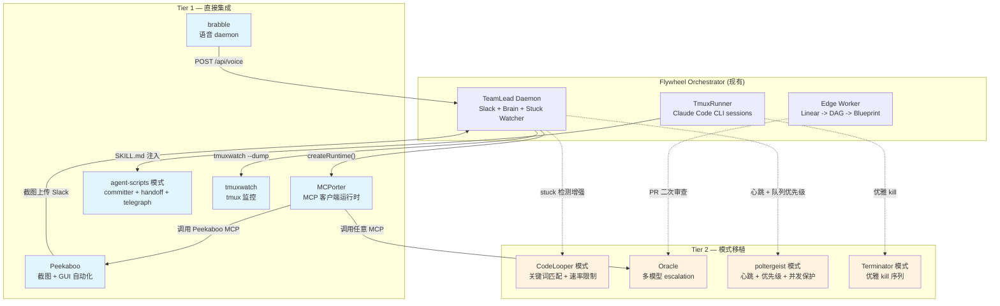

# steipete 开源生态评估 — Flywheel 可复用组件研究

> **Status**: exploration complete
> **Author**: Claude Opus 4.6
> **Date**: 2026-03-06
> **Scope**: 评估 [steipete](https://github.com/steipete) (Peter Steinberger) 的开源仓库生态，识别对 Flywheel 有直接价值的工具、模式和组件

## Background

Peter Steinberger — PSPDFKit 创始人，现全职做 AI agent 开源工具。39,663 followers，169 个公开仓库。核心理念：**agents augmenting agents** — 让 AI 编程工具能互相调用、截图、浏览器控制、系统自动化。

本文档覆盖其 star 数最高的 30+ 仓库中与 Flywheel 相关的 13 个，按集成优先级分三层。

---

## Table of Contents

1. [Tier 1 — 直接可集成](#tier-1--直接可集成)
   - [MCPorter — MCP 客户端运行时](#1-mcporter)
   - [agent-scripts — Agent 防护脚本与技能系统](#2-agent-scripts)
   - [Peekaboo — macOS 截图 + GUI 自动化](#3-peekaboo)
   - [brabble — 语音接口](#4-brabble)
   - [tmuxwatch — tmux 会话监控](#5-tmuxwatch)
2. [Tier 2 — 模式参考](#tier-2--模式参考)
   - [CodeLooper — 卡住检测启发式](#6-codelooper)
   - [oracle — 多模型 escalation](#7-oracle)
   - [poltergeist — 文件监听与构建队列](#8-poltergeist)
   - [Terminator — 进程优雅终止](#9-terminator)
3. [Tier 3 — 参考 / 低优先级](#tier-3--参考--低优先级)
   - [claude-code-mcp](#10-claude-code-mcp)
   - [agent-rules](#11-agent-rules)
   - [sweetlink](#12-sweetlink)
   - [CodexBar](#13-codexbar)
4. [集成架构总览](#集成架构总览)
5. [推荐采用路线](#推荐采用路线)

---

## Tier 1 — 直接可集成

### 1. MCPorter

> **2,519 stars** | TypeScript | [github.com/steipete/mcporter](https://github.com/steipete/mcporter)

**是什么**: TypeScript 运行时 + CLI + 代码生成工具，用于调用任意 MCP server。零配置发现（自动从 Cursor / Claude Desktop / Codex / VS Code 配置读取），连接池，typed 客户端。

**架构**:

```
MCPorter
├── Runtime Layer (createRuntime, callOnce)
│   └── 连接池管理 Map<server, ClientContext>
├── Server Proxy (createServerProxy)
│   └── Proxy-based camelCase -> tool name 映射 + schema 验证
├── Config Discovery
│   └── 合并 ~/.mcporter/mcporter.json + 编辑器配置
├── CLI (list, call, generate-cli, emit-ts, auth, daemon)
└── Daemon (后台进程维持有状态 server 连接)
```

**公开 API**:

```typescript
import { createRuntime, callOnce } from 'mcporter';
import { createServerProxy } from 'mcporter';

// 一次性调用
const result = await callOnce('linear-mcp', 'list_issues', { teamId: 'GEO' });

// 连接池复用
const runtime = await createRuntime();
const linear = createServerProxy(runtime, 'linear-mcp');
const issues = await linear.listIssues({ teamId: 'GEO' }); // camelCase 自动映射
```

**Flywheel 价值**: **高**

| 场景 | 现状 | 用 MCPorter 后 |
|------|------|----------------|
| Linear 数据获取 | `@linear/sdk` 直接 SDK | 可选择通过 Linear MCP 获取，统一 MCP 接口 |
| 库文档查询 | Context7 MCP 仅在 Claude Code session 中可用 | Flywheel orchestrator 内部也能查 |
| Chrome 自动化 | Claude-in-Chrome MCP 仅在 IDE 中 | TeamLead 可编程调用 |
| 自定义 MCP | 不支持 | 任意 MCP server 即插即用 |

**集成方案**: `pnpm add mcporter` -> 在 TeamLead daemon 中使用 `createRuntime()` 建立连接池 -> 按需调用各种 MCP server。

**关键文件**: `src/runtime.ts` (连接池), `src/server-proxy.ts` (ergonomic proxy), `src/config.ts` (多源配置发现)

---

### 2. agent-scripts

> **2,144 stars** | TypeScript | [github.com/steipete/agent-scripts](https://github.com/steipete/agent-scripts)

**是什么**: steipete 所有仓库共享的 agent 防护脚本和技能定义。包含 AGENTS.MD（主指令）、committer 脚本、skill 定义、slash commands。

**架构**:

```
agent-scripts/
├── AGENTS.MD              — 主防护指令（pointer-style，所有仓库引用此文件）
├── scripts/
│   ├── committer          — 安全 git commit（显式文件列表，禁止 git add .）
│   ├── browser-tools.ts   — Chrome DevTools 自动化
│   └── docs-list.ts       — 文档前置数据管理
├── skills/                — 15+ skill 定义
│   ├── oracle/SKILL.md    — Oracle CLI 使用技能
│   ├── create-cli/        — CLI 设计最佳实践
│   ├── frontend-design/   — UI 设计原则
│   └── ...
├── docs/
│   ├── subagent.md        — 多 agent 协调规则
│   └── slash-commands/    — /fixissue, /handoff, /pickup, /raise
└── tools.md               — 工具目录参考
```

**核心模式**:

1. **Pointer-style AGENTS.MD**: 消费方仓库只需一行 `READ ~/Projects/agent-scripts/AGENTS.MD`，所有共享规则在一个源维护。

2. **Telegraph 风格**: 压缩文法，省略介词冠词，节约 context tokens。示例：
   ```
   NEVER commit without explicit file list. ALWAYS reset staging first.
   Check diff BEFORE commit. Atomic commits only.
   ```

3. **Committer 防护脚本**: `git restore --staged :/` 先重置 -> 逐文件验证存在 -> `git add` 指定文件 -> 验证非空变更 -> commit。

4. **Slash commands**:
   - `/handoff` — 打包当前状态给下一个 agent（context + 进度 + 待办）
   - `/pickup` — 重新加载上一个 agent 的 handoff context
   - `/fixissue` — 端到端修 bug（测试 + changelog + commit + push + close）

5. **Subagent 协调** (`subagent.md`):
   - 通过 tmux `send-keys` 发送 prompt，`capture-pane` 读取输出
   - Ralph supervisor tokens: `CONTINUE` / `SEND: <message>` / `RESTART`

**Flywheel 价值**: **高**

| 可复用模式 | Flywheel 应用 |
|-----------|--------------|
| Pointer-style AGENTS.MD | Skill 注入系统可以用 pointer 模式，一个 canonical source 被多个 Claude Code session 引用 |
| Committer 脚本 | 注入到 Claude Code session 中防止 `git add .`，强制显式文件列表 |
| `/handoff` + `/pickup` | issue 依赖链中前一个 session 完成后，结构化传递 context 给下一个 |
| Telegraph 风格 | Skill 注入内容采用压缩风格节约 tokens |
| Subagent 协调 tokens | TeamLead 与 Claude Code session 间的通信协议 |

**集成方案**: 不需要加 npm 依赖。直接复用模式：
1. 将 committer 脚本作为 SKILL.md 的一部分注入
2. 在 skill injection pipeline 中实现 `/handoff` 格式
3. 采用 telegraph 风格重写现有 SKILL.md 内容

---

### 3. Peekaboo

> **2,567 stars** | Swift | [github.com/steipete/Peekaboo](https://github.com/steipete/Peekaboo)

**是什么**: macOS 原生 CLI + MCP server + macOS app，提供完整的 GUI 自动化。截图、AI 视觉问答、Accessibility API UI 交互。本质上是 macOS 版的 "computer use"。

**架构**:

```
Tachikoma (AI providers: GPT-5.1, Claude 4.x, Gemini, Ollama)
    |
PeekabooAutomation (AX, ScreenCaptureKit, app/menu/window services)
    |
PeekabooAgentRuntime (MCP tools, agent loop, tool registry)
    |
PeekabooCore --> CLI / macOS App / MCP Server
```

**MCP 工具 (22 个)**:

| 类别 | 工具 |
|------|------|
| 截图 | `image` (截屏), `see` (标注 UI 元素 ID 的截图), `list` (枚举 app/窗口) |
| 交互 | `click`, `type`, `scroll`, `hotkey`, `swipe`, `drag`, `move`, `paste` |
| 应用管理 | `app` (启动/退出/切换), `window` (移动/缩放/聚焦), `menu`, `dock`, `dialog` |
| AI | `analyze` (视觉问答), `agent` (自然语言多步自动化) |
| 系统 | `clipboard`, `permissions`, `sleep` |

**性能**: 元素检测 200-800ms, 点击 10-50ms, 截图 20-100ms

**Flywheel 价值**: **高 — 直接对应 v0.5 remote-screenshot 需求**

| 场景 | 实现方式 |
|------|---------|
| 监控 tmux session 截图 | `peekaboo image --app Terminal --json-output` |
| PR 视觉预览发 Slack | `peekaboo agent "open PR in Safari and take screenshot"` |
| 前端 issue 视觉验证 | `peekaboo see --app Chrome` 获取标注了元素 ID 的截图 |
| 视觉问答 | `peekaboo analyze --prompt "Is there an error on screen?"` |

**集成方案**:
1. `brew install steipete/tap/peekaboo`
2. TeamLead daemon 中通过 `execFileNoThrow('peekaboo', ['image', ...])` 调用 CLI
3. 或作为 MCP server 通过 MCPorter 调用
4. 截图结果上传到 Slack channel

---

### 4. brabble

> **115 stars** | Go | [github.com/steipete/brabble](https://github.com/steipete/brabble)

**是什么**: macOS 常驻语音 daemon。监听唤醒词（默认 "clawd"/"claude"），通过 whisper.cpp 本地转录语音，然后执行配置的 shell 命令（hook）。100% 本地处理，无云端延迟。

**管道**:

```
PortAudio 麦克风采集 (16kHz mono)
    |
WebRTC VAD (语音活动检测)
    |
whisper.cpp (本地 ASR, Metal 加速)
    |
唤醒词检测 (case-insensitive 字符串匹配)
    |
Hook 选择 (first match by wake tokens)
    |
Shell 命令执行 (BRABBLE_TEXT, BRABBLE_PREFIX env vars)
```

**配置示例**:

```toml
[asr]
model = "large-v3-turbo"

[vad]
aggressiveness = 2
silence_duration_ms = 1000
min_speech_duration_ms = 300
max_segment_duration_s = 10

[[hooks]]
wake = ["flywheel", "status"]
command = "curl"
args = ["-X", "POST", "http://localhost:PORT/api/voice", "-d"]
cooldown = "3s"
timeout = "30s"
```

**关键特性**:
- 多唤醒词 -> 多 hook（first match wins）
- UNIX socket 控制接口 (`~/Library/Application Support/brabble/brabble.sock`)
- launchd 自启动 (`brabble service install`)
- Prometheus 指标端点
- 部分转录实时反馈（每 4 秒）

**Flywheel 价值**: **高 — CEO 语音 -> TeamLead 的自然入口**

```
CEO 说 "Hey Flywheel, GEO-95 什么状态?"
    |
brabble 转录 -> "GEO-95 什么状态?"
    |
POST 到 TeamLead HTTP API (或 Slack)
    |
TeamLead Brain: Haiku 解析意图 -> Sonnet 生成回复
    |
Slack 通知回复 CEO
```

**集成方案**:

```toml
# 方案 A: 语音 -> Slack -> TeamLead (最简单)
[[hooks]]
wake = ["flywheel"]
command = "/path/to/slack-post-script.sh"

# 方案 B: 语音 -> TeamLead HTTP API (直连)
[[hooks]]
wake = ["flywheel"]
command = "curl"
args = ["-X", "POST", "-H", "Content-Type: application/json",
        "http://localhost:3847/api/voice"]

# 方案 C: 多唤醒词对应不同动作
[[hooks]]
wake = ["status"]
command = "flywheel-cli"
args = ["status"]

[[hooks]]
wake = ["deploy", "ship"]
command = "flywheel-cli"
args = ["deploy"]
```

**注意**: 需要 TeamLead daemon 添加一个简单的 `/api/voice` HTTP endpoint，将文本路由到现有的 Brain intent parser。

---

### 5. tmuxwatch

> **175 stars** | Go | [github.com/steipete/tmuxwatch](https://github.com/steipete/tmuxwatch)

**是什么**: Charmbracelet Bubble Tea TUI，实时轮询 tmux session/window/pane 状态，渲染为 live dashboard。支持 `--dump` JSON 模式输出结构化数据。

**架构**:

```
tmux CLI (list-sessions, list-windows, list-panes)
    |
client.go — 解析 tab-delimited 输出 -> Go structs
    |
types.go — Snapshot { Sessions[], Timestamp }
           Session { Windows[], LastActivity, Attached }
           Pane { CurrentCmd, Dead, DeadStatus, LastActivity }
    |
stale.go — 过时检测逻辑
    |
model.go — Bubble Tea TUI (1s 轮询)
```

**过时检测启发式** (`stale.go`):

```
staleThreshold = 1 hour
```

Session 被判定为 "stale" 的条件:
1. **未 attach** 且所有 pane 已 **dead**（退出），或
2. **未 attach** 且最近活动时间戳（取 session LastActivity、pane LastActivity、内容变更时间戳的最大值）超过 `staleThreshold`

关键：`sessionActivity()` 还会检查 `preview.lastChanged` — 当捕获的 pane 内容在两次轮询之间确实发生变化时更新的时间戳。这提供了一个**基于内容差异的活动信号**，超越了 tmux 原生的 activity 时间戳。

**`--dump` JSON 输出**:

```json
{
  "Sessions": [{
    "ID": "$1",
    "Name": "flywheel-geo95",
    "Attached": false,
    "CreatedAt": "2026-03-06T10:00:00Z",
    "LastActivity": "2026-03-06T10:45:00Z",
    "Windows": [{
      "Panes": [{
        "CurrentCmd": "claude",
        "Dead": false,
        "LastActivity": "2026-03-06T10:45:00Z"
      }]
    }]
  }],
  "Timestamp": "2026-03-06T10:46:00Z"
}
```

**Flywheel 价值**: **高 — 直接替代现有 tmux 状态解析**

| 现状 | 用 tmuxwatch 后 |
|------|-----------------|
| TeamLead 自己解析 tmux 输出 | `tmuxwatch --dump` 获取结构化 JSON |
| 简单的 idle 检测 | 双信号：tmux activity + 内容差异 |
| 无可视化 | TUI dashboard 实时查看所有 session |

**集成方案**:
1. `go install github.com/steipete/tmuxwatch@latest` 或 `brew install`
2. TeamLead stuck watcher 中: `execFileNoThrow('tmuxwatch', ['--dump'])` -> `JSON.parse`
3. 从 JSON 中提取 session 状态、活动时间、pane 命令信息
4. 内容差异检测逻辑可直接移植到 TypeScript

---

## Tier 2 — 模式参考

### 6. CodeLooper

> **132 stars** | Swift | [github.com/steipete/CodeLooper](https://github.com/steipete/CodeLooper)

**是什么**: macOS menubar app，监控 Cursor IDE 实例，检测卡住状态并自动恢复。使用 Accessibility API 实现 UI 级别的检测和干预。

**检测层 — 8 个启发式**:

| 启发式 | 检测目标 |
|--------|---------|
| `ConnectionErrorIndicatorHeuristic` | "Connection error" 文本 |
| `StopGeneratingButtonHeuristic` | "Stop generating" 按钮存在 |
| `ResumeConnectionButtonHeuristic` | resume/retry 按钮 |
| `ForceStopResumeLinkHeuristic` | force-stop/resume 链接 |
| `GeneratingIndicatorTextHeuristic` | "Thinking"/"Processing" 文本 (正信号) |
| `ErrorMessagePopupHeuristic` | 错误弹窗 |
| `MainInputFieldHeuristic` | 主输入框 (用于 nudge 恢复) |
| `SidebarActivityAreaHeuristic` | 侧边栏活动 |

**干预速率限制** (`InterventionConstants.swift`):

| 常量 | 值 | Flywheel 对应 |
|------|----|--------------|
| `stuckDetectionTimeout` | 60s | stuck watcher 检测间隔 |
| `automatedInterventionCooldown` | 30s | 干预冷却时间 |
| `maxAutomaticInterventions` | 5/活跃期 | 单 session 最大重试 |
| `maxTotalAutomaticInterventions` | 20/app session | 全局最大重试 |
| `maxConsecutiveRecoveryFailures` | 3 -> escalate | 连续失败 -> 通知人类 |
| `postInterventionObservationWindow` | 3s | 干预后观察窗口 |

**关键词分类（可直接移植到 Flywheel stuck watcher）**:

```
正信号: "Thinking", "Processing", "Generating", "Loading", "Working", "Analyzing"
负信号: "Error", "Failed", "Exception", "Crash", "Timeout", "Refused"
连接问题: "Connection", "Network", "Offline", "Cannot Connect", "ERR_NETWORK"
```

**Flywheel 可移植模式**:

1. **关键词匹配**: `tmux capture-pane` 输出匹配正/负关键词列表 -> 判定 Claude Code 状态
2. **速率限制级联**: N 次/活跃期, M 次/session, K 次连续失败 = escalate 到人类
3. **渐进式 escalation**: 检查进程存活 -> 检查内容变化 -> 匹配错误关键词 -> 尝试恢复 -> 通知人类

---

### 7. oracle

> **1,578 stars** | TypeScript | [github.com/steipete/oracle](https://github.com/steipete/oracle)

**是什么**: CLI 工具，打包 prompt + 文件上下文，发送给一个或多个 LLM（GPT-5 Pro, Gemini 3 Pro, Claude Sonnet, 等）。支持 API 模式、浏览器自动化模式、多模型 fan-out、MCP server。

**架构**:

```
Oracle
├── CLI Layer
│   ├── options.ts — Commander flags
│   ├── engine.ts — API vs browser 自动选择
│   ├── markdownBundle.ts — prompt + files 渲染为 markdown
│   └── sessionRunner.ts — 执行 + session 管理
├── Oracle Core
│   ├── run.ts — runOracle() 主逻辑
│   ├── promptAssembly.ts — [SYSTEM] + [USER] + file sections
│   ├── multiModelRunner.ts — Promise.allSettled 并行 fan-out
│   ├── config.ts — 模型配置 (pricing, limits, tokenizers)
│   └── client.ts — OpenAI/Anthropic/Google/xAI 客户端工厂
├── MCP Server
│   └── consult tool + sessions management
└── Session Store — ~/.oracle/sessions 持久化
```

**核心模式**:

1. **Prompt 打包**: `[SYSTEM] + [USER] + file sections`，每个文件用 markdown code block + 路径头包裹
2. **多模型 fan-out**: `Promise.allSettled` 并行发给多个 provider
3. **Session 管理**: 所有运行持久化到 `~/.oracle/sessions`，支持 reattach

**Flywheel 价值**: **中高 — Decision Layer 增强**

| 场景 | 实现 |
|------|------|
| PR 二次审查 | Claude Code 产出 PR -> Oracle 发给 GPT-5 Pro 审查 |
| Decision Layer 不确定时 | Haiku triage 置信度低 -> Oracle escalate 到更强模型 |
| 多模型共识 | 关键决策 fan-out 到多模型，要求共识 |

**集成方案**: 通过 Oracle MCP server (`npx -y @steipete/oracle oracle-mcp`) + MCPorter 调用，避免加 npm 依赖。

---

### 8. poltergeist

> **342 stars** | TypeScript | [github.com/steipete/poltergeist](https://github.com/steipete/poltergeist)

**是什么**: 通用文件监听 + 构建自动化 daemon。使用 Facebook Watchman 做文件事件，带智能构建优先级、并发构建保护、心跳状态管理。

**可移植到 Flywheel 的模式**:

| 模式 | 来源文件 | Flywheel 应用 |
|------|---------|--------------|
| **心跳检活** | `state.ts` | 每 session 写心跳文件，10s 间隔，5min 过期 = stale |
| **并发执行保护** | `build-queue.ts` | 同一 worktree 已有 session 运行 -> 排队而非重复启动 |
| **优先级评分** | `priority-engine.ts` | 按 issue 变更频率、历史成功率、focus 模式排序队列 |
| **原子状态文件** | `state.ts` | `/tmp/flywheel/` 状态目录，`write-file-atomic` 防损坏 |
| **跨进程协调** | `state.ts` | TeamLead daemon 与 executor 间通过状态文件共享信息 |

**优先级引擎算法** (可直接移植):

```typescript
// 简化版
score = changeFrequency * focusMultiplier * successRateMultiplier
// changeFrequency: 指数衰减的最近文件变更频率
// focusMultiplier: 80%+ 近期变更集中在此 target = 2x
// successRateMultiplier: 0.5 (全失败) ~ 1.0 (全成功)
```

---

### 9. Terminator

> **89 stars** | Swift + TypeScript | [github.com/steipete/Terminator](https://github.com/steipete/Terminator)

**是什么**: MCP server，给 AI agent 提供 macOS 终端会话控制能力（执行、读取、kill、聚焦）。不是自动监控——是提供 **工具** 让 AI 管理终端。

**可移植到 Flywheel 的模式**:

**优雅 kill 序列** (`ProcessUtilities.swift`):

```
SIGINT (等 2s) -> 检查存活
    |-> SIGTERM (等 2s) -> 检查存活
        |-> SIGKILL (等 0.2s)
```

每步之间用 `kill(pid, 0)` 或 `killpg(pgid, 0)` 检查进程是否还活着。

**进程组管理**: 使用 `killpg()` 代替 `kill()`，确保 Claude Code 产生的子进程也被终止。

**TTY 忙碌检测**: `ps -t TTY -o pgid=,pid=,stat=,comm=` 查找前台进程，过滤常见 shell。

**Flywheel 应用**: TmuxRunner 的 `kill` 方法应采用 SIGINT -> SIGTERM -> SIGKILL 级联，给 Claude Code 清理机会。

---

## Tier 3 — 参考 / 低优先级

### 10. claude-code-mcp

> **1,159 stars** | JavaScript

单文件 MCP server (~250 LOC)，把 `claude --dangerously-skip-permissions -p <prompt>` 包装成 MCP tool。设计给 Cursor/Windsurf 等编辑器调用 Claude Code。

**Flywheel 评估**: **低优先级**。Flywheel 已有直接 CLI spawning (`IAgentRunner`)，这层间接封装不需要。仅作为参考实现——spawn Claude Code CLI 的错误处理和 30 分钟超时模式可以对照。

### 11. agent-rules

> **5,613 stars** | Shell

CLAUDE.md / Cursor rules 的模板集合。**已废弃** — README 标注 "This was old stuff I used mid 2025. My new work is here: agent-scripts."

**Flywheel 评估**: 跳过，直接看 agent-scripts。

### 12. sweetlink

> **108 stars** | TypeScript

Daemon + 浏览器运行时，在用户 **当前浏览器 tab** 中操作（保持登录态、cookies）。三个组件：

```
SweetLink Daemon (HTTPS WSS localhost:4455)
    |
Browser Runtime (注入到 web app tab 的 JS 客户端)
    |
CLI Client (Commander, Puppeteer)
```

**vs Claude-in-Chrome MCP**:

| 维度 | SweetLink | Claude-in-Chrome |
|------|-----------|-----------------|
| 架构 | Daemon + 注入运行时 | Chrome 扩展 |
| Auth 上下文 | 用户真实 session | 独立浏览器上下文 |
| 目标 | 专门针对你的 web app (dev loop) | 通用网页 |
| Console/Network | 完整流式捕获 | 基础 |
| Focus | 前端开发反馈闭环 | 通用浏览器自动化 |

**Flywheel 评估**: **P3**。SweetLink 在管理的项目是 web app 且有运行的前端时有价值。但它需要目标项目集成 browser runtime (`sweetlink/runtime/browser`)，增加构建依赖。对 Flywheel 当前场景（管理 Claude Code sessions 工作在各种代码库上），Peekaboo 的 OS 级截图/自动化更通用。

### 13. CodexBar

> **7,516 stars** | Swift

macOS menubar app，显示 OpenAI Codex 和 Claude Code 的使用量统计。

**Flywheel 评估**: 预算追踪模式可参考（Flywheel 有 $5/issue 预算限制），但功能不直接可用。

---

## 集成架构总览



---

## 推荐采用路线

### Phase 1 — 立即可用 (v0.4 阶段)

| 优先级 | 组件 | 工作量 | 产出 |
|--------|------|--------|------|
| P0 | **tmuxwatch `--dump`** | 极小 — `go install` + 1 函数调用 | stuck watcher 获得结构化 tmux 状态 |
| P0 | **agent-scripts 模式** | 小 — 重写 SKILL.md 内容 | 更紧凑的 token 使用，committer 防护 |
| P1 | **Terminator kill 序列** | 小 — 修改 TmuxRunner.kill() | 优雅终止 Claude Code sessions |
| P1 | **CodeLooper 关键词** | 小 — 添加关键词列表到 stuck watcher | 更智能的 stuck 检测 |

### Phase 2 — v0.5 集成

| 优先级 | 组件 | 工作量 | 产出 |
|--------|------|--------|------|
| P0 | **Peekaboo** | 中 — `brew install` + TeamLead CLI 调用 | 视觉监控 + Slack 截图 (v0.5-remote-screenshot) |
| P1 | **MCPorter** | 中 — `pnpm add mcporter` + runtime 初始化 | 统一 MCP 接口，可扩展任意 MCP server |
| P1 | **poltergeist 模式** | 中 — 移植心跳 + 并发保护 + 优先级 | 更健壮的 session 管理 |

### Phase 3 — v0.5+ 增强

| 优先级 | 组件 | 工作量 | 产出 |
|--------|------|--------|------|
| P1 | **brabble** | 中 — `brew install` + TeamLead API endpoint | CEO 语音控制 |
| P2 | **Oracle** | 中 — MCP server + MCPorter 调用 | 多模型 PR 审查 / decision escalation |
| P3 | **SweetLink** | 大 — 目标项目需集成 runtime | 前端开发视觉闭环 |

### 不采用

| 组件 | 原因 |
|------|------|
| agent-rules | 已废弃，被 agent-scripts 取代 |
| claude-code-mcp | Flywheel 已有直接 CLI spawning |
| CodexBar | 功能不匹配，仅模式参考 |

---

## Key Takeaways

1. **steipete 的生态核心价值在于模式而非库**: 大多数工具是 macOS-specific (Swift)，但其中的设计模式（stuck 检测启发式、优雅 kill、pointer-style 规则分发、心跳检活、多模型 escalation）可以直接移植到 Flywheel 的 TypeScript 代码中。

2. **MCPorter 是唯一的 "library-level" 集成点**: 作为 TypeScript MCP 客户端运行时，它为 Flywheel 打开了通向整个 MCP 生态的大门。

3. **tmuxwatch + CodeLooper 组合解决 stuck detection**: tmuxwatch 提供结构化数据，CodeLooper 提供检测启发式，二者结合可以大幅提升 TeamLead stuck watcher 的智能程度。

4. **brabble 填补 "CEO -> Flywheel" 的语音通道**: 与 TeamLead Brain (Haiku intent parser) 自然衔接，是 v0.4 voice interface exploration 的现成方案。

5. **Peekaboo = v0.5 remote-screenshot 的完整方案**: 不需要自己实现截图能力，直接用 Peekaboo CLI/MCP。
