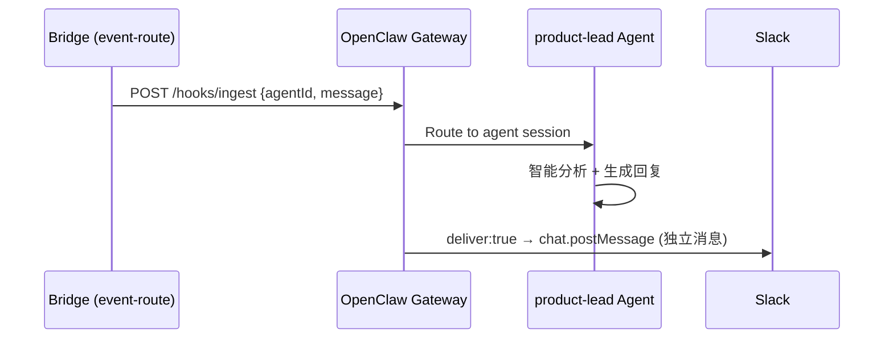
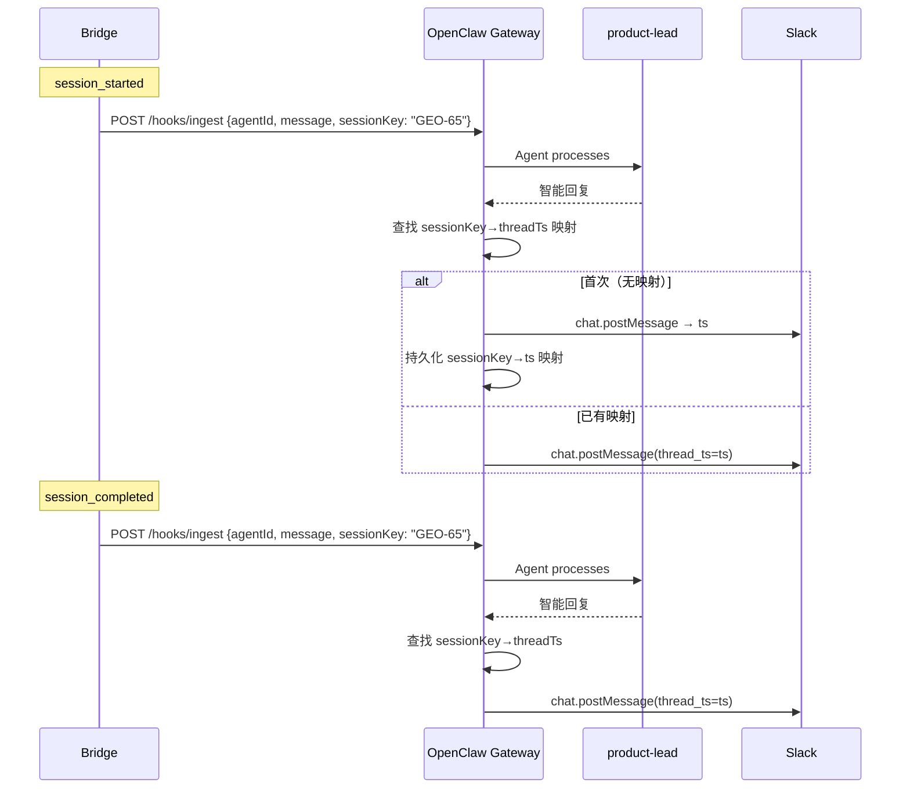
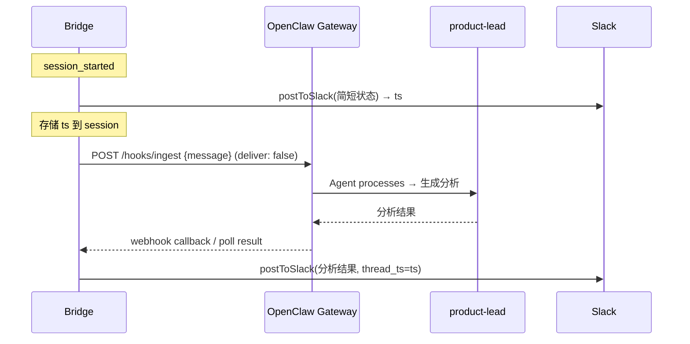

# v0.6 Slack Threading — 智能通知架构

## 背景

Flywheel 的通知通过 OpenClaw product-lead agent 传递到 Slack。当前每个事件都是独立消息，无法 threading（同一 issue 的所有更新应在同一 thread 内）。

## 当前 Flow

**问题**：OpenClaw 的 `deliver: true` 机制没有 `thread_ts` 参数，每次都是新消息。

## 需求

1. **Thread 聚合**：同一 issue 的所有通知在同一个 Slack thread 内
2. **智能分析**：product-lead 不是简单转发，要分析内容、提建议
3. **双向交互**：CEO 可以在 thread 里回复，product-lead 能响应
4. **中文默认**：所有通知用中文
5. **未来**：多 channel 路由（per project/team）

## 部分基础设施已就位（尚未接入 notification path）

- `StateStore` 已支持 `slack_thread_ts` 字段（session 级别存储）
- `formatNotification()` 已改为中文输出
- `BridgeConfig` 已加 `slackBotToken` / `slackChannel`
- `postToSlack()` 工具函数已写好（直接 Slack API + thread_ts）
- `conversation_threads` 表已存在（thread_ts ↔ issue_id 映射）

**缺口**：
- 何时创建 thread、何时持久化 — 未定义
- 谁是 `thread_ts` 的 source of truth — 未定义
- 失败后如何恢复 — 未定义
- 上述基础设施未接入 event-route 主通知链路

## OpenClaw 能力边界（基于实际验证）

在评估 Options 之前，需要明确 OpenClaw 当前的真实能力：

| 能力 | 状态 | 说明 |
|------|------|------|
| Hook ingest payload | 仅 `{agentId, message}` | 无 metadata/context/threadTs 字段 |
| deliver:true | 仅 standalone 消息 | 无 thread_ts 透传 |
| Agent `send` tool (hook session) | ❌ 不可用 | "Action send requires a target" |
| Agent `send` tool (直接对话) | ✅ 可用 | 有 reply context |
| Hook mapping match | 无 explicit path | 目前近似 catch-all |
| Session persistence | ✅ agent memory | 持久化跨 turn |

**关键约束**：Hook-triggered agent session 缺少 reply context，agent 无法主动 `send` 到 Slack。只能依赖 `deliver: true` 自动投递。

## Options

### Option A-prime（推荐）: Bridge 提供 issue identity → OpenClaw 管 thread

核心思路：Bridge 不管 Slack，只提供稳定的 issue-scoped identity。OpenClaw 负责首帖创建、thread route 持久化与后续回复投递。

**Flow:**

**OpenClaw 需要改动的面：**
1. Hook ingest payload schema — 接受 `sessionKey` 字段
2. Hook delivery logic — thread-aware 投递（查找/创建/复用）
3. Thread route persistence — sessionKey → threadTs 映射存储
4. Hook mapping config — 可选 thread grouping 策略

**Bridge 改动（小）：**
- `notifyAgent()` 的 payload 加 `sessionKey: session.issue_identifier ?? session.issue_id`（优先使用展示型标识，fallback 到内部稳定键）
- `issueIdentifier` 未来考虑升级为 ingest contract 必填字段
- Reopen/retry 场景下，同一 `issue_identifier`（或 `issue_id`）→ 同一 `sessionKey` → 复用原 thread

**优点**：
- 职责清晰：Bridge = 事件源，OpenClaw = 分析 + delivery owner
- 无回调耦合（Bridge 不需要知道 threadTs）
- 与 OpenClaw 的演进方向一致（gateway 管 channel routing）
- product-lead 保持智能分析能力

**难点**：
- OpenClaw 需要约 4 处改动
- 需要新的持久化（可简单到一个 JSON 文件或 SQLite 表）

### Option E（Fallback）: Bridge owns delivery, OpenClaw only generates content

如果 OpenClaw threading 改造超出 v0.6 范围，可以退而求其次：

**Flow:**

**前提条件**：
- OpenClaw 需要支持 `deliver: false` + 结果回调（或 Bridge 主动轮询）
- 或者完全不走 OpenClaw，Bridge 自己调 Haiku/Sonnet API 生成分析

**为何本轮不选**：
- 把 Slack delivery 拉回 Bridge 违背了 OpenClaw-first 的架构方向
- 需要 Bridge 维护 Slack posting + threading + error handling
- 如果不走 OpenClaw，product-lead 的持久记忆和工具能力就丢失了
- 但作为 OpenClaw 改造受阻时的保底方案，值得保留在备选清单

### ~~Option B: Bridge 发 parent + OpenClaw 发 thread reply~~

**不推荐（前置条件未满足）**：依赖 agent 在 hook session 中使用 `send` tool，但 hook-triggered session 缺少 reply context，`send` 会报错 "Action send requires a target"。SOUL.md 也明确要求 hook message 不使用 `send`。

**如要启用的前置条件**：OpenClaw 需要先为 hook session 提供稳定 target/thread context，并允许 agent 在该路径使用 message tool。

### ~~Option C: product-lead 自主管理 thread~~

**不推荐（前置条件未满足）**：同 Option B，agent 无法在 hook session 中主动发送消息。另外 agent memory 的 thread state 难以 debug 和恢复。

### ~~Option D: Slack binding 增强 — thread-aware binding~~

**不推荐本轮**：架构终局可能最好（gateway 层统一管 thread routing），但对 v0.6 过重。改动范围覆盖 hook 配置模型、请求解析、运行时 dispatch、delivery target 解析等。可作为 A-prime 成功后的长期演进方向。

## Failure & Recovery

| 场景 | 处理策略 |
|------|---------|
| 首帖成功但 thread route 未持久化 | OpenClaw 重试持久化；失败则下次消息创建新 thread |
| Agent deliver 成功但 Flywheel 未同步状态 | v0.6 不同步 — Flywheel 不感知 threadTs。后续如需 observability，可加 OpenClaw→Bridge 回流接口 |
| 重复 webhook / 乱序事件 | Bridge 已有 `event_id` 去重；OpenClaw 按 sessionKey 查找 thread 即可 |
| Issue reopen / retry | 同一 `issue_identifier ?? issue_id` → 同一 sessionKey → 复用原 thread |
| Channel 变更 | Thread route 按 channel 隔离；新 channel = 新 thread |
| Thread 被归档/删除 | Slack API 返回错误 → 降级为新 standalone 消息 |
| Slack rate limit | 指数退避重试；超限后降级为 console log |
| **Source of truth** | OpenClaw 的 sessionKey→threadTs 映射 |
| **Idempotency key** | Bridge 的 `event_id`（已实现） |

## 测试计划

### Flywheel 侧（scope 严格收束为 outbound sessionKey）
- `formatNotification()` 中文输出 ✅（已有 6 个测试）
- `notifyAgent()` 带 `sessionKey` 参数（单元测试）
- `sessionKey` 生成逻辑：`issue_identifier ?? issue_id`（单元测试）
- **注意**：`slack_thread_ts` 和 `conversation_threads` 的读写测试 **defer 到后续**，待 thread 信息回流接口定义后再加。v0.6 scope 不包含 OpenClaw→Bridge 的 thread state 同步。

### OpenClaw 侧
- Hook ingest 接受 `sessionKey` 字段
- Thread-aware delivery：首帖创建、复用、恢复
- sessionKey→threadTs 映射持久化
- E2E: hook ingest → agent → Slack thread reply

### 手动验证
- 发送 session_started + session_completed → 同一 thread
- 发送 session_failed → thread reply
- 重复事件 → 幂等
- Bridge 重启后 → thread 继续

## 评估维度

| 维度 | A-prime（推荐） | E (Fallback) | B | C | D |
|------|-----------------|--------------|---|---|---|
| OpenClaw 改动量 | 中（4处） | 小 | 中 | 小 | 大 |
| Bridge 改动量 | 极小 | 大 | 中 | 无 | 小 |
| 架构清晰度 | 高 | 低 | 中 | 中 | 最高 |
| 可靠性 | 高 | 中 | ❌ | ❌ | 高 |
| 实现难度 | 中 | 中 | ❌ | ❌ | 高 |
| 双向交互 | 好 | 差 | ❌ | ❌ | 最好 |

## 待研究

1. OpenClaw hook ingest 是否可以扩展 payload schema（加 `sessionKey`）？
2. OpenClaw delivery 层是否有现成的 thread/session route 持久化机制？
3. OpenClaw 的 `deliver: true` 实现细节 — 具体在哪层调 Slack API？
4. 如果 OpenClaw 改动超出 v0.6 范围，是否接受 Fallback E？

## 决策

**推荐 Option A-prime**。下一步：
1. 研究 OpenClaw gateway 源码，确认 hook delivery 改造可行性
2. 如果可行 → 制定详细 plan
3. 如果不可行 → 讨论 Fallback E 或 defer threading 到 OpenClaw 自身 roadmap
