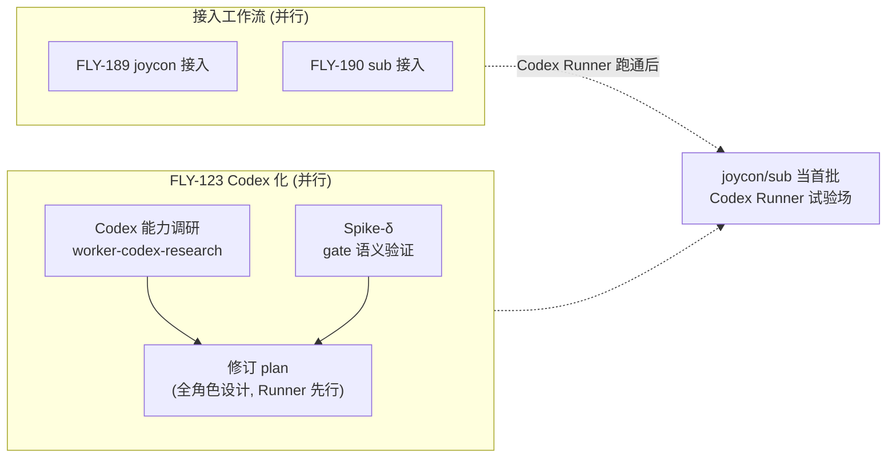

# Brainstorm Decisions: Vendor-Neutral Agent Runtime — FLY-123

**Issue**: FLY-123 ([Architecture] Decouple Flywheel from Claude Code — enable hybrid agent runtime)
**Date**: 2026-06-01
**Status**: Brainstorm complete (3 rounds, interactive with Annie)
**Source**: `doc/engineer/exploration/new/FLY-104-vendor-neutral-agent-role-architecture.md` (Done), `doc/engineer/plan/draft/v2.0-FLY-123-vendor-neutral-agent-runtime.md` (codebase audit groundwork)
**Feeds**: revised FLY-123 plan (after Codex capability research + gate-semantics Spike-δ land)

---

## 0. 为什么有这份文档

Annie 不想让 FLY-123 一上来就出 design review —— 要先认真 brainstorm 把"我们到底要什么"问清楚。本文档记录 3 轮互动 brainstorm 的结论，作为修订 plan 的 source of truth。worker-fly-123 已完成的 plan（`v2.0-FLY-123-...`）是**代码审计 groundwork**，方向以本文档为准。

---

## 1. 驱动力（Annie 拍板）

| 驱动力 | 是否主因 |
|--------|----------|
| **避免被单一 vendor 锁定** | ✅ 主因 |
| **利用 Codex 的特定 / 最新能力** | ✅ 主因 |
| 降低 Claude 成本 | ❌ 不是主因 |

Annie 原话精神：Codex 和 Claude Code 竞争激烈，两边都会时不时出非常酷炫的新功能（如用本机 App、在生成的 HTML 上直接 comment、4 月中旬版本的更新）—— **不想被 Claude Code 绑死**，要能随时试用 / 切换到更强的那一边。

**设计含义**：重心是"干净的可换抽象（flexibility）+ 把 Codex 的差异化能力暴露出来"，不是"更便宜地跑 Claude"。

---

## 2. 范围与形态（Annie 拍板）

| 维度 | 决定 |
|------|------|
| 设计范围 | **全角色 vendor-neutral 设计一次做全**（role → adapter → agent，所有角色） |
| 实现范围（本期） | **只做 Lead + Runner**；reviewer / triager 以后再说 |
| 混用 vs 切换 | **两个都要** —— 按角色/任务选 agent（日常混用，多 adapter 并存）+ 能整体切到另一个 vendor |
| vendor 落地 | **框架通用，但先只实现 Codex** 一个具体 adapter（Gemini/Cursor 等留扩展位） |

---

## 3. Rollout 节奏（Annie 接受 push-back）

**设计一次做全，但上线分步。**

team-lead push back 的风险：改 Lead 启动路径（`claude-lead.sh`）是生产**最危险**的地方 —— FLY-176 launchd 重启 bug 已咬过 3 次。把 Lead + Runner 同时切过去 = 拿线上 Lead 冒险。

→ 决定：抽象层一次设计完整，但 rollout 顺序 = **Runner=Codex 先跑稳 → 再动 Lead**。

---

## 4. Codex gate 语义（核心技术风险 — spike 先行）

worker-fly-123 挖出的核心风险：Codex 没有 Claude Code 那种"长驻交互 + 在 gate（如等 Annie 审核）处原地暂停 + 被 mailbox 唤醒续跑"的执行形态。两种建模：

- **A**（推荐）：进程边界 = gate。Codex 跑到要等 Lead 时退出，Lead 回复后 `codex resume` 续跑。契合 `codex-with-fallback` 多账号容错、输出可观测。
- **B**：Codex 交互 TUI 在 tmux 里长驻原地等。更像现状，但失去 codex-with-fallback rate-limit 轮换，自动化稳定性未验证。

**Annie 决定：先跑一个 Spike-δ 验证 A（exec + resume + 外部 watcher 注入）在 tmux 里到底可不可行，再定。Spike 是 Phase 1 的前置闸，不是并行项。**

---

## 5. Codex 能力调研（进行中）

Annie 想利用 Codex 最新能力，但具体哪些值得用需要调研。已起 `worker-codex-research`（task #4）→ `doc/engineer/research/new/FLY-123-codex-capabilities.md`，重点：
- 4 月中旬 2026 release 更新了什么
- 用本机 App 的能力、在生成 HTML 上 comment 的能力（Annie 点名）
- Codex 差异化能力（sandbox / 多账号 / 速度 / MCP / exec+resume）
- 每个能力对应 `CodexTmuxAdapter` / `IAdapter` 要暴露什么

调研结论回来后并入修订版 plan。

---

## 6. 优先级与试验场（Annie 拍板）

- **三个活并行**：joycon 接入（FLY-189）、sub 接入（FLY-190）、FLY-123 Codex 化，同时推进（都在 design/接入阶段，不撞 GeoForge3D 生产）。
- **joycon + sub = 首批 Codex Runner 试验场**：两个 repo 都有 `AGENTS.md`（Codex-ready），且不碰 GeoForge3D 生产 → Codex Runner 跑通后，拿它们当最低风险的练兵场。

---

## 7. 下一步 gate

1. **Codex 能力调研**（worker-codex-research，进行中）→ 喂 adapter 设计。
2. **Spike-δ**（gate 语义，gate-semantics 可行性）→ Phase 1 Codex Runner 实现的前置闸。**没过不进实现。**
3. 调研 + spike 结论回来 → 修订 `v2.0-FLY-123-...` plan（全角色设计、Runner 先行、mix+switch）→ codex-design-review → implement。

---

## 8. 已锁定决策速查

| # | 决策 | 值 |
|---|------|----|
| 1 | 主驱动力 | 避免锁定 + 用 Codex 新能力（非成本） |
| 2 | 设计范围 | 全角色一次设计完整 |
| 3 | 实现范围 | 先 Lead + Runner |
| 4 | 混用/切换 | 两个都要 |
| 5 | vendor 落地 | 框架通用，先只实现 Codex |
| 6 | rollout | 设计全做，上线分步（Runner 先，Lead 后） |
| 7 | gate 语义 | Spike-δ 先验证再定 |
| 8 | 优先级 | 三活并行 |
| 9 | 试验场 | joycon/sub 当首批 Codex Runner 试点 |
