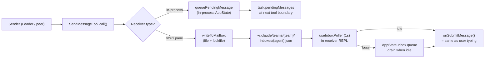
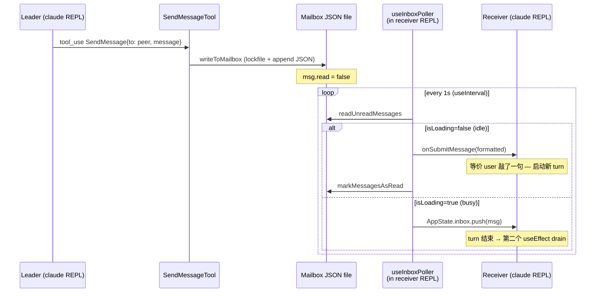
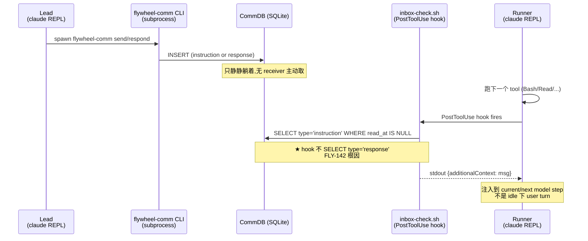
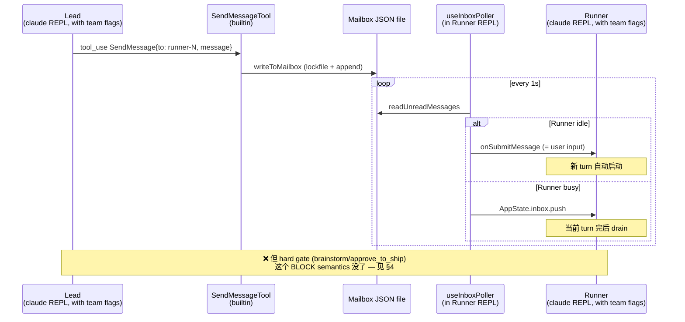
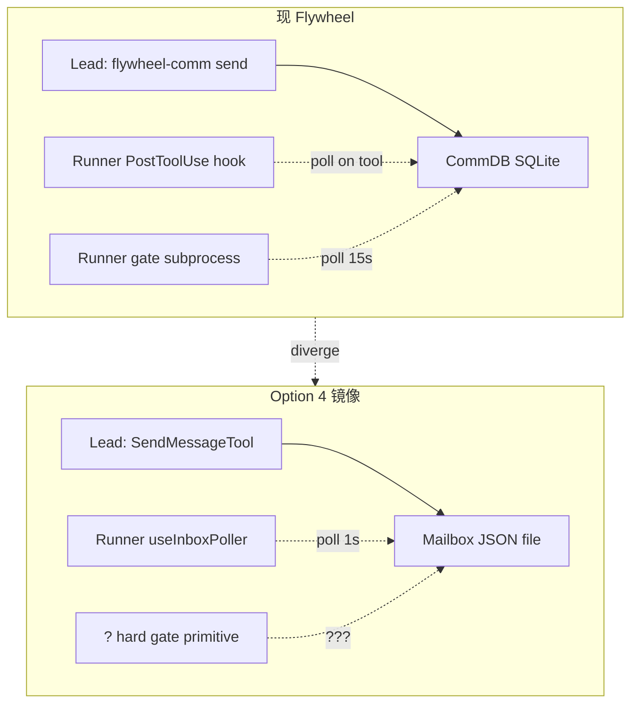

# Exploration: FLY-142 Option 4 详细设计 — 1:1 镜像 claude-code Agent Team

**Issue**: FLY-142 (Runner doesn't wake on Lead respond) — Option 4 detail
**Date**: 2026-05-06
**Status**: Draft (pending Codex review)
**Source**: `doc/engineer/exploration/new/FLY-142-runner-wake-bug-audit.md`

---

## 0. 重大发现 — 之前 cost 估算过高

之前 audit 假设 Option 4 需要 fork claude-code，估算 4-6 周。**Re-audit 之后实情**：

> **Runner 已经在跑 interactive `claude` CLI** (`packages/claude-runner/src/TmuxAdapter.ts:118` — "interactive mode — NO --print"），所以 `useInboxPoller` React hook **已经存在于 binary 内**，只是被 `isTeammate()` 这个 gate 关掉了 — gate 的条件是 CLI 必须有 `--agent-id` + `--agent-name` + `--team-name` 这些 flags。

也就是说，**不需要 fork claude-code**。技术上只要给 Runner spawn 加几个 flags，Lead 那边走 SendMessage tool / writeToMailbox，再把 mailbox 文件 layout 对齐 — receiver-side wake 就<u>免费</u>跑起来了。

但这个方案有<u>新的</u>复杂度：**hard gate（FLY-47 brainstorm + FLY-58 approve_to_ship）的 BLOCK semantics 不能 1:1 镜像 Agent Team** — Agent Team 没有"Runner 主动卡住等 Lead 答复"这个 primitive。

下面把这两件事 — 便宜的部分 (mailbox wake 复用 binary) + 贵的部分 (gate semantics 重写) — 拆开讨论。

---

## 1. claude-code Agent Team wake 完整 flow

### 1.1 同 process / 跨 process 两条路径



### 1.2 真 wake sequence — out-of-process (Flywheel 关心的版本)



### 1.3 关键 invariants

- Mailbox file layout: `~/.claude/teams/{team_name}/inboxes/{agent_name}.json` 里是 `Array<TeammateMessage>`，每条 `{from, text, summary, timestamp, read, color}`
- 团队识别: Receiver 必须是 **teammate**（即 CLI 启动时带 `--agent-id` + `--agent-name` + `--team-name` + `--parent-session-id`，或在 in-process 上下文中）
- `isTeammate()` 是 `useInboxPoller` 是否激活的<u>唯一</u>开关
- 所有结构化 protocol（`shutdown_request` / `plan_approval_request` / `permission_request` / `mode_set_request` / `team_permission_update`）都走<u>同一</u>条 mailbox + poll loop，差别只在 receiver 怎么 dispatch
- **Wake = polling，不是 push**。Sender 不需要触发 receiver；receiver 自己每秒去看
- **Idle vs Busy 区分** 由 `isLoading` 决定 — `isLoading = isQueryActive || isExternalLoading` (REPL.tsx:916)。这是 *receiver 进程内部* 的 state，<u>外部不可知</u>

### 1.4 Abort signal — 不是 wake mechanism

`abortController.abort()` 用于 lifecycle 终止：
- in-process teammate: abort run loop
- tmux teammate: kill pane

跟 wake 完全独立。**Wake 永远走 mailbox**。

---

## 2. Flywheel 现状 vs Agent Team — 并列对比图

### 2.1 现 Flywheel wire (FLY-142 broken state)



### 2.2 镜像后的 Flywheel wire (Option 4)



### 2.3 一图看 diff



---

## 3. Migration path — 三阶段拆分

### Phase A — Receiver wake 复用 binary（**flags 是开关，但语义 1:1 还需更多**）

**核心改动**。现 Runner spawn (`TmuxAdapter.ts:289-307` `buildClaudeArgs`)：

```ts
// 现有
args.push("--session-id", sessionId);
if (ctx.permissionMode) args.push("--permission-mode", ctx.permissionMode);
args.push(ctx.prompt);
```

加上 team flags：

```ts
// 新增 — 最小集 (isTeammate() 只需 3 个: agentId+agentName+teamName)
args.push("--agent-id", `${ctx.agentName}@${ctx.teamName}`);
args.push("--agent-name", ctx.agentName);
args.push("--team-name", ctx.teamName);

// 推荐集 (5 个 — 跟 PaneBackendExecutor 实际行为对齐)
if (ctx.leadSessionId) args.push("--parent-session-id", ctx.leadSessionId);
if (ctx.color) args.push("--agent-color", ctx.color);  // optional
```

**注意**：单加 flags 只激活了 receiver poller。要拿到 Agent Team **完整语义**（leader 识别、plan_approval、permission relay 等），还要：

1. **Team config 必须 pre-existing** at `~/.claude/teams/<team>/config.json`，含 leader/member identity。**用 `TeamCreate` API 创建**（MEMORY.md `feedback_never_handedit_team_config.md` 严禁手编辑）。
2. **Lead 必须以 `isTeamLead()` 识别**：`teamContext.leadAgentId` 必须 match Lead 的 `--agent-id`，否则 plan-approval / permission-relay 路径不工作。
3. **`computeInitialTeamContext()` 读 config**：如果路径 / format 不对，`AppState.teamContext` undefined，所有 team-aware 路径 silently 退化。
4. **Standalone mode preflight**：如果 Runner spawn 时 team flags 缺失，`useInboxPoller` 不激活；Lead 写的 mailbox 在文件里堆积无人取（**不**报错），下次同名 team/agent 启动会 deliver — 这是 stale message hazard。

**Runner 端 wake 能力激活后**：
- Lead 写 mailbox file
- Runner 内部 `useInboxPoller` 每秒 poll
- Idle 时 inject as user turn

**估算（修订）**: 2-4 天 — 1 天加 flags + 1-2 天 team file bootstrap + 1 天 preflight + contract test (mailbox path / JSON schema / `isTeammate()` 激活 / poller 读对路径)。

### Phase B — Lead 端切到 SendMessage（**daemon transport vs LLM tool 双轨**）

Lead 看似 "也是 claude-code session"，但实际有 **两条** 写 CommDB 的路径，要分开 migrate：

#### B-1. Daemon / Bridge transport — 不是 LLM tool calls

`packages/teamlead/src/bridge/` 里大量代码 daemon 直接写 DB（不经过 LLM）：
- `CommDBLeadRuntime` (gate question 流入 Lead)
- `GatePoller` (轮询 pending gate)
- `actions.ts` / `event-route.ts` / `post-ship-finalization.ts` (Bridge 自动写 instruction / response)

这些是 **Bridge daemon 代码直接写 SQLite**，不是 Lead LLM 决定调用 SendMessage tool。改 mailbox 时这些 daemon 代码要换成"daemon 直接写 mailbox JSON file（用 `writeToMailbox` lib）"。

#### B-2. Lead LLM prompt / tool 改 SendMessage

Lead system prompt 里教 LLM 用 `flywheel-comm send` / `respond` 的部分 — 这些要换成"用 SendMessage tool"。这一段比较小。

#### B-3. Team bootstrap

Lead daemon 启动时要确保自己在 team file 里 register 为 `team-lead`，否则 plan-approval 路径不通。

#### CommDB types → mailbox types mapping
- `instruction` → plain SendMessage with summary
- `question` (from runner) → SendMessage from runner-N to lead (with `summary`)
- `response` → SendMessage from lead to runner-N (with `summary`)
- `progress` → 现没真用，drop
- hard gate → 见 Phase C

**估算（修订）**: 1-2 周 — daemon transport 切换 (~5 天) + LLM prompt 调整 (~1-2 天) + team bootstrap + recovery 测试 (~3 天)。"Lead LLM 直接 call SendMessage 给所有路径" 不是合理 scope（很多是 daemon 自动写）。

### Phase C — Hard gate 重写（**最贵的部分**）

**精确陈述**：Agent Team **没有 general Bash/tool primitive 用于任意 sender 卡住等 mailbox response**。它有<u>special-case</u> 协议：`permission_request/response`、`plan_approval_request/response`、`shutdown_request/response` —— 这些是 receiver 内部 hook 拦截 + 回写，不是 LLM tool 层的 "block until reply"。Sender 写完 mailbox 立即 return；要 response 就靠后续 receiver 写回 + sender 的 inbox poller deliver 进下一个 turn。

> **关键警告**：`plan_approval_request` 在 upstream Agent Team 是 **leader 自动 auto-approve**（`useInboxPoller.ts:600-662` 直接写 approval response），<u>不是 Annie 真按按钮</u>。所以 brainstorm gate 用 plan-approval 协议时，需要把 leader 那边的 auto-approve 路径关掉，改为 leader LLM 决策 + Annie Discord 同步 — 不是单纯 "复用协议" 那么简单。

但 Flywheel 现 hard gate 的语义是：

> Runner 跑 `flywheel-comm gate brainstorm "..."` 这条 Bash command — Bash tool **被卡住**（subprocess 内部 poll loop）— Runner LLM 在等这个 Bash 返回。

镜像 Agent Team 的话有 3 种选择：

#### Option C-1：用 plan-mode 协议复刻 brainstorm gate

Agent Team 的 `plan_approval_request` 是结构化协议：teammate 写 mailbox `plan_approval_request`，leader 回 `plan_approval_response`，teammate 用 mailbox 信号转出 plan mode。
- 适合 **brainstorm gate** —— 这个 gate 本质上是 "等 Lead 确认你的计划"，跟 plan mode approval 同 shape
- **不适合** approve_to_ship gate —— 后者是"等 Annie 确认 PR ready"，没有 plan mode 的概念

成本：brainstorm 改 1 周；现 gate 测试体系（FLY-60 hard gate suite）大幅 rewrite。

#### Option C-2：Runner spin 一个 polling tool wait mailbox response（自定义新 tool）

Runner 调一个 `await_lead_response` 自定义 tool，tool 内部 poll mailbox 直到看到来自 Lead 的特定 reply。本质是把 `flywheel-comm gate` 改 store from SQLite 到 mailbox file。
- Block semantics 保留 (Bash tool 卡住)
- 但 backing store 切到 file
- 这跟"完全镜像 Agent Team"已经偏离 —— Agent Team 没有这种 tool

成本：写新 tool + adapt FLY-60 测试 — 2-3 周。

#### Option C-3：取消 hard gate semantics，全部走 async + message exchange

Runner 把"我需要批准 ship"作为 plain SendMessage 发给 Lead，**结束当前 turn**。Runner pane 在 idle 状态等。Lead 回 message → useInboxPoller 自动启动新 turn → Runner 看到 reply → 继续 ship。

这是<u>最镜像 Agent Team</u> 的方案，但语义差很大：
- Runner 不再在 gate 处"卡住"，而是 idle 等
- 现 FLY-60 hard gate 的"runner LLM bypass attempts must be rejected"测试要重设计 — 因为 LLM 已经 idle，没在跑
- Runner timeout 逻辑（24h active / 12h waiting）要全改 — idle 状态 vs running 状态判断变了

成本：3-4 周 + 全套测试 redesign。

#### 选择推荐

C-1 (brainstorm) + C-2 (approve_to_ship 用新 tool 改 backing store) — 总 3-4 周。比 C-3 更保守，但还能保留 BLOCK 语义。

### Phase D — CommDB 处理

claude-code mailbox 是 file-based，没 query / TTL / cross-Lead visibility / audit。CommDB 提供：

| 功能 | 现 CommDB | Mailbox file | 处理 |
|------|---------|-------------|------|
| 单 lead × runner DM | ✅ | ✅ | 切走 |
| 历史 audit / cross-Lead query | ✅ (SQL) | ❌ | 选项: keep CommDB 仅作 audit log |
| TTL / 自动清理 | ✅ | ❌ | mailbox 没有，要写 cron 清 inbox file |
| Cross-host (multiple machines) | ❌ | ❌ | 都不支持 |
| Sessions linkage | ✅ | ❌ | 切到 Lead memory |
| QA framework hooks | ✅ (qa-framework 测试用 SQL 查) | ❌ | QA 测试要 rewrite |

**推荐 partial keep**: 保留 CommDB 作 append-only audit log（Lead 收发任意 message 时 mirror 写一条 SQL row）；Lead↔Runner runtime 主路径走 mailbox。这样 audit / cross-Lead query 还能用，只是不再是 source of truth。

成本：1 周（dual-write logic + QA framework adapter）。

### Phase E — 测试 + production rollout

- 现 QA framework 4-slot Discord E2E 全部依赖 CommDB SQL 查询（见 `packages/qa-framework`）— rewrite assertions
- FLY-60 hard gate suite (5 个 HP scenario + 5 个 V variant) 要 reverify
- FLY-115 framework Bridge-side fix 测试 — adapt
- 多 Lead 并发场景 — Lead A 给 Runner-X 发消息，Lead B 不能误收

成本：2 周。

### Phase F — Total

| Phase | 内容 | 成本（Codex round 1 修订） |
|------|------|------|
| A | Runner team flags + team bootstrap + preflight + contract test | 2-4 天 |
| B | Lead daemon transport + LLM prompt + team bootstrap | 1-2 周 |
| C | Hard gate (C-1 brainstorm + C-2 approve_to_ship custom await tool) | 3-4 周 |
| D | CommDB partial keep + audit log + idempotency rules | 1 周 |
| E | Test + rollout (FLY-60 + QA framework + multi-Lead) | 2 周 |
| **Total** | | **6-9 周 wall-clock** |

—— 比之前估的 4-6 周（fork）少，比 3 个月（最坏）也少。但仍然是 v1.26 sprint 接受不了的体量。Phase B 估算的前提是 "daemon mailbox 写 + LLM prompt 小幅调整"，**不是** "Lead LLM 直接 call SendMessage 给所有路径"（后者 risk 大幅扩大）。

---

## 4. Risk matrix

### 4.1 技术风险

| 风险 | Impact | 概率 | 缓解 |
|------|-------|-----|------|
| claude-code 升级 mailbox/Tool API breaking change | High（rebuild 阻塞 sprint）| Medium（claude-code 月迭代） | 锁版本; 写 contract test cover 关键 mailbox shape |
| Runner team flags 缺一个 → fallback 到 standalone session（wake 不工作但无报错）| High（silent fail） | Medium | preflight check `isTeammate()` log; smoke test 验证 useInboxPoller running |
| Mailbox file lockfile 在 NFS / 慢盘 corrupt | Medium | Low | 用 same-disk path; lockfile 本身有 retry 机制 |
| Hard gate C-1 plan_approval 协议跟 brainstorm 语义不完全 1:1 | Medium | High | 接受 gap，文档说明 |
| `useInboxPoller` 1s polling 在 Runner 长时间 thinking 时仍然不能 inject（Runner 必须 idle 才 submit）| Medium | High（claude-code 设计就这样） | 接受 — 这是 Agent Team upstream 同样限制 |

### 4.2 跟现有 architecture decision 冲突

- **FLY-82 决定不重写 / 现有 code 合理** (MEMORY.md `project_fly82_managed_agents.md`) — Option 4 大体上是 rewrite。如果走 Option 4，等于推翻 FLY-82 决定 — 需要 Annie 明示
- **Multi-Lead Architecture (GEO-246)** — 多 Lead 各自 `--team-name <team>`。镜像 Agent Team 后，每个 Lead 是自己 team 的 leader，team file 已经独立。这个**不**冲突
- **Per-Lead Bot Token (GEO-252) / Per-Lead StatusTagMap (GEO-253)** — Discord 那一层不变，只换 Lead↔Runner 通信。**不**冲突
- **GEO-145 Memory System** (Supabase pgvector) — Memory 跟 message 不是同一个东西；Lead 长期记忆走 Supabase，短期 Runner 通信走 mailbox。**不**冲突

### 4.3 Cross-host scenario

> Annie 之前问过：Production runner 是不是会跨 host (e.g., 跑在远端机器)？

**关键判断**：mailbox file 跟 CommDB 都是单机 store。如果未来要跨 host：
- Mailbox 需要换成 NFS / 共享 disk / 或 wrap 一层 RPC
- CommDB 也一样

→ Option 4 在 cross-host 维度上**没** 给 Flywheel 带来 advantage。如果 cross-host 真是 future requirement，那应该单独设计一个 RPC layer，而不是让 mailbox 解决。

### 4.4 SPOF 增加？

现 Flywheel 主 SPOF：Bridge daemon、Lead daemon、CommDB SQLite。Option 4 里没有新 daemon — useInboxPoller 是 receiver 进程内部的 react hook，不是单独 process。**没**新 SPOF。

但有新 fragile point：mailbox file lockfile race（多 Lead 同时给同 Runner 发 — 可能罕见但可能）。

---

## 5. Option 1 vs Option 4 — 决策矩阵

| 维度 | Option 1 (sprint quick fix) | Option 4 (full mirror) |
|------|---------------------------|----------------------|
| 工时 | 0.5-1 天 | 6-9 周 |
| Sprint 冲击 | v1.26 内可 ship | v1.26 不行；可能要新 sprint plan |
| 修了 ask + respond? | ✅（仅 hook trigger 时） | ✅（receiver-side polling） |
| 修了 idle wake? | ❌（Runner 长 think / wait permission 时仍 broken） | ✅（每秒 poll） |
| 修了 long-Bash wake? | ❌ | ✅（idle 后 deliver） |
| 跟 Agent Team 一致? | 仅"形" | ~80% 一致（plus C-2 的 await_lead_response 自定义 tool） |
| 改动 hard gate 测试? | ❌ | ✅ 大改（C-1 + C-2） |
| 删 CommDB? | ❌ | partial keep（推荐 audit log） |
| 跟 v2 vision 对齐? | 留 tech debt | 推 v2 close in，但 v2 本身可能 cross-host → 仍然要 rework |
| Risk | 低 — 仅修 hook + system prompt | 中 — 多个 phase，每个有失败可能 |
| 反悔成本 | 低 — `git revert` 1 commit | 高 — 跨多个 module |

**ROI 分析**：

- **如果 6-9 周后 Annie 决定 v2 重写**（cross-host / 新 product 方向）：Option 4 浪费 — v2 anyway 重做
- **如果 sprint 压力大**（Annie 在等 ask/respond 修好继续 daily-use）：Option 1 立刻 unblock；4 月后 v1.30 再做 Option 4 也来得及
- **如果想一次性 clean architecture，且未来 6 个月内不打算 cross-host rewrite**：Option 4 ROI 真起作用

---

## 6. Annie 的决策问题

### Q1: 真要 mirror，还是 partial 借 idea?

Option 4 不是单选题。可以**partial**：
- **6a. 只取 polling + submit-as-turn (Codex round 1 修订)**：Phase A（Runner team flags 2-4 天 + team file bootstrap），保留 CommDB + flywheel-comm send/respond AS-IS。Lead 写 mailbox **作为 wake hint**（不是 duplicate payload），CommDB 仍是 source of truth。Runner useInboxPoller 自动 wake。**最小成本拿到 wake**。

  > **⚠ Codex round 1 catch — 必须避免 duplicate delivery**：
  >
  > 如果 Lead 把 instruction / response 同时写进 CommDB AND mailbox（payload 一致），Runner 会双轨 deliver：
  > - Mailbox: useInboxPoller 把 payload 当 user turn submit（Lead 写完后 ≤1s）
  > - CommDB: PostToolUse hook 之后再注入一遍（下一个 tool round）
  >
  > 同一个 instruction / response 被 Runner 当成 "Lead 重复说了两遍" — 严重语义混乱。
  >
  > **正确 6a 协议**：
  >
  > 1. **CommDB 仍是 source of truth** — payload 写 SQLite (instruction body / response content / 等)
  > 2. **Mailbox 只是 wake hint**：text 内容像 `"New flywheel-comm event commId=<msg.id>; check CommDB for payload"` —— **不**含 business payload
  > 3. **PostToolUse hook 拿 payload from CommDB**（现有路径），mailbox poller 启动 wake 但不 inject business content；hook 跑完后 dedupe 处理
  > 4. **Idempotency key**：mailbox hint 必须带 `commId`，Runner side 维护已消费的 commId set，重复 deliver 直接 noop
  > 5. **Gate response 不写 mailbox**（gate.ts subprocess 自己消费 SQLite）
  > 6. **Hard gate 完全不动** — gate.ts subprocess + SQLite 保留，跟 mailbox wake 路径**互斥**

  **工时（修订）**：2-3 周 (不是 1-2 周 — 加了 idempotency + dedupe + preflight + contract test)

  **风险**：mailbox hint vs CommDB payload 失同步 (写一边成功另一边失败)。需明确：
  - Mailbox 写失败 → 老路径继续工作（idle wake 不工作但不丢消息）
  - CommDB 写失败 → 老路径就 broken，跟现状一致（不是 6a 引入的 regression）
  - 两边都成功但顺序乱 → idempotency 兜底

- **6b. Phase A + B 但保留 CommDB 作 audit log**：Lead↔Runner DM 全切 mailbox 作 source of truth，hard gate 暂时保留 SQLite gate.ts，CommDB 改 append-only audit log
  - 工时：4-5 周
  - 留下 hard gate 重写为后续 phase

- **6c. 全 Phase A-F**：full mirror — 6-9 周

### Q2: Cross-host 是 future requirement?

如果回答"是" → Option 4 ROI 弱（mailbox 单机，仍要 redo）。建议直接 Option 1 + 等 v2 cross-host 设计。

如果回答"否，单机够" → Option 4 比 Option 1 ROI 强（避免 tech debt）。

### Q3: 6-9 周值不值？vs Option 1 + 4 月后 v2 anyway?

具体看：
- v2 是不是 cross-host? 如果是 → Option 1 + v2 重写
- v2 是不是单机但全新 architecture? 如果是 → Option 4 是 "v2 第一步"，划算
- v2 还没规划? → 保守走 Option 1，给 Annie / 团队留 visibility 后再定 v2 形

---

## 7. Worker 推荐（Codex round 1 review APPROVED with caveats）

**主推方案根据 sprint 时间偏好选**：

### 紧急（v1.26 sprint）→ **Option 1 + 顺手做 mailbox preflight**
- Option 1 hook fix (0.5-1 天，详 audit doc) → 立刻修 ask + respond
- 预留 contract test 兼容 mailbox shape（为未来 6a/6c 不用 throw away）

### 中期（v1.27 sprint）→ **Option 6a — partial mirror**
- 2-3 周成本，比 Option 1 (0.5-1 天) 多但<u>真</u>修 idle wake；比 6-9 周 full mirror 少
- 不动 hard gate（FLY-60 测试体系不破）
- CommDB / flywheel-comm send/respond 保留 — backwards compatible
- **Mailbox 是 wake hint（非 duplicate payload），CommDB 仍 source of truth**（避免 Codex 抓到的 duplicate delivery bug）
- Idempotency key (commId) 必须带，Runner side 维护已消费 set
- 如果未来真要 full mirror，6a 是 step 1 — 不浪费
- 给 Annie 留 visibility 看真实效果（receiver-side polling 在 production 表现 OK 后再决定 deeper migration）

### 远期（v2 architecture）→ **Option 6c (full mirror) — 但需先回答 cross-host 问题**
- 6-9 周 — 不在 v1.26/v1.27 sprint
- 必须先确定：v2 是不是 cross-host？
  - 是 → 6c 浪费（mailbox file 单机，cross-host 还要 redo）
  - 否 → 6c ROI 起作用

**反对 full mirror 当前 sprint**：
1. 6-9 周冲击 v1.26 整体节奏
2. Hard gate 重写风险大（FLY-47 / FLY-60 / FLY-58 sprint 沉淀全要回归）
3. 没有 cross-host requirement 时 ROI 不明显
4. **Annie 措辞 "完全仿照 Agent Team" 有歧义**（见 §8 preemption #1）— 可能只是 receiver wake，可能也指 control 协议；6a 满足前者，6c 满足后者。Annie 自己确认意图很重要

**最后给 Annie 决定**。

## 8. Annie / senior-engineer preemption（Codex round 1 列）

发给 Annie 前必须先消除这些误解：

1. **"完全仿照 Agent Team" 有两层含义**：
   - **(A) Receiver wake architecture** — Lead 写 file，Runner 1s polling 自动 wake → 6a 满足
   - **(B) 完整 communication / control 协议** — SendMessage tool + plan_approval / shutdown / permission protocols → 6c 满足
   - Annie 真正想要哪一层？需她明示。从 wake 失败的现象推测 (A)，但她话里 "完全" 二字偏 (B)。

2. **Mailbox 是 file polling，不是 push** — delivery 是 at-least-once-ish；要靠 idempotency key 兜底。**6a 没 idempotency 就有 duplicate delivery bug**（Codex 抓到）。

3. **Team name 生成 + cleanup** — 多 Lead × 多 Runner 的 team name 怎么编？stale unread inbox 怎么清？设计时要明确，否则 mailbox file 可能堆积。

4. **Lead 是 true Agent Team leader 还是外部 writer**？
   - 真 leader (`teamContext.leadAgentId` match Lead `--agent-id`) → plan-approval / permission-relay / shutdown 都能用
   - 仅外部 writer → 只能写 plain message，没结构化协议
   - 决策 trade-off

5. **plan_approval 在 upstream Agent Team 是 leader 自动 auto-approve**（`useInboxPoller.ts:600-662`），<u>不是</u> Annie 真按按钮。所以 brainstorm gate 复用 plan_approval 协议时，<u>必须</u>把 leader 自动 auto-approve 关掉，改 leader LLM 决策 + Annie Discord 同步。<u>不是</u>单纯 "复用协议"。

6. **Standalone mode preflight**：如果 Runner spawn 时缺 team flags，Lead 写的 mailbox 在文件里堆积无人取（**不**报错）。要加 preflight + smoke test (写 sentinel mailbox msg，验证 Runner 2-3s 内收到)。

---

## 8. References

| 概念 | File:Line |
|------|----------|
| Runner spawn (interactive claude) | `packages/claude-runner/src/TmuxAdapter.ts:118-200` |
| buildClaudeArgs | `packages/claude-runner/src/TmuxAdapter.ts:289-307` |
| useInboxPoller (receiver wake) | (sibling checkout) `/Users/xiaorongli/Dev/claude-code/src/hooks/useInboxPoller.ts:107` (1s), `:843` (idle submit) |
| isTeammate gate | (sibling checkout) `/Users/xiaorongli/Dev/claude-code/src/utils/teammate.ts:125-131` |
| Mailbox file path | (sibling checkout) `/Users/xiaorongli/Dev/claude-code/src/utils/teammateMailbox.ts:56` (`~/.claude/teams/{team}/inboxes/{name}.json`) |
| Spawn with team flags | (sibling checkout) `/Users/xiaorongli/Dev/claude-code/src/utils/swarm/backends/PaneBackendExecutor.ts:117-125` |
| Plan approval mailbox protocol | (sibling checkout) `/Users/xiaorongli/Dev/claude-code/src/utils/teammateMailbox.ts:684-715` |
| Flywheel current Lead daemon | `packages/teamlead/src/` |
| Flywheel hard gate (gate.ts) | `packages/flywheel-comm/src/commands/gate.ts:111` |
| FLY-60 hard gate test suite | `packages/qa-framework/suites/fly-60-hard-gate.md` |
| MEMORY rule "never hand-edit team config" | `feedback_never_handedit_team_config.md` |
| FLY-82 不重写决定 | `project_fly82_managed_agents.md` |
