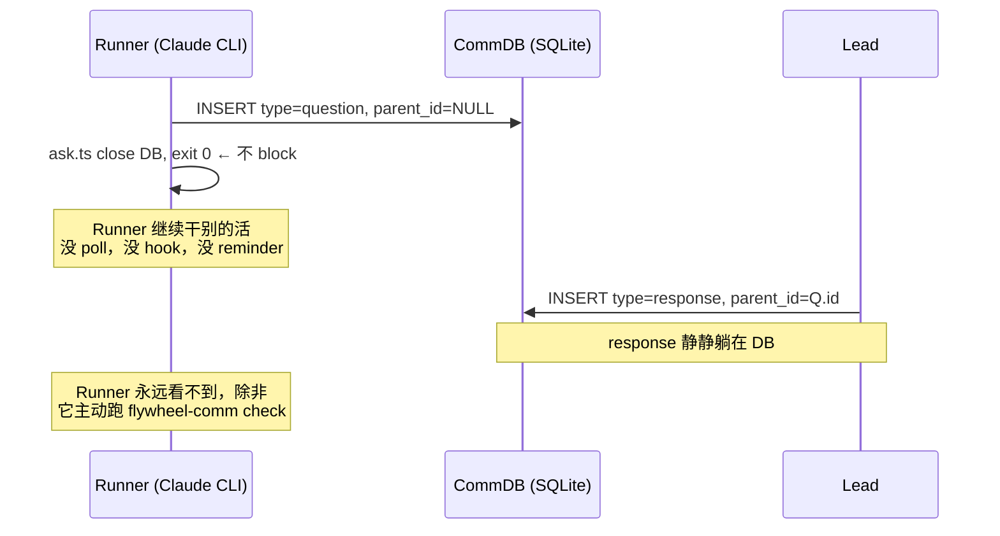
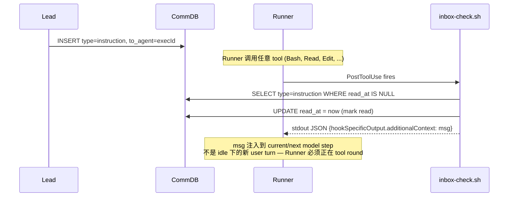
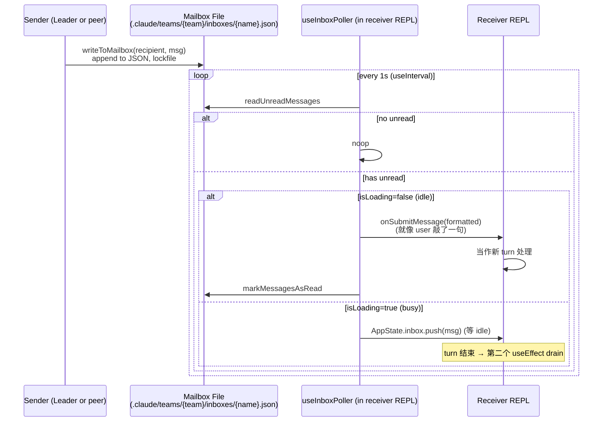

# Exploration: Runner Wake Bug — Lead respond 不唤醒 Runner — FLY-142

**Issue**: FLY-142 (Runner doesn't wake on Lead respond)
**Date**: 2026-05-06
**Status**: Draft
**Linear**: https://linear.app/geoforge3d/issue/FLY-142

---

## 0. 一句话结论

我们 **没** 真正 "仿照 Agent Team" — 我们只搬了 mailbox 这一层（CommDB 类比 mailbox file），但 **没搬 receiver-side 的 1s polling 主动 wake**。
Runner 的 wake 完全 hinge 在 PostToolUse hook 上，而该 hook 只 process `type='instruction'` 一种 message，所以 `respond` (type=`response`) 永远不会被 Runner 看到 — 除非 Runner 当时正在 `gate` poll loop 里 block。

## 1. 现 Flywheel comm wire — 4 paths

下面 4 条路径全部以 SQLite `messages` 表为 backing store。schema：

```text
messages(id, from_agent, to_agent, type, content, parent_id,
         read_at, delivered_at, created_at, expires_at,
         checkpoint, content_ref, content_type, resolved_at)
type ∈ {question, response, instruction, progress}
```

### Path A — Runner `ask` + Lead `respond`（**BROKEN — FLY-142 的根因**）



**为什么 broken**：`ask.ts` 是 fire-and-forget — `INSERT` 完就 `exit 0`，整个 process 结束。Runner 那边也没人读这个 response。`inbox-check.sh` 这个 PostToolUse hook 只 SELECT `type='instruction'`，根本不看 `type='response'`。System prompt 里告诉 Runner "use `flywheel-comm check {question_id}` to check for a response"，但没机制提醒 Runner 何时去 check。

### Path B — Lead `send` → PostToolUse hook（works）



**精确点**：PostToolUse `additionalContext` 是注入到 *正在/下一个* model step 的 system reminder — **不是** Agent Team 的 idle submit / new user turn。Runner 已经 idle 在 prompt 时 hook 不会触发；所以本 path 也不能干预等输入或长 Bash 阻塞中的 Runner。

**触发条件**（精确）：
- Runner 必须在 tool round 内（`Bash` / `Read` / `Edit` / ...）；纯思考 / 等输入时 hook 不触发
- `FLYWHEEL_EXEC_ID` 和 `FLYWHEEL_COMM_DB` env 必须存在
- DB 文件必须存在
- 必须有 `type='instruction'` AND `read_at IS NULL` AND `expires_at > now()`
- `UPDATE read_at` 必须成功 — 否则 hook 不输出 (避免重复注入)

**为什么 works**：`send` → 写一行 instruction；下一次 Runner 跑任何 tool，hook 就会 inject。Runner system prompt 还告诉它 "manually check with `flywheel-comm inbox` at task boundaries" 作为 safety net。

### Path C — Lead `respond` 当 Runner 处于 `gate` block（works）

```mermaid
sequenceDiagram
    participant R as Runner
    participant G as gate (subprocess poll)
    participant DB as CommDB
    participant L as Lead

    R->>G: spawn `flywheel-comm gate brainstorm ...`
    G->>DB: INSERT type=question, checkpoint=brainstorm
    loop every 15s
        G->>DB: SELECT response WHERE parent_id=Q.id
        alt 有 response
            G->>DB: resolveGate(Q.id)
            G-->>R: stdout = response.content; exit 0
            Note over R: Runner 收到 stdout 作为 Bash tool result
        else 没 response
            G->>G: sleep poll interval
        end
    end
    L->>DB: INSERT type=response, parent_id=Q.id
    Note over G: 下一轮 poll 读到，立刻返回
```

**触发条件**：
- Runner 主动 spawn `flywheel-comm gate <checkpoint>` subprocess
- gate 进入 `gateInner` 的 `while (Date.now() < deadline)` poll loop（默认 15s 间隔, 30 min timeout）
- 整个 gate 命令是 Runner 的 tool call (Bash) — 它真正 BLOCK 的是 Runner 的 Bash tool, 不是 Runner LLM 本身
- 必须 `type='response' AND parent_id = Q.id`

**关键点**：FLY-60 / FLY-47 引入的 hard gate (brainstorm + approve_to_ship) 走这条路，所以 Annie 在 Discord 看 "PR ready 请 review" 后回复 "OK ship"，Lead `respond` 写一行 response，Runner 的 Bash 在下一轮 poll 解锁，stdout 作为 tool result 进入 LLM context。

### Path D — Runner 周期性 poll（理论存在，实际 dead）

System prompt 告诉 Runner: "periodically run `flywheel-comm check {question_id}` to check for a response"。但：

- Runner 没有 timer，没有 cron。它是 LLM driven — 必须在 LLM 当前回合主动决定跑这个命令
- 没人提醒它 — `ask` 完之后下一个 turn LLM 会专注新任务，往往忘记 check
- `inbox` 也是同样问题：system prompt 说"at task boundaries"主动跑，但 LLM 不会自动跑

**结论**：Path D 实际上是 dead code，依赖 LLM 自觉。Annie 看到的"Runner 没醒"就是这条 path 失效。

---

## 2. claude-code Agent Team — 真 wake mechanism

claude-code Agent Team 有 **两** 个不同的 backend，对应 **两** 套 wake：

### 2.1 In-process teammate（同 process）

receiver 是 `LocalAgentTask` — 跑在 leader 同一个 React/Ink AppState 里：

```mermaid
sequenceDiagram
    participant Leader as Leader (REPL)
    participant SMT as SendMessageTool
    participant State as AppState.tasks[id]
    participant Loop as Agent run loop

    Leader->>SMT: tool_use SendMessage{to: peer, message}
    SMT->>SMT: detect peer is LocalAgentTask + status='running'
    SMT->>State: queuePendingMessage(taskId, msg)<br/>task.pendingMessages.push(msg)
    Note over Loop: 当前 turn 正常进行
    Loop->>Loop: tool round 结束，开始下一轮
    Loop->>State: drainPendingMessages(taskId)
    State-->>Loop: ['msg']
    Loop->>Loop: prepend msg 到下一轮 user input
```

**关键 code**：`SendMessageTool.ts:802-845` (router branch) → `LocalAgentTask.tsx:162` (queuePendingMessage)。
**触发 wake**：写 AppState 的 setAppState — React 自然 re-render，agent run loop 在下一个 tool boundary drain。
**不需要 hook**：因为 sender 和 receiver 共享 process state。

### 2.2 Out-of-process (tmux / process-based) teammate

receiver 是另一个 Claude CLI process，通过 `useInboxPoller` React hook 自己 poll mailbox 文件：



**关键 code**：
- Sender: `SendMessageTool.ts:160-172` (`writeToMailbox`)
- Receiver: `useInboxPoller.ts:107` (`INBOX_POLL_INTERVAL_MS = 1000`), `:139` (`poll`), `:843` (idle submit)

**触发 wake**：receiver 自己每秒主动读文件，idle 时直接 inject 成新 turn — equivalent to user 输入。
**重点**：receiver 必须是 fork 过的 claude-code (有 `useInboxPoller` 这段代码)，不是 stock CLI。

### 2.3 Abort signal — orthogonal to wake

`abortController.abort()` 只用于：
- shutdown approval 后强制结束 receiver (in-process: abort run loop; tmux: kill pane)
- 不是用来 "wake" 的

—— wake 永远走 mailbox / pendingMessages path，abort 只用于 lifecycle 终止。

---

## 3. Diff Matrix — Flywheel 对比 claude-code Agent Team

| 维度 | claude-code (in-proc) | claude-code (tmux) | Flywheel | 我们 reuse / diverge |
|------|----------------------|-------------------|----------|---------------------|
| Backing store | AppState in memory | JSON file + lockfile | SQLite + WAL | **diverge** (chose DB for cross-Lead query / TTL / FK) |
| Sender API | `SendMessageTool` builtin | `SendMessageTool` builtin | 4 个 CLI: `ask` / `gate` / `send` / `respond` | **diverge** (手写 CLI subprocesses) |
| Receiver wake | `queuePendingMessage` → drain at next tool boundary | `useInboxPoller` 1s 主动 poll → submit as turn | **`inbox-check.sh` PostToolUse hook**（仅 `instruction`）+ `gate` 内 poll loop（仅 `response`） | **diverge** (我们没 fork claude-code，没有 useInboxPoller; 我们用 hook + subprocess 凑) |
| Block primitive | none — sender 不 block, receiver 自己 wake | none | `gate.ts` subprocess inside Runner Bash tool 让 Bash tool 块住 | **diverge** (claude-code 没 block 概念) |
| Idle vs busy 区分 | drain at tool boundary | idle: submit as turn; busy: queue in AppState | hook 只在 tool boundary 触发；**没有真正的 idle submit / no busy queue** | **diverge** (我们没 mid-turn queue，也没 idle wake) |
| Permission / shutdown / plan-approval | structured msg + handler in poller | structured msg + handler in poller | **none** — Lead↔Runner 没这些 protocol | **不需要 reuse** (我们 Lead 是 separate Discord agent) |
| Receiver 被动 vs 主动 | 被动 (sender 改 state) | **主动** (receiver 1s poll) | **被动 + 一半主动** (`gate` 是 subprocess 主动 poll, 其它都靠 hook) | **diverge** |
| Plain msg → context | injected as user turn | injected as user turn | injected as `additionalContext` (PostToolUse hook 字段) | **diverge** (但 effect 类似) |

### 3.1 What we reuse (semantically)

- **mailbox 概念** — 一个 sender INSERT, receiver 自己来取
- **不阻塞 sender** — `ask` / `send` / `respond` 都是 fire-and-forget
- **read marking** — 我们用 `read_at`，他们用 `read: true`

### 3.2 What we diverge (and why)

| Diverge | 原因 | Cost |
|---------|------|------|
| 没有 receiver 内置 1s poll loop | 我们用 stock claude-code CLI，没 fork | **Path A 死掉**：response 没人主动取 |
| Hook 只 process `instruction` 一类 | GEO-266 只 design 了 instruction → instruction injection，response 当时设想由 Runner 自己 poll | Path A 进一步死掉 |
| `gate` 单独靠 subprocess block | 复用 Bash tool 的 block 行为 — 简单 | works for hard gates, 但 wire 复杂；Runner 必须 spawn subprocess |
| `ask` 设计为 fire-and-forget + 后续 check | 当时假设 LLM 会自觉 check | LLM 不自觉 — 实际 `ask` 永远不会被 Runner 主动取 response |

### 3.3 我们 "仿照 Agent Team" 了吗？— Annie Q2 的直答

**没有真仿照，只仿照了一半（mailbox-as-store）**。
- 仿照的部分：sender 写、receiver 取 — 这是 mailbox 的 minimal shape
- 没仿照的核心部分：**receiver-side polling loop**。Agent Team 的 `useInboxPoller` 是 wake 的灵魂；我们没有它，靠 PostToolUse hook 凑。Hook 只在 Runner 跑 tool 时触发，**且只 cover instruction 一种 type**。

把这个 diff 落到 wire 上，现状是：

| Wire | claude-code 等价物 | 我们做了 | Wake 状态 |
|------|------------------|----------|---------|
| Lead `send` | `SendMessage` plain msg | hook injects instruction | ✅ works |
| Runner `ask` + Lead `respond` | `SendMessage` + receiver poll | hook 不看 response | ❌ broken |
| Lead 主动 shutdown | `SendMessage` shutdown_request | (无对应 wire) | n/a |
| Runner gate (硬卡) | (无对应) | subprocess poll loop | ✅ works |

---

## 4. Annie 两个问题 — 精确答案

### Q1. "Runner ask 完为什么没 BLOCK？也不被 Hook 注入。"

**精确答案**：

1. **没 BLOCK**，因为 `ask.ts` 实现就是 `INSERT + close + exit 0` — 4 行 code，没 poll loop。System prompt 也明说 "use `flywheel-comm ask ...` to ask your Lead. Then continue with other work and periodically run `check`" — **设计就是不 block**。
2. **没 Hook 注入**，因为 `inbox-check.sh` 只 `SELECT ... WHERE type='instruction'` — 根本不看 `type='response'`。所以 Lead 写的 response 在 DB 里，但 hook 视而不见。
3. **gate question 才会 BLOCK**，因为它走的是 `gate.ts`，里面有 poll loop；ask 走的是 `ask.ts`，根本没 poll loop。Runner system prompt 把这两条分得清清楚楚 (`ask` = "ask + continue", `gate` = "BLOCKS until your Lead responds")。
4. **`stage='completed'` 时退出 BLOCK** 这种设计**不存在** — 是 Annie 的误解。能让 Runner 退 BLOCK 的只有：(a) Lead `respond` 让 gate poll 拿到 response 返回；或 (b) gate 自身的 timeout 到了 (deadline reached → exit code 取决于 `timeoutBehavior`)。

### Q2. "我们的整个 Lead 和 Runner 之间的交互，应该是完全去仿照 Agent Team 那样去做就可以了。所以我们现在不是仿照他们去做的吗？"

**直答：不是**。

我们仿了 mailbox 的 *形*（sender 写 / receiver 取），但没仿 wake 的 *神*（receiver 自己每秒主动 poll，idle 时自动 submit 成 turn）。Agent Team 的 `useInboxPoller` 是塞在 fork 过的 claude-code REPL 里的 React hook —— 我们用的是 stock claude-code CLI，没法 patch 进去。所以我们造了一个 parallel 系统：PostToolUse hook + `gate` subprocess。这个 parallel 系统：

- 在 instruction (Lead → Runner) 那一面 OK — hook 能 cover
- 在 response (Lead 回答 ask question) 那一面 broken — hook 不看 response，Runner 也不会自己想起来 poll
- 在 hard gate (brainstorm, approve_to_ship) OK — subprocess block

如果要真"仿照 Agent Team"，得把 hook 升级成 receiver-side 持续 polling loop（或者更激进：fork claude-code 把 useInboxPoller 接进去）。

---

## 5. 修法 4 个 Option — Codex 讨论用

### Option 1 — 让 PostToolUse hook 也注入**非 gate** `response`（最小改动 — Codex round 1+2 修订版）

> **⚠ Codex round 2 关键 catch**：现 `inbox-check.sh` 在 line 31 有 `if [ "$COUNT" -eq "0" ]; then exit 0` early exit — 如果没有 unread instruction，hook 立刻 exit，**根本不会查 response**。所以 Option 1 不能只"加第二个 SELECT 到 hook 末尾"，必须**重构 control flow**：先 query 两类 unread (instruction + non-gate response)，**两者都为空时才 exit**；否则合并 payload 后统一 emit。

修改 `inbox-check.sh`：增加第二个 SELECT 并重构 control flow（不能保留 instruction-only early exit）：
```sql
SELECT r.id, r.from_agent, r.content, q.content AS question_content, q.id AS question_id
FROM messages r
JOIN messages q ON r.parent_id = q.id
WHERE r.to_agent = '$EXEC_ID'
  AND r.type = 'response'
  AND r.read_at IS NULL
  AND r.expires_at > datetime('now')
  AND q.checkpoint IS NULL   -- ★ 关键：排除 gate response，gate 自己消费
ORDER BY r.created_at ASC
```

把 response 包成独立 block 注入（**不能跟 instruction 混 header**）：
```
LEAD RESPONSE TO YOUR QUESTION

[Question {short_id}] You asked: <q.content excerpt 200 字>
[Lead's answer] <r.content>
```

| 项 | 内容 |
|----|------|
| 改动 | hook script **重构 control flow**（不能在 instruction COUNT==0 时 early exit）+ Runner system prompt **替换**（不只是删）"periodically run check" 那一句 |
| 改动行数 | hook ~50-70 行 + 单元测试 |
| **关键 fix #1（Codex round 1 catch）** | **必须排除 `q.checkpoint IS NOT NULL`** — 否则 hard gate (brainstorm/approve_to_ship) 的 response 在 gate Bash 返回后被 hook 再次注入，因为 `resolveGate` 只 mark parent question，不 mark child response |
| **关键 fix #2（Codex round 2 catch）** | **必须重构 hook control flow** — 现 hook 在 line 31 有 `if [ "$COUNT" -eq "0" ]; then exit 0`（COUNT 来自 instruction-only query）；如果只在末尾追加 response query，"无 instruction、有 response"（即 FLY-142 核心场景）会直接 early exit，response 仍然被 silently 丢。**正确做法**：先并行查 instruction COUNT 和 response COUNT，两者都为零才 exit；否则各自 build payload block，合并后 emit |
| **关键 fix #3（Codex round 2 catch）** | **`read_at` mark 顺序**：现 hook line 52 在 build `DISPLAY_MSGS`（line 57）<u>之前</u> 就 mark read，如果 jq render 失败 → message 被 mark read 但 never injected → 永久丢。Option 1 应顺便 fix 这个 race：先 in-memory build full payload，再 mark exactly those IDs read，再 emit；任一步失败 emit nothing。这是修订 instruction 路径，不只是加 response 处理 |
| Header 修正 | response 用 `LEAD RESPONSE TO YOUR QUESTION` header — **不能** 用 `LEAD INSTRUCTION`，否则 Runner 把 answer 当新 command 执行 |
| 必带 parent context | 注入时必须带 `question_id` + `question_content` 摘要（200 字），多 question 并发时识别用 |
| System prompt 必须**替换** | 删 "periodically run `flywheel-comm check`" 那句，替换成："Lead responses to `ask` may appear automatically after later tool calls under `LEAD RESPONSE TO YOUR QUESTION`; correlate by `question_id` and incorporate the answer." 否则 Runner ask 完没有 prompt-level contract 知道答案怎么收 |
| 修不掉的根本问题 | wake 仍然只在 tool round 触发；Runner 纯思考 / 等 permission / 长 Bash 时还是不会 wake。这是一个 tactical patch，不是 Agent Team-equivalent receiver。Hook 的 `additionalContext` 是注入到 *current/next model step*，不是 Agent Team 的 idle submit / new user turn |
| 实施周期 | **0.5-1 天** (含单元测试 + e2e fixture) |

**适合**：当前 v1.26 sprint 想 quick fix，先让 ask + respond 跑通

### Option 2 — 加一个 receiver-side polling loop（中改动 — Codex round 1 修订）

在 Runner pane 里跑一个独立 background process（或在 Bash tool 里塞一个 sentinel command），每 N 秒 poll CommDB unread response，找到就**安全地** notify Runner（具体注入机制需要 design — `tmux send-keys` 是一个候选，但有重大风险）。

| 项 | 内容 |
|----|------|
| 改动 | 新增 daemon (Node/shell) + 注入逻辑（机制待定） |
| 改动行数 | ~300-600 行 + 测试 |
| 风险（Codex round 1 扩展） | 1) tmux pane idle/busy 状态**不等价于** claude-code 的 `isLoading` — 没有可靠途径外部判断 Runner 真 idle；2) `tmux send-keys` 可能注入到 Bash subprocess / permission prompt / interactive command — 需要安全 surface 检测；3) daemon lifecycle: 跟 Runner 同启同停、restart 后 dedupe、知道正确 pane；4) 消息 lost vs 重复语义需明确：mark read 在 inject 前 = 风险丢；mark read 在 inject 后 = 风险重；5) 注入内容是 keystrokes，要严格 quoting / escaping（避免 prompt injection） |
| 安全替代 | 不直接 `tmux send-keys` — daemon 把 unread response 写入一个 hook-readable file（per-runner sentinel），下次 PostToolUse hook 读这个 file 而非 SQL；tmux 只在 pane 真 idle 时做 prompt nudger（按下 Enter 触发新 turn）|
| 修不掉 | 离 claude-code 越近，但 receiver 是 stock CLI，submit-as-turn 这一步永远是模拟的 |
| 实施周期 | **3-5 天**（含 idle/busy 检测设计 + 注入 surface guard + e2e） |

**适合**：v1.27 设计目标 — 但 `tmux send-keys` 不能作为 commit 方案，需要先 PoC idle/busy 检测可行性

### Option 3 — fork claude-code，把 `useInboxPoller` 接进 Runner（大改动 — Codex round 1 警告）

复用 claude-code 的 `useInboxPoller` 实现，把 Runner 切到 fork 版 claude-code。

| 项 | 内容 |
|----|------|
| 改动 | 维护一个 claude-code fork (类似 cyrus / discord plugin fork)；CommDB → mailbox file 适配 |
| 改动行数 | fork 整个 binary + 增量 patches |
| **Codex 警告** | 单纯 port `useInboxPoller` 不够 — 它依赖 AppState、teammate identity/team context、mailbox protocols、permission/shutdown message classifiers、`onSubmitMessage`。要么完整 fork，要么写一个 Flywheel-specific receiver — 后者 effort 接近 Option 2 |
| 风险 | 跟随 upstream 升级成本；plugin store 集成 fragile；fork 同步 |
| 修不掉 | 在 Lead Discord agent 一侧仍然要 bridging — Lead 不是 in-process |
| 实施周期 | **2-3 周**（如果 fork 必须保持 upgradeable） |

**适合**：长期 v2 架构方向，但 sprint 太重

### Option 4 — 全面切到 mailbox + SendMessage tool（彻底重写 — Codex round 1 强烈反对）

放弃 CommDB，改成 mailbox JSON file + 自带 SendMessage 工具 (Lead 是 Discord agent，注入一个 `flywheel-send` MCP tool)。Runner 也是 fork 过的 claude-code 自带 `useInboxPoller`。完全 1:1 复刻 Agent Team。

| 项 | 内容 |
|----|------|
| 改动 | 删 CommDB / `flywheel-comm` 整个 package；Lead Discord agent 上 SendMessage MCP；Runner 跑 fork claude-code |
| 改动行数 | 影响数十文件（gate / inbox / respond / send 测试 + Bridge 大量调用） |
| **Codex 强烈反对** | 这**不是 FLY-142 的修复 option**，是架构 rewrite。CommDB 提供的：SQL queryability、sessions linkage、TTL/cleanup、gate lookup、cross-Lead/project visibility、QA observability、existing tests — 全部要丢；mailbox file 仍然需要 `useInboxPoller` 类似的 receiver runtime（不会因为换 store 自动解决 wake） |
| 风险 | 现有 hard gate (brainstorm / approve_to_ship) 测试体系全部要 rewrite；多 Lead 并发现状的 cross-Lead query 在 mailbox file 里很难做 (CommDB 一条 SQL 解决) |
| 修不掉 | TTL / 历史 audit / cross-Lead 跨项目 query 这些 SQLite 的优势全失 |
| 实施周期 | **4-6 周 + 大量 regression** |

**Annie 措辞分析（Codex round 1）**：
- "完全去仿照 Agent Team" 表达的是对 "X-half" 的不满，**不一定** 等于 "删 CommDB"
- 她真正的关切大概率是 receiver wake semantics — Option 2/3 已经能解决
- Option 4 是一个 product/architecture decision，必须 Annie **明示同意** 才能进，不能 inferred

**适合**：v2 全面 rewrite，FLY-142 sprint 不可接受。**不应作为 FLY-142 修复方案** — 留作 v2 架构 track 单独 issue 讨论

---

## 6. 推荐（Codex round 1 已 review）

**主推 Option 1（带修订）** 当 sprint 内 quick fix（0.5-1 天，含测试）+ **v1.27 启动 Option 2 设计** 但 PoC 验证 idle/busy 检测可行后才 commit。

### Option 1 必备 implementation 细节（Codex round 1 + 2 综合）

**Hook control flow 重构（不能保留 instruction-only early exit）**：

1. 并行查两类 unread: instruction COUNT + non-gate response COUNT (`r.type='response' AND q.checkpoint IS NULL`)；**两者都为零才 exit**
2. SELECT `response` rows: `r.to_agent = '$EXEC_ID' AND r.type='response' AND r.read_at IS NULL AND r.expires_at > now() AND q.checkpoint IS NULL` (JOIN parent question)
3. `read_at` 标记顺序修订：**先 in-memory build full payload，再 mark 所选 IDs read，再 emit**；任一步失败 emit nothing。这要修 instruction 路径（不只是加 response 处理）—— 现路径在 build `DISPLAY_MSGS` <u>之前</u> mark read，jq 渲染失败会丢消息

**Payload 与 prompt 修订**：

4. 输出独立 block `LEAD RESPONSE TO YOUR QUESTION`，含 `question_id` + parent question excerpt（200 字）— **不能**与 instruction 共用 `LEAD INSTRUCTION` header
5. 合并后 payload 结构：`[LEAD INSTRUCTION ...]` + `[LEAD RESPONSE TO YOUR QUESTION ...]` 两 block 串拼接
6. **替换** system prompt（不只是删）"periodically run `flywheel-comm check`" 那句为："Lead responses to `ask` may appear automatically after later tool calls under `LEAD RESPONSE TO YOUR QUESTION`; correlate by `question_id` and incorporate the answer."

**测试要求**：

7. 单元测试 cover：(a) instruction-only inject (b) response-only inject **(★ FLY-142 核心)** (c) 两者都有 → 合并 payload (d) 多 response 顺序 (e) gate response **不** inject (f) `read_at` 失败时 not emit (g) jq render 失败时 not mark read

### v1.27 Option 2 设计前置

- PoC: 怎么从外部判断 Runner pane idle vs busy？没有 `isLoading` 等价物
- PoC: 注入 surface guard — 怎么避免注入到 Bash subprocess / permission prompt？
- 评估安全替代：daemon 写 sentinel file + hook 读 file（避开 tmux send-keys）

### Option 3/4 — 不在 FLY-142 scope

- Option 3 (fork claude-code) — 留给 v2 架构 track，单独 issue
- Option 4 (drop CommDB) — Annie **必须明示同意** 才能启动，不能从 "完全仿照 Agent Team" 推论；Codex 强烈反对作为 FLY-142 的 fix

## 7. Open questions for Codex review

1. Option 1 的 hook 升级里，"response 是否要按 question.from_agent 关联回 to_agent" — 现在 `to_agent` 字段已经在 `insertResponse` 时正确 set 成 question 的发起者；hook SELECT 用 `to_agent=execId` 就能 cover，无需 join。**确认 schema 这一点正确**。
2. Option 2 daemon 怎么知道 Runner 当前 idle 还是 busy？没有 `isLoading` 这种 React state。可能要看 tmux pane 是否 active / 有没有人在打字 — 不可靠。
3. Option 1 + system prompt 里要不要砍掉 "periodically run `check`" 这句 — 既然 hook 自动 inject 了，提示反而 conflict。
4. Option 4 / 3 是不是被 FLY-82 (Managed Agents) 涉及？查 MEMORY.md `project_fly82_managed_agents.md` —— 决定 "不迁移，不重写，现有代码合理"，所以 Option 3/4 跟那个 decision 直接冲突。Annie 这次是不是反悔了那个 decision？需要她明确。

## 8. 附：System prompt 措辞（GEO-206 + GEO-266 + FLY-47 综合）

`packages/edge-worker/src/Blueprint.ts:328-347` 注入到 Runner 的关键句：

> "Prefer independent implementation. If you encounter a major ambiguity ... use `flywheel-comm ask ...` to ask your Lead. Then continue with other work and **periodically run `flywheel-comm check {question_id}`** to check for a response. If no response arrives before your session ends, use your best judgment."
>
> "Your Lead may send you instructions during your session. **Instructions may appear automatically as context after your tool calls via a PostToolUse hook**. Additionally, manually check with `flywheel-comm inbox` at task boundaries (before committing, when starting a new subtask) as a safety net. When you receive a Lead instruction, evaluate urgency and act accordingly."

注意：
- `ask` 的 wake = "periodically run `check`"（依赖 LLM 自觉 — 实际不工作）
- `instruction` 的 wake = PostToolUse hook (works)
- 两者用了不同 mechanism — 也是 confusion 的来源

## 9. References — 查到的 source locations

| 概念 | File:Line |
|------|----------|
| Flywheel ask CLI | `packages/flywheel-comm/src/commands/ask.ts:10` |
| Flywheel respond CLI | `packages/flywheel-comm/src/commands/respond.ts:10` |
| Flywheel send CLI | `packages/flywheel-comm/src/commands/send.ts:10` |
| Flywheel gate poll loop | `packages/flywheel-comm/src/commands/gate.ts:111` |
| Flywheel inbox CLI | `packages/flywheel-comm/src/commands/inbox.ts:14` |
| PostToolUse hook | `~/.flywheel/hooks/inbox-check.sh:29` (only `type='instruction'`) |
| Runner env injection | `packages/claude-runner/src/TmuxAdapter.ts:139` (`FLYWHEEL_EXEC_ID`) |
| System prompt | `packages/edge-worker/src/Blueprint.ts:328-347` |
| CommDB schema | `packages/flywheel-comm/src/db.ts:8-37` |
| getResponse | `packages/flywheel-comm/src/db.ts:236` |
| getUnreadInstructions | `packages/flywheel-comm/src/db.ts:298` |
| claude-code in-proc wake | `src/tools/SendMessageTool/SendMessageTool.ts:802` + `src/tasks/LocalAgentTask/LocalAgentTask.tsx:162` |
| claude-code tmux wake | `src/hooks/useInboxPoller.ts:107` (`INBOX_POLL_INTERVAL_MS=1000`), `:843` (idle submit) |
| claude-code mailbox write | `src/utils/teammateMailbox.ts:134` |
| claude-code mailbox read | `src/utils/teammateMailbox.ts:84` |

