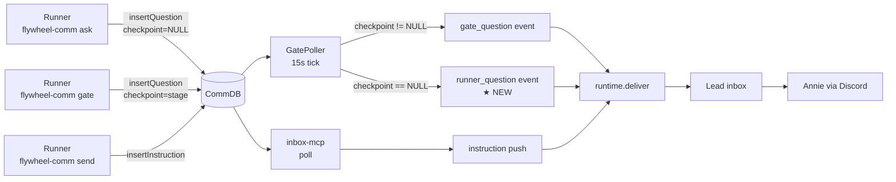

# Exploration: Runner `flywheel-comm ask` → Lead Bridge event — FLY-161

**Issue**: FLY-161 ([infra-gap] Runner `flywheel-comm ask` 不 emit Bridge event → Lead 错过 mid-execution 问题)
**Date**: 2026-05-17
**Status**: Draft

## TL;DR

Runner 通过 `flywheel-comm ask` 提问只写 SQLite，Bridge 不知道，Lead 不知道。当前唯一发现方式是 Lead 每 5 分钟手动跑一次 `flywheel-comm pending` — 操作成本高、漂移严重。**Fix**：扩 `GatePoller` 把 `checkpoint IS NULL` 的 question 也捞出来，新发一个 `runner_question` event（与 `gate_question` 同 deliver/retry/dedup 通道）→ Lead 立刻看见 → 转发 Annie。

---

## 1. Problem

### 1.1 触发案例

**2026-05-17 GEO-374**：Backend Runner 在 23:20 通过 `flywheel-comm ask` 提了 question `b7a602f0`。Lead 11 分钟没察觉，直到 23:31 Annie 主动 ping Peter 才被发现。

### 1.2 现状

`flywheel-comm` 三条 Runner→Lead 通道里，**只有 `ask` 这条没有自动 push 给 Lead**：

| CLI | DB 写入 | Bridge 是否 pick up | Lead 怎么知道 |
|---|---|---|---|
| `send` (instruction) | `type='instruction'` | ✅ `inbox-mcp` push 路径 (FLY-109) | 自动入 inbox |
| `gate` (blocking question + checkpoint) | `type='question'`, `checkpoint != NULL` | ✅ Bridge 端 `GatePoller` (15s poll) → `gate_question` event | 自动入 Lead inbox |
| **`ask`** (non-blocking question) | `type='question'`, **`checkpoint = NULL`** | ❌ **无人 pick up** | **Lead 必须手动 `flywheel-comm pending` 轮询** |

---

## 2. Codebase Audit

### 2.1 `ask` CLI（19 行，确认无 emit）

`packages/flywheel-comm/src/commands/ask.ts`：

```ts
export function ask(args: AskArgs): string {
    const db = new CommDB(args.dbPath);
    try {
        const fromAgent = args.execId ?? "runner";
        const questionId = db.insertQuestion(fromAgent, args.lead, args.question);
        return questionId;
    } finally { db.close(); }
}
```

只写 DB，无 HTTP、无 hook、无 event。

### 2.2 `gate` 真实 emit 路径（与 Peter 描述略不同）

Peter brief 写 "`gate` CLI emit `gate_question` event"。实际：

- `packages/flywheel-comm/src/commands/gate.ts`：自身**只** emit `stage_changed`（如果传了 `--stage`，见 `reportStageFailOpen`）。它写 question + 轮询 response，并不直接 emit `gate_question`。
- 真正 emit `gate_question` 的是 **Bridge 端**：`packages/teamlead/src/bridge/gate-poller.ts`：
  - 默认 15s `setInterval` 调 `poll()`
  - `getPendingGateQuestions(dbPath, leadId)` 调 `db.getPendingQuestions(leadId).filter(q => q.checkpoint != null)` ← **关键 filter，把 ask 写的 row 明确跳过**
  - 命中后 build `HookPayload { event_type: 'gate_question', question_id, comm_db_path, checkpoint, summary, chat_thread_id, ... }` → `store.appendLeadEvent` (持久化 + dedup) → `runtime.deliver(envelope)` → Lead 端 `flywheel-inbox` MCP

所以本质是 **GatePoller 的 filter 设计上把 non-checkpoint question 排除在外**。`ask` 写的 row 永远不被任何 daemon 看见。

### 2.3 Generic 视角：其他 Runner→Lead 路径都通

扫了一遍其他通道：

| 信号 | 来源 | 通道 | 状态 |
|---|---|---|---|
| Runner 显式指令/进度 | `flywheel-comm send` | `inbox-mcp` push (FLY-109) | ✅ |
| Runner 阻塞型 gate 提问 | `flywheel-comm gate <stage>` | GatePoller → `gate_question` | ✅ |
| Runner 完成 | `flywheel-comm complete` | `ExecutionEventEmitter` HTTP `/events` | ✅ |
| Runner 卡死/idle | `RunnerIdleWatchdog` (Bridge 30s poll tmux) | `runner_idle_detected` (guardrail) | ✅ |
| Runner stuck (no activity) | watchdog | `session_stuck` (guardrail) | ✅ |
| Lead 主动看 Runner pane | `flywheel-comm capture` | Lead 端 tool | ✅ |
| **Runner 非阻塞提问** | **`flywheel-comm ask`** | **无** | **❌ FLY-161** |

**结论**：不是 systemic 信号架构缺陷，是单点 gap。把 `ask` 对齐其他通道即可。

---

## 3. Fix Candidates

### Fix A: 扩 `GatePoller` filter + 新 `runner_question` event 【推荐】

GatePoller 已经会按 lead 分组扫 CommDB、把 result 写 lead_event 持久层、复用 `runtime.deliver()` 投递。只需要：

1. 改 `GatePoller.getPendingGateQuestions` 不再 filter `checkpoint != null`，改为**全量返回，按 checkpoint 是否存在分支**：
   - `checkpoint != NULL` → 继续走 `gate_question`（现有逻辑不变）
   - `checkpoint == NULL` → 走新分支，build `event_type: 'runner_question'` 的 `HookPayload`
2. 新 event id 形如 `runner_q_${question.id}` 区分（gate 是 `gate_${question.id}`）
3. `LeadEventEnvelope` 用同一 `runtime.deliver()` 接口（无需新增传输）
4. Lead 端 `flywheel-inbox` MCP 在 prompt template 里加一段：收到 `runner_question` 立刻转 Annie（同 `gate_question` 的 priority，但措辞为 "Runner 主动 surface 问题，不阻塞"）

**优点**：
- ✅ 复用 deliver / retry / `isLeadEventDelivered` dedup / chat_thread_id 解析 / `appendLeadEvent` 持久化所有基础设施
- ✅ 改动小，~30 行 GatePoller 内部 + 新 event type 注册 + Lead prompt 1 段
- ✅ 与 `gate_question` 对称，未来加 `progress` / 其他 question type 也是同一个 poller 内分支
- ✅ Bridge 重启后未投递的 `runner_question` 会被 `appendLeadEvent` 的持久化 + guardrail retry 兜住（如果加进 `GUARDRAIL_EVENT_TYPES`）

**缺点**：
- ⚠️ 仍有最长 15s poll lag（与 gate 一致，Annie 体感无差异）
- ⚠️ Poller 名字 `GatePoller` 变得有点 misleading；可以改名 `QuestionPoller` 或注释说明（不强求）

### Fix B: `ask` CLI 直接 HTTP POST `/events`

`gate.ts` 内的 `reportStageFailOpen` 已经示范了 fire-and-forget HTTP POST。`ask` 可以照搬，emit 一个 `runner_question` event。

**缺点**：
- ⚠️ Fire-and-forget — Bridge down 时 question 写了 DB 但 Lead 永远不知道（这正是 `gate_question` 用 poller 而不是 CLI emit 的原因，参考 FLY-62 commit 历史）
- ⚠️ 重复 GatePoller 已有的 dedup / retry / runtime registry 逻辑
- ⚠️ 测试矩阵更复杂（CLI 端要 mock fetch，poller 端不用）

### Fix C: 复用 `session_blocked` / `session_stuck` / `runner_idle_detected`

**直接否决**。这三个 event 都是 **watchdog 系统级推断**（pane 静止 N 分钟 = idle）。`ask` 是 **Runner 显式主动请求帮助** — 语义完全不同。混用会让 Lead prompt 处理逻辑混乱（"是真 idle 还是有问题要问"），并污染 idle alert noise level。

---

## 4. 推荐方案 + Annie Scope Decisions

**采用 Fix A**。Annie 已确认以下决策：

| 问题 | Annie 决策 |
|---|---|
| Q1 Lead 处理 policy | **立刻 ping Annie**（同 `gate_question` priority）。**不 batch、不引入 `--priority` flag** |
| Q2 新 event 名字 | **`runner_question`**（明确 source = Runner，区分将来可能的 lead→lead question） |
| Q3 语义文档 | **同步收紧 CLI doc + Runner prompt**，明确：`ask` = "Runner 主动 surface 问题，不阻塞自身继续干活"；`gate` = "Runner 必须等 reply 才能继续" |

### 4.1 决策含义

- **Lead prompt**：不分级、不 batch — `runner_question` 就是 high-priority alert，立即转 Annie，与 `gate_question` 同等对待。语义差别留在 Lead 转 Annie 的措辞（gate = "Runner 在等你定夺"，ask = "Runner 想跟你 sync 一下，不阻塞"）。
- **`ask` CLI**：不需要新增 priority 参数。保持现有 `--lead`、`--exec-id`、`--question` 接口。
- **Runner prompt / docs**：明确告诉 Runner 何时用 `ask` vs `gate`。`gate` = 我必须等 reply；`ask` = 我会继续干别的事，但希望 Annie 知道这件事。

---

## 5. 架构示意（Fix A 后）



---

## 6. Open Questions for Codex / Plan 阶段

留给 research / plan 阶段细化（不阻塞 brainstorm 收口）：

1. **Payload schema 字段**：`runner_question` 的 `HookPayload` 是否需要新字段？目前 `HookPayload` 里 `checkpoint?: string` 在 `runner_question` 路径下永远空 — 是显式 omit、还是把它复用为 free-form tag？倾向显式 omit、保持类型干净。
2. **Guardrail 归类**：是否把 `runner_question` 加入 `GUARDRAIL_EVENT_TYPES`（lead-runtime.ts:18）？倾向**加入** — 与 `gate_question` 对等，丢失等价于 FLY-161 再次发生。
3. **Bootstrap snapshot**：crash recovery 时 `LeadBootstrap.pendingGateQuestions` 现在只装 checkpoint != NULL 的。是否新增 `pendingRunnerQuestions`，或合并字段并加 `kind: 'gate' | 'ask'` 标签？倾向新增独立字段，对应独立 prompt 段落。
4. **Lead prompt 措辞**：转 Annie 时怎么区分 gate vs ask？建议:
   - gate → "🛑 GEO-XXX Runner 卡在 {checkpoint} 等你裁决：…"
   - ask → "💬 GEO-XXX Runner 想 sync：…（继续干活中）"
5. **GatePoller 改名**：是否同步把类名改成 `QuestionPoller` / `RunnerSignalPoller`？倾向**不改**，加注释说明即可（避免 noise diff）。
6. **测试覆盖**：
   - GatePoller 单测：checkpoint=NULL 走新分支、checkpoint=stage 走老分支
   - Lead prompt E2E：QA 框架跑一遍 Runner ask → Lead 收到 → Annie Discord ping
7. **Migration**：现有部署里如果有 stale `ask` question（checkpoint=NULL，未 read，未过期），升级后第一次 poll 会全部 burst 给 Lead。是否需要 grace window / 仅处理 created_at > deploy_time 的？倾向**不加** — TTL 72h 自然消化，且这些本来就是 Lead 该看见的。

---

## 7. Files Touched (predicted)

- `packages/teamlead/src/bridge/gate-poller.ts` — filter 改成全量 + 分支 build payload
- `packages/teamlead/src/bridge/hook-payload.ts` — 加 `runner_question` 进 event_type 注释（无新字段）
- `packages/teamlead/src/bridge/lead-runtime.ts` — 把 `runner_question` 加入 `GUARDRAIL_EVENT_TYPES`
- `packages/teamlead/src/bridge/mailbox-lead-runtime.ts` + `commdb-lead-runtime.ts` — 加 `runner_question` 的格式化（参考现有 `gate_question` 块）
- `packages/teamlead/src/bridge/lead-runtime.ts` — `BootstrapGateQuestion` 旁边加 `BootstrapRunnerQuestion` 或合并
- `packages/teamlead/src/__tests__/` — GatePoller 测试 + lead-runtime 测试加 case
- `packages/flywheel-comm/README.md` 或 `--help` 文本 — `ask` vs `gate` 语义说明
- Lead identity prompt（GeoForge3D 仓 `.lead-prompts/*`）— 收到 `runner_question` 的处理段
- `doc/qa/scenarios/` — 加一条 E2E scenario

---

## 8. Out of Scope

- 不动 `send` / `complete` / `capture` 通道
- 不引入 priority / batching / quiet hours（Annie Q1 决策）
- 不重命名 GatePoller / 不重构 CommDB schema
- 不动 `flywheel-comm pending` CLI（Lead 仍可手动 poll 作为 fallback）

---

## 9. Next Steps

1. **Research 阶段**（`/research`）— 把上面 6 个 open question 落到具体代码位置/类型签名
2. **Plan 阶段**（`/write-plan` → `/codex-design-review`）— 给出 `v1.27.x-FLY-161-runner-question-event.md`
3. **Implement** — TDD：先写 GatePoller 单测覆盖两个分支，再改代码
4. **E2E QA** — 用 QA 框架真跑一个 Runner ask → Annie 收到 Discord ping
