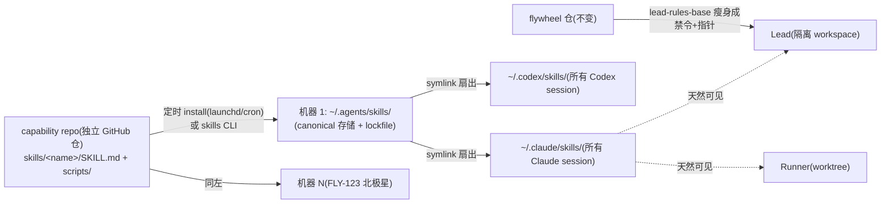

# Exploration: 全局 Skill 框架 — Lead/Runner 能力从"塞 prompt"迁到按需调用的 Skill — FLY-214

**Issue**: FLY-214（全局 Skill 框架 — 架构方向）
**Date**: 2026-06-04
**Status**: Draft（audit 完成,待与 Annie brainstorm ≥3 轮）
**关联**: FLY-213（视频监控,本框架第一个真实住户）、FLY-205（doc-flow baseline,可借鉴的分发模式）、FLY-123（Codex Runner,多 backend 一致性北极星）、#222（founder-html-delivery,第一个点名迁移对象）

---

## 0. 一句话问题

现在给 Lead/Runner 加能力 = 往启动 prompt 里塞文字（#222 就是这么上线的）。Annie 判定这条路不可扩展。方向:参考 Claude Code 官方 Skill 机制,能力打包成独立 skill,放统一位置,agent 按需发现、按需调用。

---

## 1. Audit — 现有机制全貌（先看清已有的,别从零设计）

审计结论先行:**Flywheel 不是没有 skill 机制 —— 它已经有一套在生产跑的 Runner 端 skill 注入系统（v0.2,2026-03 上线),和一个机器级全局 skill 层。真正缺的是:① Lead 端完全没接上 skill 层;② 没有统一的"Flywheel 管理的 skill 源 + 分发";③ 没有"什么留 prompt、什么进 skill"的边界准则。**

当前一共 **4 条并存的能力投放管道**:

### 1.1 管道 A:Lead prompt 层(Annie 点名要逃离的"塞 prompt")

`packages/teamlead/scripts/claude-lead.sh`(1647 行)在 Lead 启动时用一串 `--append-system-prompt-file` 把规则文件压进 system prompt:

| 层 | 来源 | 文件 / 行数 | 加载条件 |
|----|------|------------|---------|
| BASE 1a | `packages/teamlead/lead-rules-base/` | department-lead-rules.md (432) | 非 cos 角色 |
| BASE 1a | 同上 | cos-lead-rules.md (369) | cos 角色 |
| BASE 1a | 同上 | runner-messaging-rules.md (76) | 非 cos + mailbox backend |
| BASE 1a | 同上 | executor-routing.md (147) | 非 cos |
| BASE 1a | 同上 | stuck-runner-remanage.md (112) | 非 cos |
| BASE 1a | 同上 | doc-flow-rules.md (78) | 非 cos |
| BASE 1b | 同上 | founder-only-authority.md (405) | 所有角色 |
| BASE 1b | 同上 | **founder-html-delivery.md (99,#222)** | 所有角色 |
| scripts/ | `packages/teamlead/scripts/` | inbox-ack-rule.md (69) | inbox-mcp 开启时 |
| scripts/ | 同上 | **screencapture-l3-skill.md (116)** | 默认开,env 可关 |
| PROJECT | `<project>/.lead/shared/` → 同步到 `~/.flywheel/lead-rules/<lead-id>/` | GeoForge3D: common-rules.md (336) + department-lead-rules.md (676) | 项目有则必须有(fail-fast) |

一个 GeoForge3D 部门 Lead 启动时背着 **≈2400-3000 行**永远在 context 里的规则文本(还不算 identity.md)。

**这条管道的扩展成本(每加一个能力)**:写 .md → 改 claude-lead.sh 加 if-block → 重启 Lead → 每个 Lead 永久多背一段文本,无论用不用得上。条件逻辑全靠 bash if(角色门、backend 门、env 门),已经出现过 backend 门没对齐导致静默丢消息的 bug(FLY-142 Bug B)。

**注意两个"名字已经暴露问题"的文件**:`screencapture-l3-skill.md` —— 文件名里写着 skill,实现是 prompt 文本 + env 开关,正是"想要 skill 机制但当时没有"的化石。#222 同理。

### 1.2 管道 B:Runner prompt 块(Bridge 代码内联拼字符串)

`packages/edge-worker/src/Blueprint.ts` 在每次 spawn Runner 时用 TypeScript 拼 `systemPromptLines`:onboard preamble、DOC-FLOW 块(FLY-205,config 门控)、ask/inbox 说明、**FLY-208 REPORT-BACK + MERGE AUTHORITY 硬规则**、每个 checkpoint 的 gate 说明。改一行提示语 = 改代码 + `pnpm -r build` + 重启 Bridge。

### 1.3 管道 C:Runner 端 skill 注入(v0.2 已建成,在生产跑)— 审计最大发现

**Flywheel 已经有 SkillInjector**(`packages/edge-worker/src/SkillInjector.ts`,源设计 `doc/engineer/exploration/archive/v0.2-skill-system.md`):

- 6 个 Flywheel 自有 skill 模板以 **TS 字符串字面量**形式存在 `edge-worker/src/skill-templates/*.ts`:flywheel-context / linear-issue-context / flywheel-git-workflow / flywheel-escalation / flywheel-land / flywheel-tdd(frontmatter 带 `skill-author: flywheel` + `skill-version`)
- 每次 spawn Runner 时渲染(填入 `{{issueId}}` 等)写进 worktree 的 `.claude/skills/`,git-exclude,best-effort 不阻塞
- Runner 的 spawn prompt **按名字引用 skill**("Attempt the `onboard` skill"、"follow the flywheel-land skill")—— 即"prompt 留触发指针、skill 装过程细节"的模式已在 Runner 侧运转

**项目侧自有 skill 已成规模**:GeoForge3D repo 内提交了 **~30 个** `.claude/skills/`(onboard、onboard-<role>×5、<role>-implementation、premerge-validation、pm-triage、brainstorm、plan-to-linear…)。**FLY-158**(2026-05-18)专门把其中 21 个的 `disable-model-invocation: true` 摘掉让模型可自主调用,并加了 CI guard(`skill-invocation-guard.yml`)防回归 —— 说明"agent 自主发现+调用 skill"这条路已经趟过、且有守门。joycon 有 3 个(myco-*),sub 一个没有(只有 .claude/commands)→ **跨项目一致性为零,全靠手搬**。

### 1.4 管道 D:机器级全局层(所有 agent 已经天然共享,但 Flywheel 没用它)

所有 Lead、Runner、ad-hoc session 都跑在同一个 macOS 用户下,所以天然看得到:

- `~/.claude/skills/`(proofshot、gemini-image、codex-image、gemini-video、last30days…)
- `~/.claude/commands/`(brainstorm、research、write-plan、implement、codex-code-review、ship-pr、spin…)
- plugin skills(`~/.claude/plugins/cache/`,含我们 fork 的 claude-plugins-official/discord)

**Claude Code 的发现/调用机制(实测确认)**:每个 skill 的 `name` + `description`(frontmatter)由 harness 自动注入 context(便宜,每个几行);body 只在模型通过 Skill tool 调用时才加载(贵的部分 lazy)。`description` 写"何时用"= 模型自主触发的依据;`disable-model-invocation: true` = 只许人类斜杠调用。`allowed-tools` 可限权。这正是 Annie 要的"按需发现、按需调用"—— **机制本身零开发,Claude Code 原生**。

**Codex 侧**(FLY-123 多 backend 北极星):本机 codex-cli 0.137.0 已有 `~/.codex/skills/`(内置 cloudflare-deploy、figma、linear 等),同样吃 SKILL.md 格式(agentskills.io 开放标准,v0.2 调研已确认 Claude Code / Cursor / Codex 通吃)。**多 backend 分发可行,但要双写两个目录**。

### 1.5 关键空白(audit 推出的真问题)

1. **Lead 与 skill 层完全绝缘**:Lead 跑在隔离 workspace `~/.flywheel/lead-workspace/<lead-id>`(里面只有 settings.local.json + .mcp.json),看不到任何项目/Flywheel skill;Lead 的全部 Flywheel 能力都走管道 A(eager prompt)。**给 Lead workspace 放一个 `.claude/skills/` 就能接上 —— 现成挂载点,零机制开发**。
2. **没有统一 source of truth + 分发**:v0.2 的 6 个模板是 TS 字符串(改 skill = 改代码 + rebuild);GeoForge3D 的 30 个是手工 repo 提交(其他项目没有);`~/.claude/skills` 是 Annie 个人目录(没人管理版本)。三套生命周期互不相认。
3. **没有"留 prompt vs 进 skill"的边界准则**:#222 这 99 行其实是三种东西的混合体(见 §2),不拆开就没法迁。
4. **多 backend 双目录**:Claude 读 `~/.claude/skills` + cwd `.claude/skills`;Codex 读 `~/.codex/skills`。分发器要按 backend 扇出。

### 1.6 可借鉴的现成分发模式(都是本仓最近 ship 的)

| 模式 | 出处 | 可借鉴点 |
|------|------|---------|
| 单入口幂等安装脚本 + config.yaml 开关 + 注入端条件生效 | FLY-205 `scripts/setup-doc-flow.sh` | "可选 per-project 能力"的标准发法;已有项目可补装 |
| 启动时同步 + 完整性校验 + 被覆盖自动重灌 | claude-lead.sh 的 shared-rules 原子同步;`check/update-discord-plugin.sh` preflight | skill 缓存被外部覆盖后的自愈 |
| 可执行能力走 CLI,prompt 只装"何时用" | `flywheel-comm publish-report`(#222 的真本体)、`~/.flywheel/bin` | 见 §2 的能力三分法 |

### 1.7 这台机器已经在跑"中心库 → 本机安装"模式(audit 追加,直接支撑 Annie 方向)

`~/.agents/` 下有一套 **agent 无关的 skill 安装器**在用(vercel-labs `skills` CLI,`npx skills add <github-repo>`):

- **canonical 存储**:`~/.agents/skills/<name>/`(已装:supabase、supabase-postgres-best-practices、superpowers(14 个子 skill)、lenny-skills 的 ai-evals/ai-product-strategy、find-skills)
- **扇出方式**:**symlink** 进各 agent 目录 —— 实证:`~/.claude/skills/supabase -> ../../.agents/skills/supabase`;lockfile 记录它支持 amp/codex/gemini-cli/github-copilot/kimi-cli/opencode 多 agent 扇出 → **多 backend 分发问题别人已解**
- **版本治理**:`~/.agents/.skill-lock.json` —— 每个 skill 记 source repo、skillPath、**folderHash**、installedAt/updatedAt → "锁版本 vs 跟最新"有现成抓手
- **源格式**:GitHub repo 内 `skills/<name>/SKILL.md`(supabase/agent-skills 即此形态)—— **Annie 要的"统一 capability repo"的标准长相,业界已有模板**

**散落 global scripts 的现状盘点**(Annie 点名要收编的,实测 5+ 个互不相认的安装面):

| 能力 | 现在在哪 | 状态 |
|------|---------|------|
| gemini-watch(FLY-213 原型) | `~/Dev/gemini-watch/gemini-watch.sh` | 不在 PATH,无 git,无分发 |
| deep-research | `/usr/local/bin` + `~/bin` 双份 | 手工拷的 |
| codex-profile | `~/.local/bin` | 手工 |
| summarize | npm global | 包管理器 |
| flywheel-comm 等 | `~/.flywheel/bin` | flywheel build 产物 |

skill 标准目录里本来就允许 `scripts/` 子目录 → **可执行脚本可以和"何时用/怎么用"打包在同一个 skill 文件夹里随库分发**(SKILL.md 用相对路径引它),gemini-watch 这类"脚本+知识"一体的能力正好整建制入库。

---

## 2. 概念框架:一个"能力"其实是三种东西(brainstorm 的地基)

拿 #222 founder-html-delivery(99 行)解剖:

| 成分 | #222 里的对应物 | 性质 | 该住哪 |
|------|----------------|------|--------|
| **(a) 可执行体** | `flywheel-comm publish-report` CLI | 代码,已独立分发 | CLI/MCP(已解决,不归本框架管) |
| **(b) 触发知识**(何时用) | "founder 要看 HTML 时" | 必须 **eager**(模型不知道的事不会去查) | skill 的 `description` 字段(几行,harness 自动常驻)或 prompt 里一行指针 |
| **(c) 过程知识**(怎么用) | 命令格式、7 天过期、降级语义、失败 fallback、频道优先级…(~85 行) | 可以 **lazy**(用的时候再读) | skill 的 body |
| **(d) 禁令/契约** | "NEVER 发本地路径" | 必须 **eager** 且不容商量 | 留在 lead-rules-base(瘦身后) |

**Skill 机制天生就是 (b)+(c) 的容器**:description 常驻(便宜)、body 按需(贵的部分不占 context)。今天的 prompt 规则把 (b)(c)(d) 全部 eager 塞 —— 这就是不可扩展的根源。

**迁移 ≠ 整文件搬家**。#222 迁完应该长这样:
- lead-rules-base 里留 **~6-10 行**硬规则:"给 founder 的 HTML 一律走 founder-html-delivery skill 交付;NEVER 发本地路径/裸 HTML"(禁令 + 指针)
- 其余 ~85 行过程细节进 `founder-html-delivery` skill(description 写触发场景,body 写机制)
- 净效果:每个 Lead 常驻 context 从 99 行降到 <10 行 + skill description 2 行;加新能力不再碰 claude-lead.sh

**反例(不该迁的)**:founder-only-authority.md(405 行)几乎全是 (d) 类授权契约 —— 它必须每时每刻在模型脑子里,lazy 加载等于失效。这类留在 rules 层(但同样可以瘦身)。

---

## 3. Annie 已拍的方向:skills-as-repository(2026-06-04,记录于 issue comment)

> 所有 global skill 打包进一个**统一 repository**,各电脑**定时从中 install 最新** skill。范围不止 Lead/Runner 技能箱 —— 她机器上散落的 global scripts(gemini-watch / summarize / deep-research / codex-profile)也进同一个库 = **所有机器共享的能力库**。她明说"不一定是 FLY-214" → 能力库本身很可能是独立新 repo;FLY-214 负责第一批住户 + Lead/Runner 的发现调用层。

这是业界标准模式(dotfiles / 包管理器 / agentskills 生态),且 §1.7 证明本机已经有同构机制在跑。**brainstorm 不再论证"要不要",只对实例化选择。**

### 3.1 拟议形态(待 Annie 校准)



关键简化:**一旦 skill 装在机器层(`~/.claude/skills`),Lead 的"隔离 workspace 看不到 skill"问题自动消失** —— user 级 skill 对所有 cwd 可见,不用动 claude-lead.sh 的挂载逻辑(只需要瘦身规则文件)。Runner 同理;SkillInjector 只保留"每 issue 动态值"那类(linear-issue-context),静态 skill 全部上提到库。

### 3.2 实例化抉择(brainstorm 主菜单)

| 抉择 | 选项 | 倾向(待拍) |
|------|------|------------|
| **D1 库放哪** | 独立新 repo vs flywheel 仓子目录 | 独立 repo —— Annie 原话半径(全机器、含非 Flywheel scripts)大于 flywheel;flywheel 是它的消费者之一 |
| **D2 安装器** | 复用 vercel-labs `skills` CLI(§1.7,现成 lockfile+多 agent 扇出) vs 自写 thin installer(git pull + symlink) | 先实测 skills CLI 的 update/定时能力;够用就不自造 |
| **D3 拉取节奏** | 定时(launchd,如每小时/每天) vs 各 agent 启动时 vs 手动 | 定时 + 启动时兜底;skill body lazy 读 → 拉下来即生效,无需重启 agent |
| **D4 版本治理** | 各机跟 main 最新 vs 锁 hash/tag 按机升级 | 跟 main + lockfile 留回滚抓手;库侧用 PR 门挡半成品(见 D5) |
| **D5 写入治理** | 直接 push vs PR 评审 | PR(谁都可能写坏 description 造成全机器误触发;CI 可加 frontmatter lint + FLY-158 式 invocation guard) |
| **D6 可执行脚本收编** | scripts/ 打包进 skill 目录(随库走) vs 维持散装 PATH | 打包进 skill 目录;PATH 散装是今天 5 个安装面混乱的根源 |

### 3.3 FLY-214 与"能力库 repo"的边界(**已落实,Annie 拍 D1,2026-06-04**)

**D1 已定:能力库 = 独立新 repo,不放 flywheel 子目录。** Annie 的分层定调(架构原则,后续引用):

> **Flywheel = orchestration layer**(调度:派谁干活/消息转发/状态流);**Skill 库 = capability layer**(能力:能干什么)。两层职责不同、半径不同 —— skill 库覆盖整机所有 session(含非 Flywheel 的 Claude/Codex),比 flywheel 仓大,flywheel 只是它的消费者之一。大东西塞进消费者子目录是本末倒置。

据此 issue 拆分(team-lead 开「能力库 repo」新 issue):

| 归「能力库 repo」issue(独立 repo,team-lead 建) | 归 FLY-214(收窄后) |
|------|------|
| 建 repo、目录规范、installer 选型+定时拉取、lockfile、多机 onboard | ② Lead/Runner 怎么发现+调用(近零开发,见 §1.4)|
| 收编散装 scripts(gemini-watch/summarize/deep-research/codex-profile) | ① lead-rules-base 瘦身三分刀法(已认)+ 指针行格式 |
| D2-D6 余项的讨论与拍板 | ③ 首批住户迁移示范:FLY-213 video 先、#222 HTML 二 |
| 多机一致性(FLY-123 北极星) | SkillInjector 并/替(5 静态迁库删码、1 动态保留,待 Annie 确认 R2-4)|

### 3.4 仍然成立的边界准则(§2 推出,不受方向变化影响)

> **rules 层只装:身份、授权契约、禁令、和"去用哪个 skill"的指针。所有"怎么做"的过程知识进 skill(进库)。** 反例 founder-only-authority(405 行授权契约)不迁。

### 3.5 Brainstorm 纪要

**Round 1 已拍(Annie,2026-06-04,经 team-lead)**:
- ✅ 半径 = **整台电脑所有 session**(机器层安装;Flywheel Lead/Runner + 任何本机 Claude/Codex 通用)
- ✅ 三分法 + §3.4 边界准则 = **认**,后续能力照此刀法迁
- ✅ 源 = **统一库唯一源 + 每 skill 一目录 + 改动走 PR 评审 + 版本可回滚 + 自动分发**(D1 大向 + D5 已定)
- ✅ 第一住户 = **FLY-213 video 先进,#222 第二个迁**

**Round 2 已拍(Annie,2026-06-04,经 team-lead)**:
- ✅ R2-1 库名 = **`flywheel-skills`**(xrliAnnie 个人 GitHub 私有 repo)
- ✅ R2-2 拉取节奏 = **每天一次** launchd `skills-sync.sh` + 开机 `RunAtLoad` + 新机一条命令(Annie 2026-06-04 复盘:skill 不常更新,初版定的每小时太频,改成每天一次足够;开机那次保留)
- ✅ R2-3 热更新滞后 = **接受**(新增 skill 等 agent 下次自然重启,不造主动捅机制)
- ✅ R2-4 SkillInjector = 静态迁库删码、动态保留 —— **实测修正见下**
- ✅ **新增组织要求:skill 按 generic / flywheel-specific 分文件夹**。Annie 例:HTML report = generic;填 issue 号类 = flywheel-specific。分类轴与"半径声明"天然对齐(generic = 整机任何 session 有意义;flywheel = 只在编排流程里有意义)

**R2-4 实测修正(模板变量盘点,2026-06-04)**:6 个模板中**只有 flywheel-land 是真静态**(零变量);escalation/git-workflow 含 {{issueId}}/{{issueTitle}}(per-issue),context/tdd 含 {{projectName}}/{{testCommand}} 等(per-project),linear-issue-context 全 per-issue。修正后的迁移法:v1 只迁 flywheel-land(干净第一刀);其余 4 个含变量模板留 SkillInjector 不动,后续逐个"去模板化"(per-issue 值改写成"用你 system prompt 里的 issue 号" —— flywheel-land 已经是这个写法:"Use the landing signal path from the system prompt";per-project 值归项目层或读项目配置)。零生产风险,不在 v1 赌 Runner 管线。

**Round 2 增补实据**:`skills` CLI 实测有 `update`(alias `upgrade`)子命令 + 非交互 flag(`-g -y`)+ `--agent '*'` 全 agent 扇出 + `--copy`/symlink 可选 + `init` 脚手架 → **定时拉取 = launchd 每天跑一次 `skills update -g -y`(初版每小时,Annie 2026-06-04 改每天),安装器零自研可行**。Codex 侧 `~/.codex/skills/<name>/`(SKILL.md + scripts/ + assets/)与 Claude 同构,实证 21 个已存在。

**热更新语义(必须向 Annie 讲清的一个细节)**:
- 改**已存在** skill 的正文 → 跑着的 agent 下次调用即读到新版,**零重启**
- **新增** skill(或改 description)→ 已在跑的 session 的发现列表不刷新,**新 session 才看到**(Lead 重启 / 下个 Runner spawn)。Runner 短命影响小;长跑 Lead 靠下次重启窗自然收敛,或接受滞后

### 3.6 Round 3 收口:库最终形态 + v1 清单 + 边界(2026-06-04 定稿提案)

**库目录结构(`flywheel-skills`,含 Annie 要的两层分类)**:

```
flywheel-skills/                      ← xrliAnnie 私有 GitHub repo
├── README.md                        ← 库规范:分类准则、加 skill 流程、PR 门
├── skills/
│   ├── generic/                     ← 整机任何 Claude/Codex session 有意义
│   │   ├── video-watch/             ← v1·FLY-213 第一住户
│   │   │   ├── SKILL.md
│   │   │   └── scripts/gemini-watch.sh
│   │   ├── founder-html-delivery/   ← v1·#222 迁移示范(99 行 → skill + 规则层 ~8 行)
│   │   │   └── SKILL.md
│   │   ├── deep-research/           ← v2 收编批
│   │   ├── codex-profile/           ← v2
│   │   └── summarize/               ← v2(本体是 npm 包,skill 只装"何时用/怎么用"指南,不搬脚本)
│   └── flywheel/                    ← 只在 Flywheel 编排流程里有意义
│       └── flywheel-land/           ← v1·SkillInjector 去代码化第一刀(唯一零变量模板)
│           └── SKILL.md
└── .github/workflows/skill-guard.yml ← frontmatter lint + description 误触发 guard(抄 FLY-158)+ scripts/ shellcheck
```

**分类准则(拟)**:generic = 离开 Flywheel 语境对任何 session 仍有意义(按 Annie 例:HTML report 算 generic,虽然底层调 flywheel-comm —— 轴是"谁用得上",不是"调了什么");flywheel = 只有编排中的 Lead/Runner 才会触发(gate、landing signal、issue 上下文类)。

**v1 入库清单(3 个,证全链)**:video-watch + founder-html-delivery + flywheel-land。v2 收编批:deep-research / codex-profile / summarize + SkillInjector 余下 4 个模板逐个去模板化。

**研究检查点(库 issue 的 research 项)**:① skills CLI 私有 repo 支持(各机 gh/git auth 路径)② `update` 对本地手改的覆盖行为 ③ 嵌套分类目录(skills/generic/<name>/)的发现行为(CLI 有 `--full-depth`,需实测;兜底=两个分类根分别 add)④ `~/.claude/skills` 与 cwd `.claude/skills` 同名优先级。

**最终边界三分(随 Round 3 定稿)**:
| 「能力库 repo」issue(team-lead 开) | FLY-214(本 issue) | FLY-213 |
|---|---|---|
| 建 repo + 两层目录规范 + README 准则 | lead-rules-base 瘦身刀法落地(#222 规则 99→~8 行) | video-watch skill 的内容本身 |
| installer 选型实测(4 个 research 项)+ launchd 定时 + 新机 onboard | Blueprint/Runner prompt 的 skill 指针核对 | 监控形态/通知/隐私与 Annie 的 brainstorm |
| CI 三道门(lint/guard/shellcheck) | SkillInjector 去代码化(v1 迁 flywheel-land;v2 逐个去模板化) | 入库后真机验收("盯 Bambu 打印"自主调起) |
| v2 散装 scripts 收编批 | 首批住户从库到生效的端到端验证(Claude+Codex 双侧) | |

---

## 4. 下一步

- [ ] 与 Annie brainstorm ≥3 轮(经 team-lead):§3.2 D1-D6 + §3.5 清单,带 §1.7 实据
- [ ] research:vercel-labs skills CLI 的 update/uninstall/定时语义实测;Codex 0.137 skills 行为;`~/.claude/skills` 与 cwd `.claude/skills` 同名冲突规则;skill 热更新语义实测(改 body 不重启生效的边界)
- [ ] plan(Codex design review)→ 实现:库 + installer + 第一住户入库 + #222 迁移示范 + lead-rules-base 瘦身一刀
