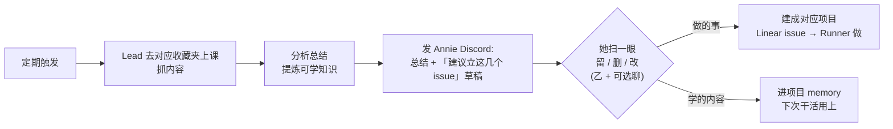

# Exploration: 小红书收藏夹定期"上课" — Lead 抓收藏夹→分析→沉淀可学知识(global skill) — FLY-222

**Issue**: FLY-222（小红书收藏夹定期"上课"，global skill）
**Date**: 2026-06-05
**Status**: Complete（与 Annie brainstorm 3 轮，方向全锁定，转 research）
**关联**: FLY-214/FLY-216（flyview-skills 能力库 = 本 skill 的家）、FLY-205（per-project config + 文档流程模式）、FLY-213（video-watch，Gemini 处理视频的现成住户）、GEO-288（Daily Standup cron，定时 spawn 的现成模式）

---

## 0. 一句话

不同领域的 Lead **定期**去 Annie 对应领域的小红书收藏夹"上课"：抓内容 → 分析总结 → **发她一份"我建议立这几个 issue"的草稿** → 她扫一眼勾选（默认轻量，可选展开聊）→ 「要做的事」建成**对应项目的 Linear issue**（接现有 issue→Runner 流水线）、「学的内容」**进项目 memory**。像同事定期上课回来、把学到的转化成能执行的待办。

---

## 1. 架构（已settled，不重议 —— 工厂 vs 仓库）

| 干什么 | repo | 内容 |
|------|------|------|
| **造 skill**（怎么抓+分析+沉淀的 SKILL.md + 脚本） | **flyview-skills**（GitHub `xrliAnnie/flywheel-skills`，被动库） | 写一次通用，所有 project 装上能用 |
| **接定时执行 + per-project 参数** | **flywheel**（主仓，编排层） | 排程 + 配置 wiring + spawn Runner |
| 产出落地 | 各项目 Linear backlog + per-project memory | 做的事→issue；学的事→memory |

- skill 通用，**参数（哪个 Lead 抓哪个收藏夹、频率）从调用它的项目上下文读**（per-project config）。
- flyview-skills 保持**被动库**，不做成第二个 Discord 服务。
- 技术可行性已确认：小红书有现成 MCP（`xiaohongshu-mcp`：`list_collections` / `get_collection_content` / `get_feed_detail` / `list_saved_content`），本机已登录。

---

## 2. 体验方向（Annie brainstorm 3 轮锁定）

### 2.1 核心闭环（R1）

不是"发笔记"也不是"默默变聪明"，而是一个**主动闭环**：

**核心原则:学到的东西要变成能执行的待办,不只是"知道"。**

### 2.2 讨论方式 = 乙（提稿+勾选）+ 可选聊（R2 锁定）

- **默认 = 乙**:Lead 把总结 + "我建议立这几个 issue"的草稿一起发 Annie,她只需扫一眼:留哪几条、删哪几条、改两句。**不用她从零想**。
- **可选聊**:留一个口子 —— 她有额外想法 / 想就某条展开 / 加 Lead 没想到的方向时,可以一起聊。
- **设计意图**:默认不占她时间(贴北极星"敢离开屏幕、别当注意力黑洞"),但不剥夺她深度参与的能力。
- **草稿交付时序**:发 Discord → **等她勾完再正式建 issue**(不是先建一堆草稿态等她哪天去 Linear 删)。贴"扫一眼留/删/改"。

### 2.3 产出落地(R3 锁定)

- **「要做的事」→ 立成对应项目自己的 Linear project 的 issue**。Annie 原话:"我们每个项目不是都有它自己的 Linear project 吗?到时候我们就把它 create 成 Linear 的项目 issue"。→ sub 的活进 sub 的 Linear project,Runner 接着做。**接现有流水线,不另起一套。**
- **「学习的产出」→ 直接进项目**(不强求立 issue)。Annie:"像一些学习的产出,就直接放在项目里面"。→ 进**项目 memory / 知识沉淀**。学的事**不必**变成 Linear issue 让她"看见";进项目记忆即可。

### 2.4 频率 = per-project configuration(R3 锁定)

- **不是固定默认,每个项目自己配频率**。Annie:"我相信每个项目会不太一样,所以要做一个 configuration"。
- 拟:每周一次/收藏夹 是个**起点参考值**,但重点落在**可配置**(sub 多久、joycon 多久各自定),per-project 一份 config。

### 2.5 增量阅读(R1 Annie 主动提)

- **记阅读进度**:记上次看到哪,**只看上次位置→新增的内容**,已看过的不重复学。
- 避免每次重复学已学过的;抓多少也要有度。

### 2.6 内容处理:图文 + 视频(R1 Annie 重点关注)

- **图文**:没问题(MCP 直接拿文字)。
- **视频**:Annie 比较在意 —— Lead 能不能看/下视频?
  - Claude 本身不处理视频 → 可能搞一个 **Gemini skill 去 process 视频** → Claude 再从总结里取信息。
  - **或**:用现成的 **summarization skill**(`@steipete/summarize` / `summarize` CLI,能 summarize URL/视频)可能更简单。
  - 不重造轮子:`video-watch` skill + `gemini-video`/gemini CLI 是现成的 Gemini 视频能力。

---

## 3. 锁定清单(交给 research 的输入)

| 维度 | 锁定结论 |
|------|---------|
| 体验闭环 | 学 → 总结 → 发 Discord 提 issue 草稿 → 她勾(乙+可选聊)→ 做的事建项目 Linear issue、学的事进项目 memory |
| 讨论方式 | 乙(提稿+勾选)为主 + 可选聊;草稿发 Discord 等勾完再建 |
| 产出落地 | 做的事 → 对应项目 Linear project issue(接现有流水线);学的事 → 项目 memory |
| 频率 | per-project config(可配,非固定) |
| 增量 | 记阅读进度,只看新增 |
| 内容 | 图文直取;视频走 Gemini/现成 summarize skill 处理后喂 Claude |
| 架构 | skill 在 flyview-skills 库;执行/排程/参数在 flywheel;产出进项目 Linear + memory |

---

## 4. 转 research —— 待查清单

1. **现成 skill 覆盖度**:`summarize` skill / `video-watch` / gemini 能不能覆盖"小红书图文+视频 → 可学知识"?小红书 MCP `get_feed_detail` 返回哪些字段(文字/图/视频 URL)?视频拿得到可下载 URL 吗?
2. **小红书 MCP 增量/进度**:`get_collection_content` 是否支持分页/游标?feed 用什么做唯一标识?进度怎么记(存 last-seen feed id per collection)?
3. **per-project config 放哪、Runner 怎么读**:flywheel 现有 config 体系(projects.json / flywheel-config)在哪?Runner 启动时怎么拿到本项目参数?参照 FLY-205 doc-flow 的 config 模式。
4. **定时 spawn 机制**:flywheel 怎么定时 spawn Runner?GEO-288 Daily Standup cron 是现成模式吗?有没有通用"scheduled task → spawn Runner"?
5. **"issue 草稿发 Discord 等勾"交互怎么落**:复用现有 gate/checkpoint(FLY-47)+ `flywheel-comm ask` + create-issue?Lead 怎么把草稿发 Annie 并接住她的勾选?
6. **学的事进 memory**:per-project memory(GEO-145/203,Supabase pgvector + mem0)怎么写入?Lead/Runner 哪个写?

---

## 下一步

- [x] brainstorm ≥3 轮(经 team-lead),方向全锁定
- [ ] research(`doc/engineer/research/new/FLY-222-*.md`):上面 6 项待查
- [ ] plan(codex-design-review)→ 横跨 flyview-skills(写 skill)+ flywheel(接排程/config/交互)实现
