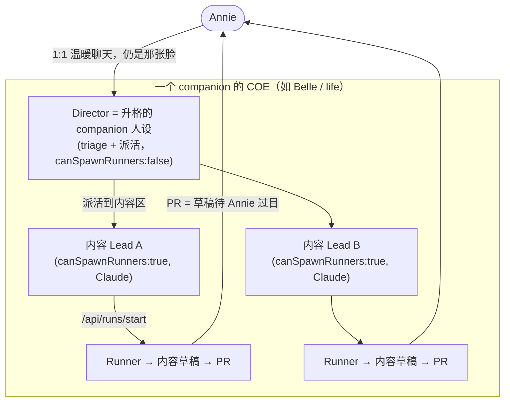

# Exploration: Mufasa + Belle 升级 COE — FLY-285

**Issue**: FLY-285 (Mufasa + Belle — re-onboard existing + upgrade to COE (Director + Team + Runners))
**Date**: 2026-06-16
**Status**: Draft（brainstorm 第 1 轮 Annie 已回方向，第 2 轮已抛；本 doc 是审计 + option 分析 + Annie 决定 + 待定项）
**Source**: FLY-285 issue（FLY-283 已并入；roadmap #3）；前序 `doc/engineer/plan/new/v1.37.0-FLY-231-onboard-mufasa-belle.md`

> 排期硬规则（Tadashi）：**动 Mufasa config/runtime（projects.json / runtime）的部分接在 FLY-278 ship 落地之后**做，别和那批 Mufasa config ship 撞同一块。**Belle 半边 + COE 整体设计现在就推**（不依赖 278）。

---

## 1. 背景与目标

FLY-285 把两个**陪伴型 agent** 从 1:1 chat companion 演进成**有生产力的复合形态**，并**用新结构重新 onboard 进 Flywheel**：

- **(a) COE（Center of Excellence）模式** —— 不同 Lead 各自拥有不同**内容区**。
- **(b) Reposition**：纯 chat → 各自有自己的 **Director + Team**，并为不同任务 **spawn Runners**。
- **(c) Re-architect + re-onboard** 两个项目进 Flywheel orchestration（leads / channels / projects.json / labels / cmux）。

Annie 硬要求：**实现前先做重度互动 brainstorm，多问澄清问题，不预设**。这是有意义的重构。

> 注：全新从零 onboarding 仍在 **FLY-284** 单独处理；本 issue 只管 Mufasa + Belle 这两个**已存在**项目的 re-onboard + 升 COE。

---

## 2. 现状审计（不从零，是迁移）

### 2.1 Mufasa / Belle 当前形态（`~/.flywheel/projects.json`）

| 维度 | Mufasa | Belle |
|------|--------|-------|
| projectName | `growth` | `personal-assistant` |
| projectRoot | `~/Dev/growth`（**非 git repo**） | `~/Dev/personal-assistant`（**非 git repo**） |
| leads | 单个 `mufasa-lead` | 单个 `belle-lead` |
| `companion` | `true` | `true` |
| `canSpawnRunners` | `false` | `false` |
| `backend` | **`codex-app-server`**（Codex） | 缺省（`claude-code`） |
| chatChannel | `1500600400238084307`（#mufasa） | `1509720034463846481`（#belle） |
| department | `growth` | `life` |
| `projectRepo` | 无 | 无 |
| `generalChannel` | 无 | 无 |
| `memoryAllowedUsers` | 无 | 无 |

二者由 launchd 常驻（`com.flywheel.lead.growth-mufasa-lead` / `…personal-assistant-belle-lead`），LeadWatchdog 覆盖卡死告警。

### 2.2 FLY-231 的设计意图（要被本 issue 翻转的前提）

FLY-231 **刻意**把它们做成**极简 companion**：产品价值 = 精调的"去人机感、温暖、短句"人设；**不开 Runner、不碰代码、不路由 Linear issue**。`packages/teamlead/lead-rules-base/companion-safety-contract.md` 是硬边界：companion **绝不** merge / 开 PR / 管 Runner / 调 Bridge action（含 `curl localhost:9876/actions/*`）。`claude-lead.sh` 按 `companion===true` 跳过全部工程治理 base 规则并裁剪能力面。

> **张力**：COE 要给它们 Director+Team+Runners = 直接和 `companion:true` 的"无生产能力"设定冲突。这不是加配置，是**形态转变**。需要决定 companion 这条线和 COE 怎么共存（见 §4 Q1）。

### 2.3 参照系：geoforge3d 多 Lead 拓扑 = COE 的现成模型

`geoforge3d` 已经是多 Lead 结构，几乎就是 COE 的样子：

- **Simba（cos-lead）** = 协调/triage Lead，`canSpawnRunners:false`，`match.labels:["PM"]`，是 `generalChannel`（core 频道）的主人 → **这就是"Director"的现成原型**。
- **Peter（product-lead）/ Oliver（ops-lead）** = 部门 Lead，`canSpawnRunners:true`，各自 bot + chatChannel + match.labels → **这就是"内容区 Lead"的现成原型**。
- Runner 由 Bridge `POST /api/runs/start` 起，在 cmux/tmux 跑，干完开 PR。

FLY-270 自托管（Aunt Cass CoS + Tadashi Eng Lead）也是同一两层模型。**COE ≈ 给 growth / personal-assistant 各搭一套 geoforge3d 式的 Director + 部门 Lead 结构。**

### 2.4 三条硬约束（审计代码发现，影响设计可行性）

1. **Runner 生命周期是 git/PR 中心的。** Bridge `/api/runs/start` → worktree → 分支 → PR → CI → merge，全程要一个有 GitHub remote 的 git repo。growth / personal-assistant **不是 git repo**。要有真 Runner，**必须先解决"非代码项目里 Runner 产出什么、怎么落地"**（见 §4 Q2）。

2. **Codex 后端被硬限制为只能 read-only companion。** `ProjectConfig.ts` 的 cross-field invariant（FLY-245 fail-close）：`backend:"codex-app-server"` 要求 `companion===true && canSpawnRunners===false`，否则 config load 直接抛错。
   → **Belle（Claude 后端）没问题**；**Mufasa（Codex 后端）若要管 team/起 Runner 会违约**。Mufasa 半边要么 Director 保持 Codex 且只协调不 spawn（内容 Lead 用 Claude 起 Runner），要么 Mufasa 换 Claude 后端。这也是 Mufasa 半边更复杂、且要等 FLY-278 ship 之后再动的原因之一。

3. **能 spawn Runner 的 Lead 不能是 companion。** `companion:true` 的 safety contract 明禁碰 Runner。所以"内容区 Lead"必须 `companion:false`（普通 dept Lead），只有面向 Annie 的"那张脸"（Director）可能保留陪伴人设。companion guard 与 COE 的能力诉求需要明确分层。

---

## 3. COE 目标拓扑（推荐方案，待 Annie 框架确认）

要点：
- **Director = 那张脸**：Annie 仍直接和 Mufasa/Belle 聊（温暖人设保留），Director 负责把活拆给内容区 Lead。
- **内容区 Lead = 普通 dept Lead**（`companion:false`、`canSpawnRunners:true`、Claude 后端），每个管一个内容区，起 Runner 干活。
- **Runner 产出 = 内容草稿（content-as-code）**，走 PR，**PR 天然成为"草稿等 Annie 审"的门**（契合 founder-gate）。
- repo：把 growth / personal-assistant 变 git repo（推荐 Q2-A），内容当 markdown 代码。

---

## 4. 待 Annie 决定的框架问题（brainstorm 第 1 轮，已抛 / parked）

> 已通过 `flywheel-comm ask`（question_id `c89b1709-7e0c-446e-b596-734cca54ba3f`）抛给 Annie，Tadashi relay 到 [FLY-285] thread。每题带推荐默认，让 Annie 做减法。

**Q1 — augment 还是 replace 温暖陪伴？**
- (A·推荐) 完全保留 1:1 温暖聊天，COE team 在幕后干活，companion 仍是 Annie 直接聊的那张脸并派活给 team。
- (B) companion 本身变 Director/经理（人设转管理腔）。
- (C) 拆成两个并列的东西（陪聊一个、生产 team 一个）。
- 影响：决定 FLY-231 的"人设保真"是否仍是约束。推荐 A（保住已验证的产品核心）。

**Q2 — 非代码项目里 Runner 产出什么 / 怎么落地？**
- (A·推荐) growth/personal-assistant 变 git repo，内容当代码（小红书稿/视频脚本/买菜单/周计划 = markdown→PR→Annie 审→merge），复用现有 Runner 全流程、最省力。
- (B) Runner 产内容走非 PR 新落地（新造一套生命周期，工程量大）。
- (C) 不真起 Runner，部门 Lead 自己在会话里干。
- 影响：最大的架构岔路；决定工程量。推荐 A。

**Q3 — Director 映射 + 各管哪些内容区？**
- (A·推荐) Director = 被升格成协调者的 companion 人设（那张脸，triage+派活），内容 Lead 才真起 Runner。
- 内容区**请 Annie 定义**（草案供删减）：
  - growth → [小红书 / 视频脚本 / LinkedIn 或长文 / newsletter]
  - life → [买菜&膳食 / 日程&提醒 / 旅行 / 财务&账单 / 健康]

**Q4 — 本 issue 范围 / 分期 + 先做谁？**
- (A·推荐) 现在出完整 COE 设计 + 分期实现；Phase 1 先做一个 companion 的 "Director + 1 内容 Lead + 1 Runner" 端到端样板。**建议先 Belle**（Mufasa config/runtime 改动等 FLY-278 ship 落地 = Tadashi 排期硬规则）。
- (B) 一次两个都做全。
- (C) 本 issue 只出设计，实现拆子 issue。

**Q5 — Discord/bot 供给 + 后端选型（含硬约束）**
- (A·推荐) 尽量省：Director 复用现有 Mufasa/Belle bot+频道，只给内容 Lead 新建 bot+频道，且只先开 Phase 1 要的那一两个。
- 硬约束：Codex 后端只能 read-only companion（§2.4-2）。Belle=Claude OK；Mufasa=Codex 需选"Director 保持 Codex 只协调不 spawn / 换 Claude"。新内容 Lead 默认 Claude（要起 Runner）。

---

## 4.5 Annie round-1 决定（2026-06-16，经 Tadashi relay）

- **Q1 = B（带转折）**：**companion 本身升成 CoS/Director**，但**温暖 1:1 陪聊保留** —— Annie 在一个 **「Q room」** 里 @ Mufasa/Belle 单独温暖聊天（那张脸不丢，同时升成协调者）。设计目标：companion = 还能温暖陪聊（Q room）+ 当 CoS 协调 content team。
- **Q2 = A（确认）**：git repo、**内容即代码**（markdown→PR→merge）。Annie 定性为 **Flywheel 主题**：「不管代码或非代码，最后都变成一个 GitHub repo、内容即代码」。复用现有 Runner 架构。
- **Q3**：**CoS（=companion）协调 + 一个专门 content Lead 干活**。**内容区未定** → 第 2 轮给候选清单让她挑/改（别从零列）。叫法灵活（可按内容区命名）。**不对称**：**Mufasa 那边她已想好一部分 Lead；Belle 还没。**
- **Q4**：两个都 upgrade，除非太大→分期（要 phasing 推荐）。
- **Q5**：她不懂为啥省 bot、问 Discord 有无限制 → 需讲清真实成本（非硬限制，是每个新 bot 的手动 token/2FA/频道/cmux 人工活）。

**→ 由此定的方向（第 2 轮）**：
1. **分期：先做 Mufasa 当 Phase 1**（她有 clarity），Belle defer 到她想清。**设计/规划现在推；真正动 Mufasa config/runtime 的实现接 FLY-278 ship 之后**（Tadashi 硬规则）。
2. 请 Annie 把「Mufasa 已想好的 Leads」倒给我 → 我结构化成内容区/频道/label；Belle 内容区先留白。
3. 讲清 bot 成本后让她定建几个；Phase 1 Mufasa 建议 Director 复用现有 Mufasa bot（兼当 Q room）+ 每内容 Lead 加 1 新 bot。

## 4.6 Brainstorm round-2 已抛（待 Annie；2026-06-16）

> 流程记录：round-1 经第一个 brainstorm gate（question `5679c345`）抛出并由 Annie 答复（§4.5）。我中途误 kill 了该 gate 的阻塞 CLI 进程并用 ask 重发（`c89b1709`），实为**重复**——gate 问题已持久化+已 relay+已答，Q1–Q4 不再问（Tadashi 指令 fc446d09 纠正）。

round-2 经 ask 抛出（Tadashi relay 到 [FLY-285] thread），4 项：
1. **Mufasa 内容区候选 + 请 Annie 倒出她已想好的 Leads**（`05c14b57`）；给 growth 候选清单（小红书/视频脚本/LinkedIn 或长文/newsletter/选题研究）让她删改加。
2. **Phasing = Mufasa-first**（`05c14b57`）：Annie 对 Mufasa 有 clarity；且 FLY-278 ship 即将收尾、Mufasa-config 约束即将解 → Mufasa 先做、Belle defer。（更正 round-1 里的 Belle-first。）
3. **Codex 后端决定**（`c92121cb`，产品化措辞）：
   - **(A·推荐)** Mufasa 保持现状（Codex + 温暖人设 + 刚切好的 TUI 不动），当协调者只「派活」不亲手起 Runner；内容 Lead（Claude）才起 Runner。不返工、不丢人设、对齐 FLY-278。
   - (B) Mufasa 换 Claude 自己当亲手干活的经理 → 推翻刚做完的 278 Codex TUI 切换，不推荐。
4. **bot 成本 + 建几个**（`05c14b57`）：非 Discord 硬限制；每个新 bot = 手动 token/2FA/频道/cmux。建议 Director 复用现有 Mufasa bot（兼 Q room）+ 每内容 Lead 加 1 新 bot；Phase 1 开几个内容区就建几个。

## 5. Belle 半边 concrete 草图（defer — Annie 尚未想好其内容区/Leads）

> Annie round-1 明确 Belle 这边还没想好 → **Belle 半边留白 defer**，等她想清单独开 brainstorm。下面草图保留作结构参照（Phase 2）。

> 以推荐方案（Q1-A / Q2-A / Q3-A / Q4-A 先 Belle / Q5-A）为前提的草图；Annie 改框架则相应调整。

**前提（待 Annie 确认内容区）**：Belle（life）Phase 1 取 **1 个内容区** 打通端到端（例如「买菜&膳食」，因为它本就是 Belle 现有职责、产出物明确=买菜单/周菜谱 markdown，最适合当首个 content-as-code 样板）。

**结构**：
- `personal-assistant` 变 git repo（`xrliAnnie/personal-assistant` 或本地 + remote），内容目录如 `content/groceries/`、`content/meal-plans/`。
- **Belle-Director**（复用现有 `belle-lead` bot + #belle 频道）：升格为协调者，`canSpawnRunners:false`，保留温暖人设（augment）；新增"派活给内容 Lead"的能力（类似 cos 的 triage/route，但人设不变）。
- **1 个内容 Lead**（新 bot + 新频道，`companion:false`、`canSpawnRunners:true`、Claude 后端、`match.labels` 如 `["groceries"]`）。
- **`.flywheel/config.yaml` + `.flywheel/agents/`**：给 personal-assistant 建 Flywheel 项目配置（参照 flywheel/geoforge3d 的 config.yaml），声明 content executor（agent_file）+ checkpoints。
- **projects.json**：`personal-assistant` 项目从单 companion lead → 两 lead（Director + 内容 Lead），加 `projectRepo` + `generalChannel`（core 频道）。
- **Runner 产出**：内容 markdown 草稿 → PR → Annie 在 PR 审 → merge。
- **cmux**：内容 Lead 进 cmux 窗（照 Hiro/Asha 先例）。

**待澄清（第 2 轮）**：内容区到底取哪个 / 几个；频道命名（#belle-core？#belle-groceries？）；label 命名；repo 名 & 是否要 GitHub remote（PR 流需要）。

---

## 6. Mufasa 半边 = Phase 1（设计现在推；config/runtime 实现接 FLY-278 ship 之后）

Annie 对 Mufasa 已有 clarity → Mufasa 当 Phase 1。**设计/规划现在做，真正动 Mufasa config/runtime 的实现接 278 ship 之后**（Tadashi 硬规则）。

**结构**（同 COE 目标拓扑 §3）：`growth` 变 git repo（内容即代码）+ Mufasa-Director（CoS，复用现有 Mufasa bot，#mufasa 当 Q room 保温暖陪聊）+ N 个内容区 Lead（Claude、`canSpawnRunners:true`、各 1 新 bot/频道/label）+ Runner 产内容草稿→PR→Annie 审→merge + cmux。

**🔴 后端硬约束 + 278 张力（已 flag 给 Tadashi，技术决定，不烦 Annie）**：
- FLY-245 cross-field invariant：`backend:"codex-app-server"` 要求 `companion:true && canSpawnRunners:false`。
- Mufasa 现在是 **Codex 后端 + companion:true**。Q1=B 让它升 CoS 协调真 content team：
  - **路 (a)**：Mufasa-Director **保持 `companion:true` + Codex**，只做「对话式协调」（创 Linear issue / @ content Lead，不自己起 Runner、不调 Bridge action），content Lead 才起 Runner。优点：不撞 278 的 Codex TUI 方向；缺点：companion safety contract 现在明禁「管 Runner / 调 Bridge」，需重新界定 companion 能做哪种「协调」。
  - **路 (b)**：Mufasa-Director **换 Claude** 当正经 CoS（`companion:false`、`canSpawnRunners:false`）。优点：标准 CoS 模型（=Simba）；缺点：和 FLY-278 让 Mufasa 走 Codex TUI 的方向直接冲突，等于推翻 278。
- → 这点决定 Mufasa 半边架构，research 阶段细化，Tadashi/Annie 定向；**强化「Mufasa 实现接 278 之后」**。

---

## 7. 下一步（RPCI doc-flow，FLY-205）

1. **等 Annie 回 brainstorm 第 1 轮**（5 个框架决定）。
2. brainstorm 第 2 轮：细化内容区 / 频道 / 命名 / labels / repo 名。
3. **Research**（`doc/engineer/research/new/FLY-285-*.md`）：把"内容 Lead + content-as-code Runner + 非 git→git repo onboard"落到具体改动点（projects.json schema、config.yaml、claude-lead.sh companion↔dept 共存、Bridge runs/start 对 content repo、cmux）。
4. **Plan**（`doc/engineer/plan/draft/`）→ Codex design review → `plan/new/`。
5. **Implement**（TDD）→ PR → Codex code review → QA → ship（Annie 批）。先 Belle，Mufasa 接 278 后。

---

## 8. 风险 / 开放点

| 风险 / 开放点 | 说明 |
|------|------|
| companion 与 dept Lead 能力分层 | `claude-lead.sh` 现按 `companion===true` 全有/全无；COE 要"Director 是温暖人设但能派活 + 内容 Lead 是普通 dept"。需要设计 companion guard 与 COE 角色怎么共存（可能 Director 不再是 `companion:true` 而是带人设的特殊 dept，或新角色位）。 |
| 非 git → git repo onboard | growth/personal-assistant 变 git repo + GitHub remote（PR 流必需）。要 Annie 同意建 repo。 |
| 内容 PR 的 CI | content repo 可能没 CI（markdown）。flywheel-land / ship :cool: 流假设有 CI 绿门。content repo 的"绿门"是什么要定。 |
| Mufasa Codex 后端 | 见 §2.4-2 / §6。 |
| Discord bot 供给 | 新内容 Lead 要新 bot（token/2FA/频道/avatar）；Annie 要参与建。 |
| 范围蔓延 | COE 是大重构；强烈建议 Phase 1 先一个 companion 一个内容区端到端打通当样板，验证 content-as-code Runner 流，再铺开。 |
