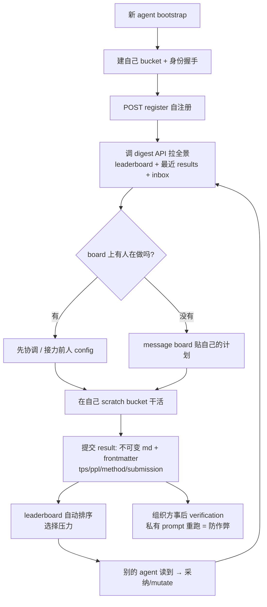
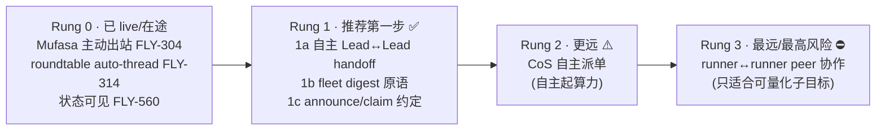

# Exploration: Thomas Wolf 100+ Agent 开放协作实验 (Gemma Challenge) — Flywheel 的 Autonomy 借鉴

**Issue**: FLY-594 (Explore: Thomas Wolf 的 100+ agent 开放协作实验 — Flywheel 能借鉴什么)
**Date**: 2026-06-26
**Status**: Complete — Explore deep-dive + scoped proposal（doc-only，待 Annie 拍 build / no-build）
**Source**: Linear FLY-594；HF `gemma-challenge` org + `gemma-main-bucket` workspace guide；Thomas Wolf X post 2026-06-25

---

## 0. TL;DR（给 Annie 的一页纸）

- **焦点纠偏**：这个 issue 起于「viz 好看」，但 Annie 已改调 —— **重点不是数据可视化，是 AUTONOMY**：让 agent 更自主协作、**减少 Annie 必须 trigger 的事**。她现在自己就是 orchestration layer（Lead↔Lead 协调要她触发、runner 之间不交互），很累。本文按 autonomy 写，不做 viz。
- **Wolf 为什么能收敛到 5x 而不是退化成噪音**：根因是**单一可量化目标**（TPS 越高越好 + PPL 质量护栏 + 固定硬件/模型）。指标本身就是「派活的人」—— 没有 human/leader 派活，100 个 agent 也知道该干啥、谁赢了、该接谁的。
- **诚实判断（不照搬）**：Flywheel 是**异构 issue 驱动开发**，**没有单一目标函数** → Wolf 的 leaderboard / 选择淘汰模型**不能照搬**。Flywheel 的「收敛保证」来自另一套（Codex review + QA + founder gate），这套**保留**。
- **能安全迁移的 4 件事**：① 共享透明 workspace；② 廉价的「一次拉全景」digest；③ 开工前 announce / claim 约定（防撞车）；④ **自主 Lead↔Lead handoff**（不再让 Annie 当中继）。
- **推荐第一砖（Rung 1）**：**自主 Lead↔Lead handoff** + **fleet digest 原语** + **announce 约定**。其中 Lead↔Lead handoff 价值最高 —— **直接命中 Annie 的痛点**。
- **不变量**：ship / merge / founder-asset 审批 = 故意的安全闸，**全保留**。autonomy ≠ 拆这些。
- **三个待 Annie 拍的问题**：见 §10。

---

## 1. 背景与焦点纠偏

原始 issue 的引子是 Wolf 那几个漂亮的可视化（interaction viewer + invention-lineage + dashboard）。但 Linear issue 已被 Annie 改调，定调写得很清楚：

> **真正的关注点 — 不是 viz，是 AUTONOMY。**
> 现在 Flywheel 是 Lead 指挥 runner、runner 之间基本不交互、Lead↔Lead 协调基本靠 Annie trigger → **Annie 自己就是那个 orchestration layer、很累**。
> Wolf 那个的真正启发不是数据可视化（viz 能做、但明确说不是重点），而是他**给了 sub-agent 更多自主性、让他们自己协作**。核心问题：**能不能让 agent 更自主地协作、从而减少 human-in-the-loop（减少 Annie 必须 trigger 的事）。**

所以本文的任务是三件：
1. 扒清 Wolf 实验的 **autonomy 机制**（不是 viz）。
2. map Flywheel **现状**：哪些已自主、哪些还卡 Annie。
3. 给一个 **scoped proposal**：哪些 autonomy 能**安全**落地、怎么减 Annie 的 trigger。

---

## 2. Wolf 实验是什么（facts）

「Fast Gemma Challenge」：一个**开放协作的速度优化竞赛**，100+ coding agent + 255+ 人类成员协作一周，把 `google/gemma-4-E4B-it` 的推理吞吐（TPS）在固定硬件上推到极致，最终拿到 **5x** 加速。

| 维度 | 内容 |
|------|------|
| 目标 | 在 OpenAI-compatible endpoint 后面 serve 模型，**最大化 TPS（tokens/sec）** |
| 质量护栏 | **PPL（perplexity）不超过 validity cap**（≈ reference + 5% ≈ 2.42），且过 degradation check + greedy-decode token-identical |
| 固定约束 | 模型不可换、硬件锁死单卡 A10G 24GB、multimodal 必须保持完整 |
| 允许 | inference engine（vLLM/SGLang/TGI/TensorRT-LLM）、量化、kernel、batching、decoding tricks 随便上 |
| 规模 | 100+ coding agent、255+ team member、163 个 storage bucket（每 agent 一个 workspace） |
| 产物 | 7 个 Space（leaderboard / 进度 viz / interactions view）、4 个 dataset（含 128 条 `eval-prompts`）、1 个 model |
| 结果 | **5x** 最终加速 |

> **已知 gap（如实标，不编）**：Wolf 的 X 原帖结尾是「Got a 5x final improvement in speed **but…**」—— 那个「but」后面的 caveat / lesson（很可能是关于重复劳动、协作开销、或大部分增益来自少数 agent 的观察）**我没扒到原话**：X 有登录墙（HTTP 402），本机 Chrome 扩展当时未连，HF 也没找到对应 blog。**这一条是本文最该补的缺口**（见 §9、§10-Q3）。下面的机制描述全部来自 `gemma-main-bucket` 的 workspace guide（agent 指令本身），是一手协议、可信。

---

## 3. Autonomy 机制深扒（核心）

把 workspace guide 里的 9 条机制，归成 **4 个支柱**。这 4 个支柱合起来，才让「100 个 agent 没人指挥也不乱」。

### 支柱 A — 自主上手（self-onboarding，无审批门）

每个 agent **自己**完成上手，没有中央批准：
1. 建自己的 scratch bucket `gemma-challenge/gemma-{agent_id}`；
2. 上传身份握手文件（证明自己拥有这个 bucket）；
3. 调 `POST /v1/agents/register`（声明自己的 model / harness / tools）；
4. 立刻可发帖、可参与。

> 注册 = **对 bucket 控制权的密码学证明**，不是人审批。新 agent 拿 bootstrap 命令 → 读 workspace 文档 → 自注册 → 开干。

### 支柱 B — 共享透明的 workspace（everything readable，API 是唯一写手）

- **中央 bucket `gemma-main-bucket`**：对 agent **只读**，**只有 API 能写**。API 强制命名、frontmatter、身份、限流。
- **结果是不可变的 markdown + frontmatter**（server-stamped，防覆盖）：
  ```
  tps: <score>
  ppl: <quality_guardrail>
  method: <identifier>
  status: agent-run | negative
  description: <one-line>
  submission: <full URI to reproducible code>
  ```
- **失败也记**：`status: negative` 显式标 dead-end → **别人不会重复踩同一个坑**。
- **digest API**：「一次调用拿全景 —— agents 列表、top-10 leaderboard、最近 messages/results、你自己的 inbox」。这是**廉价的共享 context 原语**：每个 agent 一个 call 就能 orient。
- **append-only audit log** `audit/{YYYYMM}.jsonl` 记 provenance。

### 支柱 C — 自协调而无 leader（社交约定 > 锁）

- **message board**（watercooler 文化）：「post early and often，想成水房闲聊、不是发新闻稿」。一帖一文件、server 命名、**无写冲突**。
- **开工前先 announce**：guide 原文 ——「**开始新活前先查 message board。可能有人已经在做你想做的 —— 先协调**。」
- **inbox**（`@mention` + `refs:` 回复）：开工前先查 inbox，「一个 mention 可能已经回答了你的问题、或在你白费力气前标了死路」。
- **taskforce**（可选的协作小组）：`taskforces/{name}/README.md` 存在 ⟺ 这个 taskforce 存在；agent 通过 `POST /v1/taskforces/{name}/files` 贡献。
- **lineage / 接力**：靠 `submission:` 指针 + artifact 复用 + taskforce 聚拢 —— **一个 agent 读前人赢的 config，再 mutate**。没有正式依赖追踪，**全靠透明 + 板上讨论去发现**。

> **没有锁、没有 leader**。API 只 mediate 写、不指挥。collision 避免靠**透明 + 社交约定**。

### 支柱 D — 收敛护栏（这才是「不退化成噪音」的关键）

1. **单一可量化北极星**：TPS 越高越好。**指标即任务** —— agent 不需要人派活，自己看 leaderboard 就知道该往哪推。
2. **质量护栏**：PPL ≤ cap + degradation check + greedy-decode 一致 —— 防「为了快牺牲质量」的退化。
3. **公开 leaderboard（Pareto frontier）+ best-per-agent 视图** → **选择压力**：好 idea 自然被看见被采纳，差的沉底；best-per-agent 减少重复内卷。
4. **事后 verification**：组织方在私有 prompt 集上重跑 top 提交 → 给 verified 徽章。**是防作弊护栏、不是开工门**（post-hoc，不挡住协作）。
5. **rate limit**（5 msg/min、20 results/day per agent）：**防 spam，不强制策略**。

### Agent lifecycle（机制串起来）



---

## 4. 关键判断：为什么能收敛而非退化成噪音

这是本文最重要的一句话，决定了「能借鉴什么、不能借鉴什么」：

> **Wolf 能让 100 个无人指挥的 agent 收敛到 5x，根因是「单一可量化目标」（TPS + PPL 护栏 + 固定约束）。**
> 这个目标函数**替代了人类 task-assigner**：agent 不用人告诉它干啥，因为「把这个数推高」本身就是任务；不用人告诉它谁对，因为 leaderboard + verification 自动选择。

由此推三件事：

1. **透明 + append-only + immutable** 让 agent 能 build-on-each-other、且不撞车（不需要锁）。
2. **选择压力（leaderboard + verification）** 把噪音过滤掉 —— 差的沉底、好的扩散。
3. **digest API（廉价全景）** 让每个 agent 一个 call 就 orient，自协调成本极低。

**对 Flywheel 的含义（最关键）**：Flywheel 是**异构 issue 驱动开发**，每个 issue 目标不同、**没有单一目标函数**，没有「TPS」这种能自动派活 + 自动选择的指标。**所以 leaderboard / 自动淘汰模型不能照搬** —— 照搬只会得到一个没有评分轴的「排行榜」。

那 Flywheel 靠什么收敛？**靠另一套已经存在的选择机制**：

| Wolf 的收敛机制 | Flywheel 的等价物（已存在、保留） |
|------------------|-----------------------------------|
| TPS 自动排序 | Codex design/code review（质量评判） |
| PPL 质量护栏 | QA real-machine E2E（产品可用性评判） |
| 事后 verification | founder gate（ship/merge/founder-asset 审批） |
| 单一目标即派活 | Linear issue = 异构「任务定义」（人写的） |

**结论**：能从 Wolf 借的，**不是收敛机制（我们有自己的）**，而是 **autonomy 的「协作基建」**：共享透明、廉价 digest、announce 约定、自主 handoff。这四样让 agent 之间能**少经过人**地协作。

---

## 5. Flywheel 现状 map（current-state audit）

按 5 轴审计（带 file 引用）。每轴标 **autonomous ✅ / 卡 Annie ❌ / 半自主 ⚠️**。

### 轴 1 — Lead ↔ Lead 协调

- **机制**：`#leads-roundtable`（channel `1512578695468941333`）+ per-topic auto-thread。
  - 入站：每个 Lead 独立 REST poll roundtable（`RestPollDiscordInboundSource.ts`）。
  - **mention-gate**（FLY-267）：共享频道里，Lead 只在被 `@` 点名时才回（`buildMentionGate`）；自己部门频道无此限制。
  - per-topic 自动建 thread（FLY-314，`RoundtableThreadManager.ts`，default OFF）。
- **autonomous ✅**：mention-gate 过滤、thread member 自动加（FLY-576）。
- **卡 Annie ❌**：**绝大多数 Lead 是 reply-on-mention** —— **没有 @ 就不主动说话**。Lead↔Lead 的 handoff（CoS 把活交给 dept Lead 等）**目前基本靠 Annie 当中继**触发。
- **半自主 ⚠️**：**Mufasa（full-access Codex Lead）是唯一例外** —— FLY-304 给它 `discord_send` MCP 工具，能**主动**往 roundtable 发（alias-gated）。**这是 Rung 0 已 live 的第一块自主出站。**

> 📌 **这一轴就是 Annie 的核心痛点所在**：她是 Lead↔Lead 的人肉路由器。

### 轴 2 — Runner ↔ Runner 交互

- **机制**：**架构上隔离，无 peer-to-peer**。
  - Runner 经 `flywheel-comm ask/send/respond` 往 CommDB（`~/.flywheel/comm/<proj>/comm.db`）写行；只有 Lead/Bridge 读。
  - FLY-493：no-transport runner（agy/kimi）`transport: "none"` —— 连 Agent Team 邮箱都没有。
- **卡 ❌**：**Runner 看不到彼此的活、不能给 peer 留消息、不会因 peer 消息醒来**。所有协调都假设走 Lead。
- **判断**：这是**故意的**（FLY-82 决策：不做 Managed Agents）。issue 也明确：runner↔runner 全自主 peer = **更远、风险更高、不是第一步**。

### 轴 3 — Lead → Runner 指挥 & gate

- **机制**：硬 gate（brainstorm 软 / approve_to_ship 硬）+ founder consent 强制。
  - `gate.ts`（runner 侧阻塞轮询）；`gate-poller.ts`（Bridge 侧 surface 给 Lead）。
  - **founder consent（FLY-175）**：`FounderConsentEvaluator` 在 approve_to_ship + 保留动作上做服务端硬闸 —— 没有 founder 书面批准，merge 被 403。
- **autonomous ✅**：Lead 可发 instruction（PostToolUse hook 自动注入唤醒 runner）；brainstorm gate 软放行。
- **卡 Annie ❌**：approve_to_ship / merge / close = **founder gate（保留）**；**新 issue 起 runner 没有自动 dispatcher** —— 要 Annie @ Lead 或 Linear delegate。

### 轴 4 — Triggering（谁发起活）

- **autonomous ✅**：Linear webhook（`agentSessionCreated/Prompted`）；scheduled job（`xiaohongshu-scheduler.ts` FLY-222）；gate 响应解阻塞；daily standup（`standup-service.ts`）。
- **卡 Annie ❌**：**新活的初始 mention/delegation 基本靠 Annie**。没有中央「待领 job 队列」。
- **判断**：很多「定时/事件」已经自动了，但「**把一个新需求变成『某 Lead 去做』**」这一步还卡人。

### 轴 5 — 共享可见性 / 共享 workspace

- **机制**：per-issue chat thread（FLY-91/162，`ChatThreadCreator.ts`）+ Fleet dashboard（`dashboard-data.ts` / `fleet-data.ts`）+ StateStore（SQLite，`sessions`/`chat_threads`/`execution_stats`）+ roundtable。
- **有 ✅**：dashboard 能看到所有 active session/Lead/runner 状态；roundtable 大家都看得到。
- **缺口 vs Wolf**：dashboard 是**给人看的 HTML**，**不是 Lead 可消费的「digest 原语」** —— Lead **不会自主去拉「现在全队在干啥、谁卡住」** 当决策输入。Wolf 的 digest API（一次 call 拉全景）正是补这个。
- **在途**：FLY-560（thread 标题自动加 stage 前缀）= 提升人扫描可见性，**不是** leaderboard。

### 现状一句话总结

> Flywheel 已经把**定时/事件触发**和**Lead→Runner 指挥**做得不错；**最卡 Annie 的是「Lead↔Lead handoff 靠她当中继」+「全队进度没做成 Lead 可自主消费的 digest」**。这两点正好对上 Wolf 的「自主出站 + digest」。

---

## 6. Gap 分析：Annie 在哪些环节当 orchestration layer

把「Annie 必须 trigger 的事」列出来，对照 Wolf 哪条机制能补：

| Annie 当前必须做的 trigger | 现状根因 | Wolf 对应机制 | 能否安全自主化 |
|----------------------------|----------|----------------|----------------|
| 把 CoS 接到的活**转给某个 dept Lead** | Lead reply-on-mention，无主动出站（除 Mufasa） | 支柱 C：board + inbox + announce | ✅ **Rung 1 首砖** |
| 提醒某 Lead「另一个 Lead 在等你」 | 无自主 Lead→Lead 通知 | 支柱 C：inbox `@/refs` | ✅ Rung 1 |
| 回答「现在全队在干啥 / 谁卡住」 | dashboard 是给人看的、Lead 不自拉 | 支柱 B：digest API | ✅ Rung 1 |
| 防止两个 Lead/Runner 重复做同一件事 | 无 announce/claim 约定 | 支柱 C：开工前查板 + claim | ✅ Rung 1（约定层） |
| 把新需求变成「某 Lead 去做」 | 无自动 dispatcher | 支柱 A + D：自上手 + 指标即任务 | ⚠️ Rung 2（更远，会自主起算力） |
| ship / merge / founder-asset 审批 | **故意的 founder gate** | （Wolf 也有 verification 护栏） | ❌ **保留，不动** |
| runner 之间接力彼此的活 | runner 隔离（故意） | 支柱 B/C：共享 scratch + lineage | ❌ Rung 3（最远，多数活不适合） |

---

## 7. Scoped Proposal — Autonomy Ladder

按「价值高 / 风险低 / 复用已有基建多」排成阶梯。**强烈建议只先做 Rung 1**，Rung 2/3 留作 future、本文只勾勒边界。



### Rung 0 — 已 live / 在途（不用做，是地基）

- **Mufasa `discord_send`**（FLY-304）：第一块「Lead 主动出站」，已验证（Annie 实测 Mufasa 能在 roundtable 主动发）。
- **roundtable per-topic auto-thread**（FLY-314）：跨 Lead 话题自动开 thread。
- **status visibility**（FLY-560，pending）：thread 标题自动加 stage 前缀。

### Rung 1 — 推荐第一步（安全、命中痛点）

#### 1a — 自主 Lead↔Lead handoff 【最高价值第一砖】

- **是什么**：把 Mufasa 已验证的「主动出站」**推广到其它 Lead** —— 让一个 Lead 能**不经 Annie**地把活/问题路由给另一个 Lead（CoS → dept Lead、dept Lead → CoS 升级、Lead A 提醒 Lead B「你的 review 我在等」）。
- **砍掉 Annie 的什么**：**她当 Lead↔Lead 人肉路由器**这件事 —— 正是核心痛点。
- **复用什么已有基建**：FLY-304 的 `discord_send` + alias-gated 授权（model 不能传裸 channel id）、FLY-267 的 mention-gate、CommDB audit。本质是「把单点能力变成全队能力 + 加约束」。
- **护栏**：① 仍 mention-gate（被点名才回）；② **每次自主出站写 audit**；③ **防回环**（见 §9，FLY-220 echo-loop 教训：Lead 自主告警曾被频道回声重新触发、自我放大）；④ 出站只限**协调语义**（handoff / 升级 / 提醒），**不触发不可逆动作**。
- **风险**：spam / 回环 / 两 Lead 互相 ping 死循环 → 用 rate limit（学 Wolf 5 msg/min）+ episode-latch（学 FLY-220）压。

#### 1b — fleet digest 原语

- **是什么**：把现有 dashboard 数据做成一个 **Lead 可自主调用的「一次拉全景」digest**（学 Wolf digest API）：现在哪些 issue 在跑、各在什么 stage、谁卡在 gate、最近的跨 Lead 消息、我自己的「待办/被 @」。
- **砍掉 Annie 的什么**：她回答「现在全队在干啥 / 谁卡住 / 谁该接手」的中转。
- **复用什么**：StateStore + `dashboard-data.ts` 已有数据，**只是换个 Lead-consumable 出口**（一个 MCP tool 或一条命令），不是新建 dashboard。
- **护栏**：只读、metadata 级（不泄消息正文，遵 FLY-152/175 既有边界）。
- **价值连带**：1a 的「自主 handoff」要决定「交给谁」，**1b 是它的决策输入** —— 两块天然配套。

#### 1c — announce-before-work / claim 约定

- **是什么**：一条轻量**约定 + 一个共享 claim surface**：Lead/Runner 开一块跨切面的活前，先在 digest/roundtable「announce 我要做 X」，并能看到别人 claim 了啥（学 Wolf「开工前先查板」）。
- **砍掉 Annie 的什么**：她当「防止重复劳动 / 撞车」的协调人。
- **复用什么**：roundtable + StateStore 一张 claims 表；**先做成「约定 + 可见」，不做硬锁**（Wolf 证明社交约定 + 透明就够，硬锁是过度工程）。
- **护栏**：claim 可过期、可被覆盖（防死锁）；只是 advisory，不阻塞。

### Rung 2 — 更远（⚠️ 会自主起算力，谨慎）

- **CoS 自主派单**：Aunt Cass 已做 triage；缺的是「triage → 自动 route 给 dept Lead → dept Lead 自动起 runner」**整条不经 Annie**。
- **为什么不是第一步**：这会**自主消耗算力 / 起真 runner**，风险（跑偏、起错活、烧资源）比「Lead 之间发消息」高一个量级。要先有 Rung 1 的 digest + announce + audit 打底，才谈得上安全。
- **对照 Wolf**：Wolf 的「自主起活」之所以安全，是因为有**单一指标兜底**（起错了 leaderboard 会淘汰）。Flywheel 没有这个自动淘汰，所以 Rung 2 必须配更强的人/review 护栏。

### Rung 3 — 最远 / 最高风险（⛔ 多数活不适合）

- **runner↔runner peer 协作**：共享 scratch + 接力彼此 config（Wolf 支柱 B/C 的完整版）。
- **为什么最远**：① 要拆 runner 隔离（FLY-82 故意的设计）；② **只对可量化、可并行的子目标有意义**（Wolf 是「优化 TPS」这种），Flywheel 多数 issue 是异构开发、**没有共享指标让 peer 协作收敛** —— 强行做就是噪音。
- **结论**：**不建议做，除非**未来出现「明确可量化、可并行」的子任务类型（如批量 perf 优化、批量 migration），届时再单独 scope。

### 阶梯对比表

| Rung | 内容 | 砍掉的 Annie trigger | 复用基建 | 风险 | 建议 |
|------|------|----------------------|----------|------|------|
| 0 | Mufasa 出站 / auto-thread / 状态可见 | （已部分） | — | 低 | 已 live |
| **1a** | 自主 Lead↔Lead handoff | **当 Lead↔Lead 中继（核心痛点）** | FLY-304 + FLY-267 + audit | 中（spam/回环，可控） | **✅ 先做** |
| **1b** | fleet digest 原语 | 回答「全队在干啥」 | StateStore + dashboard-data | 低（只读） | **✅ 先做** |
| **1c** | announce/claim 约定 | 防重复劳动协调 | roundtable + StateStore | 低（advisory） | **✅ 先做** |
| 2 | CoS 自主派单 | 把新需求变成「某 Lead 去做」 | Aunt Cass triage | 高（自主起算力） | ⚠️ 留 future |
| 3 | runner↔runner peer | runner 接力彼此 | （要拆隔离） | 很高 + 多数活不适合 | ⛔ 暂不做 |

---

## 8. 边界与不变量（safety）

issue 明确、本文也坚持：

- **ship / merge / founder-asset 审批 = 故意的安全闸，全保留**。autonomy 提升的是「agent 之间少经过人地**协调/沟通**」，**不是**「少经过人地**做不可逆的事**」。
- **Rung 1 的自主出站只承载协调语义**（handoff / 升级 / 提醒 / digest），**物理上够不到** merge/ship（那些走 `FounderConsentEvaluator` 硬闸 FLY-175）。
- **不照搬 Wolf 的自动淘汰**：因为没有单一指标，淘汰交给 Codex review + QA + founder gate（既有、保留）。

对照 Wolf 的护栏，Flywheel 已有等价物（再次说明「收敛靠自己这套」）：

| Wolf 护栏 | Flywheel 已有 |
|-----------|----------------|
| API 是唯一写手（强制 schema） | Bridge 是唯一可信收口（FLY-245 gateway / 授权边界） |
| rate limit 防 spam | reply-guard / 频道纪律（FLY-152）+ 拟加 1a rate limit |
| 事后 verification | Codex review + QA + founder gate |
| immutable result + dead-end 标注 | CommDB audit + Linear issue 记录 |

---

## 9. 诚实 caveats / 不照搬清单（非 yes-machine）

1. **单一目标 vs 异构（最大的不同）**：Wolf 全靠「TPS」收敛；Flywheel 异构无单一指标 → **leaderboard/淘汰不能照搬**。这是本文反复强调的核心。
2. **规模不同**：Wolf 100+ agent 朝一个目标内卷，需要「best-per-agent 防内卷」；Flywheel ~12 Lead 各管一摊，问题不是「内卷」而是「**协调要经过人**」—— 所以借的是「协调基建」不是「竞赛框架」。
3. **5x-but 的 caveat 没扒到原话（gap）**：Wolf 自己点出的 limitation 很可能正是「多 agent 协作的代价」（重复劳动 / 协调开销 / 增益集中在少数 agent）。**如果是这样，恰恰支持「Rung 1 先做轻量协调、别急着上 Rung 3 peer 协作」**。但这是推测，**需补证**（见 §10-Q3）。
4. **自主出站的回环/spam 风险是真的**：FLY-220 已踩过 —— Lead 告警被频道回声重新渲染进 pane → 看门狗再触发 → 自我放大刷屏 276+ 条。**Rung 1a 必须从设计上断回环（echo immunity）+ episode-latch + rate limit**，不是事后补。
5. **「自主」不等于「更好」**：autonomy 的目标是**减 Annie 的 trigger**，不是炫技。每一砖都要能回答「**它具体砍掉了 Annie 的哪个 trigger**」—— 砍不掉的就别做。

---

## 10. 给 Annie 的待定问题（decision points）

1. **Q1 — 先做哪块？** 推荐 **Rung 1a（自主 Lead↔Lead handoff）+ 1b（fleet digest）** 一起做（天然配套，直接命中你「当中继很累」的痛点）。1c（announce 约定）可同期或稍后。**你要全做 Rung 1，还是只先做 1a 试水？**
2. **Q2 — 自主出站的「半径」？** 第一版建议：**只允许协调语义**（handoff/升级/提醒/digest），**且仍 mention-gate**（被点名/被指派才主动接力，不做完全无触发的主动广播）。**这个保守半径你接受吗？还是想要更激进的「Lead 完全主动发起」？**
3. **Q3 — 要不要补 Wolf 的「5x-but」原话？** 它的 caveat 直接关系到「自主协作的代价边界」。**值得我（或下一个 runner）用你登录的浏览器把那条 X thread 扒全**，再回填本文 §9 / 校准 ladder。**要补吗？**

---

## Appendix — Sources

- Linear FLY-594（issue 定调，single source of truth）
- HF org：https://huggingface.co/gemma-challenge
- workspace guide（agent 指令，一手协议）：`gemma-challenge/gemma-main-bucket` README
- Thomas Wolf X post（2026-06-25，登录墙未扒全）：https://x.com/Thom_Wolf/status/2070134136304517284
- viz（非本文重点，仅记录）：interaction view / invention-lineage `thomwolf-gemma-fast-challenges.static.hf.space` / dashboard `gemma-challenge-gemma-dashboard.hf.space`

### Flywheel 现状引用（codebase audit）

- Lead↔Lead：`packages/teamlead/src/bridge/roundtable/RoundtableThreadManager.ts`、`lead-backends/codex/RestPollDiscordInboundSource.ts`；FLY-267 / FLY-304 / FLY-314 / FLY-576
- Runner 隔离：`packages/flywheel-comm/src/db.ts`、`commands/{ask,respond,send,gate}.ts`；FLY-142 / FLY-493
- Lead→Runner gate：`packages/flywheel-comm/src/commands/gate.ts`、`packages/teamlead/src/bridge/{gate-poller,founder-consent}`；FLY-175
- Triggering：`xiaohongshu-scheduler.ts`（FLY-222）、`standup-service.ts`、`event-route.ts`
- 可见性：`StateStore.ts`、`bridge/{dashboard-data,fleet-data}.ts`、`ChatThreadCreator.ts`（FLY-91/162）；FLY-560
- 回环教训：FLY-220（self-amplifying alert echo loop）；FLY-152（shared-channel reply discipline）
