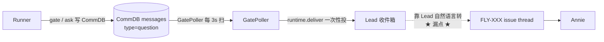
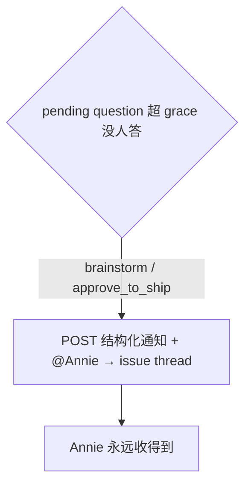
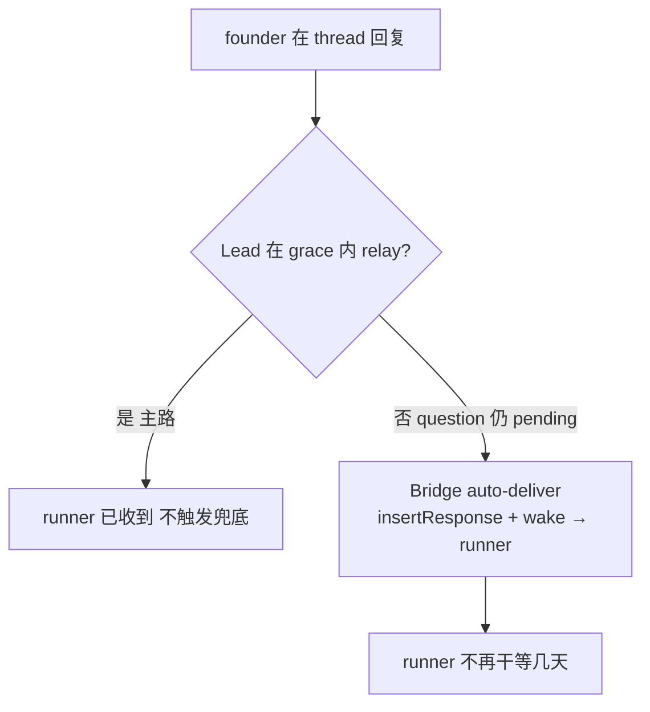

# Exploration: runner ↔ founder 决策双向可靠捅达（in-thread）— FLY-605

**Issue**: FLY-605 (Hook: 可靠把 runner 的 park / 问题 / 阶段-done 捅到 founder（in-thread）— relay 可靠性 = 对版 FLY-523)
**Date**: 2026-06-26
**Status**: Complete（brainstorm gate b2h7n3cmr 已确认方向①；方向② = Annie 加硬需求，Tadashi lead-instruction 79ceae19 直接定方向，本 doc fold 入）

---

## Problem（双向）

relay 靠 **Lead 记得 / 判断**（discipline）—— Lead 一忙 / context 满 / 被重启 bounce 就漏。这个漏点是**双向**的：

**方向①（outbound：runner → founder）**：runner 安静 park 在那等 Annie（有问题要问、或阶段性做完等批准），但该到 founder 的消息没可靠到 founder。实例（2026-06-26）：FLY-598 plan 做完了 Lead 漏了没转，Annie 看到 runner park 着却不知道它在等她。

**方向②（inbound：founder → runner，方向①的镜像）**：founder 在 [FLY-XX] thread 里答了，但 Lead 没把答复转回 runner → **runner 干等几天**（= FLY-598 那次干等的镜像）。

Annie 要**强制双向机制、不靠 Lead 自觉**（"双向 Hook"）。

**与 FLY-523 的关系**：FLY-523 概念对（自动通知 founder、不靠 Lead 自觉），但**放错地方**——把 ship-ready 通知捅进了 FLY-368 的 **alert 频道**。Annie 拒绝（alert ≠ notification：错误归 alert 频道，ready-to-ship 通知该落到对应 issue thread，她在那里当场 ship），要求全量 revert（已 revert，commit `aa5c6653`）。本条 = **同概念、放对地方（issue thread）、且补上反方向**。

---

## 现状审计（= research）

### 现有 relay 路径（discipline，会漏）

- `GatePoller`（`packages/teamlead/src/bridge/gate-poller.ts`）每 3s 扫所有 pending question（gate_question + runner_question），
  经 `runtime.deliver` 一次性投进 **Lead 收件箱**（CommDB/mailbox），用 `isLeadEventDelivered` 一次性去重。
- 然后**靠 Lead** 用自然语言转进 `[FLY-XXX]` issue thread。**Lead 漏 = 静默丢**（无任何兜底）。
- `HeartbeatService.checkAwaitingReviewTimeout()` 有个 escalation，但 **48h** 才触发——对「Lead 忘了转」这种分钟级的事太慢。

### 三类决策节点（CommDB `messages` 表，`type='question'`）

| 节点 | checkpoint | 谁该答 | 命令 |
|------|-----------|--------|------|
| (b) brainstorm gate | `"brainstorm"` | 天生 founder-bound（Lead 转 Annie 拍方向） | `gate brainstorm` |
| (c) ship gate | `"approve_to_ship"` | 天生 founder-bound（Annie 批 ship） | `gate approve_to_ship` |
| (a) runner 问题 | `NULL`（runner_question） | **大多是问 Lead 的 eng 决策** | `flywheel-comm ask --lead <id>` |

### 「没人答」的可靠信号

CommDB `getPendingQuestions(leadId)`（`packages/flywheel-comm/src/db.ts`）= 「NOT EXISTS response 行 AND `expires_at > now`」，按 `created_at ASC`。
答复（`respond`）插入 `type='response'` 行 → question **立刻掉出 pending**。
→ **「raise 后超过 N 分钟仍在 pending 列表」= 没人答 = Lead 漏转/没到 Annie 的可靠信号**。每行带 `created_at` 作 grace 判据。

### 完美先例（正确-channel，直接发 issue thread）

`packages/teamlead/src/bridge/runner-ready-to-close-notifier.ts` 的 `emitRunnerReadyToCloseNotification`：
1. **atomic claim**：`store.insertEvent({event_id: "runner-ready-to-close-<execId>"})` → SQLite UNIQUE 冲突把并发收敛到一个 winner（`claimed===false` 短路）。
2. 校验 thread + botToken（缺 → 写一条 skip 审计事件）。
3. **直接** `POST ${DISCORD_API}/channels/${thread.thread_id}/messages`（threadId 即 Discord channel id）—— **不走 alert 频道、不走 Lead runtime**。
4. skip / fail / success 各写一条审计事件。

FLY-605 的兜底 notifier 照此架构搭即可（FLY-523 的错就是没走这条、改走了 `LeadAlertNotifier` → alert 频道）。

### Thread 路由 + @mention

- `resolveChatThreadId(store, issueId, lead.chatChannel)` → thread_id（thread 在 session_started 时由 `ChatThreadCreator.ensureChatThread` 建好，Annie 已被 `addThreadMember` 加为成员）。
- thread 内发消息默认就会通知成员 Annie；**显式 `<@discordOwnerUserId>` + `allowed_mentions:{users:[id]}`** 保证 push ping（注意 ChatThreadCreator 默认 `allowed_mentions:{parse:[]}` 会屏蔽 user mention，要显式放行）。
- `config.discordOwnerUserId`（来自 `DISCORD_OWNER_USER_ID`）、`config.discordBotToken`（全局兜底 token）、`config.chatThreadsEnabled` 都已在 plugin.ts 可用；`LeadConfig.botToken` 已从 `botTokenEnv` 加载。

---

## Design — 双向双保险（brainstorm gate 确认方向① + Tadashi 定方向②）

两个方向都是同一形态：**Lead NL relay = 主（不动）+ Bridge grace 兜底 = 备（不依赖 Lead 可靠）**。兜底都在 **GatePoller 同一个 tick** 上（零新定时器，FLY-169/172 纪律）。

### 方向①（outbound：runner → founder，已确认）

某决策节点 raise 后超过 grace（默认 10 分钟）仍没人答 → Bridge 用 Lead 的 bot 把**结构化通知 + @Annie** 直接捅进对应 `[FLY-XXX]` issue thread（非 alert 频道），每节点只发一次（durable marker 去重）。

**已确认决策**：
1. **grace 兜底（不立即捅）**：~10 分钟没人答才捅 → 正常情况 Lead 秒/分钟级转 + Annie 答 → gate 解析 → 兜底从不触发，不与 Lead 转发重复刷屏。可调。
2. **Runner Hook 留 follow-up**：3 类已产生结构化 CommDB 记录，Bridge 兜底直接读够，v1 不新建 Runner Hook。
3. **节点范围 v1 = brainstorm gate + approve_to_ship gate**（天生 founder-bound）；runner_question / 普通 `question` gate 多是 runner 问 Lead 的 eng 决策（自动 @Annie 会刷她），今天无干净 founder-bound 信号 → 留 v1.1。

### 方向②（inbound：founder → runner，方向①镜像，Annie 加硬需求）

founder 在 `[FLY-XX]` thread 回复了、且该 issue 有 parked runner 带 open question → Lead relay-answer（主）+ **Bridge 在 grace 窗口内没看到 relay（question 仍 pending）就 auto-deliver founder 的 thread 回复进 runner（备，不依赖 Lead 可靠）**。

机制（复用现成基建）：
- Bridge 在 GatePoller tick 的**慢子节拍**（~60s，仿 misroute patrol 每 N tick）对「有 pending 非-gated question 的 issue」轮询其 thread 消息（复用 `RestPollDiscordInboundSource` 的 `GET /channels/{id}/messages?after=<cursor>` + baseline-on-start + cursor 模式）。
- 找到 **founder（`discordOwnerUserId`）在 question raise 之后发的消息**，且 question 仍 pending、且 `now - 回复时间 >= grace`（Lead 没在 grace 内 relay）→ **auto-deliver**：走 `respond()` 的**非-gated 写路径**（`db.insertResponse(qid, "founder-bridge-auto", <founder 回复文本>)` + `wakeRunnerMailbox` / 现有 wake best-efforts）→ runner（阻塞在 `gate` 轮询 / idle）拿到 founder 答复、解阻塞继续。
- 去重：deliver 后 response 行存在 → question 掉出 pending → 不再触发。

**🔴 安全红线（方向②，必须 Annie/Tadashi 拍）**：**ship gate（approve_to_ship）的『批准』带 merge authority**。`respond()` 对 approve_to_ship **天生 fail-closed**（必须经 Bridge founder-consent，FLY-175），且 FLY-175 红线 = 「message text NEVER carries merge authority、approval 只认 verify-approval」。所以方向② **绝不**从 scrape 的 thread 自然语言消息自动写 ship 批准。
- v1 方向② auto-deliver **只覆盖非-gated**：**brainstorm gate + runner_question**（答复让 runner 继续干活，安全）。
- **approve_to_ship 排除在 auto-deliver 之外**：它的 ship 授权仍走 verify-approval / founder-consent 路径；方向② 至多对 parked ship-runner 做「Annie 在 thread 回了」的 WAKE/提醒（不写批准）。

### Scope 边界（双向）

- **outbound**（方向①）= 通知 founder；**inbound**（方向②）= auto-deliver founder 答复给 runner。两向都仅在「Lead 漏了（grace 内没动作）」时兜底。
- 绝不走 FLY-368 alert 频道（= FLY-523 被否的错）。
- **方向② 不碰 ship 批准的 merge authority**（FLY-175）。
- 字节兼容：每向各有 env flag 默认开 / `=0` 关；缺 thread/owner/token → 干净 no-op + 审计跳过。

---

## Options considered

| 选项 | 触发点 | 结论 |
|------|--------|------|
| **A（选）** | 两向都 piggyback GatePoller tick（① 每 tick / ② 慢子节拍）+ grace + 直接读写 issue thread | ✅ 唯一统一看到全部 pending question 的地方、零新定时器、复用 ready-to-close（①）+ RestPoll/respond（②）现成基建、grace 让两向都成真·兜底 |
| B | HeartbeatService / 独立新 poller | ❌ HeartbeatService 只扫 awaiting_review 看不全 brainstorm gate；独立 poller = 新定时器，违 FLY-169/172 |
| C | 立即捅 / 立即回传（不 grace） | ❌ Tadashi 否：与 Lead 主路撞、刷屏 |
| D | 方向② 也覆盖 ship 批准 auto-deliver | ❌ 破 FLY-175 merge authority 红线 |

---

## Follow-ups（v1.1+，标出来）

- **runner→founder 问题 outbound**（方向① 节点 a）：需在 `flywheel-comm ask` 上加干净 founder-bound 标记（如 `--founder`）→ 纳入方向① 兜底。
- **ship 批准 inbound**：Annie 在 thread 直接批 ship 的结构化、经 founder-consent 的 auto-deliver（绕不开 FLY-175，需单独安全设计）。
- **Runner Hook**：runner 跑完 / park 时强制发结构化总结给 Lead。
